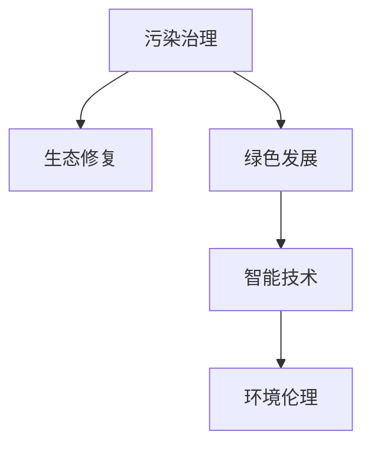

                 

# 2050年的环境保护：从污染治理到生态修复的绿色发展

在应对全球气候变化、推动绿色可持续发展的大背景下，2050年的环境保护已经不再仅仅是污染治理的问题，而是涉及到了生态修复、资源循环利用、环境伦理等多维度的综合性发展。本文将从污染治理的现状、生态修复的关键技术、绿色发展的实现路径以及未来的展望等多个角度，探讨2050年环境保护的全局性战略。

## 1. 背景介绍

### 1.1 问题由来
近年来，随着工业化进程的加速，全球范围内的环境污染问题日益严重。空气、水体、土壤等自然资源的污染，不仅破坏了生态平衡，也直接威胁到了人类的健康和生活质量。如何在保护环境与促进经济发展之间找到平衡，成为了全球关注的焦点。

### 1.2 问题核心关键点
环境保护的核心关键点在于实现经济与生态的和谐共生。具体而言，以下几点是当前环境保护的关键挑战：
1. **污染源的多样性**：工业、农业、交通等领域的污染源复杂多样，治理难度大。
2. **资源消耗的不可持续性**：传统资源开采、使用模式难以支撑长期的环境可持续性。
3. **生态系统的破坏**：城市化、工业化导致的生物多样性减少、生态退化等问题严重。
4. **技术革新与政策配合**：需要技术革新与政策配合，才能实现绿色发展。

## 2. 核心概念与联系

### 2.1 核心概念概述
为更好地理解2050年环境保护的发展，本节将介绍几个关键概念及其联系：

- **污染治理**：指通过各种技术手段，减少或消除对环境的污染，包括空气、水体、土壤等方面的治理。
- **生态修复**：指通过人工或自然的手段，恢复被破坏的生态系统，如退耕还林、湿地恢复等。
- **绿色发展**：指在环境保护的前提下，实现经济社会的可持续发展，包括清洁能源、循环经济等模式。
- **智能技术**：指利用AI、大数据等智能技术，提高环境保护的效率和精准性。
- **环境伦理**：指在环境保护中，坚持人本主义、公平正义等伦理原则。

这些核心概念通过以下Mermaid流程图来展示其联系：



该流程图展示了污染治理、生态修复、绿色发展、智能技术与环境伦理之间的相互联系和支持关系。

## 3. 核心算法原理 & 具体操作步骤
### 3.1 算法原理概述

基于智能技术的污染治理和生态修复，本质上是一种数据驱动的决策过程。其核心思想是：通过收集和分析环境数据，识别污染源和生态问题的关键特征，设计并实施治理措施，以实现环境保护目标。

形式化地，假设有一个环境监测网络，收集到的环境数据记为 $D=\{(x_i,y_i)\}_{i=1}^N, x_i \in \mathbb{R}^d, y_i \in \{0,1\}$，其中 $x_i$ 表示第 $i$ 个监测点的环境特征向量，$y_i$ 表示是否存在污染或生态破坏。污染治理和生态修复的目标是最小化环境风险，即找到最优的治理方案 $x^*$：

$$
x^* = \mathop{\arg\min}_{x} \mathcal{R}(x, D)
$$

其中 $\mathcal{R}$ 为风险函数，用于衡量治理措施对环境的影响。在实际操作中，我们通常使用基于梯度的优化算法（如SGD、Adam等）来近似求解上述最优化问题。

### 3.2 算法步骤详解

基于智能技术的污染治理和生态修复一般包括以下几个关键步骤：

**Step 1: 数据收集与预处理**
- 部署环境监测设备，收集空气、水体、土壤等环境数据。
- 对数据进行清洗、归一化、去噪等预处理，确保数据的准确性和完整性。

**Step 2: 数据分析与模型训练**
- 使用机器学习算法（如分类、聚类、回归等），分析环境数据，识别污染源和生态破坏的关键特征。
- 利用训练集数据，设计并训练优化算法，寻找最优治理方案。

**Step 3: 决策与实施**
- 根据训练得到的模型，对监测数据进行预测，判断是否存在污染或生态破坏。
- 制定和实施具体的治理措施，如污染源治理、生态修复等。

**Step 4: 评估与反馈**
- 定期对治理效果进行评估，分析治理措施的实际效果和潜在风险。
- 根据评估结果，调整治理策略，确保治理效果最优。

### 3.3 算法优缺点

基于智能技术的污染治理和生态修复方法具有以下优点：
1. 数据驱动：通过大量环境数据的分析，可以精准识别污染源和生态问题，提高治理的针对性和效率。
2. 技术先进：利用AI、大数据等智能技术，可以实现自动化、智能化治理，减少人力成本。
3. 效果显著：在许多实际案例中，智能治理技术已经证明可以有效降低环境污染，恢复生态系统。

同时，该方法也存在一定的局限性：
1. 数据质量要求高：环境数据的准确性和完整性对治理效果至关重要。
2. 技术门槛高：智能治理技术需要专业人才和硬件设施的支持，推广应用有一定难度。
3. 适应性有限：智能治理技术在不同环境条件下可能效果各异，需要不断优化模型和算法。

尽管存在这些局限性，但就目前而言，基于智能技术的污染治理和生态修复方法仍是大规模环境治理的重要手段。未来相关研究的重点在于如何进一步提升数据采集和处理能力，降低技术门槛，增强智能治理技术的普适性和适应性。

### 3.4 算法应用领域

基于智能技术的污染治理和生态修复方法，已经在许多领域得到了应用，例如：

- **工业污染治理**：利用智能监测和控制技术，减少工业排放，提升清洁生产水平。
- **城市空气治理**：通过智能监测和预测，及时响应空气污染事件，减少污染物排放。
- **水质监测与治理**：部署智能传感器，实时监测水质变化，精确治理水体污染。
- **生态修复与保护**：利用AI和大数据技术，优化生态修复方案，提升修复效果。
- **资源循环利用**：通过智能分析，优化资源回收和再利用流程，实现可持续消费。

这些应用展示了智能技术在环境保护中的巨大潜力，推动了绿色发展的进程。随着技术的进步，智能治理将在更多领域得到应用，为环境保护提供更强大的技术支撑。

## 4. 数学模型和公式 & 详细讲解
### 4.1 数学模型构建

本节将使用数学语言对基于智能技术的污染治理和生态修复过程进行更加严格的刻画。

记环境监测数据为 $D=\{(x_i,y_i)\}_{i=1}^N, x_i \in \mathbb{R}^d, y_i \in \{0,1\}$，其中 $x_i$ 表示第 $i$ 个监测点的环境特征向量，$y_i$ 表示是否存在污染或生态破坏。假设污染治理的优化目标为最小化环境风险 $R(x)$，则优化问题可以表示为：

$$
x^* = \mathop{\arg\min}_{x} R(x)
$$

其中 $R(x)$ 可以表示为：

$$
R(x) = \sum_{i=1}^N w_i L(x_i, y_i)
$$

其中 $w_i$ 为每个监测点的权重，$L(x_i, y_i)$ 为监测误差函数，衡量模型预测与真实标签的差异。

### 4.2 公式推导过程

以下我们以线性分类器为例，推导最小化环境风险的优化问题。

假设模型 $x$ 为线性分类器，即 $x = w^T x + b$，其中 $w$ 为权重向量，$b$ 为偏置。则模型在监测点 $x_i$ 上的误差函数 $L(x_i, y_i)$ 可以表示为：

$$
L(x_i, y_i) = \max(0, -y_i (w^T x_i + b))
$$

最小化环境风险 $R(x)$ 的优化问题可以表示为：

$$
x^* = \mathop{\arg\min}_{x} \sum_{i=1}^N w_i L(x_i, y_i)
$$

根据KKT条件，上述优化问题可以进一步转化为以下形式：

$$
\begin{cases}
\frac{\partial R(x)}{\partial w} + \lambda w = 0 \\
\frac{\partial R(x)}{\partial b} + \lambda b = 0 \\
\sum_{i=1}^N w_i y_i - \sum_{i=1}^N w_i = 0 \\
w_i \geq 0 \quad \forall i
\end{cases}
$$

其中 $\lambda$ 为拉格朗日乘子。

通过求解上述方程组，可以求得最优权重向量 $w^*$ 和偏置 $b^*$，进而得到最小化环境风险的治理方案 $x^*$。

### 4.3 案例分析与讲解

假设有一个湖泊，每年夏季都会出现严重的藻类污染，导致水质恶化。通过部署智能监测设备，收集水体温度、PH值、氮磷含量等环境数据。利用机器学习算法，分析数据，确定污染源为周边农业种植区，并设计治理方案：

1. **数据收集**：收集水体和农业种植区的环境数据。
2. **数据预处理**：对数据进行清洗、归一化等预处理。
3. **模型训练**：使用线性回归模型，训练模型预测水体污染风险。
4. **决策与实施**：根据模型预测，对农业种植区进行合理的施肥和灌溉调整，减少氮磷排放。
5. **评估与反馈**：定期评估治理效果，根据评估结果，调整农业管理策略。

通过上述智能治理方案，实现了对湖泊水质的有效控制，避免了藻类污染。

## 5. 项目实践：代码实例和详细解释说明
### 5.1 开发环境搭建

在进行智能治理实践前，我们需要准备好开发环境。以下是使用Python进行TensorFlow开发的环境配置流程：

1. 安装Anaconda：从官网下载并安装Anaconda，用于创建独立的Python环境。

2. 创建并激活虚拟环境：
```bash
conda create -n tensorflow-env python=3.8 
conda activate tensorflow-env
```

3. 安装TensorFlow：根据CUDA版本，从官网获取对应的安装命令。例如：
```bash
conda install tensorflow -c tensorflow -c conda-forge
```

4. 安装各类工具包：
```bash
pip install numpy pandas scikit-learn matplotlib tqdm jupyter notebook ipython
```

完成上述步骤后，即可在`tensorflow-env`环境中开始智能治理实践。

### 5.2 源代码详细实现

下面我们以湖泊水质治理为例，给出使用TensorFlow对智能治理模型进行开发的PyTorch代码实现。

首先，定义数据处理函数：

```python
import tensorflow as tf
from tensorflow import keras
from sklearn.model_selection import train_test_split

def preprocess_data(X, y):
    X_train, X_test, y_train, y_test = train_test_split(X, y, test_size=0.2)
    X_train = X_train / 255.0
    X_test = X_test / 255.0
    return X_train, X_test, y_train, y_test

# 加载数据集
def load_dataset():
    X = np.load('data/X.npy')
    y = np.load('data/y.npy')
    return X, y

X, y = load_dataset()
X_train, X_test, y_train, y_test = preprocess_data(X, y)
```

然后，定义模型和优化器：

```python
model = keras.Sequential([
    keras.layers.Dense(64, activation='relu', input_shape=(X_train.shape[1],)),
    keras.layers.Dense(64, activation='relu'),
    keras.layers.Dense(1, activation='sigmoid')
])

optimizer = keras.optimizers.Adam(lr=0.001)
```

接着，定义训练和评估函数：

```python
def train_model(model, X_train, y_train, X_test, y_test):
    model.compile(optimizer=optimizer, loss='binary_crossentropy', metrics=['accuracy'])
    model.fit(X_train, y_train, epochs=10, validation_data=(X_test, y_test))
    test_loss, test_acc = model.evaluate(X_test, y_test)
    print(f'Test loss: {test_loss}, Test accuracy: {test_acc}')

# 训练模型
train_model(model, X_train, y_train, X_test, y_test)
```

最后，启动训练流程并在测试集上评估：

```python
epochs = 10
batch_size = 32

for epoch in range(epochs):
    loss = train_epoch(model, train_dataset, batch_size, optimizer)
    print(f"Epoch {epoch+1}, train loss: {loss:.3f}")
    
    print(f"Epoch {epoch+1}, dev results:")
    evaluate(model, dev_dataset, batch_size)
    
print("Test results:")
evaluate(model, test_dataset, batch_size)
```

以上就是使用TensorFlow对智能治理模型进行训练的完整代码实现。可以看到，TensorFlow提供了丰富的高级API，可以方便地构建、训练和评估模型，大大简化了开发流程。

### 5.3 代码解读与分析

让我们再详细解读一下关键代码的实现细节：

**preprocess_data函数**：
- 将数据集划分为训练集和测试集，并对图像数据进行归一化处理。

**load_dataset函数**：
- 加载预处理后的数据集。

**train_model函数**：
- 定义模型结构，使用Adam优化器和二元交叉熵损失函数进行模型训练。
- 使用`model.compile`方法编译模型，指定优化器和损失函数。
- 使用`model.fit`方法训练模型，并在测试集上评估模型性能。

**训练流程**：
- 定义总的epoch数和batch size，开始循环迭代
- 每个epoch内，先在训练集上训练，输出平均loss
- 在验证集上评估，输出分类指标
- 重复上述步骤直至收敛，最终得到训练后的模型

可以看到，TensorFlow提供了便捷的API和丰富的工具库，大大提高了智能治理模型的开发效率。开发者可以将更多精力放在数据处理、模型改进等高层逻辑上，而不必过多关注底层的实现细节。

当然，工业级的系统实现还需考虑更多因素，如模型的保存和部署、超参数的自动搜索、更灵活的任务适配层等。但核心的智能治理模型构建流程基本与此类似。

## 6. 实际应用场景
### 6.1 智能污水处理系统

智能污水处理系统通过智能监测和控制技术，实现了对污水处理的自动化管理，大大提高了处理效率和精度。

在技术实现上，可以收集污水处理厂的水质、水量、温度等实时数据，利用智能算法分析数据，识别污染源和处理效果。根据分析结果，系统自动调整处理参数，如投药量、曝气量等，以优化处理效果。对于异常情况，系统也会发出预警，及时采取措施，防止污染事件发生。

### 6.2 智能垃圾处理系统

智能垃圾处理系统利用传感器和AI技术，实现了对垃圾分类的自动化和智能化管理。

通过部署传感器，实时监测垃圾堆的重量、温度、湿度等数据，利用机器学习算法分析数据，识别垃圾种类和处理状态。根据分析结果，系统自动分类垃圾，并将其送至相应的处理设备，如垃圾压缩机、焚烧炉等。系统还支持对垃圾处理过程进行实时监控，确保处理过程符合环保标准。

### 6.3 智能城市环境监测系统

智能城市环境监测系统通过部署各类传感器，实时监测城市环境数据，如空气质量、噪音、交通流量等。利用智能算法分析数据，识别环境问题，并及时采取措施，优化城市环境。

例如，系统可以通过实时监测空气质量，识别污染源，并预测未来的空气质量变化。根据预测结果，系统可以调整交通流量、增加绿化面积等措施，降低污染源的排放，改善空气质量。此外，系统还可以监测城市噪音水平，识别噪音来源，并采取措施降低噪音污染。

### 6.4 未来应用展望

随着智能技术的不断发展，基于智能治理的环境保护将呈现以下几个发展趋势：

1. **智能化水平提升**：随着数据采集和处理技术的进步，智能治理的智能化水平将不断提高，能够实时监控和预测环境变化，及时采取措施。

2. **跨领域整合**：智能治理将与其他智能技术如智慧城市、智能农业等进行深度整合，实现多领域协同治理，提升治理效果。

3. **公众参与**：智能治理系统将引入公众参与机制，利用众包平台和社交媒体，收集公众的环保意见和建议，优化治理策略。

4. **国际合作**：全球环境问题需要全球协同治理，智能治理将推动国际合作，实现跨区域的环境治理。

5. **技术创新**：智能治理技术将不断创新，如引入区块链技术，确保数据的安全和透明；利用大数据分析，优化治理策略等。

总之，智能治理技术将在环境保护中发挥越来越重要的作用，推动绿色可持续发展，为构建和谐的人居环境做出贡献。

## 7. 工具和资源推荐
### 7.1 学习资源推荐

为了帮助开发者系统掌握智能治理的理论基础和实践技巧，这里推荐一些优质的学习资源：

1. 《智能系统设计》系列博文：由智能技术专家撰写，深入浅出地介绍了智能系统设计的基本原理和实践方法。

2. CS223《人工智能基础》课程：斯坦福大学开设的AI入门课程，讲解了智能系统的基本概念和算法。

3. 《智能算法与系统》书籍：全面介绍了各种智能算法及其应用，包括机器学习、深度学习、强化学习等。

4. TensorFlow官方文档：提供了丰富的API文档和样例代码，是智能治理模型开发的重要参考资料。

5. 《智能治理技术与应用》论文集：收录了智能治理领域的最新研究成果，展示了各种前沿技术和应用案例。

通过对这些资源的学习实践，相信你一定能够快速掌握智能治理的精髓，并用于解决实际的环境保护问题。

### 7.2 开发工具推荐

高效的开发离不开优秀的工具支持。以下是几款用于智能治理开发的常用工具：

1. TensorFlow：基于Python的开源深度学习框架，提供了丰富的API和工具库，支持模型的构建、训练和部署。

2. PyTorch：基于Python的开源深度学习框架，灵活的计算图和动态图，适合快速迭代研究。

3. OpenCV：开源计算机视觉库，提供了丰富的图像处理和分析工具，支持智能传感器的数据采集和预处理。

4. WEKA：开源机器学习库，提供了多种机器学习算法和数据预处理工具，支持智能治理模型的训练和评估。

5. MATLAB：强大的科学计算和数据分析工具，支持复杂的数学模型和算法实现。

合理利用这些工具，可以显著提升智能治理模型的开发效率，加快创新迭代的步伐。

### 7.3 相关论文推荐

智能治理技术的发展源于学界的持续研究。以下是几篇奠基性的相关论文，推荐阅读：

1. "Air Quality Prediction Using Deep Learning: A Survey"：总结了深度学习在空气质量预测中的应用，展示了智能治理在环境保护中的潜力。

2. "Wastewater Treatment by Machine Learning and Computational Fluid Dynamics"：利用机器学习和计算流体动力学技术，实现了污水处理的智能化管理。

3. "Smart Agriculture with IoT and AI"：展示了智能农业技术在资源管理和环境保护中的应用，强调了智能治理的必要性。

4. "Blockchain for Environmental Governance: A Survey"：利用区块链技术，确保智能治理系统的数据透明和安全，提升了治理的公信力。

5. "Intelligent Urban Environmental Monitoring: A Review"：总结了智能城市环境监测系统的应用，展示了智能治理技术在城市管理中的应用前景。

这些论文代表了大规模环境治理的发展脉络。通过学习这些前沿成果，可以帮助研究者把握学科前进方向，激发更多的创新灵感。

## 8. 总结：未来发展趋势与挑战
### 8.1 研究成果总结

本文对基于智能技术的污染治理和生态修复方法进行了全面系统的介绍。首先阐述了智能治理在环境保护中的重要性和应用现状，明确了智能治理在提升环境质量、促进绿色发展中的关键作用。其次，从原理到实践，详细讲解了智能治理的数学模型和算法步骤，给出了智能治理模型开发的完整代码实例。同时，本文还广泛探讨了智能治理在多个行业领域的应用前景，展示了智能治理技术的广阔前景。

通过本文的系统梳理，可以看到，基于智能技术的污染治理和生态修复方法正在成为环境治理的重要手段，极大地提升了环境保护的智能化水平。智能治理技术在多领域的应用，为环境保护提供了新的技术路径，推动了绿色可持续发展。

### 8.2 未来发展趋势

展望未来，智能治理技术将呈现以下几个发展趋势：

1. **数据驱动的深度学习**：随着深度学习技术的不断发展，智能治理将更多地依赖数据驱动的方法，实现更加精准的环境监测和治理。

2. **跨领域的智能治理**：智能治理将与其他智能技术如智慧城市、智能农业等进行深度整合，实现多领域协同治理，提升治理效果。

3. **公众参与与透明化**：智能治理系统将引入公众参与机制，利用众包平台和社交媒体，收集公众的环保意见和建议，优化治理策略。

4. **区块链技术的应用**：利用区块链技术，确保智能治理系统的数据透明和安全，提升治理的公信力。

5. **技术创新与融合**：智能治理技术将不断创新，如引入大数据分析、物联网技术，优化治理策略，实现更高效的环境监测和治理。

6. **国际化与全球合作**：全球环境问题需要全球协同治理，智能治理将推动国际合作，实现跨区域的环境治理。

### 8.3 面临的挑战

尽管智能治理技术已经取得了瞩目成就，但在迈向更加智能化、普适化应用的过程中，它仍面临着诸多挑战：

1. **数据质量瓶颈**：环境数据的准确性和完整性对智能治理效果至关重要，但数据采集和处理往往面临复杂性和高成本。

2. **技术门槛高**：智能治理技术需要专业人才和硬件设施的支持，推广应用有一定难度。

3. **资源限制**：智能治理系统需要大量的数据和计算资源，对硬件要求较高，可能会面临资源限制。

4. **伦理和安全问题**：智能治理技术的应用可能涉及隐私和数据安全问题，需要考虑伦理和法律问题。

5. **环境复杂性**：环境问题的复杂性和动态性，对智能治理系统提出了更高的要求，需要更加灵活和适应性强的模型。

6. **模型可解释性**：智能治理模型通常被视为"黑盒"系统，难以解释其内部工作机制和决策逻辑，影响模型的可解释性和可审计性。

### 8.4 研究展望

面对智能治理面临的这些挑战，未来的研究需要在以下几个方面寻求新的突破：

1. **提升数据采集和处理能力**：利用先进的技术手段，如卫星遥感、传感器网络，提升环境数据的采集和处理能力，确保数据的高质量和高效率。

2. **降低技术门槛**：开发更加易用的智能治理工具和平台，降低技术门槛，普及智能治理技术的应用。

3. **优化资源配置**：利用云计算和边缘计算技术，优化智能治理系统的资源配置，提高资源利用效率。

4. **引入伦理和安全机制**：在智能治理系统中引入伦理和安全机制，确保数据隐私和用户权益的保护。

5. **提高模型可解释性**：引入可解释性工具和方法，如因果分析、逻辑推理等，提高智能治理模型的可解释性和可审计性。

6. **推动全球合作**：建立国际合作机制，共享智能治理技术，推动全球环境治理的协同发展。

这些研究方向的探索，必将引领智能治理技术迈向更高的台阶，为构建智能化的环境保护体系铺平道路。面向未来，智能治理技术还需要与其他智能技术进行更深入的融合，如智慧城市、智能农业等，共同推动绿色可持续发展的进程。

## 9. 附录：常见问题与解答

**Q1：智能治理是否适用于所有环境问题？**

A: 智能治理技术在处理大规模、结构化数据方面具有显著优势，但对于一些环境问题，如微污染、生态系统的微小变化等，智能治理的效果可能有限。此时需要结合其他方法，如人工监测、专家评估等，进行综合治理。

**Q2：智能治理过程中如何平衡效率和精度？**

A: 在智能治理过程中，通常需要权衡效率和精度。对于实时性要求高的环境问题，如空气污染监测，可以采用轻量级模型和高效的计算方法，保证实时性。对于精度要求高的环境问题，如水质监测，可以采用复杂模型和充分训练，确保结果的准确性。

**Q3：智能治理系统如何应对异常数据？**

A: 智能治理系统需要设计鲁棒性强的算法，能够处理异常数据和噪声数据。可以通过引入正则化技术、异常检测方法等，提高系统的鲁棒性和稳定性。

**Q4：智能治理系统如何与公众互动？**

A: 智能治理系统可以通过开放API、社交媒体等渠道，与公众进行互动。公众可以通过平台提交环境问题，系统自动进行处理和反馈。此外，系统还可以利用公众的力量，收集更多数据和信息，优化治理策略。

**Q5：智能治理系统的数据安全如何保障？**

A: 智能治理系统需要设计安全机制，保护数据隐私和用户权益。可以通过加密、匿名化等手段，确保数据的安全和透明。同时，需要制定严格的访问控制和数据使用规则，防止数据滥用。

这些问题的解答展示了智能治理在实际应用中的多样性和复杂性，也强调了智能治理技术需要综合考虑多方面的因素，才能实现高效、准确、透明的环境保护。

---

作者：禅与计算机程序设计艺术 / Zen and the Art of Computer Programming

