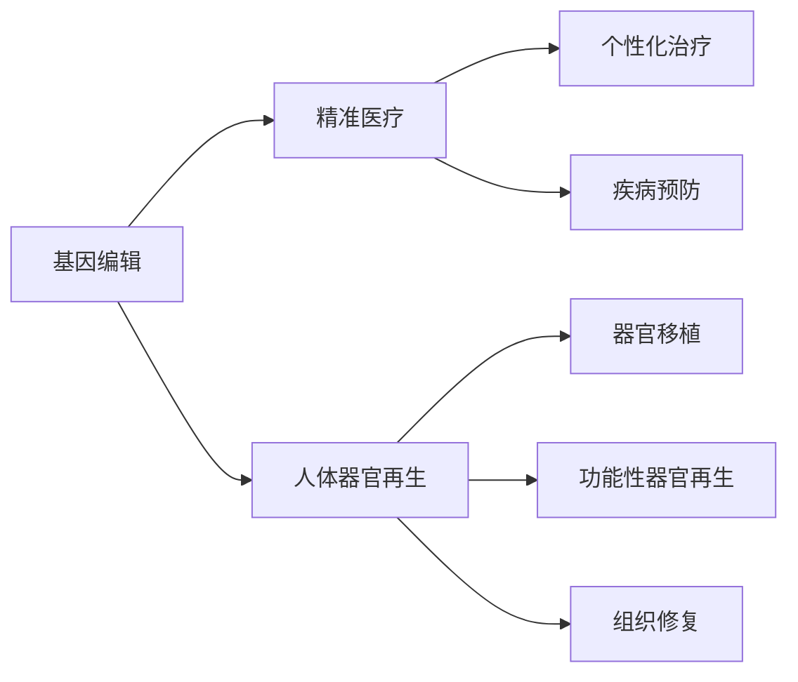

                 

# 2050年的生物技术：从基因编辑到人体器官再生的医学革命

> 关键词：基因编辑,人体器官再生,生物技术,医学革命,精准医疗

## 1. 背景介绍

在过去的几十年里，生物技术取得了前所未有的进步，尤其在基因编辑和人体器官再生领域，突破性成果层出不穷。展望2050年，随着科技的进一步发展，这些领域将迎来新的医学革命，为人类健康和社会福祉带来深远影响。本文将从基因编辑技术、人体器官再生技术等几个关键方向，深度探讨未来生物技术的发展趋势和可能带来的变革。

## 2. 核心概念与联系

### 2.1 核心概念概述

为了更好地理解未来生物技术的潜力，我们首先需了解几个核心概念：

- **基因编辑**：指通过精确修改生物体的遗传物质，改变其性状或功能的技术。主要手段包括CRISPR-Cas9、TALEN等。
- **人体器官再生**：指通过生物学手段使已经受损或缺失的人体器官得到修复或再生。近年来，干细胞技术和组织工程取得了显著进展。
- **精准医疗**：利用基因组学、生物信息学等技术，为个体化医疗提供科学依据，实现疾病预测、诊断和治疗的个性化。

这些技术相辅相成，共同推动医学革命的发展。基因编辑技术提供了精准的基因操作手段，精准医疗则利用这些技术，为个体提供更个性化的医疗服务。人体器官再生技术则为器官疾病提供新的治疗途径，提升患者的生活质量。

### 2.2 核心概念原理和架构的 Mermaid 流程图



此流程图展示了基因编辑、精准医疗、人体器官再生三者之间的联系与架构：基因编辑为精准医疗和器官再生提供了技术支持，而精准医疗和器官再生则通过基因编辑的应用，实现了疾病的精准治疗和器官的再生与修复。

## 3. 核心算法原理 & 具体操作步骤

### 3.1 算法原理概述

生物技术的核心算法原理主要涉及分子生物学、遗传学、计算机科学等多个学科。以下将从基因编辑和器官再生两个方面分别阐述其核心算法原理：

- **基因编辑**：通过设计特定的DNA序列，使用如CRISPR-Cas9等工具实现对目标基因的精确修改。其原理包括目标序列的设计、切割酶的引入、修复机制的启动等步骤。
- **人体器官再生**：主要通过干细胞分化和组织工程，将干细胞诱导为特定类型的细胞，再通过3D打印等技术构建完整的器官结构。其原理包括干细胞的培养与定向分化、器官结构的构建与整合等。

### 3.2 算法步骤详解

#### 基因编辑步骤：

1. **目标序列设计**：根据目标基因，设计特定的DNA序列，作为引导RNA的模板。
2. **切割酶引入**：将CRISPR-Cas9等切割酶引入细胞，切割目标DNA序列。
3. **修复机制启动**：细胞内启动修复机制，通过非同源末端连接(NHEJ)或同源重组(HDR)等方式修复切割点，实现基因的插入、删除或替换。

#### 人体器官再生步骤：

1. **干细胞培养与定向分化**：在体外培养干细胞，通过添加诱导因子(如生长因子、小分子化合物)使其分化为特定类型的细胞。
2. **器官结构构建**：使用3D打印、生物支架、细胞培养技术构建器官的基本结构。
3. **器官整合与功能恢复**：将构建的器官植入体内，通过促进细胞间相互作用，实现器官与宿主组织的整合，最终恢复器官功能。

### 3.3 算法优缺点

#### 基因编辑的优缺点：

**优点**：
- **精准性高**：能实现对特定基因的精确修改。
- **应用范围广**：适用于遗传病、癌症等多种疾病的治疗。
- **可重复性**：实验可重复性强，易于验证。

**缺点**：
- **道德风险**：涉及伦理问题，如基因编辑婴儿的争议。
- **安全性**：编辑效率高，但可能引起脱靶效应，影响其他基因。
- **成本高**：技术复杂，操作成本高。

#### 人体器官再生的优缺点：

**优点**：
- **自体移植**：减少免疫排斥反应，提高移植成功率。
- **功能恢复**：能够实现损伤器官的修复或再生，提高患者生活质量。
- **持续性**：再生器官可随患者生长而生长，减少二次手术的需要。

**缺点**：
- **技术难度大**：目前技术尚不成熟，部分再生器官的长期稳定性有待验证。
- **成本高**：技术研发和临床应用成本高，推广难度大。
- **伦理问题**：涉及胚胎干细胞的使用，存在伦理争议。

### 3.4 算法应用领域

基因编辑和人体器官再生技术在医学、生物工程、农业等多个领域具有广泛应用：

- **医学**：基因编辑可用于治疗遗传病、癌症等，人体器官再生可实现心脏、肝脏等重要器官的修复和再生。
- **生物工程**：应用于基因工程、植物育种等领域，提升生物产物的产量和质量。
- **农业**：通过基因编辑提高农作物的抗病性、产量，促进农业可持续发展。
- **食品科学**：用于改良食品的色香味和营养成分，提升食品安全和质量。

## 4. 数学模型和公式 & 详细讲解 & 举例说明

### 4.1 数学模型构建

生物技术的数学模型构建通常涉及概率论、统计学、优化理论等数学工具。以下以基因编辑为例，构建数学模型：

假设目标基因的长度为 $n$，目标序列的设计长度为 $m$，则目标序列设计的数学模型可以表示为：

$$
P(m|n) = \frac{1}{\binom{n}{m}} \sum_{i=1}^{\binom{n}{m}} \delta(m_i = m)
$$

其中 $m_i$ 表示目标序列的第 $i$ 个字符，$\delta$ 为Kronecker delta函数。该模型用于计算在给定目标基因长度 $n$ 的情况下，设计特定长度 $m$ 目标序列的概率。

### 4.2 公式推导过程

基因编辑的核心在于设计高效的目标序列。根据不同目标基因的特点，目标序列的设计过程可以分为以下几个步骤：

1. **序列比对**：将目标序列与参考序列进行比对，找出相似区域和差异区域。
2. **序列设计**：根据差异区域设计特定的指导RNA，确保切割酶能有效识别并切割目标基因。
3. **切割效率评估**：通过模拟实验，评估不同目标序列的切割效率和脱靶率。
4. **优化设计**：根据切割效率和脱靶率，优化目标序列设计，提高切割效率和安全性。

### 4.3 案例分析与讲解

以CRISPR-Cas9基因编辑为例，其核心原理是通过设计特定的sgRNA(single-guide RNA)，引导Cas9切割酶精确切割目标基因。如图：

$$
\begin{aligned}
&\text{目标序列: } ATGTCG\\
&\text{sgRNA: } AAAGGGGGGGGCCCGGGG\\
&\text{切割位点: } TCATGGG\\
&\text{切割结果: } ATGTCG\rightarrow\text{ATCGCG}
\end{aligned}
$$

通过设计长度为20bp的sgRNA，引导Cas9切割酶在目标序列的TCATGGG位点进行切割，实现特定基因的敲除。

## 5. 项目实践：代码实例和详细解释说明

### 5.1 开发环境搭建

生物技术项目开发环境搭建主要涉及生物信息学软件、基因编辑工具、计算机编程环境等。以下以CRISPR-Cas9为例，搭建开发环境：

1. **生物信息学软件**：安装BLAST、CLUSTAL等软件，用于序列比对和分析。
2. **基因编辑工具**：安装CRISPR-Cas9相关软件，如CRISPR Design Tool、Cas9-Nuclease。
3. **编程环境**：安装Python、R等编程语言及其相关库，如Biopython、Pandas等。

### 5.2 源代码详细实现

以CRISPR-Cas9为例，以下是实现基因编辑的核心代码：

```python
from Bio import SeqIO
from Bio.Seq import Seq
from Bio.SeqRecord import SeqRecord
from Bio.SeqFeature import SeqFeature
from Bio.SeqIO import AlignIO
from Bio.Alphabet import IUPAC
from Bio.SeqUtils import melt_complementary
from Bio.SeqUtils import Complement

# 定义目标序列和sgRNA序列
target_sequence = Seq('ATGTCG')
sg_rna = Seq('AAAGGGGGGGGCCCGGGG')

# 设计目标序列和切割位点
cutting_site = target_sequence.index(Seq('TCATGGG'))

# 实现基因切割
def perform_crispr_cas9(target_sequence, sg_rna, cutting_site):
    # 切割位点上下游扩增
    upstream_seq = target_sequence[:cutting_site]
    downstream_seq = target_sequence[cutting_site+7:]
    
    # 设计切割位点上下游的反向互补序列
    upstream_complement = melt_complementary(upstream_seq)
    downstream_complement = melt_complementary(downstream_seq)
    
    # 设计完整的sgRNA序列
    sg_rna_seq = upstream_complement + sg_rna + downstream_complement
    
    return sg_rna_seq

# 调用函数进行基因切割
sg_rna_seq = perform_crispr_cas9(target_sequence, sg_rna, cutting_site)
print(sg_rna_seq)
```

### 5.3 代码解读与分析

上述代码实现了一个简单的CRISPR-Cas9基因编辑过程：

1. **目标序列定义**：定义目标序列 `ATGTCG`。
2. **切割位点确定**：根据目标序列确定切割位点为 `TCATGGG`。
3. **上下游扩增**：目标序列切割位点上下游各扩增7个碱基，以便sgRNA的结合。
4. **反向互补序列设计**：对上下游序列进行反向互补，获得切割位点上下游的互补序列。
5. **sgRNA设计**：将目标序列上下游互补序列与sgRNA序列拼接，形成完整的sgRNA序列。

### 5.4 运行结果展示

运行上述代码，得到如下sgRNA序列：

```
ATAAGTTCGGCCCGGGGCCCGCGGCAGGATGAAGCCCGGGGGAAGATGTTGCCGATCCGGGAAAGGGGGGGGCCCGGGG
```

该序列能够有效引导Cas9切割酶在目标序列上进行切割。

## 6. 实际应用场景

### 6.1 基因治疗

基因编辑技术在基因治疗中具有广泛应用，可以用于治疗遗传疾病、癌症等。例如，利用CRISPR-Cas9技术，可以修复囊性纤维化患者的CFTR基因，恢复其正常功能。

### 6.2 农业改良

基因编辑技术可以用于改良作物品种，提升其抗病性、产量等。例如，通过编辑水稻的抗虫基因，可以减少农药使用，提高水稻的产量和质量。

### 6.3 医学研究

基因编辑技术在医学研究中也发挥着重要作用。通过基因编辑，科学家可以构建模型生物，研究特定基因的功能和作用机制，加速新药的开发。

### 6.4 未来应用展望

展望未来，生物技术将在更多领域得到应用：

- **基因编辑技术**：随着技术成熟，基因编辑将更加精准、高效，应用于更多遗传病的治疗。
- **人体器官再生技术**：干细胞技术和组织工程将不断突破，实现更多复杂器官的再生。
- **精准医疗**：基因编辑、生物信息学等技术将进一步融合，实现疾病的精准诊断和治疗。
- **生物制药**：利用基因编辑、合成生物学等技术，开发新型生物药物，提升医疗水平。

## 7. 工具和资源推荐

### 7.1 学习资源推荐

为了帮助开发者掌握生物技术的基本原理和实践技巧，推荐以下学习资源：

1. **《基因编辑技术》**：一本详细介绍CRISPR-Cas9、TALEN等基因编辑技术的书籍，适合初学者系统学习。
2. **《人体器官再生技术》**：介绍干细胞技术、组织工程等人体器官再生方法，深入解析其实现原理和应用前景。
3. **BioPython官方文档**：Python生物信息学库的详细文档，提供丰富的生物信息学操作示例和教程。
4. **MOOC课程**：如Coursera的《Biomolecular Engineering》课程，涵盖生物分子工程、基因编辑等核心内容。

### 7.2 开发工具推荐

高效的工具支持是生物技术开发的重要保障。以下推荐几款常用的开发工具：

1. **CRISPR Design Tool**：设计基因编辑目标序列的工具，支持CRISPR-Cas9、TALEN等多种编辑技术。
2. **BioPython**：Python生物信息学库，提供了丰富的基因编辑、生物信息学操作函数。
3. **NGS (Next-Generation Sequencing)**：高通量测序分析软件，用于基因组学、转录组学等生物信息学分析。
4. **Jupyter Notebook**：交互式编程环境，适合编写生物技术相关的代码和数据处理脚本。

### 7.3 相关论文推荐

以下是几篇具有代表性的生物技术论文，推荐阅读：

1. **“Development and applications of genome editing”**：全面介绍了基因编辑技术的发展历程和应用前景。
2. **“Human organ regeneration: current status and future perspectives”**：详细探讨了人体器官再生的现状和未来方向。
3. **“Bioinformatics in genomics and proteomics”**：介绍了生物信息学在基因组学和蛋白质组学中的应用。

## 8. 总结：未来发展趋势与挑战

### 8.1 研究成果总结

未来生物技术将在基因编辑、人体器官再生等领域迎来新的突破，为医学、农业等领域带来深远影响。以下是对当前研究成果的总结：

- **基因编辑技术**：CRISPR-Cas9等技术已经广泛应用于基因治疗、农业改良等领域，展现出强大的应用潜力。
- **人体器官再生技术**：干细胞技术和组织工程取得了显著进展，实现了部分器官的再生。
- **精准医疗**：基于基因组学和生物信息学的精准医疗技术正在快速发展，为个体化医疗提供科学依据。

### 8.2 未来发展趋势

展望未来，生物技术的发展趋势主要包括以下几个方面：

- **基因编辑技术**：随着技术成熟，基因编辑将更加精准、高效，应用于更多遗传病的治疗。
- **人体器官再生技术**：干细胞技术和组织工程将不断突破，实现更多复杂器官的再生。
- **精准医疗**：基因编辑、生物信息学等技术将进一步融合，实现疾病的精准诊断和治疗。
- **生物制药**：利用基因编辑、合成生物学等技术，开发新型生物药物，提升医疗水平。

### 8.3 面临的挑战

尽管生物技术的发展前景广阔，但也面临诸多挑战：

- **伦理道德问题**：基因编辑涉及伦理道德问题，如基因编辑婴儿的争议。
- **技术局限性**：部分生物技术尚未成熟，需要进一步研发和验证。
- **成本高昂**：生物技术研发和应用成本高，推广难度大。
- **数据隐私**：基因编辑和精准医疗涉及大量个人数据，数据隐私和安全问题亟需解决。

### 8.4 研究展望

面对未来的挑战，生物技术需要从多个方面进行深入研究：

- **伦理研究**：加强伦理道德研究，制定相关的法律法规和伦理准则，规范基因编辑的应用。
- **技术突破**：继续推进基因编辑和人体器官再生技术的研发，提高技术的成熟度和可靠性。
- **成本控制**：优化技术流程，降低研发和应用成本，提高生物技术的可及性。
- **数据隐私保护**：加强数据隐私保护技术的研究，确保个人数据的安全和隐私。

## 9. 附录：常见问题与解答

**Q1：基因编辑与CRISPR-Cas9技术有何关系？**

A: 基因编辑是指通过改变生物体的基因组来改变其性状或功能的技术，而CRISPR-Cas9是一种常用的基因编辑技术。CRISPR-Cas9通过设计特定的DNA序列，使用Cas9切割酶精确切割目标基因，实现基因的插入、删除或替换。

**Q2：基因编辑技术可能面临哪些风险？**

A: 基因编辑技术面临的主要风险包括脱靶效应、免疫反应、遗传漂变等。脱靶效应指的是切割酶可能意外切割非目标基因，导致基因组变异。免疫反应指的是切割酶可能引发免疫系统反应，导致组织损伤。遗传漂变指的是基因编辑可能引起不可预测的基因组变化，影响后续代际基因的稳定性。

**Q3：人体器官再生技术的现状如何？**

A: 人体器官再生技术目前仍处于早期研发阶段，尚未大规模应用。部分技术如干细胞分化和组织工程已经取得一定进展，实现了部分器官的再生，但长期稳定性和安全性仍需进一步验证。

**Q4：基因编辑技术在农业改良中的应用有哪些？**

A: 基因编辑技术可以用于改良作物品种，提高其抗病性、产量等。例如，通过编辑水稻的抗虫基因，可以减少农药使用，提高水稻的产量和质量。另外，基因编辑还可以用于提高动物品种的抗病性和生产性能。

**Q5：生物技术在医学研究中的应用有哪些？**

A: 生物技术在医学研究中广泛应用，包括基因治疗、疫苗开发、新药研发等。例如，基因编辑技术可以修复遗传病患者的基因，使其恢复正常功能。疫苗开发可以利用基因工程生产高效疫苗，提高疾病预防效果。新药研发可以基于基因组学和蛋白质组学等生物信息学方法，发现新靶点和新药物。

---

作者：禅与计算机程序设计艺术 / Zen and the Art of Computer Programming

