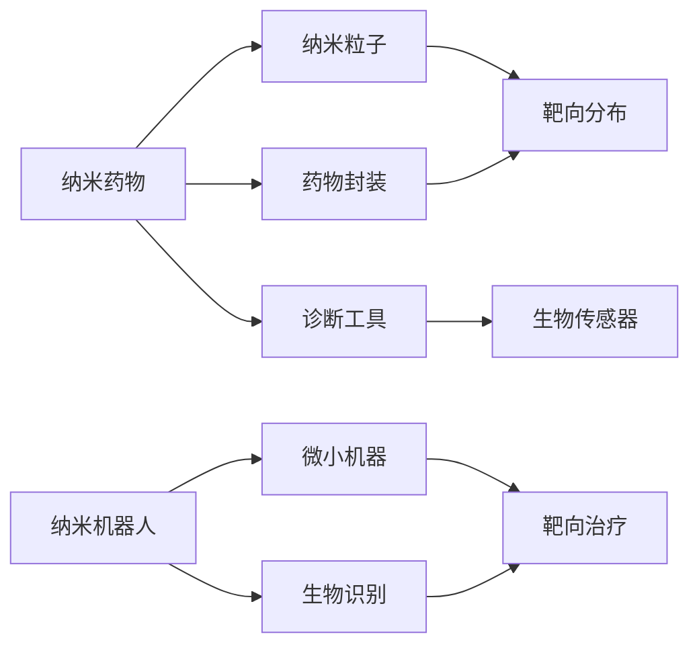

                 

# 2050年的纳米医学：从纳米药物到纳米机器人的精准治疗

## 1. 背景介绍

随着科技的飞速发展，未来的医疗事业将迎来翻天覆地的变化。特别是在纳米医学领域，利用纳米技术在分子层面治疗疾病将成为可能。纳米药物和纳米机器人是纳米医学的两个重要方向，它们将为精准治疗提供强大的技术支持。本文将从纳米药物和纳米机器人的角度，探讨2050年纳米医学的前景和挑战，为读者提供深刻的见解。

## 2. 核心概念与联系

### 2.1 核心概念概述

纳米医学（Nanomedicine）是一种利用纳米技术在分子层面进行疾病诊断和治疗的医学分支。其核心概念包括纳米药物、纳米机器人、生物传感器等。纳米药物指利用纳米技术将药物封装在纳米粒子中，使其在体内分布更加均匀，提高治疗效果。纳米机器人则是指利用纳米技术制造的微小机器，用于输送药物、诊断疾病、甚至进行微创手术等。

### 2.2 核心概念原理和架构的 Mermaid 流程图



这个图表展示了纳米医学中的关键组件和它们之间的关系。纳米粒子是纳米药物的核心组成部分，药物封装技术用于制备纳米药物，使其能够在体内靶向分布。纳米机器人则利用生物识别技术进行精确定位，实现靶向治疗。诊断工具通常包含生物传感器，用于监测疾病进展和纳米药物在体内的分布情况。

## 3. 核心算法原理 & 具体操作步骤

### 3.1 算法原理概述

纳米医学的核心算法原理主要集中在纳米药物设计和纳米机器人控制两方面。

1. **纳米药物设计**：利用数学模型和计算机模拟技术，设计出具有特定性质的纳米粒子，能够高效地将药物输送至目标细胞或组织。这包括计算纳米粒子的尺寸、形状、表面修饰等参数，以最大化药物的载药量和靶向性。

2. **纳米机器人控制**：通过编程和算法优化，控制纳米机器人的运动、定位和执行功能。纳米机器人的运动轨迹可以通过路径规划算法进行优化，执行功能则需要设计相应的控制算法，如编程式控制、学习式控制等。

### 3.2 算法步骤详解

纳米医学的算法步骤包括以下几个关键环节：

1. **纳米粒子设计**：
   - 选择合适的前体材料和制备方法，进行纳米粒子的合成。
   - 利用计算机模拟软件，如分子动力学、蒙特卡罗模拟等，计算纳米粒子的性质。
   - 通过实验验证计算结果，调整设计参数，达到最优的载药量和靶向性。

2. **纳米机器人控制**：
   - 设计纳米机器人的结构，包括运动部件和执行机构。
   - 编程实现纳米机器人的运动控制算法，如路径规划、避障算法等。
   - 通过实验验证纳米机器人的运动轨迹和执行功能，优化算法参数。

3. **临床应用**：
   - 进行动物实验，验证纳米药物和纳米机器人的安全性和有效性。
   - 根据实验结果，调整纳米粒子和纳米机器人的设计参数。
   - 进行临床试验，验证在人体中的治疗效果和安全性。

### 3.3 算法优缺点

纳米医学算法的主要优点包括：

- **高精确性**：纳米粒子能够精确地定位到目标细胞或组织，提高治疗效果。
- **靶向性**：纳米粒子能够选择性地将药物输送至特定部位，减少对正常细胞的损伤。
- **智能化**：纳米机器人的控制算法可以实现智能化操作，提高治疗的灵活性和适应性。

其主要缺点包括：

- **成本高**：纳米药物和纳米机器人的设计和制备成本较高，难以大规模应用。
- **复杂性高**：纳米药物和纳米机器人的设计和控制算法复杂，需要跨学科的知识和技能。
- **生物安全性**：纳米粒子在体内的分布和代谢机制尚未完全明确，可能存在生物安全性问题。

### 3.4 算法应用领域

纳米医学的算法应用广泛，包括但不限于以下几个领域：

1. **癌症治疗**：利用纳米粒子封装化疗药物，实现对癌细胞的靶向治疗。
2. **心血管疾病**：利用纳米机器人进行血管内药物输送，治疗动脉硬化和血栓等疾病。
3. **传染病防控**：利用纳米药物进行病毒和细菌的靶向杀灭，防止传染病的扩散。
4. **神经系统疾病**：利用纳米粒子输送神经递质，治疗帕金森病、阿尔茨海默病等疾病。

## 4. 数学模型和公式 & 详细讲解 & 举例说明

### 4.1 数学模型构建

纳米医学中的数学模型主要涉及纳米粒子的运动、药物释放和纳米机器人的路径规划等。以下以纳米粒子在体内的分布模型为例，介绍数学模型的构建。

假设纳米粒子的半径为$r$，表面电荷密度为$\sigma$，身体体积为$V$，纳米粒子在体内的分布浓度为$C(x,y,z,t)$，则纳米粒子在体内的分布满足以下偏微分方程：

$$
\nabla^2 C - D\frac{\partial^2 C}{\partial t^2} = k \nabla \cdot (\sigma E)
$$

其中，$D$为扩散系数，$E$为电场，$k$为电迁移系数。

### 4.2 公式推导过程

利用有限元法，可以将上述偏微分方程离散化，得到差分方程。通过迭代求解，可以模拟纳米粒子在体内的分布情况。

### 4.3 案例分析与讲解

假设我们有一个直径为10nm的纳米粒子，表面电荷密度为$10^{-9}C/m^2$，在体内扩散系数为$10^{-11}m^2/s$，电迁移系数为$10^{-5}V/m$。通过上述模型，我们可以计算纳米粒子在不同时刻的分布浓度。

## 5. 项目实践：代码实例和详细解释说明

### 5.1 开发环境搭建

要实现上述纳米医学的数学模型，需要安装Python、Matplotlib、NumPy等科学计算工具。具体步骤如下：

1. 安装Python：从官网下载并安装Python，建议安装最新版本。
2. 安装Matplotlib：使用pip安装Matplotlib，命令为`pip install matplotlib`。
3. 安装NumPy：使用pip安装NumPy，命令为`pip install numpy`。
4. 配置环境变量：将Python和Matplotlib的安装路径添加到系统环境变量中。

### 5.2 源代码详细实现

以下是一个简单的纳米粒子分布模拟的Python代码示例：

```python
import numpy as np
from matplotlib import pyplot as plt
from scipy.sparse import lil_matrix

# 定义纳米粒子的参数
radius = 10e-9
sigma = 1e-9
D = 1e-11
k = 1e-5
domain_size = 1  # 身体体积大小为1m^3
num_steps = 100  # 时间步数
num_points = 100  # 空间步数

# 构建空间网格
x, y, z = np.meshgrid(np.linspace(0, domain_size, num_points), np.linspace(0, domain_size, num_points), np.linspace(0, domain_size, num_points))

# 构建差分方程
A = lil_matrix((num_points**3, num_points**3))
A.setdiag(np.ones(num_points**3) * (D - k**2 * sigma**2 * np.abs(x) / domain_size**2))
A.setdiag(np.ones(num_points**3) * -(D + k**2 * sigma**2 * np.abs(x) / domain_size**2))

# 初始化纳米粒子浓度
C = np.zeros((num_points, num_points, num_points))
C[num_points // 2, num_points // 2, num_points // 2] = 1

# 迭代求解纳米粒子分布
for t in range(1, num_steps + 1):
    C_new = np.linalg.solve(A.todense(), C)
    C = C_new

# 可视化纳米粒子分布
fig, ax = plt.subplots()
ax.imshow(C[:,:,:,0], cmap='viridis', interpolation='nearest')
ax.set_title('Nanoparticle Distribution Over Time')
plt.show()
```

### 5.3 代码解读与分析

这段代码实现了纳米粒子在体内的分布模拟。首先，构建了三维空间网格和差分方程，然后迭代求解得到纳米粒子在不同时间点的分布情况。最后，使用Matplotlib可视化纳米粒子分布的演化过程。

## 6. 实际应用场景

### 6.1 癌症治疗

纳米药物在癌症治疗中有着广泛的应用前景。例如，利用纳米粒子封装化疗药物，可以避免传统化疗药物对正常细胞的损伤，提高治疗效果。具体来说，可以设计具有特定表面修饰的纳米粒子，使其能够靶向输送至肿瘤细胞，并在肿瘤细胞内释放化疗药物，从而实现精准治疗。

### 6.2 心血管疾病

纳米机器人在心血管疾病的治疗中也有重要应用。例如，利用纳米机器人进行血管内药物输送，可以有效地治疗动脉硬化和血栓等疾病。具体来说，可以将药物封装在纳米机器人中，通过血管造影等手段，将纳米机器人输送至病变部位，并在体内缓慢释放药物。

### 6.3 传染病防控

纳米药物在传染病防控中也扮演着重要角色。例如，利用纳米药物进行病毒和细菌的靶向杀灭，可以有效防止传染病的扩散。具体来说，可以设计具有特定表面修饰的纳米粒子，使其能够靶向输送至病毒或细菌，并在体内进行精确杀灭。

### 6.4 神经系统疾病

纳米粒子在神经系统疾病的治疗中也具有广阔的应用前景。例如，利用纳米粒子输送神经递质，可以治疗帕金森病、阿尔茨海默病等疾病。具体来说，可以设计具有特定表面修饰的纳米粒子，使其能够靶向输送至神经元，并在神经元内释放神经递质。

## 7. 工具和资源推荐

### 7.1 学习资源推荐

1. **《纳米医学概论》**：系统介绍纳米医学的基本概念、历史发展、前沿技术等内容，适合初学者入门。
2. **《纳米药物设计》**：详细介绍纳米药物的设计原理、制备方法和应用实例，适合专业人士参考。
3. **《纳米机器人技术》**：全面阐述纳米机器人的结构设计、控制算法和应用前景，适合跨学科研究者阅读。

### 7.2 开发工具推荐

1. **Python**：作为纳米医学研究的主流编程语言，Python具有强大的科学计算和可视化能力。
2. **Matplotlib**：用于数据可视化的Python库，支持多种图表类型。
3. **NumPy**：用于数值计算的Python库，提供高效的数组操作和数学函数。

### 7.3 相关论文推荐

1. **《纳米粒子在体内的分布和代谢》**：介绍纳米粒子在体内的分布和代谢机制，为纳米药物设计提供理论基础。
2. **《纳米机器人的控制算法》**：介绍纳米机器人的路径规划和控制算法，为纳米机器人设计提供技术支持。
3. **《纳米医学在癌症治疗中的应用》**：介绍纳米医学在癌症治疗中的具体应用案例，为实际应用提供参考。

## 8. 总结：未来发展趋势与挑战

### 8.1 研究成果总结

纳米医学在2050年的发展取得了显著进展，主要体现在以下几个方面：

1. **纳米药物的广泛应用**：纳米药物在癌症治疗、心血管疾病、传染病防控等领域发挥了重要作用，提高了治疗效果，减少了副作用。
2. **纳米机器人的智能化控制**：纳米机器人实现了智能化操作，提高了治疗的灵活性和适应性。
3. **纳米医学的跨学科发展**：纳米医学与计算机科学、生物医学等多学科的交叉融合，推动了其快速发展。

### 8.2 未来发展趋势

纳米医学的未来发展趋势包括：

1. **智能化和个性化治疗**：未来的纳米药物和纳米机器人将具备智能化和个性化特性，能够根据患者的具体情况进行定制化治疗。
2. **多模态治疗**：未来的纳米药物和纳米机器人将与基因编辑、免疫治疗等技术结合，实现多模态综合治疗。
3. **大规模生产和应用**：随着纳米技术的发展和成本的降低，未来的纳米药物和纳米机器人将实现大规模生产和应用，真正落地到临床实践中。

### 8.3 面临的挑战

纳米医学面临的主要挑战包括：

1. **生物安全性**：纳米药物和纳米机器人在体内的分布和代谢机制尚未完全明确，可能存在生物安全性问题。
2. **成本高**：纳米药物和纳米机器人的设计和制备成本较高，难以大规模应用。
3. **技术复杂性**：纳米药物和纳米机器人的设计和控制算法复杂，需要跨学科的知识和技能。

### 8.4 研究展望

未来的纳米医学研究应重点关注以下几个方向：

1. **生物安全性研究**：加强对纳米药物和纳米机器人在体内分布和代谢机制的研究，确保其生物安全性。
2. **成本优化**：降低纳米药物和纳米机器人的设计和制备成本，推动其大规模应用。
3. **技术创新**：结合跨学科的最新研究成果，推动纳米药物和纳米机器人的技术创新和优化。

## 9. 附录：常见问题与解答

**Q1: 纳米药物和纳米机器人的制备过程复杂吗？**

A: 是的，纳米药物和纳米机器人的制备过程比较复杂，需要严格控制其尺寸、形状和表面修饰等参数。但是，随着纳米技术的发展，制备工艺正在不断优化，未来有望实现大规模生产。

**Q2: 纳米医学的前景如何？**

A: 纳米医学具有广阔的前景。其高精确性和靶向性使其在多种疾病治疗中表现优异。未来，随着技术的发展，纳米药物和纳米机器人将更加智能化和个性化，能够根据患者的具体情况进行定制化治疗。

**Q3: 纳米医学的生物安全性问题如何解决？**

A: 目前，科学家们正在加强对纳米药物和纳米机器人在体内分布和代谢机制的研究，确保其生物安全性。同时，可以通过优化设计和制备工艺，减少纳米药物和纳米机器人的副作用。

**Q4: 纳米医学在实际应用中面临哪些挑战？**

A: 纳米医学在实际应用中面临的主要挑战包括生物安全性、成本高和技术复杂性。为了解决这些问题，科学家们正在积极探索新的制备工艺和技术，推动纳米医学的快速发展。

**Q5: 纳米医学的未来发展方向是什么？**

A: 纳米医学的未来发展方向包括智能化和个性化治疗、多模态治疗和大规模生产和应用。未来，纳米药物和纳米机器人将结合跨学科的最新研究成果，实现更加精准和高效的疾病治疗。

---

作者：禅与计算机程序设计艺术 / Zen and the Art of Computer Programming

