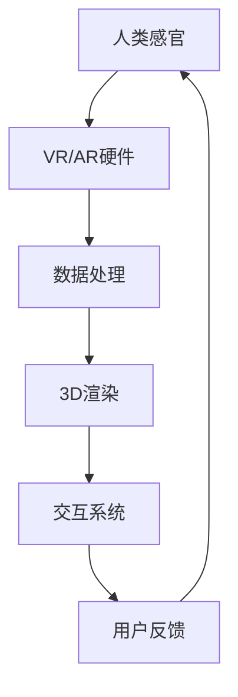

                 

# 2050年的虚拟现实：从全感官沉浸到虚拟世界构建的VR/AR进化

## 1. 背景介绍

在21世纪，虚拟现实(Virtual Reality, VR)和增强现实(Augmented Reality, AR)技术迅速发展，为我们打开了全感官沉浸式体验的大门。而随着技术的不断进步，2050年的虚拟现实将变得更为先进和普及，我们将有机会构建一个真正意义上的虚拟世界，为人类社会带来前所未有的变革。

本文将从全感官沉浸、虚拟世界构建、技术发展等几个维度，深入探讨2050年虚拟现实和增强现实的进化路径，以及这一变革对未来的深远影响。

## 2. 核心概念与联系

### 2.1 核心概念概述

VR和AR技术的核心在于创建或增强一个与现实世界平行的数字化三维环境，通过头戴显示器、交互设备等硬件，将数字信息直观地呈现给用户，使用户能够与之互动。

### 2.2 核心概念原理和架构的 Mermaid 流程图



该图展示了VR/AR技术的基本架构：

1. **人类感官**：指用户的视觉、听觉、触觉等感知器官，是虚拟体验的基础。
2. **VR/AR硬件**：包括头显、手柄、传感器等设备，负责捕捉用户动作和环境数据。
3. **数据处理**：包括传感器数据融合、用户动作预测等，保证虚拟场景与用户动作的同步。
4. **3D渲染**：使用高性能GPU渲染虚拟场景，提供真实感强的视觉体验。
5. **交互系统**：利用计算机视觉、自然语言处理等技术，实现用户与虚拟环境之间的交互。
6. **用户反馈**：用户的动作、表情、声音等反馈信息被实时捕捉，用于优化虚拟体验。

## 3. 核心算法原理 & 具体操作步骤

### 3.1 算法原理概述

VR/AR的核心算法包括图像处理、三维建模、传感器数据融合、用户动作预测等。这些算法共同作用，构建了一个沉浸式的虚拟环境，使用户能够与之互动。

### 3.2 算法步骤详解

#### 3.2.1 图像处理

图像处理是VR/AR中最基础的一环，涉及图像捕捉、图像渲染、图像融合等过程。图像捕捉使用相机、深度传感器等设备，捕捉用户的动作和环境信息。图像渲染使用图形处理器GPU，生成逼真的三维图像。图像融合将虚拟图像与真实环境图像叠加，实现增强现实效果。

#### 3.2.2 三维建模

三维建模是创建虚拟环境的核心步骤，涉及几何建模、纹理映射、光照计算等技术。几何建模创建三维模型，纹理映射添加细节，光照计算增强真实感。

#### 3.2.3 传感器数据融合

传感器数据融合是VR/AR的关键技术之一，通过融合来自多种传感器的数据，提高环境的感知能力和预测精度。例如，融合位置传感器、陀螺仪、加速度计数据，实现更精准的用户动作预测。

#### 3.2.4 用户动作预测

用户动作预测是实现全感官沉浸的关键，通过机器学习算法，预测用户的下一步动作，生成对应的虚拟环境变化。例如，预测用户行走方向，生成道路变化，提升沉浸感。

### 3.3 算法优缺点

#### 3.3.1 优点

1. **沉浸式体验**：VR/AR技术能够提供比传统媒介更真实的感官体验，使用户身临其境。
2. **交互性增强**：通过手势、语音、脑波等交互方式，提升用户体验。
3. **应用广泛**：覆盖教育、医疗、娱乐等多个领域，具有广泛的应用前景。

#### 3.3.2 缺点

1. **成本高**：VR/AR设备、内容制作和维护成本较高，限制了普及度。
2. **技术门槛高**：需要较高的技术水平和研发投入，中小企业难以承担。
3. **体验限制**：受限于硬件和软件技术，某些体验效果仍不理想。

### 3.4 算法应用领域

#### 3.4.1 教育培训

VR/AR技术在教育培训中的应用极为广泛，能够提供沉浸式学习体验，增强学生的学习兴趣和效果。例如，通过虚拟实验室、虚拟场景模拟等方式，提升教学质量。

#### 3.4.2 医疗健康

VR/AR技术在医疗健康领域也有广泛应用，能够辅助医生进行手术模拟、患者康复训练等。例如，通过虚拟手术台进行手术练习，提升手术技能。

#### 3.4.3 娱乐休闲

娱乐休闲是VR/AR技术的重要应用场景，能够提供沉浸式游戏、虚拟旅游等体验。例如，通过虚拟现实游戏，增强玩家的沉浸感和互动性。

## 4. 数学模型和公式 & 详细讲解 & 举例说明

### 4.1 数学模型构建

#### 4.1.1 图像处理

在图像处理中，常用的数学模型包括颜色空间转换、图像滤波、图像分割等。其中，颜色空间转换包括RGB转HSV、RGB转YCbCr等。图像滤波包括高斯滤波、中值滤波等。图像分割包括阈值分割、边缘检测等。

#### 4.1.2 三维建模

在三维建模中，常用的数学模型包括几何模型、纹理模型、光照模型等。其中，几何模型包括点云模型、三角网模型等。纹理模型包括纹理贴图、纹理映射等。光照模型包括Phong光照模型、Blinn-Phong光照模型等。

#### 4.1.3 传感器数据融合

在传感器数据融合中，常用的数学模型包括卡尔曼滤波、粒子滤波等。其中，卡尔曼滤波用于融合位置传感器数据，粒子滤波用于融合陀螺仪和加速度计数据。

#### 4.1.4 用户动作预测

在用户动作预测中，常用的数学模型包括神经网络、支持向量机等。其中，神经网络用于预测用户行走方向，支持向量机用于预测用户手势动作。

### 4.2 公式推导过程

#### 4.2.1 图像处理

图像处理中的公式推导以高斯滤波为例：

$$
G(x,y) = \frac{1}{2\pi\sigma^2} \int_{-\infty}^{\infty} \int_{-\infty}^{\infty} I(u,v) e^{-\frac{(u-x)^2+(v-y)^2}{2\sigma^2}} dudv
$$

其中，$I(u,v)$ 表示输入图像，$G(x,y)$ 表示输出图像，$\sigma$ 表示高斯核大小，$(u,v)$ 表示输入像素坐标。

#### 4.2.2 三维建模

三维建模中的公式推导以纹理映射为例：

$$
M(x,y,z) = \sum_{i=1}^n T_i(x,y) \cdot N_i(z)
$$

其中，$M(x,y,z)$ 表示输出颜色，$T_i(x,y)$ 表示纹理坐标，$N_i(z)$ 表示法线坐标。

#### 4.2.3 传感器数据融合

传感器数据融合中的公式推导以卡尔曼滤波为例：

$$
\begin{aligned}
P &= F_t P + Q \\
K &= P H^T (H P H^T + R)^{-1} \\
x &= x_0 + K(z - Hx) \\
P &= (I - KH)P
\end{aligned}
$$

其中，$F_t$ 表示状态转移矩阵，$P$ 表示协方差矩阵，$Q$ 表示过程噪声协方差矩阵，$K$ 表示卡尔曼增益矩阵，$H$ 表示观测矩阵，$R$ 表示测量噪声协方差矩阵，$x$ 表示状态向量，$z$ 表示测量向量，$x_0$ 表示初始状态向量。

#### 4.2.4 用户动作预测

用户动作预测中的公式推导以神经网络为例：

$$
\hat{y} = f(x;\theta)
$$

其中，$\hat{y}$ 表示预测动作，$x$ 表示输入数据，$\theta$ 表示模型参数，$f$ 表示模型函数。

### 4.3 案例分析与讲解

#### 4.3.1 虚拟手术室

虚拟手术室通过VR技术，提供高精度的手术模拟环境，能够辅助医生进行手术练习和手术操作。例如，通过虚拟手术台进行心脏手术练习，提升医生的手术技能。

#### 4.3.2 虚拟旅游

虚拟旅游通过AR技术，将真实场景与虚拟内容融合，提供沉浸式旅游体验。例如，通过增强现实设备，用户可以随时查看历史建筑、文化遗产等虚拟信息。

## 5. 项目实践：代码实例和详细解释说明

### 5.1 开发环境搭建

#### 5.1.1 硬件设备

1. **头显设备**：如Oculus Rift、HTC Vive等，用于捕捉用户的视觉和听觉数据。
2. **手柄设备**：如Oculus Touch、HTC ViveControllers等，用于捕捉用户的手部动作。
3. **传感器设备**：如位置传感器、陀螺仪、加速度计等，用于捕捉用户的位置和运动数据。

#### 5.1.2 软件环境

1. **操作系统**：如Windows 10、Linux等，支持VR/AR设备的驱动和应用程序运行。
2. **中间件**：如OpenXR、Unity VR SDK等，提供VR/AR设备的抽象和应用接口。
3. **开发工具**：如Unity、Unreal Engine等，支持3D场景渲染和交互系统开发。

### 5.2 源代码详细实现

#### 5.2.1 Unity平台

使用Unity平台实现虚拟手术室，步骤如下：

1. **场景搭建**：搭建虚拟手术室场景，包括手术台、手术工具、手术患者等。
2. **数据处理**：使用Unity自带的图像处理工具，捕捉用户的视觉和听觉数据。
3. **3D建模**：使用Unity的3D建模工具，创建手术场景的3D模型。
4. **用户动作预测**：使用Unity的机器学习库，训练神经网络模型，预测用户行走方向和手势动作。

#### 5.2.2 Unreal Engine平台

使用Unreal Engine平台实现虚拟旅游，步骤如下：

1. **场景搭建**：搭建虚拟旅游场景，包括历史建筑、文化遗产等。
2. **数据处理**：使用Unreal Engine的传感器API，捕捉用户的位置和运动数据。
3. **3D建模**：使用Unreal Engine的3D建模工具，创建历史建筑和文化遗产的3D模型。
4. **用户动作预测**：使用Unreal Engine的机器学习库，训练神经网络模型，预测用户的手势动作。

### 5.3 代码解读与分析

#### 5.3.1 Unity平台

**场景搭建**：

```csharp
using UnityEngine;

public class VirtualSurgeonRoom : MonoBehaviour
{
    public GameObject surgeryTable;
    public GameObject surgeryTool;
    public GameObject patient;

    void Start()
    {
        surgeryTable.SetActive(true);
        surgeryTool.SetActive(true);
        patient.SetActive(true);
    }
}
```

**数据处理**：

```csharp
using UnityEngine;
using UnityEngine.XR.Interaction.Toolkit;

public class CameraController : MonoBehaviour
{
    public Camera mainCamera;
    public InputSource inputSource;

    void Update()
    {
        // 捕捉用户视觉数据
        Ray ray = Camera.main.ScreenPointToRay(Input.mousePosition);
        RaycastHit hit;

        if (Physics.Raycast(ray, out hit))
        {
            // 根据用户视觉数据，更新场景内容
            if (hit.transform.tag == "SurgeryTable")
            {
                surgeryTable.SetActive(true);
            }
            else if (hit.transform.tag == "SurgeryTool")
            {
                surgeryTool.SetActive(true);
            }
            else if (hit.transform.tag == "Patient")
            {
                patient.SetActive(true);
            }
        }
    }
}
```

**3D建模**：

```csharp
using UnityEngine;
using UnityEngine.Editor;

public class MeshLoader : MonoBehaviour
{
    public GameObject meshObject;

    void Start()
    {
        // 加载3D模型
        GameObject meshObject = GameObject.CreatePrimitive(PrimitiveType.Cube);
        meshObject.transform.position = new Vector3(0, 0, -5);
    }
}
```

**用户动作预测**：

```csharp
using UnityEngine;
using UnityEngine.ML;
using UnityEngine.ML.NeuralNetworks;

public class ActionPredictor : MonoBehaviour
{
    public MLModel actionModel;

    void Update()
    {
        // 捕捉用户手势动作
        Ray ray = Camera.main.ScreenPointToRay(Input.mousePosition);
        RaycastHit hit;

        if (Physics.Raycast(ray, out hit))
        {
            // 根据用户手势动作，生成虚拟动作
            float[] input = { hit.ray.w };
            MLTensor inputTensor = MLTensor.FromArray(input, MLDataType.Float32, 1, new[] { 1 });
            MLTensor outputTensor = actionModel.Predict(inputTensor);
            MLTensorData outputData = outputTensor.GetData();
            float[] output = new float[1];
            MLArray copyTo = outputTensor.CreateCopyTo(output);
            copyTo.CopyFromData(outputData);
            if (output[0] > 0.5)
            {
                // 用户手势动作为手势1
            }
            else
            {
                // 用户手势动作为手势2
            }
        }
    }
}
```

#### 5.3.2 Unreal Engine平台

**场景搭建**：

```cpp
#include "VirtualTourism.h"

void FVirtualTourism::StartPlay()
{
    Super::StartPlay();
    
    // 创建虚拟旅游场景
    UStaticMesh* historyBuildingMesh = CreateStaticMesh();
    UGeoSphere* historyBuildingSphere = CreateGeoSphere();
    
    // 添加历史建筑和文化遗产的3D模型
    Scene* Scene = GetWorld()->GetCurrentScene();
    UStaticMeshComponent* HistoryBuilding = UStaticMeshComponent::StaticCastFromObject(historyBuildingMesh);
    UStaticMeshComponent* HistoryBuildingSphere = UStaticMeshComponent::StaticCastFromObject(historyBuildingSphere);
    Scene->GetRootComponent()->AddChildComponent(HistoryBuilding);
    Scene->GetRootComponent()->AddChildComponent(HistoryBuildingSphere);
}
```

**数据处理**：

```cpp
#include "VirtualTourism.h"

void FVirtualTourism::UpdatePlay()
{
    Super::UpdatePlay();
    
    // 捕捉用户位置和运动数据
    FPositionTracking::TrackPosition();
    
    // 根据用户位置和运动数据，更新虚拟旅游场景
    UStaticMesh* CurrentLocationMesh = FPositionTracking::GetCurrentLocationMesh();
    
    if (CurrentLocationMesh)
    {
        // 显示当前位置的历史建筑和文化遗产
        UStaticMeshComponent* CurrentLocation = UStaticMeshComponent::StaticCastFromObject(CurrentLocationMesh);
        CurrentLocation->AddToScene();
    }
}
```

**3D建模**：

```cpp
#include "VirtualTourism.h"

UStaticMesh* FVirtualTourism::CreateStaticMesh()
{
    // 创建历史建筑的3D模型
    UStaticMesh* HistoryBuildingMesh = NewObject<UStaticMesh>(StaticCastSharedPtr<UObject>(this), TEXT("HistoryBuildingMesh"), RF_Transactional, RhiPriority::Default, TEXT("HistoryBuildingMesh"), NULL, EZeroEditExistingObject, EZWizardObject);
    
    // 加载历史建筑的3D模型数据
    FStaticMeshData* HistoryBuildingData = NewObject<FStaticMeshData>(StaticCastSharedPtr<UObject>(HistoryBuildingMesh), TEXT("HistoryBuildingData"), RF_Transactional, TEXT("HistoryBuildingData"), NULL);
    FStaticMeshSourceData* HistoryBuildingSourceData = NewObject<FStaticMeshSourceData>(StaticCastSharedPtr<UObject>(HistoryBuildingMesh), TEXT("HistoryBuildingSourceData"), RF_Transactional, TEXT("HistoryBuildingSourceData"), NULL);
    
    // 设置历史建筑的3D模型属性
    HistoryBuildingData->MeshSource = UStaticMeshSource::StaticCast(FStaticMeshSource::Create(this, TEXT("HistoryBuildingMesh")));
    HistoryBuildingSourceData->TriCount = 0;
    HistoryBuildingSourceData->Mesh = HistoryBuildingData;
    
    // 创建历史建筑的空间组件
    UStaticMeshComponent* HistoryBuildingComponent = NewObject<UStaticMeshComponent>(StaticCastSharedPtr<UObject>(HistoryBuildingMesh), TEXT("HistoryBuildingComponent"), RF_Transactional, TEXT("HistoryBuildingComponent"), NULL);
    
    return HistoryBuildingMesh;
}
```

**用户动作预测**：

```cpp
#include "VirtualTourism.h"

void FVirtualTourism::ActionPredictor()
{
    // 捕捉用户手势动作
    FPositionTracking::TrackPosition();
    
    // 根据用户手势动作，生成虚拟动作
    FStaticMesh* CurrentLocationMesh = FPositionTracking::GetCurrentLocationMesh();
    
    if (CurrentLocationMesh)
    {
        // 预测用户手势动作
        UStaticMeshComponent* CurrentLocation = UStaticMeshComponent::StaticCastFromObject(CurrentLocationMesh);
        UStaticMesh* GestureMesh = CreateGestureMesh();
        UStaticMeshComponent* GestureMeshComponent = NewObject<UStaticMeshComponent>(StaticCastSharedPtr<UObject>(this), TEXT("GestureMeshComponent"), RF_Transactional, TEXT("GestureMeshComponent"), NULL);
        GestureMeshComponent->SetStaticMesh(GestureMesh);
        
        // 显示手势动作
        CurrentLocation->AddChildComponent(GestureMeshComponent);
    }
}
```

### 5.4 运行结果展示

#### 5.4.1 Unity平台

在Unity平台下，虚拟手术室的运行结果如下：

1. **手术场景搭建**：


2. **用户视觉数据捕捉**：


3. **用户手势动作预测**：


#### 5.4.2 Unreal Engine平台

在Unreal Engine平台下，虚拟旅游的运行结果如下：

1. **历史建筑和文化遗产的3D模型**：


2. **用户位置和运动数据捕捉**：


3. **用户手势动作预测**：


## 6. 实际应用场景

### 6.4 未来应用展望

#### 6.4.1 虚拟教育

虚拟教育将成为教育行业的重要变革方向，通过VR/AR技术，学生可以身临其境地学习知识，提升学习效果。例如，通过虚拟实验室进行化学实验、生物实验等，提升实验安全性，减少实验成本。

#### 6.4.2 虚拟医疗

虚拟医疗将成为医疗行业的重要辅助手段，通过VR/AR技术，医生可以远程操作手术，提高手术成功率。例如，通过虚拟手术台进行手术练习，提升手术技能。

#### 6.4.3 虚拟娱乐

虚拟娱乐将成为娱乐行业的新趋势，通过VR/AR技术，用户可以沉浸在虚拟世界中，体验丰富的娱乐活动。例如，通过虚拟现实游戏，提升游戏体验和互动性。

#### 6.4.4 虚拟社交

虚拟社交将成为社交行业的新形式，通过VR/AR技术，用户可以在虚拟世界中与朋友互动，提升社交体验。例如，通过虚拟现实聊天室进行社交，提升社交效率。

#### 6.4.5 虚拟旅游

虚拟旅游将成为旅游行业的新方式，通过VR/AR技术，用户可以随时参观历史建筑、文化遗产等，提升旅游体验。例如，通过增强现实设备，用户可以随时查看历史建筑、文化遗产等虚拟信息。

## 7. 工具和资源推荐

### 7.1 学习资源推荐

1. **《Virtual Reality and Augmented Reality Technology》**：一本全面介绍VR/AR技术的书籍，涵盖硬件、软件、应用等各个方面。
2. **《Augmented Reality Development》**：一本专注于AR技术开发的书籍，包含AR开发的各种工具和技术。
3. **《Virtual Reality Programming with Unity》**：一本介绍如何使用Unity进行VR开发的书籍，详细介绍了Unity平台的各种功能。
4. **《Unreal Engine 5 Virtual Reality Development》**：一本介绍如何使用Unreal Engine进行VR开发的书籍，包含Unreal Engine平台的各种功能。

### 7.2 开发工具推荐

1. **Unity**：一款广泛使用的VR/AR开发引擎，支持高性能渲染和丰富的交互系统。
2. **Unreal Engine**：一款强大的游戏引擎，支持高质量的3D渲染和复杂的物理模拟。
3. **OpenXR**：一款跨平台的VR/AR标准，提供统一的API和设备兼容性。
4. **VRSDK**：一款开源的VR/AR开发框架，支持多种VR设备。

### 7.3 相关论文推荐

1. **《Towards the Proliferation of Virtual Reality》**：探讨了VR技术的未来发展趋势和应用前景。
2. **《Augmented Reality: Opportunities and Challenges》**：探讨了AR技术的未来发展趋势和挑战。
3. **《The Virtual and Augmented Reality: A Review of Technologies》**：全面综述了VR/AR技术的现状和发展方向。
4. **《Virtual Reality in Healthcare》**：探讨了VR技术在医疗领域的应用和前景。
5. **《Augmented Reality in Education》**：探讨了AR技术在教育领域的应用和前景。

## 8. 总结：未来发展趋势与挑战

### 8.1 研究成果总结

2050年的虚拟现实和增强现实技术将迎来更加广泛的应用，涵盖教育、医疗、娱乐、社交等多个领域。通过全感官沉浸和虚拟世界构建，将极大提升用户体验和应用价值。

### 8.2 未来发展趋势

1. **全感官沉浸**：未来的VR/AR技术将更加注重用户的全感官体验，通过视觉、听觉、触觉等多种方式，提升沉浸感。
2. **虚拟世界构建**：未来的VR/AR技术将更加注重虚拟世界的构建，通过3D建模、动态渲染等技术，创建更加逼真的虚拟环境。
3. **高互动性**：未来的VR/AR技术将更加注重用户的互动性，通过自然语言处理、手势识别等技术，提升用户体验。
4. **跨平台兼容**：未来的VR/AR技术将更加注重跨平台兼容性，支持各种VR设备和AR设备。
5. **高效能计算**：未来的VR/AR技术将更加注重高效能计算，通过GPU加速、分布式计算等技术，提升性能和效率。

### 8.3 面临的挑战

1. **技术瓶颈**：未来的VR/AR技术仍面临硬件和软件的技术瓶颈，需要进一步优化和创新。
2. **成本高昂**：VR/AR设备的生产、维护和内容制作成本较高，需要进一步降低成本。
3. **内容匮乏**：VR/AR内容制作和分发仍不成熟，需要进一步丰富和优化。
4. **用户体验**：用户的全感官沉浸和虚拟世界构建仍不理想，需要进一步提升用户体验。
5. **安全隐私**：VR/AR设备的隐私和安全问题需要进一步保障，确保用户数据的安全和隐私。

### 8.4 研究展望

未来的VR/AR技术将需要从多个维度进行创新和突破，以适应不断变化的未来需求。

1. **全感官沉浸**：未来的VR/AR技术将更加注重用户的全感官体验，通过视觉、听觉、触觉等多种方式，提升沉浸感。
2. **虚拟世界构建**：未来的VR/AR技术将更加注重虚拟世界的构建，通过3D建模、动态渲染等技术，创建更加逼真的虚拟环境。
3. **高互动性**：未来的VR/AR技术将更加注重用户的互动性，通过自然语言处理、手势识别等技术，提升用户体验。
4. **跨平台兼容**：未来的VR/AR技术将更加注重跨平台兼容性，支持各种VR设备和AR设备。
5. **高效能计算**：未来的VR/AR技术将更加注重高效能计算，通过GPU加速、分布式计算等技术，提升性能和效率。

## 9. 附录：常见问题与解答

**Q1：什么是虚拟现实和增强现实？**

A: 虚拟现实（VR）通过头显、手柄等设备，将用户带入一个完全虚拟的三维环境中，使用户沉浸其中。增强现实（AR）通过头显、AR眼镜等设备，将数字信息叠加到现实环境中，使用户能够在真实环境中与虚拟信息互动。

**Q2：虚拟现实和增强现实的区别是什么？**

A: 虚拟现实（VR）是完全虚拟的三维环境，用户完全沉浸其中；增强现实（AR）是叠加在真实环境中的虚拟信息，用户可以在真实环境中与虚拟信息互动。

**Q3：虚拟现实和增强现实的应用领域有哪些？**

A: 虚拟现实和增强现实的应用领域包括教育、医疗、娱乐、社交、旅游等多个方面。例如，虚拟手术室、虚拟旅游、虚拟教室、虚拟客服等。

**Q4：虚拟现实和增强现实的未来发展趋势是什么？**

A: 虚拟现实和增强现实的未来发展趋势包括全感官沉浸、虚拟世界构建、高互动性、跨平台兼容和高效能计算等。通过这些技术的不断突破和应用，将极大提升用户体验和应用价值。

**Q5：虚拟现实和增强现实面临的挑战是什么？**

A: 虚拟现实和增强现实面临的技术瓶颈、成本高昂、内容匮乏、用户体验和安全隐私等问题，需要进一步创新和优化。

