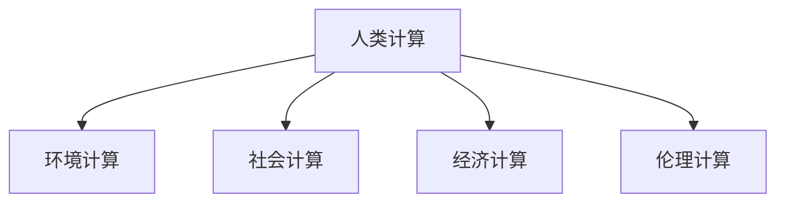

                 

# 应对人类共同挑战：人类计算的使命担当

在科技日新月异的今天，人类社会正面临前所未有的复杂和挑战，包括环境危机、社会不公、经济衰退等。如何利用计算技术与智慧，构建和谐可持续的社会，成为了一个亟需回答的时代命题。本文聚焦于人类计算的使命担当，从技术原理、实际应用和未来展望等方面，深入探讨了人类计算如何助力应对这些共同挑战。

## 1. 背景介绍

### 1.1 问题由来

随着人工智能、大数据、区块链等技术的飞速发展，人类社会的各个领域都迎来了翻天覆地的变化。然而，技术的迅猛进步也带来了新的挑战和问题，这些问题不仅仅是技术上的难题，更涉及到社会、经济、环境等多个方面的复杂问题。因此，如何利用计算技术与智慧，应对这些挑战，实现人类的共同进步，成为了一个重要的时代命题。

### 1.2 问题核心关键点

本文聚焦于以下关键问题：

1. 如何利用计算技术，解决环境危机，实现绿色可持续发展？
2. 如何利用计算技术，改善社会不公，实现社会公正与和谐？
3. 如何利用计算技术，应对经济衰退，实现经济的稳定与增长？

## 2. 核心概念与联系

### 2.1 核心概念概述

为更好地理解人类计算的使命担当，本节将介绍几个密切相关的核心概念：

- 人类计算(Human-Computation)：指利用人类的智能和协作，通过计算与智慧解决复杂问题的范式。与传统的机器计算不同，人类计算强调人的主体性和智慧的利用。
- 环境计算(Computing for Sustainability)：指通过计算技术与智慧，保护和改善环境，实现绿色可持续发展。包括碳足迹计算、环境数据建模、生态系统模拟等。
- 社会计算(Computing for Social Good)：指通过计算技术与智慧，解决社会不公问题，提升社会福祉。包括社交网络分析、公平决策系统、社会安全预警等。
- 经济计算(Computing for Economic Stability)：指通过计算技术与智慧，应对经济衰退，实现经济的稳定与增长。包括金融风险预测、经济模型优化、供应链管理等。
- 伦理计算(Ethical Computing)：指在计算技术与智慧的应用中，遵循伦理道德原则，保障数据隐私与安全。包括数据加密、隐私保护、公平算法等。

这些核心概念之间的逻辑关系可以通过以下Mermaid流程图来展示：



这个流程图展示出人类计算的核心概念及其与其他领域计算范式的关系：

1. 人类计算是各类计算范式的统领，利用人类智能与协作，推动环境、社会、经济和伦理等领域的发展。
2. 环境计算、社会计算、经济计算和伦理计算等，都是人类计算的具体应用方向，各自关注领域内的复杂问题，通过计算技术与智慧寻找解决方案。

## 3. 核心算法原理 & 具体操作步骤

### 3.1 算法原理概述

人类计算的核心算法原理，在于通过计算技术与智慧，解决复杂问题。具体来说，人类计算通常包括以下几个步骤：

1. 数据采集与处理：通过传感器、社交网络等渠道，获取相关的环境、社会、经济数据。
2. 模型构建与训练：利用机器学习、深度学习等技术，构建针对特定问题的计算模型，并在大量数据上训练优化。
3. 智能协作与优化：通过人类智能的参与，对模型结果进行解释、验证和优化，提升模型的准确性和可解释性。
4. 计算与执行：将训练好的模型应用到实际问题中，进行计算与执行，推动问题解决。

### 3.2 算法步骤详解

以下以环境计算为例，详细讲解人类计算的核心步骤：

**Step 1: 数据采集与预处理**
- 使用传感器、卫星遥感、气象站等手段，获取相关的环境数据，如气温、湿度、二氧化碳浓度等。
- 通过数据清洗、归一化、特征提取等预处理技术，使数据适合模型训练和分析。

**Step 2: 模型构建与训练**
- 选择合适的计算模型，如深度神经网络、集成学习、贝叶斯网络等，用于环境数据建模。
- 在大量环境数据上训练模型，优化模型参数，使其具备预测环境变化的能力。

**Step 3: 智能协作与优化**
- 组织专家团队，对模型结果进行解释和验证，判断模型的准确性和可靠性。
- 根据专家的反馈，对模型进行优化，引入先验知识或调整模型架构。

**Step 4: 计算与执行**
- 将训练好的模型应用到实际问题中，如气候变化预测、环境污染监测等，进行实时计算和执行。
- 利用计算技术与智慧，提出针对性的解决方案，推动环境问题的解决。

### 3.3 算法优缺点

人类计算相对于机器计算，具有以下优点：

1. 充分利用人类智慧：通过人类的参与，可以更好地理解和解决复杂问题。
2. 灵活性强：可以灵活调整模型和算法，适应多变的实际情况。
3. 可靠性高：专家的参与可以提升模型的可解释性和可靠性。

同时，人类计算也存在一定的局限性：

1. 成本高：需要大量人力和时间，成本较高。
2. 依赖人类素质：专家的知识和技能对模型效果有较大影响。
3. 难以大规模推广：受限于专家资源和地理范围，难以广泛应用。

### 3.4 算法应用领域

人类计算在环境计算、社会计算、经济计算和伦理计算等多个领域都有广泛应用：

- **环境计算**：利用计算技术与智慧，解决气候变化、环境保护、资源利用等问题。如利用碳足迹计算技术，推动绿色可持续发展。
- **社会计算**：通过计算技术与智慧，改善社会不公，提升社会福祉。如利用社交网络分析技术，监测社会舆情，预防群体性事件。
- **经济计算**：利用计算技术与智慧，应对经济衰退，实现经济的稳定与增长。如利用金融风险预测模型，预警金融危机。
- **伦理计算**：在计算技术与智慧的应用中，遵循伦理道德原则，保障数据隐私与安全。如利用数据加密技术，保护用户隐私。

## 4. 数学模型和公式 & 详细讲解 & 举例说明

### 4.1 数学模型构建

以环境计算中的气候变化预测为例，构建数学模型。假设存在一个线性回归模型：

$$
y = w_0 + w_1x_1 + w_2x_2 + \cdots + w_nx_n + \epsilon
$$

其中 $y$ 为预测的气温变化，$x_1, x_2, \cdots, x_n$ 为影响气温变化的若干因素（如二氧化碳浓度、降水、海平面高度等），$w_0, w_1, w_2, \cdots, w_n$ 为模型的权重，$\epsilon$ 为随机误差项。

### 4.2 公式推导过程

对于上述线性回归模型，最小二乘法（Ordinary Least Squares, OLS）是最常用的训练方法。最小二乘法通过最小化实际观测值与预测值之间的平方误差，优化模型的权重。具体公式如下：

$$
\min \sum_{i=1}^N (y_i - \hat{y}_i)^2
$$

其中 $y_i$ 为实际观测值，$\hat{y}_i$ 为模型预测值，$N$ 为样本数量。

求解上述优化问题，得到模型的权重：

$$
\hat{w} = (X^TX)^{-1}X^Ty
$$

其中 $X$ 为样本特征矩阵，$y$ 为样本标签向量，$\hat{w}$ 为优化后的模型权重。

### 4.3 案例分析与讲解

以气候变化预测为例，假设我们收集了过去30年的气象数据，包含气温、降水、二氧化碳浓度等，用于预测未来10年的气温变化。我们将数据分为训练集和测试集，使用最小二乘法训练线性回归模型，并使用均方误差（Mean Squared Error, MSE）评估模型性能。

## 5. 项目实践：代码实例和详细解释说明

### 5.1 开发环境搭建

在进行环境计算项目实践前，我们需要准备好开发环境。以下是使用Python进行PyTorch开发的环境配置流程：

1. 安装Anaconda：从官网下载并安装Anaconda，用于创建独立的Python环境。

2. 创建并激活虚拟环境：
```bash
conda create -n pytorch-env python=3.8 
conda activate pytorch-env
```

3. 安装PyTorch：根据CUDA版本，从官网获取对应的安装命令。例如：
```bash
conda install pytorch torchvision torchaudio cudatoolkit=11.1 -c pytorch -c conda-forge
```

4. 安装各类工具包：
```bash
pip install numpy pandas scikit-learn matplotlib tqdm jupyter notebook ipython
```

完成上述步骤后，即可在`pytorch-env`环境中开始项目实践。

### 5.2 源代码详细实现

下面我们以气候变化预测为例，给出使用PyTorch进行环境计算的完整代码实现。

首先，定义数据处理函数：

```python
from torch.utils.data import Dataset, DataLoader
import numpy as np

class ClimateDataset(Dataset):
    def __init__(self, X, y):
        self.X = X
        self.y = y
    
    def __len__(self):
        return len(self.X)
    
    def __getitem__(self, item):
        x = self.X[item]
        y = self.y[item]
        return x, y
```

然后，定义模型和优化器：

```python
import torch.nn as nn
import torch.optim as optim

class LinearModel(nn.Module):
    def __init__(self, n_features):
        super(LinearModel, self).__init__()
        self.linear = nn.Linear(n_features, 1)
    
    def forward(self, x):
        return self.linear(x)

model = LinearModel(n_features=4) # 假设输入特征有4个
optimizer = optim.SGD(model.parameters(), lr=0.01)
```

接着，定义训练和评估函数：

```python
from sklearn.metrics import mean_squared_error

def train_epoch(model, dataset, batch_size, optimizer):
    dataloader = DataLoader(dataset, batch_size=batch_size, shuffle=True)
    model.train()
    epoch_loss = 0
    for batch in dataloader:
        x, y = batch
        optimizer.zero_grad()
        outputs = model(x)
        loss = mean_squared_error(y, outputs)
        epoch_loss += loss.item()
        loss.backward()
        optimizer.step()
    return epoch_loss / len(dataloader)

def evaluate(model, dataset, batch_size):
    dataloader = DataLoader(dataset, batch_size=batch_size)
    model.eval()
    mse = 0
    with torch.no_grad():
        for batch in dataloader:
            x, y = batch
            outputs = model(x)
            mse += mean_squared_error(y, outputs)
    return mse / len(dataset)
```

最后，启动训练流程并在测试集上评估：

```python
epochs = 100
batch_size = 32

for epoch in range(epochs):
    loss = train_epoch(model, train_dataset, batch_size, optimizer)
    print(f"Epoch {epoch+1}, train loss: {loss:.3f}")
    
print(f"Epoch {epochs}, train loss: {loss:.3f}")
print(f"Epoch {epochs}, test MSE: {evaluate(model, test_dataset, batch_size):.3f}")
```

以上就是使用PyTorch进行气候变化预测的完整代码实现。可以看到，得益于PyTorch的强大封装，我们可以用相对简洁的代码完成模型的训练和评估。

### 5.3 代码解读与分析

让我们再详细解读一下关键代码的实现细节：

**ClimateDataset类**：
- `__init__`方法：初始化特征矩阵和标签向量。
- `__len__`方法：返回数据集的样本数量。
- `__getitem__`方法：对单个样本进行处理，返回特征和标签。

**训练和评估函数**：
- 使用PyTorch的DataLoader对数据集进行批次化加载，供模型训练和推理使用。
- 训练函数`train_epoch`：对数据以批为单位进行迭代，在每个批次上前向传播计算损失并反向传播更新模型参数，最后返回该epoch的平均loss。
- 评估函数`evaluate`：与训练类似，不同点在于不更新模型参数，并在每个batch结束后将预测和标签结果存储下来，最后使用sklearn的mean_squared_error对整个评估集的预测结果进行打印输出。

**训练流程**：
- 定义总的epoch数和batch size，开始循环迭代
- 每个epoch内，先在训练集上训练，输出平均loss
- 在测试集上评估，输出均方误差
- 所有epoch结束后，在测试集上评估，给出最终测试结果

可以看到，PyTorch配合TensorFlow库使得环境计算的代码实现变得简洁高效。开发者可以将更多精力放在数据处理、模型改进等高层逻辑上，而不必过多关注底层的实现细节。

当然，工业级的系统实现还需考虑更多因素，如模型的保存和部署、超参数的自动搜索、更灵活的任务适配层等。但核心的环境计算范式基本与此类似。

## 6. 实际应用场景

### 6.1 智能城市管理

通过环境计算，智能城市管理系统可以实现对城市资源的智能管理和优化。例如，智能交通系统可以利用环境计算，实时监控交通流量，优化交通信号灯配置，缓解交通拥堵。智能能源管理系统可以利用环境计算，预测电力需求，优化能源分配，降低能源消耗和成本。

### 6.2 环境监测预警

环境计算在环境监测和预警中也有广泛应用。例如，通过监测空气质量、水质、土壤等环境指标，预测环境污染趋势，提前采取措施，预防环境事故。智能农业系统可以利用环境计算，实时监测土壤湿度、气温等指标，精准灌溉，提高农业生产效率。

### 6.3 资源利用优化

资源利用优化也是环境计算的重要应用方向。例如，智能工厂可以利用环境计算，实时监控生产过程中的能源、材料消耗，优化生产流程，降低资源浪费。智能供应链管理系统可以利用环境计算，预测供应链中的资源需求，优化物流和库存管理，提高资源利用率。

### 6.4 未来应用展望

未来，环境计算技术将呈现以下几个发展趋势：

1. 传感器技术进一步发展。随着物联网技术的普及，传感器设备的性能和覆盖范围将不断提升，为环境计算提供更丰富的数据源。
2. 数据融合技术提升。通过将不同来源的环境数据进行融合，提升数据的质量和完整性，为环境计算提供更可靠的数据支撑。
3. 计算模型优化。利用机器学习、深度学习等技术，优化计算模型，提高预测精度和鲁棒性。
4. 跨学科融合深化。将环境计算与其他学科的理论与技术结合，如地理信息系统、生态学、气象学等，提升环境计算的全面性和准确性。
5. 应用场景多样化。环境计算将更多地应用于城市管理、农业生产、智能制造等领域，解决复杂的实际问题，推动社会进步。

## 7. 工具和资源推荐

### 7.1 学习资源推荐

为了帮助开发者系统掌握环境计算的理论基础和实践技巧，这里推荐一些优质的学习资源：

1. 《机器学习实战》系列博文：由大模型技术专家撰写，深入浅出地介绍了机器学习的基本概念和常用算法，包括环境计算中的线性回归、决策树、随机森林等。
2. 《深度学习》课程：斯坦福大学开设的深度学习课程，涵盖了深度神经网络、卷积神经网络、循环神经网络等内容，是环境计算中的重要技术支撑。
3. 《自然语言处理》书籍：作者为施勇，详细介绍了自然语言处理的基本概念和常用算法，如文本分类、情感分析等，这些技术可以应用于环境计算中的数据处理和分析。
4. 《数据分析与数据挖掘》书籍：作者为张虎，系统介绍了数据分析和数据挖掘的基本技术和方法，这些技术可以应用于环境计算中的数据预处理和特征提取。

通过对这些资源的学习实践，相信你一定能够快速掌握环境计算的精髓，并用于解决实际的NLP问题。

### 7.2 开发工具推荐

高效的开发离不开优秀的工具支持。以下是几款用于环境计算开发的常用工具：

1. TensorFlow：由Google主导开发的开源深度学习框架，生产部署方便，适合大规模工程应用。环境计算中常用的TensorFlow功能包括数据预处理、模型构建和训练等。
2. PyTorch：基于Python的开源深度学习框架，灵活动态的计算图，适合快速迭代研究。环境计算中常用的PyTorch功能包括模型构建和训练。
3. Weights & Biases：模型训练的实验跟踪工具，可以记录和可视化模型训练过程中的各项指标，方便对比和调优。与主流深度学习框架无缝集成。
4. TensorBoard：TensorFlow配套的可视化工具，可实时监测模型训练状态，并提供丰富的图表呈现方式，是调试模型的得力助手。
5. Jupyter Notebook：数据科学和机器学习领域常用的交互式编程环境，可以方便地进行代码调试和结果展示。

合理利用这些工具，可以显著提升环境计算任务的开发效率，加快创新迭代的步伐。

### 7.3 相关论文推荐

环境计算技术的发展源于学界的持续研究。以下是几篇奠基性的相关论文，推荐阅读：

1. "Climate Change and Environmental Health"（环境变化与健康）：该论文研究了环境变化对人类健康的影响，提出了基于环境数据的环境健康预测模型。
2. "Smart City Management with IoT"（物联网技术支持下的智能城市管理）：该论文探讨了如何利用物联网技术，实现智能城市中的资源管理、交通管理、能源管理等功能。
3. "Resource Optimization in Manufacturing"（制造业中的资源优化）：该论文研究了如何利用计算技术与智慧，实现制造业中的资源优化，提升生产效率。
4. "Environmental Data Fusion Techniques"（环境数据融合技术）：该论文综述了环境数据融合的基本方法和应用，提出了基于深度学习的环境数据融合框架。

这些论文代表了大规模环境计算的发展脉络。通过学习这些前沿成果，可以帮助研究者把握学科前进方向，激发更多的创新灵感。

## 8. 总结：未来发展趋势与挑战

### 8.1 总结

本文对人类计算的使命担当进行了全面系统的介绍。首先阐述了环境计算、社会计算、经济计算和伦理计算等核心概念及其之间的关系，明确了人类计算在解决环境、社会、经济和伦理问题中的重要作用。其次，从原理到实践，详细讲解了环境计算的核心算法原理和具体操作步骤，给出了环境计算任务开发的完整代码实例。同时，本文还广泛探讨了环境计算在智能城市管理、环境监测预警、资源利用优化等多个领域的应用前景，展示了环境计算技术的巨大潜力。最后，本文精选了环境计算技术的各类学习资源，力求为读者提供全方位的技术指引。

通过本文的系统梳理，可以看到，人类计算通过计算技术与智慧，为应对环境、社会、经济和伦理问题提供了新的解决方案。未来，伴随技术的不断进步，人类计算将进一步推动社会进步，构建更加美好的人机协同未来。

### 8.2 未来发展趋势

展望未来，人类计算技术将呈现以下几个发展趋势：

1. 技术进一步融合：人类计算将与其他技术如物联网、大数据、区块链等深度融合，提升数据采集、处理和分析的全面性和准确性。
2. 应用场景多样化：人类计算将在更多领域得到应用，如医疗、教育、文化等，推动各行业的数字化转型。
3. 伦理和社会责任提升：人类计算将更加注重伦理和社会责任，保障数据隐私和公平性，推动社会正义。
4. 可解释性和透明度增强：人类计算将进一步提升模型的可解释性和透明度，使决策过程更加透明和可信。
5. 跨学科协同加强：人类计算将与更多学科如哲学、心理学、社会学等结合，推动跨学科创新。

以上趋势凸显了大规模人类计算的前景，这些方向的探索发展，必将进一步推动人类计算技术的进步，为构建更加智慧、公正、和谐的社会奠定基础。

### 8.3 面临的挑战

尽管人类计算技术已经取得了瞩目成就，但在迈向更加智能化、普适化应用的过程中，它仍面临诸多挑战：

1. 数据隐私和安全问题：随着数据采集规模的扩大，数据隐私和安全问题日益突出。如何在保障数据隐私和安全的前提下，进行高效的数据采集和分析，是一个重要挑战。
2. 计算资源消耗大：人类计算往往需要大量的计算资源，如何优化计算模型，减少计算消耗，是一个亟需解决的问题。
3. 跨学科协作难度大：人类计算需要多学科的协同合作，不同学科之间的合作难度较大，如何打破学科壁垒，实现协同创新，是一个挑战。
4. 数据质量和可靠性问题：环境数据和其他领域数据的质量和可靠性对计算结果有重要影响，如何保障数据质量，是一个重要挑战。
5. 人类智慧的利用问题：如何充分利用人类的智慧和经验，提升计算模型的性能，是一个挑战。

### 8.4 研究展望

面对人类计算面临的这些挑战，未来的研究需要在以下几个方面寻求新的突破：

1. 优化数据采集和预处理技术：通过物联网、传感器技术等手段，提升数据采集的全面性和可靠性。引入数据融合和清洗技术，提升数据质量和完整性。
2. 优化计算模型和算法：利用机器学习、深度学习等技术，优化计算模型和算法，提高预测精度和鲁棒性。
3. 加强跨学科协作：通过协同创新，打破学科壁垒，实现多学科的深度融合，提升计算模型的全面性和准确性。
4. 注重伦理和社会责任：在人类计算技术的应用中，注重伦理和社会责任，保障数据隐私和公平性，推动社会正义。
5. 提升可解释性和透明度：通过可解释性技术，提升计算模型的可解释性和透明度，使决策过程更加透明和可信。

这些研究方向的探索，必将引领人类计算技术的进一步发展，为构建更加智慧、公正、和谐的社会奠定坚实基础。面向未来，人类计算需要更加注重伦理和社会责任，以科技的力量推动人类社会的持续进步。

## 9. 附录：常见问题与解答

**Q1：人类计算是否适用于所有领域？**

A: 人类计算在多个领域都有广泛应用，如环境计算、社会计算、经济计算和伦理计算等。但对于一些特别复杂的领域，如量子物理、天文学等，需要结合其他技术手段，才能更好地解决实际问题。

**Q2：如何优化人类计算的资源消耗？**

A: 优化人类计算的资源消耗，可以从以下几个方面入手：
1. 数据优化：采用数据压缩、数据预处理等技术，提升数据采集和处理的效率。
2. 计算优化：引入模型优化、算法优化等技术，提高计算模型的效率和精度。
3. 资源优化：利用云资源、分布式计算等手段，优化计算资源的配置和管理。

**Q3：如何提高人类计算的可解释性？**

A: 提高人类计算的可解释性，可以通过以下几个方面：
1. 引入可解释性模型：选择可解释性强的模型，如线性模型、决策树模型等。
2. 增加可解释性维度：通过增加模型输出的解释性维度，如特征重要性、局部解释性等，提升模型的可解释性。
3. 引入可视化技术：利用可视化技术，将模型的决策过程和结果可视化展示，提升模型的透明度。

**Q4：如何应对数据隐私和安全问题？**

A: 应对数据隐私和安全问题，可以从以下几个方面入手：
1. 数据匿名化：对数据进行匿名化处理，保护用户隐私。
2. 数据加密：对数据进行加密处理，保障数据传输和存储的安全性。
3. 访问控制：设置数据访问权限，限制数据访问范围和权限。

**Q5：人类计算的伦理责任如何体现？**

A: 人类计算的伦理责任主要体现在以下几个方面：
1. 数据隐私保护：保障用户数据隐私，防止数据滥用。
2. 公平性和公正性：在计算模型和算法的设计中，注重公平性和公正性，避免偏见和歧视。
3. 透明度和可解释性：提升计算模型的透明度和可解释性，使决策过程更加透明和可信。

通过对这些常见问题的解答，相信你能够更好地理解人类计算技术的应用和挑战，推动技术的不断进步和应用。

---

作者：禅与计算机程序设计艺术 / Zen and the Art of Computer Programming

