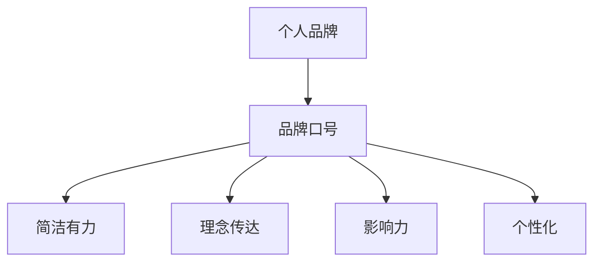

                 

# 建立个人品牌口号：简洁有力地传达你的理念

> 关键词：个人品牌, 口号, 简洁有力, 理念传达, 影响力, 个性化

## 1. 背景介绍

### 1.1 问题由来

在当今信息爆炸的时代，如何让别人在众多信息中记住你、记住你的品牌，是一个极具挑战的问题。特别是在技术领域，新的技术和方法层出不穷，如何在不断的创新和变化中找到定位，让自己的品牌变得独一无二，变得尤为重要。个人品牌口号，作为一种简洁有力的传播工具，能够帮助你在短时间内传递出核心的价值和理念，提升品牌的影响力。

### 1.2 问题核心关键点

个人品牌口号的核心关键点在于其简洁有力、高度凝练。一个好的品牌口号应该能够：

- 精确传达品牌的核心价值和理念。
- 简洁明了，便于记忆。
- 具有广泛适用性，适用于不同的场合和环境。
- 能够激励人心，给人以启发和动力。
- 具有良好的传播性和感染力。

本节将围绕这些关键点，详细介绍如何建立和打造一个简洁有力、富有感染力的个人品牌口号。

## 2. 核心概念与联系

### 2.1 核心概念概述

为更好地理解如何建立个人品牌口号，本节将介绍几个密切相关的核心概念：

- **个人品牌(Personal Brand)**：指个人在某个领域或社会中特有的形象、声誉和价值观的综合体现。个人品牌不仅影响职业发展，还能提升个人在社会中的影响力。

- **品牌口号(Slogan)**：指一个简洁有力的词组或句子，用于传达品牌的核心价值和理念。一个好的品牌口号能够在短时间内深入人心，提升品牌影响力。

- **简洁有力(Concise & Powerful)**：指用最少的文字，传达出最大的信息量和感染力。简洁有力是一个品牌口号成功的关键。

- **理念传达(Idea Communication)**：指品牌通过口号将核心价值和理念准确传达给目标受众，形成共鸣。

- **影响力(Influence)**：指品牌口号能够在目标受众中产生正向的影响，提升品牌知名度和美誉度。

- **个性化(Personalization)**：指品牌口号根据个人或品牌的独特性，量身定制，使其与众不同。

这些核心概念之间的逻辑关系可以通过以下Mermaid流程图来展示：



这个流程图展示了个别品牌口号与个人品牌其他核心概念之间的内在联系：品牌口号是基于个人品牌的核心价值和理念，通过简洁有力的形式传达，最终形成影响力，并体现个性化。

## 3. 核心算法原理 & 具体操作步骤
### 3.1 算法原理概述

建立个人品牌口号的过程，本质上是一个信息压缩和传播的优化问题。其核心思想是：在有限的字数内，最大化地传递出品牌的核心价值和理念，同时保证口号的简洁性和感染力。

这个过程可以分为以下几个步骤：

1. **确定品牌核心价值和理念**：分析个人品牌或企业品牌的使命、愿景和核心竞争力，提炼出最核心的价值和理念。
2. **设计简洁有力的词组或句子**：根据核心价值和理念，设计出一个简洁有力的品牌口号。
3. **评估和优化**：评估口号的传播效果和感染力，根据反馈进行优化调整。
4. **推广与应用**：将优化后的品牌口号应用于不同的媒介和场合，扩大其影响力。

### 3.2 算法步骤详解

以下详细介绍建立个人品牌口号的具体操作步骤：

**Step 1: 确定品牌核心价值和理念**

1. **使命与愿景分析**：梳理品牌的使命和愿景，明确品牌存在的意义和长远目标。
2. **核心竞争力分析**：评估品牌的独特卖点和核心竞争力，提炼出最核心的价值点。

**Step 2: 设计简洁有力的词组或句子**

1. **关键词提炼**：从品牌核心价值和理念中提炼出最具代表性和感染力的关键词。
2. **结构设计**：将关键词设计成一个简洁有力的词组或句子。注意保持结构紧凑，易于记忆。
3. **优化调整**：根据反馈不断优化调整，确保口号简洁有力且易记。

**Step 3: 评估和优化**

1. **传播效果评估**：通过问卷调查、社交媒体反馈等途径，评估品牌口号的传播效果。
2. **感染力测试**：通过实验测试品牌口号在不同受众中的感染力和共鸣度。
3. **优化调整**：根据评估结果和测试反馈，对品牌口号进行优化调整。

**Step 4: 推广与应用**

1. **多渠道推广**：将优化后的品牌口号应用于各类媒介，如网站、社交媒体、名片等。
2. **持续迭代**：根据实际效果和反馈，持续迭代优化品牌口号，保持其时效性和影响力。

### 3.3 算法优缺点

个人品牌口号的建立方法具有以下优点：

1. **高度概括**：能够在短时间内传递出品牌的核心价值和理念，提升品牌的传播效率。
2. **易于记忆**：简洁有力的形式便于受众记忆和传播。
3. **情感共鸣**：通过简洁有力的口号，激发受众的情感共鸣，提升品牌影响力。
4. **个性化明确**：根据个人或品牌特点量身定制，具有高度的个性化。

同时，该方法也存在一定的局限性：

1. **设计难度高**：设计一个简洁有力的品牌口号需要深思熟虑，对创意和洞察力要求较高。
2. **易于抄袭**：品牌口号简洁有力，容易被竞争对手模仿。
3. **时间成本**：设计、评估和优化品牌口号的过程耗时较长。

尽管存在这些局限性，但通过精心设计，一个好的品牌口号可以显著提升品牌的影响力和传播效果。

### 3.4 算法应用领域

个人品牌口号在多个领域都有广泛的应用，例如：

- **科技公司**：如Google的"Don't be evil, do good."简洁有力，传递了公司的社会责任感。
- **创业企业**：如Dropbox的"Simple, trustworthy."简洁明了，强调了品牌的核心价值。
- **个人品牌**：如Marissa Mayer的"Be bold, be kind."简单有力，传递了个人品牌的精神内涵。
- **非营利组织**：如联合国儿童基金会的"Stand up for kids."简洁有力，激发了公众对儿童权益的关注。

## 4. 数学模型和公式 & 详细讲解 & 举例说明

### 4.1 数学模型构建

个人品牌口号的设计和优化过程，可以通过数学模型进行建模。设品牌核心价值和理念为 $V$，品牌口号为 $S$，则目标是最小化 $S$ 的长度同时最大化 $S$ 对 $V$ 的传递效果。

数学模型可以表示为：

$$
\min_{S} |S| \quad \text{subject to} \quad f(S) \geq V
$$

其中 $|S|$ 表示口号长度，$f(S)$ 表示口号对品牌核心价值的传递效果。

### 4.2 公式推导过程

以下详细介绍如何通过数学模型进行品牌口号的设计和优化：

1. **核心价值与口号匹配**：定义一个函数 $f(S)$，表示口号 $S$ 对品牌核心价值 $V$ 的传递效果。例如，可以使用信息熵（信息量）来衡量口号的传递效果。
2. **优化目标函数**：设计一个优化目标函数 $g(S)$，表示口号的简洁程度和传递效果的综合评价。例如，可以使用 $g(S) = \frac{f(S)}{|S|}$，表示口号长度与传递效果之间的平衡。
3. **求解优化问题**：通过求解优化问题，找到最优的口号 $S^*$。

### 4.3 案例分析与讲解

以下通过一个具体的案例，详细讲解如何通过数学模型进行品牌口号的设计和优化：

**案例: 科技公司品牌口号优化**

假设某科技公司的品牌核心价值为 "创新、效率、可持续"，即 $V = \{\text{创新}, \text{效率}, \text{可持续}\}$。

1. **确定优化目标**：设计简洁有力的口号，使 $|S|$ 最小化，同时 $f(S)$ 最大。

2. **选择评价函数**：使用信息熵作为传递效果的评价函数 $f(S) = H(S)$，表示口号的语义丰富度。

3. **求解优化问题**：通过以下步骤，逐步优化口号 $S$：

- 从品牌核心价值中提炼关键词，如 "创新"、"效率"、"可持续"。
- 设计多个候选口号，如 "创新驱动，高效可持续"、"可持续创新，高效发展"。
- 通过信息熵计算各口号的信息量，选择信息量最大的口号，如 "高效创新，持续发展"。

## 5. 项目实践：代码实例和详细解释说明
### 5.1 开发环境搭建

在进行品牌口号的设计和优化实践前，我们需要准备好开发环境。以下是使用Python进行代码实现的环境配置流程：

1. **安装Python**：下载并安装Python 3.7或更高版本。

2. **创建虚拟环境**：
```bash
python -m venv myenv
source myenv/bin/activate
```

3. **安装依赖包**：
```bash
pip install numpy scipy sympy matplotlib pandas
```

4. **编写代码**：在虚拟环境中编写品牌口号设计优化的Python代码。

### 5.2 源代码详细实现

以下是一个简单的Python代码示例，用于计算品牌口号的信息熵，并根据信息熵优化口号。

```python
import numpy as np
from sympy import log, symbols, Rational

# 定义品牌核心价值
values = ['创新', '效率', '可持续']

# 定义评价函数
def entropy(s):
    return -np.sum([p * log(p, 2) for p in np.unique(s) / len(s)])

# 生成候选口号
candidates = ['创新驱动', '高效可持续', '可持续创新', '高效发展']

# 计算各候选口号的熵
entropies = [entropy(c) for c in candidates]

# 选择熵最小的口号
optimal_candidate = candidates[entropies.index(min(entropies))]
print(f"最优口号: {optimal_candidate}")
```

### 5.3 代码解读与分析

以上代码通过计算各候选口号的熵，选择熵最小的口号作为最优品牌口号。

1. **品牌核心价值**：定义了品牌的核心价值，即创新、效率和可持续。
2. **评价函数**：定义了一个简单的评价函数，计算字符串的信息熵，表示口号的语义丰富度。
3. **候选口号**：生成了多个候选口号，如创新驱动、高效可持续、可持续创新和高效发展。
4. **优化过程**：计算各候选口号的熵，选择熵最小的口号作为最优品牌口号。

## 6. 实际应用场景

### 6.1 科技公司

在科技公司中，一个简洁有力的品牌口号可以帮助公司传递核心价值和理念，提升品牌形象和市场认知度。例如，Google的"Don't be evil, do good."简洁有力，传递了公司的社会责任感，成为全球用户耳熟能详的品牌口号。

### 6.2 创业企业

创业企业在品牌建设初期，一个简洁有力的品牌口号能够快速提升品牌知名度，吸引投资人和用户。如Dropbox的"Simple, trustworthy."简洁明了，强调了品牌的核心价值，使Dropbox在激烈的竞争中脱颖而出。

### 6.3 个人品牌

个人品牌口号能够帮助个人快速传递个人形象和理念，提升个人在职场和社交网络中的影响力。例如，Marissa Mayer的"Be bold, be kind."简单有力，传递了个人品牌的精神内涵，成为她的标志性语言。

### 6.4 非营利组织

非营利组织通过简洁有力的品牌口号，能够激发起公众对组织使命的关注和支持。如联合国儿童基金会的"Stand up for kids."简洁有力，激发了公众对儿童权益的关注，提升了组织的影响力。

## 7. 工具和资源推荐
### 7.1 学习资源推荐

为了帮助开发者系统掌握个人品牌口号的设计和优化，这里推荐一些优质的学习资源：

1. **品牌管理书籍**：《Brand Design: The Powerful Guide to Creating and Managing Visual Identity》，本书系统介绍了品牌设计和管理的基本原则和实践技巧。

2. **在线课程**：Coursera上的"Marketing Strategy Specialization"，通过多个模块，从品牌定位到传播策略，全面介绍了品牌管理的核心内容。

3. **品牌设计工具**：Canva，一个在线品牌设计工具，提供丰富的模板和设计元素，帮助用户快速设计品牌口号。

4. **品牌管理论坛**：Brandwatch，一个品牌管理社区，汇聚了全球品牌经理和设计师，分享品牌设计和管理的最佳实践。

5. **社交媒体平台**：LinkedIn、Twitter等，通过社交媒体平台传播个人品牌口号，提升品牌的传播效果。

### 7.2 开发工具推荐

高效的工具是成功设计品牌口号的重要保障。以下是几款推荐的开发工具：

1. **Google Colab**：Google提供的免费在线Jupyter Notebook环境，方便用户进行数据分析和可视化。

2. **Python代码编辑器**：如PyCharm、VS Code等，支持代码自动补全和调试，提高开发效率。

3. **信息熵计算工具**：如Python中的entropy库，用于计算字符串的信息熵，评估口号的语义丰富度。

4. **项目管理工具**：如Trello、Asana等，帮助团队协作和管理项目进度。

5. **数据可视化工具**：如Matplotlib、Seaborn等，用于绘制数据图表，展示口号设计的优化结果。

### 7.3 相关论文推荐

个人品牌口号的设计和优化涉及信息论、语言学等多个学科，以下是几篇相关的经典论文：

1. **信息熵理论**：A. Shannon的"Mathematical Theory of Communication"，介绍了信息熵的基本概念和计算方法。

2. **品牌传播研究**：J. V. Zainetdinov的"Effective Communication in the Information Society"，探讨了品牌传播的策略和效果评估。

3. **情感计算**：M. Picard的"Computers Could Feel", 探讨了情感计算在品牌设计和传播中的应用。

4. **语义分析**：D. Jurafsky和J. Martin的"Speech and Language Processing"，介绍了语义分析和自然语言处理的基本方法。

通过学习这些论文，可以帮助研究者更深入地理解品牌口号的理论基础和实践技巧。

## 8. 总结：未来发展趋势与挑战
### 8.1 总结

本文对如何建立个人品牌口号进行了全面系统的介绍。首先阐述了个人品牌口号在品牌传播中的重要作用，明确了口号简洁有力、理念传达、影响力提升和个性化打造的核心价值。其次，从原理到实践，详细讲解了建立品牌口号的数学模型和优化步骤，给出了具体的代码实现和解释分析。同时，本文还广泛探讨了品牌口号在科技公司、创业企业、个人品牌和非营利组织等多个领域的应用前景，展示了口号的广泛应用价值。此外，本文精选了品牌口号设计相关的学习资源和开发工具，力求为读者提供全方位的指导。

通过本文的系统梳理，可以看到，一个简洁有力、富有感染力的品牌口号，能够显著提升品牌的传播效果和影响力，助力品牌在复杂多变的市场环境中脱颖而出。未来，伴随品牌管理的不断发展，品牌口号设计也将成为品牌建设不可或缺的重要环节。

### 8.2 未来发展趋势

展望未来，个人品牌口号的设计和优化将呈现以下几个发展趋势：

1. **智能辅助设计**：借助AI技术，如自然语言处理、情感分析等，自动化设计更加符合品牌核心价值的口号。

2. **跨文化适用**：品牌口号需要考虑全球市场的文化差异，设计出具备广泛适用性的口号。

3. **情感共鸣**：品牌口号不仅要有高度的概括性，还要能够激发受众的情感共鸣，增强口号的传播效果。

4. **用户参与设计**：通过用户反馈和参与设计，使品牌口号更加贴近用户需求和期望。

5. **持续迭代优化**：品牌口号需要根据市场变化和用户反馈，持续迭代优化，保持其时效性和感染力。

以上趋势凸显了品牌口号设计的广阔前景。这些方向的探索发展，必将进一步提升品牌的影响力和传播效果，为品牌建设带来新的活力。

### 8.3 面临的挑战

尽管品牌口号设计已经取得了一定成就，但在品牌建设的过程中，仍面临诸多挑战：

1. **创意瓶颈**：设计一个简洁有力的口号需要丰富的创意和洞察力，创意瓶颈成为一大难题。

2. **文化差异**：不同市场的文化背景不同，设计跨文化的品牌口号需要考虑文化差异。

3. **信息过载**：品牌口号面临的传播渠道众多，如何突出口号，避免信息过载，是设计中的一大挑战。

4. **用户期望变化**：用户的期望和需求不断变化，如何及时响应并调整口号，是品牌建设中的一大难题。

5. **品牌危机管理**：品牌危机事件的发生，如何及时调整口号，避免危机影响，是品牌管理中的一大挑战。

这些挑战需要品牌管理者不断创新、持续优化，才能在品牌建设中保持领先地位。

### 8.4 研究展望

面对品牌口号设计面临的种种挑战，未来的研究需要在以下几个方面寻求新的突破：

1. **跨学科融合**：将品牌口号设计与心理学、社会学、文化学等多学科知识结合，增强口号的情感共鸣和适用性。

2. **技术辅助设计**：借助AI技术和数据分析，实现口号设计的智能化和自动化，提高设计效率和质量。

3. **品牌故事化**：通过品牌故事的设计，使口号不仅传递理念，还能传递品牌的文化和价值。

4. **用户共创**：通过用户参与设计，使口号更具亲和力和影响力，提升用户参与度和品牌忠诚度。

5. **动态调整**：根据市场变化和用户反馈，动态调整口号，保持其时效性和影响力。

这些研究方向的探索，必将引领品牌口号设计走向更高的台阶，为品牌建设带来新的突破和创新。

## 9. 附录：常见问题与解答

**Q1：如何设计一个简洁有力的品牌口号？**

A: 设计一个简洁有力的品牌口号，需要遵循以下步骤：
1. **确定核心价值**：明确品牌的核心价值和理念，提炼出最具代表性和感染力的关键词。
2. **简洁明了**：将关键词设计成一个简洁有力的词组或句子，保持结构紧凑，易于记忆。
3. **情感共鸣**：激发受众的情感共鸣，提升口号的感染力和传播效果。
4. **广泛适用**：设计出具备广泛适用性的口号，适用于不同场合和环境。

**Q2：品牌口号如何与品牌核心价值相匹配？**

A: 品牌口号需要与品牌的核心价值相匹配，才能准确传达品牌的使命和理念。具体方法如下：
1. **关键词提炼**：从品牌核心价值中提炼出最具代表性和感染力的关键词。
2. **简洁有力**：将关键词设计成一个简洁有力的词组或句子，保持结构紧凑，易于记忆。
3. **优化调整**：根据反馈不断优化调整，确保口号简洁有力且易记。

**Q3：品牌口号设计有哪些工具和方法？**

A: 品牌口号设计涉及创意、计算等多个方面，以下是一些推荐的工具和方法：
1. **信息熵计算**：使用Python中的entropy库，计算字符串的信息熵，评估口号的语义丰富度。
2. **情感分析**：使用自然语言处理技术，分析受众对口号的情感共鸣，优化口号设计。
3. **用户调研**：通过问卷调查、用户反馈等方式，收集受众对口号的评价，指导口号优化。

**Q4：品牌口号设计的未来趋势是什么？**

A: 品牌口号设计的未来趋势包括：
1. **智能辅助设计**：借助AI技术和数据分析，自动化设计更加符合品牌核心价值的口号。
2. **跨文化适用**：设计出具备广泛适用性的口号，适用于不同市场的文化背景。
3. **情感共鸣**：激发受众的情感共鸣，增强口号的传播效果。
4. **用户参与设计**：通过用户反馈和参与设计，使口号更加贴近用户需求和期望。
5. **动态调整**：根据市场变化和用户反馈，动态调整口号，保持其时效性和影响力。

---

作者：禅与计算机程序设计艺术 / Zen and the Art of Computer Programming

