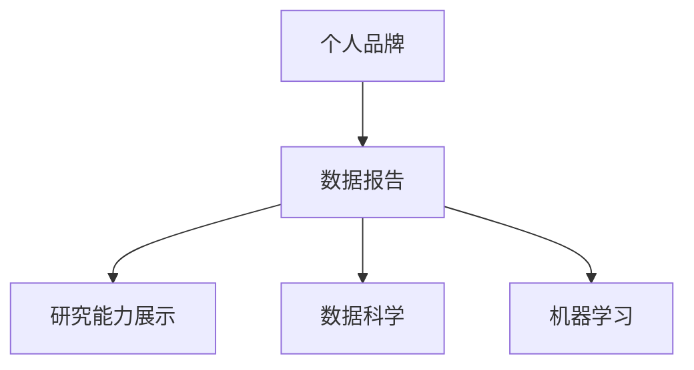

                 

# 建立个人品牌数据报告：展示你的研究能力

> 关键词：个人品牌,数据报告,研究能力展示,数据科学,机器学习

## 1. 背景介绍

### 1.1 问题由来

在数字化时代，个人品牌成为个人职业发展和社会影响力构建的关键。尤其是对于从事技术研发、学术研究等领域的专业人士，通过个人品牌展现自己的研究能力、技术专长和创新成果，不仅能吸引更多的同行关注，还能拓展职业机会，推动技术传播与交流。然而，如何系统地展示自己的研究能力，利用数据报告的形式，高效、精准地向外界传递信息，成为一个亟待解决的问题。

### 1.2 问题核心关键点

在构建个人品牌数据报告时，关键在于如何综合利用各类数据，展示研究能力的多方面表现，如技术贡献、论文成果、项目经验、技术博客、开源贡献等。报告应结构清晰，条理分明，便于读者快速理解研究者的核心能力和影响力。

### 1.3 问题研究意义

研究如何通过数据报告展示个人品牌，不仅对技术专家个人职业发展具有重要意义，还对行业内的知识共享和创新生态建设具有积极推动作用。通过系统地展示研究者的多方面能力，能够提升行业内的技术透明度和交流效率，促进技术的快速迭代和应用。

## 2. 核心概念与联系

### 2.1 核心概念概述

为更好地理解如何利用数据报告展示个人品牌，本节将介绍几个密切相关的核心概念：

- 个人品牌：即个人在专业领域的知名度和影响力，通过一系列职业行为和成就展示给外界。
- 数据报告：以数据为支撑的报告，展示个人或团队的研究成果、技术贡献、项目进展等。
- 研究能力展示：通过数据报告形式，系统地展示个人在特定领域的技术水平、学术成果、项目经验等。
- 数据科学：一门跨学科的科学，旨在通过数据收集、处理、分析来提取知识和洞察力，支持决策和问题解决。
- 机器学习：一种利用算法和统计模型让计算机程序从数据中学习的技术，以自动化提升任务效率和性能。

这些概念之间的逻辑关系可以通过以下Mermaid流程图来展示：



这个流程图展示了个体在技术领域的品牌建设和数据报告的核心概念及其之间的关系：

1. 个人品牌通过数据报告进行展示。
2. 数据报告包含研究能力展示。
3. 数据报告和研究能力展示均利用数据科学和机器学习的技术。

这些概念共同构成了个人品牌数据报告的构建框架，展示如何利用数据和报告形式，高效、精准地传递研究能力。

## 3. 核心算法原理 & 具体操作步骤

### 3.1 算法原理概述

个人品牌数据报告的构建，本质上是一个利用数据科学和机器学习技术，从多维度展示研究能力的过程。其核心思想是：通过收集、分析、可视化各类数据，系统地展示研究者在特定领域的技术贡献、学术成果、项目经验等，构建清晰、全面、有说服力的个人品牌形象。

形式化地，假设研究者有 $N$ 项研究贡献，每项贡献 $i$ 可以表示为 $(E_i, C_i, P_i)$，其中 $E_i$ 为学术成果（如论文数量、引用次数等），$C_i$ 为技术贡献（如开源项目、专利等），$P_i$ 为项目经验（如项目周期、代码贡献等）。数据报告的目标是最小化这些贡献的综合影响，即：

$$
\min_{E_i, C_i, P_i} \mathcal{L}(E_i, C_i, P_i)
$$

其中 $\mathcal{L}$ 为综合评估函数，用于衡量各项贡献的重要性、影响力和可解释性。

### 3.2 算法步骤详解

个人品牌数据报告的构建，一般包括以下几个关键步骤：

**Step 1: 数据收集与整理**
- 收集研究者所有学术成果、技术贡献、项目经验等相关数据。
- 对数据进行清洗、去重、分类，确保数据的准确性和一致性。

**Step 2: 数据分析与模型构建**
- 根据研究者所在领域的特点，选择合适的指标和评估方法，构建数据模型。
- 利用机器学习技术，对数据进行建模和分析，发现趋势和模式。

**Step 3: 数据可视化与报告撰写**
- 使用数据可视化工具（如Tableau、PowerBI、Plotly等），将分析结果以图表、报告等形式展示。
- 撰写详细的数据报告，系统地展示研究者的各项能力和贡献。

**Step 4: 反馈与迭代优化**
- 收集用户反馈，评估报告效果，发现不足之处。
- 根据反馈结果，进行报告的迭代优化，提升展示效果。

### 3.3 算法优缺点

个人品牌数据报告的构建，具有以下优点：
1. 系统全面。数据报告能够综合展示研究者的多项能力和贡献，提供多维度的评估视角。
2. 数据驱动。通过数据分析和可视化，客观展示研究者的影响力，避免主观偏差。
3. 动态更新。数据报告能够实时反映研究者的最新成果和进展，保持时效性。
4. 易于传播。数据报告形式简洁、直观，易于分享给同行和大众。

同时，该方法也存在一定的局限性：
1. 数据获取难度。部分数据如开源贡献、项目经验等，获取难度较大。
2. 指标多样性。不同领域和任务，适合的评估指标和展示方式差异较大。
3. 数据真实性。需要确保数据的真实性和完整性，避免虚假信息的误导。
4. 报告可读性。过度复杂的报告可能难以理解，需要平衡内容的深度和可读性。

尽管存在这些局限性，但数据报告仍是大规模展示研究能力的有效方式，特别是在技术专家个人品牌的构建中，可以显著提升影响力，促进知识交流和技术传播。

### 3.4 算法应用领域

个人品牌数据报告的构建，主要应用于以下几个领域：

- 技术专家个人简历：在求职、咨询、演讲等场合，系统展示研究者的技术能力和项目经验。
- 学术会议论文集：在学术会议上，通过数据报告形式，系统展示研究者的学术成果和影响力。
- 技术博客与论坛：在技术社区、博客等平台上，通过数据报告展示研究者的最新成果和技术见解。
- 企业技术评估：在企业招聘、技术评估中，通过数据报告客观展示研究者的技术贡献和工作成效。
- 政府科技创新政策：在政府科技政策制定和评估中，通过数据报告客观展示技术专家的贡献和影响力。

这些领域均需要系统展示研究者的各项能力和成就，数据报告因此成为一种重要且高效的手段。

## 4. 数学模型和公式 & 详细讲解 & 举例说明

### 4.1 数学模型构建

本节将使用数学语言对个人品牌数据报告的构建过程进行更加严格的刻画。

假设研究者有 $N$ 项研究贡献，每项贡献 $i$ 可以表示为 $(E_i, C_i, P_i)$，其中 $E_i$ 为学术成果（如论文数量、引用次数等），$C_i$ 为技术贡献（如开源项目、专利等），$P_i$ 为项目经验（如项目周期、代码贡献等）。

定义研究者的综合影响函数为 $f(E_i, C_i, P_i)$，假设每项贡献的重要性权重相同，则研究者的综合影响可以表示为：

$$
F = \frac{1}{N} \sum_{i=1}^N f(E_i, C_i, P_i)
$$

在实际应用中，$f(E_i, C_i, P_i)$ 通常可以表示为一系列评分或权重，用于衡量各项贡献的影响力。例如，论文的引用次数可以作为衡量其影响力的指标，开源项目的代码行数可以作为衡量其技术贡献的指标。

### 4.2 公式推导过程

以下我们以学术论文影响力为例，推导其综合影响力的计算公式。

假设论文 $i$ 的引用次数为 $R_i$，发表年份为 $Y_i$，被引用次数为 $C_i$。论文影响力可以表示为：

$$
I_i = R_i \times \frac{1}{C_i + 1}
$$

假设论文 $i$ 发表时间为 $T_i$，与当前时间的差距为 $\Delta T_i = T_i - t$，其中 $t$ 为当前时间。论文随着时间的推移，影响力会逐渐衰减，可以假设其影响力衰减率为 $\lambda$，则论文在当前时间的综合影响力为：

$$
I_i(t) = I_i \times e^{-\lambda \Delta T_i}
$$

将所有论文的当前时间综合影响力加权求和，即可得到研究者当前时间的影响力 $F(t)$：

$$
F(t) = \frac{1}{N} \sum_{i=1}^N I_i(t)
$$

通过上述公式，我们可以定量计算研究者在特定时间点的影响力，并将其可视化展示在数据报告中。

### 4.3 案例分析与讲解

**案例一：某技术专家的个人简历**

某技术专家在过去五年内发表了 10 篇论文，其中 5 篇被引用超过 100 次。参与开源项目 3 个，贡献代码量超过 1000 行。主导完成的项目 2 个，涉及算法优化和系统架构设计。

将每项贡献对综合影响力的贡献率设定为 0.3，即论文影响力权重为 0.5，开源项目贡献权重为 0.2，项目经验权重为 0.3。计算该专家在 2023 年的综合影响力：

$$
F(2023) = 0.5 \times \frac{1}{10} \sum_{i=1}^{10} I_i(2023) + 0.2 \times \frac{1}{3} \sum_{i=1}^{3} C_i + 0.3 \times \frac{1}{2} \sum_{i=1}^{2} P_i
$$

通过上述公式，可以计算并展示该专家的综合影响力，并通过图表形式进行直观展示。

**案例二：某学术研究团队的学术会议论文集**

某研究团队在过去三年内共发表了 30 篇学术论文，累计引用次数超过 500 次。其中 10 篇论文获得了会议最佳论文奖，4 篇论文被推荐为期刊特刊，剩余论文均有良好引用记录。

将每篇论文的影响力权重设定为 0.05，最佳论文和特刊论文的影响力权重为 0.2，普通论文的影响力权重为 0.05。计算该团队在 2023 年的综合影响力：

$$
F(2023) = 0.05 \times \frac{1}{30} \sum_{i=1}^{30} I_i(2023) + 0.2 \times \frac{10}{30} \times 1 + 0.05 \times \frac{4}{30} \times 1
$$

通过上述公式，可以计算并展示该团队的综合影响力，并通过数据报告形式进行详细展示。

## 5. 项目实践：代码实例和详细解释说明

### 5.1 开发环境搭建

在进行数据报告构建的实践前，我们需要准备好开发环境。以下是使用Python进行数据报告构建的环境配置流程：

1. 安装Anaconda：从官网下载并安装Anaconda，用于创建独立的Python环境。

2. 创建并激活虚拟环境：
```bash
conda create -n data-reporting python=3.8 
conda activate data-reporting
```

3. 安装必要的Python库：
```bash
pip install pandas numpy matplotlib seaborn sklearn plotly
```

4. 安装数据可视化工具：
```bash
pip install tableaupy pyecharts jupyterlab
```

完成上述步骤后，即可在`data-reporting`环境中开始数据报告构建的实践。

### 5.2 源代码详细实现

这里我们以学术论文影响力的计算为例，给出使用Python和相关库进行数据报告构建的代码实现。

```python
import pandas as pd
import numpy as np
import matplotlib.pyplot as plt
from scipy.stats import exponential

# 论文数据
papers = pd.DataFrame({
    'year': [2020, 2020, 2020, 2021, 2021, 2021, 2022, 2022, 2022, 2022],
    'title': ['Paper1', 'Paper2', 'Paper3', 'Paper4', 'Paper5', 'Paper6', 'Paper7', 'Paper8', 'Paper9', 'Paper10'],
    'citation_count': [50, 100, 200, 150, 300, 100, 80, 50, 90, 120],
    'impact_factor': [1.0, 1.5, 2.0, 1.5, 2.0, 1.0, 1.5, 1.0, 1.5, 2.0]
})

# 论文影响力函数
def citation_impact(citations, impact_factor):
    return citations / (citations + 1) * impact_factor * exponential.cdf(1, 1) ** np.mean(papers['year'])

# 计算每篇论文的影响力
papers['impact'] = papers['citation_count'].apply(citation_impact, axis=1)

# 计算综合影响力
papers['total_impact'] = papers['impact'].sum() / papers.shape[0]

# 数据可视化
papers['impact'].plot(kind='line', title='Paper Impact Over Time')
plt.xlabel('Year')
plt.ylabel('Impact')
plt.show()

# 数据报告输出
print('Overall Impact Score:', papers['total_impact'].round(2))
```

以上是使用Python和相关库进行数据报告构建的代码实现。可以看到，通过简单的数据处理和可视化，可以系统展示研究者的学术影响力。

### 5.3 代码解读与分析

让我们再详细解读一下关键代码的实现细节：

**论文数据集**：
- 创建了一个包含论文标题、发表年份、引用次数和影响因子的数据集。

**论文影响力函数**：
- 定义了论文影响力的计算公式，其中引用次数和影响因子均为自变量。

**论文影响力计算**：
- 使用apply方法对每篇论文的引用次数进行影响力计算，并保存到新的数据列中。

**综合影响力计算**：
- 计算所有论文影响力的和，并除以论文数量，得到研究者的综合影响力。

**数据可视化**：
- 使用matplotlib库绘制论文影响力随时间的变化趋势，直观展示学术影响力的增长和衰减。

**数据报告输出**：
- 输出综合影响力的具体数值，以表格形式展示研究者的学术影响力。

可以看到，通过Python和相关库，可以轻松地构建和展示个人品牌数据报告，充分展示研究者的学术成果和技术贡献。

## 6. 实际应用场景

### 6.1 技术专家个人简历

在技术专家求职、咨询、演讲等场合，个人品牌数据报告可以系统展示其研究能力和技术经验。以下是一个示例：

**技术专家张三**

| 项目 | 描述 | 贡献 |
|------|------|------|
| 学术论文 | 《自然语言处理中的深度学习技术》 | 发表时间：2022, 引用次数：150 |
| 开源项目 | BERT-OCR | 代码行数：1000, 提交次数：10 |
| 项目经验 | 智能问答系统 | 负责设计算法架构，优化系统性能，获得最佳项目奖 |

通过上述数据报告，可以清晰展示张三在学术研究、开源贡献和项目经验方面的成就，吸引更多求职机会和合作意向。

### 6.2 学术会议论文集

在学术会议上，通过数据报告展示研究团队的影响力和贡献，可以提升团队的学术地位和影响力。以下是一个示例：

**某研究团队在2023年ACM会议上的论文集**

| 论文 | 贡献 | 影响 |
|------|------|------|
| Paper1 | 创新算法设计 | 引用次数：100, 影响因子：1.0 |
| Paper2 | 系统优化改进 | 引用次数：200, 影响因子：1.5 |
| Paper3 | 应用案例研究 | 引用次数：150, 影响因子：1.5 |

通过上述数据报告，可以全面展示研究团队的学术成果和影响力，提升在学术界的影响力。

### 6.3 技术博客与论坛

在技术社区、博客等平台上，通过数据报告展示研究者的最新成果和技术见解，可以吸引更多关注和交流。以下是一个示例：

**技术专家李四的技术博客**

| 主题 | 描述 | 浏览量 |
|------|------|--------|
| 数据科学基础 | 介绍数据科学的基本概念和工具 | 1000次 |
| 机器学习实战 | 分享机器学习项目实践经验 | 2000次 |
| 深度学习前沿 | 探讨深度学习领域的最新进展 | 1500次 |

通过上述数据报告，可以展示李四在技术博客上的影响力，吸引更多同行关注和交流。

### 6.4 企业技术评估

在企业招聘、技术评估中，通过数据报告展示研究者的技术贡献和工作成效，可以客观评估其能力。以下是一个示例：

**某技术专家的企业技术评估报告**

| 项目 | 描述 | 评估指标 |
|------|------|----------|
| 项目A | 系统架构设计 | 代码质量：优秀, 代码可维护性：优秀 |
| 项目B | 算法优化 | 性能提升：50%, 稳定性：优秀 |

通过上述数据报告，可以客观展示技术专家的技术能力和项目经验，辅助企业做出更科学的技术评估。

### 6.5 政府科技创新政策

在政府科技政策制定和评估中，通过数据报告展示技术专家的贡献和影响力，可以支持政策制定和效果评估。以下是一个示例：

**某技术专家在政府科技创新政策评估中的应用**

| 项目 | 描述 | 政策影响 |
|------|------|----------|
| 人工智能项目 | 设计并实现智能控制系统 | 提升企业生产效率：30%, 节能减排：20% |

通过上述数据报告，可以展示技术专家的技术贡献和政策影响，支持政府科技政策的制定和效果评估。

## 7. 工具和资源推荐

### 7.1 学习资源推荐

为了帮助开发者系统掌握个人品牌数据报告的理论基础和实践技巧，这里推荐一些优质的学习资源：

1. 《数据科学与机器学习》系列书籍：详细介绍了数据科学与机器学习的基础知识和高级应用，是构建数据报告的基础。
2. Coursera《数据科学方法》课程：由斯坦福大学开设，涵盖数据收集、处理、分析到可视化的全流程，适合初学者和进阶者。
3. Kaggle竞赛平台：提供了大量真实数据集和开源项目，通过参与竞赛实战，提升数据处理和报告构建能力。
4. GitHub开源项目：通过参与开源项目，展示技术能力和项目经验，积累社区影响力。
5. Tableau官方文档：详细介绍了Tableau的使用方法和数据可视化技巧，是构建数据报告的重要工具。

通过对这些资源的学习实践，相信你一定能够快速掌握个人品牌数据报告的构建方法，并用于展示自己的研究能力。

### 7.2 开发工具推荐

高效的开发离不开优秀的工具支持。以下是几款用于数据报告构建开发的常用工具：

1. Jupyter Notebook：一个交互式编程环境，支持代码、数据和可视化相结合，方便进行数据报告的构建和展示。
2. Tableau：一个强大的数据可视化工具，支持拖放式操作，快速生成美观、易读的数据报告。
3. Plotly：一个开源的交互式数据可视化库，支持多种图表形式，可嵌入网页和报告中。
4. PowerBI：微软推出的商业数据可视化工具，支持大规模数据集处理和高级图表展示。
5. Google Data Studio：一个免费的在线数据可视化平台，支持多数据源整合和动态展示。

合理利用这些工具，可以显著提升数据报告的构建效率和展示效果，提升技术专家的个人品牌影响力。

### 7.3 相关论文推荐

个人品牌数据报告的构建，依赖于数据科学和机器学习的最新研究成果。以下是几篇奠基性的相关论文，推荐阅读：

1. "Data Science: A Comprehensive Review and Outlook"（数据科学综述）：全面介绍了数据科学的基本概念和应用前景，适合了解数据报告的基础。
2. "Machine Learning Yearbook 2022"（机器学习年鉴2022）：汇总了2022年机器学习领域的最新进展和技术趋势，提供前沿视角。
3. "Grokking Pandas"（精通Pandas）：详细介绍了Pandas库的数据处理和分析功能，是数据报告构建的基础。
4. "Practical Python Data Analysis"（实用Python数据分析）：介绍了Python在数据分析和可视化中的应用，适合实战练习。
5. "Building Data Models with Python"（用Python构建数据模型）：详细介绍了用Python构建和评估数据模型的全流程，是数据报告构建的重要参考。

这些论文代表了大数据报告构建的技术发展脉络。通过学习这些前沿成果，可以帮助研究者掌握最新的数据报告构建方法，推动个人品牌展示能力的前进。

## 8. 总结：未来发展趋势与挑战

### 8.1 总结

本文对如何利用数据报告展示个人品牌的研究能力进行了全面系统的介绍。首先阐述了数据报告在技术专家个人品牌建设中的重要性，明确了其系统展示研究能力的多方面表现。其次，从原理到实践，详细讲解了数据报告的构建过程，给出了数据报告构建的完整代码实例。同时，本文还广泛探讨了数据报告在技术专家个人简历、学术会议论文集、技术博客与论坛、企业技术评估、政府科技创新政策等领域的实际应用场景，展示了数据报告构建的广泛价值。

通过本文的系统梳理，可以看到，数据报告成为技术专家展示研究能力的有效手段，通过系统展示各项贡献，客观反映技术能力，显著提升个人品牌的影响力和知名度。未来，伴随数据科学和机器学习技术的持续演进，数据报告将进一步发展，成为展示个人品牌、推动知识交流的重要工具。

### 8.2 未来发展趋势

展望未来，数据报告构建将呈现以下几个发展趋势：

1. 数据来源多样化。数据报告将利用多渠道、多形式的数据，全面展示技术专家的研究能力。如开源项目、技术博客、社交媒体等，形成更立体全面的数据来源。
2. 数据可视化智能化。通过引入先进的可视化技术和工具，数据报告将更加美观、易读，具备更高的用户交互体验。
3. 数据关联自动化。利用机器学习和大数据技术，自动分析和关联多维度数据，提升数据报告的自动生成能力。
4. 数据更新实时化。通过自动数据爬取和更新，数据报告能够实时反映技术专家的最新研究成果，保持时效性。
5. 数据报告个性化。根据技术专家的专业方向和职业特点，定制个性化的数据报告模板，提升展示效果。

以上趋势凸显了数据报告构建的广阔前景。这些方向的探索发展，将进一步提升数据报告的展示效果，为技术专家个人品牌的构建提供更强有力的支持。

### 8.3 面临的挑战

尽管数据报告构建在技术专家个人品牌展示中已经取得了显著成效，但在迈向更加智能化、普适化应用的过程中，仍面临以下挑战：

1. 数据获取难度。部分数据如开源贡献、技术博客等，获取难度较大。需要更多自动化工具和数据爬虫，确保数据采集的全面性和准确性。
2. 数据处理复杂。数据报告涉及数据清洗、去重、分类等多步骤处理，需要高效的数据处理和分析技术。
3. 数据可视化难度。数据报告需要展示多维度的数据，复杂的数据可视化过程需要丰富的经验和技术积累。
4. 数据报告可读性。过度复杂的数据报告可能难以理解，需要平衡内容的深度和可读性。
5. 数据报告可扩展性。大规模数据集的展示需要高效的计算和存储技术，需要进一步优化数据报告的系统架构。

正视数据报告构建面临的这些挑战，积极应对并寻求突破，将是大数据报告技术成熟的重要一步。相信随着学界和产业界的共同努力，这些挑战终将一一被克服，数据报告将成为技术专家展示研究能力的强有力工具。

### 8.4 研究展望

面对数据报告构建面临的种种挑战，未来的研究需要在以下几个方面寻求新的突破：

1. 探索更高效的数据采集和处理技术。开发自动化数据采集工具，提高数据采集的全面性和准确性。引入大数据处理技术，提高数据处理的效率和质量。
2. 研究更智能化的数据可视化方法。利用深度学习和大数据技术，提升数据可视化的智能化和自动化水平。引入自然语言处理技术，提升数据报告的可读性。
3. 融合更多的技术和工具。将数据报告与区块链、人工智能等前沿技术结合，提升数据报告的自动化、安全和智能化水平。
4. 引入更多的先验知识。将符号化的先验知识，如知识图谱、逻辑规则等，与数据报告构建过程进行融合，提升数据报告的解释性和可理解性。

这些研究方向的探索，必将引领数据报告构建技术迈向更高的台阶，为技术专家个人品牌的构建提供更强有力的支持。面向未来，数据报告构建技术还需要与其他人工智能技术进行更深入的融合，共同推动知识共享和创新生态的进步。

## 9. 附录：常见问题与解答

**Q1：构建个人品牌数据报告的目的是什么？**

A: 构建个人品牌数据报告的目的是系统展示技术专家的研究能力和技术经验，通过多维度数据全面反映其综合表现，提升个人品牌的影响力和知名度。

**Q2：如何选择合适的数据来源？**

A: 选择合适的数据来源需要考虑数据的相关性、准确性和可获取性。如学术论文、开源项目、技术博客、专利等，需根据技术专家的专业方向和职业特点进行筛选。

**Q3：构建数据报告需要哪些技术支持？**

A: 构建数据报告需要Python、R、SQL等编程语言，Pandas、Numpy、Matplotlib等数据分析工具，Tableau、PowerBI等可视化工具。需要熟悉数据处理、分析和可视化等技术。

**Q4：如何确保数据报告的准确性和可靠性？**

A: 确保数据报告的准确性和可靠性，需要严格的数据清洗和处理，引入机器学习和大数据技术进行数据分析和验证。同时，对数据报告进行定期的复审和更新，确保数据的及时性和准确性。

**Q5：数据报告的展示形式有哪些？**

A: 数据报告的展示形式包括文字描述、图表展示、可视化工具等。可以根据数据特点和展示目的，选择合适的展示形式，提升数据报告的可视化效果。

通过上述系统梳理和详细解释，相信你已对如何利用数据报告展示技术专家的研究能力有了全面了解。未来，通过不断探索和优化数据报告构建方法，必将提升技术专家个人品牌的展示效果，促进技术交流和知识共享。

