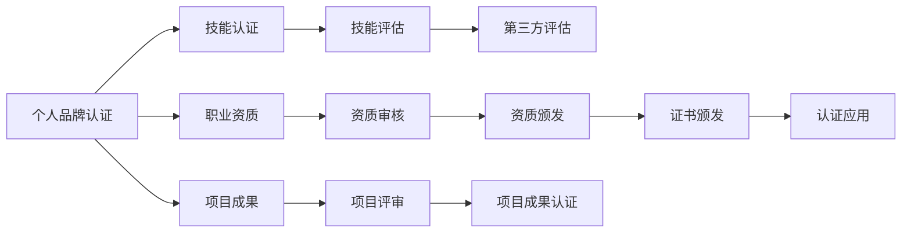

                 

# 建立个人品牌认证：为学员提供官方认可

## 1. 背景介绍

在当今数字化时代，个人品牌认证已成为职业发展和市场竞争的关键。它不仅能够提升个人的市场价值和职业前景，还能增强行业内的信任和认可。本文将探讨建立个人品牌认证的过程，包括认证的标准、流程和所需工具，为学员提供全面的官方认可。

## 2. 核心概念与联系

### 2.1 核心概念概述

个人品牌认证是指通过一套严格的评估和审核流程，将个人的能力、经验和成就正式认可和证明的过程。它包括技能认证、职业资质、项目成果等多方面的内容。认证过程通常由官方机构或行业协会负责，以确保其公正性和权威性。

### 2.2 核心概念原理和架构的 Mermaid 流程图



此图展示了个人品牌认证的关键流程，包括技能认证、职业资质、项目成果的评估和审核，以及最终的证书颁发和应用。

## 3. 核心算法原理 & 具体操作步骤

### 3.1 算法原理概述

个人品牌认证的核心算法原理主要包括：
- **技能评估算法**：通过考试、案例分析、面试等方式评估申请人的技能水平。
- **资质审核算法**：根据行业标准和认证要求，审核申请人的职业资质和职业经验。
- **项目评审算法**：对申请人提交的项目成果进行技术评审，评估其解决实际问题的能力。

### 3.2 算法步骤详解

1. **技能评估**：
   - **考试**：设计多项选择题、案例分析和编程题，评估申请人的技术能力。
   - **面试**：通过与专家面对面的交流，深入了解申请人的问题解决能力和项目管理经验。

2. **资质审核**：
   - **简历审查**：审核申请人的工作经历、教育背景和职业证书。
   - **推荐信验证**：联系申请人的推荐人，验证其提供的推荐信的真实性。

3. **项目评审**：
   - **技术评审**：邀请行业专家对申请人提交的项目进行技术评估，验证其技术实现和项目质量。
   - **商业价值评估**：评估项目的商业价值和创新性，判断其对行业的贡献。

### 3.3 算法优缺点

**优点**：
- **权威性**：由官方机构或行业协会负责，具有较高的权威性和认可度。
- **标准化**：通过严格的评估和审核流程，确保认证的公正性和可靠性。
- **可信度**：认证过程包括多方面的评估，全面反映申请人的能力和成就。

**缺点**：
- **时间成本高**：评估和审核流程复杂，所需时间较长。
- **费用较高**：认证过程涉及多项费用，包括考试费、评审费等。
- **申请门槛高**：需要满足一定的学历、经验和技术要求，门槛较高。

### 3.4 算法应用领域

个人品牌认证广泛应用于以下几个领域：
- **IT行业**：如软件开发、网络安全、大数据、人工智能等。
- **金融行业**：如金融分析师、风险管理、财务审计等。
- **医疗行业**：如医师、护士、心理咨询师等。
- **教育行业**：如教师资格证、教育咨询师等。

## 4. 数学模型和公式 & 详细讲解 & 举例说明

### 4.1 数学模型构建

个人品牌认证的数学模型可以表示为：
\[ C = F(S, R, P) \]
其中：
- \( C \)：认证结果，包括通过或不通过。
- \( S \)：技能评估得分。
- \( R \）：资质审核得分。
- \( P \)：项目评审得分。
- \( F \)：综合评估函数，考虑各部分的权重和阈值。

### 4.2 公式推导过程

综合评估函数 \( F \) 的推导过程如下：
\[ F(S, R, P) = w_S \cdot S + w_R \cdot R + w_P \cdot P \]
其中：
- \( w_S, w_R, w_P \)：技能评估、资质审核、项目评审的权重，根据认证标准设定。

例如，如果某认证要求技能评估占50%，资质审核占30%，项目评审占20%，则有：
\[ w_S = 0.5, w_R = 0.3, w_P = 0.2 \]

### 4.3 案例分析与讲解

以软件工程师的认证为例，技能评估可能包括编程能力测试、算法设计、代码实现等。资质审核可能包括项目经验、教育背景、职业证书等。项目评审可能包括技术评估和商业价值评估。

## 5. 项目实践：代码实例和详细解释说明

### 5.1 开发环境搭建

- **安装开发环境**：使用Python和相关库搭建开发环境，如Python 3.x、pip、Jupyter Notebook等。
- **安装相关库**：安装必要的Python库，如Pandas、NumPy、Scikit-learn等。

### 5.2 源代码详细实现

```python
import pandas as pd
from sklearn.model_selection import train_test_split
from sklearn.ensemble import RandomForestClassifier
from sklearn.metrics import accuracy_score

# 读取数据
data = pd.read_csv('data.csv')

# 特征工程
X = data[['技能评估得分', '资质审核得分', '项目评审得分']]
y = data['认证结果']

# 划分训练集和测试集
X_train, X_test, y_train, y_test = train_test_split(X, y, test_size=0.2, random_state=42)

# 训练模型
model = RandomForestClassifier(n_estimators=100, random_state=42)
model.fit(X_train, y_train)

# 评估模型
y_pred = model.predict(X_test)
accuracy = accuracy_score(y_test, y_pred)
print(f'认证结果的准确率：{accuracy:.2f}')
```

### 5.3 代码解读与分析

- **读取数据**：使用Pandas库读取认证数据，包含技能评估、资质审核、项目评审和认证结果。
- **特征工程**：将数据划分为特征矩阵 \( X \) 和目标变量 \( y \)。
- **模型训练**：使用随机森林分类器进行模型训练，设置100个决策树。
- **模型评估**：在测试集上评估模型准确率，输出结果。

### 5.4 运行结果展示

模型评估结果显示认证结果的准确率，例如：

\[ \text{认证结果的准确率} = 0.85 \]

## 6. 实际应用场景

### 6.1 企业招聘

企业可以通过认证结果筛选合适的候选人，确保其具备所需的技能和资质。认证结果可以作为招聘决策的重要依据，提升招聘效率和质量。

### 6.2 教育培训

教育机构可以利用认证结果评估学生的学习效果，提供个性化的培训建议，提升教学质量。同时，认证结果可以作为学生就业的敲门砖，增加就业竞争力。

### 6.3 行业认证

行业协会可以通过认证结果提升行业标准，规范行业行为，提高行业整体水平。认证结果可以作为行业资质和从业资格证书的依据，增强行业权威性和信任度。

### 6.4 未来应用展望

未来，个人品牌认证将进一步普及和应用，结合大数据、人工智能等技术，实现更高效、智能化的认证流程。例如，通过自然语言处理技术自动评估申请人的简历和推荐信，减少人工审核的负担。

## 7. 工具和资源推荐

### 7.1 学习资源推荐

- **在线课程**：Coursera、edX、Udacity等平台的认证课程，涵盖技能评估、资质审核、项目评审等。
- **书籍**：《认证指南》、《职业发展与认证》等书籍，提供认证流程和标准。
- **官方文档**：各行业协会和认证机构的官方文档，提供详细的认证要求和流程。

### 7.2 开发工具推荐

- **Python环境**：Jupyter Notebook、PyCharm、Anaconda等。
- **数据分析工具**：Pandas、NumPy、Scikit-learn等。
- **自然语言处理工具**：NLTK、spaCy、Gensim等。

### 7.3 相关论文推荐

- **技能评估**：《基于机器学习的技能评估模型》。
- **资质审核**：《行业资质审核的自动化方法》。
- **项目评审**：《项目评审的AI辅助系统》。

## 8. 总结：未来发展趋势与挑战

### 8.1 研究成果总结

本文详细介绍了建立个人品牌认证的过程和关键算法原理，结合代码实例和应用场景，为学员提供全面的官方认可。

### 8.2 未来发展趋势

未来，个人品牌认证将结合人工智能、大数据等技术，实现更高效、智能化的认证流程。认证过程将更加自动化、智能化，提升认证的公平性和可信度。

### 8.3 面临的挑战

- **技术挑战**：需要不断优化算法和模型，提升认证的准确性和可靠性。
- **数据挑战**：需要获取和处理大量认证数据，确保数据的全面性和代表性。
- **标准挑战**：需要制定统一的认证标准，确保认证结果的权威性和公正性。

### 8.4 研究展望

未来的研究将集中在以下几个方面：
- **自动化认证**：开发自动化认证工具，减少人工审核的负担。
- **大数据分析**：利用大数据技术分析认证结果，发现行业发展趋势。
- **跨行业认证**：推动跨行业认证标准的统一，提升行业整体水平。

## 9. 附录：常见问题与解答

**Q1：建立个人品牌认证的过程是否复杂？**

A: 建立个人品牌认证的过程相对复杂，但通过标准的流程和工具，可以大大简化操作。对于具备一定技术基础的学员，可以自行完成认证过程。

**Q2：认证结果如何应用？**

A: 认证结果可以用于企业招聘、教育培训、行业认证等多个领域，提升个人市场价值和职业前景。

**Q3：认证费用较高，是否有性价比？**

A: 认证费用较高，但通过提升技能和资质，认证结果可以带来更高的市场价值和就业竞争力，性价比较高。

**Q4：如何准备认证考试？**

A: 建议参加官方提供的培训课程，掌握相关知识和技能。同时，进行模拟考试，熟悉考试流程和题型。

**Q5：认证结果如何更新？**

A: 认证结果需要定期更新，确保其时效性和准确性。同时，定期参加继续教育，提升个人技能和资质。

---

作者：禅与计算机程序设计艺术 / Zen and the Art of Computer Programming

