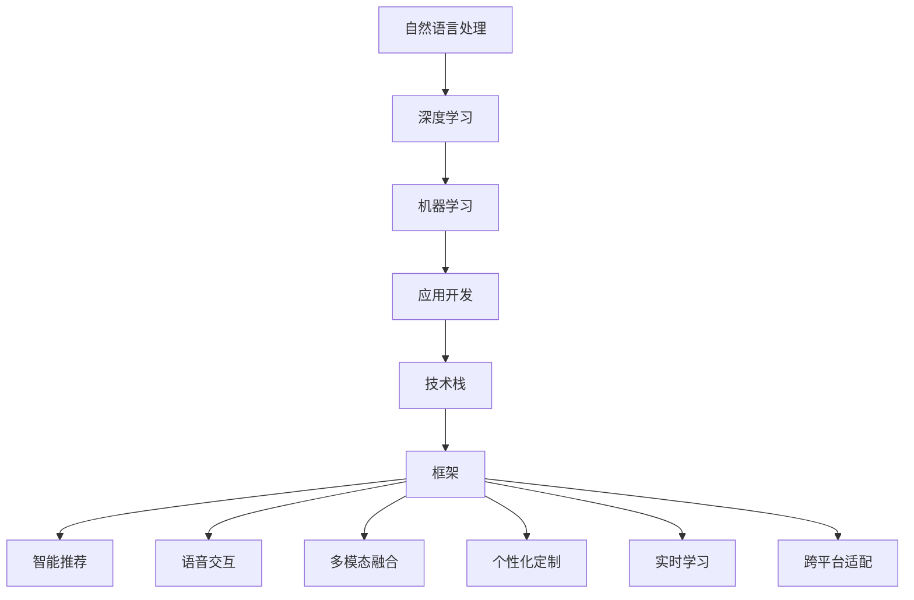

                 

# 开发个人品牌AI助手：提供智能化服务

> 关键词：个人品牌构建,人工智能助手,智能化服务,自然语言处理,NLP,深度学习,机器学习,应用开发,技术栈,框架

## 1. 背景介绍

### 1.1 问题由来
在现代快节奏的商业环境中，个人品牌变得越来越重要。有效的个人品牌能够提升个人的影响力和竞争力，为职业发展带来诸多便利。然而，构建和维护一个强有力的个人品牌需要耗费大量时间和精力，尤其是在频繁的日常沟通和社交媒体互动中。此时，一个智能化的AI助手就变得至关重要。

AI助手的出现，能够自动化处理各种日常任务，包括邮件管理、日程安排、社交媒体互动等，极大地提高了个人品牌的运营效率。本文将从技术角度探讨如何开发一个能够提供智能化服务的个人品牌AI助手。

### 1.2 问题核心关键点
- **智能推荐**：AI助手能够根据用户行为和上下文，智能推荐邮件回复、社交媒体内容等。
- **语音交互**：通过语音识别和合成技术，用户可以以自然流畅的方式与AI助手交互。
- **多模态融合**：整合文字、图片、视频等多种数据形式，提升AI助手的理解和回复能力。
- **个性化定制**：根据用户偏好和历史行为，定制个性化的服务方案。
- **实时学习**：利用用户反馈和实时数据，不断优化和提升AI助手的能力。
- **跨平台适配**：支持多设备、多平台的无缝集成，提供一致的用户体验。

## 2. 核心概念与联系

### 2.1 核心概念概述

为了更好地理解开发个人品牌AI助手的技术细节，本节将介绍几个关键核心概念：

- **自然语言处理 (Natural Language Processing, NLP)**：通过计算机技术实现人类语言和计算机语言之间的转换，包括文本分类、情感分析、语义理解等。
- **深度学习 (Deep Learning)**：一种基于神经网络的学习方法，能够自动从大量数据中学习出复杂的特征表示。
- **机器学习 (Machine Learning)**：通过算法让计算机从数据中学习规律，并进行预测或决策。
- **应用开发 (Application Development)**：将软件需求转换为计算机程序的过程，涵盖需求分析、设计、编码、测试、部署等多个环节。
- **技术栈 (Technology Stack)**：开发项目所使用的各类技术和工具，包括编程语言、框架、库等。
- **框架 (Framework)**：提供代码重用和系统架构的抽象，帮助开发者快速开发应用。

这些概念相互关联，共同构成了开发个人品牌AI助手的技术基础。

### 2.2 核心概念原理和架构的 Mermaid 流程图



这个流程图展示了各个核心概念之间的联系：

1. **自然语言处理**：作为AI助手的基础，提供文本分析、理解等功能。
2. **深度学习**：通过神经网络模型学习语言表示，支持自然语言处理。
3. **机器学习**：在AI助手中用于数据挖掘、模型训练和优化。
4. **应用开发**：将AI助手的各项功能转化为可用的软件系统。
5. **技术栈**：包括所需的编程语言、工具和库，支持应用开发。
6. **框架**：提供系统架构和组件，加速应用开发。
7. **智能推荐**、**语音交互**、**多模态融合**、**个性化定制**、**实时学习**和**跨平台适配**：具体应用功能，通过NLP、深度学习和机器学习等技术实现。

## 3. 核心算法原理 & 具体操作步骤

### 3.1 算法原理概述

一个能够提供智能化服务的个人品牌AI助手，其核心算法可以大致分为以下几个部分：

1. **文本分类**：对输入的文本进行分类，如将邮件分为紧急、重要等类别。
2. **情感分析**：分析文本中的情感倾向，如判断用户情绪是积极还是消极。
3. **语义理解**：理解文本的语义含义，识别出关键信息。
4. **意图识别**：确定用户意图，如是否希望预约会议、安排日程等。
5. **智能推荐**：根据用户历史行为和上下文，推荐邮件回复、社交媒体内容等。
6. **语音交互**：将用户的语音输入转换为文本，并将文本输出转换为语音。
7. **多模态融合**：整合文字、图片、视频等多种数据形式，提升理解和回复能力。
8. **个性化定制**：根据用户偏好和历史行为，定制个性化的服务方案。
9. **实时学习**：利用用户反馈和实时数据，不断优化和提升AI助手的能力。
10. **跨平台适配**：支持多设备、多平台的无缝集成，提供一致的用户体验。

### 3.2 算法步骤详解

开发个人品牌AI助手主要涉及以下几个步骤：

**Step 1: 需求分析和设计**

- 收集需求文档，明确AI助手的功能和性能指标。
- 设计系统架构，包括前端、后端、数据层等组件。

**Step 2: 数据收集与预处理**

- 收集和整理用户的邮件、日程、社交媒体数据等。
- 进行数据清洗和标注，准备训练数据集。

**Step 3: 模型训练与优化**

- 使用深度学习模型进行训练，如BERT、GPT等。
- 优化模型参数，提升准确率和效率。
- 进行超参数调优，选择最优模型。

**Step 4: 系统集成与测试**

- 将训练好的模型集成到应用中。
- 进行单元测试、集成测试和系统测试。
- 修复发现的问题，确保系统稳定可靠。

**Step 5: 部署与运维**

- 将系统部署到服务器或云平台。
- 监控系统运行状态，及时处理异常。
- 根据用户反馈进行持续优化。

### 3.3 算法优缺点

开发个人品牌AI助手的方法具有以下优点：

1. **提高效率**：自动化处理各种日常任务，减少人工操作，提升效率。
2. **提升准确性**：利用深度学习和机器学习技术，提升分类、推荐等功能的准确性。
3. **增强个性化**：根据用户偏好和历史行为，提供定制化的服务。
4. **实时更新**：利用实时数据进行学习，保持功能的最新性。

同时，该方法也存在一些缺点：

1. **数据依赖**：需要大量标注数据进行训练，数据收集和标注工作量大。
2. **模型复杂**：深度学习模型参数量大，计算资源消耗高。
3. **系统维护**：需要持续优化和维护，确保系统的稳定性和可靠性。

### 3.4 算法应用领域

个人品牌AI助手的应用领域非常广泛，以下是几个典型场景：

1. **个人邮件管理**：自动化分类、归档、回复邮件，提升邮件处理效率。
2. **社交媒体管理**：自动发布、回复、监测社交媒体互动，提升社交影响力。
3. **日程安排**：自动生成日程、提醒、优化会议安排，提高时间管理能力。
4. **个性化推荐**：根据用户历史行为，推荐文章、书籍、商品等，提升用户体验。
5. **实时客服**：通过语音或文本交互，实时解决用户问题，提供优质服务。
6. **内容创作**：根据用户偏好，自动生成文本、图片、视频等创意内容，提升创意产出效率。
7. **跨平台集成**：多设备、多平台无缝集成，提供一致的用户体验。

## 4. 数学模型和公式 & 详细讲解 & 举例说明

### 4.1 数学模型构建

我们以邮件分类任务为例，介绍一个基本的文本分类模型。设文本为 $x$，标签为 $y$，分类器的预测为 $f(x)$，则模型训练的目标是最小化损失函数 $\mathcal{L}$：

$$
\mathcal{L}(f(x), y) = -\log f(x|y)
$$

假设模型采用深度神经网络，其输出层有 $k$ 个神经元，对应 $k$ 个可能的标签。使用交叉熵损失函数，可得：

$$
\mathcal{L} = -\frac{1}{N}\sum_{i=1}^N \sum_{j=1}^k y_{ij} \log f(x_i|j)
$$

其中 $y_{ij}$ 表示样本 $i$ 属于标签 $j$ 的概率，$f(x_i|j)$ 表示模型预测样本 $x_i$ 属于标签 $j$ 的概率。

### 4.2 公式推导过程

以下是交叉熵损失函数的推导过程：

设样本 $x_i$ 属于标签 $j$ 的概率为 $p_{ij}$，模型预测的概率为 $q_{ij}$，则交叉熵损失函数可表示为：

$$
\mathcal{L}_{ij} = -p_{ij}\log q_{ij} - (1-p_{ij})\log (1-q_{ij})
$$

对于整个样本集 $D=\{(x_i,y_i)\}_{i=1}^N$，则经验风险为：

$$
\mathcal{L} = \frac{1}{N}\sum_{i=1}^N \mathcal{L}_{ij}
$$

使用反向传播算法，计算损失函数对模型参数的梯度，并更新参数以最小化损失函数。

### 4.3 案例分析与讲解

以下是一个邮件分类任务的案例分析：

假设我们要训练一个邮件分类模型，将其分为紧急和非紧急两类。我们收集了1000封邮件作为训练数据，每封邮件的文本 $x_i$ 和标签 $y_i$。使用深度神经网络作为分类器，通过反向传播算法最小化交叉熵损失函数。

- **数据准备**：对邮件文本进行预处理，包括分词、去除停用词、词向量化等。
- **模型选择**：选择适合邮件分类的深度神经网络结构，如BERT、GPT等。
- **训练过程**：使用训练数据集进行模型训练，每轮迭代计算损失函数对模型参数的梯度，并更新参数。
- **验证和测试**：在验证集和测试集上评估模型性能，判断模型泛化能力。

最终，我们得到了一个能够准确区分紧急邮件和非紧急邮件的模型，可以应用于个人品牌AI助手中，自动分类和处理邮件。

## 5. 项目实践：代码实例和详细解释说明

### 5.1 开发环境搭建

在进行AI助手开发前，我们需要准备好开发环境。以下是使用Python进行开发的环境配置流程：

1. 安装Anaconda：从官网下载并安装Anaconda，用于创建独立的Python环境。

2. 创建并激活虚拟环境：
```bash
conda create -n ai_assistant python=3.8 
conda activate ai_assistant
```

3. 安装深度学习库：
```bash
pip install tensorflow
pip install pytorch
```

4. 安装NLP库：
```bash
pip install nltk
pip install spacy
```

5. 安装框架：
```bash
pip install transformers
```

6. 安装其他库：
```bash
pip install pandas matplotlib scikit-learn tqdm jupyter notebook ipython
```

完成上述步骤后，即可在`ai_assistant`环境中开始AI助手的开发。

### 5.2 源代码详细实现

这里我们以邮件分类任务为例，给出使用Transformer库进行模型训练的PyTorch代码实现。

首先，定义邮件分类任务的数据处理函数：

```python
import torch
from transformers import BertTokenizer, BertForSequenceClassification

class EmailDataset(Dataset):
    def __init__(self, texts, labels, tokenizer, max_len=128):
        self.texts = texts
        self.labels = labels
        self.tokenizer = tokenizer
        self.max_len = max_len
        
    def __len__(self):
        return len(self.texts)
    
    def __getitem__(self, item):
        text = self.texts[item]
        label = self.labels[item]
        
        encoding = self.tokenizer(text, return_tensors='pt', max_length=self.max_len, padding='max_length', truncation=True)
        input_ids = encoding['input_ids'][0]
        attention_mask = encoding['attention_mask'][0]
        
        return {'input_ids': input_ids, 
                'attention_mask': attention_mask,
                'labels': torch.tensor(label, dtype=torch.long)}
```

然后，定义模型和优化器：

```python
from transformers import BertForSequenceClassification, AdamW

model = BertForSequenceClassification.from_pretrained('bert-base-cased', num_labels=2)

optimizer = AdamW(model.parameters(), lr=2e-5)
```

接着，定义训练和评估函数：

```python
from torch.utils.data import DataLoader
from tqdm import tqdm
from sklearn.metrics import classification_report

device = torch.device('cuda') if torch.cuda.is_available() else torch.device('cpu')
model.to(device)

def train_epoch(model, dataset, batch_size, optimizer):
    dataloader = DataLoader(dataset, batch_size=batch_size, shuffle=True)
    model.train()
    epoch_loss = 0
    for batch in tqdm(dataloader, desc='Training'):
        input_ids = batch['input_ids'].to(device)
        attention_mask = batch['attention_mask'].to(device)
        labels = batch['labels'].to(device)
        model.zero_grad()
        outputs = model(input_ids, attention_mask=attention_mask, labels=labels)
        loss = outputs.loss
        epoch_loss += loss.item()
        loss.backward()
        optimizer.step()
    return epoch_loss / len(dataloader)

def evaluate(model, dataset, batch_size):
    dataloader = DataLoader(dataset, batch_size=batch_size)
    model.eval()
    preds, labels = [], []
    with torch.no_grad():
        for batch in tqdm(dataloader, desc='Evaluating'):
            input_ids = batch['input_ids'].to(device)
            attention_mask = batch['attention_mask'].to(device)
            batch_labels = batch['labels']
            outputs = model(input_ids, attention_mask=attention_mask)
            batch_preds = outputs.logits.argmax(dim=2).to('cpu').tolist()
            batch_labels = batch_labels.to('cpu').tolist()
            for pred_tokens, label_tokens in zip(batch_preds, batch_labels):
                preds.append(pred_tokens[:len(label_tokens)])
                labels.append(label_tokens)
                
    print(classification_report(labels, preds))
```

最后，启动训练流程并在测试集上评估：

```python
epochs = 5
batch_size = 16

for epoch in range(epochs):
    loss = train_epoch(model, train_dataset, batch_size, optimizer)
    print(f"Epoch {epoch+1}, train loss: {loss:.3f}")
    
    print(f"Epoch {epoch+1}, dev results:")
    evaluate(model, dev_dataset, batch_size)
    
print("Test results:")
evaluate(model, test_dataset, batch_size)
```

以上就是使用PyTorch进行邮件分类任务的完整代码实现。可以看到，Transformer库提供了便捷的API，使得模型训练和评估变得简单高效。

### 5.3 代码解读与分析

让我们再详细解读一下关键代码的实现细节：

**EmailDataset类**：
- `__init__`方法：初始化文本、标签、分词器等关键组件。
- `__len__`方法：返回数据集的样本数量。
- `__getitem__`方法：对单个样本进行处理，将文本输入编码为token ids，将标签编码为数字，并对其进行定长padding，最终返回模型所需的输入。

**BertForSequenceClassification模型**：
- `from_pretrained`方法：从预训练模型库中加载BERT模型，自动初始化权重。
- `num_labels`参数：指定分类任务可能的标签数。

**训练和评估函数**：
- 使用PyTorch的DataLoader对数据集进行批次化加载，供模型训练和推理使用。
- 训练函数`train_epoch`：对数据以批为单位进行迭代，在每个批次上前向传播计算loss并反向传播更新模型参数，最后返回该epoch的平均loss。
- 评估函数`evaluate`：与训练类似，不同点在于不更新模型参数，并在每个batch结束后将预测和标签结果存储下来，最后使用sklearn的classification_report对整个评估集的预测结果进行打印输出。

**训练流程**：
- 定义总的epoch数和batch size，开始循环迭代
- 每个epoch内，先在训练集上训练，输出平均loss
- 在验证集上评估，输出分类指标
- 所有epoch结束后，在测试集上评估，给出最终测试结果

可以看到，PyTorch配合Transformer库使得邮件分类任务的代码实现变得简洁高效。开发者可以将更多精力放在数据处理、模型改进等高层逻辑上，而不必过多关注底层的实现细节。

当然，工业级的系统实现还需考虑更多因素，如模型的保存和部署、超参数的自动搜索、更灵活的任务适配层等。但核心的训练范式基本与此类似。

## 6. 实际应用场景

### 6.1 智能邮件管理

智能邮件管理是AI助手的重要应用场景之一。一个高效的AI助手能够自动分类、归档和回复邮件，帮助用户快速处理海量邮件。

在技术实现上，我们可以利用上述邮件分类任务中的模型，对用户发送和接收的邮件进行分类和整理。利用NLP技术，模型能够识别出邮件中的关键信息和情感倾向，自动将邮件分为紧急、重要等类别，并给出相应的处理建议。

例如，对于包含用户日程安排、会议邀请的邮件，模型能够自动标注并推送提醒，确保用户不错过任何重要事项。对于包含用户反馈或投诉的邮件，模型能够自动识别并分类，帮助用户快速响应和处理。

### 6.2 社交媒体管理

社交媒体管理是另一个重要的应用场景。AI助手能够帮助用户自动发布、回复和管理社交媒体内容，提升社交影响力。

在技术实现上，我们可以利用自然语言生成和情感分析技术，自动撰写和回复社交媒体帖子。利用多模态融合技术，模型能够同时分析文字、图片、视频等多种形式的内容，提供更加全面和精准的分析和建议。

例如，对于用户发布的文本帖子，模型能够自动生成配图或视频，提升帖子的吸引力和互动性。对于用户的评论和回复，模型能够自动分析情感倾向，并提供合适的回复建议，帮助用户维护良好的社交关系。

### 6.3 日程安排

日程安排是AI助手在日常工作中扮演的重要角色。一个智能化的AI助手能够自动生成日程、提醒和优化会议安排，提高时间管理能力。

在技术实现上，我们可以利用智能推荐和语义理解技术，自动推荐合适的时间和地点进行会议。利用个性化定制和实时学习技术，模型能够根据用户的历史行为和偏好，提供定制化的会议安排和提醒。

例如，对于用户提出的会议请求，模型能够自动推荐合适的时间和地点，并根据用户的反馈进行优化。对于用户的日程安排，模型能够自动生成提醒，确保用户按时参加重要会议和活动。

## 7. 工具和资源推荐

### 7.1 学习资源推荐

为了帮助开发者系统掌握AI助手的开发技术，这里推荐一些优质的学习资源：

1. **《深度学习》课程**：斯坦福大学开设的深度学习课程，涵盖深度学习的基本概念、模型架构和优化算法，是学习深度学习的绝佳入门材料。
2. **《自然语言处理》书籍**：涵盖了NLP的各个领域，从基础文本处理到高级语义理解，适合进阶学习。
3. **《Python深度学习》书籍**：介绍了深度学习在Python环境下的实现，包含大量代码示例和项目实践。
4. **Transformers官方文档**：提供了丰富的模型和工具介绍，适合快速上手学习。
5. **GitHub开源项目**：大量开源NLP项目和代码库，适合学习和参考。

通过对这些资源的学习实践，相信你一定能够快速掌握AI助手的开发技术，并应用于实际项目中。

### 7.2 开发工具推荐

高效的开发离不开优秀的工具支持。以下是几款用于AI助手开发的常用工具：

1. **PyTorch**：基于Python的开源深度学习框架，灵活动态的计算图，适合快速迭代研究。
2. **TensorFlow**：由Google主导开发的开源深度学习框架，生产部署方便，适合大规模工程应用。
3. **Transformers库**：提供了多种预训练模型和工具，适合快速搭建NLP系统。
4. **Weights & Biases**：模型训练的实验跟踪工具，可以记录和可视化模型训练过程中的各项指标，方便对比和调优。
5. **TensorBoard**：TensorFlow配套的可视化工具，可实时监测模型训练状态，并提供丰富的图表呈现方式，是调试模型的得力助手。

合理利用这些工具，可以显著提升AI助手开发的效率，加快创新迭代的步伐。

### 7.3 相关论文推荐

AI助手的发展源于学界的持续研究。以下是几篇奠基性的相关论文，推荐阅读：

1. **Attention is All You Need**：提出了Transformer结构，开启了NLP领域的预训练大模型时代。
2. **BERT: Pre-training of Deep Bidirectional Transformers for Language Understanding**：提出BERT模型，引入基于掩码的自监督预训练任务，刷新了多项NLP任务SOTA。
3. **Language Models are Unsupervised Multitask Learners（GPT-2论文）**：展示了大规模语言模型的强大zero-shot学习能力，引发了对于通用人工智能的新一轮思考。
4. **Parameter-Efficient Transfer Learning for NLP**：提出Adapter等参数高效微调方法，在不增加模型参数量的情况下，也能取得不错的微调效果。
5. **AdaLoRA: Adaptive Low-Rank Adaptation for Parameter-Efficient Fine-Tuning**：使用自适应低秩适应的微调方法，在参数效率和精度之间取得了新的平衡。

这些论文代表了大语言模型微调技术的发展脉络。通过学习这些前沿成果，可以帮助研究者把握学科前进方向，激发更多的创新灵感。

## 8. 总结：未来发展趋势与挑战

### 8.1 总结

本文对开发个人品牌AI助手的方法进行了全面系统的介绍。首先阐述了AI助手的背景和意义，明确了其在提升个人品牌运营效率中的重要作用。其次，从原理到实践，详细讲解了AI助手开发的关键技术点，包括自然语言处理、深度学习、机器学习、应用开发、技术栈和框架等，给出了一个完整的开发流程。同时，本文还探讨了AI助手在邮件管理、社交媒体管理、日程安排等多个场景中的应用，展示了其广泛的适用性和巨大的潜力。最后，本文推荐了相关的学习资源、开发工具和论文，为开发者提供了全面的技术指引。

通过本文的系统梳理，可以看到，开发个人品牌AI助手不仅需要掌握NLP、深度学习和机器学习等核心技术，还需要整合多个学科的知识，构建跨领域的解决方案。只有在多个维度协同发力，才能真正实现AI助手的智能化和高效化，提升个人品牌的影响力和竞争力。

### 8.2 未来发展趋势

展望未来，AI助手的发展将呈现以下几个趋势：

1. **智能化程度提升**：随着深度学习模型的不断进步，AI助手的智能化水平将逐步提升，能够处理更加复杂和多样的任务。
2. **个性化定制增强**：AI助手将能够根据用户的历史行为和偏好，提供更加定制化和个性化的服务。
3. **多模态融合深入**：AI助手将整合文字、图片、视频等多种数据形式，提升理解和回复能力。
4. **实时学习能力加强**：AI助手将能够利用实时数据进行学习，保持功能的最新性。
5. **跨平台集成普及**：AI助手将支持多设备、多平台的无缝集成，提供一致的用户体验。
6. **计算效率优化**：AI助手将采用更加高效的数据结构和算法，优化计算资源消耗。
7. **模型压缩和优化**：AI助手将采用模型压缩和优化技术，提升推理速度和资源利用率。

以上趋势凸显了AI助手发展的广阔前景。这些方向的探索发展，必将进一步提升AI助手的性能和用户体验，为个人品牌运营带来新的机遇和挑战。

### 8.3 面临的挑战

尽管AI助手已经取得了显著进展，但在迈向更加智能化、普适化应用的过程中，它仍面临着诸多挑战：

1. **数据隐私和安全**：AI助手需要处理大量个人数据，如何保障数据隐私和安全成为重要问题。
2. **模型偏见和公平性**：AI助手可能会学习到数据中的偏见，导致输出结果不公平或有害。
3. **系统鲁棒性不足**：AI助手面对异常数据或输入时，可能会发生错误或失效。
4. **实时性要求高**：AI助手需要快速响应，确保用户体验流畅。
5. **用户接受度低**：用户可能对AI助手的效果和安全性存在疑虑，难以接受。

正视AI助手面临的这些挑战，积极应对并寻求突破，将是大语言模型微调走向成熟的必由之路。相信随着学界和产业界的共同努力，这些挑战终将一一被克服，AI助手必将在构建人机协同的智能时代中扮演越来越重要的角色。

### 8.4 研究展望

面对AI助手所面临的挑战，未来的研究需要在以下几个方面寻求新的突破：

1. **隐私保护和数据安全**：开发隐私保护和数据安全技术，确保用户数据的安全性和隐私性。
2. **模型公平和透明**：研究模型公平和透明算法，减少偏见和歧视，确保输出结果公正。
3. **系统鲁棒性和鲁棒性分析**：开发鲁棒性分析工具，识别和修复模型漏洞，提升系统的稳定性和安全性。
4. **实时学习机制**：研究实时学习机制，利用实时数据进行动态调整，保持模型的最新性。
5. **用户交互和反馈**：研究用户交互和反馈机制，提升用户接受度和满意度。
6. **多模态融合技术**：研究多模态融合技术，提升AI助手的综合感知能力。

这些研究方向的探索，必将引领AI助手技术迈向更高的台阶，为构建安全、可靠、可解释、可控的智能系统铺平道路。面向未来，AI助手还需要与其他人工智能技术进行更深入的融合，如知识表示、因果推理、强化学习等，多路径协同发力，共同推动自然语言理解和智能交互系统的进步。只有勇于创新、敢于突破，才能不断拓展AI助手的边界，让智能技术更好地造福人类社会。

## 9. 附录：常见问题与解答

**Q1：AI助手是否适用于所有场景？**

A: AI助手在大多数场景下都能够提供智能化服务，特别是在需要自动化处理日常任务和提升沟通效率的领域。但对于一些需要高度专业知识和判断的领域，如医疗、法律等，AI助手可能难以完全替代人类专家的角色。

**Q2：如何提升AI助手的准确性和鲁棒性？**

A: 提升AI助手的准确性和鲁棒性需要从数据、模型和算法等多个方面入手：
1. 数据方面，确保数据集的多样性和质量，避免过拟合和数据偏见。
2. 模型方面，选择适当的模型架构和超参数，进行充分的模型训练和调优。
3. 算法方面，引入正则化、对抗训练等技术，提升模型的鲁棒性和泛化能力。

**Q3：AI助手在部署和维护过程中需要注意哪些问题？**

A: AI助手在部署和维护过程中需要注意以下几个问题：
1. 模型裁剪和量化：去除不必要的层和参数，减小模型尺寸，加快推理速度。
2. 部署优化：采用高性能计算平台，如GPU、TPU等，优化模型性能。
3. 系统监控和维护：实时监控系统运行状态，及时处理异常和问题，确保系统稳定可靠。

**Q4：AI助手如何实现个性化定制？**

A: AI助手实现个性化定制需要以下几个步骤：
1. 收集用户的历史行为数据，如邮件内容、社交媒体互动、日程安排等。
2. 利用机器学习技术，分析用户的行为模式和偏好，生成用户画像。
3. 根据用户画像，定制个性化的服务方案，如邮件推荐、日程安排等。
4. 定期更新用户画像和推荐模型，确保服务的最新性和准确性。

**Q5：AI助手在跨平台集成时需要注意哪些问题？**

A: AI助手在跨平台集成时需要注意以下几个问题：
1. 数据格式和传输协议的统一，确保不同平台的数据一致性和安全性。
2. 用户界面和交互的一致性，确保用户在不同设备上的体验一致。
3. 系统架构和组件的兼容性，确保不同平台上的应用兼容。

通过合理处理这些问题，可以确保AI助手在不同平台上的无缝集成，提供一致的用户体验。

---

作者：禅与计算机程序设计艺术 / Zen and the Art of Computer Programming

