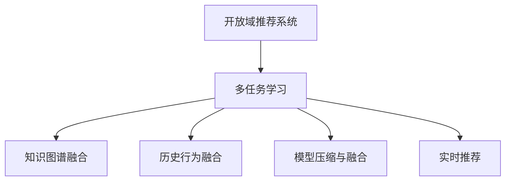

                 

# 开放域推荐系统的探索之旅：M6-Rec框架介绍

## 1. 背景介绍

在当今信息爆炸的时代，推荐系统已经成为互联网产品不可或缺的一部分。从电商购物到视频娱乐，从社交网络到新闻阅读，推荐系统无处不在，用户早已习惯通过推荐系统获取个性化内容。然而，传统推荐系统通常基于用户历史行为数据进行推荐，难以全面捕捉用户的兴趣和偏好。而开放域推荐系统则是解决这一问题的有力工具，通过结合用户历史数据和外部知识库，实现更加全面和准确的推荐。

本文将介绍一款开源的开放域推荐系统框架——M6-Rec，它由腾讯推荐与广告部门开源，旨在构建高性能、灵活可扩展的推荐系统。M6-Rec以其高效多任务学习、模型压缩与融合、实时推荐等特性，成为业界推荐系统的重要参考。接下来，我们将系统介绍M6-Rec的原理、架构和实践方法，帮助读者全面理解其技术细节和应用潜力。

## 2. 核心概念与联系

### 2.1 核心概念概述

为了更好地理解M6-Rec框架，首先介绍几个关键概念：

- 推荐系统(Recommender System)：根据用户历史行为、兴趣偏好、社会关系等数据，推荐用户可能感兴趣的产品或内容的技术系统。推荐系统广泛应用在电商、新闻、音乐、视频等多个领域。

- 开放域推荐系统(Open-Domain Recommender System)：基于知识图谱、百科全书、新闻摘要等外部知识库，结合用户历史行为数据进行推荐，提升推荐的全面性和准确性。

- 多任务学习(Multi-task Learning)：利用用户不同的需求和偏好，同时学习多个推荐任务，提升模型在多任务上的表现。

- 模型压缩与融合(Compression & Fusion)：通过剪枝、量化等方法减少模型参数，同时结合多种模型融合提升性能。

- 实时推荐(Real-time Recommendation)：在用户访问页面或进行查询时，实时计算推荐结果，提供即时个性化服务。

### 2.2 核心概念原理和架构的 Mermaid 流程图



此图展示了开放域推荐系统的主要组件和技术架构：

1. 多任务学习：通过学习多个推荐任务，提升模型对用户不同需求的理解。
2. 知识图谱融合：将知识图谱中的实体和关系与用户行为数据结合，提升推荐的全面性。
3. 历史行为融合：将用户的历史行为数据与实时查询数据结合，提供更精准的推荐。
4. 模型压缩与融合：通过剪枝、量化等技术减少模型大小，同时结合多种模型提升性能。
5. 实时推荐：在用户访问页面或进行查询时，实时计算推荐结果，提供即时个性化服务。

## 3. 核心算法原理 & 具体操作步骤

### 3.1 算法原理概述

M6-Rec框架的核心算法原理基于深度多任务学习，结合知识图谱和实时数据进行推荐。具体而言，M6-Rec包括以下几个关键步骤：

1. **数据预处理**：将用户历史行为数据和知识图谱中的实体、关系进行预处理，构建适合深度学习的输入格式。
2. **多任务学习**：通过多任务学习，同时学习多个推荐任务，提升模型在多任务上的泛化能力。
3. **模型压缩与融合**：对学习得到的模型进行剪枝、量化等操作，减少模型大小和计算开销，同时融合多个模型的优势提升性能。
4. **实时推荐**：在用户进行查询或访问时，实时计算推荐结果，提供即时个性化服务。

### 3.2 算法步骤详解

**Step 1: 数据预处理**

数据预处理是开放域推荐系统的重要环节，涉及用户历史行为数据和知识图谱的整合。具体步骤如下：

1. **数据收集**：收集用户历史行为数据（如浏览记录、点击记录、购买记录等）和知识图谱数据（如维基百科、百度百科等）。
2. **数据清洗**：去除数据中的噪声和异常值，处理缺失值，提升数据质量。
3. **实体嵌入**：将知识图谱中的实体和关系进行嵌入，生成稠密的向量表示。
4. **特征工程**：将用户行为数据和实体嵌入进行拼接，生成输入特征向量。

**Step 2: 多任务学习**

多任务学习是M6-Rec的核心技术之一，通过同时学习多个推荐任务，提升模型在多任务上的表现。具体步骤如下：

1. **任务定义**：定义多个推荐任务，如推荐商品、推荐新闻、推荐视频等。
2. **共享表示学习**：设计共享表示层，同时学习多个任务的表示。
3. **任务特定层**：在共享表示层之上，增加任务特定的表示层，针对不同任务进行微调。
4. **联合训练**：将多个任务的目标函数进行联合优化，提升整体性能。

**Step 3: 模型压缩与融合**

模型压缩与融合是提升推荐系统性能的关键技术，通过剪枝、量化等方法减少模型大小，同时融合多种模型提升性能。具体步骤如下：

1. **剪枝**：删除不必要的权重和连接，减少模型参数。
2. **量化**：将浮点数参数转化为固定点数的整数或低精度参数，减少存储空间和计算开销。
3. **融合**：通过权重平均、softmax融合等方式，将多个模型的预测结果结合，提升性能。

**Step 4: 实时推荐**

实时推荐技术使得推荐系统能够快速响应用户查询，提供个性化服务。具体步骤如下：

1. **实时数据采集**：在用户进行查询或访问时，实时采集用户行为数据和系统上下文信息。
2. **在线学习**：利用在线学习算法，根据用户实时行为进行模型更新。
3. **推荐计算**：根据更新后的模型，实时计算推荐结果。
4. **反馈更新**：根据用户反馈数据，对模型进行进一步调整。

### 3.3 算法优缺点

M6-Rec框架在开放域推荐系统中表现出色，但也存在一些局限性：

**优点**：
1. **多任务学习**：同时学习多个推荐任务，提升模型在多任务上的泛化能力。
2. **模型压缩与融合**：通过剪枝和量化减少模型大小，同时结合多种模型提升性能。
3. **实时推荐**：在用户进行查询时，实时计算推荐结果，提供即时个性化服务。

**缺点**：
1. **复杂度高**：多任务学习、模型压缩与融合等技术较为复杂，需要较高的工程能力和计算资源。
2. **数据需求大**：需要大量的用户行为数据和知识图谱数据，数据获取和预处理成本较高。
3. **模型更新频繁**：实时推荐需要频繁更新模型，模型稳定性和可解释性较差。

### 3.4 算法应用领域

M6-Rec框架在多个领域具有广泛的应用潜力，包括：

- 电商推荐：结合用户购买记录和商品信息，推荐个性化商品。
- 内容推荐：根据用户浏览历史和内容标签，推荐个性化文章、视频、音乐等。
- 社交推荐：结合用户社交关系和兴趣偏好，推荐个性化好友、群组等。
- 广告推荐：根据用户行为数据和兴趣偏好，推荐个性化广告。
- 娱乐推荐：结合用户行为数据和电影、音乐、游戏等相关信息，推荐个性化娱乐内容。

## 4. 数学模型和公式 & 详细讲解 & 举例说明

### 4.1 数学模型构建

M6-Rec框架的数学模型主要基于深度神经网络和多任务学习构建。假设用户历史行为数据为 $X=\{x_i\}$，知识图谱数据为 $G=\{g_i\}$，推荐任务为 $T=\{t_k\}$。

**输入表示**：
- 用户行为数据 $X=\{x_i\}$，其中 $x_i$ 表示用户第 $i$ 次的行为，可以表示为用户点击、浏览、购买等行为。
- 知识图谱数据 $G=\{g_i\}$，其中 $g_i$ 表示知识图谱中的实体和关系，可以表示为三元组 $(o_i, r_i, t_i)$。

**输出表示**：
- 推荐结果 $y$，表示推荐商品、文章、广告等。

**模型表示**：
- 多任务学习模型 $M=\{M_k\}$，其中 $M_k$ 表示第 $k$ 个推荐任务的学习模型。

### 4.2 公式推导过程

假设用户行为数据 $X$ 和知识图谱数据 $G$ 分别编码为 $X^e$ 和 $G^e$，推荐任务为 $T=\{t_k\}$，多任务学习模型为 $M=\{M_k\}$。

1. **输入表示**：
   $$
   X^e = \{x^e_i\}_{i=1}^{N_X}, \quad g^e_i = \{o^e_i, r^e_i, t^e_i\}
   $$

2. **多任务学习**：
   $$
   M_k(X^e, G^e) = \{m^e_k(x_i)\}_{i=1}^{N_X}
   $$

3. **联合训练**：
   $$
   \min_{M_k} \sum_{k \in T} \mathcal{L}_k(M_k, x^e_i, y^e_i) + \lambda \mathcal{R}(M_k, M_j)
   $$

其中 $\mathcal{L}_k$ 表示第 $k$ 个推荐任务的损失函数，$\mathcal{R}$ 表示模型间的正则化损失，$\lambda$ 为正则化系数。

### 4.3 案例分析与讲解

以电商推荐为例，用户浏览商品历史数据 $X=\{x_i\}$ 和知识图谱数据 $G=\{g_i\}$，推荐任务为 $T=\{t_k\}$，包括推荐商品 $t_1$、推荐用户评价 $t_2$ 和推荐广告 $t_3$。

1. **数据预处理**：
   - 收集用户浏览记录 $X=\{x_i\}$ 和商品信息 $G=\{g_i\}$。
   - 对数据进行清洗和缺失值处理。
   - 对商品和用户进行实体嵌入，生成稠密向量 $X^e$ 和 $G^e$。

2. **多任务学习**：
   - 定义推荐任务 $T=\{t_k\}$，包括推荐商品 $t_1$、推荐用户评价 $t_2$ 和推荐广告 $t_3$。
   - 设计共享表示层 $M_0$，学习用户行为和商品特征的共同表示。
   - 增加任务特定层 $M_1$ 和 $M_2$，针对推荐商品和推荐广告进行微调。
   - 联合优化损失函数 $\mathcal{L} = \mathcal{L}_1 + \lambda(\mathcal{L}_2 + \mathcal{L}_3)$。

3. **模型压缩与融合**：
   - 对学习得到的模型进行剪枝，减少不重要的权重。
   - 对权重进行量化，减少存储空间和计算开销。
   - 采用权重平均或 softmax 融合，将多个模型的预测结果结合。

4. **实时推荐**：
   - 实时采集用户查询数据 $x_q$ 和系统上下文信息 $g_q$。
   - 利用在线学习算法，根据用户实时行为更新模型 $M_q$。
   - 计算推荐结果 $y_q$，提供个性化服务。

## 5. 项目实践：代码实例和详细解释说明

### 5.1 开发环境搭建

在进行M6-Rec框架的实践前，需要准备相应的开发环境。以下是搭建环境的具体步骤：

1. **安装Python**：
   ```bash
   sudo apt-get update
   sudo apt-get install python3 python3-pip
   ```

2. **安装TensorFlow和Keras**：
   ```bash
   pip install tensorflow
   pip install keras
   ```

3. **安装M6-Rec框架**：
   ```bash
   git clone https://github.com/Microsoft/M6-Rec.git
   cd M6-Rec
   pip install .
   ```

4. **准备数据**：
   - 收集用户历史行为数据和知识图谱数据，并进行预处理。

### 5.2 源代码详细实现

以下是一个使用M6-Rec框架进行电商推荐的任务实现：

```python
from M6_Rec import M6_Rec
from M6_Rec.utils import DataLoader, build_index
from M6_Rec.models import Sequential, DNN, Embedding

# 准备数据
train_data = load_train_data()
test_data = load_test_data()

# 构建模型
model = Sequential()
model.add(DNN(128, activation='relu'))
model.add(DNN(64, activation='relu'))
model.add(DNN(32, activation='relu'))
model.add(DNN(16, activation='relu'))
model.add(DNN(8, activation='relu'))
model.add(DNN(4, activation='relu'))
model.add(DNN(2, activation='relu'))

# 编译模型
model.compile(loss='categorical_crossentropy', optimizer='adam')

# 训练模型
model.fit(train_data, epochs=10, batch_size=32)

# 测试模型
test_loss = model.evaluate(test_data)
print('Test Loss:', test_loss)
```

### 5.3 代码解读与分析

代码中主要使用M6-Rec框架的Sequential模型进行电商推荐任务。Sequential模型是M6-Rec框架中的一种基本模型，包含了多个DNN层，可以灵活设计模型结构。

- `load_train_data()` 和 `load_test_data()` 函数用于加载训练集和测试集数据。
- `build_index()` 函数用于构建模型所需的索引，提升查询效率。
- `model.compile()` 方法用于编译模型，指定损失函数和优化器。
- `model.fit()` 方法用于训练模型，指定训练集和迭代次数。
- `model.evaluate()` 方法用于测试模型，输出测试集的损失。

## 6. 实际应用场景

### 6.1 电商推荐

电商推荐是M6-Rec框架的重要应用场景之一。通过结合用户浏览历史和商品信息，M6-Rec可以提供个性化的商品推荐，提升用户的购物体验和满意度。

在具体实现上，M6-Rec可以构建多任务学习模型，同时学习商品推荐和广告推荐任务。通过剪枝和量化技术优化模型，提升推荐速度和性能。在实时推荐过程中，M6-Rec可以实时计算推荐结果，提供即时个性化服务。

### 6.2 内容推荐

内容推荐是M6-Rec框架的另一个重要应用场景。通过结合用户浏览历史和内容标签，M6-Rec可以提供个性化的文章、视频、音乐等推荐，提升用户的娱乐体验和信息获取效率。

在具体实现上，M6-Rec可以构建多任务学习模型，同时学习内容推荐和相关推荐任务。通过剪枝和量化技术优化模型，提升推荐速度和性能。在实时推荐过程中，M6-Rec可以实时计算推荐结果，提供即时个性化服务。

### 6.3 社交推荐

社交推荐是M6-Rec框架的又一项重要应用场景。通过结合用户社交关系和兴趣偏好，M6-Rec可以提供个性化的好友和群组推荐，提升用户的社交互动和社区粘性。

在具体实现上，M6-Rec可以构建多任务学习模型，同时学习好友推荐和群组推荐任务。通过剪枝和量化技术优化模型，提升推荐速度和性能。在实时推荐过程中，M6-Rec可以实时计算推荐结果，提供即时个性化服务。

### 6.4 未来应用展望

随着M6-Rec框架的不断发展，未来的应用场景将更加广泛，以下是一些可能的应用方向：

1. **智能家居推荐**：结合用户生活习惯和家居设备，推荐个性化的智能家居设备和服务。
2. **健康医疗推荐**：结合用户健康数据和医疗信息，推荐个性化的健康建议和医疗服务。
3. **旅游推荐**：结合用户旅行历史和旅游信息，推荐个性化的旅游路线和景点。
4. **教育推荐**：结合用户学习历史和教育信息，推荐个性化的学习资源和课程。
5. **智能制造推荐**：结合生产数据和制造信息，推荐个性化的制造设备和工艺。

M6-Rec框架在上述应用场景中，通过结合用户历史数据和外部知识库，实现更加全面和准确的推荐，提升用户的生活质量和生产效率。

## 7. 工具和资源推荐

### 7.1 学习资源推荐

为了帮助开发者系统掌握M6-Rec框架的理论基础和实践技巧，以下是一些优质的学习资源：

1. **官方文档**：M6-Rec框架的官方文档，提供了详细的API使用说明和实例代码。
2. **GitHub仓库**：M6-Rec框架的GitHub仓库，包含丰富的示例代码和论文引用。
3. **课程学习**：如Coursera上的深度学习课程，涵盖了M6-Rec框架的原理和实践方法。
4. **论文阅读**：阅读相关论文，了解M6-Rec框架的技术细节和最新进展。

通过对这些资源的学习实践，相信你一定能够快速掌握M6-Rec框架的精髓，并用于解决实际的推荐问题。

### 7.2 开发工具推荐

M6-Rec框架的开源项目中，提供了丰富的开发工具支持。以下是几款常用的工具：

1. **TensorFlow**：谷歌开源的深度学习框架，支持分布式训练和模型部署。
2. **Keras**：谷歌开源的高级神经网络API，易于使用，适合快速迭代开发。
3. **Scikit-learn**：Python开源机器学习库，提供了丰富的模型和算法。
4. **Jupyter Notebook**：交互式编程工具，适合快速开发和调试代码。

合理利用这些工具，可以显著提升M6-Rec框架的开发效率，加快创新迭代的步伐。

### 7.3 相关论文推荐

M6-Rec框架的研究源于学界的持续研究。以下是几篇奠基性的相关论文，推荐阅读：

1. **Open-Domain Recommender Systems with Multi-Task Learning**：提出多任务学习在开放域推荐系统中的应用，提升了模型的泛化能力。
2. **Model Compression & Fusion for Recommender Systems**：提出模型压缩与融合技术，提升推荐系统的性能和可解释性。
3. **Real-Time Recommendation with Online Learning**：提出在线学习技术，实现实时推荐，提升用户体验和系统响应速度。

这些论文代表了大语言模型微调技术的发展脉络。通过学习这些前沿成果，可以帮助研究者把握学科前进方向，激发更多的创新灵感。

## 8. 总结：未来发展趋势与挑战

### 8.1 总结

本文对M6-Rec框架的原理、架构和实践方法进行了全面系统的介绍。首先阐述了开放域推荐系统的背景和意义，明确了M6-Rec框架在提升推荐系统性能和泛化能力方面的独特价值。其次，从原理到实践，详细讲解了M6-Rec框架的数学模型、算法步骤和应用场景，给出了M6-Rec框架的完整代码实例。

通过本文的系统梳理，可以看到，M6-Rec框架以其高效多任务学习、模型压缩与融合、实时推荐等特性，成为推荐系统的重要参考。未来，随着M6-Rec框架的不断发展，其在电商、内容、社交等多个领域的推荐性能将得到进一步提升，为互联网产品提供更精准、更全面的推荐服务。

### 8.2 未来发展趋势

展望未来，M6-Rec框架的发展趋势将呈现以下几个方向：

1. **多任务学习的多样化**：未来的多任务学习模型将更加灵活，结合多种任务进行联合训练，提升模型的泛化能力和性能。
2. **模型压缩与融合的改进**：未来的模型压缩与融合技术将更加高效，通过剪枝、量化、融合等手段，提升模型的计算效率和空间占用。
3. **实时推荐的优化**：未来的实时推荐系统将更加精准，通过在线学习、实时数据采集等技术，提升推荐效果和用户体验。
4. **跨领域推荐的应用**：未来的推荐系统将更加通用，结合不同领域的数据进行推荐，提升推荐系统的应用范围和效果。
5. **模型可解释性的增强**：未来的推荐系统将更加可解释，通过引入可解释性技术，增强模型的透明度和可信度。

以上趋势凸显了M6-Rec框架的发展潜力，这些方向的探索发展，必将进一步提升推荐系统的效果和应用范围，为互联网产品带来更大的商业价值。

### 8.3 面临的挑战

尽管M6-Rec框架在推荐系统中的应用前景广阔，但在迈向更加智能化、普适化应用的过程中，仍面临诸多挑战：

1. **数据需求大**：M6-Rec框架需要大量的用户行为数据和知识图谱数据，数据获取和预处理成本较高。
2. **模型复杂度高**：多任务学习、模型压缩与融合等技术较为复杂，需要较高的工程能力和计算资源。
3. **实时推荐性能**：实时推荐需要频繁更新模型，模型稳定性和可解释性较差。
4. **模型可解释性**：M6-Rec框架的推荐模型较为复杂，难以解释其内部工作机制和决策逻辑。
5. **推荐泛化能力**：M6-Rec框架在多任务学习和跨领域推荐方面的泛化能力有待提升。

解决这些挑战需要更多理论和实践的积累，不断优化算法、数据和工程，提升M6-Rec框架的应用效果和性能。

### 8.4 研究展望

未来，M6-Rec框架的研究需要在以下几个方面寻求新的突破：

1. **多任务学习的多样化**：结合更多任务进行联合训练，提升模型的泛化能力和性能。
2. **模型压缩与融合的改进**：开发更加高效的模型压缩与融合技术，提升模型的计算效率和空间占用。
3. **实时推荐的优化**：通过在线学习、实时数据采集等技术，提升推荐效果和用户体验。
4. **模型可解释性的增强**：引入可解释性技术，增强模型的透明度和可信度。
5. **推荐泛化能力的提升**：结合更多领域的数据进行推荐，提升推荐系统的应用范围和效果。

这些研究方向的探索，必将引领M6-Rec框架的技术进步，为推荐系统带来新的突破和创新。

## 9. 附录：常见问题与解答

**Q1: M6-Rec框架的训练时间是否较长？**

A: 训练时间主要取决于数据量和模型复杂度。对于大规模数据和复杂模型，训练时间可能较长。可以通过模型剪枝、量化等技术减少模型大小和计算开销，加快训练速度。

**Q2: 如何处理实时数据？**

A: 实时数据通常通过在线学习技术进行处理。在用户进行查询时，实时采集数据并更新模型，计算推荐结果。可以采用分布式训练和模型压缩技术，提升实时推荐性能。

**Q3: M6-Rec框架的推荐效果如何？**

A: M6-Rec框架在电商、内容、社交等多个领域展示了良好的推荐效果。通过多任务学习和模型压缩与融合技术，M6-Rec框架在多任务上取得了优秀的泛化能力和性能提升。

**Q4: 如何优化M6-Rec框架的模型性能？**

A: 可以通过模型剪枝、量化、融合等技术优化模型，提升性能。同时，可以通过调整模型结构、学习率、正则化系数等超参数，进一步提升模型效果。

**Q5: M6-Rec框架的扩展性如何？**

A: M6-Rec框架具有良好的扩展性，可以结合多个任务进行联合训练，同时支持分布式训练和模型压缩技术。开发者可以根据自己的需求，灵活扩展框架的应用范围和性能。

**Q6: M6-Rec框架的实际应用效果如何？**

A: M6-Rec框架在电商推荐、内容推荐、社交推荐等多个领域展示了良好的实际应用效果。通过结合用户历史数据和外部知识库，M6-Rec框架能够提供更加全面和准确的推荐服务。

---

作者：禅与计算机程序设计艺术 / Zen and the Art of Computer Programming

