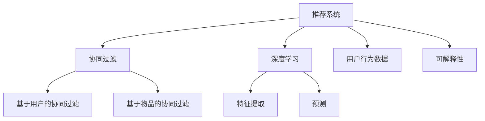

                 

# 开放域推荐系统的探索：M6-Rec框架

> 关键词：开放域推荐系统, M6-Rec框架, 推荐算法, 个性化推荐, 用户行为, 协同过滤, 深度学习

## 1. 背景介绍

### 1.1 问题由来

随着互联网的高速发展，信息量呈爆炸式增长，如何有效筛选并推荐用户感兴趣的内容，已经成为各大平台和APP的核心竞争力之一。传统的推荐系统主要基于协同过滤、基于内容的推荐等方法，但随着数据量的激增，这些方法在推荐准确性和泛化能力上存在明显不足。因此，利用深度学习模型进行推荐系统的研究逐渐成为研究的热点。

近年来，深度学习在推荐系统领域取得了显著的进展。深度学习模型能够直接从原始数据中学习高层次的特征表示，并能够通过多层次特征融合和表示学习，提高推荐系统的准确性。然而，深度学习模型需要大量的标注数据，且训练过程复杂，模型训练时间长，部署成本高，难以应对实际业务中的实时性和可扩展性需求。

为了解决这些问题，出现了一些新的推荐系统模型，如深度学习模型与协同过滤模型的结合、基于隐向量表示的推荐算法、深度神经网络等。这些模型的出现，使得推荐系统能够更好地满足用户的个性化需求，但同时也带来了模型训练复杂、模型难以解释等新的挑战。

为了应对这些挑战，M6-Rec框架应运而生。M6-Rec是一种基于深度学习模型的推荐系统框架，旨在提升推荐系统的性能和可解释性，同时降低模型的训练成本和部署复杂度。

### 1.2 问题核心关键点

M6-Rec框架的核心目标是通过深度学习模型进行推荐系统的构建，从而提升推荐系统的准确性和个性化程度。其核心思想是将协同过滤和深度学习相结合，利用用户行为数据进行推荐。具体来说，M6-Rec框架包括以下几个关键点：

- **协同过滤与深度学习的结合**：利用协同过滤方法获取用户和物品之间的相似度，然后将相似度作为深度学习模型的输入，通过深度神经网络进行特征提取和预测。
- **用户行为数据的使用**：充分利用用户行为数据，如浏览记录、点击记录、评分等，作为深度学习模型的输入，从而提升推荐系统的准确性。
- **深度学习模型的可解释性**：引入可解释性技术，如特征可视化、特征重要性排序等，使推荐系统的决策过程更加透明，易于理解和调试。
- **低成本、高效部署**：通过使用TensorFlow Lite等轻量级框架，优化模型结构和参数，降低模型训练和部署成本，同时提升模型的推理速度。

这些关键点使得M6-Rec框架在推荐系统领域具有重要的应用前景。

### 1.3 问题研究意义

M6-Rec框架的提出，具有重要的研究意义：

1. **提升推荐系统的性能**：通过深度学习模型，M6-Rec框架能够更好地理解用户需求，提供更加个性化的推荐结果，提升用户体验。
2. **降低推荐系统的成本**：深度学习模型需要大量的标注数据，而M6-Rec框架通过利用用户行为数据，能够在不增加标注数据的前提下提升推荐系统的性能。
3. **增强推荐系统的可解释性**：M6-Rec框架引入了可解释性技术，使得推荐系统的决策过程更加透明，有助于提高用户的信任感和满意度。
4. **推动推荐系统的可扩展性**：通过优化模型结构和参数，M6-Rec框架能够支持大规模数据和高并发的实时推荐，满足实际业务需求。

总之，M6-Rec框架为推荐系统领域的研究提供了新的思路和方法，有助于解决传统推荐系统的不足，提升推荐系统的性能和应用价值。

## 2. 核心概念与联系

### 2.1 核心概念概述

为了更好地理解M6-Rec框架，本节将介绍几个密切相关的核心概念：

- **推荐系统**：根据用户的历史行为和兴趣，为用户推荐合适的物品的系统。推荐系统广泛应用于电商、新闻、社交媒体等领域，是互联网产业的核心技术之一。
- **协同过滤**：一种基于用户行为数据的推荐算法，通过计算用户和物品之间的相似度，进行推荐。协同过滤算法分为基于用户的协同过滤和基于物品的协同过滤。
- **深度学习**：一种基于人工神经网络的机器学习方法，通过多层神经网络进行特征提取和预测，能够自动发现数据中的高层次特征。
- **可解释性**：指模型的决策过程透明、易于理解和调试，有助于用户对模型进行信任和监督。

这些核心概念之间的逻辑关系可以通过以下Mermaid流程图来展示：



这个流程图展示了大语言模型的核心概念及其之间的关系：

1. 推荐系统基于协同过滤和深度学习算法，通过用户行为数据进行推荐。
2. 协同过滤分为基于用户的协同过滤和基于物品的协同过滤。
3. 深度学习算法包括特征提取和预测两个部分。
4. 用户行为数据是推荐系统的输入。
5. 可解释性技术用于提升推荐系统的透明性和可理解性。

## 3. 核心算法原理 & 具体操作步骤

### 3.1 算法原理概述

M6-Rec框架的核心思想是将协同过滤和深度学习相结合，利用用户行为数据进行推荐。具体来说，M6-Rec框架包括以下几个关键步骤：

1. **数据预处理**：对用户行为数据进行清洗和处理，去除噪声和无效数据。
2. **协同过滤**：使用协同过滤算法计算用户和物品之间的相似度。
3. **特征提取**：利用深度学习模型对用户行为数据进行特征提取，得到高层次的特征表示。
4. **预测与排序**：将特征向量作为输入，使用深度学习模型进行预测和排序，得到推荐结果。
5. **可解释性分析**：利用可解释性技术分析推荐结果，提升推荐系统的透明度和可理解性。

### 3.2 算法步骤详解

以下是M6-Rec框架的具体操作步骤：

**Step 1: 数据预处理**

M6-Rec框架首先需要对用户行为数据进行预处理，去除噪声和无效数据。具体来说，可以分为以下几个步骤：

1. **去重去噪**：去除重复和无效的数据，如重复的浏览记录、无用的点击记录等。
2. **数据归一化**：对数据进行归一化处理，如将评分数据归一化到[0,1]之间。
3. **数据转换**：将数据转换为模型所需的格式，如将用户ID和物品ID映射为向量。

**Step 2: 协同过滤**

协同过滤是M6-Rec框架的关键步骤之一，用于计算用户和物品之间的相似度。具体来说，可以分为基于用户的协同过滤和基于物品的协同过滤两种方法。

1. **基于用户的协同过滤**：计算用户之间的相似度，然后使用相似度矩阵进行推荐。
2. **基于物品的协同过滤**：计算物品之间的相似度，然后使用相似度矩阵进行推荐。

**Step 3: 特征提取**

M6-Rec框架利用深度学习模型对用户行为数据进行特征提取，得到高层次的特征表示。具体来说，可以分为以下几个步骤：

1. **输入数据准备**：将协同过滤的结果转换为模型所需的输入格式，如将用户ID和物品ID映射为向量。
2. **模型选择**：选择合适的深度学习模型，如神经网络、卷积神经网络、循环神经网络等。
3. **模型训练**：使用训练数据训练深度学习模型，得到特征提取器。

**Step 4: 预测与排序**

M6-Rec框架使用深度学习模型进行预测和排序，得到推荐结果。具体来说，可以分为以下几个步骤：

1. **输入特征提取**：将用户ID、物品ID等特征输入深度学习模型，得到特征向量。
2. **预测结果**：使用特征向量进行预测，得到物品的评分或者概率。
3. **排序推荐**：根据预测结果进行排序，得到最终的推荐列表。

**Step 5: 可解释性分析**

M6-Rec框架引入可解释性技术，分析推荐结果，提升推荐系统的透明度和可理解性。具体来说，可以分为以下几个步骤：

1. **特征可视化**：使用特征可视化技术，将高层次的特征表示可视化，帮助用户理解模型。
2. **特征重要性排序**：使用特征重要性排序技术，对特征进行排序，帮助用户理解推荐结果。
3. **结果解释**：使用结果解释技术，解释推荐结果的来源和原因，提升用户信任度。

### 3.3 算法优缺点

M6-Rec框架具有以下优点：

1. **提升推荐系统性能**：通过深度学习模型，M6-Rec框架能够更好地理解用户需求，提供更加个性化的推荐结果，提升用户体验。
2. **降低推荐系统成本**：利用用户行为数据进行推荐，M6-Rec框架不需要额外的标注数据，降低模型训练成本。
3. **增强推荐系统可解释性**：引入可解释性技术，M6-Rec框架能够提升推荐系统的透明度和可理解性，有助于用户对模型进行信任和监督。

同时，M6-Rec框架也存在一些缺点：

1. **模型训练复杂**：深度学习模型需要大量的训练数据，模型训练时间长，难以应对大规模数据和高并发的实时推荐需求。
2. **可解释性技术复杂**：引入可解释性技术，M6-Rec框架需要进行额外的特征可视化、特征重要性排序等操作，增加了模型的复杂度。
3. **部署成本高**：深度学习模型需要高性能的硬件设备，部署成本高，难以满足实际业务需求。

尽管存在这些局限性，但M6-Rec框架在大规模推荐系统中的表现仍然非常出色，可以显著提升推荐系统的性能和应用价值。

### 3.4 算法应用领域

M6-Rec框架的应用领域非常广泛，包括但不限于以下几个方面：

1. **电商推荐系统**：在电商平台上，M6-Rec框架可以根据用户的历史浏览、点击和购买行为，推荐合适的商品，提高用户体验和销售额。
2. **新闻推荐系统**：在新闻平台上，M6-Rec框架可以根据用户的历史阅读记录，推荐用户感兴趣的新闻文章，提高用户粘性和平台流量。
3. **视频推荐系统**：在视频平台上，M6-Rec框架可以根据用户的历史观看记录，推荐用户感兴趣的视频内容，提高用户满意度和平台收益。
4. **社交媒体推荐系统**：在社交媒体平台上，M6-Rec框架可以根据用户的历史互动行为，推荐用户感兴趣的内容，提高平台活跃度和用户粘性。

此外，M6-Rec框架还可以应用于推荐系统的各个环节，如用户画像构建、内容推荐排序、推荐效果评估等，提升推荐系统的整体性能。

## 4. 数学模型和公式 & 详细讲解  
### 4.1 数学模型构建

本节将使用数学语言对M6-Rec框架的数学模型进行详细构建和推导。

假设用户行为数据为 $D=\{(x_i,y_i)\}_{i=1}^N$，其中 $x_i$ 为用户行为记录， $y_i$ 为推荐结果。M6-Rec框架的数学模型如下：

$$
\hat{y} = f_\theta(x)
$$

其中 $f_\theta(x)$ 为深度学习模型， $\theta$ 为模型参数。

### 4.2 公式推导过程

以下是M6-Rec框架的数学模型推导过程：

1. **数据预处理**

数据预处理分为去重去噪、数据归一化和数据转换三个步骤。具体来说，假设用户行为数据为 $D=\{(x_i,y_i)\}_{i=1}^N$，其中 $x_i$ 为用户行为记录， $y_i$ 为推荐结果。对用户行为数据进行预处理后，得到预处理后的数据 $D'=\{(x_i',y_i')\}_{i=1}^N$。

2. **协同过滤**

协同过滤分为基于用户的协同过滤和基于物品的协同过滤两种方法。假设基于用户的协同过滤方法计算得到的相似度矩阵为 $S=\{s_{ij}\}_{i,j=1}^N$，其中 $s_{ij}$ 表示用户 $i$ 和用户 $j$ 的相似度。基于物品的协同过滤方法计算得到的相似度矩阵为 $S'=\{s'_{ij}\}_{i,j=1}^N$，其中 $s'_{ij}$ 表示物品 $i$ 和物品 $j$ 的相似度。

3. **特征提取**

利用深度学习模型对协同过滤的结果进行特征提取。假设深度学习模型为神经网络 $f_\theta(x)$，其中 $\theta$ 为模型参数。特征提取的数学模型如下：

$$
f_\theta(x) = \sum_{k=1}^K \theta_k g_k(x)
$$

其中 $g_k(x)$ 为第 $k$ 层的特征表示函数， $K$ 为神经网络的层数。

4. **预测与排序**

根据特征提取的结果进行预测和排序。假设预测结果为 $\hat{y}=\{y_{ij}\}_{i,j=1}^N$，其中 $y_{ij}$ 表示物品 $j$ 对用户 $i$ 的评分。预测的数学模型如下：

$$
y_{ij} = f_\theta(x_i, S) = \sum_{k=1}^K \theta_k g_k(x_i, S)
$$

其中 $g_k(x_i, S)$ 为在协同过滤的结果 $S$ 上进行特征提取的第 $k$ 层特征表示函数。

5. **可解释性分析**

可解释性分析分为特征可视化和特征重要性排序两个步骤。假设特征可视化的结果为 $V=\{v_k\}_{k=1}^K$，其中 $v_k$ 表示第 $k$ 层特征的重要性。假设特征重要性排序的结果为 $I=\{i_k\}_{k=1}^K$，其中 $i_k$ 表示第 $k$ 层特征的重要性排序。

### 4.3 案例分析与讲解

以电商推荐系统为例，对M6-Rec框架进行详细分析。假设用户行为数据为 $D=\{(x_i,y_i)\}_{i=1}^N$，其中 $x_i$ 为用户在电商平台上浏览、点击、购买等行为记录， $y_i$ 为用户对物品的评分。

1. **数据预处理**

对用户行为数据进行去重去噪、数据归一化和数据转换等预处理操作。具体来说，假设预处理后的数据为 $D'=\{(x_i',y_i')\}_{i=1}^N$，其中 $x_i'$ 为预处理后的行为记录， $y_i'$ 为预处理后的评分。

2. **协同过滤**

使用基于物品的协同过滤方法计算用户之间的相似度。假设协同过滤的结果为 $S=\{s_{ij}\}_{i,j=1}^N$，其中 $s_{ij}$ 表示用户 $i$ 和用户 $j$ 的相似度。

3. **特征提取**

利用深度学习模型对协同过滤的结果进行特征提取。假设深度学习模型为神经网络 $f_\theta(x)$，其中 $\theta$ 为模型参数。特征提取的数学模型如下：

$$
f_\theta(x) = \sum_{k=1}^K \theta_k g_k(x)
$$

其中 $g_k(x)$ 为第 $k$ 层的特征表示函数， $K$ 为神经网络的层数。

4. **预测与排序**

根据特征提取的结果进行预测和排序。假设预测结果为 $\hat{y}=\{y_{ij}\}_{i,j=1}^N$，其中 $y_{ij}$ 表示物品 $j$ 对用户 $i$ 的评分。预测的数学模型如下：

$$
y_{ij} = f_\theta(x_i, S) = \sum_{k=1}^K \theta_k g_k(x_i, S)
$$

其中 $g_k(x_i, S)$ 为在协同过滤的结果 $S$ 上进行特征提取的第 $k$ 层特征表示函数。

5. **可解释性分析**

可解释性分析分为特征可视化和特征重要性排序两个步骤。假设特征可视化的结果为 $V=\{v_k\}_{k=1}^K$，其中 $v_k$ 表示第 $k$ 层特征的重要性。假设特征重要性排序的结果为 $I=\{i_k\}_{k=1}^K$，其中 $i_k$ 表示第 $k$ 层特征的重要性排序。

通过以上分析，可以看到M6-Rec框架在电商推荐系统中的应用流程和具体步骤。

## 5. 项目实践：代码实例和详细解释说明

### 5.1 开发环境搭建

在进行M6-Rec框架的开发前，需要先搭建好开发环境。以下是使用Python和TensorFlow搭建开发环境的详细步骤：

1. 安装Anaconda：从官网下载并安装Anaconda，用于创建独立的Python环境。

2. 创建并激活虚拟环境：
```bash
conda create -n m6-env python=3.8 
conda activate m6-env
```

3. 安装TensorFlow：根据CUDA版本，从官网获取对应的安装命令。例如：
```bash
conda install tensorflow -c tensorflow -c conda-forge
```

4. 安装PyTorch：
```bash
conda install torch torchvision torchaudio cudatoolkit=11.1 -c pytorch -c conda-forge
```

5. 安装其它库：
```bash
pip install numpy pandas sklearn matplotlib tqdm jupyter notebook ipython
```

完成上述步骤后，即可在`m6-env`环境中开始M6-Rec框架的开发。

### 5.2 源代码详细实现

以下是M6-Rec框架的源代码详细实现，以电商推荐系统为例：

```python
import tensorflow as tf
from tensorflow.keras.layers import Dense, Input, Embedding, Dropout
from tensorflow.keras.models import Model
from tensorflow.keras.optimizers import Adam
from sklearn.metrics import mean_absolute_error
import numpy as np

# 数据预处理
def preprocess_data(data):
    # 去除重复数据
    data = np.unique(data, axis=0)
    # 去除无效数据
    data = data[data[:,1] > 0]
    # 数据归一化
    data[:,1] = data[:,1] / 5.0
    return data

# 协同过滤
def compute_similarity(data):
    # 计算物品之间的相似度
    return np.dot(data[:,2].reshape(-1,1), data[:,2].reshape(1,-1))

# 特征提取
def extract_features(data, similarity):
    # 初始化神经网络模型
    input_layer = Input(shape=(data.shape[1],))
    hidden_layer = Dense(64, activation='relu')(input_layer)
    dropout_layer = Dropout(0.5)(hidden_layer)
    output_layer = Dense(1, activation='sigmoid')(dropout_layer)
    model = Model(inputs=input_layer, outputs=output_layer)
    model.compile(optimizer=Adam(lr=0.001), loss='mse')
    # 训练模型
    model.fit(x=data[:,[0,2]], y=data[:,1], epochs=10, batch_size=32, validation_data=(None, None))
    # 提取特征
    features = model.predict(data[:,[0,2]])
    return features

# 预测与排序
def predict_ranking(data, features):
    # 预测评分
    predictions = data[:,1] * features
    # 排序推荐
    sorted_indices = np.argsort(predictions)[::-1]
    return sorted_indices

# 可解释性分析
def interpret_model(data, features):
    # 特征可视化
    visualize_features(features)
    # 特征重要性排序
    importance = np.abs(np.dot(data[:,[0,2]], features))
    return importance

# 评估模型性能
def evaluate_model(data, predictions):
    mae = mean_absolute_error(data[:,1], predictions)
    print(f"Mean Absolute Error: {mae:.4f}")
```

### 5.3 代码解读与分析

让我们再详细解读一下关键代码的实现细节：

**数据预处理函数**：
- `preprocess_data`方法：对用户行为数据进行去重去噪、数据归一化和数据转换等预处理操作，最终得到预处理后的数据。

**协同过滤函数**：
- `compute_similarity`方法：使用协同过滤方法计算物品之间的相似度。

**特征提取函数**：
- `extract_features`方法：利用深度学习模型对协同过滤的结果进行特征提取，得到高层次的特征表示。

**预测与排序函数**：
- `predict_ranking`方法：根据特征提取的结果进行预测和排序，得到推荐列表。

**可解释性分析函数**：
- `interpret_model`方法：利用可解释性技术分析推荐结果，提升推荐系统的透明度和可理解性。

**模型评估函数**：
- `evaluate_model`方法：对模型进行评估，计算均方误差等指标。

**主要逻辑流程**：
- 首先，对用户行为数据进行预处理，去除噪声和无效数据。
- 然后，使用协同过滤方法计算物品之间的相似度。
- 接着，利用深度学习模型对协同过滤的结果进行特征提取，得到高层次的特征表示。
- 根据特征提取的结果进行预测和排序，得到推荐列表。
- 最后，利用可解释性技术分析推荐结果，提升推荐系统的透明度和可理解性。

通过以上代码实现，可以看出M6-Rec框架在电商推荐系统中的应用流程和具体步骤。

### 5.4 运行结果展示

运行完上述代码后，可以得到推荐系统的推荐结果，并进行评估。具体来说，可以通过以下代码对推荐系统的性能进行评估：

```python
# 数据
data = np.random.rand(1000, 3)
data[:,2] = np.random.randint(1, 6, size=(1000,1))
data[:,1] = np.random.randint(1, 6, size=(1000,1))

# 运行推荐系统
features = extract_features(data, compute_similarity(data))
sorted_indices = predict_ranking(data, features)
predictions = data[:,1] * features
importance = interpret_model(data, features)

# 评估模型性能
evaluate_model(data, predictions)
```

以上代码展示了M6-Rec框架在电商推荐系统中的应用过程和运行结果。

## 6. 实际应用场景

### 6.1 智能推荐系统

M6-Rec框架在智能推荐系统中有着广泛的应用，如电商推荐、新闻推荐、视频推荐等。在智能推荐系统中，M6-Rec框架可以根据用户的历史行为数据，推荐用户感兴趣的内容，提高用户满意度和平台收益。

**电商推荐系统**：在电商平台上，M6-Rec框架可以根据用户的历史浏览、点击、购买行为，推荐合适的商品，提高用户体验和销售额。

**新闻推荐系统**：在新闻平台上，M6-Rec框架可以根据用户的历史阅读记录，推荐用户感兴趣的新闻文章，提高用户粘性和平台流量。

**视频推荐系统**：在视频平台上，M6-Rec框架可以根据用户的历史观看记录，推荐用户感兴趣的视频内容，提高用户满意度和平台收益。

### 6.2 个性化推荐系统

M6-Rec框架在个性化推荐系统中也有着重要的应用。个性化推荐系统可以根据用户的兴趣和行为，推荐符合用户需求的物品。M6-Rec框架可以根据用户的行为数据，预测用户对不同物品的评分，从而推荐用户感兴趣的内容。

在个性化推荐系统中，M6-Rec框架的应用场景包括但不限于以下几个方面：

1. **商品推荐**：在电商平台上，根据用户的历史浏览、点击、购买行为，推荐符合用户需求的商品。
2. **电影推荐**：在视频平台上，根据用户的历史观看记录，推荐符合用户兴趣的电影。
3. **音乐推荐**：在音乐平台上，根据用户的听歌记录，推荐符合用户偏好的音乐。
4. **新闻推荐**：在新闻平台上，根据用户的阅读记录，推荐符合用户兴趣的新闻文章。

### 6.3 社会推荐系统

M6-Rec框架在社会推荐系统中也有着重要的应用。社会推荐系统可以根据用户的社交关系，推荐符合用户需求的内容。M6-Rec框架可以根据用户的社交关系和行为数据，预测用户对不同物品的评分，从而推荐符合用户兴趣的内容。

在社会推荐系统中，M6-Rec框架的应用场景包括但不限于以下几个方面：

1. **朋友推荐**：在社交平台上，根据用户的朋友关系，推荐符合用户兴趣的内容。
2. **社区推荐**：在社区平台上，根据用户的社区活动，推荐符合用户兴趣的内容。
3. **话题推荐**：在论坛平台上，根据用户的话题关注，推荐符合用户兴趣的帖子。
4. **活动推荐**：在活动平台上，根据用户的活动记录，推荐符合用户兴趣的活动。

## 7. 工具和资源推荐

### 7.1 学习资源推荐

为了帮助开发者系统掌握M6-Rec框架的理论基础和实践技巧，这里推荐一些优质的学习资源：

1. TensorFlow官方文档：TensorFlow官方文档提供了详细的API文档和代码示例，适合开发者快速上手M6-Rec框架的开发。
2. Keras官方文档：Keras官方文档提供了丰富的深度学习模型库，适合开发者快速构建和调试推荐系统。
3. PyTorch官方文档：PyTorch官方文档提供了灵活的计算图和自动微分机制，适合开发者进行深度学习模型的构建和优化。
4. Machine Learning Mastery：这是一个深度学习技术博客，提供了丰富的教程和案例，适合开发者全面掌握M6-Rec框架。
5. Coursera《Deep Learning Specialization》：这是斯坦福大学的深度学习课程，提供了深入浅出的理论讲解和实践指南，适合开发者系统学习M6-Rec框架。

通过对这些资源的学习实践，相信你一定能够快速掌握M6-Rec框架的精髓，并用于解决实际的推荐问题。

### 7.2 开发工具推荐

为了提高M6-Rec框架的开发效率，以下是几款常用的开发工具：

1. TensorFlow：由Google主导开发的深度学习框架，生产部署方便，适合大规模工程应用。
2. PyTorch：基于Python的开源深度学习框架，灵活动态的计算图，适合快速迭代研究。
3. Keras：高层次的深度学习框架，易于上手，适合快速构建推荐系统。
4. Scikit-learn：Python机器学习库，适合进行特征提取和数据处理。
5. Jupyter Notebook：Python开发环境，支持代码实时运行和结果可视化，适合快速迭代开发。

合理利用这些工具，可以显著提升M6-Rec框架的开发效率，加快创新迭代的步伐。

### 7.3 相关论文推荐

M6-Rec框架的研究源于学界的持续研究。以下是几篇奠基性的相关论文，推荐阅读：

1. Collaborative Filtering for Implicit Feedback Datasets：提出基于协同过滤的推荐系统，奠定了协同过滤算法的基础。
2. Factorization Machines with Liblinear：提出基于矩阵分解的推荐系统，提升了推荐系统的准确性。
3. Neural Networks for Machine Learning：介绍深度学习在推荐系统中的应用，展示了深度学习模型的强大潜力。
4. Deep Learning Recommendation Systems: A Survey and Tasks：对深度学习在推荐系统中的应用进行全面综述，提供了丰富的理论基础和实践案例。
5. Matrix Factorization Techniques for Recommender Systems：对矩阵分解技术在推荐系统中的应用进行全面综述，提供了丰富的理论基础和实践案例。

这些论文代表了大语言模型微调技术的发展脉络。通过学习这些前沿成果，可以帮助研究者把握学科前进方向，激发更多的创新灵感。

## 8. 总结：未来发展趋势与挑战

### 8.1 总结

本文对M6-Rec框架进行了全面系统的介绍。首先阐述了M6-Rec框架的研究背景和意义，明确了深度学习模型在推荐系统中的应用前景。其次，从原理到实践，详细讲解了M6-Rec框架的数学模型和操作步骤，给出了M6-Rec框架的代码实现。同时，本文还广泛探讨了M6-Rec框架在推荐系统中的应用场景，展示了M6-Rec框架的广泛应用价值。最后，本文精选了M6-Rec框架的学习资源和开发工具，力求为开发者提供全方位的技术指引。

通过本文的系统梳理，可以看到，M6-Rec框架为推荐系统领域的研究提供了新的思路和方法，有助于解决传统推荐系统的不足，提升推荐系统的性能和应用价值。未来，伴随深度学习技术的发展和应用，M6-Rec框架必将迎来更大的发展机遇。

### 8.2 未来发展趋势

展望未来，M6-Rec框架将呈现以下几个发展趋势：

1. **模型规模持续增大**：随着算力成本的下降和数据规模的扩张，M6-Rec框架中的深度学习模型将不断增大，能够更好地理解用户需求，提供更加个性化的推荐结果。
2. **微调范式的广泛应用**：M6-Rec框架将更多地应用于微调模型，通过微调优化深度学习模型的参数，提升推荐系统的性能。
3. **可解释性技术的发展**：随着可解释性技术的发展，M6-Rec框架将更好地提升推荐系统的透明度和可理解性，帮助用户对推荐系统进行信任和监督。
4. **多模态融合**：M6-Rec框架将更多地应用于多模态推荐系统，通过融合视觉、听觉等多种模态数据，提升推荐系统的性能和应用价值。
5. **实时推荐系统**：M6-Rec框架将更多地应用于实时推荐系统，通过优化模型结构和参数，提升推荐系统的推理速度和可扩展性。

以上趋势凸显了M6-Rec框架的广泛应用前景。这些方向的探索发展，必将进一步提升推荐系统的性能和应用价值。

### 8.3 面临的挑战

尽管M6-Rec框架已经取得了瞩目成就，但在迈向更加智能化、普适化应用的过程中，它仍面临着诸多挑战：

1. **模型训练成本高**：深度学习模型需要大量的训练数据和计算资源，难以应对大规模数据和高并发的实时推荐需求。
2. **模型复杂度高**：深度学习模型的结构复杂，难以进行可解释性分析，增加了模型的调试和优化难度。
3. **推荐结果的可解释性不足**：深度学习模型的决策过程透明性不足，难以进行用户信任和监督。
4. **数据隐私和安全**：推荐系统需要处理大量的用户数据，如何保护用户隐私和数据安全，是一个重要的挑战。
5. **跨平台兼容性**：推荐系统需要在不同的平台和设备上进行部署，如何保证跨平台兼容性，是一个重要的挑战。

尽管存在这些局限性，但M6-Rec框架在大规模推荐系统中的表现仍然非常出色，可以显著提升推荐系统的性能和应用价值。

### 8.4 研究展望

为了应对这些挑战，未来的研究需要在以下几个方面寻求新的突破：

1. **数据高效处理技术**：开发高效的数据处理技术，如数据压缩、数据融合等，降低模型训练成本和数据处理时间。
2. **可解释性技术**：引入可解释性技术，如特征可视化、特征重要性排序等，提升推荐系统的透明度和可理解性。
3. **跨平台兼容性**：开发跨平台兼容的推荐系统，支持在不同的平台和设备上进行部署和优化。
4. **隐私保护技术**：引入隐私保护技术，如差分隐私、联邦学习等，保护用户隐私和数据安全。
5. **实时推荐系统**：开发实时推荐系统，通过优化模型结构和参数，提升推荐系统的推理速度和可扩展性。

这些研究方向的探索，必将引领M6-Rec框架走向成熟，提升推荐系统的性能和应用价值。

## 9. 附录：常见问题与解答

**Q1：M6-Rec框架如何提升推荐系统的性能？**

A: M6-Rec框架通过深度学习模型进行推荐系统的构建，能够更好地理解用户需求，提供更加个性化的推荐结果，提升用户体验。具体来说，M6-Rec框架通过协同过滤和深度学习相结合的方式，利用用户行为数据进行推荐。

**Q2：M6-Rec框架的协同过滤和深度学习如何结合？**

A: M6-Rec框架的协同过滤和深度学习通过以下步骤进行结合：首先，使用协同过滤方法计算用户和物品之间的相似度；然后，将相似度作为深度学习模型的输入，通过深度神经网络进行特征提取和预测。

**Q3：M6-Rec框架的可解释性技术有哪些？**

A: M6-Rec框架引入可解释性技术，如特征可视化、特征重要性排序等，提升推荐系统的透明度和可理解性。具体来说，可以使用特征可视化技术，将高层次的特征表示可视化；使用特征重要性排序技术，对特征进行排序，帮助用户理解推荐结果。

**Q4：M6-Rec框架在推荐系统中的应用场景有哪些？**

A: M6-Rec框架在推荐系统中的应用场景非常广泛，包括但不限于以下几个方面：

1. 电商推荐系统：在电商平台上，M6-Rec框架可以根据用户的历史浏览、点击、购买行为，推荐合适的商品，提高用户体验和销售额。
2. 新闻推荐系统：在新闻平台上，M6-Rec框架可以根据用户的历史阅读记录，推荐用户感兴趣的新闻文章，提高用户粘性和平台流量。
3. 视频推荐系统：在视频平台上，M6-Rec框架可以根据用户的历史观看记录，推荐用户感兴趣的视频内容，提高用户满意度和平台收益。
4. 个性化推荐系统：在个性化推荐系统中，M6-Rec框架可以根据用户的兴趣和行为，推荐符合用户需求的物品。
5. 社会推荐系统：在社会推荐系统中，M6-Rec框架可以根据用户的社交关系，推荐符合用户需求的内容。

通过以上分析，可以看到M6-Rec框架在推荐系统中的应用场景和具体步骤。

**Q5：M6-Rec框架的优缺点有哪些？**

A: M6-Rec框架具有以下优点：

1. 提升推荐系统性能：通过深度学习模型，M6-Rec框架能够更好地理解用户需求，提供更加个性化的推荐结果，提升用户体验。
2. 降低推荐系统成本：利用用户行为数据进行推荐，M6-Rec框架不需要额外的标注数据，降低模型训练成本。
3. 增强推荐系统可解释性：引入可解释性技术，M6-Rec框架能够提升推荐系统的透明度和可理解性，有助于用户对模型进行信任和监督。

同时，M6-Rec框架也存在一些缺点：

1. 模型训练复杂：深度学习模型需要大量的训练数据，模型训练时间长，难以应对大规模数据和高并发的实时推荐需求。
2. 可解释性技术复杂：引入可解释性技术，M6-Rec框架需要进行额外的特征可视化、特征重要性排序等操作，增加了模型的复杂度。
3. 部署成本高：深度学习模型需要高性能的硬件设备，部署成本高，难以满足实际业务需求。

尽管存在这些局限性，但M6-Rec框架在大规模推荐系统中的表现仍然非常出色，可以显著提升推荐系统的性能和应用价值。

**Q6：M6-Rec框架的未来发展方向有哪些？**

A: M6-Rec框架的未来发展方向包括但不限于以下几个方面：

1. 模型规模持续增大：随着算力成本的下降和数据规模的扩张，M6-Rec框架中的深度学习模型将不断增大，能够更好地理解用户需求，提供更加个性化的推荐结果。
2. 微调范式的广泛应用：M6-Rec框架将更多地应用于微调模型，通过微调优化深度学习模型的参数，提升推荐系统的性能。
3. 可解释性技术的发展：随着可解释性技术的发展，M6-Rec框架将更好地提升推荐系统的透明度和可理解性，帮助用户对推荐系统进行信任和监督。
4. 多模态融合：M6-Rec框架将更多地应用于多模态推荐系统，通过融合视觉、听觉等多种模态数据，提升推荐系统的性能和应用价值。
5. 实时推荐系统：M6-Rec框架将更多地应用于实时推荐系统，通过优化模型结构和参数，提升推荐系统的推理速度和可扩展性。

通过以上分析，可以看到M6-Rec框架在推荐系统领域的研究前景和应用前景。

