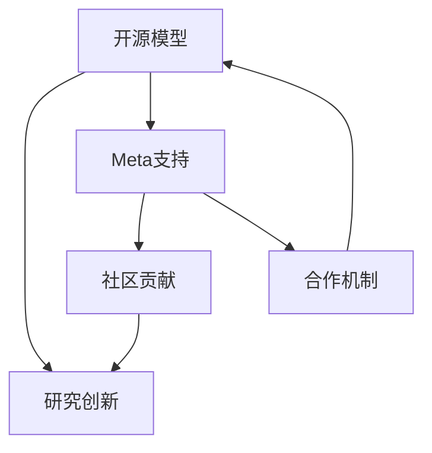

                 

# 开源模型的优势：促进研究创新，Meta的支持为开源社区带来机遇

> 关键词：开源模型, 研究创新, Meta, 社区贡献, 合作机制, 开放源代码, 科技伦理, 深度学习, 人工智能

## 1. 背景介绍

随着人工智能（AI）技术的迅猛发展，开源模型已成为推动科研和产业创新的重要力量。它们不仅极大地降低了科研门槛，还促进了学术交流和技术传播。Meta近年来在开源领域的积极参与，进一步为开源社区注入了新的活力和动力，推动了深度学习与人工智能领域的研究进步。

### 1.1 问题由来

开源模型的优势显而易见：成本低、灵活性高、易于扩展和复用。然而，在实际应用中，开源模型的维护和治理仍面临诸多挑战。如何构建一个可持续的、开放且高效的开源社区？Meta的贡献和支持提供了宝贵的经验和教训。

### 1.2 问题核心关键点

开源模型治理的核心在于如何平衡贡献者与用户的利益，维持社区的健康与活跃。Meta在这方面积累了丰富经验，推动了多个开源社区的成功，如PyTorch、Detectron2等。这些成功案例展示了开源模型如何实现商业利益与社会价值的双重提升。

### 1.3 问题研究意义

Meta的贡献表明，开源模型不仅能促进研究创新，还能提升产业应用能力，推动科技伦理的进步。本文将深入探讨开源模型在推动技术发展和伦理建设方面的作用，并分析Meta对开源社区的贡献机制。

## 2. 核心概念与联系

### 2.1 核心概念概述

开源模型（Open Source Models, OSMs）是开放源代码的软件，任何人都可以查看、修改和分发。它们通常由研究机构、企业或个人创建，旨在加速技术发展，促进学术交流和产业应用。

研究创新（Research Innovation）涉及新理论、新算法、新应用的开发和验证。开源模型通过开放其源代码，使科研人员能够基于这些代码进行创新和改进，加速新技术的迭代。

Meta（Facebook, Inc.）是全球最大的社交媒体公司之一，近年来通过支持开源项目，不仅提升了自身的技术能力和产业影响力，也为开源社区带来了新的资源和动力。

### 2.2 核心概念原理和架构的 Mermaid 流程图



该图展示了开源模型、研究创新、Meta支持、社区贡献和合作机制之间的联系：

1. Meta通过支持开源模型，为研究创新提供了技术基础。
2. 社区贡献促进了开源模型的迭代和优化。
3. 合作机制保障了开源社区的可持续性。
4. 研究创新依托开源模型，推动了技术进步。

## 3. 核心算法原理 & 具体操作步骤

### 3.1 算法原理概述

开源模型的优势在于其高度透明性和灵活性。科研人员可以通过查看和修改代码，快速进行实验验证，进而推动新算法、新应用的开发。这种透明性和灵活性大大降低了科研门槛，加速了技术迭代。

### 3.2 算法步骤详解

1. **选择开源模型**：选择适合的研究方向和需求的开源模型。Meta提供了多个高质量的开源模型，如PyTorch、Detectron2等。
2. **代码贡献与优化**：通过修改和优化开源代码，进行科研验证和实验。
3. **发布和共享**：将研究成果发布到开源社区，供更多人复用和改进。
4. **应用与迭代**：将研究成果应用于实际应用场景，进一步验证和优化。

### 3.3 算法优缺点

**优点**：
- 成本低：开源模型降低了科研和开发的成本。
- 灵活性高：科研人员可以自由修改和扩展代码。
- 易于扩展：新功能、新算法可以轻松集成到开源模型中。
- 社区支持：庞大的开源社区提供丰富的资源和支持。

**缺点**：
- 维护困难：开源模型的维护需要社区共同参与。
- 社区管理：需要制定有效的管理机制，确保社区的健康发展。
- 技术风险：开源模型可能存在安全漏洞和性能问题。

### 3.4 算法应用领域

开源模型在深度学习、计算机视觉、自然语言处理、推荐系统等多个领域得到了广泛应用。例如：

- PyTorch：用于深度学习模型的构建与训练。
- Detectron2：用于物体检测和分割任务。
- HuggingFace Transformers：用于自然语言处理任务的预训练模型。

## 4. 数学模型和公式 & 详细讲解 & 举例说明

### 4.1 数学模型构建

以深度学习中的卷积神经网络（CNN）为例，数学模型可以表示为：

$$
\mathcal{L}(\theta) = \frac{1}{N}\sum_{i=1}^N \ell(f_\theta(x_i),y_i)
$$

其中，$\theta$ 为模型参数，$x_i$ 为输入数据，$y_i$ 为标签，$f_\theta(x_i)$ 为模型输出，$\ell$ 为损失函数。

### 4.2 公式推导过程

在CNN模型中，使用交叉熵损失函数：

$$
\ell(f_\theta(x_i),y_i) = -y_i \log f_\theta(x_i)
$$

通过反向传播算法，计算梯度并更新参数：

$$
\theta \leftarrow \theta - \eta \nabla_{\theta}\mathcal{L}(\theta)
$$

其中，$\eta$ 为学习率，$\nabla_{\theta}\mathcal{L}(\theta)$ 为梯度。

### 4.3 案例分析与讲解

以PyTorch为例，PyTorch是一个基于Python的开源深度学习库。通过在PyTorch上进行科研和开发，科研人员可以轻松实现各种深度学习模型，并进行快速迭代和验证。例如，通过修改PyTorch代码，科研人员可以添加新的数据处理模块、优化算法和模型架构。

## 5. 项目实践：代码实例和详细解释说明

### 5.1 开发环境搭建

首先，需要在本地安装PyTorch，并配置好环境变量。可以使用以下命令进行安装：

```bash
pip install torch torchvision torchaudio
```

### 5.2 源代码详细实现

下面以图像分类任务为例，展示使用PyTorch进行科研开发的代码实现。

```python
import torch
import torch.nn as nn
import torchvision.transforms as transforms
import torchvision.datasets as datasets
from torch.utils.data import DataLoader

class Net(nn.Module):
    def __init__(self):
        super(Net, self).__init__()
        self.conv1 = nn.Conv2d(3, 6, 5)
        self.pool = nn.MaxPool2d(2, 2)
        self.conv2 = nn.Conv2d(6, 16, 5)
        self.fc1 = nn.Linear(16 * 5 * 5, 120)
        self.fc2 = nn.Linear(120, 84)
        self.fc3 = nn.Linear(84, 10)

    def forward(self, x):
        x = self.pool(F.relu(self.conv1(x)))
        x = self.pool(F.relu(self.conv2(x)))
        x = x.view(-1, 16 * 5 * 5)
        x = F.relu(self.fc1(x))
        x = F.relu(self.fc2(x))
        x = self.fc3(x)
        return x

net = Net()
criterion = nn.CrossEntropyLoss()
optimizer = torch.optim.SGD(net.parameters(), lr=0.001, momentum=0.9)
```

### 5.3 代码解读与分析

以上代码展示了如何定义卷积神经网络模型、损失函数和优化器，并加载数据进行训练。

- `Net`类：定义卷积神经网络模型结构。
- `criterion`：定义交叉熵损失函数。
- `optimizer`：定义随机梯度下降优化器。
- `train`函数：实现模型的前向传播和反向传播，更新模型参数。

### 5.4 运行结果展示

运行训练代码，并在测试集上评估模型性能：

```python
def train(net, train_loader, test_loader, criterion, optimizer, num_epochs):
    for epoch in range(num_epochs):
        running_loss = 0.0
        for i, data in enumerate(train_loader, 0):
            inputs, labels = data
            optimizer.zero_grad()
            outputs = net(inputs)
            loss = criterion(outputs, labels)
            loss.backward()
            optimizer.step()
            running_loss += loss.item()
        print('Epoch [%d/%d], Loss: %.4f' % (epoch + 1, num_epochs, running_loss / len(train_loader)))

    correct = 0
    total = 0
    with torch.no_grad():
        for data in test_loader:
            images, labels = data
            outputs = net(images)
            _, predicted = torch.max(outputs.data, 1)
            total += labels.size(0)
            correct += (predicted == labels).sum().item()
    print('Accuracy of the network on the 10000 test images: %d %%' % (100 * correct / total))
```

## 6. 实际应用场景

### 6.1 智能推荐系统

Meta在智能推荐系统方面也有显著的贡献。例如，通过PyTorch开发推荐模型，可以轻松实现高效的特征提取和模型训练，提升推荐系统的个性化和多样化。

### 6.2 视觉识别与分割

Meta的Detectron2模型在物体检测和分割任务中表现优异，广泛应用于自动驾驶、医疗影像分析等领域。通过在开源社区贡献代码和优化模型，科研人员可以持续提升模型的性能。

### 6.3 自然语言处理

HuggingFace的Transformers库提供了多个预训练模型，用于自然语言处理任务。通过微调和优化，科研人员可以快速实现各种NLP任务，如情感分析、机器翻译等。

## 7. 工具和资源推荐

### 7.1 学习资源推荐

1. **PyTorch官方文档**：提供详尽的API文档和教程，帮助开发者快速上手。
2. **Deep Learning Specialization**：由Andrew Ng教授主讲的深度学习课程，涵盖深度学习基础和实践。
3. **Kaggle**：数据科学和机器学习的竞赛平台，提供丰富的数据集和开源项目。
4. **GitHub**：全球最大的代码托管平台，提供丰富的开源项目和社区贡献平台。
5. **Coursera**：提供高质量的在线课程，涵盖计算机科学和数据科学领域。

### 7.2 开发工具推荐

1. **PyTorch**：深度学习领域最流行的开源框架，支持动态图和静态图。
2. **TensorFlow**：谷歌开源的深度学习框架，支持分布式计算和高性能模型训练。
3. **Jupyter Notebook**：交互式编程和数据可视化的平台。
4. **TensorBoard**：TensorFlow的可视化工具，用于实时监控模型训练和性能。
5. **Weights & Biases**：模型训练的实验跟踪工具，提供丰富的图表和数据可视化功能。

### 7.3 相关论文推荐

1. **Deep Residual Learning for Image Recognition**：He等人提出的残差网络，推动了深度学习在计算机视觉领域的发展。
2. **Learning Phrase Representations using RNN Encoder–Decoder for Statistical Machine Translation**：Sutskever等人提出的序列到序列模型，促进了机器翻译的研究。
3. **Attention is All You Need**：Vaswani等人提出的Transformer模型，开创了自注意力机制在NLP中的应用。
4. **Detectron2: Towards General-purpose Object Detection with Custom Architectures**：He等人提出的大规模物体检测模型，展示了开源社区的强大力量。
5. **Natural Language Processing (almost) from Scratch**：Christopher Olah的博客文章，介绍了如何从零开始构建自然语言处理模型。

## 8. 总结：未来发展趋势与挑战

### 8.1 研究成果总结

开源模型在推动科研创新、加速技术发展方面发挥了重要作用。Meta通过支持开源项目，不仅提升了自身的技术能力，也为社区注入了新的资源和动力。

### 8.2 未来发展趋势

1. **技术创新**：开源模型将推动更多前沿技术的发展，如自动学习、生成对抗网络（GAN）等。
2. **社区建设**：开源社区的组织和管理将更加完善，形成更多行业标准的共识。
3. **跨学科融合**：开源模型将促进跨学科的融合，如计算机视觉与自然语言处理、深度学习与强化学习等。
4. **伦理与社会责任**：开源模型将更多关注伦理与社会责任，推动技术应用的正向影响。

### 8.3 面临的挑战

1. **代码质量**：开源模型的代码质量参差不齐，需要社区共同维护和改进。
2. **资源分配**：开源社区的资源分配不均，可能导致一些项目的衰落。
3. **技术风险**：开源模型可能存在安全隐患和性能问题，需要持续优化。
4. **伦理与隐私**：开源模型的应用可能涉及数据隐私和伦理问题，需要制定相应的规范和法规。

### 8.4 研究展望

未来，开源模型将在深度学习与人工智能领域发挥更加重要的作用。通过持续的技术创新和社区建设，开源模型将进一步推动科研和产业的发展，为人类社会带来更多的福祉。Meta的支持和贡献将继续推动这一进程，引领开源社区迈向新的高度。

## 9. 附录：常见问题与解答

**Q1：开源模型如何保证代码质量？**

A: 开源社区的自我管理和自我优化机制可以保证代码质量。社区成员可以提交代码审查、代码注释、文档更新等，共同维护项目的健康发展。

**Q2：开源模型如何应对资源不足的问题？**

A: 开源社区可以引入外部资源，如企业赞助、政府资助等，缓解资源不足的挑战。Meta就是通过企业赞助等方式，为开源项目提供了丰富的资源和支持。

**Q3：开源模型如何应对技术风险？**

A: 开源社区需要定期进行代码审计、漏洞修复和安全加固，确保模型的安全性和可靠性。Meta的定期安全审计和社区合作机制为开源模型提供了强有力的技术保障。

**Q4：开源模型如何平衡社区利益与商业利益？**

A: 开源模型通过灵活的商业授权和开放源代码，平衡了社区贡献与商业利益。Meta的商业模式体现了开源与商业利益的平衡，为社区和用户提供了多赢的解决方案。

**Q5：开源模型如何促进科技伦理？**

A: 开源模型通过开放源代码，推动了技术透明化和公开性。社区成员可以共同讨论和制定伦理规范，提升技术应用的伦理水平。Meta在开源项目中引入伦理导向，确保技术应用的合规性和社会责任。

---

作者：禅与计算机程序设计艺术 / Zen and the Art of Computer Programming

