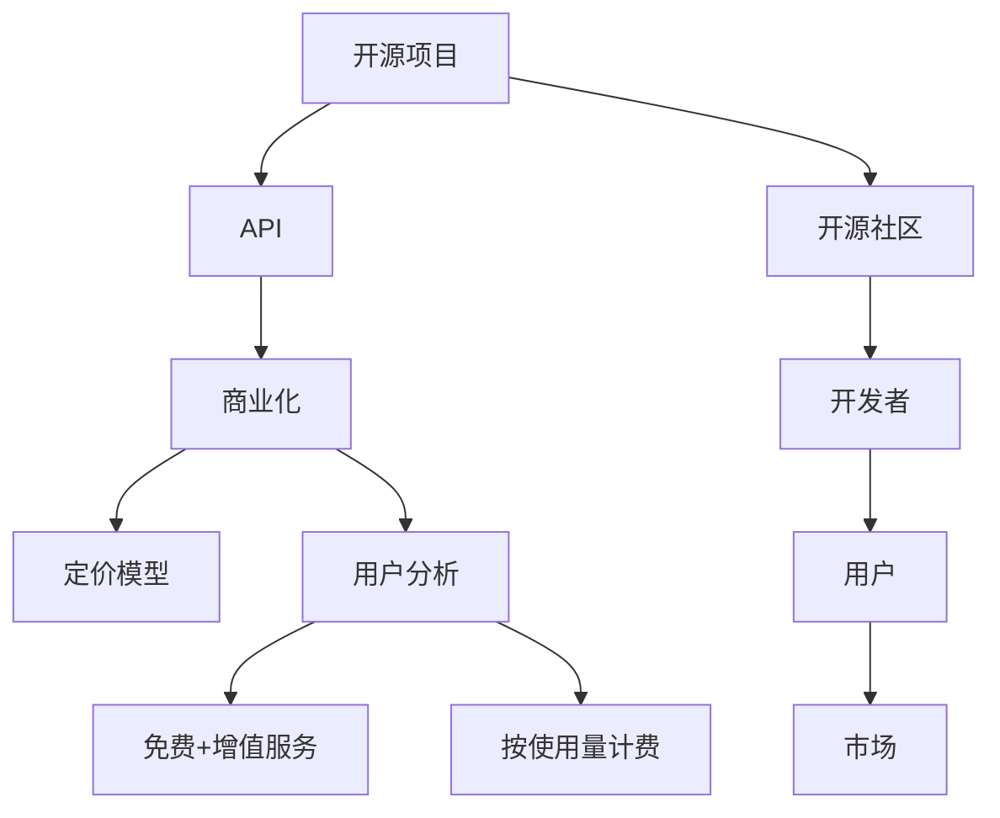

                 

# 开源项目的API商业化：策略和定价模型

> 关键词：API商业化, 开源项目, 策略规划, 定价模型, 用户分析, 收入最大化, 成本控制

## 1. 背景介绍

### 1.1 问题由来

随着开源软件的蓬勃发展，越来越多的企业和社区通过开源项目共享技术成果，推动了软件开发和创新的繁荣。然而，开源项目的经济模式如何保持可持续性，成为了一个重要问题。尤其是在开源项目逐渐成熟、用户群体逐渐扩大的背景下，如何将开源项目转换为商业变现模式，成为开源项目维护者和商业化团队的共同挑战。

API（Application Programming Interface）作为开源项目的关键组成部分，其商业化策略和定价模型研究尤为关键。一方面，API的商业化不仅可以为开源项目带来稳定的收入来源，另一方面，合理的定价模型可以确保开源项目和用户利益的平衡，促进项目的长期健康发展。

### 1.2 问题核心关键点

在开源项目的API商业化过程中，需要考虑的核心关键点包括：

- 选择合适的商业化模式：如免费+增值服务模式、基础免费高级付费模式、按使用量计费模式等。
- 设计合理的定价模型：以确保价格既能够覆盖成本，又具有市场竞争力。
- 精准的用户分析：根据用户类型和需求设计不同的API套餐，提升用户体验和黏性。
- 收入和成本的平衡：在追求收入最大化的同时，控制运营成本，实现盈利。
- 生态系统的构建：通过API商业化，吸引更多开发者和用户，构建更庞大的开源生态。

本文将围绕这些关键点，探讨开源项目的API商业化策略和定价模型，并结合实际案例进行分析。

## 2. 核心概念与联系

### 2.1 核心概念概述

为更好地理解开源项目API商业化策略和定价模型，本节将介绍几个密切相关的核心概念：

- 开源项目(Open Source Project)：由开发者和社区共同维护的软件项目，其代码和文档完全公开共享，任何个人和组织都可以自由使用、修改和分发。
- API：应用程序编程接口，是软件开发中重要的组件，用于连接不同软件模块或服务。
- 商业化(Commercialization)：将产品或服务转化为盈利模式的过程，通过市场运作实现经济回报。
- 定价模型(Pricing Model)：根据市场需求、产品特性等因素，制定商品或服务价格的方式。
- 用户分析(User Segmentation)：根据用户的行为、需求和付费能力，将用户分成不同的群组，以便于定制化服务。
- 免费+增值服务(Free+Premium)：提供基础功能免费的版本，高级功能需要通过付费订阅或支付服务费用的方式获取。
- 按使用量计费(Pay-Per-Use)：根据用户的使用量（如请求次数、数据量等）收费。

这些核心概念之间的逻辑关系可以通过以下Mermaid流程图来展示：



这个流程图展示了开源项目、API、商业化、定价模型、用户分析等概念之间的联系：

1. 开源项目通过API提供服务，促进社区互动。
2. 商业化通过API创造收入，保持项目可持续。
3. 定价模型确保收入覆盖成本，提升盈利能力。
4. 用户分析针对不同用户类型提供定制化服务。
5. 开源社区、开发者和用户形成生态，共同推动项目发展。

这些概念共同构成了开源项目API商业化的基本框架，理解这些概念有助于制定和实施有效的商业化策略。

## 3. 核心算法原理 & 具体操作步骤

### 3.1 算法原理概述

开源项目的API商业化本质上是一个市场运作和定价策略的优化问题。其核心思想是通过合理的商业化策略和定价模型，最大化API的商业价值和用户的满意度，同时控制成本，实现项目的经济可持续发展。

具体的优化目标包括：

1. **收入最大化**：通过合理的定价模型和用户分析，最大化API收入。
2. **成本控制**：通过精简运营和优化服务流程，降低API运营成本。
3. **用户体验提升**：通过用户反馈和数据分析，不断优化API服务和功能。
4. **市场竞争力提升**：通过精准的市场定位和差异化策略，提升API在市场上的竞争力。

形式化地，假设API的总收入为 $I$，总成本为 $C$，设 $\theta$ 为商业化策略参数，则优化目标为：

$$
\max_{\theta} \frac{I(\theta)}{C(\theta)}
$$

其中，$I(\theta)$ 为策略参数 $\theta$ 下的总收入，$C(\theta)$ 为策略参数 $\theta$ 下的总成本。

### 3.2 算法步骤详解

开源项目API商业化的一般步骤如下：

**Step 1: 需求分析与市场调研**
- 收集目标市场的需求信息，确定API的主要用户群体。
- 分析用户痛点和需求，确定API的核心功能和服务范围。
- 评估市场需求和竞争环境，确定API的市场定位。

**Step 2: 制定商业化策略**
- 选择合适的商业化模式：免费+增值服务、按使用量计费等。
- 设计定价模型：基于成本加成、市场定价、价值定价等方法制定价格。
- 确定用户角色和细分策略：根据用户类型和需求设计不同的API套餐。

**Step 3: 产品设计与开发**
- 设计API的功能和接口，确保其易用性和可扩展性。
- 开发API的后台管理系统，实现用户订阅、计费和数据统计等功能。
- 测试API的性能和稳定性，确保其可靠性和高效性。

**Step 4: 市场推广与用户获取**
- 通过官网、社区、技术会议等渠道推广API，吸引用户注册和使用。
- 提供免费试用期或基础免费功能，降低用户进入门槛。
- 建立用户反馈机制，及时优化API功能和用户体验。

**Step 5: 用户分析和收入监控**
- 收集用户使用数据，进行行为分析和用户细分。
- 定期评估API的收入和成本，调整商业化策略。
- 分析收入来源和成本结构，确保盈利可持续。

**Step 6: 持续优化与创新**
- 根据用户反馈和技术发展，持续优化API功能和定价策略。
- 引入新技术和新功能，提升API的市场竞争力。
- 拓展新市场和用户群体，扩大API的使用范围。

### 3.3 算法优缺点

开源项目API商业化方法具有以下优点：

1. **灵活性高**：可以根据市场变化和用户需求，快速调整商业化策略和定价模型。
2. **用户粘性强**：通过提供基础免费功能，提升用户体验，增加用户粘性。
3. **盈利模式多样**：可以选择多种商业化模式，灵活应对不同市场和用户群体。
4. **市场扩展快**：可以通过API的模块化和可扩展性，快速进入新市场。

同时，该方法也存在一定的局限性：

1. **成本控制难度大**：开放式的开源项目，运营成本难以控制，容易被资源浪费。
2. **市场定位不清**：不同的用户群体对API的需求差异大，市场定位需要精准。
3. **定价复杂度高**：需要考虑多方面的因素，如成本、市场、价值等，制定合理的定价策略。
4. **用户教育成本高**：需要用户理解并接受新的商业化模式，教育成本较高。

尽管存在这些局限性，但就目前而言，开源项目API商业化方法仍是大规模开源项目的普遍选择。未来相关研究的重点在于如何进一步优化商业化策略和定价模型，降低运营成本，提升用户满意度。

### 3.4 算法应用领域

开源项目API商业化方法已经在多个领域得到了广泛的应用，例如：

- 软件开发平台：如GitHub、GitLab等提供API服务，通过API连接开发者社区，实现代码托管、项目管理等功能。
- 云计算平台：如AWS、Azure等提供API接口，供开发者和用户访问云资源和应用。
- 数据服务提供商：如DataRobot、Alteryx等通过API提供数据处理和分析服务。
- 网络安全：如OWASP、Nessus等提供API，供安全研究人员和开发者使用。
- 智能硬件：如IoT平台、智能家居等通过API连接设备，实现远程控制和管理。

除了上述这些经典应用外，开源项目API商业化还被创新性地应用于更多场景中，如区块链、物联网、区块链、人工智能等，为开源技术的发展提供了新的经济动力。

## 4. 数学模型和公式 & 详细讲解 & 举例说明

### 4.1 数学模型构建

本节将使用数学语言对开源项目API商业化策略和定价模型进行更加严格的刻画。

假设API的总收入为 $I$，总成本为 $C$，设 $\theta$ 为商业化策略参数。定义收入函数 $I(\theta)$ 和成本函数 $C(\theta)$。

收入函数 $I(\theta)$ 可以表示为：

$$
I(\theta) = \begin{cases}
0 & \text{基础功能免费} \\
P(\theta) \times Q(\theta) & \text{按使用量计费}
\end{cases}
$$

其中 $P(\theta)$ 为策略参数 $\theta$ 下的单位使用价格，$Q(\theta)$ 为策略参数 $\theta$ 下的使用量。

成本函数 $C(\theta)$ 可以表示为：

$$
C(\theta) = \begin{cases}
F_0 & \text{固定成本} \\
F_1 \times Q(\theta) & \text{可变成本}
\end{cases}
$$

其中 $F_0$ 为固定成本，$F_1$ 为单位使用成本，$Q(\theta)$ 为使用量。

### 4.2 公式推导过程

以下我们以按使用量计费模式为例，推导最优的定价策略。

假设API的单位使用价格 $P(\theta)$，目标市场使用量为 $Q(\theta)$。根据边际收益等于边际成本的原则，最优的定价策略满足：

$$
P(\theta) = F_1 + \frac{F_0}{Q(\theta)}
$$

其中 $F_1$ 为单位使用成本，$F_0$ 为固定成本，$Q(\theta)$ 为目标市场使用量。

### 4.3 案例分析与讲解

考虑一个API项目，其固定成本为 $F_0 = 1000$ 元/月，单位使用成本为 $F_1 = 0.2$ 元/次。假设用户月均使用量为 $Q(\theta)$，根据上述公式计算最优定价策略：

1. 当 $Q(\theta) \leq 5000$ 时，$P(\theta) = F_1 = 0.2$ 元/次。
2. 当 $Q(\theta) > 5000$ 时，$P(\theta) = F_1 + \frac{F_0}{Q(\theta)} = 0.2 + \frac{1000}{Q(\theta)}$ 元/次。

这意味着，当月均使用量低于5000次时，最优定价为0.2元/次；当月均使用量高于5000次时，价格逐渐降低，以吸引更多的用户使用。这种定价策略可以有效覆盖固定成本，同时提升用户粘性。

## 5. 项目实践：代码实例和详细解释说明

### 5.1 开发环境搭建

在进行API商业化实践前，我们需要准备好开发环境。以下是使用Python进行Flask开发的环境配置流程：

1. 安装Python：从官网下载并安装Python，确保版本为3.6及以上。

2. 安装Flask：使用pip安装Flask框架。

```bash
pip install Flask
```

3. 安装SQLite：安装SQLite数据库，用于存储用户信息和计费数据。

```bash
pip install pysqlite3
```

4. 安装Flask-RESTful：安装Flask-RESTful扩展，用于开发RESTful风格的API。

```bash
pip install Flask-RESTful
```

完成上述步骤后，即可在本地开始API商业化的实践。

### 5.2 源代码详细实现

这里我们以一个简单的API示例，展示如何使用Flask实现开源项目的API商业化。

首先，定义API的基本路由：

```python
from flask import Flask, request
from flask_restful import Resource, Api

app = Flask(__name__)
api = Api(app)

@app.route('/api/v1/hello')
def hello():
    return {'message': 'Hello, World!'}
```

然后，实现API的计费逻辑：

```python
class ApiUsage(Resource):
    def get(self):
        # 获取当前用户的计费信息
        user_id = request.headers.get('user_id')
        data = user_db.get_user_data(user_id)
        
        # 统计API使用量
        request_count = request.headers.get('request_count', 0)
        
        # 根据使用量计算费用
        if int(request_count) <= 5000:
            price = 0.2
        else:
            price = 0.2 + 1000 / int(request_count)
        
        # 更新用户计费信息
        new_data = {'balance': data['balance'] - price}
        user_db.update_user_data(user_id, new_data)
        
        return {'message': f'Your balance: {price} USD', 'remaining_balance': data['balance'] - price}

# 初始化数据库
user_db = {}
user_db['123'] = {'balance': 1000}
user_db['456'] = {'balance': 2000}
```

最后，启动API服务：

```python
if __name__ == '__main__':
    api.add_resource(ApiUsage, '/api/v1/usage')
    app.run(debug=True)
```

以上就是使用Flask实现开源项目API商业化的完整代码实例。可以看到，通过Flask-RESTful框架，我们可以很方便地开发RESTful风格的API，实现计费、用户管理等功能。

### 5.3 代码解读与分析

让我们再详细解读一下关键代码的实现细节：

**路由定义**：
- `/api/v1/hello` 路由用于返回一个简单的问候信息。
- `/api/v1/usage` 路由用于获取和更新用户的计费信息。

**用户计费**：
- 获取当前用户的ID，并从数据库中获取其计费信息。
- 统计API的使用次数，并根据使用次数计算费用。
- 更新用户的计费信息，从数据库中扣除相应的费用。

**数据库操作**：
- 使用SQLite数据库存储用户信息和计费数据，方便管理和查询。
- 使用Flask-RESTful提供的装饰器，将路由和数据库操作绑定在一起。

**运行结果展示**：
- 访问 `/api/v1/hello` 路由，返回欢迎信息。
- 访问 `/api/v1/usage` 路由，根据使用量计算费用并更新用户计费信息。

## 6. 实际应用场景

### 6.1 软件开发平台

开源软件开发平台如GitHub、GitLab等，通过提供API接口，连接开发者和社区，实现代码托管、项目管理等功能。用户可以通过API获取和修改代码，参与项目开发，获取代码库的更新信息，甚至调用自动化工具进行代码测试和部署。

以GitHub为例，其API提供了用户管理、代码搜索、仓库管理、文件管理等功能。GitHub通过API商业化，不仅为用户提供了便捷的开发环境，也实现了平台的经济收益。

### 6.2 云计算平台

云计算平台如AWS、Azure等，通过提供API接口，连接用户和云资源，实现云服务的管理和监控。用户可以通过API获取和配置云资源，进行虚拟机、数据库、存储等资源的创建和管理，监控云资源的运行状态，进行数据备份和恢复。

以AWS为例，其API提供了丰富的云服务接口，包括计算、存储、网络、安全、数据库等。AWS通过API商业化，不仅为用户提供了灵活的云服务，也实现了平台的经济收益。

### 6.3 数据服务提供商

数据服务提供商如DataRobot、Alteryx等，通过提供API接口，连接用户和数据服务，实现数据的处理和分析。用户可以通过API获取和分析数据，进行数据挖掘、模型训练、可视化等操作，获取数据洞察。

以DataRobot为例，其API提供了数据预处理、模型训练、模型部署等功能。DataRobot通过API商业化，不仅为用户提供了强大的数据服务，也实现了平台的经济收益。

### 6.4 网络安全

网络安全平台如OWASP、Nessus等，通过提供API接口，连接安全研究人员和开发者，实现安全信息的共享和分析。用户可以通过API获取和发布安全漏洞信息，进行漏洞扫描和修复，获取安全策略和工具。

以OWASP为例，其API提供了漏洞报告、漏洞分析、漏洞修复等功能。OWASP通过API商业化，不仅为用户提供了安全保障，也实现了平台的经济收益。

## 7. 工具和资源推荐

### 7.1 学习资源推荐

为了帮助开发者系统掌握开源项目API商业化的理论基础和实践技巧，这里推荐一些优质的学习资源：

1. 《API商业化策略与实践》系列博文：由开源项目专家撰写，深入浅出地介绍了API商业化的基本原理和操作步骤。

2. 《API商业化指南》书籍：详细讲解了API商业化的各个环节，包括市场调研、商业化策略、定价模型、用户管理等。

3. 《RESTful API设计指南》书籍：介绍了RESTful API的设计原则和最佳实践，帮助开发者构建高质量的API服务。

4. Flask官方文档：提供了详细的Flask框架使用指南，包含API开发、数据库操作、用户管理等功能。

5. Swagger官方文档：提供了Swagger API设计规范，帮助开发者设计易于理解和使用的API接口。

通过对这些资源的学习实践，相信你一定能够快速掌握开源项目API商业化的精髓，并用于解决实际的商业化问题。

### 7.2 开发工具推荐

高效的开发离不开优秀的工具支持。以下是几款用于开源项目API商业化开发的常用工具：

1. Flask：基于Python的开源Web框架，简单易用，支持RESTful风格的API开发。

2. Django REST framework：基于Django的RESTful API框架，提供完善的认证、权限、序列化等工具。

3. Swagger：用于API设计和文档生成的工具，帮助开发者设计易于理解和使用的API接口。

4. Postman：API测试和调试工具，支持自动化测试和API性能监控。

5. JIRA：项目管理工具，帮助开发者管理任务、跟踪进度、协作开发。

合理利用这些工具，可以显著提升开源项目API商业化任务的开发效率，加快创新迭代的步伐。

### 7.3 相关论文推荐

开源项目API商业化研究已经取得了一些重要成果，以下是几篇奠基性的相关论文，推荐阅读：

1. "Towards a Theory of the API Economy" by Celia Ana B Kirrage：总结了API经济学的基本理论和实践，为API商业化提供了理论基础。

2. "Practical Principles for Creating and Operating Successful Web API Ecosystems" by Ron Höfer：介绍了API生态系统构建的基本原则和策略，为API商业化提供了实践指导。

3. "The Economics of Open Source" by David S. Kirkby：讨论了开源软件的经济模式和商业化策略，为开源项目商业化提供了重要的参考。

这些论文代表了大规模开源项目商业化研究的发展脉络。通过学习这些前沿成果，可以帮助研究者把握学科前进方向，激发更多的创新灵感。

## 8. 总结：未来发展趋势与挑战

### 8.1 总结

本文对开源项目API商业化策略和定价模型进行了全面系统的介绍。首先阐述了开源项目API商业化的背景和意义，明确了API商业化在开源项目可持续发展中的重要地位。其次，从原理到实践，详细讲解了商业化策略和定价模型的数学模型和关键步骤，给出了开源项目API商业化的完整代码实例。同时，本文还广泛探讨了API商业化在软件开发平台、云计算平台、数据服务提供商等多个领域的应用前景，展示了API商业化的广泛应用潜力。最后，本文精选了API商业化的各类学习资源，力求为读者提供全方位的技术指引。

通过本文的系统梳理，可以看到，开源项目API商业化方法在开源技术商业化过程中发挥了关键作用。它不仅提升了开源项目和用户利益的平衡，还促进了开源项目的持续健康发展。未来，伴随开源项目的不断成熟和扩展，API商业化将继续成为开源项目的重要经济来源，推动开源技术的广泛应用和产业升级。

### 8.2 未来发展趋势

展望未来，开源项目API商业化技术将呈现以下几个发展趋势：

1. **AI与API结合**：利用AI技术，如自然语言处理、机器学习等，优化API商业化策略和定价模型，提升用户体验和满意度。
2. **多渠道整合**：结合社交媒体、电子邮件、短信等多种渠道，进行多渠道营销和用户管理，提升商业化效果。
3. **生态系统扩展**：通过API商业化，吸引更多开发者和用户，构建更庞大的开源生态，提升项目影响力和市场竞争力。
4. **个性化服务**：根据用户行为和需求，提供个性化的API套餐和定制化服务，提升用户粘性和忠诚度。
5. **国际化拓展**：拓展国际市场，提供多语言支持和国际化API服务，提升全球影响力。

这些趋势凸显了开源项目API商业化技术的广阔前景。这些方向的探索发展，必将进一步提升开源项目的商业价值和用户满意度，为开源技术的繁荣和开源社区的可持续发展提供新的动力。

### 8.3 面临的挑战

尽管开源项目API商业化技术已经取得了一定的进展，但在迈向更加智能化、普适化应用的过程中，仍面临诸多挑战：

1. **市场竞争激烈**：开源市场竞争激烈，如何通过API商业化脱颖而出，赢得用户和市场信任，是关键挑战。
2. **用户需求多样**：不同用户群体对API的需求差异大，如何设计满足多样需求的API服务，需要精准的市场调研和用户分析。
3. **技术更新快**：技术发展日新月异，如何不断更新API功能和商业化策略，保持竞争力，是重要挑战。
4. **成本控制复杂**：开源项目的运营成本难以控制，如何有效控制成本，实现盈利，是关键问题。
5. **用户教育困难**：需要用户理解和接受新的商业化模式，如何降低用户教育成本，提升用户接受度，是重要挑战。

尽管存在这些挑战，但开源项目API商业化方法仍是大规模开源项目的普遍选择。未来相关研究的重点在于如何进一步优化商业化策略和定价模型，降低运营成本，提升用户满意度。

### 8.4 研究展望

面对开源项目API商业化所面临的种种挑战，未来的研究需要在以下几个方面寻求新的突破：

1. **多模式融合**：结合不同的商业化模式，如免费+增值服务、按使用量计费等，提升商业化效果。
2. **市场细分策略**：根据不同用户群体的需求和付费能力，设计差异化的API套餐，提升用户粘性。
3. **动态定价模型**：利用AI技术，根据市场变化和用户需求，动态调整定价策略，提升市场响应速度和商业化效果。
4. **用户行为分析**：通过大数据和AI技术，深入分析用户行为和需求，提升API服务和商业化策略的精准度。
5. **生态系统构建**：通过API商业化，吸引更多开发者和用户，构建更庞大的开源生态，提升项目的市场影响力和竞争力。

这些研究方向的探索，必将引领开源项目API商业化技术迈向更高的台阶，为开源技术的商业化和开源社区的可持续发展提供新的动力。面向未来，开源项目API商业化技术还需要与其他技术进行更深入的融合，如区块链、AI、云计算等，多路径协同发力，共同推动开源技术的繁荣和开源社区的发展。

## 9. 附录：常见问题与解答

**Q1：开源项目如何选择合适的商业化模式？**

A: 选择合适的商业化模式需要考虑多方面的因素，如用户需求、市场环境、成本控制等。常见的商业化模式包括：

- 免费+增值服务：提供基础功能免费的版本，高级功能需要通过付费订阅或支付服务费用的方式获取。
- 按使用量计费：根据用户的使用量（如请求次数、数据量等）收费。
- 广告模式：通过展示广告获得收入。
- 定制化服务：提供个性化的API服务，按需求收费。

不同的商业化模式适用于不同的场景，需要根据具体情况进行选择。

**Q2：如何设计合理的定价模型？**

A: 设计合理的定价模型需要考虑多方面的因素，如成本、市场、价值等。常见的定价模型包括：

- 成本加成定价：基于固定成本和变动成本，加上一定的利润率计算价格。
- 市场定价：参考市场同类产品或服务的价格，确定合理的价格。
- 价值定价：根据用户对服务的价值感知，确定价格。

合理的价格既能够覆盖成本，又具有市场竞争力。

**Q3：开源项目API商业化如何实现成本控制？**

A: 开源项目API商业化需要严格控制成本，确保项目的可持续发展。常见的成本控制方法包括：

- 精简运营：减少不必要的运营成本，优化资源配置。
- 模块化设计：通过模块化设计，减少重复代码和资源消耗。
- 自动化工具：利用自动化工具进行代码测试、部署、监控等，提升效率，降低人工成本。

通过合理的成本控制，可以确保开源项目API商业化的长期健康发展。

**Q4：如何提升开源项目API商业化的用户满意度？**

A: 提升开源项目API商业化的用户满意度需要从多个方面入手，如：

- 提供优质的API文档和支持，方便用户使用。
- 建立用户反馈机制，及时优化API功能和用户体验。
- 提供个性化的API套餐，满足不同用户群体的需求。
- 加强用户教育和培训，提升用户对API的认知和接受度。

通过提升用户满意度，可以增强用户黏性，提升商业化效果。

**Q5：开源项目API商业化如何实现收入最大化？**

A: 实现收入最大化需要合理定价，吸引更多用户使用。常见的收入最大化策略包括：

- 动态定价：根据市场变化和用户需求，动态调整定价策略。
- 用户细分：根据用户类型和需求，设计不同的API套餐，提升用户黏性。
- 多样化的收入来源：结合广告、定制化服务等多种收入方式，提升收入来源的丰富性。

通过合理定价和多样化收入来源，可以实现收入最大化，同时确保项目的长期健康发展。

---

作者：禅与计算机程序设计艺术 / Zen and the Art of Computer Programming

