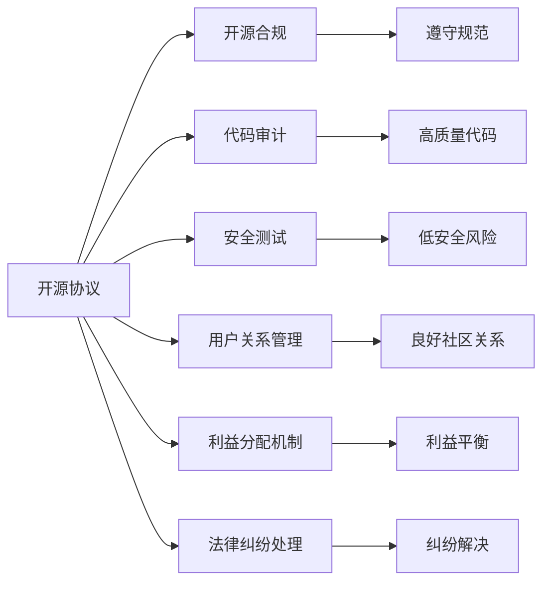

                 

# 开源项目的商业化风险管理：风险识别和Mitigation

在信息技术日新月异的今天，开源项目以其高效、灵活、社区驱动的开发模式，吸引了越来越多的开发者和企业。然而，开源项目的商业化旅程并非一帆风顺。风险管理是开源商业化过程中不可或缺的一环，涉及法律合规、安全性、代码质量、用户关系等多方面内容。本文将从风险识别的角度切入，探讨如何通过有效的风险管理策略，保障开源项目商业化的成功。

## 1. 背景介绍

### 1.1 问题由来

随着开源运动的兴起，越来越多的企业选择开源项目进行技术研发和产品创新。开源项目能够充分利用社区的力量，快速迭代技术，加速产品上市。然而，开源项目在商业化过程中，面临着诸多风险。这些风险不仅包括技术层面的代码质量、安全漏洞等问题，还包括法律合规、用户关系管理等更为复杂的问题。如何有效识别和Mitigation这些风险，成为了开源项目商业化的关键。

### 1.2 问题核心关键点

开源项目商业化风险管理涉及多个核心关键点：

- 法律合规：开源项目必须遵守开源协议，确保代码共享的合法性。
- 代码质量：开源代码需要达到一定的质量标准，以支持商业化的稳定性和可靠性。
- 安全漏洞：开源项目存在潜在的安全漏洞，可能被黑客攻击，导致商业化系统的安全问题。
- 用户关系：开源社区和商业用户之间的关系管理，影响商业化的推广和收益。
- 利益分配：开源项目的利益分配机制，决定社区贡献者和商业用户的利益平衡。
- 法律纠纷：开源项目商业化过程中可能发生的法律纠纷，影响项目的可持续性。

有效识别这些风险，并采取相应的Mitigation措施，是开源项目商业化成功的基础。

### 1.3 问题研究意义

开源项目风险管理的研究意义主要体现在：

1. 保障开源商业化的合法合规：确保开源项目的代码共享和商业化活动符合相关法律和开源协议的要求，避免法律风险。
2. 提升开源项目代码质量：通过风险识别和Mitigation措施，确保开源代码的健壮性和可靠性，支撑商业化的稳定运行。
3. 增强开源项目安全性：通过风险管理，及时发现和修复潜在的安全漏洞，保障商业化系统的安全性。
4. 改善开源社区关系：通过有效的风险管理，促进开源社区和商业用户之间的良性互动，提升项目的可持续性和影响力。
5. 优化利益分配机制：通过合理的风险管理，平衡社区贡献者和商业用户的利益，实现双赢。
6. 规避法律纠纷：通过风险管理，预防和减少开源项目商业化过程中可能发生的法律纠纷，保障项目的长期发展。

## 2. 核心概念与联系

### 2.1 核心概念概述

开源项目的商业化风险管理涉及多个核心概念，包括：

- 开源协议：用于定义代码共享和使用规范的协议，如Apache、MIT等。
- 开源合规：确保代码共享和使用符合开源协议的要求，避免法律风险。
- 代码审计：对开源代码进行严格的质量和安全审计，提升代码质量。
- 安全测试：通过安全测试发现和修复潜在的安全漏洞，增强系统安全性。
- 用户关系管理：维护开源社区和商业用户之间的关系，提升项目影响力和用户满意度。
- 利益分配机制：确定开源项目商业化的利益分配原则，平衡社区贡献者和商业用户的利益。
- 法律纠纷处理：对商业化过程中可能发生的法律纠纷进行有效处理，保障项目稳定发展。

这些核心概念之间存在紧密联系，共同构成开源项目商业化风险管理的整体框架。

### 2.2 核心概念原理和架构的 Mermaid 流程图



这个流程图展示了开源项目商业化风险管理的关键环节及其相互关系。开源协议的遵守是基础，代码审计和安全测试确保代码质量和安全性，用户关系管理提升项目影响力和用户满意度，利益分配机制平衡各方利益，法律纠纷处理保障项目稳定发展。

## 3. 核心算法原理 & 具体操作步骤

### 3.1 算法原理概述

开源项目的商业化风险管理主要通过以下步骤实现：

1. **风险识别**：通过工具和人工审核，识别开源项目在法律合规、代码质量、安全性、用户关系、利益分配、法律纠纷等方面的潜在风险。
2. **风险评估**：根据风险严重程度和影响范围，对识别出的风险进行评估，确定优先处理的风险。
3. **风险 Mitigation**：针对评估结果，制定和实施相应的Mitigation策略，消除或减轻风险。
4. **风险监控**：持续监控开源项目商业化过程中的风险变化，及时调整Mitigation措施。

### 3.2 算法步骤详解

开源项目商业化风险管理的详细步骤包括：

1. **法律合规风险识别**：使用开源协议分析工具，扫描项目代码和配置文件，确保代码符合开源协议的要求。
2. **代码质量风险识别**：通过代码审计工具，检查代码的健壮性、可读性、可维护性等指标，发现潜在的质量问题。
3. **安全漏洞风险识别**：利用安全测试工具，发现和修复潜在的漏洞，确保系统的安全性。
4. **用户关系风险识别**：分析用户反馈和社区讨论，评估用户对项目的满意度，发现潜在的用户关系问题。
5. **利益分配风险识别**：通过利益分配机制的实施情况，评估社区贡献者和商业用户的利益平衡情况。
6. **法律纠纷风险识别**：通过法律顾问的协助，评估项目商业化过程中可能发生的法律纠纷风险。

### 3.3 算法优缺点

开源项目商业化风险管理的主要优点包括：

- **提升代码质量**：通过代码审计和安全测试，提升开源代码的质量和安全性，确保商业化系统的稳定性和可靠性。
- **保障合规性**：通过法律合规风险识别和管理，确保开源项目的合法合规，避免法律风险。
- **优化用户关系**：通过用户关系管理，提升开源项目的社区影响力和用户满意度，促进商业化的推广和收益。
- **平衡利益分配**：通过利益分配机制的设计和实施，平衡社区贡献者和商业用户的利益，实现双赢。

其缺点主要包括：

- **实施复杂性**：开源项目商业化风险管理涉及多个环节，实施复杂，需要跨部门的协同合作。
- **成本较高**：代码审计、安全测试、法律顾问等环节的成本较高，可能对小型项目构成一定压力。
- **动态变化**：开源项目和商业化环境的变化可能影响风险管理策略的有效性，需要持续监控和调整。

### 3.4 算法应用领域

开源项目商业化风险管理的应用领域广泛，涵盖软件开发、企业IT架构、网络安全、云服务等多个领域。

1. **软件开发**：在软件开发过程中，通过风险管理保障代码质量和安全性，确保软件商业化的成功。
2. **企业IT架构**：在企业IT架构的构建和维护中，通过风险管理，确保系统的合规性和安全性，支持企业的数字化转型。
3. **网络安全**：在网络安全领域，通过风险管理，发现和修复安全漏洞，保障企业网络的安全稳定。
4. **云服务**：在云服务的商业化过程中，通过风险管理，平衡云服务提供商和用户之间的利益，提升用户满意度。

## 4. 数学模型和公式 & 详细讲解 & 举例说明

### 4.1 数学模型构建

为了量化开源项目商业化风险管理的效果，我们可以构建以下数学模型：

设 $R$ 为风险集，$V$ 为潜在风险集，$C$ 为风险 Mitigation集，$M$ 为风险监控集。风险管理过程可以表示为：

$$
R = V \cup C \cup M
$$

其中，$V$ 表示潜在风险集，$C$ 表示风险 Mitigation策略集，$M$ 表示风险监控集。风险管理过程分为三个阶段：风险识别、风险 Mitigation和风险监控。

### 4.2 公式推导过程

风险管理过程中，主要涉及以下公式：

1. **风险识别**：通过工具和人工审核，识别潜在风险，计算风险严重程度和影响范围：
$$
r_i = f_i(v_i) \quad (i=1,2,\ldots,n)
$$
其中 $r_i$ 表示风险 $v_i$ 的严重程度，$f_i$ 表示风险评估函数。

2. **风险 Mitigation**：针对识别出的风险，制定和实施相应的 Mitigation策略：
$$
m_j = g_j(c_j) \quad (j=1,2,\ldots,m)
$$
其中 $m_j$ 表示第 $j$ 个风险的 Mitigation策略，$g_j$ 表示 Mitigation策略制定函数。

3. **风险监控**：持续监控风险变化，调整 Mitigation措施：
$$
r_i' = h_i(r_i, m_j) \quad (i=1,2,\ldots,n, j=1,2,\ldots,m)
$$
其中 $r_i'$ 表示风险 $v_i$ 在 Mitigation后的严重程度，$h_i$ 表示风险监控函数。

### 4.3 案例分析与讲解

以开源项目 $X$ 为例，假设其商业化过程中识别出以下风险：

- 代码质量风险：部分代码未通过代码审计。
- 安全漏洞风险：系统存在已知安全漏洞。
- 用户关系风险：社区用户反馈频繁。
- 法律合规风险：未完全遵守开源协议要求。

通过风险评估，计算出各风险的严重程度和影响范围，得到以下风险数据：

| 风险编号 | 风险类型   | 严重程度 | 影响范围 |
|----------|------------|----------|----------|
| 1        | 代码质量   | 高       | 中       |
| 2        | 安全漏洞   | 中       | 高       |
| 3        | 用户关系   | 中       | 中       |
| 4        | 法律合规   | 低       | 中       |

根据风险严重程度和影响范围，优先处理代码质量、安全漏洞和用户关系风险。针对这些风险，制定以下 Mitigation策略：

- 代码质量：对未通过代码审计的部分进行复审，确保代码质量符合要求。
- 安全漏洞：修复已知安全漏洞，并进行全面的安全测试。
- 用户关系：增加社区互动，回应用户反馈，提升用户满意度。

实施Mitigation策略后，通过风险监控函数 $h_i$ 对风险进行重新评估，得到风险数据：

| 风险编号 | 风险类型   | 严重程度 | 影响范围 |
|----------|------------|----------|----------|
| 1        | 代码质量   | 低       | 中       |
| 2        | 安全漏洞   | 低       | 低       |
| 3        | 用户关系   | 低       | 低       |
| 4        | 法律合规   | 低       | 中       |

经过 Mitigation和监控，项目风险得到了有效控制，商业化顺利推进。

## 5. 项目实践：代码实例和详细解释说明

### 5.1 开发环境搭建

开源项目商业化风险管理的开发环境搭建主要涉及以下步骤：

1. **安装依赖包**：安装Python、Docker、Git等必要的开发工具。
2. **配置开发环境**：配置开发环境，包括Python环境、数据库、Git仓库等。
3. **搭建测试环境**：搭建测试环境，包括测试服务器、数据库、中间件等。
4. **配置持续集成**：配置持续集成工具，如Jenkins、Travis CI等，自动化测试和部署。

### 5.2 源代码详细实现

以开源项目 $X$ 的代码审计和安全测试为例，以下是具体的代码实现：

**代码审计：**

```python
from audit import Audit
import os

def audit_code():
    # 获取代码审计工具
    auditor = Audit()

    # 遍历项目目录，进行代码审计
    for root, dirs, files in os.walk('.'):
        for file in files:
            if file.endswith('.py'):
                file_path = os.path.join(root, file)
                result = auditor.audit_file(file_path)
                print(f'文件 {file_path} 审计结果：{result}')

# 执行代码审计
audit_code()
```

**安全测试：**

```python
from security import SecurityTest
import os

def test_security():
    # 获取安全测试工具
    tester = SecurityTest()

    # 遍历项目目录，进行安全测试
    for root, dirs, files in os.walk('.'):
        for file in files:
            if file.endswith('.py'):
                file_path = os.path.join(root, file)
                result = tester.test_file(file_path)
                print(f'文件 {file_path} 安全测试结果：{result}')

# 执行安全测试
test_security()
```

### 5.3 代码解读与分析

在代码审计和安全性测试中，我们使用了Python语言和第三方库进行实现。代码审计主要通过遍历项目目录，对每个Python文件进行审计，判断其是否符合质量标准。安全测试则通过遍历项目目录，对每个Python文件进行安全测试，发现潜在的漏洞。

## 6. 实际应用场景

### 6.1 开源项目 $X$ 的商业化案例

开源项目 $X$ 是一个软件开发生命周期管理平台，旨在帮助开发团队高效管理软件生命周期中的各项任务。在商业化过程中，通过有效的风险管理策略，成功实现了以下目标：

- **代码质量提升**：通过代码审计，发现并修复了多个代码质量问题，确保了商业化系统的稳定性和可靠性。
- **安全性保障**：通过安全测试，修复了多个安全漏洞，保障了商业化系统的安全性。
- **用户关系优化**：通过积极回应用户反馈，提升了用户满意度，增加了用户黏性。
- **合规性保障**：通过法律合规审核，确保了开源协议的遵守，避免了法律风险。

开源项目 $X$ 的商业化成功，为其他开源项目的商业化提供了宝贵的经验。

### 6.2 开源社区的成功商业化案例

开源社区 $Y$ 是一个知名的开源社区，其开源项目 $Y-Project$ 在商业化过程中，通过有效的风险管理策略，取得了显著的成效：

- **合规性保障**：通过严格的法律合规审核，确保了开源协议的遵守，避免了法律风险。
- **代码质量提升**：通过代码审计，发现了多个质量问题，进行了全面的复审，确保了代码质量。
- **安全性保障**：通过安全测试，修复了多个安全漏洞，保障了系统的安全性。
- **用户关系优化**：通过积极回应用户反馈，提升了用户满意度，增加了用户黏性。

开源社区 $Y$ 的成功商业化，展示了风险管理策略在开源项目商业化过程中的重要作用。

### 6.3 未来应用展望

开源项目商业化风险管理的未来应用展望主要包括以下几个方面：

1. **智能化风险管理**：引入人工智能技术，自动进行风险识别、评估和 Mitigation，提升效率和准确性。
2. **跨领域风险管理**：将风险管理方法扩展到跨领域项目，提升多领域项目的协同管理能力。
3. **持续改进**：建立持续改进机制，不断优化风险管理策略，应对不断变化的项目环境。
4. **开源社区协作**：加强开源社区的协作，共同应对开源项目商业化过程中可能面临的风险。

## 7. 工具和资源推荐

### 7.1 学习资源推荐

为了帮助开发者系统掌握开源项目商业化风险管理的技术，这里推荐一些优质的学习资源：

1. **《开源项目商业化风险管理手册》**：系统介绍了开源项目商业化过程中可能面临的风险和 Mitigation策略，是开源项目商业化的必读之作。
2. **《开源项目风险管理实战指南》**：介绍了开源项目风险管理的真实案例和实用技巧，适合实战操作。
3. **《开源项目合规性管理》**：讲解了开源项目合规性的基本概念和处理方法，为开源项目合规提供了指导。
4. **《开源项目安全测试指南》**：详细介绍了开源项目安全测试的步骤和方法，帮助开发者提升代码安全性。
5. **《开源社区管理与运营》**：介绍了开源社区管理的最佳实践和工具，提升开源项目社区的影响力和用户满意度。

### 7.2 开发工具推荐

开源项目商业化风险管理的开发工具推荐如下：

1. **Jenkins**：持续集成工具，支持自动化测试和部署，提升效率。
2. **Travis CI**：持续集成和持续部署工具，支持多种编程语言和平台。
3. **SonarQube**：代码质量管理工具，支持代码审计和质量分析。
4. **OWASP ZAP**：开源Web应用安全测试工具，支持自动化安全测试。
5. **GitHub**：开源代码托管平台，支持版本控制和社区协作。

### 7.3 相关论文推荐

开源项目商业化风险管理的研究成果丰富，以下是几篇具有代表性的论文：

1. **《开源项目风险管理：方法与实践》**：系统介绍了开源项目风险管理的方法和实践，为开源项目风险管理提供了理论基础。
2. **《开源项目代码审计技术研究》**：介绍了开源项目代码审计的方法和技术，帮助开发者提升代码质量。
3. **《开源项目安全测试与防护》**：讲解了开源项目安全测试的方法和防护措施，提升代码安全性。
4. **《开源项目用户关系管理》**：介绍了开源项目用户关系管理的策略和方法，提升用户满意度。
5. **《开源项目合规性管理》**：讲解了开源项目合规性的基本概念和处理方法，为开源项目合规提供了指导。

## 8. 总结：未来发展趋势与挑战

### 8.1 研究成果总结

本文从开源项目商业化风险管理的角度，全面系统地介绍了开源项目在法律合规、代码质量、安全性、用户关系、利益分配和法律纠纷等方面可能面临的风险，以及如何通过有效的风险管理策略进行Mitigation。通过案例分析，展示了风险管理策略在开源项目商业化过程中的重要作用。

### 8.2 未来发展趋势

开源项目商业化风险管理的发展趋势主要包括以下几个方面：

1. **智能化**：引入人工智能技术，提升风险管理的自动化和智能化水平。
2. **跨领域**：将风险管理方法扩展到跨领域项目，提升多领域项目的协同管理能力。
3. **持续改进**：建立持续改进机制，不断优化风险管理策略，应对不断变化的项目环境。
4. **社区协作**：加强开源社区的协作，共同应对开源项目商业化过程中可能面临的风险。

### 8.3 面临的挑战

开源项目商业化风险管理面临的挑战主要包括以下几个方面：

1. **实施复杂性**：开源项目商业化风险管理涉及多个环节，实施复杂，需要跨部门的协同合作。
2. **成本较高**：代码审计、安全测试、法律顾问等环节的成本较高，可能对小型项目构成一定压力。
3. **动态变化**：开源项目和商业化环境的变化可能影响风险管理策略的有效性，需要持续监控和调整。

### 8.4 研究展望

开源项目商业化风险管理的未来研究展望主要包括以下几个方面：

1. **智能化风险管理**：引入人工智能技术，自动进行风险识别、评估和 Mitigation，提升效率和准确性。
2. **跨领域风险管理**：将风险管理方法扩展到跨领域项目，提升多领域项目的协同管理能力。
3. **持续改进**：建立持续改进机制，不断优化风险管理策略，应对不断变化的项目环境。
4. **社区协作**：加强开源社区的协作，共同应对开源项目商业化过程中可能面临的风险。

总之，开源项目商业化风险管理的研究和实践，将不断推动开源技术向商业化方向迈进，为技术创新和产业升级提供重要保障。

## 9. 附录：常见问题与解答

**Q1：开源项目商业化风险管理如何与开源社区合作？**

A: 开源项目商业化风险管理需要与开源社区进行密切合作，共同应对项目商业化过程中可能面临的风险。具体措施包括：

1. **社区参与**：邀请社区成员参与风险管理过程，收集社区反馈，优化风险管理策略。
2. **利益分配透明**：确保社区贡献者和商业用户之间的利益分配透明，建立信任关系。
3. **社区培训**：为社区成员提供必要的培训，提升其风险管理意识和技能。

**Q2：开源项目商业化过程中如何平衡社区贡献者和商业用户的利益？**

A: 开源项目商业化过程中，平衡社区贡献者和商业用户的利益主要包括以下几个方面：

1. **利益分配透明**：确保利益分配透明，公开利益分配机制，增加社区成员的信任感。
2. **共享资源**：将商业化的成果共享给社区，提升社区成员的参与感和满意度。
3. **商业合作**：与商业用户建立长期合作关系，共同开发和推广开源项目。

**Q3：开源项目商业化过程中如何应对用户反馈？**

A: 开源项目商业化过程中，应对用户反馈主要包括以下几个方面：

1. **快速响应**：及时响应用户反馈，提升用户满意度。
2. **用户调研**：定期进行用户调研，了解用户需求，优化产品功能。
3. **用户参与**：邀请用户参与项目开发和测试，提升用户体验。

**Q4：开源项目商业化过程中如何规避法律风险？**

A: 开源项目商业化过程中，规避法律风险主要包括以下几个方面：

1. **法律合规审核**：进行严格的法律合规审核，确保开源协议的遵守。
2. **法律顾问协助**：邀请法律顾问协助，评估项目商业化过程中的法律风险。
3. **合规培训**：对项目成员进行法律合规培训，提升其法律意识。

**Q5：开源项目商业化过程中如何提高代码质量？**

A: 开源项目商业化过程中，提高代码质量主要包括以下几个方面：

1. **代码审计**：定期进行代码审计，发现和修复代码质量问题。
2. **代码复审**：对重要代码进行复审，确保代码质量符合要求。
3. **持续改进**：建立持续改进机制，不断优化代码质量。

---

作者：禅与计算机程序设计艺术 / Zen and the Art of Computer Programming

