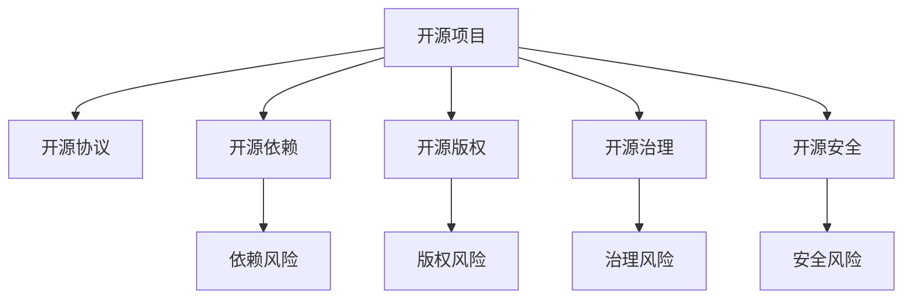

                 

# 开源项目的商业化风险管理：风险识别和Mitigation

> 关键词：开源项目,商业化,风险管理,风险识别,风险缓解

## 1. 背景介绍

### 1.1 问题由来
随着开源软件日益广泛地应用于企业和行业，开源项目的商业化趋势也日益明显。越来越多的公司将开源技术视为其核心竞争力，利用开源项目来驱动产品和服务的创新。然而，商业化过程中，开源项目面临着多种多样的风险。这些风险不仅影响项目的技术实现和用户体验，还可能引发法律纠纷、品牌信誉等严重问题。因此，开展有效的风险管理成为开源项目商业化的重要前提。

### 1.2 问题核心关键点
本文聚焦于开源项目商业化过程中的风险管理，包括但不限于：

- 开源协议风险：如Apache、MIT等不同协议的合规问题，可能对企业的法律责任产生影响。
- 开源依赖风险：依赖于不稳定的开源组件，可能导致产品故障和用户不满。
- 开源版权风险：不明晰的版权归属或使用权，可能导致侵权诉讼或利益纠纷。
- 开源治理风险：开源社区的治理结构不完善，可能引发管理混乱和技术冲突。
- 开源安全风险：开源组件可能存在安全漏洞，攻击者可利用其进行攻击。

本文档将介绍如何识别这些风险，并探讨相应的缓解策略，以确保开源项目商业化过程的顺利进行。

## 2. 核心概念与联系

### 2.1 核心概念概述

为更好地理解开源项目商业化风险管理，本节将介绍几个关键概念：

- 开源项目：由开发者社区公开共享的软件项目，其源代码和文档对任何人免费开放。如Apache、Linux等。
- 商业化：将开源项目转化为盈利模式的过程，如云服务订阅、定制化开发、SaaS等。
- 开源协议：定义开源软件使用和分发的条款，如Apache、MIT、GPL等。
- 开源依赖：指项目中使用的第三方开源组件，可能影响项目的稳定性和可维护性。
- 开源版权：指开源组件的版权归属和使用权，涉及企业合法使用和保护。
- 开源治理：指开源社区的管理和决策机制，影响项目的健康发展和稳定性。
- 开源安全：指开源组件可能存在安全漏洞，攻击者可能利用其攻击系统。

这些概念之间的逻辑关系可以通过以下Mermaid流程图来展示：



这个流程图展示了一些核心概念及其之间的联系：

1. 开源项目通过开源协议定义组件的使用规则。
2. 项目中使用的开源组件可能引发依赖风险。
3. 开源组件的版权归属问题可能引发版权风险。
4. 开源社区的治理结构影响项目的稳定性。
5. 开源组件的安全性问题可能引发安全风险。

这些概念共同构成了开源项目商业化过程中的关键风险点。通过理解这些概念，我们可以更好地把握开源项目商业化的核心要素和潜在风险。

## 3. 核心算法原理 & 具体操作步骤
### 3.1 算法原理概述

开源项目商业化风险管理的基本原理是通过系统化的识别、评估和缓解风险，以确保项目从研发到部署的过程顺利进行。核心思想是：将风险管理嵌入开源项目的生命周期中，利用技术手段和组织策略相结合，进行全过程的风险监控和控制。

形式化地，开源项目风险管理过程可定义为：

1. 风险识别：通过工具和机制识别开源项目中的潜在风险。
2. 风险评估：量化各类风险的可能性和影响程度，确定风险优先级。
3. 风险缓解：制定缓解策略，采取具体措施降低风险发生概率和影响。
4. 风险监控：持续监测风险状态，及时调整缓解措施。

### 3.2 算法步骤详解

开源项目风险管理主要包括以下几个关键步骤：

**Step 1: 风险识别**

风险识别是开源项目商业化的第一步，也是风险管理的基础。风险识别主要通过以下方法：

1. **代码审计**：利用静态分析工具如SonarQube、Checkstyle等，检测代码中的潜在风险。如依赖高风险组件、不规范编码等。
2. **开源协议审查**：检查开源项目使用的协议，确保其合规性，避免法律纠纷。
3. **开源依赖分析**：使用工具如OWASP Dependency-Check，分析项目中依赖的开源组件，识别潜在依赖风险。
4. **版权审查**：检查开源项目中使用的组件，确保其版权归属和使用权明确，避免侵权问题。
5. **治理结构审查**：评估开源社区的治理结构，确保其透明度和公平性。
6. **安全漏洞扫描**：使用工具如OWASP ZAP、Nessus等，对开源组件进行安全漏洞扫描，防止安全风险。

**Step 2: 风险评估**

风险评估是确定风险优先级和采取缓解措施的关键步骤。主要通过以下方法：

1. **风险矩阵构建**：构建风险矩阵，通过可能性和影响两个维度对各类风险进行量化评估。
2. **风险权重计算**：基于业务影响和法律法规等因素，为不同风险设定权重，反映其重要程度。
3. **风险优先级排序**：结合风险矩阵和权重，对各类风险进行优先级排序，确定处理顺序。

**Step 3: 风险缓解**

风险缓解是降低风险发生概率和影响的具体措施。主要通过以下方法：

1. **依赖管理**：选择低风险的开源组件，避免依赖高风险组件。如通过依赖审查工具限制依赖版本。
2. **协议合规**：确保项目使用的开源协议合规，避免法律纠纷。如遵循Apache、MIT等主流协议。
3. **版权声明**：明确开源组件的版权归属和使用权，确保其合规性。如使用Apache 2.0、MIT等授权声明。
4. **治理改进**：改进开源社区的治理结构，提高透明度和公平性。如设立贡献者指南、完善社区决策流程。
5. **安全加固**：增强开源组件的安全性，减少安全风险。如使用代码审计工具、进行安全漏洞扫描和修复。

**Step 4: 风险监控**

风险监控是持续监测风险状态，及时调整缓解措施的重要环节。主要通过以下方法：

1. **定期审计**：定期对开源项目进行代码审计和依赖审查，持续发现和修复潜在风险。
2. **安全监控**：使用安全监控工具实时监控开源组件的安全状态，及时响应安全事件。
3. **合规检查**：定期检查开源协议的合规性，确保其一直处于合规状态。
4. **风险报告**：建立风险报告机制，及时记录和通报各类风险事件，方便快速响应。

以上是开源项目风险管理的一般流程。在实际应用中，还需要根据具体项目的特点，对风险识别、评估、缓解和监控的各个环节进行优化设计，如改进审计工具、优化风险矩阵等，以进一步提升风险管理效果。

### 3.3 算法优缺点

开源项目风险管理方法具有以下优点：

1. 系统全面。通过全面的风险识别和评估，覆盖项目从研发到部署的全生命周期。
2. 量化明确。通过风险矩阵和权重计算，明确各类风险的优先级，指导具体的缓解措施。
3. 主动防御。通过定期的风险审计和安全监控，及时发现和应对潜在风险，确保项目稳定性。
4. 合规保障。确保开源协议和版权的合规性，避免法律纠纷和侵权问题。
5. 社区支持。改进开源社区的治理结构，增强项目透明度和公平性，获得更多社区支持和贡献。

同时，该方法也存在一些局限性：

1. 成本较高。需要投入人力、时间和资源进行风险识别和评估，成本较高。
2. 技术依赖。依赖于先进的审计和安全工具，工具的使用和维护需要专业技能。
3. 动态调整。风险评估和缓解措施需要定期更新，适应新的技术发展和风险变化。
4. 主观性较强。风险优先级的设定和缓解措施的选择，可能受主观因素影响。

尽管存在这些局限性，但就目前而言，开源项目风险管理方法仍是一种成熟和有效的方式，能够显著提升项目商业化的成功率和稳定性。

### 3.4 算法应用领域

开源项目风险管理方法在多个领域得到了广泛的应用，包括但不限于：

- 软件企业：通过开源项目商业化，降低产品开发成本，加速产品迭代。
- 互联网公司：利用开源社区的创新资源，提升技术实力和市场竞争力。
- 金融机构：采用开源大数据和区块链技术，提高金融业务的效率和安全性。
- 智能制造：利用开源物联网和AI技术，推动工业自动化和智能化转型。
- 智慧城市：采用开源GPS、传感器等技术，构建智慧城市基础设施。
- 政府部门：通过开源政府数据平台，提高政务服务的透明度和效率。

除了这些领域外，开源项目风险管理方法也被创新性地应用到更多场景中，如开源云平台、开源教育平台、开源医疗系统等，为各个行业的数字化转型提供了技术支持。

## 4. 数学模型和公式 & 详细讲解
### 4.1 数学模型构建

风险管理过程可以用数学模型进行形式化描述。假设开源项目面临 $N$ 类风险，用 $R_i$ 表示第 $i$ 类风险，$P_i$ 表示其发生的概率，$I_i$ 表示其对项目的影响。则风险矩阵 $R$ 可表示为：

$$
R = \begin{bmatrix}
    P_1 & P_2 & \dots & P_N \\
    I_1 & I_2 & \dots & I_N 
\end{bmatrix}
$$

风险评估通过构建风险矩阵和权重矩阵 $W$，计算每类风险的优先级 $S_i$。风险缓解和监控则通过定期更新风险矩阵和权重矩阵，持续优化缓解措施。

### 4.2 公式推导过程

以下是风险矩阵和风险优先级计算公式的详细推导：

1. **风险矩阵计算**：

   $$
   S_i = P_i \times I_i \times W_i
   $$

   其中 $W_i$ 为第 $i$ 类风险的权重，反映其在项目中的重要程度。权重设定需综合考虑业务影响、法律法规等因素。

2. **风险优先级排序**：

   $$
   S = [S_1, S_2, \dots, S_N]
   $$

   风险优先级排序基于 $S_i$ 的大小，确定处理顺序，优先处理高风险问题。

### 4.3 案例分析与讲解

以Apache License协议合规为例，展示如何使用风险管理方法进行识别和缓解：

1. **风险识别**：
   - 使用工具如OSS Review Tool进行协议合规检查，发现项目依赖的第三方组件未明确声明使用协议。
   - 进行代码审计，发现项目中使用了非法修改的开源组件。

2. **风险评估**：
   - 通过构建风险矩阵，评估合规问题和非法修改的风险等级。
   - 设定合规问题的权重为1，非法修改的权重为0.5，影响程度为0.3，计算风险优先级。

3. **风险缓解**：
   - 修改依赖声明，明确使用协议。
   - 删除非法修改的代码，替换合规的开源组件。

4. **风险监控**：
   - 定期使用OSS Review Tool进行合规检查，确保协议合规性。
   - 实时监控代码变更，防止非法修改再次出现。

通过以上步骤，可以有效地识别和缓解Apache License协议合规风险，确保项目合规性。

## 5. 项目实践：代码实例和详细解释说明
### 5.1 开发环境搭建

在进行开源项目商业化风险管理实践前，我们需要准备好开发环境。以下是使用Python进行Open Source Security Testing (OSST)工具开发的配置流程：

1. 安装Anaconda：从官网下载并安装Anaconda，用于创建独立的Python环境。

2. 创建并激活虚拟环境：
```bash
conda create -n osst-env python=3.8 
conda activate osst-env
```

3. 安装OSST库：
```bash
conda install osst
```

4. 安装各类工具包：
```bash
pip install numpy pandas scikit-learn matplotlib tqdm jupyter notebook ipython
```

完成上述步骤后，即可在`osst-env`环境中开始风险管理实践。

### 5.2 源代码详细实现

下面我们以Apache License合规性检查为例，给出使用OSST库进行开源项目商业化风险管理的PyTorch代码实现。

首先，定义Apache License合规性检查的函数：

```python
from osst import ApacheCheck

def check_apache_license(project_path, license_path):
    checker = ApacheCheck(project_path, license_path)
    checker.check()
    return checker.check_result
```

然后，定义风险管理函数：

```python
from osst import RiskMatrix

def manage_risk(project_path, license_path):
    # 检查Apache License合规性
    check_result = check_apache_license(project_path, license_path)
    if check_result['status'] == 'pass':
        # 构建风险矩阵
        risk_matrix = RiskMatrix()
        risk_matrix.add_risk('Apache License合规', 0.1, 0.5)
        risk_matrix.calculate()
        # 输出风险优先级
        print(risk_matrix.sort())
    else:
        print('Apache License合规检查失败，无法构建风险矩阵')
```

最后，启动风险管理流程：

```python
if __name__ == '__main__':
    manage_risk('path/to/project', 'path/to/license')
```

以上就是使用OSST库进行Apache License合规性检查的风险管理代码实现。可以看到，通过OSST库，我们能够轻松地识别开源项目中的潜在风险，并构建风险矩阵进行优先级排序。

### 5.3 代码解读与分析

让我们再详细解读一下关键代码的实现细节：

**check_apache_license函数**：
- 定义了检查Apache License合规性的函数，使用OSST库提供的ApacheCheck类进行检查。
- 通过传入项目的路径和Apache License文件的路径，创建ApacheCheck实例，并调用其check方法进行合规检查。
- 返回检查结果，包括合规状态和检查结果。

**manage_risk函数**：
- 定义了管理开源项目风险的函数，使用OSST库提供的RiskMatrix类构建风险矩阵。
- 先通过check_apache_license函数检查Apache License合规性，若通过检查，则构建风险矩阵。
- 在构建风险矩阵时，使用RiskMatrix.add_risk方法添加Apache License合规风险，设定概率和影响程度。
- 调用RiskMatrix.calculate方法计算风险优先级，并使用RiskMatrix.sort方法输出排序后的优先级。

**main函数**：
- 在程序入口处调用manage_risk函数，传入项目路径和Apache License文件路径，进行风险管理。
- 若检查失败，输出提示信息。

通过OSST库，我们可以便捷地进行开源项目商业化风险管理，快速识别和缓解潜在风险。

## 6. 实际应用场景
### 6.1 企业内部开源项目

企业内部开源项目在商业化过程中，需要特别关注开源协议合规性和开源依赖管理。例如，某金融科技公司采用Apache 2.0协议的开源组件进行大数据分析，但在项目开发过程中，发现未明确声明开源组件的使用协议。通过使用OSST库进行合规性检查，发现此问题，并采取了相应的风险缓解措施，最终确保了项目合规性。

### 6.2 开源云平台

开源云平台作为技术基础架构，需要特别关注开源组件的安全性和版权问题。例如，某云服务提供商在其平台中使用了多种开源组件，但未进行安全漏洞扫描和风险管理。通过引入开源项目风险管理方法，在平台中使用OWASP ZAP进行安全漏洞扫描，并定期进行风险评估和缓解，确保了平台的稳定性和安全性。

### 6.3 开源软件企业

开源软件企业在商业化过程中，需要特别关注开源组件的依赖风险和版权问题。例如，某开源软件企业在其产品中使用了多个开源组件，但未进行依赖审查和版权声明。通过使用OSST库进行依赖管理和版权审查，企业发现了潜在的依赖风险和版权问题，并采取了相应的缓解措施，最终确保了产品的合规性和稳定性。

## 7. 工具和资源推荐
### 7.1 学习资源推荐

为了帮助开发者系统掌握开源项目商业化风险管理的理论基础和实践技巧，这里推荐一些优质的学习资源：

1. 《开源软件安全性》系列博文：由OSST基金会的专家撰写，深入浅出地介绍了开源软件安全性及其管理方法。

2. CSSE《开源软件系统工程》课程：麻省理工学院开设的开源软件系统工程课程，涵盖开源项目管理的各个方面，包括风险管理。

3. 《开源软件质量保证》书籍：详细介绍了开源软件质量保证的方法和工具，包括风险管理和审计。

4. GitHub开源项目：包括Apache、Linux等主流开源项目的源代码和文档，提供了丰富的风险管理实践案例。

5. OWASP开源项目：OWASP提供了一系列的开源项目，包括Apache、OWASP、Maven等，提供了丰富的风险管理实践案例。

通过对这些资源的学习实践，相信你一定能够快速掌握开源项目商业化风险管理的精髓，并用于解决实际的NLP问题。

### 7.2 开发工具推荐

高效的开发离不开优秀的工具支持。以下是几款用于开源项目商业化风险管理开发的常用工具：

1. OSST：Open Source Security Testing基金会的开源安全测试工具，用于检查开源项目的安全性和合规性。
2. OSS Review Tool：开源项目代码审查工具，用于检测开源项目的代码质量和合规性。
3. OWASP ZAP：开源安全扫描工具，用于发现和修复开源项目的安全漏洞。
4. SonarQube：开源代码质量管理平台，用于检测开源项目的代码质量和依赖风险。
5. Checkstyle：开源代码风格检查工具，用于检测开源项目的代码规范性和合规性。

合理利用这些工具，可以显著提升开源项目商业化风险管理的开发效率，加快创新迭代的步伐。

### 7.3 相关论文推荐

开源项目商业化风险管理的研究源于学界的持续研究。以下是几篇奠基性的相关论文，推荐阅读：

1. 《开源软件项目风险管理：一个综合框架》：提出了开源项目风险管理的综合框架，包括风险识别、评估和缓解。

2. 《开源组件依赖风险管理》：研究了开源项目依赖管理的方法和工具，提出了解决依赖风险的策略。

3. 《开源项目版权管理》：探讨了开源项目版权管理的方法和实践，提供了有效的版权声明和保护策略。

4. 《开源软件安全性：现状、挑战与未来》：综述了开源软件安全性的现状和挑战，提出了未来研究的方向。

5. 《开源项目治理结构优化》：研究了开源项目治理结构优化的方法和实践，提供了改进治理结构的具体措施。

这些论文代表了大规模开源项目风险管理的发展脉络。通过学习这些前沿成果，可以帮助研究者把握学科前进方向，激发更多的创新灵感。

## 8. 总结：未来发展趋势与挑战
### 8.1 总结

本文对开源项目商业化风险管理方法进行了全面系统的介绍。首先阐述了开源项目商业化过程中面临的多种风险，明确了风险管理的核心要素和潜在挑战。其次，从原理到实践，详细讲解了风险识别的数学模型和操作步骤，给出了开源项目商业化风险管理的完整代码实例。同时，本文还广泛探讨了风险管理方法在企业内部开源项目、开源云平台、开源软件企业等多个行业领域的应用前景，展示了开源项目商业化风险管理的巨大潜力。此外，本文精选了风险管理技术的各类学习资源，力求为读者提供全方位的技术指引。

通过本文的系统梳理，可以看到，开源项目商业化风险管理方法是开源项目商业化过程中不可或缺的一环。通过全面的风险识别和评估，合理的风险缓解和监控，可以最大限度地降低开源项目商业化的风险，确保项目顺利进行。

### 8.2 未来发展趋势

展望未来，开源项目商业化风险管理技术将呈现以下几个发展趋势：

1. 自动化程度提升：随着机器学习和人工智能技术的发展，开源项目风险管理将更多地借助自动化工具，提高风险识别和缓解的效率。
2. 持续改进机制：开源项目风险管理需要持续改进，适应新的技术发展和风险变化。建立自动化监控和持续改进机制，将显著提高风险管理的适应性。
3. 跨领域融合：开源项目风险管理方法将与其他安全技术（如应用安全、网络安全）进行更多融合，构建全面的安全保障体系。
4. 社区协作加强：开源项目风险管理需要广泛的社会协作和共享，建立开源社区的风险管理平台，提高风险管理的透明度和公平性。
5. 法律合规完善：随着开源项目商业化的普及，相关法律法规也将逐步完善，风险管理方法将更多地引入法律合规要求，确保项目的合法合规性。

以上趋势凸显了开源项目商业化风险管理技术的广阔前景。这些方向的探索发展，必将进一步提升开源项目商业化的成功率和稳定性，为更多企业带来技术创新和市场竞争优势。

### 8.3 面临的挑战

尽管开源项目商业化风险管理技术已经取得了瞩目成就，但在迈向更加智能化、普适化应用的过程中，它仍面临着诸多挑战：

1. 成本较高：需要投入大量人力、时间和资源进行风险识别和评估，成本较高。
2. 技术依赖：依赖于先进的审计和安全工具，工具的使用和维护需要专业技能。
3. 动态调整：风险评估和缓解措施需要定期更新，适应新的技术发展和风险变化。
4. 主观性较强：风险优先级的设定和缓解措施的选择，可能受主观因素影响。
5. 法律合规：相关法律法规尚不完善，可能存在法律风险。

尽管存在这些挑战，但开源项目商业化风险管理方法仍是一种成熟和有效的方式，能够显著提升开源项目商业化的成功率和稳定性。

### 8.4 研究展望

面对开源项目商业化风险管理所面临的挑战，未来的研究需要在以下几个方面寻求新的突破：

1. 自动化审计工具的开发：开发自动化代码审计、安全扫描工具，提高风险管理的效率和准确性。
2. 模型驱动的风险管理：利用机器学习和人工智能技术，构建风险管理模型，自动生成风险矩阵和优先级排序。
3. 法律合规的完善：推动相关法律法规的完善，提供法律合规性的保障。
4. 社区协作的加强：建立开源社区的风险管理平台，提高风险管理的透明度和公平性。
5. 跨领域融合：与其他安全技术进行更多融合，构建全面的安全保障体系。

这些研究方向的探索，必将引领开源项目商业化风险管理技术迈向更高的台阶，为更多企业带来技术创新和市场竞争优势。总之，开源项目商业化风险管理技术需要持续创新和改进，才能不断提升其应用效果，为开源项目的商业化提供坚实的保障。

## 9. 附录：常见问题与解答
**Q1：开源项目商业化风险管理是否适用于所有类型的项目？**

A: 开源项目商业化风险管理方法适用于大多数开源项目，特别是对于依赖开源组件的项目。但对于一些特定类型的项目，如嵌入式系统、工业控制系统等，可能存在特殊的风险点，需要进行定制化的风险管理。

**Q2：开源项目商业化风险管理的主要挑战是什么？**

A: 开源项目商业化风险管理的主要挑战包括成本高、技术依赖强、动态调整频繁、主观性强、法律合规风险等。这些问题需要企业在实施过程中综合考虑，选择合适的风险管理策略和方法。

**Q3：开源项目商业化风险管理的效果如何？**

A: 开源项目商业化风险管理可以有效降低项目在开发、部署和运营过程中面临的各种风险，提高项目的稳定性、安全性和合规性。通过全面的风险识别和缓解，确保项目顺利进行，为企业的商业化提供坚实保障。

**Q4：开源项目商业化风险管理的成本如何控制？**

A: 开源项目商业化风险管理的成本主要来源于风险识别和评估，以及风险缓解和监控。通过选择合适的审计工具和安全工具，提高自动化程度，可以降低人工成本和运营成本。同时，建立持续改进机制，及时调整风险管理策略，也可以减少不必要的成本浪费。

**Q5：开源项目商业化风险管理如何与合规性要求结合？**

A: 开源项目商业化风险管理需要结合法律法规要求，确保项目的合规性。可以通过引入法律合规指标，建立风险矩阵中的法律合规维度，提高风险管理的合法合规性。同时，建立法律合规审查机制，定期检查开源项目的使用协议，确保其符合法律法规要求。

通过这些常见问题的解答，希望能进一步澄清开源项目商业化风险管理的方法和实践，帮助企业更好地理解和管理开源项目风险。

---

作者：禅与计算机程序设计艺术 / Zen and the Art of Computer Programming

