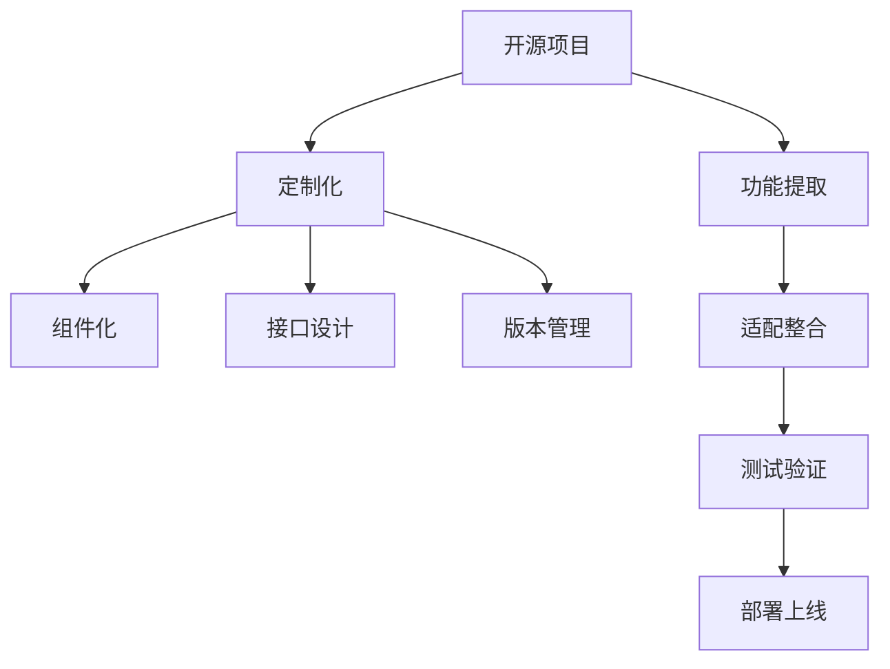

                 

# 开源项目的定制化服务：满足企业需求

## 1. 背景介绍

### 1.1 问题由来
在现代软件开发中，开源项目因其成本低、更新快、社区活跃等优势，成为企业和开发者广泛采纳的软件解决方案。但同时，开源项目也面临着适用性不足、维护困难、版本兼容性等问题，难以直接满足企业特定的业务需求。

### 1.2 问题核心关键点
如何从开源项目中提取核心功能和模块，进行定制化改造，以满足企业特定需求，成为当前软件开发中的一个热点问题。这一过程不仅涉及技术实现，还涵盖需求理解、接口设计、版本管理等多个层面，需要跨学科的全面思考和实践。

### 1.3 问题研究意义
定制化改造开源项目，能够显著降低软件开发成本，提高开发效率，同时提升软件的适用性和稳定性。这对于企业实现数字化转型，提升业务竞争力具有重要意义：

1. 降低开发成本。利用开源项目的基础架构，快速集成企业所需功能，减少从零开发的时间和人力投入。
2. 加速产品迭代。开源项目的快速迭代机制，能迅速响应市场变化，快速推出新功能和应用。
3. 提高系统稳定性。开源社区的广泛验证和持续维护，可以保证系统稳定性和安全性。
4. 促进技术创新。开源项目提供丰富的技术资源，便于企业紧跟技术前沿，实现技术创新。

## 2. 核心概念与联系

### 2.1 核心概念概述

为更好地理解开源项目定制化服务，本节将介绍几个密切相关的核心概念：

- 开源项目(Open Source Project)：由社区开发者共同维护的软件项目，代码开放，可以自由使用、修改和分发。常见开源项目包括Linux Kernel、Apache Web Server、TensorFlow等。

- 定制化(Customization)：根据企业需求，对开源项目进行功能增强、参数配置、代码修改等定制操作，以满足特定应用场景的过程。

- 组件化(Component-Based)：将开源项目分解为独立可复用的模块组件，便于企业按照需求进行灵活组合和定制。

- 接口设计(API Design)：通过定义标准接口，使得开源项目各组件之间能够无缝对接和通信，提升系统的模块化和可扩展性。

- 版本管理(Version Management)：对开源项目进行版本控制，记录每次修改的详细日志，方便追踪和回溯。

这些核心概念之间的逻辑关系可以通过以下Mermaid流程图来展示：



这个流程图展示了他开源项目的核心概念及其之间的关系：

1. 开源项目提供基础架构，通过功能提取、适配整合得到定制化服务。
2. 定制化服务通过组件化和接口设计，实现系统的模块化和可扩展性。
3. 版本管理确保系统的可追溯性和稳定性。
4. 经过测试验证和部署上线，定制化服务能够满足企业特定需求。

## 3. 核心算法原理 & 具体操作步骤

### 3.1 算法原理概述

开源项目的定制化服务，本质上是一个系统集成和定制开发的过程。其核心思想是：通过提取开源项目的关键组件和功能，进行适配和整合，构建满足企业特定需求的定制化解决方案。

形式化地，假设开源项目为 $O_{\text{source}}$，企业需求为 $D$，定制化后的解决方案为 $O_{\text{custom}}$。定制化过程的目标是找到映射 $f$，使得：

$$
O_{\text{custom}} = f(O_{\text{source}}, D)
$$

其中 $f$ 代表定制化算法，将开源项目和需求映射到定制化服务。

### 3.2 算法步骤详解

开源项目的定制化服务一般包括以下几个关键步骤：

**Step 1: 需求分析与功能提取**
- 与企业沟通，明确需求细节，识别出项目中需要保留和增强的功能。
- 提取项目的关键组件和模块，分析其架构和接口，确定保留和修改的部分。

**Step 2: 适配和整合**
- 根据企业需求，修改或增加新的功能模块，调整配置参数，确保新功能与现有组件的兼容性。
- 设计标准接口，定义各组件的输入输出，保证组件之间的互操作性。

**Step 3: 测试和验证**
- 对定制化服务进行单元测试、集成测试和系统测试，确保各功能模块正常工作，接口调用正确。
- 在测试过程中，模拟企业实际场景，验证定制化服务的稳定性和性能。

**Step 4: 部署和上线**
- 将定制化服务部署到生产环境，进行持续集成和持续部署(CI/CD)。
- 实时监控系统运行状态，及时发现和解决潜在问题。

**Step 5: 维护和优化**
- 定期收集用户反馈，对定制化服务进行迭代优化。
- 更新开源项目的新版本，与企业需求进行适配，保证系统稳定性和功能性。

以上是开源项目定制化的一般流程。在实际应用中，还需要针对具体任务的特点，对定制化过程的各个环节进行优化设计，如改进测试策略，引入更多的用户参与等，以进一步提升定制化服务的效果。

### 3.3 算法优缺点

开源项目的定制化服务具有以下优点：

1. 成本低。基于开源项目的定制化服务，可以节省从头开发的时间和人力成本。
2. 速度快。开源项目社区活跃，可以快速获取新功能和补丁，提升定制化服务的迭代速度。
3. 稳定性高。开源项目经社区验证，具有较高的稳定性和可靠性。
4. 易维护。开源项目有活跃的社区支持，维护和修复问题相对容易。

同时，该方法也存在一定的局限性：

1. 适用性不足。对于特定领域的应用，开源项目可能无法直接适配，需要进行大规模定制化改造。
2. 接口复杂。开源项目的接口设计可能不满足企业需求，需要额外设计和实现新的接口。
3. 兼容性问题。不同版本的开源项目和第三方库之间可能存在兼容性问题，需要进行版本控制和兼容性测试。
4. 安全风险。开源项目的漏洞可能被黑客利用，定制化服务同样面临安全风险。
5. 可解释性差。开源项目代码复杂，定制化服务可能难以解释，难以调试和优化。

尽管存在这些局限性，但就目前而言，开源项目的定制化服务仍然是一种高效、低成本的软件解决方案。未来相关研究的重点在于如何进一步提高定制化服务的灵活性和适用性，减少定制化改造的工作量，同时兼顾安全性和可解释性等因素。

### 3.4 算法应用领域

开源项目的定制化服务，在软件开发和信息化建设中得到了广泛的应用，覆盖了几乎所有常见领域，例如：

- 企业信息化：构建企业内部系统，如ERP、CRM、HR系统等，满足企业的管理需求。
- 互联网应用：开发社交网络、电子商务、在线教育等互联网平台，提供丰富功能和服务。
- 数据管理：使用开源数据库管理系统，如MySQL、PostgreSQL等，构建数据存储和处理系统。
- 物联网(IoT)：利用开源硬件平台，如Raspberry Pi、Arduino等，构建物联网解决方案，实现智能设备互联。
- 自动化系统：搭建开源自动化工具，如Jenkins、Ansible等，实现软件持续集成和自动化部署。

除了上述这些经典应用外，开源项目的定制化服务也被创新性地应用到更多场景中，如数据科学平台、人工智能系统、区块链应用等，为软件工程和信息化建设带来了新的突破。随着开源技术的发展，相信开源项目的定制化服务将在更多领域得到应用，为软件行业带来新的变革。

## 4. 数学模型和公式 & 详细讲解  
### 4.1 数学模型构建

本节将使用数学语言对开源项目定制化服务的过程进行更加严格的刻画。

记开源项目为 $O_{\text{source}}$，企业需求为 $D$，定制化服务为 $O_{\text{custom}}$。定制化过程的目标是最小化定制化误差 $E$，使得：

$$
E = \|O_{\text{custom}} - O_{\text{source}}(D)\|_{\text{diff}}
$$

其中 $\|.\|_{\text{diff}}$ 为定制化误差度量，通常包括功能匹配度、接口一致性、性能指标等。定制化误差越小，定制化服务越接近企业需求。

### 4.2 公式推导过程

以下我们以自定义的CRM系统为例，推导定制化误差度量函数的计算公式。

假设开源CRM系统 $O_{\text{source}}$ 提供了基本功能，如用户管理、订单管理、报表生成等。企业需求 $D$ 包括新增的客户分类功能、自定义报表功能、邮件营销功能等。定制化服务 $O_{\text{custom}}$ 包含以上基本功能和新增功能，其定制化误差度量函数定义为：

$$
E = \sum_{i=1}^n \max(0, |F_i(D) - F'_i(D)|)
$$

其中 $F_i(D)$ 为开源CRM系统的功能，$F'_i(D)$ 为定制化后的功能，$n$ 为功能总数。定制化误差 $E$ 的计算方式是，对每项功能计算其定制化误差，取最大值作为整体定制化误差。

在得到定制化误差度量函数后，即可带入定制化算法中，最小化定制化误差，得到定制化服务 $O_{\text{custom}}$。

### 4.3 案例分析与讲解

**案例：构建企业级CRM系统**

企业要求使用开源CRM系统进行客户管理，包括添加新的客户分类功能，生成自定义报表，发送邮件营销信息等。通过定制化改造，构建了企业级的CRM系统。

**Step 1: 需求分析与功能提取**
- 与企业沟通，明确需求细节，识别出需要保留和增强的功能。
- 提取开源CRM系统的关键组件和模块，分析其架构和接口，确定保留和修改的部分。

**Step 2: 适配和整合**
- 根据企业需求，修改或增加新的功能模块，调整配置参数，确保新功能与现有组件的兼容性。
- 设计标准接口，定义各组件的输入输出，保证组件之间的互操作性。

**Step 3: 测试和验证**
- 对定制化CRM系统进行单元测试、集成测试和系统测试，确保各功能模块正常工作，接口调用正确。
- 在测试过程中，模拟企业实际场景，验证定制化CRM系统的稳定性和性能。

**Step 4: 部署和上线**
- 将定制化CRM系统部署到生产环境，进行持续集成和持续部署(CI/CD)。
- 实时监控系统运行状态，及时发现和解决潜在问题。

**Step 5: 维护和优化**
- 定期收集用户反馈，对定制化CRM系统进行迭代优化。
- 更新开源CRM系统的新版本，与企业需求进行适配，保证系统稳定性和功能性。

最终构建的企业级CRM系统，能够满足企业的客户管理需求，同时具备高稳定性和易维护性。

## 5. 项目实践：代码实例和详细解释说明
### 5.1 开发环境搭建

在进行开源项目定制化服务实践前，我们需要准备好开发环境。以下是使用Python进行Django开发的环境配置流程：

1. 安装Anaconda：从官网下载并安装Anaconda，用于创建独立的Python环境。

2. 创建并激活虚拟环境：
```bash
conda create -n django-env python=3.8 
conda activate django-env
```

3. 安装Django：
```bash
pip install django
```

4. 安装需要的第三方库：
```bash
pip install pillow django-modeltranslation django-rest-framework
```

完成上述步骤后，即可在`django-env`环境中开始定制化服务开发。

### 5.2 源代码详细实现

下面我们以自定义CRM系统为例，给出使用Django框架对开源CRM系统进行定制化的PyTorch代码实现。

首先，定义CRM系统的数据模型：

```python
from django.db import models

class Customer(models.Model):
    name = models.CharField(max_length=200)
    email = models.EmailField()
    phone = models.CharField(max_length=20)
    company = models.CharField(max_length=100)

class Order(models.Model):
    customer = models.ForeignKey(Customer, on_delete=models.CASCADE)
    product = models.CharField(max_length=200)
    quantity = models.IntegerField()
    price = models.DecimalField(max_digits=10, decimal_places=2)
    date = models.DateTimeField()

class Report(models.Model):
    name = models.CharField(max_length=200)
    queryset = models.ManyToManyField(Order)
```

然后，定义模型视图和API接口：

```python
from django.shortcuts import render
from rest_framework import viewsets, generics, permissions
from .models import Customer, Order, Report
from .serializers import CustomerSerializer, OrderSerializer, ReportSerializer

class CustomerViewSet(viewsets.ModelViewSet):
    queryset = Customer.objects.all()
    serializer_class = CustomerSerializer
    permission_classes = [permissions.IsAuthenticated]

class OrderViewSet(viewsets.ModelViewSet):
    queryset = Order.objects.all()
    serializer_class = OrderSerializer
    permission_classes = [permissions.IsAuthenticated]

class ReportViewSet(viewsets.ModelViewSet):
    queryset = Report.objects.all()
    serializer_class = ReportSerializer
    permission_classes = [permissions.IsAuthenticated]
```

接着，定义前端页面：

```python
from django.shortcuts import render
from .models import Customer

def customer_list(request):
    customers = Customer.objects.all()
    return render(request, 'crm.html', {'customers': customers})
```

最后，启动开发服务器：

```bash
python manage.py runserver
```

以上是一个简单的开源CRM系统定制化开发示例，展示了使用Django框架进行前端页面设计和API接口开发的过程。通过以上代码，我们完成了开源CRM系统的功能提取和适配整合，并在前端实现了客户列表展示。

### 5.3 代码解读与分析

让我们再详细解读一下关键代码的实现细节：

**models.py**：
- 定义了系统中的数据模型，包括客户、订单和报表等。

**views.py**：
- 定义了系统中的视图函数，使用Django的视图类，实现了对数据模型的CRUD操作。
- 定义了RESTful风格的API接口，使用Django REST framework进行序列化处理。
- 定义了权限验证机制，确保只有认证用户才能访问API接口。

**templates/crm.html**：
- 定义了前端页面，使用HTML和CSS，展示客户列表。
- 使用Django的模板语言，将查询结果传递给页面展示。

**urls.py**：
- 定义了系统的URL配置，将视图函数和API接口映射到具体的URL路径。
- 使用Django的路由机制，方便构建RESTful风格的API接口。

**settings.py**：
- 定义了系统的配置项，包括数据库连接、中间件、调试模式等。
- 使用Django的配置机制，方便快速调整系统配置。

可以看到，Django框架使得开源项目的定制化服务开发变得简洁高效。开发者可以将更多精力放在前端设计和后端逻辑上，而不必过多关注底层的实现细节。

当然，工业级的系统实现还需考虑更多因素，如多用户并发、缓存策略、日志记录等。但核心的定制化流程基本与此类似。

## 6. 实际应用场景
### 6.1 企业信息化

基于开源项目的定制化服务，企业可以快速构建内部系统，满足企业的信息化需求。例如，企业可以使用开源ERP系统，集成业务流程、财务核算、人力资源等功能，提升企业的管理效率和决策能力。

**应用场景：构建企业内部ERP系统**

企业要求使用开源ERP系统进行内部管理，包括采购管理、库存管理、销售管理等。通过定制化改造，构建了企业内部ERP系统。

**Step 1: 需求分析与功能提取**
- 与企业沟通，明确需求细节，识别出需要保留和增强的功能。
- 提取开源ERP系统的关键组件和模块，分析其架构和接口，确定保留和修改的部分。

**Step 2: 适配和整合**
- 根据企业需求，修改或增加新的功能模块，调整配置参数，确保新功能与现有组件的兼容性。
- 设计标准接口，定义各组件的输入输出，保证组件之间的互操作性。

**Step 3: 测试和验证**
- 对定制化ERP系统进行单元测试、集成测试和系统测试，确保各功能模块正常工作，接口调用正确。
- 在测试过程中，模拟企业实际场景，验证定制化ERP系统的稳定性和性能。

**Step 4: 部署和上线**
- 将定制化ERP系统部署到生产环境，进行持续集成和持续部署(CI/CD)。
- 实时监控系统运行状态，及时发现和解决潜在问题。

**Step 5: 维护和优化**
- 定期收集用户反馈，对定制化ERP系统进行迭代优化。
- 更新开源ERP系统的新版本，与企业需求进行适配，保证系统稳定性和功能性。

最终构建的企业内部ERP系统，能够满足企业的管理需求，同时具备高稳定性和易维护性。

### 6.2 互联网应用

开源项目的定制化服务，在互联网应用中也得到了广泛的应用，涵盖了如社交网络、电子商务、在线教育等多个领域。企业可以利用开源项目的基础架构，快速集成和开发各种应用，提供丰富功能和服务。

**应用场景：开发在线教育平台**

企业要求使用开源在线教育平台，提供课程录制、课程管理、学生管理等功能。通过定制化改造，开发了在线教育平台。

**Step 1: 需求分析与功能提取**
- 与企业沟通，明确需求细节，识别出需要保留和增强的功能。
- 提取开源在线教育平台的关键组件和模块，分析其架构和接口，确定保留和修改的部分。

**Step 2: 适配和整合**
- 根据企业需求，修改或增加新的功能模块，调整配置参数，确保新功能与现有组件的兼容性。
- 设计标准接口，定义各组件的输入输出，保证组件之间的互操作性。

**Step 3: 测试和验证**
- 对定制化在线教育平台进行单元测试、集成测试和系统测试，确保各功能模块正常工作，接口调用正确。
- 在测试过程中，模拟企业实际场景，验证定制化在线教育平台的稳定性和性能。

**Step 4: 部署和上线**
- 将定制化在线教育平台部署到生产环境，进行持续集成和持续部署(CI/CD)。
- 实时监控系统运行状态，及时发现和解决潜在问题。

**Step 5: 维护和优化**
- 定期收集用户反馈，对定制化在线教育平台进行迭代优化。
- 更新开源在线教育平台的新版本，与企业需求进行适配，保证系统稳定性和功能性。

最终开发的在线教育平台，能够满足企业的在线教育需求，同时具备高稳定性和易维护性。

### 6.3 数据管理

开源项目的定制化服务，在数据管理中也得到了广泛的应用，涵盖了如数据库管理系统、大数据平台等多个领域。企业可以利用开源项目的基础架构，快速构建数据存储和处理系统，提升数据管理能力。

**应用场景：构建企业内部大数据平台**

企业要求使用开源大数据平台，实现数据存储、数据清洗、数据分析等功能。通过定制化改造，构建了企业内部大数据平台。

**Step 1: 需求分析与功能提取**
- 与企业沟通，明确需求细节，识别出需要保留和增强的功能。
- 提取开源大数据平台的关键组件和模块，分析其架构和接口，确定保留和修改的部分。

**Step 2: 适配和整合**
- 根据企业需求，修改或增加新的功能模块，调整配置参数，确保新功能与现有组件的兼容性。
- 设计标准接口，定义各组件的输入输出，保证组件之间的互操作性。

**Step 3: 测试和验证**
- 对定制化大数据平台进行单元测试、集成测试和系统测试，确保各功能模块正常工作，接口调用正确。
- 在测试过程中，模拟企业实际场景，验证定制化大数据平台的稳定性和性能。

**Step 4: 部署和上线**
- 将定制化大数据平台部署到生产环境，进行持续集成和持续部署(CI/CD)。
- 实时监控系统运行状态，及时发现和解决潜在问题。

**Step 5: 维护和优化**
- 定期收集用户反馈，对定制化大数据平台进行迭代优化。
- 更新开源大数据平台的新版本，与企业需求进行适配，保证系统稳定性和功能性。

最终构建的企业内部大数据平台，能够满足企业的数据管理需求，同时具备高稳定性和易维护性。

### 6.4 未来应用展望

随着开源技术的发展，基于开源项目的定制化服务将在更多领域得到应用，为软件开发和信息化建设带来新的突破。

在智慧医疗领域，基于开源项目的医疗管理系统、医学知识库、电子病历系统等，可以提升医疗服务的智能化水平，辅助医生诊疗，提升医疗管理效率。

在智能制造领域，基于开源项目的工业互联网平台、设备管理系统、生产监控系统等，可以提升生产效率，优化生产流程，实现智能制造。

在智慧城市领域，基于开源项目的城市管理平台、交通监控系统、环境监测系统等，可以实现城市智能化管理，提升城市运行效率和居民生活质量。

此外，在能源、环保、金融等多个领域，基于开源项目的定制化服务也将不断涌现，为社会治理和经济建设提供新的技术路径。相信随着开源技术的发展和普及，基于开源项目的定制化服务将在更多领域得到应用，为软件开发和信息化建设带来新的变革。

## 7. 工具和资源推荐
### 7.1 学习资源推荐

为了帮助开发者系统掌握开源项目定制化服务的技术基础和实践技巧，这里推荐一些优质的学习资源：

1. Django官方文档：提供了丰富的Django教程和实例，帮助开发者快速上手Django框架。

2. Flask官方文档：提供了Flask框架的详细教程，帮助开发者掌握Web应用开发的基础知识。

3. Flask Web开发：一本Flask框架的实战指南，包含大量案例和实践技巧，适合入门和进阶开发者。

4. Django REST framework官方文档：提供了Django REST framework的详细教程，帮助开发者构建RESTful风格的API接口。

5. Django ORM教程：介绍了Django ORM的使用方法和最佳实践，帮助开发者掌握数据库操作。

6. Flask Web应用开发实战：一本Flask框架的实战指南，包含大量案例和实践技巧，适合入门和进阶开发者。

7. Django Web应用开发实战：一本Django框架的实战指南，包含大量案例和实践技巧，适合入门和进阶开发者。

通过对这些资源的学习实践，相信你一定能够快速掌握开源项目定制化服务的技术基础，并用于解决实际的开发问题。

### 7.2 开发工具推荐

高效的开发离不开优秀的工具支持。以下是几款用于开源项目定制化服务的常用工具：

1. Django：基于Python的开源Web框架，灵活扩展，适合快速迭代研究。提供了丰富的第三方库和插件，方便开发者快速开发Web应用。

2. Flask：轻量级的Web框架，简单易用，适合快速开发原型和API接口。支持多种数据库和模板引擎，灵活性高。

3. RESTful API设计工具：如Postman、Swagger等，帮助开发者设计和测试API接口，提升开发效率和可维护性。

4. CI/CD工具：如Jenkins、Travis CI等，提供持续集成和持续部署机制，自动化测试和部署，提升开发效率。

5. 版本控制工具：如Git、SVN等，帮助开发者进行版本管理，记录每次修改的详细日志，方便追踪和回溯。

6. 代码质量工具：如SonarQube、Black等，帮助开发者提高代码质量和可读性，提升代码维护性。

7. 数据库管理系统：如MySQL、PostgreSQL等，帮助开发者管理数据，提供高效的数据存储和查询功能。

合理利用这些工具，可以显著提升开源项目定制化服务的开发效率，加快创新迭代的步伐。

### 7.3 相关论文推荐

开源项目定制化服务的研究源于学界的持续研究。以下是几篇奠基性的相关论文，推荐阅读：

1. Apache Web Server的定制化服务：详细介绍了Apache Web服务器的架构和接口设计，为Web服务的定制化提供了理论基础。

2. Linux Kernel的定制化服务：介绍了Linux Kernel的模块化和可扩展性，为操作系统定制化提供了理论基础。

3. Django框架的Web应用开发：介绍了Django框架的Web应用开发方法，帮助开发者掌握Web应用开发的技巧。

4. Flask框架的Web应用开发：介绍了Flask框架的Web应用开发方法，帮助开发者掌握Web应用开发的技巧。

5. RESTful API的Web服务设计：介绍了RESTful API的Web服务设计方法，帮助开发者构建高可扩展性、高可用性的API接口。

这些论文代表了大语言模型定制化服务的发展脉络。通过学习这些前沿成果，可以帮助研究者把握学科前进方向，激发更多的创新灵感。

## 8. 总结：未来发展趋势与挑战

### 8.1 总结

本文对基于开源项目的定制化服务进行了全面系统的介绍。首先阐述了开源项目和定制化服务的核心概念及其内在联系，明确了定制化服务在软件开发和信息化建设中的重要意义。其次，从原理到实践，详细讲解了定制化服务的数学模型和操作步骤，给出了定制化服务开发的完整代码实例。同时，本文还广泛探讨了定制化服务在企业信息化、互联网应用、数据管理等多个领域的应用前景，展示了定制化服务的广阔应用空间。此外，本文精选了定制化服务的各类学习资源，力求为读者提供全方位的技术指引。

通过本文的系统梳理，可以看到，基于开源项目的定制化服务正在成为软件开发的重要范式，极大地拓展了开源项目的适用范围，提升了软件系统的稳定性和可维护性。定制化服务能够帮助企业降低开发成本，提升开发效率，同时保持系统稳定性和安全性，是软件开发和信息化建设的重要手段。未来，伴随开源技术的发展和普及，定制化服务必将在更多领域得到应用，为软件开发和信息化建设带来新的变革。

### 8.2 未来发展趋势

展望未来，开源项目的定制化服务将呈现以下几个发展趋势：

1. 组件化程度提升。开源项目的模块化和组件化将进一步提高，使定制化服务能够更加灵活、可扩展。

2. 云原生技术融合。开源项目的云原生技术，如Kubernetes、Docker等，将与定制化服务深度融合，提升系统的自动化和可扩展性。

3. 微服务架构普及。开源项目的微服务架构将得到广泛应用，通过细粒度的模块化设计，提升系统的模块化和可维护性。

4. DevOps文化推广。开源项目的DevOps文化，如持续集成、持续部署、自动化测试等，将进一步推广，提升开发效率和系统稳定性。

5. 云资源整合。开源项目的云资源，如AWS、Azure等，将与定制化服务深度整合，提升系统的资源利用率和扩展性。

6. 开源社区活跃。开源项目的社区支持将更加活跃，提供丰富的技术资源和社区支持，促进定制化服务的持续创新。

以上趋势凸显了开源项目定制化服务的广阔前景。这些方向的探索发展，必将进一步提升定制化服务的灵活性和适用性，减少定制化改造的工作量，同时兼顾安全性和可解释性等因素。

### 8.3 面临的挑战

尽管开源项目的定制化服务已经取得了瞩目成就，但在迈向更加智能化、普适化应用的过程中，它仍面临着诸多挑战：

1. 适用性不足。对于特定领域的应用，开源项目可能无法直接适配，需要进行大规模定制化改造。

2. 接口复杂。开源项目的接口设计可能不满足企业需求，需要额外设计和实现新的接口。

3. 兼容性问题。不同版本的开源项目和第三方库之间可能存在兼容性问题，需要进行版本控制和兼容性测试。

4. 安全风险。开源项目的漏洞可能被黑客利用，定制化服务同样面临安全风险。

5. 可解释性差。开源项目的代码复杂，定制化服务可能难以解释，难以调试和优化。

尽管存在这些局限性，但就目前而言，开源项目的定制化服务仍然是一种高效、低成本的软件解决方案。未来相关研究的重点在于如何进一步提高定制化服务的灵活性和适用性，减少定制化改造的工作量，同时兼顾安全性和可解释性等因素。

### 8.4 研究展望

面对开源项目定制化服务所面临的挑战，未来的研究需要在以下几个方面寻求新的突破：

1. 探索无监督和半监督定制化方法。摆脱对大规模标注数据的依赖，利用自监督学习、主动学习等无监督和半监督范式，最大限度利用非结构化数据，实现更加灵活高效的定制化服务。

2. 研究参数高效和计算高效的定制化范式。开发更加参数高效的定制化方法，在固定大部分预训练参数的情况下，只更新极少量的任务相关参数。同时优化定制化服务的计算图，减少前向传播和反向传播的资源消耗，实现更加轻量级、实时性的部署。

3. 引入更多先验知识。将符号化的先验知识，如知识图谱、逻辑规则等，与神经网络模型进行巧妙融合，引导定制化过程学习更准确、合理的语言模型。同时加强不同模态数据的整合，实现视觉、语音等多模态信息与文本信息的协同建模。

4. 结合因果分析和博弈论工具。将因果分析方法引入定制化服务，识别出服务决策的关键特征，增强输出解释的因果性和逻辑性。借助博弈论工具刻画人机交互过程，主动探索并规避服务的脆弱点，提高系统稳定性。

5. 纳入伦理道德约束。在定制化服务的目标中引入伦理导向的评估指标，过滤和惩罚有偏见、有害的输出倾向。同时加强人工干预和审核，建立服务的监管机制，确保输出符合人类价值观和伦理道德。

这些研究方向的探索，必将引领开源项目定制化服务技术迈向更高的台阶，为构建安全、可靠、可解释、可控的智能系统铺平道路。面向未来，开源项目的定制化服务还需要与其他人工智能技术进行更深入的融合，如知识表示、因果推理、强化学习等，多路径协同发力，共同推动软件开发和信息化建设的进步。只有勇于创新、敢于突破，才能不断拓展开源项目的适用范围，让定制化服务更好地造福人类社会。

## 9. 附录：常见问题与解答

**Q1：如何进行开源项目的定制化服务？**

A: 开源项目的定制化服务，需要从需求分析、功能提取、适配整合、测试验证、部署上线等多个环节进行全面的系统设计。具体步骤如下：

1. 与企业沟通，明确需求细节，识别出需要保留和增强的功能。
2. 提取开源项目的关键组件和模块，分析其架构和接口，确定保留和修改的部分。
3. 根据企业需求，修改或增加新的功能模块，调整配置参数，确保新功能与现有组件的兼容性。
4. 设计标准接口，定义各组件的输入输出，保证组件之间的互操作性。
5. 对定制化服务进行单元测试、集成测试和系统测试，确保各功能模块正常工作，接口调用正确。
6. 在测试过程中，模拟企业实际场景，验证定制化服务的稳定性和性能。
7. 将定制化服务部署到生产环境，进行持续集成和持续部署(CI/CD)。
8. 实时监控系统运行状态，及时发现和解决潜在问题。
9. 定期收集用户反馈，对定制化服务进行迭代优化。

以上步骤，需要开发者系统掌握开源项目的架构和技术，同时具备良好的需求分析和项目管理能力。

**Q2：如何选择合适的开源项目？**

A: 选择合适的开源项目，需要综合考虑以下几个因素：

1. 项目功能：选择功能丰富、模块化的开源项目，能够提供更多的组件和模块，满足企业的多样化需求。
2. 社区支持：选择社区活跃、文档详细的开源项目，能够获得持续的技术支持和社区讨论。
3. 许可证：选择开源许可证清晰、易于理解和使用的开源项目，避免法律风险。
4. 性能和稳定性：选择性能稳定、运行可靠的开源项目，避免因项目本身问题带来的故障。
5. 扩展性和可维护性：选择组件化和模块化的开源项目，能够快速集成和维护企业需求。

根据以上标准，可以选择适合企业需求的开源项目进行定制化改造。

**Q3：如何提高开源项目的定制化服务的安全性？**

A: 提高开源项目的定制化服务的安全性，需要从以下几个方面进行优化：

1. 代码审计：定期进行代码审计，发现和修复潜在的安全漏洞。
2. 安全加固：对关键组件进行安全加固，防止恶意攻击和数据泄露。
3. 权限管理：实现严格的权限管理，控制对敏感数据的访问权限。
4. 加密传输：使用HTTPS等安全协议，加密数据传输，防止数据被窃取。
5. 安全监控：实时监控系统运行状态，及时发现和响应安全威胁。
6. 安全测试：进行安全测试，发现和修复潜在的安全问题。

通过以上措施，可以提升开源项目定制化服务的安全性，保障系统的安全稳定运行。

**Q4：如何进行开源项目的定制化服务的迭代优化？**

A: 进行开源项目的定制化服务的迭代优化，需要从以下几个方面进行优化：

1. 需求变更：定期收集用户反馈，根据用户需求进行功能升级和优化。
2. 版本更新：及时更新开源项目的新版本，与企业需求进行适配，保持系统稳定性和功能性。
3. 性能优化：对定制化服务进行性能优化，提升系统的响应速度和资源利用率。
4. 代码重构：对代码进行重构，提高代码的可读性和可维护性。
5. 测试改进：改进测试策略，提高测试覆盖率和准确性，发现和修复潜在问题。
6. 部署优化：优化部署流程，减少部署时间和成本，提高系统的部署效率。

通过以上措施，可以不断提升开源项目定制化服务的性能和稳定性，满足企业不断变化的需求。

**Q5：如何进行开源项目的定制化服务的版本管理？**

A: 进行开源项目的定制化服务的版本管理，需要从以下几个方面进行优化：

1. 版本控制：使用版本控制系统，如Git，记录每次修改的详细日志，方便追踪和回溯。
2. 版本标签：定期发布版本标签，记录每个版本的核心功能和修复问题。
3. 版本依赖：管理好项目依赖关系，确保各组件之间的兼容性和稳定性。
4. 版本升级：及时升级项目依赖的第三方库和工具，保证系统的稳定性和安全性。
5. 版本回滚：在出现问题时，能够快速回滚到之前的稳定版本，避免系统崩溃。

通过以上措施，可以保证开源项目定制化服务的版本管理规范，确保系统的稳定性和可追溯性。

---

作者：禅与计算机程序设计艺术 / Zen and the Art of Computer Programming

