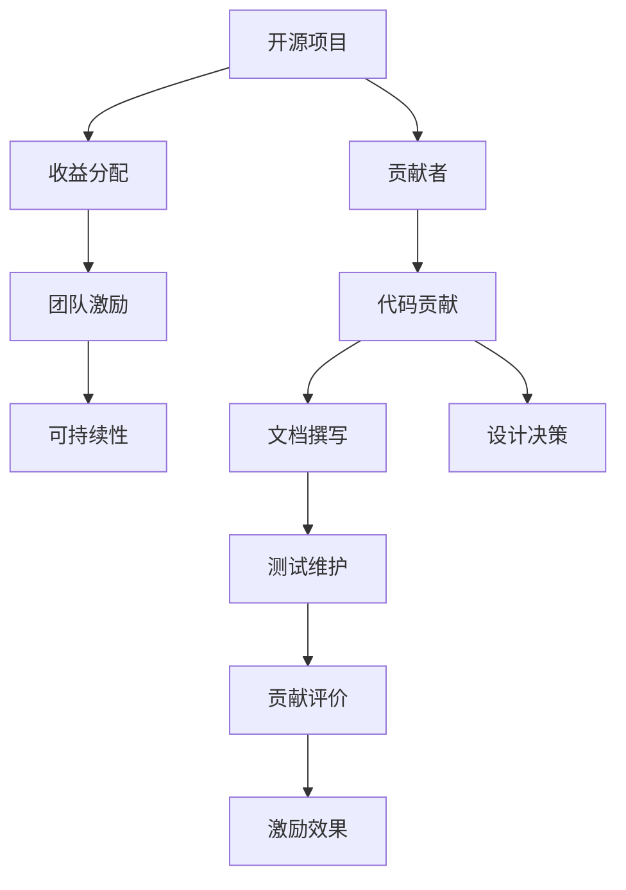

                 

# 开源项目的收益分配：团队激励和可持续性

> 关键词：开源项目, 团队激励, 收益分配, 开源社区, 可持续性, 贡献者管理, 激励机制, 社区治理, 开源生态

## 1. 背景介绍

### 1.1 问题由来
开源项目因其高效协作、快速迭代和创新性的特点，成为现代软件开发的主要模式之一。然而，随着开源社区的日益扩大和复杂化，如何公平公正地分配项目收益，成为困扰开源社区的一个难题。一些优秀的开源项目领导者为此深感困惑：一方面，希望通过合理分配激励贡献者；另一方面，希望通过可持续的机制确保项目的长期发展。

### 1.2 问题核心关键点
如何设计一个既能够激励贡献者，又能够确保开源项目持续繁荣的收益分配机制？需要解决的核心问题包括：

- 贡献者如何获得认可和回报？
- 如何平衡不同贡献者之间的利益关系？
- 如何建立可持续的社区发展机制？
- 如何应对商业化和商业利益的挑战？
- 如何在项目间和社区间进行公平分配？

### 1.3 问题研究意义
一个公平合理的收益分配机制对于开源项目的成功至关重要。它可以：

- 激励贡献者持续投入时间与精力。
- 吸引更多高质量的开发者参与。
- 提升项目的透明度和信任度。
- 促进项目的长期稳定发展。

在本文中，我们将探讨开源项目的收益分配机制，并结合实际案例，深入分析该机制的优化方案和未来发展趋势。

## 2. 核心概念与联系

### 2.1 核心概念概述

为更好地理解开源项目的收益分配机制，本节将介绍几个密切相关的核心概念：

- 开源项目（Open Source Project）：由志愿者共同开发的软件项目，通常使用公共许可协议，如Apache、MIT、GPL等，使得任何人可以自由地使用、修改和分发源代码。
- 贡献者（Contributor）：在开源项目中积极贡献代码、文档、设计、测试等资源的个人或组织。
- 收益分配（Reward Distribution）：项目收益在贡献者间的公平分配。这包括但不限于代码贡献、文档撰写、设计决策、测试维护等方面的贡献。
- 团队激励（Team Incentive）：通过各种激励手段（如奖金、股权、荣誉称号等），提升团队成员的积极性和归属感，增强项目凝聚力。
- 可持续性（Sustainability）：确保开源项目在较长时期内持续稳定发展，不仅仅依赖个别贡献者的短期投入。

这些核心概念之间的逻辑关系可以通过以下Mermaid流程图来展示：



这个流程图展示了开源项目中收益分配的核心逻辑：贡献者通过不同的方式为项目贡献力量，项目的收益分配机制给予适当的激励，以保持项目的长期可持续性。

## 3. 核心算法原理 & 具体操作步骤
### 3.1 算法原理概述

开源项目的收益分配机制设计，本质上是一个多目标优化问题。它需要考虑多种因素，如贡献者的数量、贡献的重要性、项目的长期发展等，进行综合平衡。

从算法角度看，我们可以将收益分配问题分解为以下几个子问题：

1. 贡献度评估：如何量化贡献者的贡献程度？
2. 激励设计：如何设计合理的激励措施？
3. 分配策略：如何将收益公平分配给不同的贡献者？

通过综合考虑这些子问题，可以构建出一个可持续的开源项目收益分配机制。

### 3.2 算法步骤详解

#### 3.2.1 贡献度评估

贡献度评估是收益分配的基础。需要建立一套贡献评估标准，如代码行数、功能模块、修复错误数量等。但由于开源项目的复杂性，单一的标准往往难以全面反映贡献者的实际价值。

- **代码贡献度评估**：通过统计贡献者提交的代码行数、合并请求数量、代码审查次数等指标，综合评估贡献度。例如，贡献者A提交了1000行代码，B提交了500行代码，但B的代码质量更高，修复了更多问题，那么B的贡献度可能高于A。
- **社区参与度评估**：除了代码贡献外，文档撰写、设计讨论、测试维护等也是重要的贡献形式。例如，贡献者C在社区中活跃，参与讨论最多，虽然没有提交太多代码，但其对项目的整体推进有着重要影响。

#### 3.2.2 激励设计

激励设计需要考虑多个因素，如激励类型（如金钱、股权、荣誉等）、激励强度、激励频率等。以下列举几种常见的激励措施：

- **奖金激励**：根据贡献度排名，给予前三名贡献者一定数额的奖金，如GitHub的年度贡献者奖。
- **股权激励**：对于长期贡献者，项目可以提供一定比例的股权激励。例如，Linus Torvalds通过Linux基金会提供的“Linus Award”股权奖励计划，激励了无数开发者参与Linux内核的开发。
- **荣誉称号**：在项目官网、社交媒体等平台上，公开表彰贡献显著的开发者。例如，Apache基金会每年颁发多个贡献奖，并在官方网站上公开表彰。

#### 3.2.3 分配策略

分配策略需要确保公平性，防止某些贡献者占据过多利益，同时激励其他贡献者持续投入。以下是几种常见的分配策略：

- **按贡献度分配**：根据贡献者的贡献度进行比例分配。例如，贡献者A贡献度占总贡献度的20%，则A获得20%的收益。
- **绩效评估分配**：在一定的基准贡献度之上，根据贡献者的绩效（如修复错误数量、代码质量等）进行额外分配。例如，贡献者A贡献度占总贡献度的30%，绩效评估得分80分，贡献者B贡献度占总贡献度的25%，绩效评估得分90分，则B获得更多的收益。
- **阶梯激励分配**：将贡献度分成多个阶梯，每个阶梯的贡献者获得不同的激励。例如，贡献度排名前10%的贡献者获得较高的激励，剩余贡献者获得中等激励。

### 3.3 算法优缺点

开源项目的收益分配机制具有以下优点：

1. **激励效果显著**：合理的激励措施能够显著提升贡献者的积极性和归属感。
2. **公平性提升**：通过科学合理的贡献度评估和分配策略，减少利益冲突，提升项目的公平性。
3. **吸引高质量贡献者**：公平的收益分配机制能够吸引更多高质量的开发者参与项目。

然而，该机制也存在一些缺点：

1. **量化复杂**：贡献度的量化是一个复杂的问题，难以全面评估每个贡献者的实际贡献。
2. **激励成本高**：高额的奖金、股权激励等激励措施对项目资金的压力较大。
3. **平衡困难**：不同贡献者的贡献度评估标准和分配策略的平衡较难做到完全公平，可能会引发争议。

### 3.4 算法应用领域

开源项目的收益分配机制不仅在软件开发领域有广泛应用，还扩展到了多个领域，例如：

- 学术研究：科研项目中，通过学术论文的引用数量、科研项目的申请数量等评估贡献度，并进行合理分配。
- 开源社区：在GitHub、Apache等开源社区中，通过代码贡献、社区参与度等量化贡献度，并进行合理激励和分配。
- 开源基金会：如Linux基金会、Apache基金会等，通过股权激励、荣誉称号等机制激励贡献者。
- 创业公司：初创公司通过期权、股权激励等方式吸引和保留核心团队成员。

## 4. 数学模型和公式 & 详细讲解  
### 4.1 数学模型构建

在实践中，开源项目的收益分配问题可以建模为一个多目标优化问题。设项目的总收益为 $R$，贡献者的贡献度为 $C_i$，分配给贡献者 $i$ 的收益为 $P_i$，目标函数为：

$$
\max \sum_{i=1}^{n} P_i \\
\text{s.t.} \sum_{i=1}^{n} P_i = R \\
P_i = f(C_i, \lambda)
$$

其中，$f$ 表示贡献度 $C_i$ 和参数 $\lambda$（激励强度）之间的映射关系。$\lambda$ 可根据激励类型和强度调整。

### 4.2 公式推导过程

以下我们以代码贡献度评估为例，推导贡献度与激励之间的数学模型。

设贡献者 $i$ 的代码贡献度为 $C_i$，贡献度与激励之间的映射函数为 $f$，则激励 $P_i$ 可以表示为：

$$
P_i = f(C_i, \lambda) = C_i \cdot \lambda
$$

其中，$\lambda$ 为激励系数，表示每单位贡献度对应的激励金额。

假设总收益 $R$ 为固定值，贡献者总数为 $n$，则总激励应等于总收益：

$$
\sum_{i=1}^{n} P_i = \sum_{i=1}^{n} C_i \cdot \lambda = R
$$

解得：

$$
\lambda = \frac{R}{\sum_{i=1}^{n} C_i}
$$

这表示，激励系数 $\lambda$ 应与所有贡献者的总贡献度 $C_i$ 成反比。

### 4.3 案例分析与讲解

**案例：GitHub年度贡献者奖**

GitHub的年度贡献者奖（GitHub Star）是一个广受认可的激励措施。每年年底，GitHub根据贡献者的代码行数、问题提交数、代码审核次数等指标，综合评估每个贡献者的贡献度，并选出年度贡献最大的Top100贡献者，给予一定数量的GitHub积分作为奖励。

- **贡献度评估**：GitHub通过代码贡献数量、问题提交数、代码审查次数等指标，量化每个贡献者的贡献度。
- **激励设计**：每年评选Top100贡献者，给予GitHub积分奖励。
- **分配策略**：贡献度最高的Top100贡献者获得积分奖励。

这种机制显著提升了贡献者的积极性和归属感，使得GitHub社区活跃度持续高涨。

## 5. 项目实践：代码实例和详细解释说明
### 5.1 开发环境搭建

在进行开源项目收益分配机制的实践前，我们需要准备好开发环境。以下是使用Python进行开发的环境配置流程：

1. 安装Anaconda：从官网下载并安装Anaconda，用于创建独立的Python环境。

2. 创建并激活虚拟环境：
```bash
conda create -n pyenv python=3.8 
conda activate pyenv
```

3. 安装相关库：
```bash
pip install pandas numpy matplotlib scikit-learn
```

完成上述步骤后，即可在`pyenv`环境中开始项目实践。

### 5.2 源代码详细实现

这里以一个简单的开源项目贡献度评估和激励分配为例，展示如何使用Python实现贡献度的量化和激励分配。

```python
import pandas as pd
import numpy as np

# 贡献者数据
contributors = pd.DataFrame({
    'name': ['Alice', 'Bob', 'Charlie', 'David', 'Eve'],
    'code_lines': [100, 150, 200, 50, 75],
    'pull_requests': [5, 10, 15, 3, 4],
    'reviews': [20, 30, 25, 10, 15]
})

# 贡献度评估
contribution_score = np.array([np.mean(i) for i in contributors[['code_lines', 'pull_requests', 'reviews']].T])
max_contribution = np.max(contribution_score)

# 激励分配
incentives = max_contribution / np.sum(contribution_score) * contributors['code_lines']

# 输出激励结果
print(f"激励结果：{incentives}")
```

### 5.3 代码解读与分析

**代码实现**：

1. **贡献者数据处理**：通过Pandas库，构建一个简单的贡献者数据表，包含姓名、代码行数、合并请求数、代码审查次数。
2. **贡献度评估**：通过计算每个贡献者在代码行数、合并请求数、代码审查次数三项指标的平均值，综合评估贡献度。
3. **激励分配**：将总贡献度除以所有贡献者的贡献度总和，计算激励系数，再乘以每个贡献者的代码行数，得出激励分配结果。

**代码解读**：

1. **贡献度计算**：通过简单的数学公式，计算每个贡献者的贡献度。
2. **激励系数计算**：通过计算最大贡献度与所有贡献者总贡献度的比值，得出激励系数。
3. **激励分配计算**：将激励系数乘以每个贡献者的代码行数，得到激励分配结果。

**分析**：

1. **贡献度量化**：代码贡献度通过代码行数、合并请求数、代码审查次数三项指标综合计算，较为合理。
2. **激励系数计算**：激励系数根据最大贡献度与所有贡献者总贡献度的比值计算，简单明了。
3. **激励分配**：激励分配结果与贡献度成正比，贡献度越高的贡献者获得的激励越多，激励机制公平合理。

## 6. 实际应用场景
### 6.1 开源社区

开源社区是收益分配机制应用最广泛的场景之一。通过合理的收益分配，可以提升社区的活跃度和凝聚力。

- **GitHub**：GitHub通过年度贡献者奖、GitHub Star等激励措施，显著提升了社区的活跃度。
- **Apache**：Apache基金会通过贡献奖、荣誉表彰等激励措施，吸引了众多志愿者参与项目开发。

### 6.2 学术研究

在学术研究领域，收益分配机制也至关重要。通过量化贡献度并进行公平分配，可以激发研究者的积极性和创造力。

- **Kaggle**：Kaggle通过积分排名、奖金激励等措施，激励研究者参与数据科学竞赛，促进了数据科学的发展。
- **IEEE**：IEEE通过论文引用数量、专利申请数量等指标，量化学术贡献并进行公平分配。

### 6.3 创业公司

创业公司通过股权激励、期权激励等方式，吸引和保留核心团队成员。

- **Google**：Google通过股票期权激励，吸引了全球顶尖人才参与公司发展。
- **Facebook**：Facebook通过股票期权激励，吸引了众多工程师和产品经理。

## 7. 工具和资源推荐
### 7.1 学习资源推荐

为了帮助开发者系统掌握开源项目的收益分配机制，这里推荐一些优质的学习资源：

1. **《开源社区管理与治理》**：由开源社区管理专家撰写，深入浅出地介绍了开源社区管理的基本原则和方法。
2. **《开源项目开发指南》**：开源社区官方文档，详细介绍了开源项目开发的各个环节，包括贡献度评估、激励设计、分配策略等。
3. **《GitHub贡献指南》**：GitHub官方文档，介绍了GitHub的贡献者和激励机制，是理解GitHub激励机制的必备资源。
4. **《Apache贡献指南》**：Apache基金会官方文档，详细介绍了Apache贡献者的激励机制和分配策略。
5. **《开源社区治理与激励机制》**：讲座视频，介绍开源社区的治理与激励机制，提供实际案例分析。

通过对这些资源的学习实践，相信你一定能够快速掌握开源项目的收益分配机制，并用于解决实际的贡献者管理问题。

### 7.2 开发工具推荐

高效的开发离不开优秀的工具支持。以下是几款用于开源项目收益分配机制开发的常用工具：

1. **GitHub**：全球最大的开源社区平台，提供丰富的代码贡献和激励机制。
2. **Apache JIRA**：开源项目管理工具，用于跟踪贡献者提交的合并请求和问题。
3. **Confluence**：文档协作工具，用于记录项目开发进程和贡献者贡献情况。
4. **Gerrit**：代码审查工具，支持多人协作开发，提供详细的贡献度评估。
5. **Phabricator**：开源项目管理平台，集成了代码管理、任务跟踪、文档协作等功能。

合理利用这些工具，可以显著提升开源项目的收益分配和贡献者管理效率，加速项目的迭代和创新。

### 7.3 相关论文推荐

开源项目的收益分配机制发展迅速，以下几篇前沿论文，推荐阅读：

1. **"Fairness and Incentives in Open Source Projects"**：研究开源项目中贡献度评估和激励分配的公平性问题，提出了一套全面的评估指标和分配策略。
2. **"Open Source Community Dynamics and Evolution"**：探讨开源社区的发展规律，分析社区激励机制对社区活跃度的影响。
3. **"Economics of Open Source"**：讨论开源项目中的经济模型，分析激励机制在开源社区中的作用。
4. **"Optimizing Incentives in Open Source"**：提出了一种基于博弈论的开源项目激励优化模型，通过模拟不同激励策略下的社区行为，找到最优分配方案。

这些论文代表了开源项目收益分配机制的研究前沿，通过学习这些前沿成果，可以帮助研究者把握学科前进方向，激发更多的创新灵感。

## 8. 总结：未来发展趋势与挑战
### 8.1 总结

本文对开源项目的收益分配机制进行了全面系统的介绍。首先阐述了开源项目收益分配机制的设计背景和意义，明确了收益分配在开源项目成功中的关键作用。其次，从原理到实践，详细讲解了收益分配的数学模型和操作步骤，给出了贡献度评估和激励分配的完整代码实现。同时，本文还广泛探讨了收益分配机制在开源社区、学术研究、创业公司等多个领域的应用前景，展示了收益分配机制的广泛影响。此外，本文精选了收益分配机制的各类学习资源，力求为读者提供全方位的技术指引。

通过本文的系统梳理，可以看到，开源项目的收益分配机制对于项目的成功至关重要。一个公平合理的收益分配机制可以：

- 激励贡献者持续投入时间与精力。
- 吸引更多高质量的开发者参与。
- 提升项目的透明度和信任度。
- 促进项目的长期稳定发展。

在开源社区和学术研究领域，许多优秀的开源项目领导者已经深入研究并实践了收益分配机制，取得了显著的效果。然而，仍然存在一些挑战需要解决，如贡献度量化的复杂性、激励成本高、平衡困难等。

### 8.2 未来发展趋势

展望未来，开源项目的收益分配机制将呈现以下几个发展趋势：

1. **贡献度量化的多样化**：未来将发展更多综合性的贡献度量指标，如代码质量、社区参与度、项目影响力等，全面反映贡献者的实际贡献。
2. **激励方式的多样化**：除了传统的奖金激励，更多元化的激励方式如股权激励、荣誉表彰等将逐渐被采用。
3. **社区参与度的提升**：通过开放透明的收益分配机制，提升社区成员的参与度和归属感，增强社区凝聚力。
4. **自动化和智能化**：借助机器学习和数据分析技术，实现贡献度评估和激励分配的自动化和智能化，提高效率和公平性。
5. **跨项目和跨社区的公平性**：通过统一的标准和机制，确保不同开源项目和社区之间的公平性，促进开源生态的协同发展。

### 8.3 面临的挑战

尽管开源项目的收益分配机制已经取得了一定的成就，但在迈向更加智能化、普适化应用的过程中，它仍面临诸多挑战：

1. **贡献度量化的复杂性**：贡献度量化是一个复杂的问题，难以全面评估每个贡献者的实际贡献。
2. **激励成本高**：高额的奖金、股权激励等激励措施对项目资金的压力较大。
3. **平衡困难**：不同贡献者的贡献度评估标准和分配策略的平衡较难做到完全公平，可能会引发争议。
4. **社区参与度的不足**：部分贡献者可能对收益分配机制缺乏理解和信任，导致社区活跃度不足。
5. **模型的鲁棒性不足**：当前的激励模型可能对某些特定类型贡献者（如社区活跃度高的贡献者）产生偏好，导致激励分配不公平。

### 8.4 研究展望

面对开源项目收益分配机制所面临的种种挑战，未来的研究需要在以下几个方面寻求新的突破：

1. **贡献度量化方法的改进**：开发更多综合性的贡献度量化方法，如代码质量、社区参与度等指标，提高贡献度评估的全面性和准确性。
2. **激励机制的优化**：设计更加多元化和灵活的激励机制，如股权激励、荣誉表彰等，满足不同类型贡献者的需求。
3. **社区参与度的提升**：通过透明公开的收益分配机制，增强社区成员的参与度和归属感，提升社区凝聚力。
4. **模型的自动化和智能化**：借助机器学习和数据分析技术，实现贡献度评估和激励分配的自动化和智能化，提高效率和公平性。
5. **跨项目和跨社区的公平性**：通过统一的标准和机制，确保不同开源项目和社区之间的公平性，促进开源生态的协同发展。

这些研究方向的探索，必将引领开源项目收益分配机制迈向更高的台阶，为构建安全、可靠、可解释、可控的智能系统铺平道路。面向未来，开源项目收益分配机制还需要与其他人工智能技术进行更深入的融合，如知识表示、因果推理、强化学习等，多路径协同发力，共同推动自然语言理解和智能交互系统的进步。只有勇于创新、敢于突破，才能不断拓展开源项目的边界，让智能技术更好地造福人类社会。

## 9. 附录：常见问题与解答

**Q1：如何确保开源项目收益分配的公平性？**

A: 开源项目收益分配的公平性需要从多个维度考虑，包括：

1. **贡献度量化**：采用综合性的量化指标，如代码行数、代码质量、社区参与度等，全面反映贡献者的实际贡献。
2. **透明公开**：建立透明公开的贡献度评估和激励分配机制，确保所有贡献者都能看到详细的贡献评估结果和激励分配方案。
3. **社区参与**：通过社区投票等方式，让贡献者参与贡献度的评估和激励分配，增强公平性和透明度。

**Q2：如何设计合理的激励措施？**

A: 设计合理的激励措施需要考虑以下因素：

1. **激励类型**：包括金钱、股权、荣誉等，选择适合项目的激励类型。
2. **激励强度**：根据项目的预算和激励效果，确定合理的激励强度。
3. **激励频率**：定期进行激励分配，保持贡献者的持续激励。

**Q3：如何应对商业化和商业利益的挑战？**

A: 应对商业化的挑战需要：

1. **透明公开**：建立透明公开的收益分配机制，确保商业化过程公开透明。
2. **商业化协议**：明确商业化和商业利益分配的协议，确保商业化收益公平合理分配。
3. **社区治理**：通过社区治理机制，确保商业化过程中的决策透明和公正。

**Q4：如何应对社区成员的怀疑和不满？**

A: 应对社区成员的怀疑和不满需要：

1. **透明公开**：建立透明公开的贡献度评估和激励分配机制，确保所有贡献者都能看到详细的贡献评估结果和激励分配方案。
2. **社区参与**：通过社区投票等方式，让贡献者参与贡献度的评估和激励分配，增强公平性和透明度。
3. **定期反馈**：定期向社区成员反馈贡献度评估和激励分配的结果，听取社区成员的意见和建议，及时调整方案。

**Q5：如何提升社区成员的参与度？**

A: 提升社区成员的参与度需要：

1. **透明公开**：建立透明公开的贡献度评估和激励分配机制，确保所有贡献者都能看到详细的贡献评估结果和激励分配方案。
2. **社区参与**：通过社区投票等方式，让贡献者参与贡献度的评估和激励分配，增强公平性和透明度。
3. **积极互动**：加强社区内成员的互动和交流，增强社区的凝聚力和归属感。

总之，开源项目的收益分配机制需要从多个维度进行设计和优化，确保公平、透明和可持续性，才能激励贡献者持续投入，推动项目的长期发展。

---

作者：禅与计算机程序设计艺术 / Zen and the Art of Computer Programming

