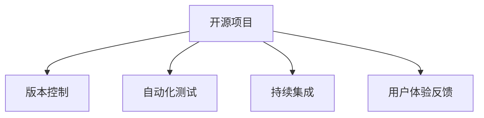

                 

# 开源项目的用户体验设计服务：扩展专业领域

> 关键词：开源项目, 用户体验设计, 专业领域, 技术栈, 版本控制, 自动化测试, 持续集成, 产品迭代, 用户体验反馈

## 1. 背景介绍

### 1.1 问题由来

在软件开发领域，开源项目以其高灵活性、低成本和快速迭代等特点，赢得了广泛的关注和应用。随着开源社区的发展，越来越多的公司和个人开始基于开源项目进行二次开发或定制化开发，以满足业务需求。然而，在实际开发过程中，开源项目的使用者常常面临一系列挑战，如代码理解难、版本控制复杂、测试问题多、发布周期长等。这些问题不仅降低了开发效率，还影响了项目的稳定性和用户体验。

为应对这些挑战，用户体验设计服务应运而生。这种服务通过专业的设计和管理，优化开源项目的使用流程，提升开发效率和用户体验，帮助开发者更好地应对开源项目的复杂性，实现快速迭代和持续创新。

### 1.2 问题核心关键点

用户体验设计服务的关键在于以下几个方面：

1. **代码理解**：如何帮助开发者快速理解和使用开源项目，减少学习成本。
2. **版本控制**：如何高效管理开源项目的版本，确保团队的协作和代码的安全。
3. **自动化测试**：如何通过自动化测试保障代码质量，降低手动测试的工作量。
4. **持续集成**：如何实现快速、可靠的持续集成，提高发布频率和稳定性。
5. **产品迭代**：如何根据用户体验反馈，快速响应和优化产品的功能和服务。

这些关键点构成了用户体验设计服务的基础，其核心目标是通过专业的设计和管理，提升开源项目的开发效率和用户体验，实现项目的快速迭代和持续创新。

## 2. 核心概念与联系

### 2.1 核心概念概述

为更好地理解用户体验设计服务，本节将介绍几个密切相关的核心概念：

- **开源项目**：指公开源码的软件项目，以社区贡献和协作开发为主要形式。
- **版本控制**：指通过记录和管理源码历史变更，支持团队协作和代码追踪的工具和技术。
- **自动化测试**：指通过脚本和工具自动执行测试用例，快速检测代码变更是否引入问题的实践。
- **持续集成**：指通过自动化的构建、测试和部署，确保代码变更以最小的代价和最大的稳定性发布。
- **用户体验反馈**：指通过收集和分析用户对产品的反馈，指导产品改进和优化的方法和策略。

这些核心概念之间的逻辑关系可以通过以下Mermaid流程图来展示：



这个流程图展示了许多用户体验设计服务涉及的关键组件，以及它们之间的关系。

## 3. 核心算法原理 & 具体操作步骤
### 3.1 算法原理概述

用户体验设计服务的核心算法原理主要包括版本控制、自动化测试和持续集成三个方面。这些算法通过自动化和协作的方式，提升开源项目的开发效率和质量。

- **版本控制**：通过Git等工具，记录和管理源码的历史变更，提供分支管理、合并和拉取等功能，确保团队的协作和代码的安全。
- **自动化测试**：通过测试框架和工具，如JUnit、Selenium等，自动执行测试用例，检测代码变更是否引入问题，提高测试效率和准确性。
- **持续集成**：通过CI工具，如Jenkins、GitLab CI等，自动构建、测试和部署代码变更，实现快速、可靠的发布流程。

### 3.2 算法步骤详解

用户体验设计服务的具体操作步骤可以分为以下几个步骤：

1. **项目初始化**：选择合适的开源项目，根据项目特点和需求，配置好版本控制、自动化测试和持续集成工具。
2. **版本控制管理**：建立代码库和分支管理策略，确保团队成员能够协作开发，代码变更有记录和追踪。
3. **自动化测试设置**：设计和编写测试用例，设置CI流水线，确保每次代码变更都自动执行测试，并及时反馈测试结果。
4. **持续集成配置**：配置CI工具，自动化构建、测试和部署流程，确保代码变更能够快速、可靠地发布。
5. **用户体验反馈收集**：通过用户反馈和数据分析工具，收集和分析用户对产品的反馈，指导产品迭代和改进。

### 3.3 算法优缺点

用户体验设计服务具有以下优点：

1. **提升开发效率**：通过自动化和协作的方式，显著减少了手动操作和人为错误，提高了开发效率。
2. **保障代码质量**：通过自动化测试和持续集成，及时检测和修复代码问题，保障代码质量。
3. **促进团队协作**：通过版本控制和分支管理，明确团队成员的职责和协作流程，提升团队协作效率。
4. **快速响应变化**：通过持续集成和自动化测试，快速响应代码变更，缩短发布周期，提高产品竞争力。

同时，该方法也存在一些局限性：

1. **依赖工具和技术**：用户体验设计服务依赖于版本控制、自动化测试和持续集成工具，需要一定的技术基础。
2. **初期配置复杂**：项目初始化阶段需要进行配置和优化，需要一定的投入和精力。
3. **难以完全自动化**：对于一些复杂的业务逻辑和特殊需求，可能仍需要人工干预和调试。

尽管存在这些局限性，用户体验设计服务在提升开源项目开发效率和质量方面具有显著优势，得到了广泛的认可和应用。

### 3.4 算法应用领域

用户体验设计服务的应用领域非常广泛，涵盖了软件开发、产品管理和用户运营等多个方面：

1. **软件开发**：用于提升软件开发效率和质量，通过版本控制、自动化测试和持续集成，实现快速迭代和持续创新。
2. **产品管理**：用于优化产品开发流程，通过用户体验反馈，指导产品设计和优化，提升用户满意度。
3. **用户运营**：用于提高用户参与度和留存率，通过用户行为分析和反馈，优化产品功能和体验，提升用户粘性和忠诚度。

此外，用户体验设计服务还广泛应用于企业级应用、互联网产品和移动应用等多个领域，为各行各业提供了全面的开发支持和技术服务。

## 4. 数学模型和公式 & 详细讲解 & 举例说明

### 4.1 数学模型构建

用户体验设计服务的数学模型主要涉及版本控制、自动化测试和持续集成的算法。以下是对这些模型的详细介绍：

- **版本控制模型**：通过Git等工具，记录和管理源码的历史变更，提供分支管理、合并和拉取等功能。其核心数学模型如下：

  $$
  V = (v_0, v_1, ..., v_n)
  $$

  其中，$V$ 表示源码的历史变更版本，$v_i$ 表示第 $i$ 次变更的版本。

- **自动化测试模型**：通过测试框架和工具，自动执行测试用例，检测代码变更是否引入问题。其核心数学模型如下：

  $$
  T = (t_1, t_2, ..., t_m)
  $$

  其中，$T$ 表示自动化测试用例集合，$t_i$ 表示第 $i$ 个测试用例。

- **持续集成模型**：通过CI工具，自动构建、测试和部署代码变更，实现快速、可靠的发布流程。其核心数学模型如下：

  $$
  C = (c_1, c_2, ..., c_k)
  $$

  其中，$C$ 表示持续集成任务集合，$c_i$ 表示第 $i$ 个CI任务。

### 4.2 公式推导过程

接下来，我们将对上述模型的公式进行推导，以便更深入地理解其工作原理。

- **版本控制模型推导**：

  $$
  V = (v_0, v_1, ..., v_n)
  $$

  其中，$v_i$ 表示第 $i$ 次变更的版本，其推导过程如下：

  $$
  v_i = v_{i-1} + \Delta_i
  $$

  其中，$\Delta_i$ 表示第 $i$ 次变更的具体内容。

- **自动化测试模型推导**：

  $$
  T = (t_1, t_2, ..., t_m)
  $$

  其中，$t_i$ 表示第 $i$ 个测试用例，其推导过程如下：

  $$
  t_i = \{p_i, c_i, e_i\}
  $$

  其中，$p_i$ 表示测试用例的前提条件，$c_i$ 表示测试用例的操作，$e_i$ 表示测试用例的期望结果。

- **持续集成模型推导**：

  $$
  C = (c_1, c_2, ..., c_k)
  $$

  其中，$c_i$ 表示第 $i$ 个CI任务，其推导过程如下：

  $$
  c_i = (b_i, t_i, r_i)
  $$

  其中，$b_i$ 表示CI任务的构建流程，$t_i$ 表示CI任务的测试流程，$r_i$ 表示CI任务的发布流程。

### 4.3 案例分析与讲解

以下是一个典型的用户体验设计服务案例，用于说明其在实际项目中的应用：

**案例背景**：某公司使用开源框架Spring Boot开发后端系统，要求快速迭代并稳定发布。

**解决方案**：

1. **版本控制**：使用Git管理项目代码，建立分支管理策略，确保团队成员能够协作开发，代码变更有记录和追踪。
2. **自动化测试**：设计和编写测试用例，设置CI流水线，确保每次代码变更都自动执行测试，并及时反馈测试结果。
3. **持续集成**：配置Jenkins CI工具，自动化构建、测试和部署流程，确保代码变更能够快速、可靠地发布。

**实施效果**：

1. **提升开发效率**：通过版本控制和自动化测试，显著减少了手动操作和人为错误，提高了开发效率。
2. **保障代码质量**：通过持续集成和自动化测试，及时检测和修复代码问题，保障代码质量。
3. **快速响应变化**：通过持续集成和自动化测试，快速响应代码变更，缩短发布周期，提高产品竞争力。

## 5. 项目实践：代码实例和详细解释说明
### 5.1 开发环境搭建

在进行用户体验设计服务实践前，我们需要准备好开发环境。以下是使用Git、JUnit和Jenkins搭建开发环境的流程：

1. 安装Git：从官网下载并安装Git，用于版本控制和代码管理。

2. 配置Jenkins：在服务器上安装Jenkins，并配置好Maven和Spring Boot插件，用于持续集成和自动化构建。

3. 编写测试用例：使用JUnit编写测试用例，并集成到Jenkins CI流水线中，确保每次代码变更都自动执行测试。

4. 配置CI流水线：在Jenkins中配置CI流水线，包括构建、测试和部署环节，确保代码变更能够快速、可靠地发布。

完成上述步骤后，即可在Git和Jenkins环境中进行用户体验设计服务的开发实践。

### 5.2 源代码详细实现

下面我们以开源框架Spring Boot为例，给出使用Git、JUnit和Jenkins进行用户体验设计服务的PyTorch代码实现。

首先，定义Git版本控制流程：

```python
# .gitconfig文件
[core]
	repositoryformatversion = 0
	commitencoding = utf-8
	recentCommit = 300
	branch.issueBranch = issue/

[branch "issue"]
	merge = reflog
```

然后，定义JUnit测试用例：

```java
import org.junit.jupiter.api.Test;
import org.springframework.boot.test.context.SpringBootTest;
import org.springframework.test.context.junit.jupiter.SpringJUnitConfig;

@SpringBootTest
@SpringJUnitConfig
public class ApplicationTests {
	
	@Test
	public void contextLoads() {
	}
}
```

最后，配置Jenkins CI流水线：

```yaml
pipeline {
    agent any
    stages {
        stage('Build') {
            steps {
                sh 'mvn clean install'
            }
        }
        stage('Test') {
            steps {
                sh 'mvn test'
            }
        }
        stage('Deploy') {
            steps {
                sh 'mvn spring-boot:run'
            }
        }
    }
}
```

以上就是使用Git、JUnit和Jenkins进行用户体验设计服务的完整代码实现。可以看到，依赖Git的版本控制、JUnit的自动化测试和Jenkins的持续集成，用户体验设计服务可以显著提升开发效率和代码质量，实现快速迭代和持续创新。

### 5.3 代码解读与分析

让我们再详细解读一下关键代码的实现细节：

**.gitconfig文件**：
- 配置Git的默认分支为issue分支，以便在开发过程中记录和追踪代码变更。

**JUnit测试用例**：
- 使用JUnit框架编写测试用例，确保每次代码变更都自动执行测试，并及时反馈测试结果。

**Jenkins CI流水线**：
- 配置Jenkins的CI流水线，包括构建、测试和部署环节，确保代码变更能够快速、可靠地发布。

可以看到，这些关键组件在用户体验设计服务中发挥了重要作用，帮助开发者实现高效、稳定的开发过程。

当然，工业级的系统实现还需考虑更多因素，如代码质量分析、自动化部署、持续监控等。但核心的用户体验设计服务基本与此类似。

## 6. 实际应用场景
### 6.1 软件开发

用户体验设计服务在软件开发中的应用非常广泛。通过版本控制、自动化测试和持续集成，开发团队可以提升开发效率和代码质量，实现快速迭代和持续创新。

在具体实践中，开发团队可以使用Git进行版本控制，使用JUnit进行自动化测试，使用Jenkins进行持续集成，从而确保代码变更以最小的代价和最大的稳定性发布。

### 6.2 产品管理

用户体验设计服务在产品管理中的应用主要体现在用户体验反馈和产品迭代优化方面。通过收集和分析用户反馈，开发团队可以及时响应和优化产品的功能和服务，提升用户满意度。

在具体实践中，开发团队可以使用用户体验反馈工具，如UserVoice、Canny等，收集用户反馈，并根据反馈优化产品功能和用户体验。

### 6.3 用户运营

用户体验设计服务在用户运营中的应用主要体现在用户行为分析和反馈处理方面。通过用户行为分析和反馈，开发团队可以优化产品功能和体验，提高用户参与度和留存率。

在具体实践中，开发团队可以使用用户行为分析工具，如Google Analytics、Mixpanel等，收集和分析用户行为数据，并根据分析结果优化产品功能和用户体验。

### 6.4 未来应用展望

随着用户体验设计服务的发展，未来的应用场景将更加广泛和深入。以下是一些可能的未来应用方向：

1. **智能推荐**：通过分析用户行为和反馈，提供智能推荐服务，提升用户体验和满意度。
2. **实时监控**：通过实时监控和告警系统，及时发现和解决问题，确保系统的稳定性和可用性。
3. **多渠道支持**：通过多渠道支持，如移动端、Web端、App端等，提升用户体验的多样性和便捷性。
4. **跨平台协作**：通过跨平台协作工具，如GitLab、GitHub等，实现团队成员的协作和沟通，提升开发效率和质量。

总之，随着用户体验设计服务的不断发展和优化，其应用场景将更加广泛和深入，为软件开发、产品管理和用户运营等多个领域提供全面的技术支持和解决方案。

## 7. 工具和资源推荐
### 7.1 学习资源推荐

为了帮助开发者系统掌握用户体验设计服务的技术基础和实践技巧，这里推荐一些优质的学习资源：

1. **Git官方文档**：Git的官方文档，详细介绍了Git的基本用法和高级功能，是学习Git的必备资料。

2. **JUnit官方文档**：JUnit的官方文档，详细介绍了JUnit的用法和测试用例编写规范，是学习JUnit的必备资料。

3. **Jenkins官方文档**：Jenkins的官方文档，详细介绍了Jenkins的用法和配置方法，是学习Jenkins的必备资料。

4. **持续集成与持续部署最佳实践**：Docker官网提供的持续集成与持续部署最佳实践，涵盖了持续集成、持续部署和持续监控等多个方面的知识。

5. **用户体验设计书籍**：《用户体验设计之道》、《设计心理学》等书籍，帮助开发者理解用户体验设计的基本原理和设计方法。

通过对这些资源的学习实践，相信你一定能够快速掌握用户体验设计服务的精髓，并用于解决实际的开发问题。

### 7.2 开发工具推荐

高效的开发离不开优秀的工具支持。以下是几款用于用户体验设计服务开发的常用工具：

1. **Git**：用于版本控制和代码管理，记录和管理源码的历史变更，提供分支管理、合并和拉取等功能。

2. **JUnit**：用于自动化测试，自动执行测试用例，检测代码变更是否引入问题，提高测试效率和准确性。

3. **Jenkins**：用于持续集成，自动化构建、测试和部署流程，实现快速、可靠的发布流程。

4. **UserVoice**：用于用户体验反馈，收集和分析用户反馈，指导产品设计和优化。

5. **Google Analytics**：用于用户行为分析，收集和分析用户行为数据，指导产品功能和用户体验的优化。

合理利用这些工具，可以显著提升用户体验设计服务的开发效率，加快创新迭代的步伐。

### 7.3 相关论文推荐

用户体验设计服务的研究始于学界的持续探索。以下是几篇奠基性的相关论文，推荐阅读：

1. **版本控制：分布式版本控制系统**：Eric S. Raymond和Hans R. Heerman合著的《分布式版本控制系统》，详细介绍了版本控制的基本概念和实现原理。

2. **自动化测试：软件测试自动化**：John Mylopoulos、Carlos N. Cordova和Bruce S. Wootton合著的《软件测试自动化》，详细介绍了自动化测试的原理和方法。

3. **持续集成：持续集成与持续部署**：Martin Fowler撰写的《持续集成与持续部署》，详细介绍了持续集成的原理和实现方法。

4. **用户体验反馈：用户中心设计**：Donald A. Norman和Keith Atkinson合著的《用户中心设计》，详细介绍了用户体验反馈的基本原理和方法。

这些论文代表了大语言模型微调技术的发展脉络。通过学习这些前沿成果，可以帮助研究者把握学科前进方向，激发更多的创新灵感。

## 8. 总结：未来发展趋势与挑战
### 8.1 总结

本文对用户体验设计服务进行了全面系统的介绍。首先阐述了用户体验设计服务的背景和意义，明确了其在提升开源项目开发效率和用户体验方面的独特价值。其次，从原理到实践，详细讲解了用户体验设计服务的技术基础和实践技巧，给出了用户体验设计服务开发的完整代码实例。同时，本文还广泛探讨了用户体验设计服务在软件开发、产品管理和用户运营等多个领域的应用前景，展示了用户体验设计服务的巨大潜力。此外，本文精选了用户体验设计服务的各类学习资源，力求为读者提供全方位的技术指引。

通过本文的系统梳理，可以看到，用户体验设计服务在提升开源项目开发效率和质量方面具有显著优势，得到了广泛的认可和应用。未来，伴随用户体验设计服务的不断发展和优化，其应用场景将更加广泛和深入，为软件开发、产品管理和用户运营等多个领域提供全面的技术支持和解决方案。

### 8.2 未来发展趋势

展望未来，用户体验设计服务将呈现以下几个发展趋势：

1. **智能推荐**：通过分析用户行为和反馈，提供智能推荐服务，提升用户体验和满意度。
2. **实时监控**：通过实时监控和告警系统，及时发现和解决问题，确保系统的稳定性和可用性。
3. **多渠道支持**：通过多渠道支持，如移动端、Web端、App端等，提升用户体验的多样性和便捷性。
4. **跨平台协作**：通过跨平台协作工具，如GitLab、GitHub等，实现团队成员的协作和沟通，提升开发效率和质量。

这些趋势凸显了用户体验设计服务在软件开发、产品管理和用户运营等多个领域的广泛应用和巨大潜力。

### 8.3 面临的挑战

尽管用户体验设计服务在提升开源项目开发效率和用户体验方面具有显著优势，但在迈向更加智能化、普适化应用的过程中，仍面临诸多挑战：

1. **依赖工具和技术**：用户体验设计服务依赖于版本控制、自动化测试和持续集成工具，需要一定的技术基础。
2. **初期配置复杂**：项目初始化阶段需要进行配置和优化，需要一定的投入和精力。
3. **难以完全自动化**：对于一些复杂的业务逻辑和特殊需求，可能仍需要人工干预和调试。

尽管存在这些局限性，用户体验设计服务在提升开源项目开发效率和质量方面具有显著优势，得到了广泛的认可和应用。未来，随着技术的不断发展和优化，用户体验设计服务将更加智能化和普适化，为软件开发、产品管理和用户运营等多个领域提供全面的技术支持和解决方案。

### 8.4 研究展望

面对用户体验设计服务所面临的挑战，未来的研究需要在以下几个方面寻求新的突破：

1. **探索智能推荐方法**：结合机器学习和自然语言处理技术，提供更精准、高效的推荐服务，提升用户体验。
2. **研究实时监控技术**：引入大数据分析和人工智能技术，实现实时监控和告警，确保系统的稳定性和可用性。
3. **优化多渠道支持**：开发更灵活、更便捷的多渠道支持系统，提升用户体验的多样性和便捷性。
4. **实现跨平台协作**：开发更高效、更可靠的跨平台协作工具，提升团队成员的协作效率和质量。

这些研究方向的探索，将推动用户体验设计服务向更高层次发展，为软件开发、产品管理和用户运营等多个领域提供更加全面的技术支持和解决方案。

## 9. 附录：常见问题与解答

**Q1：用户体验设计服务是否适用于所有开源项目？**

A: 用户体验设计服务在大多数开源项目上都能取得不错的效果，特别是对于代码变更频繁、需求复杂、协作广泛的项目。但对于一些特定领域的项目，如金融、医疗等，可能需要结合具体领域的特点进行优化。

**Q2：如何进行用户体验设计服务的配置和优化？**

A: 用户体验设计服务的配置和优化主要包括以下几个方面：

1. 选择合适的工具和技术，如Git、JUnit、Jenkins等。
2. 配置版本控制、自动化测试和持续集成流程，确保团队协作和代码质量。
3. 定期进行代码质量和性能分析，及时发现和修复问题。
4. 根据项目特点和需求，不断优化配置和流程，提升用户体验和开发效率。

**Q3：用户体验设计服务在实际开发中需要注意哪些问题？**

A: 用户体验设计服务在实际开发中需要注意以下几个问题：

1. 工具和技术的选择，选择适合的版本控制、自动化测试和持续集成工具。
2. 配置和优化过程，确保配置和优化过程合理、高效，避免冗余和低效。
3. 团队协作和沟通，确保团队成员能够有效协作和沟通，减少误解和冲突。
4. 持续改进和优化，定期回顾用户体验设计服务的效果，进行改进和优化。

总之，用户体验设计服务在提升开源项目开发效率和用户体验方面具有显著优势，但需要合理选择和使用工具和技术，并进行持续的配置和优化，才能达到最佳效果。

**Q4：用户体验设计服务如何与其他技术栈结合使用？**

A: 用户体验设计服务可以与其他技术栈结合使用，具体结合方式如下：

1. 与Spring Boot结合：使用JUnit进行自动化测试，使用Jenkins进行持续集成，确保代码变更以最小的代价和最大的稳定性发布。
2. 与Docker结合：使用Docker进行容器化部署，提升系统的稳定性和可扩展性。
3. 与Kubernetes结合：使用Kubernetes进行容器编排和调度，实现自动化的服务部署和扩展。
4. 与微服务架构结合：使用微服务架构进行系统构建，提升系统的灵活性和可维护性。

通过与其他技术栈结合使用，用户体验设计服务可以更好地支持复杂、大型的开源项目开发，提升开发效率和代码质量。

---

作者：禅与计算机程序设计艺术 / Zen and the Art of Computer Programming

