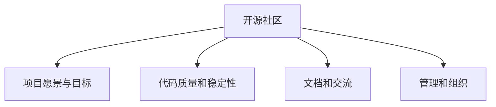

                 

# 开源项目：提升影响力与机会

> 关键词：开源社区, 项目影响力, 机会把握, 贡献与反馈, 质量控制, 项目演化, 开源文化, 成功案例

## 1. 背景介绍

### 1.1 问题由来
开源项目在过去几十年间，以其高灵活性、低成本、快速迭代等优势，迅速成为软件开发的重要形式。然而，尽管大量项目已经上线，但真正获得持续成功和影响力的开源项目仍然只是少数。是什么原因导致大多数开源项目在社区中默默无闻，未能吸引更多的开发者和用户关注？本文将从开源项目的成功要素、影响力提升策略、以及面临的挑战等多个角度出发，深入探讨这一问题。

### 1.2 问题核心关键点
开源项目的成功并非偶然，而是由一系列关键因素共同作用的结果。从项目的初始设计，到后续的社区维护，再到持续的更新迭代，每一个环节都至关重要。成功的开源项目通常具备以下几个特征：

- **清晰的愿景和目标**：项目需要有一个明确的发展方向和目标，让社区成员能够理解并为其贡献力量。
- **稳定和可用的代码**：高质量的代码和稳定的发布频率是吸引用户和开发者关注的基础。
- **良好的文档和社区交流**：清晰的文档和活跃的社区交流，有助于吸引新成员，同时也方便现有成员的协作和问题解决。
- **有效的管理和组织**：项目需要有有效的管理和组织结构，确保各项任务有条不紊地进行。

基于这些特征，我们可以从多个维度分析开源项目的成功要素，并探讨如何提升项目的社区影响力。

## 2. 核心概念与联系

### 2.1 核心概念概述

为了更好地理解开源项目的成功要素，本节将介绍几个密切相关的核心概念：

- **开源社区**：由开发者、贡献者、用户组成的社区，成员之间通过代码、文档、讨论等方式相互协作和交流。
- **项目愿景与目标**：项目初期的发展方向和具体目标，指导社区成员进行贡献和迭代。
- **代码质量和稳定性**：项目的代码质量、稳定性、可维护性等，直接影响项目的吸引力和用户体验。
- **文档和交流**：项目文档、社区交流、用户手册等，是帮助新用户快速上手，吸引开发者参与的重要工具。
- **管理和组织**：项目的组织架构、项目管理方式、决策机制等，确保项目能够高效运作。

这些核心概念之间的逻辑关系可以通过以下Mermaid流程图来展示：



这个流程图展示了一些关键概念及其之间的关系：

1. 开源社区是项目发展的基础。
2. 项目愿景与目标是指导社区成员的重要指引。
3. 代码质量和稳定性直接影响项目的吸引力和用户体验。
4. 文档和交流是帮助用户和开发者快速上手的重要工具。
5. 管理和组织是项目高效运作的关键。

## 3. 核心算法原理 & 具体操作步骤

### 3.1 算法原理概述

开源项目的成功离不开社区的持续支持和参与。影响社区参与度的因素很多，包括项目的可访问性、使用方便性、社区氛围等。本文将重点讨论如何通过合理的策略，提升项目的社区影响力，吸引更多开发者和用户。

根据社区动力学原理，项目的影响力和参与度可以大致分为两个阶段：

1. **初期增长阶段**：新项目启动时，需要快速吸引初始用户和开发者，建立社区基础。
2. **持续维护阶段**：社区逐步壮大后，需要通过持续的更新和优化，保持社区活力和项目的持续成功。

### 3.2 算法步骤详解

#### 3.2.1 初期增长阶段

- **选择合适的启动平台**：GitHub、GitLab、Bitbucket等开源托管平台是开源项目的重要载体。选择一个使用频繁、功能丰富的平台，有助于项目的快速曝光和用户获取。
- **项目文档和示例代码**：提供详细的项目文档和使用示例，帮助新用户快速上手。文档应包括项目简介、安装指南、API文档等，示例代码应包含常见用法和错误处理。
- **积极参与社区交流**：在社交媒体、技术博客、邮件列表等平台积极发布项目进展和更新，鼓励用户反馈和讨论。可以通过每周周报、每月月报等方式，定期向社区汇报项目进展。
- **建立开发者社区**：通过邮件列表、Slack、Discord等工具建立开发者社区，定期组织线上会议和讨论，鼓励开发者贡献代码和解决问题。

#### 3.2.2 持续维护阶段

- **定期发布和更新**：保持项目的活跃度，定期发布新功能和修复bug，吸引现有用户和开发者的持续关注。
- **社区反馈和迭代优化**：积极收集社区反馈，快速修复bug，引入新功能和特性，提升项目的使用体验。
- **持续宣传和推广**：通过技术博客、开源新闻、技术会议等平台，持续宣传项目，提升项目的知名度和吸引力。
- **激励和奖励机制**：设立贡献者奖励机制，如徽章、代码贡献证书等，激励开发者积极参与项目，提升项目的整体质量。

### 3.3 算法优缺点

开源项目的影响力和参与度提升策略，具有以下优点：

- **快速吸引用户**：通过良好的文档和社区交流，快速吸引新用户和开发者关注。
- **提升代码质量**：通过社区贡献和迭代优化，提升项目的代码质量和稳定性。
- **降低开发成本**：社区的协同开发和贡献，大幅降低了项目的开发和维护成本。

但该策略也存在一些局限性：

- **资源和精力有限**：项目初期需要投入大量的资源和精力进行推广和维护，可能对项目开发进度产生一定影响。
- **质量控制困难**：社区贡献的代码和特性需要及时进行审核和质量控制，确保项目稳定性。
- **协调复杂性**：社区成员可能来自不同的背景和组织，协调和沟通需要一定的时间和精力。

### 3.4 算法应用领域

开源项目的社区影响力提升策略，在软件开发、数据分析、科学计算等多个领域均有广泛应用。以下是几个典型案例：

- **Apache Hadoop**：通过提供全面的分布式计算平台，吸引了大量开发者和企业的关注和参与。Hadoop社区通过定期发布更新、组织社区活动、设立贡献者奖励等方式，持续提升了项目的影响力和参与度。
- **TensorFlow**：作为谷歌开源的深度学习框架，TensorFlow通过清晰的文档和示例代码，吸引了全球数百万开发者和用户。TensorFlow社区通过建立开发者社区、持续优化API和功能、设立TensorFlow认证工程师等方式，提升项目的社区影响力和开发者活跃度。
- **Kubernetes**：作为容器编排的行业标准，Kubernetes通过提供完整的集群管理和容器编排工具，吸引了大量企业用户的采用。Kubernetes社区通过定期发布更新、组织技术会议、设立贡献者奖励等方式，提升项目的影响力和用户参与度。

## 4. 数学模型和公式 & 详细讲解 & 举例说明

### 4.1 数学模型构建

为了量化开源项目的社区影响力和参与度，可以构建一个基于用户参与度的数学模型。假设开源项目有$N$个用户，每个用户$u_i$（$i=1,2,...,N$）对项目的贡献度为$C_i$，贡献度越高的用户对项目的影响力越大。项目的总影响力$I$可以表示为：

$$
I = \sum_{i=1}^N C_i
$$

用户$u_i$的贡献度$C_i$可以分解为多个维度，如代码贡献、问题提交、社区讨论等。通过设定各维度的权重，可以计算每个用户的总贡献度。

### 4.2 公式推导过程

假设用户$u_i$在代码贡献维度上的贡献度为$C_i^c$，问题提交维度上的贡献度为$C_i^p$，社区讨论维度上的贡献度为$C_i^d$。可以设定各维度的权重为$w^c, w^p, w^d$，则用户$u_i$的总贡献度$C_i$可以表示为：

$$
C_i = w^c C_i^c + w^p C_i^p + w^d C_i^d
$$

对于代码贡献维度，设用户$u_i$贡献的代码行数为$R_i$，贡献代码的频率为$F_i$，则：

$$
C_i^c = \frac{R_i}{R_{avg}} + \frac{F_i}{F_{avg}}
$$

其中，$R_{avg}$和$F_{avg}$分别为所有用户的平均代码行数和平均贡献频率。

对于问题提交维度，设用户$u_i$提交的问题数量为$Q_i$，解决的问题数量为$S_i$，则：

$$
C_i^p = \frac{Q_i}{Q_{avg}} + \frac{S_i}{S_{avg}}
$$

其中，$Q_{avg}$和$S_{avg}$分别为所有用户的平均问题提交量和平均问题解决量。

对于社区讨论维度，设用户$u_i$参与的讨论数量为$D_i$，发表的评论数量为$C_i$，则：

$$
C_i^d = \frac{D_i}{D_{avg}} + \frac{C_i}{C_{avg}}
$$

其中，$D_{avg}$和$C_{avg}$分别为所有用户的平均讨论数量和平均评论数量。

### 4.3 案例分析与讲解

以Apache Hadoop为例，分析其社区影响力和参与度的提升策略：

- **代码贡献**：Hadoop项目通过引入Cloudera的贡献者计划，设立代码贡献证书，激励开发者积极贡献代码。同时，通过定期发布更新和API文档，保持代码的稳定性和可维护性。
- **问题提交和解决**：Hadoop项目通过建立用户反馈系统，鼓励用户提交问题并报告bug。开发团队积极响应和解决用户提交的问题，提升项目的稳定性。
- **社区讨论**：Hadoop项目通过建立邮件列表和Slack社区，鼓励用户和开发者积极参与讨论。定期组织线上会议和社区活动，增强社区凝聚力。

通过上述策略，Hadoop项目在开源社区的影响力和参与度显著提升，吸引了大量开发者和企业用户的关注和贡献。

## 5. 项目实践：代码实例和详细解释说明

### 5.1 开发环境搭建

在进行开源项目的影响力提升实践前，我们需要准备好开发环境。以下是使用Python进行GitHub项目的开发环境配置流程：

1. 安装Git：从官网下载并安装Git，用于版本控制和项目管理。
2. 安装GitHub Desktop：官网下载并安装GitHub Desktop，用于GitHub项目的本地操作。
3. 配置GitHub账号：在GitHub官网上注册账号，并下载OAuth2令牌，用于认证GitHub项目。
4. 配置环境变量：设置GitHub API token的环境变量，以便访问GitHub API。

完成上述步骤后，即可在本地搭建起GitHub项目的开发环境。

### 5.2 源代码详细实现

这里我们以TensorFlow项目为例，给出使用Python和Git进行TensorFlow项目开发和维护的代码实现。

**步骤1：克隆TensorFlow项目**

```python
# 安装GitHub Desktop
# 登录GitHub账号
# 克隆TensorFlow项目
git clone https://github.com/tensorflow/tensorflow.git
```

**步骤2：配置本地环境**

```python
# 安装TensorFlow依赖库
pip install tensorflow
```

**步骤3：贡献代码**

```python
# 创建本地分支
git checkout -b my-contribution

# 修改代码并提交
git add .
git commit -m "Add new feature"

# 推送到GitHub
git push origin my-contribution
```

**步骤4：提交问题**

```python
# 访问GitHub项目页面
# 点击Issues
# 提交问题
```

**步骤5：参与社区讨论**

```python
# 访问GitHub项目页面
# 点击Discussions
# 参与讨论
```

### 5.3 代码解读与分析

让我们再详细解读一下关键代码的实现细节：

**克隆项目**：
- `git clone`命令用于从GitHub上克隆项目到本地。
- 确保GitHub Desktop和Python环境已正确配置，才能进行后续操作。

**代码贡献**：
- `git checkout -b my-contribution`命令创建新的本地分支。
- `git add .`命令将所有修改的文件添加到暂存区。
- `git commit -m "Add new feature"`命令提交修改，并附上提交信息。
- `git push origin my-contribution`命令将修改推送到GitHub远程仓库。

**问题提交**：
- 访问GitHub项目页面，点击Issues选项卡，提交新的问题。
- 在提交问题时，务必详细描述问题情况和期望的解决方案，以便开发团队快速响应和解决。

**社区讨论**：
- 访问GitHub项目页面，点击Discussions选项卡，参与讨论。
- 在讨论区积极提出问题和观点，及时回复其他成员的评论，增强社区互动。

这些操作是开源项目维护和社区参与的基本步骤，开发者应熟练掌握。通过积极贡献代码、提交问题和参与讨论，可以显著提升项目的社区影响力和开发者活跃度。

### 5.4 运行结果展示

运行上述代码后，项目代码和问题提交将同步到GitHub上，社区成员可以通过Pull Request、Issues和Discussions等方式，进行代码审查和问题反馈。这种持续的互动和反馈，将促进项目的健康发展，提升项目的影响力和社区参与度。

## 6. 实际应用场景

### 6.1 开源项目的影响力提升策略

开源项目的影响力提升策略在多个行业领域均有应用。以下是几个典型案例：

- **开源数据库**：开源数据库如MySQL、PostgreSQL等，通过提供高性能的数据存储和查询功能，吸引了大量企业和开发者关注。这些项目通过定期的功能和性能优化、社区交流和贡献激励等方式，持续提升了项目的社区影响力和使用率。
- **开源编辑器**：开源编辑器如Visual Studio Code、Atom等，通过提供强大的代码编辑功能和社区支持，吸引了大量开发者和用户的关注。这些项目通过定期的更新和优化、社区交流和贡献激励等方式，提升了项目的社区影响力和用户粘性。
- **开源机器学习框架**：开源机器学习框架如TensorFlow、PyTorch等，通过提供强大的深度学习工具和社区支持，吸引了大量开发者和研究人员的关注。这些项目通过定期的功能和性能优化、社区交流和贡献激励等方式，提升了项目的社区影响力和研究影响力。

### 6.2 未来应用展望

开源项目的社区影响力提升策略，在未来的发展中将更加重要。随着技术生态的不断演化和创新，开源项目的影响力和应用范围将进一步扩大。未来，开源项目的影响力提升策略将呈现以下几个趋势：

- **多领域应用**：开源项目将从技术领域扩展到更多行业，如金融、医疗、教育等领域，提供更加多样化的解决方案。
- **社区生态构建**：开源项目的社区生态将更加多样化和专业化，形成更加丰富的开发者和用户群体。
- **可持续维护**：开源项目的持续维护和迭代优化将更加注重社区贡献和用户反馈，保持项目的稳定性和创新性。
- **全球化协作**：开源项目的全球化协作将更加深入，吸引全球范围内的开发者和用户参与，形成更加开放和多元的创新环境。

## 7. 工具和资源推荐

### 7.1 学习资源推荐

为了帮助开发者系统掌握开源项目的社区影响力提升方法，这里推荐一些优质的学习资源：

1. **《开源社区管理与运营》系列博文**：由开源社区专家撰写，深入浅出地介绍了开源社区的管理、运营和推广策略。
2. **Coursera《软件工程与设计》课程**：斯坦福大学开设的计算机科学课程，涵盖开源项目管理的核心概念和实践方法。
3. **《开源项目成功之道》书籍**：开源项目成功案例的详细介绍，涵盖从项目启动到维护的各个环节。
4. **GitHub官方文档**：GitHub官方提供的详细文档，涵盖项目托管、社区管理、贡献激励等各个方面。
5. **Apache Foundation官方指南**：Apache基金会提供的开源项目管理和推广指南，帮助开发者提升项目影响力和社区活跃度。

通过对这些资源的学习实践，相信你一定能够系统掌握开源项目的社区影响力提升方法，并用于解决实际的社区问题。

### 7.2 开发工具推荐

高效的开发离不开优秀的工具支持。以下是几款用于开源项目社区影响力提升开发的常用工具：

1. **GitHub Desktop**：官方的Git客户端，用于本地操作和管理GitHub项目。
2. **Jira**：项目管理工具，帮助开发者和团队进行任务跟踪和问题管理。
3. **Slack**：社区交流工具，支持团队成员之间的即时消息和文件共享。
4. **Confluence**：知识库工具，帮助团队进行文档管理和知识积累。
5. **Figma**：设计工具，支持团队进行UI设计和界面协作。

合理利用这些工具，可以显著提升开源项目的社区影响力和开发者协作效率。

### 7.3 相关论文推荐

开源项目的社区影响力提升策略，源于学界的持续研究。以下是几篇奠基性的相关论文，推荐阅读：

1. **《开源社区参与和贡献模式》**：研究开源社区中开发者和用户的行为模式，提出社区参与和贡献的有效策略。
2. **《开源项目的成功要素》**：分析开源项目成功的关键要素，提出基于社区驱动的创新方法。
3. **《开源项目的持续维护和管理》**：研究开源项目的持续维护策略，提出社区支持和贡献激励的有效方法。
4. **《开源项目的国际化协作》**：研究开源项目的全球化协作模式，提出跨文化和跨地域的协作方法。
5. **《开源项目的可持续性研究》**：研究开源项目的可持续性问题，提出长期管理和维护的有效策略。

这些论文代表了大规模开源项目的研究进展，有助于开发者深入理解开源项目的社区影响力和社区管理。

## 8. 总结：未来发展趋势与挑战

### 8.1 研究成果总结

本文对开源项目的社区影响力提升方法进行了全面系统的介绍。首先阐述了开源项目的成功要素和影响力提升策略，明确了开源项目在社区中的重要地位和提升方法。其次，从原理到实践，详细讲解了开源项目的社区参与机制和维护方法，给出了开源项目社区影响力提升的完整代码实例。同时，本文还广泛探讨了开源项目在多个行业领域的应用前景，展示了开源项目的巨大潜力和发展方向。

通过本文的系统梳理，可以看到，开源项目的社区影响力提升策略在多个领域均有广泛应用，具有重要的实践价值和推广意义。未来，伴随开源社区的不断发展和壮大，开源项目的社区影响力提升策略将进一步成熟和完善，为更多开发者和用户提供高质量的解决方案。

### 8.2 未来发展趋势

开源项目的社区影响力提升策略，将在未来呈现以下几个发展趋势：

1. **社区生态的多样化**：开源项目的社区生态将更加多样化和专业化，形成更加丰富的开发者和用户群体。
2. **全球化协作的深入**：开源项目的全球化协作将更加深入，吸引全球范围内的开发者和用户参与，形成更加开放和多元的创新环境。
3. **多领域应用的拓展**：开源项目将从技术领域扩展到更多行业，如金融、医疗、教育等领域，提供更加多样化的解决方案。
4. **社区支持的强化**：开源项目的社区支持将更加注重开发者和用户的反馈和需求，保持项目的稳定性和创新性。
5. **可持续维护的重视**：开源项目的可持续维护和迭代优化将更加注重社区贡献和用户反馈，保持项目的长期活跃和持续成功。

### 8.3 面临的挑战

尽管开源项目在社区影响力提升方面取得了显著成效，但仍面临诸多挑战：

1. **社区管理难度**：开源项目的社区规模不断扩大，如何高效管理和协调社区成员成为一个难题。
2. **贡献激励不足**：社区贡献激励机制不够完善，可能导致开发者积极性不足，影响项目的持续发展。
3. **质量控制困难**：开源项目的贡献代码和特性需要及时进行审核和质量控制，确保项目稳定性。
4. **文化多样性挑战**：开源项目的多样化发展带来了文化多样性问题，需要采取多种沟通和协作方式。
5. **持续投入压力**：开源项目需要持续投入人力和资源进行维护和更新，可能对项目开发进度产生一定影响。

### 8.4 研究展望

面对开源项目社区影响力提升所面临的挑战，未来的研究需要在以下几个方面寻求新的突破：

1. **社区治理机制优化**：建立更加科学和灵活的社区治理机制，提高社区管理的效率和效果。
2. **贡献激励机制改进**：设立更加公平和透明的贡献激励机制，提升社区成员的积极性和归属感。
3. **质量控制方法创新**：引入自动化测试和代码审查工具，提升代码质量和稳定性。
4. **文化多样性融合**：采取多种沟通和协作方式，促进不同文化背景的社区成员融合。
5. **持续投入优化**：优化项目资源的配置和使用，平衡开发和社区维护的投入。

这些研究方向的探索，必将引领开源项目社区影响力提升策略迈向更高的台阶，为开发者和用户提供更优质的解决方案。未来，开源项目将与更多行业领域深度融合，推动技术生态的不断演化和创新，为更多开发者和用户带来新的价值和机会。

## 9. 附录：常见问题与解答

**Q1：开源项目如何吸引更多的开发者和用户？**

A: 开源项目吸引开发者和用户的关键在于项目的清晰愿景、高质量的代码、活跃的社区和持续的更新。通过提供详细的文档和示例代码，快速吸引新用户和开发者关注。同时，通过社区交流和贡献激励，提升项目的活跃度和用户粘性。

**Q2：开源项目的社区管理和维护有哪些有效策略？**

A: 开源项目的社区管理和维护需要科学和灵活的策略，包括：
1. 设立明确的社区规则和治理机制。
2. 建立活跃的社区交流平台，如邮件列表、Slack、Discord等。
3. 设立贡献者奖励机制，如徽章、代码贡献证书等。
4. 定期发布更新和API文档，保持项目的稳定性和可维护性。
5. 及时响应社区反馈，快速修复bug和解决问题。

**Q3：开源项目的贡献激励有哪些有效方式？**

A: 开源项目的贡献激励可以采用多种方式，包括：
1. 设立徽章和贡献证书，表彰贡献者。
2. 设立贡献者排名和榜单，提升贡献者的荣誉感。
3. 设立贡献者奖励计划，如代码贡献奖金、技术交流机会等。
4. 提供代码审查和导师指导，提升贡献者的技术水平。
5. 建立社区活动和会议，促进贡献者和用户交流。

**Q4：开源项目的持续维护需要注意哪些问题？**

A: 开源项目的持续维护需要注意以下几个问题：
1. 定期发布更新和API文档，保持项目的稳定性和可维护性。
2. 及时响应社区反馈，快速修复bug和解决问题。
3. 引入自动化测试和代码审查工具，提升代码质量和稳定性。
4. 定期组织社区活动和会议，增强社区凝聚力。
5. 设立社区治理机制，确保项目的健康发展和有序管理。

这些操作是开源项目持续维护和社区管理的核心内容，开发者应熟练掌握。通过科学和灵活的社区管理和持续的更新维护，可以显著提升项目的社区影响力和用户粘性。

---

作者：禅与计算机程序设计艺术 / Zen and the Art of Computer Programming

