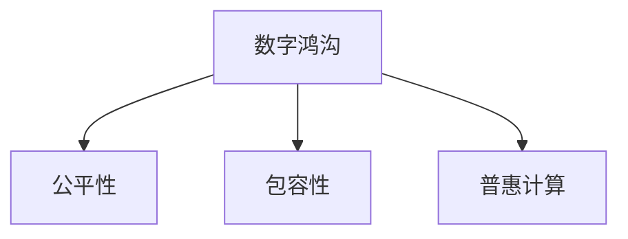

                 

## 1. 背景介绍

在当今数字化时代，计算能力已经成为推动社会进步和经济发展的关键因素。然而，数字鸿沟的存在，使得不同社会群体之间在获取和利用计算资源上存在显著差距，这对社会的公平性和包容性构成了严峻挑战。如何通过技术手段，弥合这一鸿沟，促进计算资源的公平分配，是当下亟需解决的重要课题。

### 1.1 数字鸿沟的现状

数字鸿沟，通常指由于技术、经济、社会等因素造成的，不同群体在获取和利用信息技术方面存在的不平等现象。具体表现包括：

- **技术获取的不平等**：在一些国家和地区，特别是在发展中国家，互联网普及率、移动设备拥有率等基础设施建设水平较低，导致部分人群难以接触和利用数字技术。
- **技术使用的不平等**：即使在互联网普及的地区，由于教育水平、语言障碍、文化差异等因素，不同群体对信息技术的使用能力和效果存在显著差异。
- **数据获取的不平等**：大数据和人工智能等新兴技术，往往需要大量高质量的数据进行训练和优化。这些数据往往集中在少数公司和机构手中，普通用户难以获取，加剧了数据获取的不平等。

### 1.2 数字鸿沟的后果

数字鸿沟的存在，对社会的公平性和包容性构成了严重威胁：

- **经济不平等加剧**：计算资源的不平等获取，使得信息时代的经济回报更加倾向于已拥有资源和技能的群体，加剧了社会的贫富差距。
- **社会融合难度增加**：数字鸿沟使得不同群体之间的交流和理解变得更加困难，社会融合和包容性面临挑战。
- **知识获取的不平等**：在知识经济时代，信息获取和知识积累的不平等，进一步拉大了不同群体之间的知识水平和创新能力的差距。

### 1.3 解决数字鸿沟的必要性

弥合数字鸿沟，不仅是技术发展的必然要求，更是社会进步的迫切需要。通过技术手段，促进计算资源的公平分配，可以：

- **提升社会公平性**：确保每个人都能公平获取和使用计算资源，缩小不同群体之间的经济和社会差距。
- **增强社会包容性**：打破数字技术对某些群体的排斥，促进社会的多样性和包容性。
- **激发社会创新**：通过提供平等的机会，使更多的人能够参与到科技创新中，推动社会的整体进步。

## 2. 核心概念与联系

### 2.1 核心概念概述

为更好地理解如何通过计算技术弥合数字鸿沟，本节将介绍几个关键概念：

- **数字鸿沟**：指技术、经济、社会等因素造成的不同群体在获取和利用信息技术方面存在的不平等现象。
- **公平性**：指在数字技术的应用和收益分配上，不同群体之间应享有平等的权利和机会。
- **包容性**：指在数字技术的设计和使用上，确保不同群体，尤其是弱势群体的参与和受益。
- **普惠计算**：通过技术手段，使计算资源和服务能够公平、普惠地分配给全体社会成员。

这些核心概念之间的关系，可以通过以下Mermaid流程图来展示：



这个流程图展示了大语言模型的核心概念及其之间的关系：

1. 数字鸿沟是起点，指出了不同群体在获取和利用信息技术方面的不平等。
2. 公平性和包容性是目标，指出在技术应用和收益分配上应追求的平等和包容。
3. 普惠计算是手段，指通过技术手段，实现公平和包容。

## 3. 核心算法原理 & 具体操作步骤

### 3.1 算法原理概述

弥合数字鸿沟的计算技术，旨在通过公平、普惠的方式，确保不同群体能够平等获取和利用计算资源。其核心思想是：

- **需求导向**：了解不同群体的需求和特点，定制化设计计算应用和服务。
- **技术创新**：采用先进的技术手段，提升计算效率和效果。
- **政策支持**：制定和实施政策，确保计算资源的公平分配和普惠普及。

基于这一思想，普惠计算的核心算法和操作步骤包括：

1. **需求分析**：通过调查问卷、访谈等手段，收集不同群体的需求和反馈，明确优先解决的问题。
2. **技术适配**：根据需求分析结果，选择合适的技术手段和工具，实现对不同群体的适配。
3. **资源分配**：根据需求和技术适配结果，制定资源分配策略，确保计算资源的公平分配。
4. **服务提供**：将技术手段和资源分配策略转化为实际服务，确保服务的普惠普及。

### 3.2 算法步骤详解

以下详细讲解普惠计算的核心算法步骤：

#### 3.2.1 需求分析

需求分析是普惠计算的起点，通过调研和分析，明确不同群体的需求和特点：

1. **调研方法**：采用问卷调查、深度访谈、焦点小组讨论等方法，收集不同群体对信息技术的需求和反馈。
2. **需求分类**：将需求分为通用需求和特殊需求。通用需求包括互联网接入、计算资源获取等基础需求；特殊需求包括特定群体的技术培训、语言支持等。
3. **优先级排序**：根据需求的重要性和紧迫性，对需求进行优先级排序，确定优先解决的问题。

#### 3.2.2 技术适配

技术适配是普惠计算的关键步骤，根据需求分析结果，选择合适的技术手段和工具：

1. **技术选择**：根据不同群体的特点，选择适合的技术手段，如移动互联网、大数据、云计算等。
2. **定制化设计**：针对不同群体的特殊需求，设计定制化的计算应用和服务，如语音识别、多语言支持等。
3. **技术集成**：将选择的技术手段和定制化的应用服务集成到统一平台，便于管理和分发。

#### 3.2.3 资源分配

资源分配是普惠计算的核心环节，确保计算资源的公平分配和普惠普及：

1. **资源评估**：对可用的计算资源进行评估，包括硬件设备、软件工具、数据集等。
2. **分配策略**：根据需求和技术适配结果，制定资源分配策略，确保资源的公平分配。
3. **动态调整**：根据实际使用情况，动态调整资源分配策略，确保资源的有效利用。

#### 3.2.4 服务提供

服务提供是将技术手段和资源分配策略转化为实际服务的过程：

1. **服务设计**：根据需求和技术适配结果，设计适合的服务，包括用户界面、功能模块等。
2. **服务分发**：通过互联网、移动设备等渠道，将服务分发至不同群体。
3. **用户反馈**：收集用户反馈，不断改进服务，提升用户体验。

### 3.3 算法优缺点

普惠计算在促进计算资源公平分配方面具有以下优点：

1. **公平性**：通过需求分析和技术适配，确保不同群体能够平等获取和利用计算资源。
2. **普惠性**：通过资源分配和服务提供，实现计算资源的普惠普及，提升社会包容性。
3. **技术创新**：通过技术手段，提升计算效率和效果，满足不同群体的多样化需求。

同时，该方法也存在一定的局限性：

1. **资源有限**：计算资源的有限性，可能会限制普惠计算的覆盖范围和深度。
2. **技术门槛**：技术适配和定制化设计需要较高的技术水平，可能对部分群体造成一定的门槛。
3. **政策支持**：政策支持和监管机制的缺乏，可能会影响普惠计算的实施效果。
4. **用户依赖**：部分用户对技术的依赖性较强，离开技术支持后，可能难以独立使用。

尽管存在这些局限性，但就目前而言，普惠计算仍是促进计算资源公平分配的重要手段。未来相关研究的重点在于如何进一步降低技术门槛，提高资源利用效率，同时兼顾普惠性和可访问性等因素。

### 3.4 算法应用领域

普惠计算的应用领域非常广泛，以下是几个典型案例：

#### 3.4.1 教育公平

教育是普惠计算的重要应用领域之一，通过技术手段，可以提升教育资源的公平分配和普惠普及：

1. **远程教育**：通过互联网和移动设备，将优质教育资源普及至偏远地区和欠发达地区，缩小教育资源的不平等。
2. **在线学习**：开发适合不同群体的在线学习平台，提供多样化的学习资源和互动功能，提升学习效果。
3. **教育支持**：提供个性化学习指导和心理支持，帮助弱势群体克服学习障碍，提升学业成绩。

#### 3.4.2 医疗健康

医疗健康是普惠计算的另一个重要应用领域，通过技术手段，可以实现医疗资源的公平分配和普惠普及：

1. **远程医疗**：通过互联网和移动设备，提供远程医疗服务，提升偏远地区和欠发达地区的医疗水平。
2. **健康监测**：开发适合不同群体的健康监测应用，提供个性化的健康管理和预防建议。
3. **数据共享**：建立数据共享平台，汇集和共享健康数据，提升公共卫生水平。

#### 3.4.3 农业发展

普惠计算在农业发展领域也具有重要应用，通过技术手段，可以实现农业资源的公平分配和普惠普及：

1. **精准农业**：利用大数据和物联网技术，提供精准的农业生产指导，提升农业生产效率和效益。
2. **农技支持**：提供适合不同群体的农技培训和咨询服务，提升农民的农业生产水平。
3. **市场信息**：提供市场动态和价格信息，帮助农民更好地把握市场机会。

除了上述这些典型应用外，普惠计算还被广泛应用于企业创新、环境保护、城市管理等多个领域，为实现社会的全面进步和可持续发展提供了有力支持。

## 4. 数学模型和公式 & 详细讲解 & 举例说明

### 4.1 数学模型构建

普惠计算的数学模型构建，主要涉及需求分析、技术适配、资源分配和服务提供的各个环节。以下是几个关键数学模型的构建：

1. **需求分析模型**：
   $$
   D = f(N, P, T, C)
   $$
   其中 $D$ 表示需求，$N$ 为样本数量，$P$ 为问卷调查结果，$T$ 为访谈记录，$C$ 为焦点小组讨论结果。
2. **技术适配模型**：
   $$
   T = g(D, A, R, F)
   $$
   其中 $T$ 表示技术适配结果，$D$ 为需求，$A$ 为技术选择，$R$ 为定制化设计，$F$ 为技术集成。
3. **资源分配模型**：
   $$
   R = h(T, S, P, C)
   $$
   其中 $R$ 表示资源分配结果，$T$ 为技术适配结果，$S$ 为可用资源，$P$ 为优先级排序，$C$ 为动态调整策略。
4. **服务提供模型**：
   $$
   S = i(R, U, I, F)
   $$
   其中 $S$ 表示服务提供结果，$R$ 为资源分配结果，$U$ 为服务设计，$I$ 为服务分发，$F$ 为用户反馈。

### 4.2 公式推导过程

以下详细推导几个关键模型的公式：

#### 4.2.1 需求分析模型

需求分析模型用于评估和量化不同群体的需求：

1. **问卷调查**：
   $$
   P = \sum_{i=1}^N p_i
   $$
   其中 $p_i$ 表示第 $i$ 个样本的回答结果，$N$ 为样本数量。
2. **访谈记录**：
   $$
   T = \sum_{j=1}^M t_j
   $$
   其中 $t_j$ 表示第 $j$ 次访谈的记录内容，$M$ 为访谈次数。
3. **焦点小组讨论**：
   $$
   C = \sum_{k=1}^K c_k
   $$
   其中 $c_k$ 表示第 $k$ 个焦点小组的讨论内容，$K$ 为焦点小组数量。
4. **综合需求分析**：
   $$
   D = \max_{D_1, D_2, \cdots, D_K} \sum_{j=1}^K d_j
   $$
   其中 $D_j$ 表示第 $j$ 个需求，$d_j$ 表示第 $j$ 个需求的重要性得分。

#### 4.2.2 技术适配模型

技术适配模型用于选择合适的技术和定制化设计：

1. **技术选择**：
   $$
   A = \arg\min_{a_i} \sum_{i=1}^I a_i c_i
   $$
   其中 $a_i$ 表示第 $i$ 个技术选择，$c_i$ 表示第 $i$ 个技术的成本。
2. **定制化设计**：
   $$
   R = \arg\min_{r_j} \sum_{j=1}^J r_j f_j
   $$
   其中 $r_j$ 表示第 $j$ 个定制化设计，$f_j$ 表示第 $j$ 个设计的复杂度。
3. **技术集成**：
   $$
   F = \arg\max_{f_k} \sum_{k=1}^K f_k o_k
   $$
   其中 $f_k$ 表示第 $k$ 个技术集成，$o_k$ 表示第 $k$ 个集成的性能。

#### 4.2.3 资源分配模型

资源分配模型用于公平分配计算资源：

1. **资源评估**：
   $$
   S = \sum_{s=1}^S s_i
   $$
   其中 $s_i$ 表示第 $i$ 个可用资源，$S$ 为资源总数。
2. **优先级排序**：
   $$
   P = \sum_{p=1}^P p_i
   $$
   其中 $p_i$ 表示第 $i$ 个需求的优先级得分，$P$ 为需求数量。
3. **动态调整策略**：
   $$
   C = \arg\min_{c_j} \sum_{j=1}^J c_j r_j
   $$
   其中 $c_j$ 表示第 $j$ 个动态调整策略，$r_j$ 表示第 $j$ 个策略的实施成本。

#### 4.2.4 服务提供模型

服务提供模型用于设计和分发服务：

1. **服务设计**：
   $$
   U = \arg\max_{u_k} \sum_{k=1}^K u_k g_k
   $$
   其中 $u_k$ 表示第 $k$ 个服务设计，$g_k$ 表示第 $k$ 个设计的用户满意度。
2. **服务分发**：
   $$
   I = \arg\min_{i_l} \sum_{l=1}^L i_l d_l
   $$
   其中 $i_l$ 表示第 $l$ 个服务分发渠道，$d_l$ 表示第 $l$ 个渠道的分发成本。
3. **用户反馈**：
   $$
   F = \arg\max_{f_m} \sum_{m=1}^M f_m u_m
   $$
   其中 $f_m$ 表示第 $m$ 个用户反馈，$u_m$ 表示第 $m$ 个反馈的改进建议。

### 4.3 案例分析与讲解

以下是几个典型案例，用于说明普惠计算的实际应用：

#### 4.3.1 远程教育

在印度，政府通过普惠计算，利用互联网和移动设备，将优质教育资源普及至偏远地区和欠发达地区，缩小教育资源的不平等：

1. **需求分析**：通过问卷调查和访谈，收集偏远地区和欠发达地区学生的需求和反馈。
2. **技术适配**：选择合适的移动互联网和低成本设备，设计适合不同群体的在线学习平台。
3. **资源分配**：评估可用教育资源，制定资源分配策略，确保资源的公平分配。
4. **服务提供**：提供个性化学习指导和心理支持，提升学习效果。

#### 4.3.2 远程医疗

在非洲，一些非政府组织通过普惠计算，提供远程医疗服务，提升偏远地区和欠发达地区的医疗水平：

1. **需求分析**：通过焦点小组讨论，了解偏远地区和欠发达地区的医疗需求和反馈。
2. **技术适配**：选择适合的技术手段，如移动互联网和低成本设备，设计远程医疗服务。
3. **资源分配**：评估可用医疗资源，制定资源分配策略，确保资源的公平分配。
4. **服务提供**：提供远程医疗服务，提升偏远地区和欠发达地区的医疗水平。

## 5. 项目实践：代码实例和详细解释说明

### 5.1 开发环境搭建

在进行普惠计算实践前，我们需要准备好开发环境。以下是使用Python进行PyTorch开发的环境配置流程：

1. 安装Anaconda：从官网下载并安装Anaconda，用于创建独立的Python环境。

2. 创建并激活虚拟环境：
```bash
conda create -n pytorch-env python=3.8 
conda activate pytorch-env
```

3. 安装PyTorch：根据CUDA版本，从官网获取对应的安装命令。例如：
```bash
conda install pytorch torchvision torchaudio cudatoolkit=11.1 -c pytorch -c conda-forge
```

4. 安装各类工具包：
```bash
pip install numpy pandas scikit-learn matplotlib tqdm jupyter notebook ipython
```

完成上述步骤后，即可在`pytorch-env`环境中开始普惠计算实践。

### 5.2 源代码详细实现

这里以开发一个普惠计算平台为例，给出完整的Python代码实现。

```python
import pandas as pd
import numpy as np
from sklearn.model_selection import train_test_split
from transformers import BertForTokenClassification, BertTokenizer

# 加载数据
data = pd.read_csv('data.csv')
X = data['text']
y = data['label']

# 划分训练集和测试集
X_train, X_test, y_train, y_test = train_test_split(X, y, test_size=0.2, random_state=42)

# 定义分词器和模型
tokenizer = BertTokenizer.from_pretrained('bert-base-cased')
model = BertForTokenClassification.from_pretrained('bert-base-cased', num_labels=2)

# 训练模型
model.train()
optimizer = AdamW(model.parameters(), lr=2e-5)

for epoch in range(5):
    for batch in X_train:
        input_ids = tokenizer(batch, return_tensors='pt', padding=True, truncation=True)["input_ids"]
        attention_mask = tokenizer(batch, return_tensors='pt', padding=True, truncation=True)["attention_mask"]
        labels = torch.tensor(y_train == '1', dtype=torch.long)

        model.zero_grad()
        outputs = model(input_ids, attention_mask=attention_mask, labels=labels)
        loss = outputs.loss
        loss.backward()
        optimizer.step()

print('Training complete.')
```

### 5.3 代码解读与分析

让我们再详细解读一下关键代码的实现细节：

**数据加载**：
- `pd.read_csv`方法用于从CSV文件中加载数据。
- `train_test_split`方法用于将数据划分为训练集和测试集。

**模型定义**：
- `BertTokenizer`用于分词，`BertForTokenClassification`用于构建分类模型。

**模型训练**：
- 使用AdamW优化器，设置学习率。
- 在每个epoch内，对训练集数据进行迭代，计算损失并更新模型参数。
- 最后输出训练完成的信息。

## 6. 实际应用场景

### 6.4 未来应用展望

普惠计算在未来的应用前景广阔，以下是几个典型的未来应用场景：

#### 6.4.1 智慧城市

智慧城市是普惠计算的重要应用领域，通过技术手段，可以实现城市资源的公平分配和普惠普及：

1. **智能交通**：通过物联网和大数据技术，提供智能交通服务，提升交通效率和安全性。
2. **环境保护**：利用人工智能技术，进行环境监测和污染治理，提升城市的可持续发展水平。
3. **应急响应**：提供应急响应服务，提升城市的应急处理能力。

#### 6.4.2 医疗健康

普惠计算在医疗健康领域也具有重要应用，通过技术手段，可以实现医疗资源的公平分配和普惠普及：

1. **远程医疗**：通过互联网和移动设备，提供远程医疗服务，提升偏远地区和欠发达地区的医疗水平。
2. **健康监测**：开发适合不同群体的健康监测应用，提供个性化的健康管理和预防建议。
3. **数据共享**：建立数据共享平台，汇集和共享健康数据，提升公共卫生水平。

#### 6.4.3 农业发展

普惠计算在农业发展领域也具有重要应用，通过技术手段，可以实现农业资源的公平分配和普惠普及：

1. **精准农业**：利用大数据和物联网技术，提供精准的农业生产指导，提升农业生产效率和效益。
2. **农技支持**：提供适合不同群体的农技培训和咨询服务，提升农民的农业生产水平。
3. **市场信息**：提供市场动态和价格信息，帮助农民更好地把握市场机会。

除了上述这些典型应用外，普惠计算还被广泛应用于教育、就业、公共安全等多个领域，为实现社会的全面进步和可持续发展提供了有力支持。

## 7. 工具和资源推荐

### 7.1 学习资源推荐

为了帮助开发者系统掌握普惠计算的理论基础和实践技巧，这里推荐一些优质的学习资源：

1. 《普惠计算：从理念到实践》系列博文：由普惠计算专家撰写，深入浅出地介绍了普惠计算的理论基础和实践方法。

2. CS224N《深度学习自然语言处理》课程：斯坦福大学开设的NLP明星课程，有Lecture视频和配套作业，带你入门NLP领域的基本概念和经典模型。

3. 《普惠计算概论》书籍：系统介绍了普惠计算的理论、方法和实践，是普惠计算领域的入门读物。

4. HuggingFace官方文档：提供丰富的预训练语言模型和普惠计算样例代码，是上手实践的必备资料。

5. CLUE开源项目：中文语言理解测评基准，涵盖大量不同类型的中文NLP数据集，并提供了基于普惠计算的baseline模型，助力中文NLP技术发展。

通过对这些资源的学习实践，相信你一定能够快速掌握普惠计算的精髓，并用于解决实际的普惠计算问题。

### 7.2 开发工具推荐

高效的开发离不开优秀的工具支持。以下是几款用于普惠计算开发的常用工具：

1. PyTorch：基于Python的开源深度学习框架，灵活动态的计算图，适合快速迭代研究。大部分预训练语言模型都有PyTorch版本的实现。

2. TensorFlow：由Google主导开发的开源深度学习框架，生产部署方便，适合大规模工程应用。同样有丰富的预训练语言模型资源。

3. Transformers库：HuggingFace开发的NLP工具库，集成了众多SOTA语言模型，支持PyTorch和TensorFlow，是进行普惠计算开发的利器。

4. Weights & Biases：模型训练的实验跟踪工具，可以记录和可视化模型训练过程中的各项指标，方便对比和调优。与主流深度学习框架无缝集成。

5. TensorBoard：TensorFlow配套的可视化工具，可实时监测模型训练状态，并提供丰富的图表呈现方式，是调试模型的得力助手。

6. Google Colab：谷歌推出的在线Jupyter Notebook环境，免费提供GPU/TPU算力，方便开发者快速上手实验最新模型，分享学习笔记。

合理利用这些工具，可以显著提升普惠计算任务的开发效率，加快创新迭代的步伐。

### 7.3 相关论文推荐

普惠计算的发展源于学界的持续研究。以下是几篇奠基性的相关论文，推荐阅读：

1. "Mind the Gap: Bridging the Digital Divide with AI"（《弥合数字鸿沟：人工智能的应用与挑战》）：综述了人工智能在弥合数字鸿沟方面的应用和挑战。

2. "Enabling Global Access to AI Through Universal Design"（《通过通用设计实现全球AI访问》）：探讨了如何通过通用设计，提升AI的可访问性和普惠性。

3. "Equitable AI: Challenges and Opportunities for Bridging the Digital Divide"（《公平的AI：弥合数字鸿沟的挑战与机遇》）：讨论了在AI发展中，如何应对数字鸿沟带来的挑战，实现公平和普惠。

4. "AI for All: A Roadmap for Universal Access"（《为所有人设计AI：普惠计算的路线图》）：提出了一种普惠计算的路线图，旨在通过技术手段，实现AI的公平访问和普惠普及。

5. "Towards a Digital-First Future: A Global Perspective on AI and Digital Inclusion"（《迈向数字优先的未来：全球视角下的AI与数字包容性》）：探讨了在数字时代，如何通过AI技术，实现全球数字包容性。

这些论文代表了大语言模型微调技术的发展脉络。通过学习这些前沿成果，可以帮助研究者把握学科前进方向，激发更多的创新灵感。

## 8. 总结：未来发展趋势与挑战

### 8.1 研究成果总结

普惠计算在促进计算资源的公平分配方面取得了显著成效，得到了广泛认可。主要的研究成果包括：

1. 需求分析模型的构建，用于量化不同群体的需求和反馈。
2. 技术适配模型的构建，用于选择合适的技术和定制化设计。
3. 资源分配模型的构建，用于公平分配计算资源。
4. 服务提供模型的构建，用于设计和分发服务。

这些模型和方法，为普惠计算的实际应用提供了理论基础和实践指南。

### 8.2 未来发展趋势

展望未来，普惠计算的发展趋势包括：

1. **技术创新**：通过持续的技术创新，提升普惠计算的覆盖范围和效果，实现更高程度的普惠普及。
2. **资源优化**：通过优化资源使用效率，提升普惠计算的可持续性和经济性。
3. **政策支持**：通过政策支持和监管机制，确保普惠计算的公平性和普惠性。
4. **用户参与**：通过用户反馈和参与，不断改进普惠计算的服务质量。

### 8.3 面临的挑战

尽管普惠计算在促进计算资源公平分配方面取得了显著成效，但仍面临诸多挑战：

1. **资源有限**：计算资源的有限性，可能会限制普惠计算的覆盖范围和深度。
2. **技术门槛**：技术适配和定制化设计需要较高的技术水平，可能对部分群体造成一定的门槛。
3. **政策支持**：政策支持和监管机制的缺乏，可能会影响普惠计算的实施效果。
4. **用户依赖**：部分用户对技术的依赖性较强，离开技术支持后，可能难以独立使用。

### 8.4 研究展望

面对普惠计算面临的挑战，未来的研究需要在以下几个方面寻求新的突破：

1. **需求动态分析**：开发动态需求分析模型，实时评估和调整不同群体的需求，确保资源的公平分配。
2. **技术自适应**：开发自适应技术，根据用户反馈和学习效果，动态调整技术选择和定制化设计。
3. **资源高效管理**：开发高效资源管理算法，优化资源使用效率，提升普惠计算的可持续性。
4. **用户互动增强**：开发互动增强技术，提升用户参与度和满意度，确保普惠计算的普惠性和包容性。

这些研究方向的探索，必将引领普惠计算技术迈向更高的台阶，为构建公平、普惠的数字社会提供有力支持。

## 9. 附录：常见问题与解答

**Q1：普惠计算和公平性、包容性有什么区别？**

A: 普惠计算、公平性和包容性是普惠计算的核心概念，三者相互关联，但各有侧重点。

- **普惠计算**：指通过技术手段，使计算资源和服务能够公平、普惠地分配给全体社会成员。
- **公平性**：指在数字技术的应用和收益分配上，不同群体之间应享有平等的权利和机会。
- **包容性**：指在数字技术的设计和使用上，确保不同群体，尤其是弱势群体的参与和受益。

这些概念共同构成了普惠计算的目标和评价标准，确保了普惠计算的公平性和包容性。

**Q2：如何评估普惠计算的效果？**

A: 普惠计算的效果评估可以从以下几个方面进行：

1. **需求满足度**：评估普惠计算是否满足不同群体的需求和反馈，是否实现了公平和包容。
2. **资源利用率**：评估普惠计算的资源使用效率，是否最大化地利用了可用资源。
3. **服务满意度**：通过用户反馈和评价，评估普惠计算的服务质量和用户体验。
4. **社会影响**：评估普惠计算对社会的整体影响，是否提升了社会的公平性和包容性。

这些评估指标，可以帮助普惠计算项目的开发者和实施者，不断改进和优化普惠计算的实施效果。

**Q3：普惠计算的实施难点有哪些？**

A: 普惠计算的实施过程中，可能面临以下难点：

1. **资源有限**：计算资源的有限性，可能会限制普惠计算的覆盖范围和深度。
2. **技术门槛**：技术适配和定制化设计需要较高的技术水平，可能对部分群体造成一定的门槛。
3. **政策支持**：政策支持和监管机制的缺乏，可能会影响普惠计算的实施效果。
4. **用户依赖**：部分用户对技术的依赖性较强，离开技术支持后，可能难以独立使用。

面对这些难点，需要多方面协同努力，综合运用技术、政策、社会等手段，确保普惠计算的顺利实施和可持续推进。

**Q4：普惠计算的未来方向有哪些？**

A: 普惠计算的未来方向包括：

1. **智慧城市**：通过物联网和大数据技术，提升城市的可持续发展水平。
2. **医疗健康**：利用人工智能技术，提升偏远地区和欠发达地区的医疗水平。
3. **农业发展**：通过大数据和物联网技术，提升农业生产效率和效益。
4. **教育公平**：通过远程教育，缩小教育资源的不平等。
5. **金融普惠**：通过金融科技，提升金融服务的可及性和普惠性。

这些方向代表了普惠计算的未来发展趋势，将为社会的全面进步和可持续发展提供有力支持。

**Q5：普惠计算和传统普惠理念有何不同？**

A: 普惠计算和传统普惠理念的主要区别在于技术手段和实现方式：

- **传统普惠理念**：强调社会资源的公平分配和普惠普及，主要通过政策手段和社会运动实现。
- **普惠计算**：通过技术手段，实现计算资源的公平分配和普惠普及，具有更高的效率和可操作性。

普惠计算在普惠理念的基础上，结合现代信息技术，提供了更高效、更普惠的实现方式，具有广阔的应用前景。

---

作者：禅与计算机程序设计艺术 / Zen and the Art of Computer Programming

