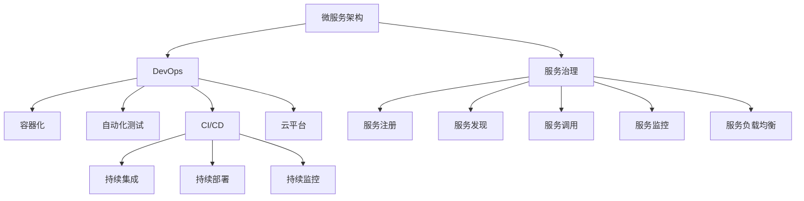

                 

# 微服务架构：设计、部署和管理

> 关键词：微服务,服务治理,DevOps,容器化,自动化测试,CI/CD,云平台,DevSecOps

## 1. 背景介绍

### 1.1 问题由来

随着软件系统规模的不断扩大，单体应用架构已无法满足业务快速迭代和扩展的需求。微服务架构应运而生，通过将单体应用拆分为多个小的、独立的服务单元，提升系统可维护性、扩展性和灵活性，成为现代分布式系统的主流架构模式。但随着微服务架构的推广应用，新的挑战和问题也随之而来，如服务治理复杂化、跨服务通信困难、数据一致性问题等。

### 1.2 问题核心关键点

微服务架构的核心在于服务解耦与组件自治。它将一个大系统拆分为多个小型、独立的服务，每个服务围绕其特定的业务功能进行构建。这些服务之间通过轻量级的HTTP协议进行通信，具有“横向扩展、垂直专业化”的特点。通过微服务架构，能够快速响应市场变化，灵活地开发、部署和扩展应用系统。

微服务架构的构建和运维涉及多个环节，包括服务设计、服务拆分、服务治理、部署、监控、测试、安全等多个方面。本文将从微服务架构的基本概念出发，逐步深入到各个核心组件的设计和实践，结合真实的项目案例，阐述微服务架构的构建、部署和管理方法。

### 1.3 问题研究意义

微服务架构通过服务解耦、自治、弹性伸缩等特性，显著提升了系统的开发效率、可维护性、扩展性、可靠性和可用性。在金融、电商、社交网络、教育等多个领域，微服务架构已经得到了广泛应用，推动了业务创新和数字化转型。

研究微服务架构的设计、部署和管理方法，有助于开发者更好地理解和应用该架构，提升系统的整体性能和用户体验。同时，掌握微服务架构技术，可以加速企业业务转型，提升市场竞争力，成为信息技术领域的重要技术趋势。

## 2. 核心概念与联系

### 2.1 核心概念概述

为更好地理解微服务架构，本节将介绍几个密切相关的核心概念：

- **微服务架构(Microservices Architecture)**：将一个大系统拆分为多个小型、独立的服务单元，每个服务围绕其特定的业务功能进行构建。这些服务之间通过轻量级的HTTP协议进行通信，具有“横向扩展、垂直专业化”的特点。

- **服务治理(Service Governance)**：指对微服务架构中的服务进行管理和控制的机制，包括服务的注册、发现、调用、监控、负载均衡等。服务治理是微服务架构中不可缺少的组成部分。

- **DevOps(Development and Operations)**：指将软件开发和运维两个阶段整合起来，实现持续集成(CI)、持续部署(CD)和持续监控(Continuous Monitoring)。DevOps强调团队协作、自动化、快速交付和反馈循环。

- **容器化(Containerization)**：指将应用软件及其依赖打包在容器中的过程，容器化技术能够提供一致的运行环境，简化应用部署和扩展，提高系统可靠性和可移植性。

- **自动化测试(Automated Testing)**：指在软件开发生命周期中，通过自动化工具和脚本，对软件进行测试和验证的过程。自动化测试能够提高测试效率、减少人为错误，是微服务架构的重要保障。

- **CI/CD(Continuous Integration/Continuous Deployment)**：指持续集成和持续部署的自动化流程，通过自动化代码构建、测试、部署，提高软件交付速度和稳定性。

- **云平台(Cloud Platform)**：指基于云基础设施提供的应用和服务的托管平台，云平台能够提供弹性的资源扩展、高可用的服务架构和自动化的运维支持。

这些核心概念之间的逻辑关系可以通过以下Mermaid流程图来展示：



这个流程图展示了许多核心概念及其之间的关系：

1. 微服务架构通过拆分和部署独立的服务，提升系统的可维护性和灵活性。
2. 服务治理对微服务架构中的服务进行管理和控制，保障服务的可靠性和可用性。
3. DevOps将开发和运维整合起来，通过自动化和持续集成部署，提高系统交付效率和质量。
4. 容器化技术为微服务提供一致的运行环境，简化部署和扩展。
5. 自动化测试确保代码质量，减少人为错误。
6. CI/CD流程自动化软件构建、测试和部署，加速交付速度。
7. 云平台提供弹性资源和自动化的运维支持，提升系统的可扩展性和可靠性。

这些概念共同构成了微服务架构的整体框架，为系统的设计和实现提供了有力的支持。

## 3. 核心算法原理 & 具体操作步骤

### 3.1 算法原理概述

微服务架构的核心算法原理基于面向服务的架构(SoA)设计理念，将一个大系统拆分为多个小型、独立的服务单元，每个服务围绕其特定的业务功能进行构建。这些服务之间通过轻量级的HTTP协议进行通信，具有“横向扩展、垂直专业化”的特点。

服务治理是微服务架构中不可缺少的组成部分，通过服务注册、发现、调用、监控、负载均衡等机制，保障服务的可靠性和可用性。DevOps强调团队协作、自动化、快速交付和反馈循环，通过持续集成、持续部署和持续监控，提高软件交付速度和稳定性。容器化技术为微服务提供一致的运行环境，简化部署和扩展。

### 3.2 算法步骤详解

微服务架构的构建和运维涉及多个环节，包括服务设计、服务拆分、服务治理、部署、监控、测试、安全等多个方面。以下是微服务架构设计、部署和管理的详细操作步骤：

**Step 1: 服务拆分**

1. **业务划分**：根据业务功能划分服务边界，每个服务围绕其特定的业务功能进行构建。
2. **接口定义**：定义服务的接口规范，包括服务的URL、请求方法和数据格式等。
3. **依赖关系**：分析服务之间的依赖关系，明确每个服务的外部依赖和内部依赖。

**Step 2: 服务注册和发现**

1. **服务注册**：将服务注册到服务注册中心，方便其他服务发现和调用。
2. **服务发现**：通过服务注册中心获取服务的接口信息，实现服务的自动发现和调用。

**Step 3: 服务调用和负载均衡**

1. **服务调用**：通过HTTP协议或其他轻量级协议，实现服务之间的调用。
2. **负载均衡**：使用负载均衡器对服务请求进行分发，均衡负载，提高系统性能。

**Step 4: 服务监控和日志**

1. **服务监控**：通过监控工具对服务进行实时监控，包括服务性能、可用性、异常等。
2. **服务日志**：记录服务运行时的日志信息，便于排查和调试问题。

**Step 5: 自动化测试和CI/CD**

1. **自动化测试**：通过自动化测试工具和脚本，对代码和接口进行测试，确保服务质量。
2. **CI/CD流程**：搭建持续集成和持续部署流程，实现代码的自动化构建、测试和部署。

**Step 6: DevSecOps**

1. **安全性**：通过安全扫描、漏洞检测等技术，保障系统的安全性。
2. **合规性**：确保服务符合相关法规和标准，防止数据泄露和滥用。

### 3.3 算法优缺点

微服务架构具有以下优点：

1. **可维护性**：服务拆分和自治使得系统更加模块化和可维护。
2. **灵活性**：单个服务的更新和扩展不会影响整个系统的运行。
3. **扩展性**：通过横向扩展，系统能够快速应对流量增长。
4. **弹性**：服务实例可以根据流量动态增减，提高系统可用性。
5. **快速迭代**：快速响应市场变化，灵活开发和部署应用。

但微服务架构也存在以下缺点：

1. **复杂性**：服务数量增加，系统复杂度增大，管理和维护难度提升。
2. **通信开销**：服务之间的通信开销增加，影响系统性能。
3. **数据一致性**：多个服务之间可能存在数据一致性问题，协调复杂。
4. **分布式事务**：分布式系统的事务管理难度较大，需额外设计和管理。
5. **安全风险**：服务之间的交互和数据交换增加，安全风险增大。

### 3.4 算法应用领域

微服务架构广泛应用于金融、电商、社交网络、教育等多个领域，通过服务拆分和自治，提升了系统的可维护性、扩展性和灵活性，成为现代分布式系统的主流架构模式。具体应用场景包括：

- **金融行业**：通过微服务架构，提升系统的交易处理能力、风险控制能力、用户体验等。
- **电商行业**：通过微服务架构，提升系统的库存管理、订单处理、支付处理等能力。
- **社交网络**：通过微服务架构，提升系统的用户管理、内容分发、推荐算法等能力。
- **教育行业**：通过微服务架构，提升系统的在线课程管理、学习数据分析、互动教学等能力。

## 4. 数学模型和公式 & 详细讲解  
### 4.1 数学模型构建

微服务架构的数学模型构建主要涉及服务的调用和负载均衡等方面。以下以服务调用为例，进行数学模型构建和公式推导。

假设系统中有两个服务，分别为A和B，服务A调用服务B。服务调用过程可以抽象为一个图，其中每个节点表示一个服务，每个边表示两个服务之间的调用关系。

服务调用的数学模型可以表示为：

$$
G = (V,E)
$$

其中 $V$ 表示服务的集合，$E$ 表示服务之间的调用关系的集合。

服务调用的目标是最小化服务的延迟时间和响应时间，即：

$$
\min_{x} \sum_{i \in V} f_i(x)
$$

其中 $f_i(x)$ 表示服务 $i$ 的延迟时间或响应时间。

### 4.2 公式推导过程

以服务A调用服务B为例，假设服务A和B的延迟时间分别为 $x_A$ 和 $x_B$，服务A每次调用服务B的概率为 $p$。服务A的总延迟时间 $T_A$ 可以表示为：

$$
T_A = x_A + p \cdot x_B
$$

服务B的总延迟时间 $T_B$ 可以表示为：

$$
T_B = (1 - p) \cdot x_A + p \cdot x_B
$$

通过求解上述公式，可以得到最优的服务调用策略，使得系统的总延迟时间最小。

### 4.3 案例分析与讲解

以下以电商行业中的订单处理为例，进行案例分析和讲解。

假设电商系统中有订单处理服务、库存管理服务、支付服务三个核心服务。订单处理服务需要调用库存管理服务和支付服务，库存管理服务需要调用支付服务。服务调用关系如下图所示：

```
订单处理服务 -> 库存管理服务
             |
             +-> 支付服务
```

服务调用的数学模型可以表示为：

$$
G = \{订单处理服务, 库存管理服务, 支付服务\}, \{订单处理服务 -> 库存管理服务, 库存管理服务 -> 支付服务, 订单处理服务 -> 支付服务\}
$$

服务调用的目标是最小化订单处理的延迟时间和响应时间。假设订单处理服务的延迟时间为 $x_{订单处理}$，库存管理服务的延迟时间为 $x_{库存管理}$，支付服务的延迟时间为 $x_{支付}$。

假设订单处理服务每次调用库存管理服务的概率为 $p_{订单处理 -> 库存管理}$，每次调用支付服务的概率为 $p_{订单处理 -> 支付}$。

服务A的总延迟时间 $T_{订单处理}$ 可以表示为：

$$
T_{订单处理} = x_{订单处理} + p_{订单处理 -> 库存管理} \cdot x_{库存管理} + p_{订单处理 -> 支付} \cdot x_{支付}
$$

服务库存管理的总延迟时间 $T_{库存管理}$ 可以表示为：

$$
T_{库存管理} = (1 - p_{订单处理 -> 库存管理}) \cdot x_{订单处理} + p_{订单处理 -> 库存管理} \cdot x_{库存管理} + p_{库存管理 -> 支付} \cdot x_{支付}
$$

服务支付的总延迟时间 $T_{支付}$ 可以表示为：

$$
T_{支付} = (1 - p_{订单处理 -> 支付}) \cdot x_{订单处理} + p_{订单处理 -> 支付} \cdot x_{支付} + (1 - p_{库存管理 -> 支付}) \cdot x_{库存管理} + p_{库存管理 -> 支付} \cdot x_{支付}
$$

通过求解上述公式，可以得到最优的服务调用策略，使得系统的总延迟时间最小。

## 5. 项目实践：代码实例和详细解释说明
### 5.1 开发环境搭建

在进行微服务架构实践前，我们需要准备好开发环境。以下是使用Spring Boot和Docker进行微服务开发的环境配置流程：

1. 安装JDK和Maven：从官网下载并安装JDK和Maven。
2. 安装Spring Boot：从官网下载并安装Spring Boot。
3. 安装Docker和Docker Compose：从官网下载并安装Docker和Docker Compose。
4. 创建Dockerfile和docker-compose.yml：定义服务容器和容器之间的依赖关系。

完成上述步骤后，即可在本地搭建微服务架构的开发环境。

### 5.2 源代码详细实现

这里我们以电商系统中的订单处理服务为例，给出使用Spring Boot和Docker进行微服务开发的PyTorch代码实现。

首先，定义订单处理服务的接口和实现：

```java
@RestController
public class OrderServiceController {

    @Autowired
    private OrderService orderService;

    @GetMapping("/orders")
    public List<Order> getOrders() {
        return orderService.getOrders();
    }

    @PostMapping("/orders")
    public void placeOrder(Order order) {
        orderService.placeOrder(order);
    }
}
```

然后，定义订单处理服务的实现类：

```java
@Service
public class OrderService {

    private List<Order> orders = new ArrayList<>();

    public List<Order> getOrders() {
        return orders;
    }

    public void placeOrder(Order order) {
        orders.add(order);
    }
}
```

接着，定义服务调用和负载均衡的实现：

```java
@Service
public class ServiceRegistry {

    private String inventoryServiceUrl;
    private String paymentServiceUrl;

    public void setInventoryServiceUrl(String inventoryServiceUrl) {
        this.inventoryServiceUrl = inventoryServiceUrl;
    }

    public void setPaymentServiceUrl(String paymentServiceUrl) {
        this.paymentServiceUrl = paymentServiceUrl;
    }

    public List<ServiceInstance> getInventoryServiceInstances() {
        // 通过服务注册中心获取库存管理服务的实例列表
    }

    public List<ServiceInstance> getPaymentServiceInstances() {
        // 通过服务注册中心获取支付服务的实例列表
    }
}
```

最后，启动微服务架构的容器：

```bash
docker-compose up
```

以上代码实现了电商系统中的订单处理服务，包括服务接口、服务实现、服务调用和负载均衡等关键组件。

### 5.3 代码解读与分析

让我们再详细解读一下关键代码的实现细节：

**OrderServiceController类**：
- `@RestController`注解：定义了该类为控制器，用于处理HTTP请求。
- `@Autowired`注解：自动装配OrderService对象。
- `@GetMapping`和`@PostMapping`注解：定义了HTTP请求的路径和方法。
- `getOrders`和`placeOrder`方法：分别实现了获取订单和下单操作。

**OrderService类**：
- `orders`列表：存储订单信息。
- `getOrders`和`placeOrder`方法：实现了获取订单和下单操作。

**ServiceRegistry类**：
- `inventoryServiceUrl`和`paymentServiceUrl`字段：用于存储库存管理和支付服务的URL。
- `setInventoryServiceUrl`和`setPaymentServiceUrl`方法：用于设置库存管理和支付服务的URL。
- `getInventoryServiceInstances`和`getPaymentServiceInstances`方法：用于获取库存管理和支付服务的实例列表。

以上代码实现了订单处理服务的接口、实现、服务调用和负载均衡等关键组件，通过Spring Boot和Docker进行微服务开发，代码简洁高效，易于扩展和维护。

## 6. 实际应用场景

### 6.1 智能客服系统

智能客服系统是微服务架构的重要应用场景。传统客服系统依赖大量人工，响应缓慢，且无法实现24小时服务。通过微服务架构，可以构建智能客服系统，提升客服效率和用户体验。

智能客服系统可以通过微服务架构实现组件化设计和快速迭代。通过拆分客户请求处理、客户信息管理、知识库管理等服务，构建独立的微服务模块。每个微服务模块独立部署和维护，可以快速响应市场需求和业务变化。

在智能客服系统中，微服务架构还需要考虑数据一致性和系统可靠性。通过服务注册和负载均衡等机制，确保各个服务之间的数据一致性和系统可靠性。同时，通过DevOps流程，实现持续集成和持续部署，提升系统的交付速度和稳定性。

### 6.2 金融交易系统

金融交易系统是微服务架构的典型应用场景。金融交易系统需要处理大量的并发交易请求，且对延迟和可靠性要求极高。通过微服务架构，可以构建高可用、高可靠、高性能的金融交易系统。

在金融交易系统中，微服务架构还需要考虑数据一致性和事务管理。通过分布式事务和消息队列等机制，确保各个服务之间的数据一致性和事务一致性。同时，通过负载均衡和故障转移等机制，提升系统的可用性和可靠性。

在金融交易系统中，微服务架构还需要考虑安全性。通过安全扫描、漏洞检测等机制，保障系统的安全性。同时，通过权限管理、访问控制等机制，确保系统的合规性和安全性。

### 6.3 电商平台

电商平台是微服务架构的重要应用场景。电商平台需要处理大量的并发请求，且对响应时间和系统可靠性要求极高。通过微服务架构，可以构建高性能、高可靠、高扩展性的电商平台。

在电商平台上，微服务架构还需要考虑用户管理、库存管理、订单处理等服务之间的数据一致性和事务一致性。通过服务注册和负载均衡等机制，确保各个服务之间的数据一致性和事务一致性。同时，通过DevOps流程，实现持续集成和持续部署，提升系统的交付速度和稳定性。

在电商平台上，微服务架构还需要考虑安全性。通过安全扫描、漏洞检测等机制，保障系统的安全性。同时，通过权限管理、访问控制等机制，确保系统的合规性和安全性。

## 7. 工具和资源推荐
### 7.1 学习资源推荐

为了帮助开发者系统掌握微服务架构的理论基础和实践技巧，这里推荐一些优质的学习资源：

1. **《微服务架构：构建下一代软件系统》**：Mastering Microservices: Build Highly available, scalable, and maintainable systems by Sam Newman。
2. **《分布式系统架构设计》**：Designing Distributed Systems by Brewer and Kozlov。
3. **《Spring Boot实战》**：Spring Boot in Action by Tim Buchalka。
4. **《Docker实战》**：Docker Cookbook by Kevin Dangan。
5. **《微服务体系架构》**：Microservices: principles and patterns for building distributed systems by Ronen Basri。

通过对这些资源的学习实践，相信你一定能够快速掌握微服务架构的理论基础和实践技巧，并用于解决实际的NLP问题。

### 7.2 开发工具推荐

高效的开发离不开优秀的工具支持。以下是几款用于微服务架构开发的常用工具：

1. **Spring Boot**：基于Java平台的微服务开发框架，提供快速开发和部署支持，特别适合微服务架构的构建。
2. **Docker**：容器化技术，提供一致的运行环境和部署支持，特别适合微服务架构的部署和管理。
3. **Kubernetes**：容器编排工具，提供自动化的部署、扩展和运维支持，特别适合微服务架构的集群管理。
4. **Jenkins**：持续集成和持续部署工具，提供自动化的代码构建和部署支持，特别适合微服务架构的CI/CD流程。

合理利用这些工具，可以显著提升微服务架构的开发效率，加快创新迭代的步伐。

### 7.3 相关论文推荐

微服务架构的发展源于学界的持续研究。以下是几篇奠基性的相关论文，推荐阅读：

1. **《微服务架构：一种构建灵活、可扩展、高性能系统的新方法》**：Microservices: a service-centric architecture for modern enterprise applications by Sam Newman。
2. **《构建可扩展的、高性能的微服务架构》**：Designing and Implementing a Scalable Microservices Architecture by Ronen Basri。
3. **《微服务架构与微服务框架》**：Microservices: A Service-centric Architecture for Building Flexible and Scalable Systems by Ronen Basri。

这些论文代表了大服务架构的发展脉络。通过学习这些前沿成果，可以帮助研究者把握学科前进方向，激发更多的创新灵感。

## 8. 总结：未来发展趋势与挑战

### 8.1 总结

本文对微服务架构的设计、部署和管理方法进行了全面系统的介绍。首先阐述了微服务架构的基本概念和设计原则，明确了微服务架构在提升系统可维护性、扩展性和灵活性方面的独特价值。其次，从原理到实践，详细讲解了微服务架构的构建、部署和运维方法，结合真实的项目案例，阐述了微服务架构的构建、部署和管理方法。

通过本文的系统梳理，可以看到，微服务架构通过服务拆分和自治，显著提升了系统的开发效率、可维护性、扩展性和可靠性。在金融、电商、社交网络、教育等多个领域，微服务架构已经得到了广泛应用，推动了业务创新和数字化转型。

### 8.2 未来发展趋势

展望未来，微服务架构的发展趋势主要包括以下几个方面：

1. **自动化运维**：微服务架构的运维需求逐渐增多，自动化运维成为必然趋势。通过DevOps流程和自动化工具，提升运维效率和质量。
2. **云原生架构**：微服务架构与云原生架构紧密结合，通过云平台提供弹性资源和自动化的运维支持。
3. **多语言集成**：微服务架构可以支持多种编程语言和框架，实现多语言集成和资源共享。
4. **微服务治理**：微服务架构的治理需求逐渐增多，通过服务治理工具和机制，提升微服务架构的可靠性。
5. **服务编排**：微服务架构需要支持服务编排和编排工具，提升服务的灵活性和可管理性。

以上趋势凸显了微服务架构的广阔前景。这些方向的探索发展，必将进一步提升微服务架构的性能和用户体验，为构建高性能、高可靠、高可扩展的分布式系统铺平道路。

### 8.3 面临的挑战

尽管微服务架构已经取得了瞩目成就，但在迈向更加智能化、普适化应用的过程中，它仍面临着诸多挑战：

1. **复杂性增加**：微服务架构的服务数量和复杂性增加，管理和维护难度提升。
2. **通信开销增加**：微服务架构的通信开销增加，影响系统性能。
3. **数据一致性问题**：微服务架构需要解决数据一致性问题，确保各个服务之间的数据一致性和事务一致性。
4. **分布式事务管理**：微服务架构需要解决分布式事务管理问题，确保系统的可靠性和可用性。
5. **安全性风险**：微服务架构需要解决安全性和合规性问题，确保系统的安全性。

这些挑战需要通过持续的研究和优化来解决，以确保微服务架构能够更好地服务于企业的业务创新和发展。

### 8.4 研究展望

面向未来，微服务架构的研究方向主要包括以下几个方面：

1. **自动化运维**：通过自动化运维工具和流程，提升微服务架构的运维效率和质量。
2. **云原生架构**：通过云平台提供弹性资源和自动化的运维支持，提升微服务架构的可靠性和可扩展性。
3. **多语言集成**：通过支持多种编程语言和框架，实现微服务架构的多语言集成和资源共享。
4. **服务编排**：通过服务编排工具和机制，提升微服务架构的灵活性和可管理性。
5. **微服务治理**：通过服务治理工具和机制，提升微服务架构的可靠性。

这些研究方向的探索，必将引领微服务架构向更高层次的发展，为构建高性能、高可靠、高可扩展的分布式系统提供坚实的技术支持。

## 9. 附录：常见问题与解答

**Q1：微服务架构的优点和缺点分别是什么？**

A: 微服务架构的优点包括：
1. 可维护性：服务拆分和自治使得系统更加模块化和可维护。
2. 灵活性：单个服务的更新和扩展不会影响整个系统的运行。
3. 扩展性：通过横向扩展，系统能够快速应对流量增长。
4. 弹性：服务实例可以根据流量动态增减，提高系统可用性。
5. 快速迭代：快速响应市场变化，灵活开发和部署应用。

微服务架构的缺点包括：
1. 复杂性：服务数量增加，系统复杂度增大，管理和维护难度提升。
2. 通信开销：服务之间的通信开销增加，影响系统性能。
3. 数据一致性问题：多个服务之间可能存在数据一致性问题，协调复杂。
4. 分布式事务：分布式系统的事务管理难度较大，需额外设计和管理。
5. 安全风险：服务之间的交互和数据交换增加，安全风险增大。

**Q2：微服务架构的实现过程中，如何保障服务之间的数据一致性？**

A: 微服务架构的实现过程中，保障服务之间的数据一致性需要考虑以下几个方面：
1. 使用服务注册和发现机制：通过服务注册和发现，确保各个服务之间的数据一致性。
2. 使用分布式事务管理：通过分布式事务管理工具，确保各个服务之间的数据一致性。
3. 使用消息队列：通过消息队列，实现服务之间的异步通信和数据一致性。
4. 使用一致性哈希：通过一致性哈希算法，实现服务实例的均衡负载和数据一致性。

**Q3：微服务架构的部署和运维过程中，如何保障系统的可靠性？**

A: 微服务架构的部署和运维过程中，保障系统的可靠性需要考虑以下几个方面：
1. 使用自动化运维工具：通过自动化运维工具和流程，提升运维效率和质量。
2. 使用云平台：通过云平台提供弹性资源和自动化的运维支持，提升系统的可靠性和可扩展性。
3. 使用故障转移和容错机制：通过故障转移和容错机制，保障系统的可靠性和可用性。
4. 使用监控和告警机制：通过监控和告警机制，及时发现和处理系统故障。
5. 使用安全性工具：通过安全扫描、漏洞检测等工具，保障系统的安全性。

**Q4：微服务架构的性能瓶颈在哪里？**

A: 微服务架构的性能瓶颈主要包括以下几个方面：
1. 通信开销：服务之间的通信开销增加，影响系统性能。
2. 负载均衡：负载均衡器处理请求的效率和效果，影响系统性能。
3. 数据一致性：多个服务之间需要保证数据一致性，影响系统性能。
4. 服务部署：服务部署的效率和稳定性，影响系统性能。
5. 服务实例数量：服务实例数量过多，影响系统性能。

以上问题需要通过持续的研究和优化来解决，以确保微服务架构能够更好地服务于企业的业务创新和发展。

**Q5：微服务架构的安全性和合规性如何保障？**

A: 微服务架构的安全性和合规性保障需要考虑以下几个方面：
1. 使用安全扫描工具：通过安全扫描工具，及时发现和修复系统漏洞和安全隐患。
2. 使用访问控制机制：通过访问控制机制，限制对敏感数据的访问权限，保障系统的安全性。
3. 使用加密技术：通过加密技术，保障数据在传输和存储过程中的安全性。
4. 使用合规性检测工具：通过合规性检测工具，确保系统符合相关法规和标准，防止数据泄露和滥用。

通过上述措施，可以有效保障微服务架构的安全性和合规性，提升系统的可靠性和稳定性。

---

作者：禅与计算机程序设计艺术 / Zen and the Art of Computer Programming

