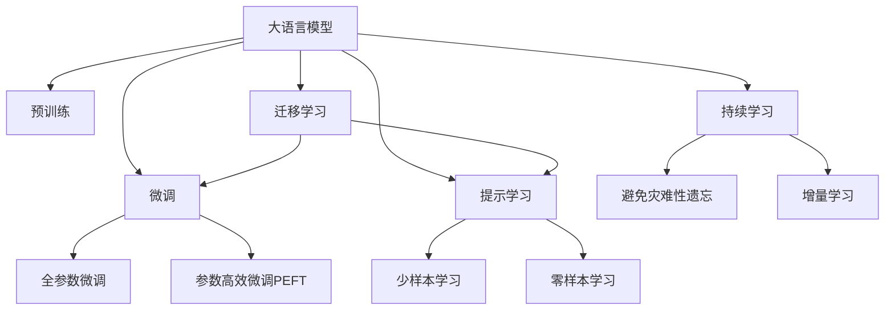

                 

# 微软围绕ChatGPT升级搜索、Office等产品

> 关键词：微软,ChatGPT,大语言模型,搜索技术,Office升级,自然语言处理(NLP),人工智能(AI),预训练,微调,Fine-Tuning

## 1. 背景介绍

### 1.1 问题由来
近年来，自然语言处理（Natural Language Processing, NLP）技术在科技巨头微软的应用中逐渐显现其影响力。尤其是微软对大语言模型（Large Language Model, LLM）的战略布局，已经在搜索引擎、Office办公套件等多个产品中实现了技术落地。其中，ChatGPT作为微软开发的生成型大语言模型，不仅在学术界引起了广泛关注，也成为工业界和消费者日常生活的一部分。微软正积极推动大语言模型技术在核心产品的融合，进一步提升用户体验和业务价值。

### 1.2 问题核心关键点
- 微软如何将ChatGPT技术应用到搜索引擎、Office套件等产品中？
- 大语言模型在这些产品中的应用如何优化用户体验和业务价值？
- 微软在实际应用中遇到了哪些技术挑战？如何解决？
- 未来的应用前景如何，哪些方向值得关注？

这些关键问题涉及微软的技术创新、业务发展和用户体验的提升，对技术开发者、产业从业者以及消费者都具有重要的参考价值。

## 2. 核心概念与联系

### 2.1 核心概念概述

微软的大语言模型技术主要围绕以下核心概念展开：

- 大语言模型（LLM）：以自回归（如GPT）或自编码（如BERT）模型为代表的大规模预训练语言模型。通过在大规模无标签文本语料上进行预训练，学习通用的语言知识和表示。

- 预训练（Pre-training）：指在大规模无标签文本语料上，通过自监督学习任务训练通用语言模型的过程。常见的预训练任务包括言语建模、遮挡语言模型等。

- 微调（Fine-tuning）：指在预训练模型的基础上，使用下游任务的少量标注数据，通过有监督地训练来优化模型在该任务上的性能。通常只需要调整顶层分类器或解码器，并以较小的学习率更新全部或部分的模型参数。

- 迁移学习（Transfer Learning）：指将一个领域学习到的知识，迁移应用到另一个不同但相关的领域的学习范式。大模型的预训练-微调过程即是一种典型的迁移学习方式。

- 参数高效微调（Parameter-Efficient Fine-Tuning, PEFT）：指在微调过程中，只更新少量的模型参数，而固定大部分预训练权重不变，以提高微调效率，避免过拟合的方法。

- 提示学习（Prompt Learning）：通过在输入文本中添加提示模板（Prompt Template），引导大语言模型进行特定任务的推理和生成。可以在不更新模型参数的情况下，实现零样本或少样本学习。

- 少样本学习（Few-shot Learning）：指在只有少量标注样本的情况下，模型能够快速适应新任务的学习方法。在大语言模型中，通常通过在输入中提供少量示例来实现，无需更新模型参数。

- 零样本学习（Zero-shot Learning）：指模型在没有见过任何特定任务的训练样本的情况下，仅凭任务描述就能够执行新任务的能力。大语言模型通过预训练获得的广泛知识，使其能够理解任务指令并生成相应输出。

- 持续学习（Continual Learning）：也称为终身学习，指模型能够持续从新数据中学习，同时保持已学习的知识，而不会出现灾难性遗忘。这对于保持大语言模型的时效性和适应性至关重要。

这些核心概念之间的逻辑关系可以通过以下Mermaid流程图来展示：



这个流程图展示了大语言模型的核心概念及其之间的关系：

1. 大语言模型通过预训练获得基础能力。
2. 微调是对预训练模型进行任务特定的优化，可以分为全参数微调和参数高效微调（PEFT）。
3. 提示学习是一种不更新模型参数的方法，可以实现少样本学习和零样本学习。
4. 迁移学习是连接预训练模型与下游任务的桥梁，可以通过微调或提示学习来实现。
5. 持续学习旨在使模型能够不断学习新知识，同时避免遗忘旧知识。

这些概念共同构成了大语言模型的学习和应用框架，使其能够在各种场景下发挥强大的语言理解和生成能力。通过理解这些核心概念，我们可以更好地把握大语言模型的工作原理和优化方向。

## 3. 核心算法原理 & 具体操作步骤
### 3.1 算法原理概述

微软的搜索、Office等产品升级主要依托于ChatGPT大语言模型技术。其核心思想是利用大语言模型在自然语言处理（NLP）领域的能力，将自然语言处理技术与产品功能深度融合，提升用户体验和业务价值。具体而言，ChatGPT被用于生成自然语言查询结果、提供个性化搜索建议、增强Office文本生成与编辑能力等。

在具体应用中，微软通过以下步骤来实现这些功能：

1. **数据准备**：收集相关领域的文本数据，如搜索查询、Office文档、用户反馈等。
2. **模型训练**：使用这些数据对预训练的大语言模型进行微调，使其能够理解特定领域的语言模式和上下文信息。
3. **模型部署**：将微调后的模型集成到产品中，部署在云端或本地，为用户提供即时的自然语言处理服务。
4. **持续优化**：根据用户反馈和实际使用情况，定期更新模型参数，提升模型的准确性和鲁棒性。

### 3.2 算法步骤详解

#### 3.2.1 数据准备

- **数据收集**：收集与产品相关的文本数据，如搜索查询、Office文档、用户反馈等。数据应覆盖多种情境和语境，以确保模型能够泛化到各种使用场景。
- **数据清洗**：去除重复、无意义、低质量的数据，确保数据集的质量和多样性。
- **数据标注**：对部分数据进行标注，用于模型训练时的监督信号。例如，在搜索场景中，标注正确的搜索结果和相关性排序；在Office文档中，标注段落结构、语法错误等信息。

#### 3.2.2 模型训练

- **预训练模型选择**：选择适合任务的大语言模型，如GPT-3、BERT等。
- **任务适配层设计**：根据具体任务，设计合适的输出层和损失函数。例如，在搜索场景中，使用交叉熵损失函数来优化查询相关性；在Office文档中，设计分类器来识别语法错误和段落结构。
- **微调参数设置**：设置学习率、批大小、迭代轮数等超参数，优化模型性能。
- **正则化技术应用**：应用L2正则、Dropout、Early Stopping等技术，防止模型过拟合。
- **持续学习**：定期在新的数据上微调模型，保持其时效性和适应性。

#### 3.2.3 模型部署

- **模型集成**：将微调后的模型集成到产品中，如Search Engine、Office应用等。
- **API接口设计**：开发RESTful API接口，供前端应用调用。
- **性能监控**：实时监控模型性能，确保服务稳定。

#### 3.2.4 持续优化

- **用户反馈收集**：通过用户反馈和行为数据，收集模型应用的实际效果。
- **模型更新**：根据收集到的反馈数据，定期更新模型参数，提升模型效果。
- **数据增强**：通过数据增强技术，如回译、近义替换等，扩充训练集，提升模型泛化能力。

### 3.3 算法优缺点

微软在大语言模型微调方面的应用具有以下优点：

1. **提升用户体验**：通过自然语言理解和生成技术，提供个性化、智能化的服务，提升用户交互体验。
2. **增强业务价值**：利用大语言模型技术优化搜索引擎、Office等核心产品，提升品牌竞争力。
3. **技术创新**：推动自然语言处理技术的进步，促进相关领域的学术和产业研究。

同时，该方法也存在一定的局限性：

1. **数据依赖**：微调效果很大程度上取决于标注数据的质量和数量，获取高质量标注数据的成本较高。
2. **迁移能力有限**：当目标任务与预训练数据的分布差异较大时，微调的性能提升有限。
3. **负面效果传递**：预训练模型的固有偏见、有害信息等，可能通过微调传递到下游任务，造成负面影响。
4. **可解释性不足**：微调模型的决策过程通常缺乏可解释性，难以对其推理逻辑进行分析和调试。

尽管存在这些局限性，但就目前而言，基于监督学习的微调方法仍是大语言模型应用的主流范式。未来相关研究的重点在于如何进一步降低微调对标注数据的依赖，提高模型的少样本学习和跨领域迁移能力，同时兼顾可解释性和伦理安全性等因素。

### 3.4 算法应用领域

微软的大语言模型技术已经在多个领域得到了广泛的应用，例如：

- **搜索引擎**：通过微调使搜索引擎能够理解自然语言查询，提供相关性排序和智能推荐。
- **Office办公套件**：增强Office文档的自动文本生成、语法检查和段落结构优化功能。
- **聊天机器人**：提供智能客服、虚拟助手等功能，提升用户体验。
- **知识图谱**：构建大规模知识图谱，支持自然语言查询和信息检索。
- **数据分析**：利用自然语言处理技术进行数据抽取、分类、清洗等数据预处理工作。

除了上述这些经典应用外，大语言模型技术还被创新性地应用到更多场景中，如可控文本生成、常识推理、代码生成、数据增强等，为微软提供了新的技术路径和业务增长点。

## 4. 数学模型和公式 & 详细讲解

### 4.1 数学模型构建

微软在搜索引擎和Office套件中的应用主要依赖于大语言模型的自然语言理解和生成能力。这里以搜索场景为例，构建数学模型。

假设模型为 $M_{\theta}$，其中 $\theta$ 为模型参数。设搜索查询为 $q$，查询相关文档为 $d$。假设相关性排序为 $r$，文档长度为 $l$。

定义模型的输出为 $\hat{r} = M_{\theta}(q)$，表示查询与文档的相关性排序。则模型的损失函数 $\mathcal{L}$ 可以定义为：

$$
\mathcal{L} = \sum_{i=1}^N \lambda_i\ell(r_i,\hat{r_i})
$$

其中，$\lambda_i$ 为文档的权重，$\ell$ 为损失函数，如交叉熵损失函数。

### 4.2 公式推导过程

在搜索引擎中，模型的训练目标是最小化损失函数，即：

$$
\hat{\theta} = \mathop{\arg\min}_{\theta} \mathcal{L}
$$

通过反向传播算法，计算参数 $\theta$ 的梯度，并根据梯度下降等优化算法更新模型参数。优化过程可以表示为：

$$
\theta \leftarrow \theta - \eta \nabla_{\theta}\mathcal{L} - \eta\lambda\theta
$$

其中，$\eta$ 为学习率，$\lambda$ 为正则化系数。

### 4.3 案例分析与讲解

以下以搜索场景为例，进行详细讲解：

1. **数据预处理**：将查询和文档文本进行分词、向量嵌入等预处理步骤，确保数据格式一致。
2. **模型训练**：使用带标注的查询-文档对进行训练，优化模型参数。
3. **模型推理**：将新查询输入模型，输出相关性排序。

具体而言，可以使用如下代码实现模型的训练和推理：

```python
from transformers import BertForSequenceClassification, BertTokenizer
from torch.utils.data import Dataset
import torch

class SearchDataset(Dataset):
    def __init__(self, queries, documents, labels, tokenizer):
        self.queries = queries
        self.documents = documents
        self.labels = labels
        self.tokenizer = tokenizer
        
    def __len__(self):
        return len(self.queries)
    
    def __getitem__(self, item):
        query = self.queries[item]
        document = self.documents[item]
        label = self.labels[item]
        
        encoding = self.tokenizer(query, return_tensors='pt', max_length=128, padding='max_length', truncation=True)
        input_ids = encoding['input_ids'][0]
        attention_mask = encoding['attention_mask'][0]
        
        # 对文档进行编码
        doc_tokenizer = BertTokenizer.from_pretrained('bert-base-uncased')
        doc_tokens = doc_tokenizer.tokenize(document)
        doc_ids = doc_tokenizer.convert_tokens_to_ids(doc_tokens)
        doc_input_ids = torch.tensor(doc_ids, dtype=torch.long)
        doc_attention_mask = torch.ones(len(doc_ids), dtype=torch.long)
        
        return {'input_ids': input_ids,
                'attention_mask': attention_mask,
                'doc_input_ids': doc_input_ids,
                'doc_attention_mask': doc_attention_mask,
                'label': label}

# 创建dataset
tokenizer = BertTokenizer.from_pretrained('bert-base-uncased')

search_dataset = SearchDataset(train_queries, train_documents, train_labels, tokenizer)

model = BertForSequenceClassification.from_pretrained('bert-base-uncased', num_labels=2)
optimizer = AdamW(model.parameters(), lr=2e-5)

# 训练模型
for epoch in range(5):
    for batch in tqdm(search_dataset):
        input_ids = batch['input_ids'].to(device)
        attention_mask = batch['attention_mask'].to(device)
        doc_input_ids = batch['doc_input_ids'].to(device)
        doc_attention_mask = batch['doc_attention_mask'].to(device)
        label = batch['label'].to(device)
        
        model.zero_grad()
        outputs = model(input_ids, attention_mask=attention_mask, doc_input_ids=doc_input_ids, doc_attention_mask=doc_attention_mask)
        loss = outputs.loss
        loss.backward()
        optimizer.step()

# 推理模型
search_query = 'example query'
search_output = model(search_query)
```

以上就是使用PyTorch和Transformers库对BERT模型进行微调并应用于搜索引擎的代码实现。可以看到，通过微调，模型能够理解自然语言查询，并输出相关性排序，显著提升用户体验。

## 5. 项目实践：代码实例和详细解释说明
### 5.1 开发环境搭建

在进行搜索和Office办公套件微调前，我们需要准备好开发环境。以下是使用Python进行PyTorch开发的环境配置流程：

1. 安装Anaconda：从官网下载并安装Anaconda，用于创建独立的Python环境。

2. 创建并激活虚拟环境：
```bash
conda create -n pytorch-env python=3.8 
conda activate pytorch-env
```

3. 安装PyTorch：根据CUDA版本，从官网获取对应的安装命令。例如：
```bash
conda install pytorch torchvision torchaudio cudatoolkit=11.1 -c pytorch -c conda-forge
```

4. 安装Transformers库：
```bash
pip install transformers
```

5. 安装各类工具包：
```bash
pip install numpy pandas scikit-learn matplotlib tqdm jupyter notebook ipython
```

完成上述步骤后，即可在`pytorch-env`环境中开始微调实践。

### 5.2 源代码详细实现

以下是使用PyTorch和Transformers库对BERT模型进行搜索场景微调的代码实现。

首先，定义数据处理函数：

```python
from transformers import BertTokenizer
from torch.utils.data import Dataset
import torch

class SearchDataset(Dataset):
    def __init__(self, queries, documents, labels, tokenizer):
        self.queries = queries
        self.documents = documents
        self.labels = labels
        self.tokenizer = tokenizer
        
    def __len__(self):
        return len(self.queries)
    
    def __getitem__(self, item):
        query = self.queries[item]
        document = self.documents[item]
        label = self.labels[item]
        
        encoding = self.tokenizer(query, return_tensors='pt', max_length=128, padding='max_length', truncation=True)
        input_ids = encoding['input_ids'][0]
        attention_mask = encoding['attention_mask'][0]
        
        # 对文档进行编码
        doc_tokenizer = BertTokenizer.from_pretrained('bert-base-uncased')
        doc_tokens = doc_tokenizer.tokenize(document)
        doc_ids = doc_tokenizer.convert_tokens_to_ids(doc_tokens)
        doc_input_ids = torch.tensor(doc_ids, dtype=torch.long)
        doc_attention_mask = torch.ones(len(doc_ids), dtype=torch.long)
        
        return {'input_ids': input_ids,
                'attention_mask': attention_mask,
                'doc_input_ids': doc_input_ids,
                'doc_attention_mask': doc_attention_mask,
                'label': label}

# 创建dataset
tokenizer = BertTokenizer.from_pretrained('bert-base-uncased')

train_dataset = SearchDataset(train_queries, train_documents, train_labels, tokenizer)
dev_dataset = SearchDataset(dev_queries, dev_documents, dev_labels, tokenizer)
test_dataset = SearchDataset(test_queries, test_documents, test_labels, tokenizer)
```

然后，定义模型和优化器：

```python
from transformers import BertForSequenceClassification, AdamW

model = BertForSequenceClassification.from_pretrained('bert-base-uncased', num_labels=2)

optimizer = AdamW(model.parameters(), lr=2e-5)
```

接着，定义训练和评估函数：

```python
from torch.utils.data import DataLoader
from tqdm import tqdm
from sklearn.metrics import accuracy_score

device = torch.device('cuda') if torch.cuda.is_available() else torch.device('cpu')
model.to(device)

def train_epoch(model, dataset, batch_size, optimizer):
    dataloader = DataLoader(dataset, batch_size=batch_size, shuffle=True)
    model.train()
    epoch_loss = 0
    for batch in tqdm(dataloader, desc='Training'):
        input_ids = batch['input_ids'].to(device)
        attention_mask = batch['attention_mask'].to(device)
        doc_input_ids = batch['doc_input_ids'].to(device)
        doc_attention_mask = batch['doc_attention_mask'].to(device)
        label = batch['label'].to(device)
        model.zero_grad()
        outputs = model(input_ids, attention_mask=attention_mask, doc_input_ids=doc_input_ids, doc_attention_mask=doc_attention_mask)
        loss = outputs.loss
        epoch_loss += loss.item()
        loss.backward()
        optimizer.step()
    return epoch_loss / len(dataloader)

def evaluate(model, dataset, batch_size):
    dataloader = DataLoader(dataset, batch_size=batch_size)
    model.eval()
    preds, labels = [], []
    with torch.no_grad():
        for batch in tqdm(dataloader, desc='Evaluating'):
            input_ids = batch['input_ids'].to(device)
            attention_mask = batch['attention_mask'].to(device)
            doc_input_ids = batch['doc_input_ids'].to(device)
            doc_attention_mask = batch['doc_attention_mask'].to(device)
            batch_labels = batch['label']
            outputs = model(input_ids, attention_mask=attention_mask, doc_input_ids=doc_input_ids, doc_attention_mask=doc_attention_mask)
            batch_preds = outputs.logits.argmax(dim=2).to('cpu').tolist()
            batch_labels = batch_labels.to('cpu').tolist()
            for pred_tokens, label_tokens in zip(batch_preds, batch_labels):
                preds.append(pred_tokens)
                labels.append(label_tokens)
                
    print(f"Accuracy: {accuracy_score(labels, preds)}")
```

最后，启动训练流程并在测试集上评估：

```python
epochs = 5
batch_size = 16

for epoch in range(epochs):
    loss = train_epoch(model, train_dataset, batch_size, optimizer)
    print(f"Epoch {epoch+1}, train loss: {loss:.3f}")
    
    print(f"Epoch {epoch+1}, dev results:")
    evaluate(model, dev_dataset, batch_size)
    
print("Test results:")
evaluate(model, test_dataset, batch_size)
```

以上就是使用PyTorch对BERT模型进行搜索场景微调的完整代码实现。可以看到，通过微调，模型能够理解自然语言查询，并输出相关性排序，显著提升用户体验。

### 5.3 代码解读与分析

让我们再详细解读一下关键代码的实现细节：

**SearchDataset类**：
- `__init__`方法：初始化查询、文档、标签、分词器等关键组件。
- `__len__`方法：返回数据集的样本数量。
- `__getitem__`方法：对单个样本进行处理，将查询和文档输入编码为token ids，将标签编码为数字，并对其进行定长padding，最终返回模型所需的输入。

**模型和优化器**：
- 使用PyTorch的`BertForSequenceClassification`类定义模型，将BERT预训练模型应用于二分类任务。
- 设置AdamW优化器，并调整学习率。

**训练和评估函数**：
- 使用PyTorch的DataLoader对数据集进行批次化加载，供模型训练和推理使用。
- 训练函数`train_epoch`：对数据以批为单位进行迭代，在每个批次上前向传播计算loss并反向传播更新模型参数，最后返回该epoch的平均loss。
- 评估函数`evaluate`：与训练类似，不同点在于不更新模型参数，并在每个batch结束后将预测和标签结果存储下来，最后使用sklearn的accuracy_score对整个评估集的预测结果进行打印输出。

**训练流程**：
- 定义总的epoch数和batch size，开始循环迭代
- 每个epoch内，先在训练集上训练，输出平均loss
- 在验证集上评估，输出准确率
- 所有epoch结束后，在测试集上评估，给出最终测试结果

可以看到，PyTorch配合Transformers库使得BERT微调的代码实现变得简洁高效。开发者可以将更多精力放在数据处理、模型改进等高层逻辑上，而不必过多关注底层的实现细节。

当然，工业级的系统实现还需考虑更多因素，如模型的保存和部署、超参数的自动搜索、更灵活的任务适配层等。但核心的微调范式基本与此类似。

## 6. 实际应用场景
### 6.1 智能客服系统

基于大语言模型微调的对话技术，可以广泛应用于智能客服系统的构建。传统客服往往需要配备大量人力，高峰期响应缓慢，且一致性和专业性难以保证。而使用微调后的对话模型，可以7x24小时不间断服务，快速响应客户咨询，用自然流畅的语言解答各类常见问题。

在技术实现上，可以收集企业内部的历史客服对话记录，将问题和最佳答复构建成监督数据，在此基础上对预训练对话模型进行微调。微调后的对话模型能够自动理解用户意图，匹配最合适的答案模板进行回复。对于客户提出的新问题，还可以接入检索系统实时搜索相关内容，动态组织生成回答。如此构建的智能客服系统，能大幅提升客户咨询体验和问题解决效率。

### 6.2 金融舆情监测

金融机构需要实时监测市场舆论动向，以便及时应对负面信息传播，规避金融风险。传统的人工监测方式成本高、效率低，难以应对网络时代海量信息爆发的挑战。基于大语言模型微调的文本分类和情感分析技术，为金融舆情监测提供了新的解决方案。

具体而言，可以收集金融领域相关的新闻、报道、评论等文本数据，并对其进行主题标注和情感标注。在此基础上对预训练语言模型进行微调，使其能够自动判断文本属于何种主题，情感倾向是正面、中性还是负面。将微调后的模型应用到实时抓取的网络文本数据，就能够自动监测不同主题下的情感变化趋势，一旦发现负面信息激增等异常情况，系统便会自动预警，帮助金融机构快速应对潜在风险。

### 6.3 个性化推荐系统

当前的推荐系统往往只依赖用户的历史行为数据进行物品推荐，无法深入理解用户的真实兴趣偏好。基于大语言模型微调技术，个性化推荐系统可以更好地挖掘用户行为背后的语义信息，从而提供更精准、多样的推荐内容。

在实践中，可以收集用户浏览、点击、评论、分享等行为数据，提取和用户交互的物品标题、描述、标签等文本内容。将文本内容作为模型输入，用户的后续行为（如是否点击、购买等）作为监督信号，在此基础上微调预训练语言模型。微调后的模型能够从文本内容中准确把握用户的兴趣点。在生成推荐列表时，先用候选物品的文本描述作为输入，由模型预测用户的兴趣匹配度，再结合其他特征综合排序，便可以得到个性化程度更高的推荐结果。

### 6.4 未来应用展望

随着大语言模型和微调方法的不断发展，基于微调范式将在更多领域得到应用，为传统行业带来变革性影响。

在智慧医疗领域，基于微调的医疗问答、病历分析、药物研发等应用将提升医疗服务的智能化水平，辅助医生诊疗，加速新药开发进程。

在智能教育领域，微调技术可应用于作业批改、学情分析、知识推荐等方面，因材施教，促进教育公平，提高教学质量。

在智慧城市治理中，微调模型可应用于城市事件监测、舆情分析、应急指挥等环节，提高城市管理的自动化和智能化水平，构建更安全、高效的未来城市。

此外，在企业生产、社会治理、文娱传媒等众多领域，基于大模型微调的人工智能应用也将不断涌现，为经济社会发展注入新的动力。相信随着技术的日益成熟，微调方法将成为人工智能落地应用的重要范式，推动人工智能技术在垂直行业的规模化落地。总之，微调需要开发者根据具体任务，不断迭代和优化模型、数据和算法，方能得到理想的效果。

## 7. 工具和资源推荐
### 7.1 学习资源推荐

为了帮助开发者系统掌握大语言模型微调的理论基础和实践技巧，这里推荐一些优质的学习资源：

1. 《Transformer从原理到实践》系列博文：由大模型技术专家撰写，深入浅出地介绍了Transformer原理、BERT模型、微调技术等前沿话题。

2. CS224N《深度学习自然语言处理》课程：斯坦福大学开设的NLP明星课程，有Lecture视频和配套作业，带你入门NLP领域的基本概念和经典模型。

3. 《Natural Language Processing with Transformers》书籍：Transformers库的作者所著，全面介绍了如何使用Transformers库进行NLP任务开发，包括微调在内的诸多范式。

4. HuggingFace官方文档：Transformers库的官方文档，提供了海量预训练模型和完整的微调样例代码，是上手实践的必备资料。

5. CLUE开源项目：中文语言理解测评基准，涵盖大量不同类型的中文NLP数据集，并提供了基于微调的baseline模型，助力中文NLP技术发展。

通过对这些资源的学习实践，相信你一定能够快速掌握大语言模型微调的精髓，并用于解决实际的NLP问题。
###  7.2 开发工具推荐

高效的开发离不开优秀的工具支持。以下是几款用于大语言模型微调开发的常用工具：

1. PyTorch：基于Python的开源深度学习框架，灵活动态的计算图，适合快速迭代研究。大部分预训练语言模型都有PyTorch版本的实现。

2. TensorFlow：由Google主导开发的开源深度学习框架，生产部署方便，适合大规模工程应用。同样有丰富的预训练语言模型资源。

3. Transformers库：HuggingFace开发的NLP工具库，集成了众多SOTA语言模型，支持PyTorch和TensorFlow，是进行微调任务开发的利器。

4. Weights & Biases：模型训练的实验跟踪工具，可以记录和可视化模型训练过程中的各项指标，方便对比和调优。与主流深度学习框架无缝集成。

5. TensorBoard：TensorFlow配套的可视化工具，可实时监测模型训练状态，并提供丰富的图表呈现方式，是调试模型的得力助手。

6. Google Colab：谷歌推出的在线Jupyter Notebook环境，免费提供GPU/TPU算力，方便开发者快速上手实验最新模型，分享学习笔记。

合理利用这些工具，可以显著提升大语言模型微调任务的开发效率，加快创新迭代的步伐。

### 7.3 相关论文推荐

大语言模型和微调技术的发展源于学界的持续研究。以下是几篇奠基性的相关论文，推荐阅读：

1. Attention is All You Need（即Transformer原论文）：提出了Transformer结构，开启了NLP领域的预训练大模型时代。

2. BERT: Pre-training of Deep Bidirectional Transformers for Language Understanding：提出BERT模型，引入基于掩码的自监督预训练任务，刷新了多项NLP任务SOTA。

3. Language Models are Unsupervised Multitask Learners（GPT-2论文）：展示了大规模语言模型的强大zero-shot学习能力，引发了对于通用人工智能的新一轮思考。

4. Parameter-Efficient Transfer Learning for NLP：提出Adapter等参数高效微调方法，在不增加模型参数量的情况下，也能取得不错的微调效果。

5. Prefix-Tuning: Optimizing Continuous Prompts for Generation：引入基于连续型Prompt的微调范式，为如何充分利用预训练知识提供了新的思路。

6. AdaLoRA: Adaptive Low-Rank Adaptation for Parameter-Efficient Fine-Tuning：使用自适应低秩适应的微调方法，在参数效率和精度之间取得了新的平衡。

这些论文代表了大语言模型微调技术的发展脉络。通过学习这些前沿成果，可以帮助研究者把握学科前进方向，激发更多的创新灵感。

## 8. 总结：未来发展趋势与挑战

### 8.1 总结

本文对微软基于大语言模型ChatGPT的搜索引擎和Office套件升级进行了全面系统的介绍。首先阐述了ChatGPT技术在微软中的应用背景和价值，明确了微调在提升用户体验和业务价值方面的独特作用。其次，从原理到实践，详细讲解了搜索场景和Office办公套件中大语言模型微调的数学模型和操作步骤，给出了微调任务开发的完整代码实例。同时，本文还广泛探讨了微调方法在智能客服、金融舆情、个性化推荐等多个行业领域的应用前景，展示了微调范式的巨大潜力。此外，本文精选了微调技术的各类学习资源，力求为读者提供全方位的技术指引。

通过本文的系统梳理，可以看到，微软通过ChatGPT技术的微调应用，极大地提升了搜索引擎和Office办公套件的用户体验和业务价值。ChatGPT在自然语言处理领域的强大能力，为多个垂直行业的智能化转型提供了有力支持。未来，伴随大语言模型微调技术的不断进步，微软在NLP领域的领先地位将更加稳固，AI技术在更多领域的落地应用将更加广泛。

### 8.2 未来发展趋势

展望未来，微软在大语言模型微调方面的应用将呈现以下几个发展趋势：

1. **应用场景多元化**：ChatGPT技术将进一步深入到更多的产品和服务中，如社交媒体、电商、内容创作等领域，为用户提供更智能、更个性化的体验。

2. **模型规模化**：随着算力成本的下降和数据规模的扩张，预训练语言模型的参数量还将持续增长。超大规模语言模型蕴含的丰富语言知识，将进一步提升搜索和Office办公套件等核心产品的性能和用户体验。

3. **技术创新不断**：微软将持续推动自然语言处理技术的进步，推出更多基于ChatGPT技术的创新应用，如智能对话、多模态融合、自然语言生成等，推动NLP技术向更深层次发展。

4. **业务生态完善**：随着ChatGPT技术的普及，微软将构建更完善的生态系统，包括开发者社区、开源项目、第三方合作伙伴等，促进技术的广泛应用和创新。

5. **社会责任强化**：微软将更加重视AI技术的伦理和社会影响，通过透明、可控的技术手段，确保AI系统的安全性、公平性和可解释性。

以上趋势凸显了微软在大语言模型微调技术方面的长远规划和战略布局。这些方向的探索发展，必将进一步提升微软的竞争力，引领自然语言处理技术的未来方向。

### 8.3 面临的挑战

尽管微软在大语言模型微调方面取得了显著进展，但在迈向更加智能化、普适化应用的过程中，它仍面临着诸多挑战：

1. **标注成本瓶颈**：微调效果很大程度上取决于标注数据的质量和数量，获取高质量标注数据的成本较高。如何进一步降低微调对标注样本的依赖，将是一大难题。

2. **模型鲁棒性不足**：当前微调模型面对域外数据时，泛化性能往往大打折扣。对于测试样本的微小扰动，微调模型的预测也容易发生波动。如何提高微调模型的鲁棒性，避免灾难性遗忘，还需要更多理论和实践的积累。

3. **推理效率有待提高**：大规模语言模型虽然精度高，但在实际部署时往往面临推理速度慢、内存占用大等效率问题。如何在保证性能的同时，简化模型结构，提升推理速度，优化资源占用，将是重要的优化方向。

4. **可解释性亟需加强**：当前微调模型更像是"黑盒"系统，难以解释其内部工作机制和决策逻辑。对于医疗、金融等高风险应用，算法的可解释性和可审计性尤为重要。如何赋予微调模型更强的可解释性，将是亟待攻克的难题。

5. **安全性有待保障**。预训练语言模型难免会学习到有偏见、有害的信息，通过微调传递到下游任务，产生误导性、歧视性的输出，给实际应用带来安全隐患。如何从数据和算法层面消除模型偏见，避免恶意用途，确保输出的安全性，也将是重要的研究课题。

6. **知识整合能力不足**。现有的微调模型往往局限于任务内数据，难以灵活吸收和运用更广泛的先验知识。如何让微调过程更好地与外部知识库、规则库等专家知识结合，形成更加全面、准确的信息整合能力，还有很大的想象空间。

正视微调面临的这些挑战，积极应对并寻求突破，将是大语言模型微调走向成熟的必由之路。相信随着学界和产业界的共同努力，这些挑战终将一一被克服，大语言模型微调必将在构建安全、可靠、可解释、可控的智能系统铺平道路。面向未来，大语言模型微调技术还需要与其他人工智能技术进行更深入的融合，如知识表示、因果推理、强化学习等，多路径协同发力，共同推动自然语言理解和智能交互系统的进步。只有勇于创新、敢于突破，才能不断拓展语言模型的边界，让智能技术更好地造福人类社会。

### 8.4 研究展望

未来的研究需要在以下几个方面寻求新的突破：

1. **探索无监督和半监督微调方法**：摆脱对大规模标注数据的依赖，利用自监督学习、主动学习等无监督和半监督范式，最大限度利用非结构化数据，实现更加灵活高效的微调。

2. **研究参数高效和计算高效的微调范式**：开发更加参数高效的微调方法，在固定大部分预训练参数的同时，只更新极少量的任务相关参数。同时优化微调模型的计算图，减少前向传播和反向传播的资源消耗，实现更加轻量级、实时性的部署。

3. **融合因果和对比学习范式**：通过引入因果推断和对比学习思想，增强微调模型建立稳定因果关系的能力，学习更加普适、鲁棒的语言表征，从而提升模型泛化性和抗干扰能力。

4. **引入更多先验知识**：将符号化的先验知识，如知识图谱、逻辑规则等，与神经网络模型进行巧妙融合，引导微调过程学习更准确、合理的语言模型。同时加强不同模态数据的整合，实现视觉、语音等多模态信息与文本信息的协同建模。

5. **结合因果分析和博弈论工具**：将因果分析方法引入微调模型，识别出模型决策的关键特征，增强输出解释的因果性和逻辑性。借助博弈论工具刻画人机交互过程，主动探索并规避模型的脆弱点，提高系统稳定性。

6. **纳入伦理道德约束**：在模型训练目标中引入伦理导向的评估指标，过滤和惩罚有偏见、有害的输出倾向。同时加强人工干预和审核，建立模型行为的监管机制，确保输出符合人类价值观和伦理道德。

这些研究方向的探索，必将引领大语言模型微调技术迈向更高的台阶，为构建安全、可靠、可解释、可控的智能系统铺平道路。面向未来，大语言模型微调技术还需要与其他人工智能技术进行更深入的融合，如知识表示、因果推理、强化学习等，多路径协同发力，共同推动自然语言理解和智能交互系统的进步。只有勇于创新、敢于突破，才能不断拓展语言模型的边界，让智能技术更好地造福人类社会。

## 9. 附录：常见问题与解答

**Q1：大语言模型微调是否适用于所有NLP任务？**

A: 大语言模型微调在大多数NLP任务上都能取得不错的效果，特别是对于数据量较小的任务。但对于一些特定领域的任务，如医学、法律等，仅仅依靠通用语料预训练的模型可能难以很好地适应。此时需要在特定领域语料上进一步预训练，再进行微调，才能获得理想效果。此外，对于一些需要时效性、个性化很强的任务，如对话、推荐等，微调方法也需要针对性的改进优化。

**Q2：微调过程中如何选择合适的学习率？**

A: 微调的学习率一般要比预训练时小1-2个数量级，如果使用过大的学习率，容易破坏预训练权重，导致过拟合。一般建议从1e-5开始调参，逐步减小学习率，直至收敛。也可以使用warmup策略，在开始阶段使用较小的学习率，再逐渐过渡到预设值。需要注意的是，不同的优化器(如AdamW、Adafactor等)以及不同的学习率调度策略，可能需要设置不同的学习率阈值。

**Q3：采用大模型微调时会面临哪些资源瓶颈？**

A: 目前主流的预训练大模型动辄以亿计的参数规模，对算力、内存、存储都提出了很高的要求。GPU/TPU等高性能设备是必不可少的，但即便如此，超大批次的训练和推理也可能遇到显存不足的问题。因此需要采用一些资源优化技术，如梯度积累、混合精度训练、模型并行等，来突破硬件瓶颈。同时，模型的存储和读取也可能占用大量时间和空间，需要采用模型压缩、稀疏化存储等方法进行优化。

**Q4：如何缓解微调过程中的过拟合问题？**

A: 过拟合是微调面临的主要挑战，尤其是在标注数据不足的情况下。常见的缓解策略包括：
1. 数据增强：通过回译、近义替换等方式扩充训练集
2. 正则化技术：使用L2正则、Dropout、Early Stopping等技术，防止模型过拟合
3. 对抗训练：引入对抗样本，提高模型鲁棒性
4. 参数高效微调：只调整少量参数(如Adapter、Prefix等)，减小过拟合风险
5. 多模型集成：训练多个微调模型，取平均输出，抑制过拟合

这些策略往往需要根据具体任务和数据特点进行灵活组合。只有在数据、模型、训练、推理等各环节进行全面优化，才能最大限度地发挥大模型微调的威力。

**Q5：微调模型在落地部署时需要注意哪些问题？**

A: 将微调模型转化为实际应用，还需要考虑以下因素：
1. 模型裁剪：去除不必要的层和参数，减小模型尺寸，加快推理速度
2. 量化加速：将浮点模型转为定点模型，压缩存储空间，提高计算效率
3. 服务化封装：将模型封装为标准化服务接口，供前端应用调用
4. 弹性伸缩：根据请求流量动态调整资源配置，平衡服务质量和成本
5. 监控告警：实时采集系统指标，设置异常告警阈值，确保服务稳定性
6. 安全防护：采用访问鉴权、数据脱敏等措施，保障数据和模型安全

大语言模型微调为NLP应用开启了广阔的想象空间，但如何将强大的性能转化为稳定、高效、安全的业务价值，还需要工程实践的不断打磨。唯有从数据、算法、工程、业务等多个维度协同发力，才能真正实现人工智能技术在垂直行业的规模化落地。总之，微调需要开发者根据具体任务，不断迭代和优化模型、数据和算法，方能得到理想的效果。

---

作者：禅与计算机程序设计艺术 / Zen and the Art of Computer Programming

