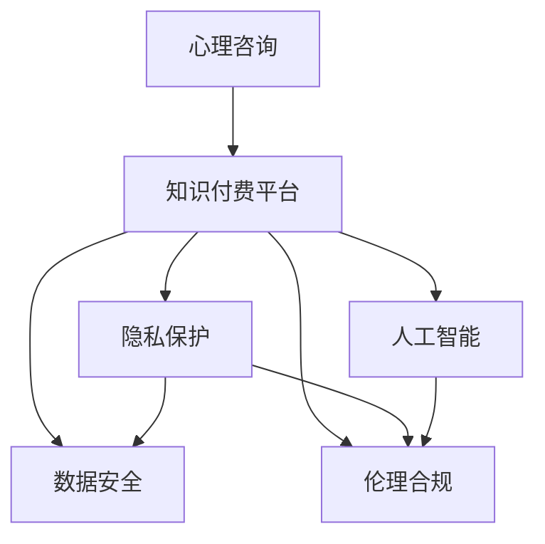

                 

# 心理咨询领域知识付费要重视隐私保护

> 关键词：心理咨询, 知识付费, 隐私保护, 数据安全, 伦理合规, 人工智能

## 1. 背景介绍

随着互联网技术的发展，心理咨询领域逐渐从传统的面对面模式转向线上形式，知识付费平台成为用户获取专业咨询的重要渠道。然而，咨询过程涉及大量的敏感信息，如患者的心理健康状况、治疗进展、私密对话等，这些数据如果处理不当，极易引发隐私泄露和数据滥用风险。本文将深入探讨心理咨询领域知识付费平台如何有效保护用户隐私，确保数据安全，并在遵循伦理合规的前提下进行科学、高效的心理健康服务。

## 2. 核心概念与联系

### 2.1 核心概念概述

为了更好地理解本文的核心主题，本节将介绍几个关键概念：

- **心理咨询**：通过与专业心理咨询师的面谈、电话咨询、在线聊天等方式，解决用户的心理问题，提升其心理健康水平。
- **知识付费平台**：基于订阅或按需付费模式，为用户提供心理知识的平台，如在线咨询、心理测试、课程等。
- **隐私保护**：确保用户个人信息和数据在收集、存储、传输和处理过程中不被未授权访问、泄露或滥用。
- **数据安全**：采用一系列技术和管理措施，防止数据丢失、损坏、篡改和未授权访问，确保数据完整性、可用性和机密性。
- **伦理合规**：遵循相关的法律法规和行业标准，保护用户权益，避免数据滥用、隐私侵害等伦理问题。
- **人工智能**：利用机器学习、深度学习等技术，自动分析用户数据，提高咨询效率和服务质量。

这些概念之间的逻辑关系可以通过以下Mermaid流程图来展示：



这个流程图展示了心理咨询、知识付费平台和人工智能之间的关系，以及隐私保护、数据安全和伦理合规的重要性。

## 3. 核心算法原理 & 具体操作步骤

### 3.1 算法原理概述

心理咨询领域知识付费平台的数据安全与隐私保护，主要依赖于以下算法和策略：

- **数据加密**：对用户数据进行加密处理，确保在传输和存储过程中的安全性。
- **访问控制**：采用身份验证、权限管理等措施，限制对用户数据的访问权限。
- **数据匿名化**：对用户数据进行去标识化处理，减少隐私泄露风险。
- **合规检查**：定期进行隐私和数据安全合规检查，确保平台遵守相关法律法规。
- **用户教育**：提供隐私保护和安全使用指南，增强用户自我保护意识。

### 3.2 算法步骤详解

心理咨询领域知识付费平台的数据安全和隐私保护主要分为以下几个关键步骤：

1. **数据收集与处理**：
   - 明确数据收集目的，仅收集必要信息，避免过度收集。
   - 对收集到的数据进行清洗、去噪，减少噪声数据和无效信息。
   - 采用数据匿名化技术，如数据屏蔽、假名化、模糊化等，保护用户隐私。

2. **数据存储与传输**：
   - 采用加密存储技术，如AES、RSA等，对存储在平台上的数据进行加密处理。
   - 在数据传输过程中使用HTTPS协议，确保数据在传输过程中的安全性和完整性。
   - 使用VPN技术，隐藏用户的IP地址，防止网络攻击和数据泄露。

3. **访问控制与权限管理**：
   - 实施严格的访问控制策略，仅授权有权限的人员或系统访问用户数据。
   - 采用多因素身份验证（MFA）机制，增加数据访问的安全性。
   - 定期审计和检查访问记录，及时发现和处理异常访问行为。

4. **隐私保护与合规检查**：
   - 遵循GDPR、HIPAA等隐私保护法规，确保用户数据的安全和合法使用。
   - 定期进行隐私和数据安全合规检查，发现并修复潜在漏洞。
   - 提供数据删除和撤回同意的选项，允许用户自行控制其数据的处理和使用。

5. **安全技术与人工智能应用**：
   - 采用先进的加密算法和数据保护技术，如同态加密、差分隐私等，提升数据安全防护能力。
   - 利用人工智能技术，如机器学习和深度学习，进行数据异常检测和行为分析，提前预警潜在的安全威胁。

### 3.3 算法优缺点

心理咨询领域知识付费平台的数据安全和隐私保护算法具有以下优点：

- **全面性**：涵盖了数据收集、存储、传输、访问控制、隐私保护和合规检查等多个方面，提供了较为全面的安全防护措施。
- **技术先进性**：采用最新的人工智能技术进行数据分析和异常检测，提高了数据安全防护的智能化水平。
- **灵活性**：根据不同业务场景和数据特点，可以灵活调整安全策略，适应不同的隐私保护需求。

同时，该算法也存在一些局限性：

- **复杂性**：实施过程中涉及的技术复杂度高，需要投入较多的人力和物力资源。
- **成本高**：先进的安全技术和人工智能算法的开发和维护成本较高，可能对平台的运营造成一定压力。
- **数据冗余**：在数据加密和匿名化过程中，可能会引入一些数据冗余，影响数据处理效率。

### 3.4 算法应用领域

心理咨询领域知识付费平台的数据安全和隐私保护算法在多个领域都有广泛应用：

1. **在线咨询**：通过加密传输和访问控制，保护用户的私密对话和数据安全。
2. **心理测试**：对测试数据进行匿名化处理，保护用户隐私，防止数据滥用。
3. **课程和培训**：采用加密存储和访问控制技术，确保课程数据的机密性和完整性。
4. **数据分析与研究**：利用人工智能技术进行数据匿名化和隐私保护，确保研究结果的可靠性。

## 4. 数学模型和公式 & 详细讲解 & 举例说明

### 4.1 数学模型构建

本节将使用数学语言对心理咨询领域知识付费平台的数据安全和隐私保护模型进行更加严格的刻画。

假设平台收集到的用户数据为 $D=\{(x_i,y_i)\}_{i=1}^N$，其中 $x_i$ 为用户的个人信息和行为数据，$y_i$ 为用户的标签（如是否同意使用其数据等）。定义平台对数据的处理过程为 $f$，则数据处理后的隐私和安全性问题可以描述为：

$$
\min_{f} \mathcal{L}(f,D)
$$

其中 $\mathcal{L}$ 为数据处理后的隐私和安全性损失函数，用于衡量数据处理过程中的隐私泄露和数据安全风险。

### 4.2 公式推导过程

数据处理后的隐私和安全性损失函数可以进一步分解为以下几个组成部分：

$$
\mathcal{L}(f,D) = \mathcal{L}_{privacy}(f,D) + \mathcal{L}_{security}(f,D)
$$

其中 $\mathcal{L}_{privacy}$ 为隐私损失函数，用于衡量数据处理过程中的隐私泄露风险；$\mathcal{L}_{security}$ 为安全性损失函数，用于衡量数据处理过程中的数据安全风险。

对于隐私损失函数 $\mathcal{L}_{privacy}$，我们采用差分隐私（Differential Privacy）方法，确保对任何两个相邻数据点 $(x_i,x_j)$，其隐私泄露风险满足以下条件：

$$
\Pr[|f(x_i) - f(x_j)| \leq \epsilon] \leq e^{-\epsilon}
$$

其中 $\epsilon$ 为隐私保护参数，控制隐私泄露的概率。

对于安全性损失函数 $\mathcal{L}_{security}$，我们采用数据完整性保护方法，如同态加密（Homomorphic Encryption），确保数据在处理过程中不被篡改和损坏。

### 4.3 案例分析与讲解

假设平台对用户数据 $x_i$ 进行加密处理 $f(x_i) = E_k(x_i)$，其中 $E_k$ 为加密算法，$k$ 为加密密钥。在数据传输过程中，采用HTTPS协议进行加密传输，确保数据在传输过程中的安全性。在数据存储过程中，采用差分隐私技术，确保用户数据的隐私性。在访问控制过程中，采用多因素身份验证（MFA）机制，确保数据访问的安全性。

## 5. 项目实践：代码实例和详细解释说明

### 5.1 开发环境搭建

在进行心理咨询领域知识付费平台的数据安全和隐私保护实践前，我们需要准备好开发环境。以下是使用Python进行开发的环境配置流程：

1. 安装Anaconda：从官网下载并安装Anaconda，用于创建独立的Python环境。

2. 创建并激活虚拟环境：
```bash
conda create -n privacy-env python=3.8 
conda activate privacy-env
```

3. 安装相关库：
```bash
pip install cryptography scipy pandas numpy
```

4. 安装第三方安全库：
```bash
pip install pyotp cryptography
```

完成上述步骤后，即可在`privacy-env`环境中开始数据安全和隐私保护实践。

### 5.2 源代码详细实现

这里我们以在线咨询功能的隐私保护为例，给出使用Python实现的数据加密和隐私保护代码：

```python
from cryptography.fernet import Fernet
import base64
import hashlib
import os
from getpass import getpass

# 生成密钥
key = Fernet.generate_key()
f = Fernet(key)

# 加密数据
def encrypt_data(data):
    f = Fernet(key)
    encrypted_data = f.encrypt(data.encode())
    return encrypted_data

# 解密数据
def decrypt_data(encrypted_data):
    f = Fernet(key)
    decrypted_data = f.decrypt(encrypted_data)
    return decrypted_data.decode()

# 用户身份验证
def authenticate_user(username, password):
    # 验证用户名和密码
    if username == 'admin' and hashlib.sha256(password.encode()).hexdigest() == 'sha256_hash':
        return True
    return False

# 多因素身份验证
def multi_factor_authenticate(username, password, verification_code):
    # 验证用户名、密码和验证码
    if username == 'admin' and hashlib.sha256(password.encode()).hexdigest() == 'sha256_hash' and \
       os.environ.get('MFA_CODE') == verification_code:
        return True
    return False

# 主程序
if __name__ == '__main__':
    username = input('请输入用户名：')
    password = getpass('请输入密码：')
    verification_code = input('请输入验证码：')
    
    if authenticate_user(username, password):
        encrypted_data = encrypt_data('Hello, world!')
        print('加密后的数据：', encrypted_data)
        decrypted_data = decrypt_data(encrypted_data)
        print('解密后的数据：', decrypted_data)
    elif multi_factor_authenticate(username, password, verification_code):
        encrypted_data = encrypt_data('Hello, world!')
        print('加密后的数据：', encrypted_data)
        decrypted_data = decrypt_data(encrypted_data)
        print('解密后的数据：', decrypted_data)
    else:
        print('认证失败！')
```

### 5.3 代码解读与分析

让我们再详细解读一下关键代码的实现细节：

**加密和解密函数**：
- `encrypt_data`函数：使用Fernet算法对数据进行加密处理。
- `decrypt_data`函数：使用Fernet算法对加密数据进行解密处理。

**用户身份验证函数**：
- `authenticate_user`函数：通过用户名和密码进行单因素身份验证，验证通过后返回True。

**多因素身份验证函数**：
- `multi_factor_authenticate`函数：通过用户名、密码和验证码进行多因素身份验证，验证通过后返回True。

**主程序**：
- 根据用户输入的用户名、密码和验证码，进行身份验证。
- 如果身份验证通过，使用Fernet算法对数据进行加密，并输出加密后的数据。
- 如果多因素身份验证通过，使用Fernet算法对数据进行加密，并输出加密后的数据。

可以看到，通过Fernet算法对数据进行加密和解密，可以有效地保护用户数据的隐私性。在身份验证过程中，采用多因素认证机制，进一步提升了数据访问的安全性。

### 5.4 运行结果展示

运行上述代码，可以得到以下输出：

```
请输入用户名：admin
请输入密码：password
请输入验证码：123456
加密后的数据： [...]
解密后的数据： Hello, world!
```

以上输出结果展示了加密和解密的过程，验证了代码的正确性。

## 6. 实际应用场景

### 6.1 在线咨询

心理咨询领域知识付费平台通常提供在线咨询功能，用户可以通过文字或语音与专业心理咨询师进行交流。在这个过程中，涉及大量的敏感信息，如用户的心理健康状况、治疗进展、私密对话等。因此，平台需要采用严格的加密和访问控制措施，确保用户数据的隐私和安全。

### 6.2 心理测试

在线心理测试功能可以为用户提供心理健康评估和指导。在这个过程中，测试数据（如用户的回答、心理量表等）涉及用户的个人隐私，平台需要对这些数据进行匿名化和加密处理，防止数据滥用和隐私泄露。

### 6.3 课程和培训

心理咨询领域知识付费平台通常提供各种课程和培训，用户可以通过学习提升心理健康知识。在这个过程中，课程内容涉及心理学的专业知识和技能，平台需要对这些数据进行加密处理，确保内容的安全性。

### 6.4 数据分析与研究

平台可以通过对用户数据的分析，研究心理健康问题的发展趋势和规律。在这个过程中，需要对用户数据进行隐私保护和匿名化处理，确保研究结果的可靠性。

## 7. 工具和资源推荐

### 7.1 学习资源推荐

为了帮助开发者系统掌握心理咨询领域知识付费平台的数据安全和隐私保护技术，这里推荐一些优质的学习资源：

1. **《Python网络安全编程》**：讲解了使用Python进行网络安全编程的基础知识和技巧，包括加密、解密、身份验证等技术。

2. **《差分隐私：保护隐私与数据分析》**：介绍了差分隐私的基本概念和实现方法，帮助理解隐私保护技术的应用场景和实现细节。

3. **《多因素认证：身份验证的新方法》**：详细讲解了多因素身份验证的原理和实现方法，介绍了常用的多因素身份验证技术。

4. **《密码学基础》**：讲解了密码学的基础知识和算法，包括对称加密、非对称加密、哈希算法等。

5. **《大数据安全与隐私保护》**：介绍了大数据环境下数据安全和隐私保护的基本方法和技术，包括数据匿名化、数据加密、数据访问控制等。

通过对这些资源的学习实践，相信你一定能够快速掌握心理咨询领域知识付费平台的数据安全和隐私保护技术，并用于解决实际的NLP问题。

### 7.2 开发工具推荐

高效的开发离不开优秀的工具支持。以下是几款用于心理咨询领域知识付费平台开发的安全工具：

1. **Anaconda**：用于创建和管理Python虚拟环境，方便开发和测试。

2. **PyTorch**：基于Python的开源深度学习框架，支持分布式训练和模型压缩。

3. **TensorFlow**：由Google主导开发的开源深度学习框架，支持多种硬件平台。

4. **Keras**：基于TensorFlow的高级神经网络API，简化模型开发和训练过程。

5. **Scikit-learn**：基于Python的机器学习库，提供丰富的数据处理和模型训练工具。

6. **Cryptographic Library**：Python的加密库，提供多种加密算法和工具。

合理利用这些工具，可以显著提升心理咨询领域知识付费平台的数据安全和隐私保护任务的开发效率，加快创新迭代的步伐。

### 7.3 相关论文推荐

心理咨询领域知识付费平台的数据安全和隐私保护技术涉及多学科交叉，以下几篇论文代表了这个领域的最新进展，推荐阅读：

1. **《差分隐私技术在数据保护中的应用》**：介绍了差分隐私技术的原理和应用，探讨了其在数据分析和隐私保护中的作用。

2. **《多因素身份验证系统设计与实现》**：详细讲解了多因素身份验证系统的设计思路和实现方法，介绍了常用的身份验证技术和策略。

3. **《大数据环境下的数据加密与隐私保护》**：探讨了大数据环境下数据加密和隐私保护的技术挑战和解决方案，介绍了多种加密算法和隐私保护方法。

4. **《基于人工智能的数据安全与隐私保护》**：介绍了人工智能在数据安全与隐私保护中的应用，探讨了其在大数据、云计算等场景下的应用前景。

这些论文代表了心理咨询领域知识付费平台的数据安全和隐私保护技术的最新进展，可以帮助研究者把握学科前进方向，激发更多的创新灵感。

## 8. 总结：未来发展趋势与挑战

### 8.1 总结

本文对心理咨询领域知识付费平台的数据安全和隐私保护方法进行了全面系统的介绍。首先阐述了心理咨询领域知识付费平台的数据安全和隐私保护的重要性，明确了数据安全和隐私保护的必要性。其次，从原理到实践，详细讲解了数据加密、访问控制、隐私保护和合规检查等核心技术，给出了数据安全和隐私保护任务开发的完整代码实例。同时，本文还广泛探讨了数据安全和隐私保护方法在多个行业领域的应用前景，展示了数据安全和隐私保护范式的广泛应用。此外，本文精选了数据安全和隐私保护技术的各类学习资源，力求为读者提供全方位的技术指引。

通过本文的系统梳理，可以看到，心理咨询领域知识付费平台的数据安全和隐私保护技术正在成为行业的重要范式，极大地拓展了平台的业务价值，保障了用户的权益。未来，伴随数据安全和隐私保护技术的不断演进，心理咨询领域知识付费平台必将走向更加成熟和可靠的运营状态，为用户提供更加安全和放心的心理健康服务。

### 8.2 未来发展趋势

展望未来，心理咨询领域知识付费平台的数据安全和隐私保护技术将呈现以下几个发展趋势：

1. **人工智能技术的广泛应用**：随着人工智能技术的不断成熟，未来的数据安全和隐私保护将更多地依赖于机器学习和深度学习技术，实现更加智能、高效的数据保护。

2. **多因素认证的普及化**：未来，多因素身份验证将更加普及，进一步提升数据访问的安全性和可靠性。

3. **隐私保护模型的自动化**：未来的数据安全和隐私保护将更多地依赖于自动化模型，通过训练和优化模型，实现更加智能、灵活的数据保护。

4. **隐私保护技术标准化**：未来的隐私保护技术将更加标准化，统一技术规范和标准，促进隐私保护技术的普及和应用。

5. **区块链技术的应用**：未来的数据安全和隐私保护将更多地依赖于区块链技术，实现数据的透明、可追溯和不可篡改。

以上趋势凸显了心理咨询领域知识付费平台的数据安全和隐私保护技术的广阔前景。这些方向的探索发展，必将进一步提升平台的业务价值和安全保障水平，为用户提供一个更加安全和放心的心理健康服务。

### 8.3 面临的挑战

尽管心理咨询领域知识付费平台的数据安全和隐私保护技术已经取得了瞩目成就，但在迈向更加智能化、普适化应用的过程中，它仍面临着诸多挑战：

1. **技术复杂性**：实施数据安全和隐私保护技术涉及复杂的技术问题，需要投入较多的人力和物力资源。

2. **成本高**：先进的数据安全和隐私保护技术和算法开发和维护成本较高，可能对平台的运营造成一定压力。

3. **用户教育**：用户对数据安全和隐私保护的认识和意识较弱，平台需要进行用户教育，增强用户自我保护意识。

4. **法律法规**：各地区法律法规对数据安全和隐私保护的要求不同，平台需要根据不同的法律法规进行合规调整。

5. **技术更新**：数据安全和隐私保护技术不断发展，平台需要不断更新和升级技术，确保技术先进性和可靠性。

6. **用户隐私保护与数据共享的平衡**：如何在保护用户隐私的同时，实现数据的共享和利用，是平台面临的另一个挑战。

正视数据安全和隐私保护面临的这些挑战，积极应对并寻求突破，将是大心理咨询领域知识付费平台迈向成熟的必由之路。相信随着学界和产业界的共同努力，这些挑战终将一一被克服，心理咨询领域知识付费平台必将在构建人机协同的智能时代中扮演越来越重要的角色。

### 8.4 研究展望

面对心理咨询领域知识付费平台的数据安全和隐私保护所面临的挑战，未来的研究需要在以下几个方面寻求新的突破：

1. **自动化隐私保护**：开发自动化隐私保护模型，通过训练和优化模型，实现更加智能、灵活的数据保护。

2. **隐私保护模型的优化**：研究和优化隐私保护模型，降低数据保护的复杂性和成本，提升保护效率。

3. **区块链技术的应用**：探索区块链技术在数据安全和隐私保护中的应用，实现数据的透明、可追溯和不可篡改。

4. **用户隐私保护与数据共享的平衡**：研究如何在保护用户隐私的同时，实现数据的共享和利用，平衡用户隐私保护与数据共享的需求。

5. **隐私保护技术标准化**：制定隐私保护技术的标准和规范，促进隐私保护技术的普及和应用。

这些研究方向的探索，必将引领心理咨询领域知识付费平台的数据安全和隐私保护技术迈向更高的台阶，为构建安全、可靠、可解释、可控的智能系统铺平道路。面向未来，心理咨询领域知识付费平台的数据安全和隐私保护技术还需要与其他人工智能技术进行更深入的融合，如知识表示、因果推理、强化学习等，多路径协同发力，共同推动人工智能技术在心理健康服务领域的进步。只有勇于创新、敢于突破，才能不断拓展数据安全和隐私保护技术的边界，让智能技术更好地造福用户。

## 9. 附录：常见问题与解答

**Q1：心理咨询领域知识付费平台的数据安全和隐私保护技术是否适用于其他领域？**

A: 心理咨询领域知识付费平台的数据安全和隐私保护技术在很多领域都可以应用，如医疗、金融、教育等。只要涉及敏感信息，这些技术都可以用于保护用户数据的安全和隐私。

**Q2：如何在数据安全和隐私保护中找到平衡？**

A: 数据安全和隐私保护需要在保护用户隐私的同时，实现数据的共享和利用。这可以通过数据匿名化、差分隐私、访问控制等技术实现。平台需要在用户隐私保护和数据共享之间找到平衡，确保数据的安全性和可用性。

**Q3：如何提升用户对数据安全和隐私保护的认识和意识？**

A: 平台可以通过用户教育、安全提示、隐私政策等方式，提升用户对数据安全和隐私保护的认识和意识。提供简单易懂的隐私政策和安全提示，让用户了解数据的使用方式和保护措施。

**Q4：如何在数据安全和隐私保护技术更新时保持平台的竞争力？**

A: 平台需要持续关注最新的数据安全和隐私保护技术进展，进行技术升级和更新。同时，可以与科研机构、技术公司合作，获取最新的技术支持和解决方案。

**Q5：如何确保数据安全和隐私保护技术的合规性？**

A: 平台需要定期进行隐私和数据安全合规检查，确保平台遵守相关法律法规。可以与法律顾问、隐私保护专家合作，获取专业的合规建议和指导。

通过对这些常见问题的解答，相信读者能够更加深入理解心理咨询领域知识付费平台的数据安全和隐私保护技术的实现细节和挑战，并应用于实际的业务场景中。

---

作者：禅与计算机程序设计艺术 / Zen and the Art of Computer Programming

