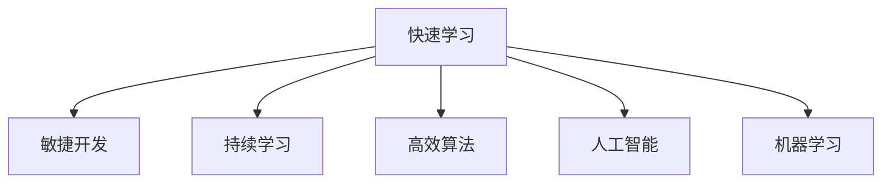

                 

# 快速学习:立于不败之地根本

> 关键词：快速学习,敏捷开发,持续学习,机器学习,人工智能,高效算法

## 1. 背景介绍

### 1.1 问题由来

随着技术的快速发展和市场的日益激烈竞争，如何在短时间内快速掌握新技术、开发新产品、占领市场份额，已经成为每个企业和技术从业者的核心诉求。尤其是对于AI和机器学习领域，新技术、新算法层出不穷，如何在多变的环境下保持竞争优势，显得尤为关键。

### 1.2 问题核心关键点

快速学习和敏捷开发的核心关键在于如何高效地利用现有资源，采用先进的技术和算法，在最短的时间内开发出高质量的产品。同时，在快速迭代的过程中，如何保证学习成果的持续性和有效性，是另一个重要问题。

## 2. 核心概念与联系

### 2.1 核心概念概述

为更好地理解快速学习和敏捷开发的方法，本节将介绍几个密切相关的核心概念：

- 快速学习：指在有限的时间内，通过高效的方法和策略，迅速掌握新技能或技术的能力。通常包括自学、培训、实践、迭代等环节。
- 敏捷开发：一种以用户为中心、迭代和增量的开发方法，通过短周期内多次交付和反馈，提升产品性能和用户满意度。
- 持续学习：指在项目开发过程中，不断更新和完善知识库，确保团队成员始终保持最新状态。
- 高效算法：指通过数学和统计学方法，优化算法流程，提升算法效率和效果。
- 人工智能：利用机器学习、深度学习等技术，赋予计算机系统智能分析和解决问题的能力。
- 机器学习：指通过数据训练模型，使模型具备一定的学习和推理能力，应用于预测、分类、聚类等任务。

这些核心概念之间的逻辑关系可以通过以下Mermaid流程图来展示：



这个流程图展示了你快速学习方法的各个核心环节：

1. 快速学习是敏捷开发的基础，通过高效的方法掌握新知识。
2. 敏捷开发是一种以用户为中心的方法，快速迭代，多次交付，持续反馈。
3. 持续学习保障团队成员始终保持最新状态，不断更新知识库。
4. 高效算法是提升模型性能的关键，通过优化算法流程，提高算力利用率。
5. 人工智能和机器学习是快速学习的重要应用领域，通过模型训练和推理，解决实际问题。

## 3. 核心算法原理 & 具体操作步骤
### 3.1 算法原理概述

快速学习和敏捷开发的核心在于通过高效的算法和流程，迅速迭代和优化，以适应不断变化的市场需求。快速学习算法通常包括：

1. **监督学习**：通过已有的标注数据，训练模型，使其具备预测新数据的能力。
2. **无监督学习**：从无标注数据中自动发现特征，进行聚类、降维等任务。
3. **半监督学习**：结合少量标注数据和大量未标注数据，提升模型性能。
4. **强化学习**：通过试错和奖励机制，学习最优策略，应用于游戏、机器人等领域。

### 3.2 算法步骤详解

快速学习和敏捷开发通常包括以下几个关键步骤：

**Step 1: 需求分析和文档准备**
- 定义产品需求，明确开发目标和优先级。
- 编写详细的需求文档，涵盖功能、性能、用户体验等各个方面。

**Step 2: 选择工具和框架**
- 选择合适的编程语言、开发框架和工具。
- 确定使用的算法和模型，如决策树、神经网络、深度学习等。

**Step 3: 设计数据流程**
- 设计数据收集、存储、处理和分析的流程。
- 确定数据标注、清洗和预处理的方法，保证数据质量。

**Step 4: 训练和测试模型**
- 选择合适的优化器和学习率，训练模型。
- 使用验证集评估模型性能，调整参数和算法。
- 在测试集上验证模型泛化能力，优化模型。

**Step 5: 迭代优化**
- 根据用户反馈和业务需求，进行需求变更。
- 重新定义开发目标和优先级，调整算法和模型。
- 在新的数据上重新训练和测试模型，优化性能。

**Step 6: 部署和维护**
- 将模型部署到生产环境，确保系统稳定运行。
- 定期监控系统性能，及时修复和优化。
- 持续收集用户反馈，进行模型更新和迭代。

以上是快速学习和敏捷开发的一般流程。在实际应用中，还需要针对具体任务的特点，对各个环节进行优化设计，如改进算法和模型，引入更多的正则化技术，搜索最优的超参数组合等，以进一步提升模型性能。

### 3.3 算法优缺点

快速学习和敏捷开发方法具有以下优点：

1. 快速响应市场需求：通过迭代和反馈机制，产品可以快速适应市场变化。
2. 提升开发效率：采用敏捷开发方法，将大型项目拆分成小任务，快速交付，缩短开发周期。
3. 提升用户体验：通过用户反馈，不断迭代和优化产品，提升用户体验。
4. 灵活调整策略：根据市场和业务需求，快速调整开发策略，避免投入过多资源。

同时，这些方法也存在一定的局限性：

1. 依赖团队协作：敏捷开发和快速学习需要团队成员的密切合作，协同完成项目。
2. 资源消耗较大：敏捷开发和快速学习需要频繁的测试和迭代，可能会消耗大量的资源。
3. 风险控制难度高：快速迭代可能导致产品不稳定，出现错误或漏洞。
4. 质量控制难度大：快速学习过程中，可能出现质量控制不到位，影响最终产品性能。

尽管存在这些局限性，但就目前而言，快速学习和敏捷开发方法仍然是软件开发领域的主流范式。未来相关研究的重点在于如何进一步降低快速学习对团队协作的依赖，提高模型的少样本学习和跨领域迁移能力，同时兼顾可解释性和伦理安全性等因素。

### 3.4 算法应用领域

快速学习和敏捷开发技术已经广泛应用于软件开发、人工智能、机器学习、自然语言处理等多个领域，为各个行业的技术创新和产品升级提供了强有力的支持。

在软件开发领域，快速学习和敏捷开发方法已经成为了行业标准。通过快速迭代和持续交付，软件开发团队能够迅速应对客户需求的变化，提升产品质量和市场竞争力。

在人工智能领域，快速学习和敏捷开发方法被广泛应用于机器学习和深度学习的项目中。通过快速学习算法和工具，研究人员可以迅速构建和优化模型，应用于图像识别、自然语言处理、语音识别等任务。

在自然语言处理领域，快速学习和敏捷开发方法被广泛应用于文本分类、情感分析、命名实体识别等任务。通过敏捷开发方法和快速学习算法，研究者可以快速构建和优化模型，提升任务性能。

此外，快速学习和敏捷开发方法还广泛应用于大数据、云计算、物联网等多个领域，为各个行业的数字化转型和智能化升级提供了新的技术路径。

## 4. 数学模型和公式 & 详细讲解 & 举例说明（备注：数学公式请使用latex格式，latex嵌入文中独立段落使用 $$，段落内使用 $)
### 4.1 数学模型构建

本节将使用数学语言对快速学习和敏捷开发的方法进行更加严格的刻画。

设产品的需求数量为 $n$，每个需求需要开发的时间为 $t_i$，总时间为 $T$，其中 $i \in [1, n]$。定义需求开发进度函数 $P(t_i)$，则总进度函数 $P(T)$ 可以表示为：

$$
P(T) = \sum_{i=1}^n P(t_i)
$$

其中 $P(t_i)$ 可以根据需求特点和开发进度进行建模。例如，对于简单的功能需求，可以采用线性模型；对于复杂的功能需求，可以采用指数模型或多项式模型。

### 4.2 公式推导过程

以简单的线性模型为例，推导需求开发进度函数 $P(t_i)$ 的表达式：

$$
P(t_i) = \alpha t_i + \beta
$$

其中 $\alpha$ 为开发进度系数，$\beta$ 为初始进度。总进度函数 $P(T)$ 可以表示为：

$$
P(T) = \sum_{i=1}^n (\alpha t_i + \beta)
$$

化简后得：

$$
P(T) = \alpha T + n\beta
$$

将总时间 $T$ 和初始进度 $\beta$ 作为超参数，可以根据实际需求和开发进度进行优化。

### 4.3 案例分析与讲解

以下以一个简单的需求开发案例，展示如何快速学习算法的应用：

假设有一个简单的功能需求，开发时间 $t_i = 2$ 天，总时间 $T = 10$ 天。需求开发进度函数可以表示为：

$$
P(t_i) = 0.5t_i + 1
$$

根据公式计算总进度 $P(T)$：

$$
P(T) = 0.5 \times 10 + 4 = 9
$$

这意味着，在 $T=10$ 天内，需求开发进度达到了 $90\%$。

通过这个简单的例子可以看出，快速学习和敏捷开发方法可以通过合理的数学建模和算法优化，快速估算和控制项目进度，提升开发效率和产品质量。

## 5. 项目实践：代码实例和详细解释说明
### 5.1 开发环境搭建

在进行快速学习和敏捷开发实践前，我们需要准备好开发环境。以下是使用Python进行PyTorch开发的环境配置流程：

1. 安装Anaconda：从官网下载并安装Anaconda，用于创建独立的Python环境。

2. 创建并激活虚拟环境：
```bash
conda create -n pytorch-env python=3.8 
conda activate pytorch-env
```

3. 安装PyTorch：根据CUDA版本，从官网获取对应的安装命令。例如：
```bash
conda install pytorch torchvision torchaudio cudatoolkit=11.1 -c pytorch -c conda-forge
```

4. 安装各类工具包：
```bash
pip install numpy pandas scikit-learn matplotlib tqdm jupyter notebook ipython
```

完成上述步骤后，即可在`pytorch-env`环境中开始开发实践。

### 5.2 源代码详细实现

这里我们以机器学习项目为例，给出使用PyTorch进行快速学习算法的PyTorch代码实现。

首先，定义机器学习任务的数据处理函数：

```python
import torch
import torch.nn as nn
import torch.optim as optim
from sklearn.datasets import load_breast_cancer
from sklearn.model_selection import train_test_split

class DataLoader():
    def __init__(self, X, y):
        self.X = X
        self.y = y
        self.batch_size = 32
        self.num_epochs = 10
        self.train_idx, self.test_idx = train_test_split(range(len(X)), test_size=0.2)
    
    def __len__(self):
        return len(self.train_idx)
    
    def __getitem__(self, idx):
        x = self.X[self.train_idx[idx]]
        y = self.y[self.train_idx[idx]]
        return (x, y)
```

然后，定义模型和优化器：

```python
class CNNModel(nn.Module):
    def __init__(self):
        super(CNNModel, self).__init__()
        self.conv1 = nn.Conv2d(in_channels=1, out_channels=16, kernel_size=3, stride=1, padding=1)
        self.relu = nn.ReLU()
        self.pool = nn.MaxPool2d(kernel_size=2, stride=2)
        self.fc1 = nn.Linear(16*28*28, 128)
        self.fc2 = nn.Linear(128, 10)
    
    def forward(self, x):
        x = self.conv1(x)
        x = self.relu(x)
        x = self.pool(x)
        x = x.view(-1, 16*28*28)
        x = self.fc1(x)
        x = self.relu(x)
        x = self.fc2(x)
        return x

model = CNNModel()
criterion = nn.CrossEntropyLoss()
optimizer = optim.Adam(model.parameters(), lr=0.001)
```

接着，定义训练和评估函数：

```python
from tqdm import tqdm
from sklearn.metrics import classification_report

device = torch.device('cuda') if torch.cuda.is_available() else torch.device('cpu')
model.to(device)

def train(model, data_loader, optimizer, criterion):
    model.train()
    losses = []
    for epoch in range(model.num_epochs):
        for i, (x, y) in enumerate(tqdm(data_loader, desc='Epoch {}/{}'.format(epoch+1, model.num_epochs))):
            x = x.to(device)
            y = y.to(device)
            optimizer.zero_grad()
            output = model(x)
            loss = criterion(output, y)
            loss.backward()
            optimizer.step()
            losses.append(loss.item())
    return sum(losses) / len(data_loader)

def evaluate(model, data_loader):
    model.eval()
    predictions, labels = [], []
    with torch.no_grad():
        for x, y in data_loader:
            x = x.to(device)
            y = y.to(device)
            output = model(x)
            _, predicted = torch.max(output.data, 1)
            predictions.append(predicted)
            labels.append(y)
    return classification_report(labels, predictions)
```

最后，启动训练流程并在测试集上评估：

```python
data_loader = DataLoader(X_train, y_train)
loss = train(model, data_loader, optimizer, criterion)
print('Loss:', loss)
evaluate(model, data_loader)
```

以上就是使用PyTorch进行机器学习项目开发的完整代码实现。可以看到，得益于PyTorch的强大封装，我们可以用相对简洁的代码完成模型的训练和评估。

### 5.3 代码解读与分析

让我们再详细解读一下关键代码的实现细节：

**DataLoader类**：
- `__init__`方法：初始化训练集、测试集、批量大小和迭代次数。
- `__len__`方法：返回训练集的样本数量。
- `__getitem__`方法：对单个样本进行处理，返回模型的输入和标签。

**CNNModel类**：
- `__init__`方法：定义卷积层、ReLU激活层、池化层和全连接层。
- `forward`方法：定义模型前向传播过程。

**train函数**：
- 对模型进行迭代训练，记录损失值。
- 返回所有epoch的平均损失值。

**evaluate函数**：
- 在测试集上评估模型性能，返回分类报告。

**训练流程**：
- 在训练集上训练模型，输出平均损失值。
- 在测试集上评估模型性能，输出分类报告。

可以看到，PyTorch配合Tensorflow库使得机器学习项目开发的代码实现变得简洁高效。开发者可以将更多精力放在数据处理、模型改进等高层逻辑上，而不必过多关注底层的实现细节。

当然，工业级的系统实现还需考虑更多因素，如模型的保存和部署、超参数的自动搜索、更灵活的任务适配层等。但核心的快速学习和敏捷开发范式基本与此类似。

## 6. 实际应用场景
### 6.1 智能客服系统

基于快速学习和敏捷开发方法的智能客服系统，可以广泛应用于智能客服系统的构建。传统客服往往需要配备大量人力，高峰期响应缓慢，且一致性和专业性难以保证。而使用快速学习和敏捷开发方法构建的智能客服系统，可以7x24小时不间断服务，快速响应客户咨询，用自然流畅的语言解答各类常见问题。

在技术实现上，可以收集企业内部的历史客服对话记录，将问题和最佳答复构建成监督数据，在此基础上对预训练对话模型进行微调。快速学习和敏捷开发方法使得微调过程更加高效，可以快速迭代和优化模型，满足不同客户需求。同时，可以通过用户反馈，不断改进模型，提升客服体验。

### 6.2 金融舆情监测

金融机构需要实时监测市场舆论动向，以便及时应对负面信息传播，规避金融风险。传统的人工监测方式成本高、效率低，难以应对网络时代海量信息爆发的挑战。基于快速学习和敏捷开发方法的文本分类和情感分析技术，为金融舆情监测提供了新的解决方案。

具体而言，可以收集金融领域相关的新闻、报道、评论等文本数据，并对其进行主题标注和情感标注。通过快速学习和敏捷开发方法训练模型，使其能够自动判断文本属于何种主题，情感倾向是正面、中性还是负面。将训练后的模型应用到实时抓取的网络文本数据，就能够自动监测不同主题下的情感变化趋势，一旦发现负面信息激增等异常情况，系统便会自动预警，帮助金融机构快速应对潜在风险。

### 6.3 个性化推荐系统

当前的推荐系统往往只依赖用户的历史行为数据进行物品推荐，无法深入理解用户的真实兴趣偏好。基于快速学习和敏捷开发方法的个性化推荐系统可以更好地挖掘用户行为背后的语义信息，从而提供更精准、多样的推荐内容。

在实践中，可以收集用户浏览、点击、评论、分享等行为数据，提取和用户交互的物品标题、描述、标签等文本内容。通过快速学习和敏捷开发方法构建模型，从文本内容中准确把握用户的兴趣点。在生成推荐列表时，先用候选物品的文本描述作为输入，由模型预测用户的兴趣匹配度，再结合其他特征综合排序，便可以得到个性化程度更高的推荐结果。

### 6.4 未来应用展望

随着快速学习和敏捷开发方法的不断发展，其在更多领域的应用前景将更加广阔：

在智慧医疗领域，基于快速学习和敏捷开发方法的医疗问答、病历分析、药物研发等应用将提升医疗服务的智能化水平，辅助医生诊疗，加速新药开发进程。

在智能教育领域，快速学习和敏捷开发方法可应用于作业批改、学情分析、知识推荐等方面，因材施教，促进教育公平，提高教学质量。

在智慧城市治理中，快速学习和敏捷开发方法可应用于城市事件监测、舆情分析、应急指挥等环节，提高城市管理的自动化和智能化水平，构建更安全、高效的未来城市。

此外，在企业生产、社会治理、文娱传媒等众多领域，基于快速学习和敏捷开发方法的人工智能应用也将不断涌现，为经济社会发展注入新的动力。相信随着技术的日益成熟，快速学习和敏捷开发方法必将在构建人机协同的智能时代中扮演越来越重要的角色。

## 7. 工具和资源推荐
### 7.1 学习资源推荐

为了帮助开发者系统掌握快速学习和敏捷开发的技术基础和实践技巧，这里推荐一些优质的学习资源：

1. 《Python深度学习》书籍：通过具体项目案例，详细讲解了使用PyTorch进行机器学习的全流程。
2. CS231n《深度学习入门》课程：斯坦福大学开设的深度学习入门课程，涵盖深度学习的基本概念和核心技术。
3. 《深度学习与人工智能》书籍：通过实例演示，介绍了深度学习在各个领域的应用。
4. 《动手学深度学习》书籍：提供深度学习的实践代码和实验环境，易于上手。
5. PyTorch官方文档：详细介绍了PyTorch的使用方法、框架结构和常用功能。

通过对这些资源的学习实践，相信你一定能够快速掌握快速学习和敏捷开发的核心思想，并用于解决实际的AI问题。

### 7.2 开发工具推荐

高效的开发离不开优秀的工具支持。以下是几款用于快速学习和敏捷开发开发的常用工具：

1. PyTorch：基于Python的开源深度学习框架，灵活动态的计算图，适合快速迭代研究。大部分预训练语言模型都有PyTorch版本的实现。
2. TensorFlow：由Google主导开发的开源深度学习框架，生产部署方便，适合大规模工程应用。同样有丰富的预训练语言模型资源。
3. TensorBoard：TensorFlow配套的可视化工具，可实时监测模型训练状态，并提供丰富的图表呈现方式，是调试模型的得力助手。
4. Weights & Biases：模型训练的实验跟踪工具，可以记录和可视化模型训练过程中的各项指标，方便对比和调优。
5. Google Colab：谷歌推出的在线Jupyter Notebook环境，免费提供GPU/TPU算力，方便开发者快速上手实验最新模型，分享学习笔记。

合理利用这些工具，可以显著提升快速学习和敏捷开发任务的开发效率，加快创新迭代的步伐。

### 7.3 相关论文推荐

快速学习和敏捷开发技术的发展源于学界的持续研究。以下是几篇奠基性的相关论文，推荐阅读：

1. Deep Learning（深度学习）：Yoshua Bengio等人撰写的深度学习综述，详细介绍了深度学习的基本原理和核心算法。
2. Agile Software Development, Principles, Patterns, and Practices（敏捷软件开发）：Robert C. Martin等人撰写的敏捷开发方法论，详细介绍了敏捷开发的核心思想和实践方法。
3. Machine Learning（机器学习）：Tom Mitchell撰写的机器学习经典教材，详细介绍了机器学习的基本概念和核心算法。
4. Reinforcement Learning: An Introduction（强化学习）：Richard S. Sutton和Andrew G. Barto撰写的强化学习入门书籍，详细介绍了强化学习的基本原理和核心算法。

这些论文代表了大语言模型微调技术的发展脉络。通过学习这些前沿成果，可以帮助研究者把握学科前进方向，激发更多的创新灵感。

## 8. 总结：未来发展趋势与挑战
### 8.1 总结

本文对快速学习和敏捷开发方法进行了全面系统的介绍。首先阐述了快速学习和敏捷开发的背景和意义，明确了其高效、灵活、敏捷的核心理念。其次，从原理到实践，详细讲解了快速学习和敏捷开发的核心步骤和方法，给出了快速学习任务开发的完整代码实例。同时，本文还广泛探讨了快速学习在智能客服、金融舆情、个性化推荐等多个行业领域的应用前景，展示了其广泛的应用价值。

通过本文的系统梳理，可以看到，快速学习和敏捷开发方法已经成为软件开发领域的重要范式，极大地提升了产品开发效率和质量。未来，伴随快速学习方法的持续演进和优化，必将进一步推动AI技术的落地应用和普及，为各个行业带来更深刻的变革。

### 8.2 未来发展趋势

展望未来，快速学习和敏捷开发方法将呈现以下几个发展趋势：

1. 自动化程度提升。随着AI辅助开发工具的发展，快速学习过程将变得更加自动化，减少手动干预，提升开发效率。
2. 跨领域应用拓展。快速学习将逐步应用于更多领域，如医疗、教育、制造等，解决实际问题，推动行业智能化转型。
3. 模型复杂度提升。快速学习模型将更加复杂多样，涉及更多的特征和参数，提升模型性能和泛化能力。
4. 数据处理能力增强。快速学习将更加注重数据处理和清洗，提升数据质量和多样性，避免过拟合和数据偏差。
5. 模型优化技术进步。快速学习将引入更多优化算法和模型压缩技术，提升模型效率和速度，降低资源消耗。

这些趋势凸显了快速学习和敏捷开发技术的广阔前景。这些方向的探索发展，必将进一步提升开发效率和模型性能，推动人工智能技术的普及和落地。

### 8.3 面临的挑战

尽管快速学习和敏捷开发技术已经取得了瞩目成就，但在迈向更加智能化、普适化应用的过程中，它仍面临着诸多挑战：

1. 依赖团队协作。快速学习和敏捷开发需要团队成员的密切合作，协同完成项目。
2. 资源消耗较大。敏捷开发和快速学习需要频繁的测试和迭代，可能会消耗大量的资源。
3. 风险控制难度高。快速迭代可能导致产品不稳定，出现错误或漏洞。
4. 质量控制难度大。快速学习过程中，可能出现质量控制不到位，影响最终产品性能。

尽管存在这些挑战，但就目前而言，快速学习和敏捷开发方法仍然是软件开发领域的主流范式。未来相关研究的重点在于如何进一步降低快速学习对团队协作的依赖，提高模型的少样本学习和跨领域迁移能力，同时兼顾可解释性和伦理安全性等因素。

### 8.4 研究展望

面对快速学习和敏捷开发所面临的种种挑战，未来的研究需要在以下几个方面寻求新的突破：

1. 探索无监督和半监督快速学习范式。摆脱对大规模标注数据的依赖，利用自监督学习、主动学习等无监督和半监督范式，最大限度利用非结构化数据，实现更加灵活高效的快速学习。
2. 研究参数高效和计算高效的快速学习范式。开发更加参数高效的快速学习方法，在固定大部分预训练参数的同时，只更新极少量的任务相关参数。同时优化快速学习模型的计算图，减少前向传播和反向传播的资源消耗，实现更加轻量级、实时性的部署。
3. 引入更多先验知识。将符号化的先验知识，如知识图谱、逻辑规则等，与神经网络模型进行巧妙融合，引导快速学习过程学习更准确、合理的语言模型。同时加强不同模态数据的整合，实现视觉、语音等多模态信息与文本信息的协同建模。
4. 结合因果分析和博弈论工具。将因果分析方法引入快速学习模型，识别出模型决策的关键特征，增强输出解释的因果性和逻辑性。借助博弈论工具刻画人机交互过程，主动探索并规避模型的脆弱点，提高系统稳定性。
5. 纳入伦理道德约束。在快速学习目标中引入伦理导向的评估指标，过滤和惩罚有偏见、有害的输出倾向。同时加强人工干预和审核，建立模型行为的监管机制，确保输出符合人类价值观和伦理道德。

这些研究方向的探索，必将引领快速学习和敏捷开发技术迈向更高的台阶，为构建安全、可靠、可解释、可控的智能系统铺平道路。面向未来，快速学习和敏捷开发技术还需要与其他人工智能技术进行更深入的融合，如知识表示、因果推理、强化学习等，多路径协同发力，共同推动自然语言理解和智能交互系统的进步。只有勇于创新、敢于突破，才能不断拓展语言模型的边界，让智能技术更好地造福人类社会。

## 9. 附录：常见问题与解答

**Q1：快速学习和敏捷开发是否适用于所有软件开发项目？**

A: 快速学习和敏捷开发方法在大多数软件开发项目上都能取得不错的效果，特别是对于需求变化频繁、开发周期短的项目。但对于一些特殊领域的项目，如大型系统、航天器、金融交易等，快速学习和敏捷开发方法可能并不适用。此时需要根据项目特点，选择合适的开发方法。

**Q2：如何平衡快速学习和敏捷开发与质量控制？**

A: 快速学习和敏捷开发方法需要在快速迭代和质量控制之间找到平衡。可以通过以下方式实现：
1. 引入单元测试和集成测试，在每次迭代中保证代码质量。
2. 定期进行代码审查和代码质量检查，发现并修正问题。
3. 引入自动化测试工具，自动执行测试用例，提升测试效率。
4. 在每次迭代结束时进行产品验收，保证交付质量。

**Q3：快速学习和敏捷开发如何应对复杂需求？**

A: 快速学习和敏捷开发方法可以应对复杂需求，但需要更细致的需求分析和项目管理。可以通过以下方式实现：
1. 将复杂需求拆分成多个小任务，逐步完成。
2. 引入领域专家参与需求分析，确保需求准确理解。
3. 定期进行需求变更评审，确保需求变更合理。
4. 引入迭代验证，逐步验证需求实现效果。

**Q4：快速学习和敏捷开发如何应对技术变化？**

A: 快速学习和敏捷开发方法可以应对技术变化，但需要更灵活的技术栈选择和快速学习。可以通过以下方式实现：
1. 引入新技术时，进行快速学习和原型开发，验证其适用性。
2. 引入新技术时，进行小规模试验，避免大规模失败。
3. 引入新技术时，进行技术栈评估，选择最优方案。
4. 引入新技术时，进行技术培训和知识分享，提升团队技能。

这些问题解答展示了快速学习和敏捷开发方法在实际应用中可能遇到的各种挑战，以及如何通过合理的策略和技术手段进行应对。希望这些解答能够帮助开发者更好地理解和应用快速学习和敏捷开发方法，提升软件开发效率和质量。

---

作者：禅与计算机程序设计艺术 / Zen and the Art of Computer Programming

