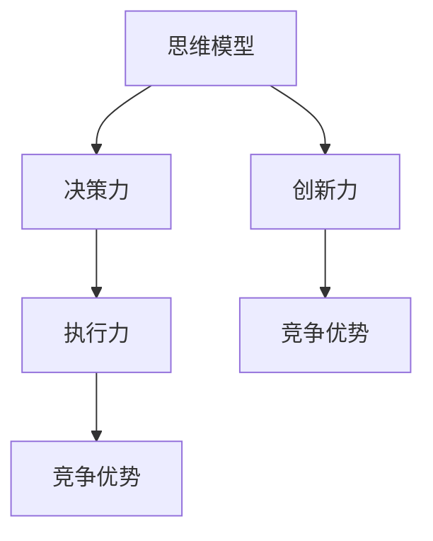

                 

# 思维升级：管理者的竞争优势

> 关键词：思维模型,竞争优势,决策力,创新力,执行力

## 1. 背景介绍

### 1.1 问题由来

在快速变化的市场环境中，企业间的竞争愈发激烈，管理者面临的挑战也日益复杂。面对多元化的市场需求、瞬息万变的技术动态、多样化的团队组成，管理者需要不断提升自己的思维能力，才能在竞争中获得优势。然而，如何在纷繁复杂的业务场景中，快速找到决策依据、制定有效策略、并迅速执行，是一个值得深思的问题。

### 1.2 问题核心关键点

管理者思维升级的核心在于构建一套系统化的思维模型，通过科学的方法和工具，不断优化自身的决策力、创新力和执行力，从而在竞争中取得优势。这一过程涉及到对问题的识别、解决方案的探索、决策的制定与执行等多个环节。

### 1.3 问题研究意义

提升管理者的思维能力，对于企业的长期发展和竞争力提升具有重要意义：

1. **优化决策**：系统化的思维模型可以帮助管理者在复杂环境中，快速找到最优决策依据，减少错误决策的风险。
2. **增强创新**：通过构建创新思维框架，管理者能够更有效地识别潜在的商业机会，推动企业不断创新。
3. **提升执行**：明确的执行路径和科学的执行方法，能够确保策略的落地和效果的实现。
4. **提升团队效能**：管理者通过传递清晰的目标和标准，激发团队的积极性和创造力，实现团队整体效能的提升。
5. **应对变化**：在动态环境中，灵活应对市场变化和内部调整，确保企业持续健康发展。

## 2. 核心概念与联系

### 2.1 核心概念概述

为更好地理解管理者思维升级的路径，本节将介绍几个关键概念：

- **思维模型(Mental Models)**：指用于指导决策和问题解决的框架或范式。如SWOT分析、PEST分析、波特五力模型等。
- **竞争优势(Competitive Advantage)**：指企业在市场中的独特地位和优势能力，使企业能够超越竞争对手。
- **决策力(Decision-Making)**：指管理者在面对问题时，快速、准确地做出决策的能力。
- **创新力(Innovation)**：指管理者识别新机会并采取行动，实现商业创新的能力。
- **执行力(Execution)**：指管理者将决策和策略转化为实际行动并实现预期结果的能力。

这些概念之间的逻辑关系可以通过以下Mermaid流程图来展示：



这个流程图展示了思维模型在提升决策力、创新力和执行力中的核心作用，以及最终如何转化为竞争优势。

## 3. 核心算法原理 & 具体操作步骤

### 3.1 算法原理概述

管理者思维升级的核心在于构建和应用系统化的思维模型，提升自身的决策力、创新力和执行力。这一过程包括对问题的结构化分析、解决方案的探索与选择、决策的制定与执行等多个环节。其基本算法原理可以概括为以下几个步骤：

1. **问题识别**：通过系统化思维模型，快速定位问题的关键点。
2. **解决方案探索**：运用多维思维模型，全面探索可能的解决方案。
3. **决策制定**：通过科学决策方法，选择最优方案。
4. **执行路径规划**：制定详细的执行计划，确保策略落地。
5. **执行效果评估**：对执行结果进行评估，及时调整策略。

### 3.2 算法步骤详解

#### 步骤1: 问题识别

问题识别是思维升级的第一步，通过系统化思维模型，快速定位问题的关键点。

- **SWOT分析**：评估企业内部的优势(Strengths)、劣势(Weaknesses)、机会(Opportunities)和威胁(Threats)，帮助管理者全面了解自身的竞争态势。
- **PEST分析**：从政治(Political)、经济(Economic)、社会(Social)和技术(Technological)四个维度，分析外部环境对企业的影响，为决策提供宏观背景。
- **波特五力模型**：分析行业内的竞争环境，识别潜在竞争者、替代品、供应商、买家和行业进入壁垒，帮助管理者制定竞争策略。

#### 步骤2: 解决方案探索

解决方案探索是思维升级的核心环节，通过多维思维模型，全面探索可能的解决方案。

- **问题树分析**：通过分解问题，找出问题的根本原因，并探索解决方案。
- **蓝海战略**：从竞争红海中跳脱，寻找未被满足的市场需求，实现差异化竞争。
- **设计思维**：以用户需求为中心，通过迭代设计和原型测试，探索创新解决方案。

#### 步骤3: 决策制定

决策制定是思维升级的关键步骤，通过科学决策方法，选择最优方案。

- **决策树分析**：通过构建决策树，评估各方案的潜在风险和收益，选择最优方案。
- **贝叶斯网络**：通过概率模型，评估不同因素对决策结果的影响，优化决策过程。
- **A/B测试**：通过对比实验，验证不同方案的效果，选择最佳方案。

#### 步骤4: 执行路径规划

执行路径规划是思维升级的重要环节，制定详细的执行计划，确保策略落地。

- **甘特图**：通过甘特图，规划项目进度，明确各阶段任务和时间节点。
- **敏捷开发**：采用迭代和增量的方式，逐步实现项目目标，提升执行效率。
- **关键路径分析**：通过关键路径分析，确定项目的关键活动和资源，确保资源有效利用。

#### 步骤5: 执行效果评估

执行效果评估是思维升级的闭环环节，对执行结果进行评估，及时调整策略。

- **KPI指标**：通过设定关键绩效指标(KPI)，评估执行效果，识别改进空间。
- **PDCA循环**：通过计划(Plan)、执行(Do)、检查(Check)、调整(Action)的循环，持续改进决策和执行过程。
- **回顾会议**：定期召开回顾会议，总结经验教训，优化执行策略。

### 3.3 算法优缺点

系统化的思维模型在提升管理者思维能力方面具有以下优点：

- **结构化决策**：通过系统化思维模型，快速定位问题，全面探索解决方案，科学制定决策。
- **全面视角**：多维思维模型帮助管理者全面理解问题，识别潜在机会和风险。
- **持续改进**：PDCA循环和KPI指标等方法，确保管理者能够持续改进决策和执行过程。

同时，这些方法也存在一定的局限性：

- **复杂度高**：多维思维模型和方法较为复杂，需要管理者具备较强的系统思维能力。
- **成本较高**：某些方法（如A/B测试）需要较高的实验成本和时间。
- **适用范围有限**：某些思维模型和方法适用于特定场景，不具有通用性。

尽管存在这些局限性，但总体而言，系统化的思维模型在提升管理者决策力、创新力和执行力方面具有显著优势，值得在管理实践中广泛应用。

### 3.4 算法应用领域

系统化的思维模型在多个管理领域都有广泛应用，例如：

- **企业战略管理**：通过SWOT分析和波特五力模型，制定企业战略，提升竞争优势。
- **项目管理**：通过甘特图和敏捷开发，规划项目进度，提升执行效率。
- **产品开发**：通过设计思维和A/B测试，探索创新解决方案，优化产品设计。
- **市场营销**：通过PEST分析和蓝海战略，分析市场环境，制定市场策略。
- **人力资源管理**：通过PDCA循环和KPI指标，提升员工绩效，优化团队管理。

此外，系统化的思维模型在金融、医疗、教育等诸多领域也有广泛应用，为管理者提供科学的决策和执行支持。

## 4. 数学模型和公式 & 详细讲解  
### 4.1 数学模型构建

系统化的思维模型和决策方法可以借助数学模型进行更精确的分析和计算。

- **决策树模型**：用于决策树分析，表示不同决策路径及其结果。

- **贝叶斯网络**：用于贝叶斯网络分析，表示不同因素之间的概率关系。

- **A/B测试模型**：用于评估不同方案的效果，通过假设检验进行统计分析。

- **甘特图模型**：用于甘特图规划，表示项目进度和任务安排。

这些模型在实际管理中的应用，可以通过以下公式推导和计算过程进行详细讲解。

### 4.2 公式推导过程

#### 决策树模型

假设决策树中某节点的分支数为$m$，每个分支的可能结果为$s_i$，每个结果的概率为$p_i$，则该节点的信息熵$H$可以表示为：

$$H=-\sum_{i=1}^m p_i \log p_i$$

通过信息熵最小化准则，选择最优的分支策略。

#### 贝叶斯网络

贝叶斯网络中的条件概率公式为：

$$P(X_i|X_j) = \frac{P(X_i,X_j)}{P(X_j)}$$

其中$X_i$和$X_j$为网络中的节点，$P(X_i,X_j)$为联合概率，$P(X_j)$为先验概率。通过贝叶斯网络，可以计算不同因素对决策结果的影响。

#### A/B测试模型

A/B测试中，设定两个互斥的样本集，分别测试不同方案的效果，通过假设检验进行统计分析。假设样本集大小为$n_1$和$n_2$，两个方案的效果分别为$x_1$和$x_2$，则$t$检验的统计量$T$可以表示为：

$$T=\frac{\bar{x}_1-\bar{x}_2}{\sqrt{\sigma^2(\bar{x}_1+\bar{x}_2)}}$$

其中$\bar{x}_1$和$\bar{x}_2$为两个方案的平均值，$\sigma^2$为方差，$t$为自由度。通过$t$检验，判断两个方案的效果是否存在显著差异。

#### 甘特图模型

甘特图中，某任务的进度$P$和完成时间$T$的关系可以表示为：

$$P(t)=\frac{t}{T}$$

通过甘特图模型，可以规划项目的进度，明确各阶段任务和时间节点。

### 4.3 案例分析与讲解

以下是几个典型案例，展示了系统化思维模型在实际管理中的应用。

#### 案例1: 企业战略制定

某科技公司面临市场竞争激烈、产品线单一的问题，通过PEST分析和波特五力模型，发现市场对新兴技术的需求日益增加，但行业进入壁垒较高，竞争激烈。决策者制定了多元化战略，重点发展新兴技术产品线，并在关键领域进行了差异化定位，成功提升了市场份额。

#### 案例2: 项目进度管理

某项目团队在研发过程中，通过甘特图模型，规划了项目进度和任务安排，明确了各阶段的关键任务和时间节点。通过实时跟踪项目进度，及时调整资源配置，项目按时完成，实现了较高的执行效率。

#### 案例3: 产品创新设计

某公司开发新产品，通过设计思维方法，与用户进行深入沟通，获取用户需求。采用迭代设计和原型测试的方式，不断优化产品设计，最终推出了市场反响良好的新产品。

## 5. 项目实践：代码实例和详细解释说明
### 5.1 开发环境搭建

在进行思维模型和决策方法实践前，我们需要准备好开发环境。以下是使用Python进行Pandas和Numpy开发的环境配置流程：

1. 安装Anaconda：从官网下载并安装Anaconda，用于创建独立的Python环境。

2. 创建并激活虚拟环境：
```bash
conda create -n pythontest python=3.8 
conda activate pythontest
```

3. 安装Pandas和Numpy：
```bash
conda install pandas numpy
```

4. 安装各类工具包：
```bash
pip install matplotlib seaborn
```

完成上述步骤后，即可在`pythontest`环境中开始思维模型和决策方法的实践。

### 5.2 源代码详细实现

这里我们以决策树分析为例，给出使用Pandas库进行决策树分析的Python代码实现。

首先，定义决策树数据集：

```python
import pandas as pd

# 定义决策树数据集
data = pd.DataFrame({
    '决策': ['是', '否', '是', '否', '是', '是', '是', '否', '是', '否'],
    '结果': ['好', '坏', '好', '坏', '好', '好', '好', '坏', '好', '好']
})

# 显示数据集
print(data)
```

然后，使用决策树算法进行分析和可视化：

```python
from sklearn.tree import DecisionTreeClassifier
import matplotlib.pyplot as plt
import seaborn as sns

# 定义决策树模型
clf = DecisionTreeClassifier()

# 训练模型
clf.fit(data[['决策']], data['结果'])

# 绘制决策树
plt.figure(figsize=(10, 6))
sns.treeplot(clf, feature_names=['决策'], filled=True)
plt.show()
```

最后，输出决策树分析结果：

```python
# 预测新数据
new_data = pd.DataFrame({
    '决策': ['是', '否']
})
print(new_data)

# 预测结果
predictions = clf.predict(new_data)
print(predictions)
```

以上就是使用Pandas库进行决策树分析的完整代码实现。可以看到，通过科学的数据分析和可视化，管理者可以快速找到最优决策依据，指导实际工作。

### 5.3 代码解读与分析

让我们再详细解读一下关键代码的实现细节：

**决策树数据集**：
- 使用Pandas库创建决策树数据集，包含决策结果两列。

**决策树模型训练**：
- 使用Scikit-Learn库的DecisionTreeClassifier模型，训练决策树模型。

**决策树可视化**：
- 使用Matplotlib和Seaborn库绘制决策树，展示决策规则。

**新数据预测**：
- 定义新数据集，使用训练好的决策树模型进行预测，输出预测结果。

这些代码展示了大规模数据分析和决策支持的基本流程。通过科学的方法和工具，管理者可以更高效、准确地进行决策，提升企业的竞争力。

## 6. 实际应用场景

### 6.1 企业管理决策

系统化的思维模型在企业管理决策中具有广泛应用。

- **战略规划**：通过PEST分析和波特五力模型，帮助管理者制定战略规划，优化资源配置，提升企业竞争力。
- **绩效评估**：通过关键绩效指标(KPI)和PDCA循环，评估和改进部门绩效，提升管理效能。
- **风险管理**：通过SWOT分析和贝叶斯网络，识别和评估风险因素，制定风险应对策略。

### 6.2 项目管理

项目管理的复杂性要求管理者具备系统化的思维能力，通过科学方法和工具，有效规划和执行项目。

- **进度管理**：通过甘特图模型，规划项目进度，明确各阶段任务和时间节点，确保项目按时完成。
- **资源管理**：通过资源优化和迭代开发，合理分配资源，提升项目执行效率。
- **风险控制**：通过风险评估和管理，识别和应对项目风险，确保项目顺利进行。

### 6.3 创新管理

创新管理要求管理者具备创意和创新能力，通过系统化思维模型，不断探索新的商业机会。

- **市场分析**：通过PEST分析和波特五力模型，分析市场环境和竞争态势，发现潜在的商业机会。
- **产品设计**：通过设计思维和A/B测试，探索创新产品设计，提升产品竞争力。
- **用户研究**：通过用户调研和数据分析，获取用户需求和反馈，优化产品功能。

### 6.4 未来应用展望

系统化的思维模型在未来管理中具有广泛应用前景。

- **智慧运营**：通过数据分析和机器学习，优化企业运营决策，提升运营效率。
- **智能客服**：通过自然语言处理和人工智能技术，提升客户服务体验，实现个性化服务。
- **智能营销**：通过数据分析和精准营销，提升市场转化率和客户满意度。

## 7. 工具和资源推荐

### 7.1 学习资源推荐

为了帮助管理者掌握系统化思维模型的应用，这里推荐一些优质的学习资源：

1. 《系统思考》（Thinking, Fast and Slow）：丹尼尔·卡尼曼的经典著作，深入探讨了系统思考的基本原理和方法。

2. 《管理者的思维工具》（The Manager's Toolbox）：杰弗里·桑德斯（Jeffrey Sanders）所著，系统介绍了各种思维模型和工具。

3. 《数据科学入门》（Data Science for Business）：Foster Provost和Tom Fawcett所著，介绍了数据分析和机器学习在管理中的应用。

4. Coursera《数据科学导论》课程：斯坦福大学的数据科学课程，系统讲解了数据科学的基本概念和方法。

5. Udacity《数据分析与可视化》课程：系统介绍数据分析和数据可视化技术，提升数据素养。

通过对这些资源的学习，管理者可以更好地掌握系统化思维模型的应用，提升决策力和创新力。

### 7.2 开发工具推荐

系统化思维模型的应用离不开高效的工具支持。以下是几款常用的开发工具：

1. Jupyter Notebook：免费的交互式编程环境，支持Python、R等多种语言，便于数据探索和分析。

2. Microsoft Excel：广泛使用的电子表格工具，支持数据分析、可视化、决策分析等功能。

3. Tableau：数据可视化工具，支持复杂的数据分析和交互式报表生成。

4. Python：强大的编程语言，支持丰富的数据分析和机器学习库，如Pandas、Numpy、Scikit-Learn等。

5. R语言：数据分析和统计建模的工具，支持丰富的数据分析包。

合理利用这些工具，可以显著提升系统化思维模型的应用效率，推动管理决策的科学化和智能化。

### 7.3 相关论文推荐

系统化思维模型的研究源于学界的持续探索。以下是几篇奠基性的相关论文，推荐阅读：

1. "Thinking, Fast and Slow" by Daniel Kahneman：诺贝尔经济学奖得主丹尼尔·卡尼曼的著作，深入探讨了人类思维的两种模式：快速直觉思维和缓慢理性思维。

2. "Systematic Problem Solving: A New Framework for Business Strategy" by Steve Denning：探讨了系统思考在战略管理中的应用，提出了系统思考的基本框架和方法。

3. "Design Thinking: Understanding How Designers Think and Work" by Nigel Cross：介绍了设计思维的基本概念和应用方法，帮助管理者从用户需求出发，进行创新设计。

4. "Decision Trees and Ensembles for Data Science: A Practical Guide" by John Myles White：介绍了决策树和集成学习的基本概念和应用方法，帮助管理者进行科学决策。

5. "A/B Testing: The Most Powerful Way to Turn Clicks into Customers" by Neil Patel：介绍了A/B测试的基本概念和应用方法，帮助管理者验证决策的有效性。

这些论文代表了大语言模型微调技术的发展脉络。通过学习这些前沿成果，可以帮助研究者把握学科前进方向，激发更多的创新灵感。

## 8. 总结：未来发展趋势与挑战

### 8.1 研究成果总结

系统化思维模型在提升管理者决策力、创新力和执行力方面具有重要价值。通过科学的方法和工具，管理者能够更高效、准确地进行决策，提升企业的竞争力。

### 8.2 未来发展趋势

系统化思维模型在未来管理中具有广泛应用前景，将进一步推动管理决策的科学化和智能化。

1. **数据驱动决策**：随着大数据技术的发展，系统化思维模型将更多地利用数据驱动决策，提升决策的准确性和时效性。
2. **自动化决策**：人工智能和机器学习技术的发展，将使部分决策过程自动化，提升决策效率。
3. **跨领域融合**：系统化思维模型将更多地与其他领域知识（如知识图谱、逻辑规则等）融合，形成更加全面、准确的信息整合能力。
4. **跨文化适应**：系统化思维模型将更多地考虑文化差异，提升决策的跨文化适应性。

### 8.3 面临的挑战

尽管系统化思维模型在提升管理者思维能力方面具有显著优势，但在实际应用中也面临诸多挑战：

1. **数据质量问题**：系统化思维模型依赖高质量的数据支持，但实际数据往往存在缺失、噪声等问题，影响模型的效果。
2. **复杂度高**：系统化思维模型方法较为复杂，需要管理者具备较强的系统思维能力。
3. **执行难度大**：部分方法（如A/B测试）需要较高的实验成本和时间，操作复杂。
4. **适用性有限**：某些思维模型和方法适用于特定场景，不具有通用性。

尽管存在这些挑战，但总体而言，系统化思维模型在提升管理者决策力、创新力和执行力方面具有显著优势，值得在管理实践中广泛应用。

### 8.4 研究展望

未来系统化思维模型的研究需要在以下几个方面寻求新的突破：

1. **数据质量提升**：通过数据清洗和预处理技术，提升数据质量，确保模型效果。
2. **方法简化**：开发更加简单、易于操作的方法，降低使用难度，提升应用普及率。
3. **跨领域应用**：将系统化思维模型与其他领域知识进行深度融合，提升跨领域适应性。
4. **多模态融合**：将系统化思维模型与多模态数据（如图像、视频、声音等）结合，提升信息整合能力。
5. **可解释性增强**：开发更加可解释的模型和工具，帮助管理者理解决策依据，提升决策透明度。

这些研究方向的探索，必将引领系统化思维模型走向更高层次的应用，推动管理决策的科学化和智能化。面向未来，系统化思维模型将成为管理者必备的工具，助力企业实现持续健康发展。

## 9. 附录：常见问题与解答

**Q1：系统化思维模型是否适用于所有管理场景？**

A: 系统化思维模型在大多数管理场景中都能取得较好的效果，但某些特定场景可能需要结合其他工具和方法进行优化。例如，某些决策过程需要更多的定性分析和经验判断，可能需要结合专家意见。

**Q2：如何选择合适的系统化思维模型？**

A: 选择系统化思维模型需要考虑管理问题的性质、数据特点和管理者的能力。例如，对于市场分析，可以使用PEST分析；对于流程优化，可以使用甘特图模型；对于决策制定，可以使用决策树模型等。

**Q3：系统化思维模型在实际应用中需要注意哪些问题？**

A: 系统化思维模型在实际应用中需要注意以下问题：
1. 数据质量：确保数据的准确性和完整性，避免数据噪音对模型效果的影响。
2. 模型复杂度：选择适合的模型和方法，避免过度复杂化，降低使用难度。
3. 模型解释性：选择可解释性强的模型，便于管理者理解决策依据。
4. 模型评估：定期评估模型效果，及时调整优化，确保模型持续有效。

通过合理选择和应用系统化思维模型，管理者可以在复杂环境中，更高效、准确地进行决策和执行，提升企业的竞争力。

---

作者：禅与计算机程序设计艺术 / Zen and the Art of Computer Programming

