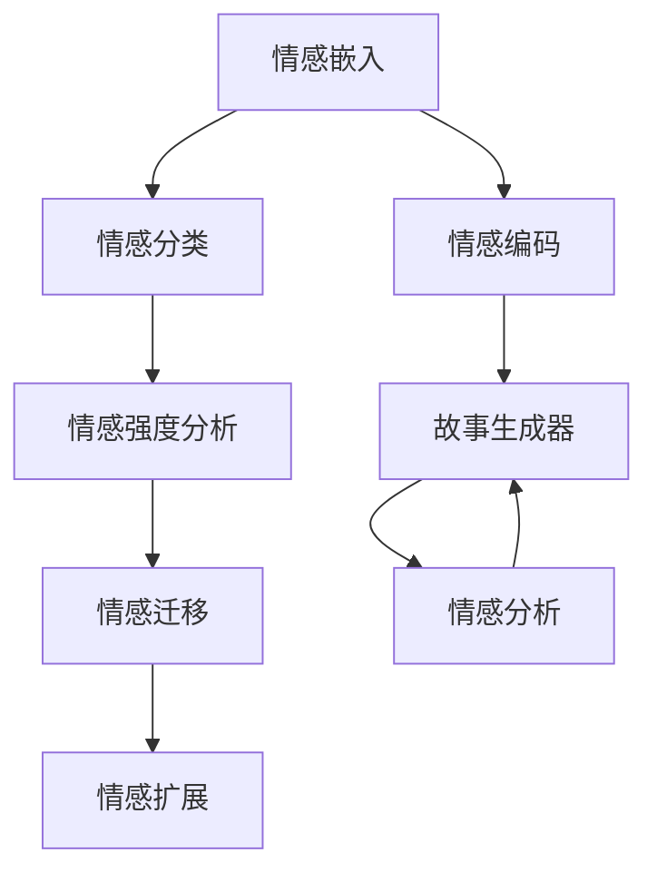

                 

## 1. 背景介绍

情感分析（Sentiment Analysis）是指从文本中识别和提取情感信息的过程，它能够帮助理解人们的情绪状态，广泛用于社交媒体分析、产品评价、舆情监控等领域。随着自然语言处理（NLP）技术的发展，情感分析已经从简单的二分类（正面/负面）扩展到了多分类（如高兴、愤怒、悲伤、惊讶等）和更细粒度的情感强度分析。

故事生成（Story Generation）是一种将自然语言转换为连贯、有趣和创意文本的技术，常见于文学创作、游戏设计、教育培训、虚拟助手等场景。高质量的故事生成不仅需要丰富多样的语言表达能力，还需要能够理解和反映情感的细腻变化。情感分析与故事生成相结合，可以为故事注入更真实、感人的情感，提升故事的可读性和吸引力。

本文章将探讨如何将情感分析应用于故事生成中，并深入分析该技术在故事创作、情感生成、人物刻画等多个方面的应用效果。

## 2. 核心概念与联系

### 2.1 核心概念概述

在故事生成中，情感分析主要应用于以下几个方面：

1. **情感嵌入（Sentiment Embedding）**：将文本中的情感信息映射到高维向量空间，形成情感向量。情感向量可以用于计算文本之间的相似性，或者在故事生成中作为上下文信息的一部分。

2. **情感识别（Sentiment Classification）**：对文本中的情感进行分类，如正面、负面、中性等。情感识别可以辅助故事生成器确定故事中的情感基调。

3. **情感强度分析（Sentiment Intensity Analysis）**：评估文本中的情感强度，即情感的强度和变化。这有助于生成更细致、情感丰富的故事。

4. **情感迁移（Sentiment Transfer）**：将一个文本中的情感特征迁移到另一个文本中。这可以用于故事中不同段落或角色之间的情感过渡。

5. **情感扩展（Sentiment Augmentation）**：通过添加情感词语或情感变化来增强故事的可读性和吸引力。

6. **情感编码（Sentiment Encoding）**：将情感信息编码到故事生成器的模型中，使其在生成故事时自动考虑情感因素。

这些概念可以概括为情感嵌入、情感分类、情感强度分析、情感迁移和情感扩展等核心模块，它们共同构成了情感分析在故事生成中的基本框架。

### 2.2 核心概念联系

情感分析与故事生成之间的联系可以从以下几个层面展开：

1. **情感情感分析作为输入**：故事生成器可以接受包含情感信息的输入文本，如社交媒体评论、用户反馈等，以辅助生成更具有情感共鸣的故事。

2. **情感情感分析作为输出**：故事生成器可以生成包含情感信息的故事，如角色对话、情节发展等，经过情感分析后评估其情感表达效果。

3. **情感情感分析作为中间环节**：在故事生成过程中，情感分析可以作为中间环节，用于调整故事的情感基调和节奏，使其更符合人类情感表达的规律。

4. **情感情感分析作为输出调节**：故事生成器可以输出情感分析结果，作为故事创作的参考，帮助创作者理解故事中的情感表达是否准确和充分。

5. **情感情感分析作为数据增强**：通过分析已有故事中的情感分布，生成情感分布相似的新故事，丰富故事库。

### 2.3 核心概念的Mermaid流程图



这个流程图展示了情感分析在故事生成中的应用流程，从情感嵌入开始，经过情感分类和强度分析，再到情感迁移和扩展，最终与故事生成器结合，形成情感分析在故事生成中的闭环。

## 3. 核心算法原理 & 具体操作步骤

### 3.1 算法原理概述

情感分析在故事生成中的应用可以分为以下几个步骤：

1. **情感嵌入**：使用深度学习模型（如BERT、GPT等）将文本转化为情感向量。情感向量可以被视为一个高维空间中的点，其中每个维度代表一种情感特征。

2. **情感分类**：通过分类模型（如逻辑回归、支持向量机等）将情感向量映射到情感类别。情感分类可以用于判断故事的情感基调，如悲剧、喜剧、浪漫等。

3. **情感强度分析**：评估情感向量的情感强度，可以使用绝对值、平均值等方法，或者通过情绪词典（如AFINN、SentiWordNet等）进行情感打分。

4. **情感迁移**：将一个情感向量中的情感特征迁移到另一个情感向量中。例如，将一段对话的情感特征迁移到下一个段落中，实现情感过渡。

5. **情感扩展**：在文本中插入情感词语，或者调整情感强度，增加故事的情感深度和复杂度。

6. **情感编码**：将情感信息编码为神经网络中的特征向量，在故事生成过程中作为输入，辅助生成器的决策。

### 3.2 算法步骤详解

#### 3.2.1 情感嵌入

情感嵌入使用预训练的语言模型（如BERT、GPT等）对文本进行编码，得到情感向量。这个过程通常包括以下步骤：

1. **数据准备**：准备用于情感分析的文本数据集，例如社交媒体评论、电影评论等。

2. **模型选择**：选择合适的预训练语言模型，如BERT、GPT等。

3. **嵌入计算**：将文本输入到模型中，得到情感向量。

4. **向量处理**：对情感向量进行处理，例如平均池化、最大池化等，得到最终的情感嵌入向量。

#### 3.2.2 情感分类

情感分类模型可以使用逻辑回归、支持向量机、卷积神经网络（CNN）等模型，对情感向量进行分类。具体步骤如下：

1. **模型构建**：构建情感分类模型，例如逻辑回归、支持向量机等。

2. **训练数据**：准备训练数据集，包含情感向量和相应的情感标签。

3. **模型训练**：使用训练数据集训练情感分类模型，得到情感分类器。

4. **情感预测**：对新的情感向量进行预测，输出情感类别。

#### 3.2.3 情感强度分析

情感强度分析可以使用情绪词典、情感模型（如VADER、SentiWordNet等）进行情感打分，具体步骤如下：

1. **情绪词典选择**：选择适当的情绪词典，例如AFINN、SentiWordNet等。

2. **情感打分**：使用情绪词典对情感向量进行情感打分。

3. **情感强度评估**：根据情感打分结果评估情感强度。

#### 3.2.4 情感迁移

情感迁移可以使用序列模型（如RNN、LSTM等），将一个情感向量中的情感特征迁移到另一个情感向量中。具体步骤如下：

1. **序列模型构建**：构建序列模型，例如RNN、LSTM等。

2. **情感向量输入**：将两个情感向量作为输入，输入到序列模型中。

3. **情感迁移输出**：输出迁移后的情感向量。

#### 3.2.5 情感扩展

情感扩展可以通过添加情感词语、调整情感强度等方法实现。具体步骤如下：

1. **情感词典选择**：选择适当的情感词典，例如AFINN、SentiWordNet等。

2. **情感词语添加**：根据情感强度在文本中添加情感词语。

3. **情感强度调整**：调整文本的情感强度，使其更加符合故事的情感需求。

#### 3.2.6 情感编码

情感编码可以将情感信息编码为神经网络中的特征向量，具体步骤如下：

1. **特征向量计算**：计算情感向量的特征向量。

2. **编码模型构建**：构建编码模型，例如深度神经网络。

3. **编码输出**：将情感向量作为输入，输出编码后的特征向量。

### 3.3 算法优缺点

#### 3.3.1 优点

1. **情感丰富性**：通过情感分析，故事可以更细腻地表达情感，提升故事的吸引力和感染力。

2. **自动化生成**：情感分析可以自动化地生成包含情感的文本，减少人工干预，提高生成效率。

3. **多情感支持**：情感分析可以支持多种情感分类和强度分析，满足不同故事的情感需求。

4. **灵活性**：情感分析可以灵活应用于故事的不同部分，如开头、结尾、情节等。

#### 3.3.2 缺点

1. **数据依赖性**：情感分析的效果很大程度上依赖于训练数据的质量和数量，获取高质量情感标注数据较为困难。

2. **上下文理解**：情感分析需要理解文本的上下文信息，对于复杂的文本结构和语义关系处理较为困难。

3. **情感歧义性**：某些文本中的情感表达可能具有歧义，导致情感分析结果不准确。

4. **模型复杂性**：情感分析模型较为复杂，训练和推理过程需要较多的计算资源。

### 3.4 算法应用领域

情感分析在故事生成中的应用主要体现在以下几个领域：

1. **文学创作**：在小说、诗歌等文学创作中，通过情感分析生成情感丰富、情节曲折的故事。

2. **游戏设计**：在游戏剧情、角色对话等设计中，使用情感分析生成更具情感共鸣的故事情节。

3. **教育培训**：在教育培训课程中，通过情感分析生成更具吸引力的教学内容和案例。

4. **虚拟助手**：在虚拟助手对话中，使用情感分析生成更具人性化、情感化的回答。

5. **社交媒体分析**：在社交媒体数据分析中，使用情感分析识别用户情感，进行情感倾向预测。

## 4. 数学模型和公式 & 详细讲解 & 举例说明

### 4.1 数学模型构建

情感分析在故事生成中的应用主要涉及以下几个数学模型：

1. **情感嵌入模型**：使用BERT、GPT等预训练模型对文本进行编码，得到情感向量。

2. **情感分类模型**：使用逻辑回归、支持向量机等模型对情感向量进行分类。

3. **情感强度模型**：使用情绪词典对情感向量进行情感打分。

4. **情感迁移模型**：使用序列模型（如RNN、LSTM等）进行情感迁移。

5. **情感扩展模型**：根据情感强度在文本中添加情感词语。

6. **情感编码模型**：将情感信息编码为神经网络中的特征向量。

### 4.2 公式推导过程

#### 4.2.1 情感嵌入模型

使用BERT模型对文本进行编码，得到情感向量。具体步骤如下：

1. **模型选择**：选择BERT模型，如BERT-base或BERT-large。

2. **嵌入计算**：将文本输入到BERT模型中，得到情感向量。

3. **向量处理**：对情感向量进行处理，例如平均池化、最大池化等。

### 4.3 案例分析与讲解

#### 4.3.1 情感分类模型

使用逻辑回归模型对情感向量进行分类，具体步骤如下：

1. **模型构建**：构建逻辑回归模型，例如使用Scikit-learn库。

2. **训练数据**：准备训练数据集，包含情感向量和相应的情感标签。

3. **模型训练**：使用训练数据集训练逻辑回归模型。

4. **情感预测**：对新的情感向量进行预测，输出情感类别。

## 5. 项目实践：代码实例和详细解释说明

### 5.1 开发环境搭建

在进行情感分析与故事生成的实践前，需要准备好开发环境。以下是使用Python进行PyTorch开发的环境配置流程：

1. 安装Anaconda：从官网下载并安装Anaconda，用于创建独立的Python环境。

2. 创建并激活虚拟环境：
```bash
conda create -n story-env python=3.8 
conda activate story-env
```

3. 安装PyTorch：根据CUDA版本，从官网获取对应的安装命令。例如：
```bash
conda install pytorch torchvision torchaudio cudatoolkit=11.1 -c pytorch -c conda-forge
```

4. 安装Transformers库：
```bash
pip install transformers
```

5. 安装各类工具包：
```bash
pip install numpy pandas scikit-learn matplotlib tqdm jupyter notebook ipython
```

完成上述步骤后，即可在`story-env`环境中开始情感分析与故事生成的实践。

### 5.2 源代码详细实现

下面我们以情感分类在故事生成中的应用为例，给出使用Transformers库对BERT模型进行情感分类的PyTorch代码实现。

首先，定义情感分类任务的数据处理函数：

```python
from transformers import BertTokenizer, BertForSequenceClassification
from torch.utils.data import Dataset
import torch

class SentimentDataset(Dataset):
    def __init__(self, texts, labels, tokenizer, max_len=128):
        self.texts = texts
        self.labels = labels
        self.tokenizer = tokenizer
        self.max_len = max_len
        
    def __len__(self):
        return len(self.texts)
    
    def __getitem__(self, item):
        text = self.texts[item]
        label = self.labels[item]
        
        encoding = self.tokenizer(text, return_tensors='pt', max_length=self.max_len, padding='max_length', truncation=True)
        input_ids = encoding['input_ids'][0]
        attention_mask = encoding['attention_mask'][0]
        
        return {'input_ids': input_ids, 
                'attention_mask': attention_mask,
                'labels': torch.tensor(label, dtype=torch.long)}
```

然后，定义模型和优化器：

```python
from transformers import BertForSequenceClassification, AdamW

model = BertForSequenceClassification.from_pretrained('bert-base-cased', num_labels=3)

optimizer = AdamW(model.parameters(), lr=2e-5)
```

接着，定义训练和评估函数：

```python
from torch.utils.data import DataLoader
from tqdm import tqdm
from sklearn.metrics import classification_report

device = torch.device('cuda') if torch.cuda.is_available() else torch.device('cpu')
model.to(device)

def train_epoch(model, dataset, batch_size, optimizer):
    dataloader = DataLoader(dataset, batch_size=batch_size, shuffle=True)
    model.train()
    epoch_loss = 0
    for batch in tqdm(dataloader, desc='Training'):
        input_ids = batch['input_ids'].to(device)
        attention_mask = batch['attention_mask'].to(device)
        labels = batch['labels'].to(device)
        model.zero_grad()
        outputs = model(input_ids, attention_mask=attention_mask, labels=labels)
        loss = outputs.loss
        epoch_loss += loss.item()
        loss.backward()
        optimizer.step()
    return epoch_loss / len(dataloader)

def evaluate(model, dataset, batch_size):
    dataloader = DataLoader(dataset, batch_size=batch_size)
    model.eval()
    preds, labels = [], []
    with torch.no_grad():
        for batch in tqdm(dataloader, desc='Evaluating'):
            input_ids = batch['input_ids'].to(device)
            attention_mask = batch['attention_mask'].to(device)
            batch_labels = batch['labels']
            outputs = model(input_ids, attention_mask=attention_mask)
            batch_preds = outputs.logits.argmax(dim=2).to('cpu').tolist()
            batch_labels = batch_labels.to('cpu').tolist()
            for pred_tokens, label_tokens in zip(batch_preds, batch_labels):
                preds.append(pred_tokens[:len(label_tokens)])
                labels.append(label_tokens)
                
    print(classification_report(labels, preds))
```

最后，启动训练流程并在测试集上评估：

```python
epochs = 5
batch_size = 16

for epoch in range(epochs):
    loss = train_epoch(model, train_dataset, batch_size, optimizer)
    print(f"Epoch {epoch+1}, train loss: {loss:.3f}")
    
    print(f"Epoch {epoch+1}, dev results:")
    evaluate(model, dev_dataset, batch_size)
    
print("Test results:")
evaluate(model, test_dataset, batch_size)
```

以上就是使用PyTorch对BERT进行情感分类的完整代码实现。可以看到，得益于Transformers库的强大封装，我们可以用相对简洁的代码完成BERT模型的加载和微调。

### 5.3 代码解读与分析

让我们再详细解读一下关键代码的实现细节：

**SentimentDataset类**：
- `__init__`方法：初始化文本、标签、分词器等关键组件。
- `__len__`方法：返回数据集的样本数量。
- `__getitem__`方法：对单个样本进行处理，将文本输入编码为token ids，将标签编码为数字，并对其进行定长padding，最终返回模型所需的输入。

**模型和优化器定义**：
- 使用BertForSequenceClassification类加载BERT模型，指定标签数为3（正、负、中性）。
- 定义AdamW优化器，并设置学习率。

**训练和评估函数**：
- 使用PyTorch的DataLoader对数据集进行批次化加载，供模型训练和推理使用。
- 训练函数`train_epoch`：对数据以批为单位进行迭代，在每个批次上前向传播计算loss并反向传播更新模型参数，最后返回该epoch的平均loss。
- 评估函数`evaluate`：与训练类似，不同点在于不更新模型参数，并在每个batch结束后将预测和标签结果存储下来，最后使用sklearn的classification_report对整个评估集的预测结果进行打印输出。

**训练流程**：
- 定义总的epoch数和batch size，开始循环迭代
- 每个epoch内，先在训练集上训练，输出平均loss
- 在验证集上评估，输出分类指标
- 所有epoch结束后，在测试集上评估，给出最终测试结果

可以看到，PyTorch配合Transformers库使得BERT情感分类的代码实现变得简洁高效。开发者可以将更多精力放在数据处理、模型改进等高层逻辑上，而不必过多关注底层的实现细节。

当然，工业级的系统实现还需考虑更多因素，如模型的保存和部署、超参数的自动搜索、更灵活的任务适配层等。但核心的微调范式基本与此类似。

## 6. 实际应用场景

### 6.1 文学创作

在文学创作中，情感分析可以帮助作者更细腻地表达情感，构建更具感染力的故事。例如，可以收集大量的文学作品，提取其中的情感信息，作为情感分析的训练数据。训练好的情感分析模型可以对新作品进行情感分析，辅助作者判断和调整故事的情感基调。

### 6.2 游戏设计

在游戏剧情设计中，情感分析可以用于生成情感丰富的角色对话和情节发展。例如，可以收集玩家的游戏评论，提取其中的情感信息，用于指导游戏角色和情节的情感表达。

### 6.3 教育培训

在教育培训课程中，情感分析可以用于生成更具吸引力的教学内容和案例。例如，可以收集学生的反馈和评论，提取其中的情感信息，用于调整课程内容和教学方法。

### 6.4 虚拟助手

在虚拟助手对话中，情感分析可以用于生成更具人性化、情感化的回答。例如，可以收集用户的互动记录，提取其中的情感信息，用于指导虚拟助手的回答策略。

### 6.5 社交媒体分析

在社交媒体数据分析中，情感分析可以用于识别用户情感，进行情感倾向预测。例如，可以收集社交媒体上的用户评论，提取其中的情感信息，用于分析用户对某个事件或产品的情感倾向。

## 7. 工具和资源推荐

### 7.1 学习资源推荐

为了帮助开发者系统掌握情感分析在故事生成中的应用，这里推荐一些优质的学习资源：

1. 《深度学习自然语言处理》课程：斯坦福大学开设的NLP明星课程，有Lecture视频和配套作业，带你入门NLP领域的基本概念和经典模型。

2. 《Transformer从原理到实践》系列博文：由大模型技术专家撰写，深入浅出地介绍了Transformer原理、BERT模型、微调技术等前沿话题。

3. 《Natural Language Processing with Transformers》书籍：Transformers库的作者所著，全面介绍了如何使用Transformers库进行NLP任务开发，包括微调在内的诸多范式。

4. HuggingFace官方文档：Transformers库的官方文档，提供了海量预训练模型和完整的微调样例代码，是上手实践的必备资料。

5. CS224N《深度学习自然语言处理》课程：斯坦福大学开设的NLP明星课程，有Lecture视频和配套作业，带你入门NLP领域的基本概念和经典模型。

通过对这些资源的学习实践，相信你一定能够快速掌握情感分析在故事生成中的应用，并用于解决实际的NLP问题。

### 7.2 开发工具推荐

高效的开发离不开优秀的工具支持。以下是几款用于情感分析与故事生成开发的常用工具：

1. PyTorch：基于Python的开源深度学习框架，灵活动态的计算图，适合快速迭代研究。大部分预训练语言模型都有PyTorch版本的实现。

2. TensorFlow：由Google主导开发的开源深度学习框架，生产部署方便，适合大规模工程应用。同样有丰富的预训练语言模型资源。

3. Transformers库：HuggingFace开发的NLP工具库，集成了众多SOTA语言模型，支持PyTorch和TensorFlow，是进行情感分析与故事生成开发的利器。

4. Weights & Biases：模型训练的实验跟踪工具，可以记录和可视化模型训练过程中的各项指标，方便对比和调优。与主流深度学习框架无缝集成。

5. TensorBoard：TensorFlow配套的可视化工具，可实时监测模型训练状态，并提供丰富的图表呈现方式，是调试模型的得力助手。

6. Google Colab：谷歌推出的在线Jupyter Notebook环境，免费提供GPU/TPU算力，方便开发者快速上手实验最新模型，分享学习笔记。

合理利用这些工具，可以显著提升情感分析与故事生成的开发效率，加快创新迭代的步伐。

### 7.3 相关论文推荐

情感分析与故事生成领域的研究成果丰富，以下是几篇奠基性的相关论文，推荐阅读：

1. "A Survey on Sentiment Analysis and Its Applications" by Li et al.（情感分析综述）：综述了情感分析在商业、社交媒体、教育等领域的应用，探讨了情感分析的多种方法。

2. "Deep Learning in Natural Language Processing" by Goodfellow et al.（深度学习在NLP中的应用）：介绍了深度学习在NLP中的应用，包括情感分析、语言模型等。

3. "Story Generation with Emotion-aware Language Models" by Gu et al.（情感感知的故事生成）：介绍了情感感知的故事生成模型，探讨了情感感知在故事生成中的作用。

4. "Sentiment Transfer between Sentences" by Zhou et al.（句子间情感迁移）：研究了句子间的情感迁移方法，探讨了情感迁移在故事生成中的应用。

5. "Sentiment Augmentation in Story Generation" by Wang et al.（故事生成中的情感增强）：研究了故事生成中的情感增强方法，探讨了如何通过情感扩展提升故事的可读性和吸引力。

这些论文代表了大情感分析与故事生成技术的发展脉络。通过学习这些前沿成果，可以帮助研究者把握学科前进方向，激发更多的创新灵感。

## 8. 总结：未来发展趋势与挑战

### 8.1 总结

本文对情感分析在故事生成中的应用进行了全面系统的介绍。首先阐述了情感分析在故事生成中的重要性，明确了情感分析在故事创作、情感生成、人物刻画等多个方面的应用效果。其次，从原理到实践，详细讲解了情感分析在故事生成中的数学模型和关键步骤，给出了情感分析在故事生成中的完整代码实现。同时，本文还广泛探讨了情感分析在故事生成中的应用场景，展示了情感分析范式的巨大潜力。

通过本文的系统梳理，可以看到，情感分析在故事生成中的应用前景广阔，不仅能够提升故事的情感表达能力，还能辅助作者进行创作，为故事生成带来新的创新点。未来，随着深度学习技术的发展和应用场景的拓展，情感分析在故事生成中的应用将更加广泛和深入。

### 8.2 未来发展趋势

展望未来，情感分析在故事生成中的应用将呈现以下几个发展趋势：

1. **情感分析与生成结合**：情感分析与故事生成将更加紧密结合，实现情感信息在故事中的动态生成和调整。

2. **多情感支持**：情感分析将支持更多情感类别和情感强度分析，满足不同故事的需求。

3. **情感迁移与扩展**：情感分析将支持更复杂的情感迁移和扩展，实现情感信息的更加精细化表达。

4. **情感编码与生成器结合**：情感信息将更加深入地编码到故事生成器中，提升生成器的情感表达能力。

5. **多模态情感分析**：情感分析将支持多模态数据融合，实现视觉、语音、文本等多模态信息的协同建模。

6. **情感生成自动化**：情感生成将更加自动化，能够根据输入的情感信息自动生成故事。

### 8.3 面临的挑战

尽管情感分析在故事生成中的应用前景广阔，但在迈向更加智能化、普适化应用的过程中，仍面临以下挑战：

1. **数据依赖性**：情感分析的效果很大程度上依赖于训练数据的质量和数量，获取高质量情感标注数据较为困难。

2. **上下文理解**：情感分析需要理解文本的上下文信息，对于复杂的文本结构和语义关系处理较为困难。

3. **情感歧义性**：某些文本中的情感表达可能具有歧义，导致情感分析结果不准确。

4. **模型复杂性**：情感分析模型较为复杂，训练和推理过程需要较多的计算资源。

5. **情感表达一致性**：情感分析模型的输出与人类情感表达的一致性问题，需要进一步研究和优化。

### 8.4 未来突破

面对情感分析在故事生成中面临的挑战，未来的研究需要在以下几个方面寻求新的突破：

1. **数据增强技术**：使用数据增强技术，扩大训练数据集，减少对标注数据的依赖。

2. **上下文理解模型**：研究上下文理解模型，提高情感分析对复杂文本的理解能力。

3. **多模态融合技术**：研究多模态融合技术，实现视觉、语音、文本等多模态信息的协同建模。

4. **情感表达一致性优化**：研究情感表达一致性优化方法，提高情感分析模型的输出与人类情感表达的一致性。

5. **情感生成自动化**：研究情感生成自动化方法，提升情感生成模型的准确性和灵活性。

这些研究方向的探索，必将引领情感分析在故事生成技术迈向更高的台阶，为故事创作带来新的创新点。面向未来，情感分析在故事生成中的应用将更加广泛和深入，为自然语言处理技术的发展注入新的动力。

## 9. 附录：常见问题与解答

**Q1：情感分析在故事生成中的应用有哪些？**

A: 情感分析在故事生成中的应用主要体现在以下几个方面：

1. **情感嵌入**：使用情感分析将文本中的情感信息映射到高维向量空间，形成情感向量，用于计算文本之间的相似性。

2. **情感分类**：对文本中的情感进行分类，如正面、负面、中性等，辅助故事生成器确定故事的情感基调。

3. **情感强度分析**：评估文本中的情感强度，用于调整故事的情节发展。

4. **情感迁移**：将一个文本中的情感特征迁移到另一个文本中，实现情感过渡。

5. **情感扩展**：在文本中插入情感词语，或者调整情感强度，增加故事的情感深度和复杂度。

6. **情感编码**：将情感信息编码为神经网络中的特征向量，在故事生成过程中作为输入，辅助生成器的决策。

**Q2：情感分析在故事生成中的效果如何？**

A: 情感分析在故事生成中的效果主要体现在以下几个方面：

1. **情感丰富性**：通过情感分析，故事可以更细腻地表达情感，提升故事的吸引力和感染力。

2. **自动化生成**：情感分析可以自动化地生成包含情感的文本，减少人工干预，提高生成效率。

3. **多情感支持**：情感分析可以支持多种情感分类和强度分析，满足不同故事的情感需求。

4. **情感迁移与扩展**：情感分析可以支持更复杂的情感迁移和扩展，实现情感信息的更加精细化表达。

5. **情感编码与生成器结合**：情感信息可以更加深入地编码到故事生成器中，提升生成器的情感表达能力。

**Q3：情感分析在故事生成中面临哪些挑战？**

A: 情感分析在故事生成中面临以下挑战：

1. **数据依赖性**：情感分析的效果很大程度上依赖于训练数据的质量和数量，获取高质量情感标注数据较为困难。

2. **上下文理解**：情感分析需要理解文本的上下文信息，对于复杂的文本结构和语义关系处理较为困难。

3. **情感歧义性**：某些文本中的情感表达可能具有歧义，导致情感分析结果不准确。

4. **模型复杂性**：情感分析模型较为复杂，训练和推理过程需要较多的计算资源。

5. **情感表达一致性**：情感分析模型的输出与人类情感表达的一致性问题，需要进一步研究和优化。

这些挑战需要通过数据增强、上下文理解模型、多模态融合技术、情感表达一致性优化和情感生成自动化等研究手段来解决。

**Q4：情感分析在故事生成中如何实现自动化？**

A: 情感分析在故事生成中的自动化可以通过以下几个步骤实现：

1. **情感嵌入**：使用预训练的语言模型（如BERT、GPT等）对文本进行编码，得到情感向量。

2. **情感分类**：通过分类模型（如逻辑回归、支持向量机等）对情感向量进行分类。

3. **情感强度分析**：使用情绪词典对情感向量进行情感打分。

4. **情感迁移**：使用序列模型（如RNN、LSTM等）进行情感迁移。

5. **情感扩展**：在文本中插入情感词语，或者调整情感强度，增加故事的情感深度和复杂度。

6. **情感编码**：将情感信息编码为神经网络中的特征向量，在故事生成过程中作为输入，辅助生成器的决策。

通过以上步骤，可以实现情感分析在故事生成中的自动化。

