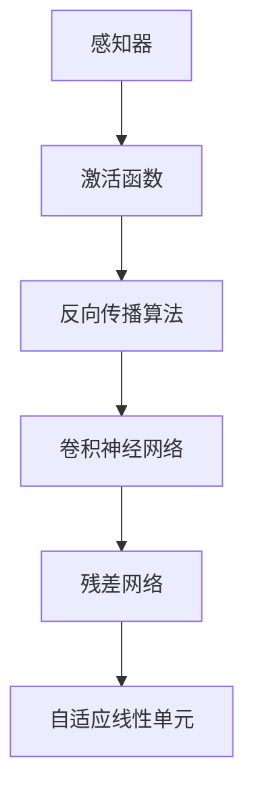

                 

# 感知器到变压器：神经网络的演进

> 关键词：神经网络,感知器,变压器,自适应线性单元,激活函数,深度学习,反向传播算法,卷积神经网络,残差网络

## 1. 背景介绍

### 1.1 问题由来
神经网络作为一种模拟人脑神经元计算的机器学习算法，自从20世纪50年代诞生以来，已经在人工智能领域取得了令人瞩目的成就。最初的神经网络是由生物神经元启发，用以解决感知器问题，即通过简单的线性函数进行二分类任务。随着研究的深入，神经网络逐渐演进为多层结构，能够处理更复杂的非线性任务。而深度学习时代的到来，更是标志着神经网络算法向着更加深入和广泛的应用方向迈进。

## 2. 核心概念与联系

### 2.1 核心概念概述

神经网络是一个包含多个层级的计算模型，其中每一层包含若干个神经元。每个神经元接收输入信号，通过一系列线性变换和激活函数计算后，输出一个信号。神经网络的输入层接收原始数据，隐藏层进行特征提取和变换，输出层输出最终的预测结果。

- 感知器（Perceptron）：最早的神经网络模型，用于解决二分类问题，具有简单的线性决策边界。
- 激活函数（Activation Function）：用于引入非线性性，是神经网络区别于线性回归模型的关键。
- 反向传播算法（Backpropagation）：用于计算神经网络中的梯度，更新模型参数。
- 卷积神经网络（Convolutional Neural Network, CNN）：用于处理图像和语音等高维数据，通过卷积和池化操作提取局部特征。
- 残差网络（Residual Network, ResNet）：用于解决深度神经网络中的梯度消失问题，通过跨层连接构建更加深的神经网络。
- 自适应线性单元（Adaptive Linear Unit, ALU）：一种新型的激活函数，具有较好的数值稳定性和计算效率。

这些核心概念之间的逻辑关系可以通过以下Mermaid流程图来展示：



这个流程图展示了几类经典神经网络模型的演进脉络：

1. 从简单的感知器模型，引入激活函数增加非线性，以解决更复杂的分类任务。
2. 通过反向传播算法，能够进行多层的参数更新，从而构建更深的神经网络。
3. 在图像和语音等高维数据上，使用卷积神经网络进行特征提取，提高模型的泛化能力。
4. 针对深度网络中的梯度消失问题，引入残差网络，使模型能够更深。
5. 最后，引入自适应线性单元，优化神经元计算，进一步提升模型的稳定性和效率。

这些核心概念共同构成了现代神经网络的计算框架，使得神经网络能够处理更加复杂和多样化的任务。

## 3. 核心算法原理 & 具体操作步骤
### 3.1 算法原理概述

神经网络的训练过程可以分为前向传播和反向传播两个阶段。在前向传播阶段，神经网络接收输入数据，通过一系列线性变换和激活函数计算输出。在反向传播阶段，根据输出与真实标签之间的误差，计算梯度并更新模型参数。

以多层感知器（Multi-layer Perceptron, MLP）为例，其算法流程如下：

1. 接收输入数据，进行前向传播计算输出。
2. 计算输出与真实标签之间的误差。
3. 使用反向传播算法计算梯度。
4. 使用梯度下降等优化算法更新模型参数。
5. 重复上述过程直至收敛。

其中，前向传播和反向传播的具体计算流程可以通过数学公式进行详细推导。

### 3.2 算法步骤详解

#### 3.2.1 前向传播

设输入数据 $x \in \mathbb{R}^n$，神经网络的结构为 $(x \rightarrow h \rightarrow y)$，其中 $h$ 为隐藏层的输出。神经元 $j$ 的激活函数为 $f(x)$。则前向传播的过程如下：

$$
h = f(W^1x + b^1)
$$

$$
y = f(W^2h + b^2)
$$

其中 $W^1$ 和 $W^2$ 分别为权重矩阵，$b^1$ 和 $b^2$ 分别为偏置向量。

#### 3.2.2 反向传播

设输出 $y$ 与真实标签 $t$ 之间的误差为 $J(y,t)$，梯度下降算法用于更新模型参数，学习率为 $\eta$。则反向传播的过程如下：

1. 计算输出误差 $J(y,t)$。
2. 计算隐含层误差 $J(h,t)$，使用链式法则将误差传递回隐含层。
3. 计算梯度，根据链式法则计算各个参数的梯度。
4. 更新模型参数 $W$ 和 $b$。

具体的计算公式如下：

$$
\frac{\partial J}{\partial y} = \frac{\partial J}{\partial h} \cdot f'(h)
$$

$$
\frac{\partial J}{\partial h} = \frac{\partial J}{\partial y} \cdot W^2 \cdot f'(h)
$$

$$
\frac{\partial J}{\partial W^2} = \frac{\partial J}{\partial y} \cdot h^T
$$

$$
\frac{\partial J}{\partial b^2} = \frac{\partial J}{\partial y}
$$

$$
\frac{\partial J}{\partial W^1} = \frac{\partial J}{\partial h} \cdot x^T
$$

$$
\frac{\partial J}{\partial b^1} = \frac{\partial J}{\partial h}
$$

其中 $f'$ 为激活函数的导数。

### 3.3 算法优缺点

#### 3.3.1 优点

1. 可处理非线性问题：通过引入非线性激活函数，神经网络可以处理更加复杂的数据分布，解决多维度的分类和回归任务。
2. 自动特征提取：通过多层的堆叠和权重的优化，神经网络能够自动地从原始数据中提取高层次的特征，无需手动设计特征工程。
3. 适用性广泛：神经网络可以应用于图像识别、自然语言处理、语音识别、推荐系统等多种领域，表现出良好的通用性。
4. 具有自适应能力：神经网络可以通过反向传播算法不断更新模型参数，适应新的输入数据和任务需求。

#### 3.3.2 缺点

1. 数据依赖性强：神经网络需要大量的标注数据进行训练，对于数据量不足的任务，可能效果不佳。
2. 计算复杂度高：神经网络参数数量庞大，计算复杂度较高，需要高性能计算资源支持。
3. 容易过拟合：神经网络在训练过程中容易出现过拟合现象，需要使用正则化技术进行控制。
4. 解释性差：神经网络的内部工作机制复杂，难以解释其决策过程，对某些高风险应用领域（如医疗、金融等）可能不适用。

### 3.4 算法应用领域

神经网络在多个领域得到了广泛的应用，包括：

- 图像识别：使用卷积神经网络（CNN）处理图像数据，识别物体、场景和文字等。
- 语音识别：使用深度神经网络处理音频数据，实现语音识别、说话人识别等功能。
- 自然语言处理：使用循环神经网络（RNN）、长短时记忆网络（LSTM）和Transformer等模型，处理文本数据，实现机器翻译、情感分析、问答系统等任务。
- 推荐系统：使用神经网络模型处理用户行为数据，实现个性化推荐。
- 医学诊断：使用神经网络处理医疗数据，辅助医生诊断疾病。
- 自动驾驶：使用神经网络处理传感器数据，实现自动驾驶功能。

## 4. 数学模型和公式 & 详细讲解 & 举例说明

### 4.1 数学模型构建

神经网络可以看作是一个由多个层级组成的计算模型，每一层的输入是上一层的输出。以多层感知器为例，其数学模型如下：

设输入数据 $x \in \mathbb{R}^n$，隐藏层 $h \in \mathbb{R}^m$，输出层 $y \in \mathbb{R}^k$。神经网络的权重矩阵和偏置向量分别为 $W^1 \in \mathbb{R}^{m \times n}$，$W^2 \in \mathbb{R}^{k \times m}$，$b^1 \in \mathbb{R}^m$，$b^2 \in \mathbb{R}^k$。激活函数为 $f(x)$。则多层感知器的数学模型如下：

$$
h = f(W^1x + b^1)
$$

$$
y = f(W^2h + b^2)
$$

### 4.2 公式推导过程

#### 4.2.1 前向传播

假设输入数据 $x \in \mathbb{R}^n$，神经元 $j$ 的激活函数为 $f(x)$。则前向传播的计算过程如下：

$$
z_j^1 = \sum_{i=1}^n W^1_{ij}x_i + b^1_j
$$

$$
h_j = f(z_j^1)
$$

其中 $z_j^1$ 为神经元 $j$ 的输入，$W^1_{ij}$ 为权重矩阵 $W^1$ 的第 $j$ 行第 $i$ 列的元素，$b^1_j$ 为偏置向量 $b^1$ 的第 $j$ 个元素。

#### 4.2.2 反向传播

设输出 $y$ 与真实标签 $t$ 之间的误差为 $J(y,t)$，梯度下降算法用于更新模型参数，学习率为 $\eta$。则反向传播的计算过程如下：

1. 计算输出误差 $J(y,t)$。
2. 计算隐含层误差 $J(h,t)$，使用链式法则将误差传递回隐含层。
3. 计算梯度，根据链式法则计算各个参数的梯度。
4. 更新模型参数 $W$ 和 $b$。

具体的计算公式如下：

$$
\frac{\partial J}{\partial y} = \frac{\partial J}{\partial h} \cdot f'(h)
$$

$$
\frac{\partial J}{\partial h} = \frac{\partial J}{\partial y} \cdot W^2 \cdot f'(h)
$$

$$
\frac{\partial J}{\partial W^2} = \frac{\partial J}{\partial y} \cdot h^T
$$

$$
\frac{\partial J}{\partial b^2} = \frac{\partial J}{\partial y}
$$

$$
\frac{\partial J}{\partial W^1} = \frac{\partial J}{\partial h} \cdot x^T
$$

$$
\frac{\partial J}{\partial b^1} = \frac{\partial J}{\partial h}
$$

其中 $f'$ 为激活函数的导数。

### 4.3 案例分析与讲解

以二分类任务为例，分析神经网络模型的训练过程。

设输入数据 $x \in \mathbb{R}^n$，二分类任务中的输出 $y \in \{0,1\}$，神经网络的输出层使用 sigmoid 激活函数 $f(x) = \frac{1}{1+e^{-x}}$。则神经网络的输出为：

$$
y = f(W^2h + b^2)
$$

其中 $W^2 \in \mathbb{R}^{1 \times m}$，$b^2 \in \mathbb{R}$。

设输出 $y$ 与真实标签 $t$ 之间的误差为 $J(y,t)$，使用二元交叉熵损失函数 $L(y,t) = -\frac{1}{N} \sum_{i=1}^N [t_i\log y_i + (1-t_i)\log (1-y_i)]$，其中 $N$ 为样本数，$t_i \in \{0,1\}$。则神经网络的目标是最小化损失函数 $L(y,t)$。

设神经网络的隐藏层节点数为 $m$，则前向传播的计算过程如下：

1. 计算隐含层输出 $h$：

$$
h = f(W^1x + b^1)
$$

2. 计算输出 $y$：

$$
y = f(W^2h + b^2)
$$

3. 计算损失函数 $L(y,t)$：

$$
L(y,t) = -\frac{1}{N} \sum_{i=1}^N [t_i\log y_i + (1-t_i)\log (1-y_i)]
$$

4. 使用梯度下降算法更新模型参数 $W^1$、$W^2$、$b^1$、$b^2$。

具体的计算过程如下：

1. 计算输出误差 $J(y,t)$：

$$
J(y,t) = \frac{1}{N} \sum_{i=1}^N [t_i\log y_i + (1-t_i)\log (1-y_i)]
$$

2. 计算隐含层误差 $J(h,t)$：

$$
J(h,t) = \frac{\partial J(y,t)}{\partial y} \cdot W^2 \cdot f'(h)
$$

3. 计算梯度：

$$
\frac{\partial J}{\partial W^2} = \frac{\partial J(y,t)}{\partial y} \cdot h^T
$$

$$
\frac{\partial J}{\partial b^2} = \frac{\partial J(y,t)}{\partial y}
$$

$$
\frac{\partial J}{\partial W^1} = \frac{\partial J(y,t)}{\partial h} \cdot x^T
$$

$$
\frac{\partial J}{\partial b^1} = \frac{\partial J(y,t)}{\partial h}
$$

4. 更新模型参数：

$$
W^2 \leftarrow W^2 - \eta\frac{\partial J}{\partial W^2}
$$

$$
b^2 \leftarrow b^2 - \eta\frac{\partial J}{\partial b^2}
$$

$$
W^1 \leftarrow W^1 - \eta\frac{\partial J}{\partial W^1}
$$

$$
b^1 \leftarrow b^1 - \eta\frac{\partial J}{\partial b^1}
$$

其中 $\eta$ 为学习率，通常设置为较小的正数。

## 5. 项目实践：代码实例和详细解释说明

### 5.1 开发环境搭建

在进行神经网络模型开发时，需要搭建相应的开发环境。以下是使用Python和PyTorch搭建环境的步骤：

1. 安装Anaconda：从官网下载并安装Anaconda，用于创建独立的Python环境。

2. 创建并激活虚拟环境：

```bash
conda create -n pytorch-env python=3.8 
conda activate pytorch-env
```

3. 安装PyTorch：根据CUDA版本，从官网获取对应的安装命令。例如：

```bash
conda install pytorch torchvision torchaudio cudatoolkit=11.1 -c pytorch -c conda-forge
```

4. 安装相关工具包：

```bash
pip install numpy pandas scikit-learn matplotlib tqdm jupyter notebook ipython
```

完成上述步骤后，即可在`pytorch-env`环境中开始神经网络模型开发。

### 5.2 源代码详细实现

以下是一个简单的二分类任务的多层感知器模型代码实现：

```python
import torch
import torch.nn as nn
import torch.optim as optim

# 定义模型结构
class MLP(nn.Module):
    def __init__(self, input_size, hidden_size, output_size):
        super(MLP, self).__init__()
        self.fc1 = nn.Linear(input_size, hidden_size)
        self.fc2 = nn.Linear(hidden_size, hidden_size)
        self.fc3 = nn.Linear(hidden_size, output_size)
        self.relu = nn.ReLU()
        
    def forward(self, x):
        x = self.fc1(x)
        x = self.relu(x)
        x = self.fc2(x)
        x = self.relu(x)
        x = self.fc3(x)
        return x

# 定义损失函数和优化器
criterion = nn.CrossEntropyLoss()
optimizer = optim.SGD(model.parameters(), lr=0.01)

# 训练模型
for epoch in range(100):
    running_loss = 0.0
    for i, data in enumerate(trainloader, 0):
        inputs, labels = data
        optimizer.zero_grad()
        outputs = model(inputs)
        loss = criterion(outputs, labels)
        loss.backward()
        optimizer.step()
        running_loss += loss.item()
        if i % 200 == 199:
            print('[%d, %5d] loss: %.3f' % (epoch + 1, i + 1, running_loss / 200))
            running_loss = 0.0

# 测试模型
correct = 0
total = 0
with torch.no_grad():
    for data in testloader:
        images, labels = data
        outputs = model(images)
        _, predicted = torch.max(outputs.data, 1)
        total += labels.size(0)
        correct += (predicted == labels).sum().item()
print('Accuracy of the network on the test images: %d %%' % (100 * correct / total))
```

这段代码定义了一个包含3个全连接层的多层感知器模型，使用交叉熵损失函数和随机梯度下降算法进行训练。在训练过程中，对训练集中的数据进行迭代训练，计算损失函数并更新模型参数。训练完成后，在测试集上评估模型的性能。

### 5.3 代码解读与分析

让我们再详细解读一下关键代码的实现细节：

**MLP类**：
- `__init__`方法：初始化神经网络模型的结构，包含输入层、隐藏层和输出层，以及激活函数。
- `forward`方法：定义前向传播的过程，输入数据通过多层全连接层进行计算，并最终输出预测结果。

**训练过程**：
- 使用`trainloader`迭代训练集数据，对每个数据进行前向传播计算损失函数，并反向传播更新模型参数。
- 使用`testloader`迭代测试集数据，对每个数据进行前向传播计算损失函数，并记录准确率。
- 打印训练过程中的平均损失函数值和测试集上的准确率。

**测试过程**：
- 在测试集上对每个数据进行前向传播计算输出，记录预测结果。
- 比较预测结果和真实标签，计算准确率。

## 6. 实际应用场景

### 6.1 图像识别

神经网络在图像识别领域的应用最为广泛。通过卷积神经网络（CNN），能够有效处理图像数据，提取特征并识别物体。例如，Google的Inception网络、Microsoft的ResNet等，都是经典的大规模图像识别模型。

在实际应用中，图像识别技术可以应用于安全监控、医学影像诊断、无人驾驶等多个领域。例如，通过识别人脸、车牌等特征，实现身份验证、车辆识别等功能。

### 6.2 自然语言处理

神经网络在自然语言处理领域也得到了广泛应用。通过循环神经网络（RNN）、长短时记忆网络（LSTM）和Transformer等模型，能够处理文本数据，实现机器翻译、情感分析、问答系统等功能。

例如，Facebook的GPT-3模型、Google的BERT模型等，都是目前最先进的自然语言处理模型。这些模型可以用于智能客服、舆情监测、智能写作等多个领域，提升语言处理的智能化水平。

### 6.3 语音识别

神经网络在语音识别领域也表现出色。通过深度神经网络处理音频数据，实现语音识别、说话人识别等功能。例如，Google的WaveNet模型、微软的DeepSpeech模型等，都是经典的大规模语音识别模型。

在实际应用中，语音识别技术可以应用于智能音箱、语音助手、电话客服等多个领域，提升人机交互的便捷性和自然性。

### 6.4 未来应用展望

神经网络在未来的发展方向主要包括以下几个方面：

1. 更深更宽的网络：随着计算资源的不断提升，神经网络的规模将越来越大，深度和宽度不断增加，以处理更加复杂和多样的任务。
2. 多模态融合：神经网络将逐渐拓展到视觉、语音、文本等多模态数据处理，实现跨模态信息融合，提升系统的综合能力。
3. 自适应学习：神经网络将逐渐具备自适应学习能力，能够根据环境变化和用户反馈进行动态调整，实现更加智能的决策。
4. 迁移学习：神经网络将逐渐具备迁移学习能力，能够将知识迁移到不同的任务和场景，提升系统的泛化能力。
5. 对抗性学习：神经网络将逐渐具备对抗性学习能力，能够识别并抵抗恶意攻击和噪声干扰，提升系统的鲁棒性。

这些发展方向将使得神经网络在未来更加智能、灵活和可靠，为人工智能技术在各个领域的应用提供更加坚实的技术支撑。

## 7. 工具和资源推荐

### 7.1 学习资源推荐

为了帮助开发者系统掌握神经网络的理论基础和实践技巧，这里推荐一些优质的学习资源：

1. 《深度学习》书籍：Ian Goodfellow等人著，全面介绍了深度学习的基本原理和算法。
2. 《Python深度学习》书籍：Francois Chollet著，介绍了TensorFlow和Keras等深度学习框架的使用。
3. Coursera《深度学习》课程：由Andrew Ng教授开设，系统讲解了深度学习的核心概念和应用。
4. Stanford CS231n课程：介绍了计算机视觉中的深度学习技术，包括卷积神经网络、残差网络等。
5. arXiv.org：深度学习领域的顶级学术期刊，发表了大量前沿研究成果和论文。

通过对这些资源的学习实践，相信你一定能够快速掌握神经网络的理论基础和实践技巧，并用于解决实际的NLP问题。

### 7.2 开发工具推荐

高效的开发离不开优秀的工具支持。以下是几款用于神经网络模型开发的常用工具：

1. TensorFlow：由Google主导开发的开源深度学习框架，生产部署方便，适合大规模工程应用。
2. PyTorch：由Facebook主导开发的开源深度学习框架，灵活动态的计算图，适合快速迭代研究。
3. Keras：基于TensorFlow和Theano的高级深度学习框架，易于上手，适合初学者使用。
4. Jupyter Notebook：开源的交互式编程环境，支持代码实时展示和调试，适合数据分析和机器学习任务。
5. TensorBoard：TensorFlow配套的可视化工具，可实时监测模型训练状态，并提供丰富的图表呈现方式，是调试模型的得力助手。

合理利用这些工具，可以显著提升神经网络模型的开发效率，加快创新迭代的步伐。

### 7.3 相关论文推荐

神经网络在深度学习领域已经取得了巨大的成就，以下是几篇奠基性的相关论文，推荐阅读：

1. He, K., Zhang, X., Ren, S., & Sun, J. (2016). Deep residual learning for image recognition. In Proceedings of the IEEE conference on computer vision and pattern recognition (pp. 770-778).
2. Sutskever, I., Vinyals, O., & Le, Q. V. (2014). Sequence to sequence learning with neural networks. In Advances in neural information processing systems (pp. 3104-3112).
3. Goodfellow, I., Bengio, Y., & Courville, A. (2016). Deep learning. MIT Press.
4. Kingma, D. P., & Ba, J. L. (2014). Adam: A method for stochastic optimization. In International Conference on Learning Representations (ICLR).
5. Hinton, G. E., Osindero, S., & Teh, Y. W. (2006). A fast learning algorithm for deep belief nets. Neural Computation, 18(7), 1527-1554.

这些论文代表了大神经网络的发展脉络。通过学习这些前沿成果，可以帮助研究者把握学科前进方向，激发更多的创新灵感。

## 8. 总结：未来发展趋势与挑战

### 8.1 总结

本文对神经网络的发展历程和核心概念进行了系统介绍。从感知器到变压器，神经网络经历了多次技术革新和算法演进，逐渐成为人工智能领域的核心技术。通过对神经网络的学习和实践，相信你一定能够掌握其核心原理和实际应用，并用于解决实际的NLP问题。

### 8.2 未来发展趋势

神经网络在未来的发展方向主要包括以下几个方面：

1. 更深更宽的网络：随着计算资源的不断提升，神经网络的规模将越来越大，深度和宽度不断增加，以处理更加复杂和多样的任务。
2. 多模态融合：神经网络将逐渐拓展到视觉、语音、文本等多模态数据处理，实现跨模态信息融合，提升系统的综合能力。
3. 自适应学习：神经网络将逐渐具备自适应学习能力，能够根据环境变化和用户反馈进行动态调整，实现更加智能的决策。
4. 迁移学习：神经网络将逐渐具备迁移学习能力，能够将知识迁移到不同的任务和场景，提升系统的泛化能力。
5. 对抗性学习：神经网络将逐渐具备对抗性学习能力，能够识别并抵抗恶意攻击和噪声干扰，提升系统的鲁棒性。

这些发展方向将使得神经网络在未来更加智能、灵活和可靠，为人工智能技术在各个领域的应用提供更加坚实的技术支撑。

### 8.3 面临的挑战

尽管神经网络在各个领域取得了巨大的成功，但仍然面临着诸多挑战：

1. 计算资源消耗大：神经网络需要大量的计算资源进行训练和推理，对硬件设备的要求较高。
2. 数据依赖性强：神经网络需要大量的标注数据进行训练，数据获取成本较高。
3. 模型复杂度高：神经网络结构复杂，难以理解和调试，模型的可解释性较差。
4. 泛化能力有限：神经网络在训练过程中容易过拟合，泛化能力有限，对新数据的适应能力较弱。
5. 对抗性攻击风险：神经网络容易受到对抗性攻击的影响，模型的鲁棒性较差。

### 8.4 研究展望

未来的神经网络研究需要从以下几个方面进行突破：

1. 计算效率优化：通过算法改进和硬件优化，降低神经网络的计算复杂度，提升训练和推理效率。
2. 数据生成技术：通过生成对抗网络（GAN）等技术，生成大规模无标注数据，降低对标注数据的需求。
3. 模型可解释性：通过知识图谱、逻辑规则等技术，增强神经网络的可解释性，提高模型的可信度。
4. 对抗性攻击防御：通过鲁棒优化、对抗训练等技术，提升神经网络的鲁棒性，抵御对抗性攻击。
5. 跨领域迁移：通过迁移学习、自适应学习等技术，提升神经网络在不同领域和场景下的泛化能力。

这些研究方向的探索，将使得神经网络在未来更加智能、灵活和可靠，为人工智能技术在各个领域的应用提供更加坚实的技术支撑。

## 9. 附录：常见问题与解答

**Q1：神经网络的结构和参数有哪些？**

A: 神经网络的结构包含输入层、隐藏层和输出层。其中，隐藏层包含若干个神经元，每个神经元接收上一层的输出，并通过权重矩阵和偏置向量进行线性变换和激活函数计算，最终输出到下一层。神经网络的参数包括权重矩阵和偏置向量，是神经网络进行学习和预测的关键。

**Q2：神经网络的激活函数有哪些？**

A: 神经网络的激活函数包括sigmoid函数、ReLU函数、tanh函数、Softmax函数等。其中，ReLU函数是最常用的激活函数，具有计算速度快、非线性能力强等优点。

**Q3：神经网络的反向传播算法具体是怎样计算的？**

A: 神经网络的反向传播算法通过链式法则计算每个参数的梯度。具体步骤如下：
1. 计算输出误差。
2. 计算隐含层误差，将误差从输出层传递回隐含层。
3. 计算梯度，根据链式法则计算各个参数的梯度。
4. 更新模型参数。

**Q4：神经网络有哪些优点和缺点？**

A: 神经网络的优点包括：
1. 可处理非线性问题。
2. 自动特征提取。
3. 适用性广泛。
4. 具有自适应能力。

神经网络的缺点包括：
1. 数据依赖性强。
2. 计算复杂度高。
3. 容易过拟合。
4. 可解释性差。

**Q5：神经网络在实际应用中如何部署？**

A: 神经网络的实际应用需要考虑模型裁剪、量化加速、服务化封装、弹性伸缩、监控告警、安全防护等多个方面。具体步骤如下：
1. 将神经网络模型封装为API接口。
2. 使用容器化技术（如Docker）部署模型。
3. 使用GPU/TPU等高性能设备进行推理加速。
4. 使用负载均衡技术实现弹性伸缩。
5. 使用日志和监控工具进行模型监控。
6. 使用安全措施（如数据脱敏、访问控制）保障模型安全。

通过这些步骤，可以将神经网络模型部署到生产环境中，提供稳定的服务。

---

作者：禅与计算机程序设计艺术 / Zen and the Art of Computer Programming

