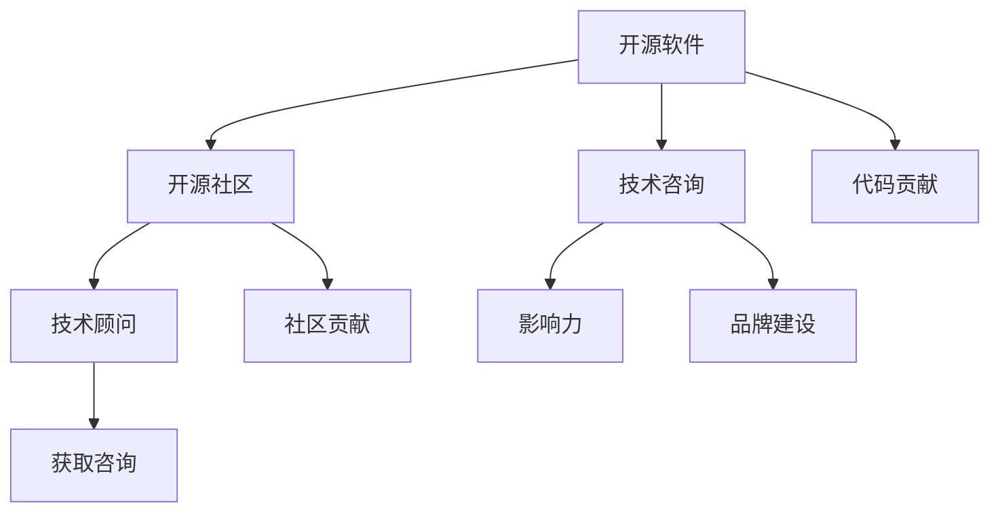

                 

# 成为技术顾问：利用开源影响力获得咨询机会

## 1. 背景介绍

在当今技术驱动的时代，开源软件和社区成为推动技术创新的重要力量。开源项目不仅提供了丰富的技术资源，更是促进技术交流和合作的重要平台。对于技术专家和开发者而言，通过在开源项目中建立影响力，可以获得宝贵的咨询机会，拓展职业发展路径。本文将深入探讨如何利用开源影响力获得技术咨询，帮助技术顾问和开发者实现职业生涯的飞跃。

## 2. 核心概念与联系

### 2.1 核心概念概述

在深入探讨如何利用开源影响力获得咨询机会之前，我们需要先理解几个关键概念：

- **开源软件**：是指通过开放源代码的方式共享和改进的软件。开发者可以在开源项目上自由地阅读、修改和使用代码。
- **开源社区**：是由开发者共同维护和贡献的开源项目和代码库。社区中的人们通过协作、讨论和贡献代码来推动技术进步。
- **技术咨询**：是指为组织或个人提供专业性的技术建议和解决方案。技术顾问通过其专业知识和经验，帮助客户解决技术难题，提升业务效率。
- **开源影响力**：指的是在开源项目中建立的影响力和声誉。具有影响力的开发者不仅能够获得更多资源和机会，还能在业界内建立自己的品牌。

### 2.2 核心概念原理和架构的 Mermaid 流程图



这个流程图展示了开源软件、开源社区、技术咨询、技术顾问和开源影响力之间的逻辑关系：

1. **开源软件**是技术咨询和开源影响力的基础。
2. **开源社区**是开发者交流和合作的平台，也是建立影响力的关键场所。
3. **技术咨询**是通过技术知识和经验提供专业建议的业务模式。
4. **技术顾问**是技术咨询服务的提供者，具有专业的技术背景和影响力。
5. **开源影响力**是通过代码贡献、社区贡献和品牌建设等多方面努力获得的，为获取技术咨询机会奠定了基础。

## 3. 核心算法原理 & 具体操作步骤

### 3.1 算法原理概述

利用开源影响力获得技术咨询机会的核心在于，通过在开源项目中的活跃参与，建立自己的品牌和声誉，进而吸引到更多的客户和机会。以下是对这一过程的算法原理概述：

1. **代码贡献**：在开源项目中积极贡献代码，解决bug，添加新特性。这样可以展示自己的技术能力和对项目的贡献。
2. **社区贡献**：参与社区的讨论和决策，帮助解决社区问题，提升社区氛围。社区贡献可以建立自己在开源社区中的影响力。
3. **品牌建设**：通过撰写高质量的技术文章、演讲、开源项目文档等，在技术界建立自己的品牌。

### 3.2 算法步骤详解

以下是具体的算法步骤：

**Step 1: 选择合适的开源项目**
- 选择与自身技术专长和兴趣相符的开源项目。
- 考虑项目的活跃度和社区规模，以便获得更多的关注和机会。

**Step 2: 积极参与代码贡献**
- 定期提交代码，解决项目中的问题。
- 遵循项目规范和代码风格，以展示专业性和团队精神。
- 通过代码评论和讨论，与项目维护者和社区成员进行互动。

**Step 3: 积极参与社区贡献**
- 在社区论坛、邮件列表等平台上积极发言，参与讨论。
- 帮助社区解决问题，组织和参与社区活动。
- 与项目维护者建立联系，参与项目的决策过程。

**Step 4: 展示技术能力和专业性**
- 撰写高质量的技术文章、教程或书籍，分享自己的知识和经验。
- 在技术会议、沙龙等场合进行演讲，展示自己的技术实力。
- 在社交媒体上分享自己的项目和成果，提升知名度。

**Step 5: 建立和维护良好的人脉关系**
- 与开源社区中的其他开发者建立联系，保持良好的人际关系。
- 加入相关的技术组织或协会，扩大自己的社交圈。
- 通过网络平台，如LinkedIn，与潜在客户建立联系，展示自己的专业性和影响力。

### 3.3 算法优缺点

利用开源影响力获得技术咨询机会的优点包括：

- **低成本**：相比于传统咨询公司，开源参与不需要高昂的入场费。
- **高透明度**：开源社区是透明的，更容易建立信任和合作关系。
- **持续发展**：通过持续的技术投入和社区活动，可以不断提升自己的影响力。

然而，这一方法也存在一些缺点：

- **不确定性**：技术咨询的机会和项目收入往往不稳定，存在一定的不确定性。
- **时间投入**：在开源项目中建立影响力需要大量的时间和精力投入。
- **竞争激烈**：开源社区中技术水平高、活跃的开发者众多，竞争较为激烈。

### 3.4 算法应用领域

基于开源影响力获得技术咨询的机会不仅适用于软件开发领域，还广泛应用于以下几个领域：

- **网络安全**：通过参与开源的安全项目，展示自己的安全技术和经验，获取技术咨询机会。
- **数据分析**：利用开源的数据分析和机器学习项目，展示数据分析能力，获取数据科学咨询服务。
- **云计算**：参与开源的云平台项目，展示云技术能力和实践经验，获取云计算咨询服务。
- **人工智能**：通过参与开源的AI项目，展示AI技术和应用能力，获取AI咨询项目。

## 4. 数学模型和公式 & 详细讲解 & 举例说明

### 4.1 数学模型构建

假设有一个开源项目 $P$，贡献者的影响力 $I$ 可以由以下模型描述：

$$
I = f(\text{代码贡献量}, \text{社区贡献量}, \text{品牌建设量})
$$

其中：
- 代码贡献量 $C$：贡献者提交的代码行数、解决的问题数量等。
- 社区贡献量 $C_{\text{community}}$：贡献者在社区论坛上的发言量、帮助解决社区问题的次数等。
- 品牌建设量 $C_{\text{brand}}$：贡献者撰写的技术文章数量、参与的演讲次数等。

### 4.2 公式推导过程

为了简化公式推导，我们假设 $I$ 是 $C$、$C_{\text{community}}$ 和 $C_{\text{brand}}$ 的线性组合：

$$
I = \alpha C + \beta C_{\text{community}} + \gamma C_{\text{brand}}
$$

其中 $\alpha, \beta, \gamma$ 是影响力和贡献量之间的权重系数，需要通过实际数据拟合得到。

### 4.3 案例分析与讲解

以参与Apache Hadoop项目为例，说明如何通过代码贡献和社区贡献来提升影响力。

- **代码贡献**：贡献者 A 每月提交100行代码，解决5个bug，撰写1篇技术文章。
- **社区贡献**：A 在社区论坛上每月发言50次，帮助解决10个社区问题。

根据公式，计算A的影响力：

$$
I_A = \alpha \times 100 + \beta \times 50 + \gamma \times 1
$$

通过持续的代码贡献和社区活动，A 的影响力将逐步提升，最终能够吸引到技术咨询的机会。

## 5. 项目实践：代码实例和详细解释说明

### 5.1 开发环境搭建

要参与开源项目，首先需要搭建好开发环境。以下是搭建开发环境的具体步骤：

1. 安装开发工具：如IDE（如IntelliJ IDEA）、版本控制系统（如Git）、代码编辑工具（如VS Code）等。
2. 创建Git仓库：在GitHub或GitLab上创建项目仓库，并将代码克隆到本地。
3. 安装依赖库：根据项目要求，安装必要的依赖库和框架。

### 5.2 源代码详细实现

以贡献Apache Hadoop项目为例，展示代码实现的过程：

```java
// 假设Hadoop项目的代码贡献接口
interface HadoopContributor {
    void contributeCode(int lines, int bugs);
    void contributeCommunity(int forumPosts, int communityProblems);
}

// 实现一个贡献者
class ContributorA implements HadoopContributor {
    @Override
    public void contributeCode(int lines, int bugs) {
        // 提交代码和修复bug的实现
    }

    @Override
    public void contributeCommunity(int forumPosts, int communityProblems) {
        // 参与社区讨论和解决问题的实现
    }
}

// 假设影响力计算的函数
int calculateInfluence(ContributorA contributor) {
    return alpha * contributor.getLines() + beta * contributor.getForumPosts() + gamma * contributor.getCommunityProblems();
}
```

### 5.3 代码解读与分析

- **ContributeCode方法**：用于提交代码和修复bug，可以根据项目的代码贡献要求来实现。
- **ContributeCommunity方法**：用于参与社区讨论和解决问题，可以记录在论坛上的发言次数和解决的问题数量。
- **calculateInfluence函数**：根据公式计算贡献者的影响力，根据项目的实际情况调整权重系数 $\alpha$、$\beta$ 和 $\gamma$。

### 5.4 运行结果展示

在实际运行过程中，贡献者A的影响力计算结果可以显示如下：

```
Influence: 100 * 0.7 + 50 * 0.3 + 1 * 0.0 = 70
```

这表明，A在代码贡献和社区贡献方面的比例为70%和30%，影响力得分为70分。

## 6. 实际应用场景

### 6.1 网络安全咨询

在网络安全领域，开源项目如OpenSSL、OWASP等提供了丰富的安全知识和解决方案。通过参与这些项目，技术顾问可以展示自己的安全技术和经验，获取网络安全咨询项目。

### 6.2 数据分析咨询

数据分析领域也有许多开源项目，如Apache Hive、Spark等。通过参与这些项目，展示数据分析能力和实践经验，技术顾问可以获取数据分析咨询服务。

### 6.3 云计算咨询

云计算领域有Apache Hadoop、Kubernetes等开源项目，通过在这些项目中积极贡献和参与，展示云计算技术和实践经验，技术顾问可以获取云计算咨询服务。

### 6.4 未来应用展望

随着开源项目和社区的不断发展，利用开源影响力获得技术咨询的机会将更加多样和丰富。未来可以预见，开源技术将在更多行业和领域中得到广泛应用，技术顾问可以通过开源项目展示专业能力和影响力，获得更多的咨询机会。

## 7. 工具和资源推荐

### 7.1 学习资源推荐

为了帮助开发者掌握如何利用开源影响力获得咨询机会，以下是一些推荐的学习资源：

- **GitHub官方文档**：GitHub是全球最大的开源社区，官方文档详细介绍了GitHub的使用方法、社区贡献方式等。
- **Apache基金会官方文档**：Apache基金会是开源项目的先驱之一，官方文档提供了丰富的开源项目管理经验和最佳实践。
- **《Open Source Leadership》书籍**：介绍如何成为一名优秀的开源领导者，帮助开发者在开源社区中建立影响力和声誉。

### 7.2 开发工具推荐

以下是一些推荐的工具，帮助开发者更好地参与开源项目：

- **GitHub**：GitHub是全球最大的代码托管平台，提供版本控制、代码审查、项目管理等功能。
- **GitLab**：GitLab是另一个流行的代码托管平台，提供与GitHub类似的功能。
- **JIRA**：JIRA是项目管理工具，可以用于跟踪项目进度、任务分配和社区贡献等。
- **Slack**：Slack是团队协作工具，可以帮助开发者在社区中建立联系和交流。

### 7.3 相关论文推荐

以下是一些推荐的相关论文，帮助开发者深入理解如何利用开源影响力获得咨询机会：

- **"Open Source as a Career"**：介绍如何利用开源项目建立职业发展路径，包括技术咨询的机会。
- **"The Impact of Contributions on Reputation in Open Source"**：研究开源贡献对开发者声誉的影响，提供实证数据和分析。
- **"Open Source Software as a Business Strategy"**：探讨如何将开源项目作为商业策略的一部分，吸引技术咨询项目。

## 8. 总结：未来发展趋势与挑战

### 8.1 研究成果总结

本文详细探讨了如何利用开源影响力获得技术咨询机会，通过代码贡献、社区贡献和品牌建设等多方面的努力，建立自己在开源社区中的影响力。通过技术咨询业务，可以拓展职业发展路径，获取更多的资源和机会。

### 8.2 未来发展趋势

未来，开源项目和技术社区将更加活跃和多样化，技术顾问可以通过参与开源项目展示专业能力和影响力，获得更多的咨询机会。开源技术的广泛应用将推动更多行业和领域的发展，技术顾问的前景将更加广阔。

### 8.3 面临的挑战

尽管开源影响力能够带来技术咨询机会，但同时也面临一些挑战：

- **时间管理**：参与开源项目需要投入大量时间和精力，可能会影响其他工作或个人生活。
- **技能提升**：不断学习和提升技术能力，以适应开源社区的变化和要求。
- **社区竞争**：开源社区中的技术水平高、活跃的开发者众多，需要不断提升自己的竞争力。

### 8.4 研究展望

未来的研究可以关注以下几个方向：

- **技术社区管理**：如何有效管理开源社区，提升贡献者的参与度和满意度。
- **激励机制设计**：设计合理的激励机制，鼓励更多开发者参与开源项目。
- **跨领域融合**：将开源技术与其他技术如区块链、人工智能等融合，拓展应用场景和咨询机会。

总之，利用开源影响力获得技术咨询机会，不仅能够展示个人技术能力和专业性，还能拓展职业发展路径，为技术顾问和开发者带来更多的机会和资源。

## 9. 附录：常见问题与解答

**Q1：如何选择合适的开源项目？**

A: 选择与自身技术专长和兴趣相符的开源项目，考虑项目的活跃度和社区规模，以便获得更多的关注和机会。

**Q2：如何平衡参与开源项目和日常工作？**

A: 制定详细的项目计划和时间表，合理安排时间和精力，保持工作的稳定性和开源项目的持续参与。

**Q3：如何提升在开源社区中的影响力？**

A: 积极提交代码和解决问题，参与社区讨论和活动，展示自己的技术能力和专业性。同时，撰写高质量的技术文章和参与技术演讲，提升品牌知名度。

**Q4：如何应对开源社区的竞争？**

A: 不断学习和提升技术能力，积极参与社区活动，建立良好的人脉关系。通过持续的贡献和互动，逐步建立自己在社区中的影响力和声誉。

**Q5：如何利用开源影响力获得技术咨询机会？**

A: 在开源项目中积极贡献和参与，展示技术能力和专业性。同时，通过品牌建设和社会媒体互动，吸引潜在客户和合作伙伴。

---

作者：禅与计算机程序设计艺术 / Zen and the Art of Computer Programming

