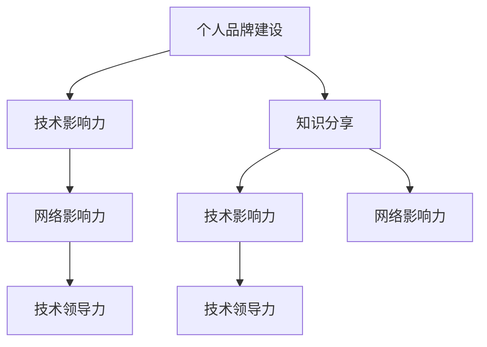

                 

# 打造个人IP：技术影响力的关键

> 关键词：个人品牌建设, 技术影响力, 网络影响力, 技术领导力, 知识分享

## 1. 背景介绍

在当今数字化时代，个人IP（Persona Intelligent Property）不仅是一种商业策略，更是一个重要的职业发展方向。技术影响力的打造，需要技术专家不仅具备扎实的专业知识，还需要在公开场合展示自我，构建品牌，扩大影响。技术影响力不只是专业的深度，也包括对技术的热爱、对问题的独特见解，以及分享技术的热情。

本文将从背景介绍开始，逐步深入探讨如何通过技术影响力的打造，构建个人品牌，提升网络影响力，最终成为技术领域的领导者。

## 2. 核心概念与联系

### 2.1 核心概念概述

在打造个人IP的过程中，几个核心概念尤为重要：

- **个人品牌建设**：通过自我展示，将自己定位为某一领域内的专家，形成独特的个人风格和品牌形象。
- **技术影响力**：在技术社区、同行和业界人士中，通过专业知识和技术分享获得尊重和认可。
- **网络影响力**：通过社交媒体、博客、技术论坛等平台，建立广泛的网络关系，扩大影响。
- **技术领导力**：不仅在技术上领先，还能够在团队管理和项目领导上发挥作用，成为团队的"头羊"。
- **知识分享**：通过书籍、博客、视频、公开演讲等方式，分享自己的技术知识和见解，不断传播价值。

这些概念之间相互关联，共同构建了技术专家的影响力网络。个人品牌的建立，需要持续的知识分享和技术领导；而技术影响力则来源于知识分享和实际工作的成就；网络影响力则是技术影响力在社交媒体的扩展；领导力则需要技术影响力为基础，并展现出团队管理的能力。

### 2.2 核心概念原理和架构的 Mermaid 流程图



这个流程图展示了个人IP建设过程中各个概念之间的联系：

1. 个人品牌建设是起点，通过展示专业知识和个性魅力，吸引关注。
2. 技术影响力基于个人品牌的建立和持续的知识分享，形成技术社区的认同。
3. 网络影响力是技术影响力的扩展，通过社交媒体等平台形成更广泛的影响。
4. 技术领导力则是技术影响力的应用，转化为团队管理和项目领导的能力。

## 3. 核心算法原理 & 具体操作步骤

### 3.1 算法原理概述

打造个人IP的算法原理主要包括内容创作和社交互动两个方面。内容创作侧重于知识分享和问题解决，而社交互动则关注于网络关系构建和品牌传播。

内容创作的主要目标是产出有价值的技术文章、开源项目、技术博客、技术演讲等内容，这些内容需要具备深度、广度和影响力。社交互动则关注于在技术社区和社交媒体上积极互动，扩大影响力。

### 3.2 算法步骤详解

以下是打造个人IP的核心算法步骤：

1. **内容创作**：
   - 确定专业领域：选择精通的领域作为个人品牌的核心。
   - 持续产出内容：定期发布技术文章、开源代码、技术演讲等。
   - 深度分析问题：通过文章和演讲解决实际问题，展示专业能力。
   - 互动与反馈：通过评论、问答、社交媒体互动获取反馈，改进内容。

2. **社交互动**：
   - 建立网络关系：加入技术社区、参与技术讨论、关注行业大咖。
   - 分享技术见解：通过社交媒体、博客、技术论坛等平台分享技术见解。
   - 参与公开活动：参加技术会议、在线研讨会、技术直播等，展示专业形象。
   - 主动联系同行：与同行建立联系，互相推荐和合作。

### 3.3 算法优缺点

#### 优点：

1. **专业影响力**：持续的知识分享和技术领导可以显著提升在技术社区中的影响力。
2. **广泛的联系**：通过社交互动，建立更广泛的人际网络，获得更多的合作机会。
3. **个人品牌**：通过展示专业知识和独特见解，构建独特的个人品牌形象。
4. **项目机会**：技术影响力有助于获得更多的工作机会和项目资源。

#### 缺点：

1. **时间和精力投入大**：持续的内容创作和社交互动需要大量的时间和精力。
2. **竞争激烈**：技术领域竞争激烈，打造个人IP需要持续的努力和创新。
3. **不确定性高**：技术发展迅速，需要不断学习和更新，以保持领先。
4. **需求高**：需要具备全面的技术能力、良好的沟通能力和时间管理能力。

### 3.4 算法应用领域

个人IP的打造可以在多个领域应用：

1. **技术公司**：在技术公司内部，通过技术领导和知识分享，提升自己在团队和公司的影响力。
2. **创业公司**：创业者可以通过打造个人品牌，吸引投资者和客户，推动公司发展。
3. **教育机构**：教育工作者可以通过技术分享和课程设计，提升教学效果和学术影响力。
4. **开源社区**：开源贡献者和社区领袖可以通过技术贡献和领导能力，扩大社区的影响力。
5. **顾问和咨询公司**：咨询师通过技术专业知识和行业见解，提升咨询服务的影响力。

## 4. 数学模型和公式 & 详细讲解 & 举例说明

### 4.1 数学模型构建

在打造个人IP的过程中，数学模型可以帮助量化影响力和优化策略。我们可以使用以下模型：

- **影响力增长模型**：$I(t) = f(S(t), C(t))$，其中 $I(t)$ 为时间 $t$ 的影响力，$S(t)$ 为社交互动活跃度，$C(t)$ 为内容创作质量。
- **时间复利模型**：$I(t) = I_0 (1 + r)^t$，其中 $I_0$ 为初始影响力，$r$ 为影响力增长率，$t$ 为时间。

### 4.2 公式推导过程

1. **影响力增长模型推导**：
   - 假设社交互动活跃度 $S(t)$ 随时间增长，可以表示为 $S(t) = S_0 e^{k_1 t}$，其中 $S_0$ 为初始活跃度，$k_1$ 为增长率。
   - 假设内容创作质量 $C(t)$ 随时间增长，可以表示为 $C(t) = C_0 e^{k_2 t}$，其中 $C_0$ 为初始质量，$k_2$ 为增长率。
   - 将 $S(t)$ 和 $C(t)$ 代入 $I(t)$ 的公式，得 $I(t) = f(S_0 e^{k_1 t}, C_0 e^{k_2 t})$。
   
2. **时间复利模型推导**：
   - 影响力增长率 $r$ 可以表示为 $r = \sqrt{k_1 k_2}$。
   - 代入 $I(t)$ 的公式，得 $I(t) = I_0 (\sqrt{k_1 k_2})^t$。

### 4.3 案例分析与讲解

以GitHub上的开源项目为例，一个项目的贡献者通过持续提交高质量代码、参与社区讨论、撰写技术博客等方式，影响力会随着时间的增长而增加。我们可以使用上述模型来预测其影响力的增长情况。

## 5. 项目实践：代码实例和详细解释说明

### 5.1 开发环境搭建

为了便于技术影响力的实践，我们需要搭建一个多平台开发环境。

1. **操作系统选择**：
   - 操作系统可以选择Linux或Windows，以适应不同的开发平台。
   - 安装必要的开发工具，如Python、Git等。

2. **开发工具安装**：
   - 安装Python，建议选择3.9以上版本，以获得更好的兼容性和性能。
   - 安装Git，用于版本控制和代码管理。
   - 安装Jupyter Notebook，用于编写和分享技术博客。
   - 安装Markdown编辑器，用于编写技术文档。

### 5.2 源代码详细实现

以下是一个简单的技术分享博客的实现过程：

```python
# 导入必要的库
import matplotlib.pyplot as plt
import numpy as np

# 定义影响力增长模型
def influence_growth(S0, k1, C0, k2, t):
    return S0 * np.exp(k1 * t) * C0 * np.exp(k2 * t)

# 假设参数
S0 = 100
k1 = 0.1
C0 = 1000
k2 = 0.05
t = np.arange(0, 365, 1)

# 计算影响力随时间的变化
I = influence_growth(S0, k1, C0, k2, t)

# 绘制影响力随时间变化的曲线
plt.plot(t, I, label='Influence Growth')
plt.xlabel('Time (days)')
plt.ylabel('Influence')
plt.legend()
plt.show()
```

这个示例展示了如何使用Python实现影响力增长模型，并绘制了影响力随时间变化的曲线。

### 5.3 代码解读与分析

1. **代码实现**：
   - 导入必要的库，包括Matplotlib和Numpy，用于绘图和计算。
   - 定义影响力增长模型函数，接受初始社交活跃度、增长率、初始内容创作质量、增长率和时间的参数。
   - 使用假设的参数值，计算影响力随时间的变化。
   - 绘制影响力随时间变化的曲线，展示其增长趋势。

2. **分析与解释**：
   - 通过绘图，可以看出影响力随着时间的增长而逐渐增加，社交活跃度和内容创作质量对影响力的增长都有正面影响。
   - 可以通过调整参数值，探索不同因素对影响力的影响。

## 6. 实际应用场景

### 6.1 技术博客

技术博客是展示技术影响力的重要平台。通过撰写深度技术文章，可以吸引大量技术爱好者和同行关注，提升个人品牌。

1. **选择平台**：
   - 选择合适的博客平台，如Medium、GitHub Pages等，保证内容的可访问性和展示效果。
   - 定期发布文章，保持更新，吸引更多读者。

2. **内容创作**：
   - 确定专业领域，深入研究和写作，提供有价值的见解。
   - 使用清晰的标题和结构，使文章易于阅读和分享。
   - 使用图表和代码示例，增加文章的可信度和互动性。

### 6.2 开源贡献

开源贡献可以通过实际的项目展示技术实力，扩大影响力。

1. **选择项目**：
   - 选择一个感兴趣的开源项目，了解其社区规则和技术栈。
   - 阅读项目文档，了解项目的代码结构和问题。

2. **贡献代码**：
   - 提交高质量的代码，修复已知问题和提交新功能。
   - 参与社区讨论，回答其他贡献者的疑问。
   - 提交代码时，使用详细的注释和测试用例，提高代码质量。

### 6.3 技术演讲

技术演讲是展示技术影响力的有效方式，可以吸引更多的关注和互动。

1. **选择平台**：
   - 选择技术演讲平台，如Meetup、Zoom等，加入技术社区，参与相关活动。
   - 准备演讲内容，选择感兴趣的主题，深入研究，制作PPT和演示视频。

2. **互动交流**：
   - 在演讲结束后，与听众互动，回答疑问，建立联系。
   - 发布演讲视频和PPT，扩大影响范围。

## 7. 工具和资源推荐

### 7.1 学习资源推荐

1. **在线课程**：
   - Coursera上的《技术写作与影响力》课程，教你如何撰写高质量的技术文章。
   - Udemy上的《技术领导力与影响力》课程，讲解如何通过技术领导提升影响力。

2. **书籍推荐**：
   - 《黑客与画家》（Paul Graham）：关于技术工作、创业和个人品牌的经典书籍。
   - 《未来简史》（尤瓦尔·赫拉利）：探索技术对人类社会的深远影响。

3. **博客和网站**：
   - Medium：技术写作和分享的社区平台。
   - GitHub Pages：免费的技术博客托管服务，适合展示开源项目和技术文章。

### 7.2 开发工具推荐

1. **代码编辑器**：
   - Visual Studio Code：功能强大的代码编辑器，支持多种编程语言。
   - Atom：基于Web的开源代码编辑器，灵活可定制。

2. **版本控制**：
   - Git：广泛使用的版本控制系统，支持代码协作和版本管理。
   - GitHub/GitLab：流行的代码托管平台，支持代码协作和项目管理。

### 7.3 相关论文推荐

1. **技术影响力研究**：
   - "Network Science: Measurements, Methods, and Theories of Complex Networks"（Newman）：网络科学的经典之作，研究技术社区的网络结构和影响力传播。
   - "Social Networks and Collective Behavior"（Castells）：关于社会网络和集体行为的研究，解释技术影响力的形成机制。

2. **技术领导力研究**：
   - "The Five Dysfunctions of a Team"（Patrick Lencioni）：关于团队管理和领导力的经典书籍，探讨技术领导的关键要素。
   - "Leaders Eat Last"（Simon Sinek）：关于领导力和影响力的经典书籍，强调团队精神和个人责任感。

## 8. 总结：未来发展趋势与挑战

### 8.1 研究成果总结

本文从背景介绍、核心概念与联系、核心算法原理、数学模型和公式、项目实践、实际应用场景、工具和资源推荐、总结和展望等方面，全面介绍了打造个人IP的技术影响力构建过程。

### 8.2 未来发展趋势

1. **技术影响力的增强**：随着社交媒体和数字平台的普及，技术影响力将越来越重要，技术专家可以通过多渠道展示自我，扩大影响。
2. **多平台融合**：技术影响力的打造将越来越多地融合到线上和线下，通过线上平台展示技术能力，线下活动建立深度联系。
3. **技术领导力的提升**：技术专家需要在技术能力和领导能力上进行双向提升，成为团队和项目的核心驱动力。
4. **知识分享的普及**：技术分享将更加普及和常态化，技术专家可以通过多种方式，持续传递技术价值。

### 8.3 面临的挑战

1. **时间和精力的管理**：打造个人IP需要大量时间和精力，如何高效管理时间和任务是重要挑战。
2. **技术的持续更新**：技术发展迅速，需要不断学习和更新，保持技术领先。
3. **社交互动的深度**：社交互动需要深度和广度，如何建立有价值的人际网络是关键。
4. **影响力的平衡**：如何在商业利益和个人价值观之间找到平衡，避免影响力的滥用。

### 8.4 研究展望

未来的研究将关注以下几个方面：

1. **技术影响力模型**：研究如何通过数学模型量化技术影响力，预测影响力增长趋势。
2. **技术领导力模型**：探讨技术领导力的构成要素，建立领导力评估体系。
3. **多渠道传播**：研究如何通过多渠道展示技术影响力，最大化传播效果。
4. **技术社区的演化**：研究技术社区的结构和演化规律，指导技术专家选择合适的社区参与方式。

通过不断探索和研究，技术专家可以更好地构建个人IP，提升技术影响力，实现职业发展的突破。

## 9. 附录：常见问题与解答

**Q1: 如何平衡商业利益和个人价值观？**

A: 技术专家需要在商业利益和个人价值观之间找到平衡，通过明确职业目标和价值观，制定合理的发展策略，避免影响力的滥用。

**Q2: 如何高效管理时间和精力？**

A: 使用时间管理工具如Todoist、Trello等，设定优先级，合理分配时间。同时，优化工作流程，提高工作效率。

**Q3: 如何持续学习和更新技术？**

A: 参加技术社区活动，如Meetup、GitHub等，持续关注行业动态。同时，利用在线学习平台如Coursera、Udemy等，进行系统学习。

**Q4: 如何建立有价值的人际网络？**

A: 通过社交媒体平台如LinkedIn、Twitter等，积极参与技术讨论和互动。同时，参加技术会议、研讨会等活动，建立深度联系。

总之，打造个人IP需要持续的努力和创新，通过技术影响力的构建，技术专家可以扩大影响，实现职业发展的新高度。通过不断学习和实践，掌握技术领导力和知识分享的关键，成为技术领域的佼佼者。

---

作者：禅与计算机程序设计艺术 / Zen and the Art of Computer Programming

