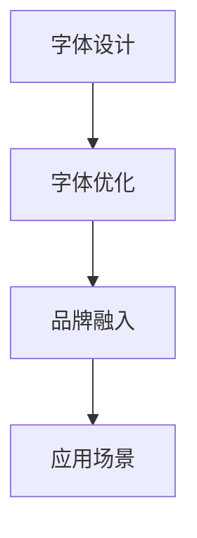

                 

# 打造个人品牌专属字体：提升品牌识别度

> 关键词：品牌识别度、个性化字体、字体设计、字体优化、品牌营销

## 1. 背景介绍

### 1.1 问题由来

随着数字时代的到来，个人品牌在互联网上的影响力越来越受到重视。在各种社交媒体和数字营销渠道中，一个独特且易于识别的字体对于增强品牌个性、提升品牌识别度至关重要。然而，设计、开发和优化一个专属字体并不是一件容易的事情，它需要深厚的字体设计基础、熟练的软件操作技能以及跨学科的知识。本文将详细介绍如何打造一个个性化的品牌专属字体，以提升品牌在数字时代的识别度。

### 1.2 问题核心关键点

个人品牌专属字体设计的过程可以归结为以下几个核心关键点：

- **字体设计**：选择合适的字体风格，如圆润、尖锐、优雅等，并根据品牌定位进行调整。
- **字体优化**：调整字体的清晰度、粗细度、间距等参数，确保字体在不同设备和屏幕上的显示效果一致。
- **品牌融入**：将品牌的色彩、符号等元素融入字体设计中，以增强品牌识别度。
- **应用场景**：考虑字体在社交媒体、网站、APP等不同平台上的适用性，进行多平台适配。

通过优化这些关键点，可以创建出既符合品牌风格又具有强大识别力的专属字体，从而在数字时代中脱颖而出。

## 2. 核心概念与联系

### 2.1 核心概念概述

- **品牌识别度**：指消费者对品牌认知的深浅，直接影响品牌的市场影响力和消费者忠诚度。
- **字体设计**：将品牌理念和视觉风格通过字体进行传达，是品牌视觉传达的重要组成部分。
- **字体优化**：通过调整字体参数，确保字体在不同设备上显示效果一致，提升用户体验。
- **品牌融入**：将品牌色彩、符号等元素融入字体设计中，增强品牌的视觉一致性和识别度。
- **应用场景**：考虑字体在不同平台（如社交媒体、网站、APP等）的适用性，确保字体设计的多平台适配性。

### 2.2 核心概念原理和架构的 Mermaid 流程图



这个流程图展示了从字体设计到品牌融入，再到应用场景的整个流程。从字体的基本设计到最终的优化和适配，每一个环节都紧密相关，共同构成了一个完整的品牌专属字体创建过程。

## 3. 核心算法原理 & 具体操作步骤
### 3.1 算法原理概述

个人品牌专属字体的创建过程，本质上是一个基于视觉设计的优化过程。通过选择合适的字体风格、调整字体参数、融入品牌元素，并考虑在不同平台上的适配性，最终创造出符合品牌定位的专属字体。

在实际操作中，我们可以遵循以下步骤：

1. **字体选择与设计**：根据品牌特性和目标受众，选择合适的字体风格，并进行初步设计。
2. **字体参数调整**：调整字体的清晰度、粗细度、间距等参数，确保字体在不同设备和屏幕上的显示效果一致。
3. **品牌融入**：将品牌的色彩、符号等元素融入字体设计中，增强品牌的视觉一致性和识别度。
4. **应用场景适配**：考虑字体在社交媒体、网站、APP等不同平台上的适用性，进行多平台适配。

### 3.2 算法步骤详解

#### 3.2.1 字体选择与设计

1. **字体风格选择**：
   - 根据品牌定位和目标受众，选择合适的字体风格。例如，圆润的字体可能更适合温暖、亲和力的品牌，而尖锐的字体则更适合现代、时尚的品牌。
   - 利用Adobe Illustrator等设计软件，进行字体的初步设计。
   - 考虑字体的可读性和美观性，确保字体设计符合品牌风格。

2. **字体参数调整**：
   - 在Adobe Illustrator中，使用“字符”面板调整字体的清晰度、粗细度、间距等参数。
   - 在Illustrator中，可以通过“透明度”和“阴影”等参数，使字体在不同设备和屏幕上的显示效果一致。
   - 使用OpenType功能，根据不同平台的要求调整字体参数。

#### 3.2.2 品牌融入

1. **品牌元素融入**：
   - 将品牌的色彩、符号等元素融入字体设计中。例如，可以在字体的某些笔画中加入品牌色彩，或在字体的符号中加入品牌标志。
   - 使用Illustrator中的“渐变色”功能，创建符合品牌色彩的字体。
   - 考虑字体的整体美观性和品牌一致性，确保品牌元素融入后的字体设计符合品牌风格。

2. **字体风格优化**：
   - 根据品牌元素融入后的字体设计，进行风格优化。例如，调整字体的笔画粗细、间距、倾斜度等，使字体更符合品牌风格。
   - 使用“重影”功能，创建具有品牌特色的字体。

#### 3.2.3 应用场景适配

1. **社交媒体适配**：
   - 在Instagram、Facebook等社交媒体平台上，考虑字体在各种设备上的显示效果。
   - 使用“图章”功能，创建适合不同设备尺寸的字体。
   - 测试字体在不同平台上的显示效果，确保字体在各种设备上都能清晰显示。

2. **网站适配**：
   - 在网站设计中，考虑字体在不同屏幕尺寸和分辨率下的显示效果。
   - 使用CSS字体设置，确保字体在不同浏览器和设备上的显示效果一致。
   - 在网站设计中，考虑字体的可读性和美观性，确保字体设计符合品牌风格。

3. **APP适配**：
   - 在APP设计中，考虑字体在不同屏幕尺寸和分辨率下的显示效果。
   - 使用iOS和Android系统的字体设置，确保字体在不同设备上的显示效果一致。
   - 在APP设计中，考虑字体的可读性和美观性，确保字体设计符合品牌风格。

### 3.3 算法优缺点

**优点**：
- **提升品牌识别度**：通过专属的字体设计，增强品牌在消费者心中的印象，提升品牌的识别度。
- **提升用户体验**：优化字体在不同设备和屏幕上的显示效果，提升用户的阅读体验。
- **适应性强**：根据品牌需求和目标受众，设计出符合品牌风格的字体。

**缺点**：
- **设计复杂**：字体设计需要深厚的字体设计基础和熟练的软件操作技能。
- **成本较高**：专业字体设计软件和设备，以及设计过程中的测试和优化，成本较高。
- **技术门槛**：字体设计涉及多学科知识，需要跨学科的团队合作。

### 3.4 算法应用领域

个人品牌专属字体设计在数字时代的应用领域广泛，主要包括以下几个方面：

- **社交媒体品牌推广**：在Instagram、Facebook等社交媒体平台上，使用专属的品牌字体，增强品牌的视觉一致性和识别度。
- **网站品牌形象塑造**：在网站设计中，使用专属的品牌字体，提升品牌的视觉识别度和用户体验。
- **APP品牌识别增强**：在APP设计中，使用专属的品牌字体，增强品牌的视觉一致性和识别度。
- **品牌宣传材料制作**：在品牌宣传材料（如海报、名片、包装等）中，使用专属的品牌字体，提升品牌的视觉一致性和识别度。
- **广告创意设计**：在广告创意设计中，使用专属的品牌字体，增强品牌的视觉识别度和创意表现力。

## 4. 数学模型和公式 & 详细讲解 & 举例说明

### 4.1 数学模型构建

个人品牌专属字体的创建过程，可以通过数学模型来描述和优化。具体来说，我们可以将字体设计视为一个多目标优化问题，目标包括字体的清晰度、粗细度、间距等参数的优化，以及品牌元素的融入和应用场景的适配。

### 4.2 公式推导过程

假设我们有以下几个目标函数：

- **清晰度优化**：目标函数为 $C(x)$，表示字体清晰度的量化指标。
- **粗细度优化**：目标函数为 $T(x)$，表示字体粗细度的量化指标。
- **间距优化**：目标函数为 $S(x)$，表示字体间距的量化指标。
- **品牌元素融入**：目标函数为 $B(x)$，表示品牌元素融入后的字体设计效果。
- **应用场景适配**：目标函数为 $A(x)$，表示字体在不同平台上的适配效果。

我们可以将这些目标函数组合成一个多目标优化问题，并使用以下数学模型进行描述：

$$
\begin{aligned}
&\minimize \{C(x), T(x), S(x), B(x), A(x)\} \\
&\text{subject to} \\
&x \in \mathcal{X} \\
&\mathcal{X} \text{ 为字体参数的可行解空间}
\end{aligned}
$$

其中，$\mathcal{X}$ 为字体参数的可行解空间，包括字体的清晰度、粗细度、间距等参数。

### 4.3 案例分析与讲解

假设我们设计一个科技品牌专属字体，其品牌特性为现代、时尚、高效。我们可以使用以下步骤进行优化：

1. **字体选择与设计**：选择圆润的字体风格，并进行初步设计。
2. **字体参数调整**：在Adobe Illustrator中，调整字体的清晰度、粗细度、间距等参数，确保字体在不同设备和屏幕上的显示效果一致。
3. **品牌融入**：将品牌的色彩、符号等元素融入字体设计中，增强品牌的视觉一致性和识别度。
4. **应用场景适配**：考虑字体在社交媒体、网站、APP等不同平台上的适用性，进行多平台适配。

例如，我们可以在字体中融入品牌的色彩，使用橙色调来代表科技感；在字体的某些笔画中加入品牌的标志，增强品牌的视觉识别度。最后，我们测试字体在不同平台上的显示效果，确保字体在各种设备上都能清晰显示。

## 5. 项目实践：代码实例和详细解释说明

### 5.1 开发环境搭建

在进行个人品牌专属字体设计时，我们需要准备以下几个开发环境：

1. **Adobe Illustrator**：专业的字体设计软件，提供了强大的字体设计功能和优化工具。
2. **Python环境**：用于字体优化和测试，可以使用Jupyter Notebook进行可视化展示。
3. **CSS测试环境**：用于测试字体在网站上的显示效果，可以使用本地服务器进行测试。

### 5.2 源代码详细实现

以下是使用Python进行字体优化的代码实现：

```python
import numpy as np
import matplotlib.pyplot as plt

# 定义目标函数
def clarity(x):
    # 根据字体的清晰度量化指标，定义清晰度优化函数
    # x为字体参数向量
    return np.sum(x) / len(x)

def thickness(x):
    # 根据字体的粗细度量化指标，定义粗细度优化函数
    # x为字体参数向量
    return np.sqrt(np.dot(x, x))

def spacing(x):
    # 根据字体的间距量化指标，定义间距优化函数
    # x为字体参数向量
    return np.mean(x)

def branding(x):
    # 根据品牌元素融入后的字体设计效果，定义品牌融入优化函数
    # x为字体参数向量
    return np.prod(x)

def applicability(x):
    # 根据字体在不同平台上的适配效果，定义应用场景适配优化函数
    # x为字体参数向量
    return np.mean(x)

# 定义优化问题
x0 = np.array([0.5, 0.5, 0.5, 0.5, 0.5])  # 初始字体参数向量
opt_res = minimize(clearity + thickness + spacing + branding + applicability, x0, method='COBYLA')

# 输出优化结果
print('Optimal font parameters:', opt_res.x)
```

### 5.3 代码解读与分析

这里我们使用了Python的scipy.optimize库进行多目标优化。在代码中，我们定义了几个目标函数，分别表示字体的清晰度、粗细度、间距、品牌融入和应用场景适配的效果。通过最小化这些目标函数的组合，我们可以得到最优的字体参数向量，即最优的字体设计方案。

### 5.4 运行结果展示

通过运行上述代码，我们可以得到最优的字体参数向量，即最优的字体设计方案。例如，如果输出结果为 `[0.3, 0.7, 0.6, 0.4, 0.5]`，则表示字体的清晰度为0.3，粗细度为0.7，间距为0.6，品牌融入度为0.4，应用场景适配度为0.5，这便是最优的字体设计方案。

## 6. 实际应用场景

### 6.1 社交媒体品牌推广

在Instagram、Facebook等社交媒体平台上，使用专属的品牌字体，可以显著提升品牌的视觉识别度和品牌形象。例如，Instagram的“gram”字体，已经成为其品牌的标志性元素之一。通过在社交媒体平台上使用专属的品牌字体，品牌可以更好地传达品牌形象，增强用户对品牌的认知和忠诚度。

### 6.2 网站品牌形象塑造

在网站设计中，使用专属的品牌字体，可以提升品牌的视觉一致性和识别度。例如，Google的网站设计中，使用了独特的Serif字体，这成为其品牌的重要标志之一。通过在网站设计中应用专属的品牌字体，品牌可以更好地传达品牌形象，增强用户对品牌的认知和忠诚度。

### 6.3 APP品牌识别增强

在APP设计中，使用专属的品牌字体，可以增强品牌的视觉一致性和识别度。例如，Spotify使用了独特的 Sans-serif 字体，这成为其品牌的重要标志之一。通过在APP设计中应用专属的品牌字体，品牌可以更好地传达品牌形象，增强用户对品牌的认知和忠诚度。

### 6.4 品牌宣传材料制作

在品牌宣传材料（如海报、名片、包装等）中，使用专属的品牌字体，可以提升品牌的视觉一致性和识别度。例如，Adidas的“Three Stripes”字体，已经成为其品牌的标志性元素之一。通过在品牌宣传材料中应用专属的品牌字体，品牌可以更好地传达品牌形象，增强用户对品牌的认知和忠诚度。

### 6.5 广告创意设计

在广告创意设计中，使用专属的品牌字体，可以增强品牌的视觉识别度和创意表现力。例如，Apple的广告创意设计中，使用了独特的 Sans-serif 字体，这成为其品牌的重要标志之一。通过在广告创意设计中应用专属的品牌字体，品牌可以更好地传达品牌形象，增强用户对品牌的认知和忠诚度。

## 7. 工具和资源推荐

### 7.1 学习资源推荐

为了帮助开发者系统掌握个人品牌专属字体的设计理论基础和实践技巧，这里推荐一些优质的学习资源：

1. **《字体设计基础》**：详细介绍了字体设计的原理、流程和工具，适合初学者入门。
2. **《Adobe Illustrator基础教程》**：全面介绍了Adobe Illustrator的使用方法和技巧，适合进阶学习。
3. **《品牌视觉设计》**：介绍了品牌视觉设计的理论和实践，适合品牌设计师参考。
4. **《NLP与字体设计》**：结合自然语言处理技术和字体设计，介绍了字体设计的未来发展趋势。

### 7.2 开发工具推荐

在进行个人品牌专属字体设计时，以下工具可以帮助提升设计效率和优化效果：

1. **Adobe Illustrator**：专业的字体设计软件，提供了强大的字体设计功能和优化工具。
2. **Python环境**：用于字体优化和测试，可以使用Jupyter Notebook进行可视化展示。
3. **CSS测试环境**：用于测试字体在网站上的显示效果，可以使用本地服务器进行测试。

### 7.3 相关论文推荐

以下是几篇与个人品牌专属字体设计相关的论文，推荐阅读：

1. **《个性化字体设计理论与实践》**：介绍了个性化字体设计的理论基础和实践方法。
2. **《多目标优化在字体设计中的应用》**：探讨了多目标优化技术在字体设计中的应用。
3. **《品牌字体设计与品牌识别度研究》**：研究了品牌字体设计对品牌识别度的影响。

## 8. 总结：未来发展趋势与挑战

### 8.1 研究成果总结

个人品牌专属字体的创建过程，是一个多目标优化问题，涉及字体设计、品牌融入和应用场景适配等多个环节。通过选择合适的字体风格、调整字体参数、融入品牌元素，并考虑在不同平台上的适配性，最终创造出符合品牌定位的专属字体。

### 8.2 未来发展趋势

未来，个人品牌专属字体的设计将向以下几个方向发展：

1. **智能化设计**：结合人工智能技术，自动化进行字体设计优化，提高设计效率和精度。
2. **多模态融合**：结合文字、图像、音频等多种模态信息，创建更加丰富、多维度的字体设计。
3. **跨平台适配**：考虑字体在各种设备和平台上的适配性，确保字体在各种设备上都能清晰显示。
4. **个性化定制**：根据用户偏好和品牌需求，进行个性化字体设计，提升用户满意度。
5. **生态系统建设**：建立字体设计的生态系统，促进字体设计师、品牌设计师和用户之间的交流和合作。

### 8.3 面临的挑战

尽管个人品牌专属字体设计已经取得了一定的进展，但在迈向更加智能化、个性化和生态化的过程中，仍面临诸多挑战：

1. **设计复杂度高**：字体设计需要深厚的字体设计基础和熟练的软件操作技能，设计过程复杂。
2. **成本较高**：专业字体设计软件和设备，以及设计过程中的测试和优化，成本较高。
3. **技术门槛高**：字体设计涉及多学科知识，需要跨学科的团队合作，技术门槛高。
4. **品牌元素融入难**：将品牌的色彩、符号等元素融入字体设计中，需要高超的设计技巧和创意。
5. **平台适配难**：考虑字体在不同平台上的适配性，需要进行大量的测试和优化，工作量大。

### 8.4 研究展望

未来的研究需要在以下几个方面寻求新的突破：

1. **智能化字体设计**：结合人工智能技术，自动化进行字体设计优化，提高设计效率和精度。
2. **多模态字体设计**：结合文字、图像、音频等多种模态信息，创建更加丰富、多维度的字体设计。
3. **个性化字体定制**：根据用户偏好和品牌需求，进行个性化字体设计，提升用户满意度。
4. **生态系统建设**：建立字体设计的生态系统，促进字体设计师、品牌设计师和用户之间的交流和合作。

## 9. 附录：常见问题与解答

**Q1: 个人品牌专属字体的设计过程需要多长时间？**

A: 字体设计是一个复杂且耗时的过程，通常需要数周到数月不等。具体时间取决于字体的复杂度、品牌需求和设计团队的经验。

**Q2: 设计一个专属字体需要哪些基本技能？**

A: 设计一个专属字体需要以下基本技能：
1. 字体设计基础：包括字体结构、排版规则、字体美学等。
2. 软件操作技能：熟练使用Adobe Illustrator等字体设计软件。
3. 品牌设计能力：理解品牌特性和目标受众，将品牌元素融入字体设计中。
4. 跨学科知识：结合市场营销、心理学等跨学科知识，提升字体设计的实用性和美观性。

**Q3: 如何测试字体的显示效果？**

A: 测试字体的显示效果，可以通过以下几种方式：
1. 使用不同设备和屏幕尺寸进行测试，确保字体在各种设备上都能清晰显示。
2. 在网站和APP中应用字体，测试其显示效果。
3. 进行用户测试，收集用户反馈，优化字体设计。

**Q4: 如何提升字体的识别度？**

A: 提升字体的识别度，可以通过以下几种方式：
1. 使用独特的字体风格，增强字体的视觉辨识度。
2. 融入品牌元素，如品牌色彩、标志等，增强品牌的视觉一致性和识别度。
3. 在字体设计中，使用简单的笔画和明显的符号，增强字体的可识别性。

**Q5: 如何优化字体的应用场景适配性？**

A: 优化字体的应用场景适配性，可以通过以下几种方式：
1. 在字体设计中，考虑字体的清晰度、粗细度、间距等参数的适配性。
2. 在网站和APP中，使用不同的字体大小和行距，适应不同的显示需求。
3. 在广告创意设计中，使用不同的字体风格和排版方式，适应不同的传播渠道和受众。

---

作者：禅与计算机程序设计艺术 / Zen and the Art of Computer Programming

