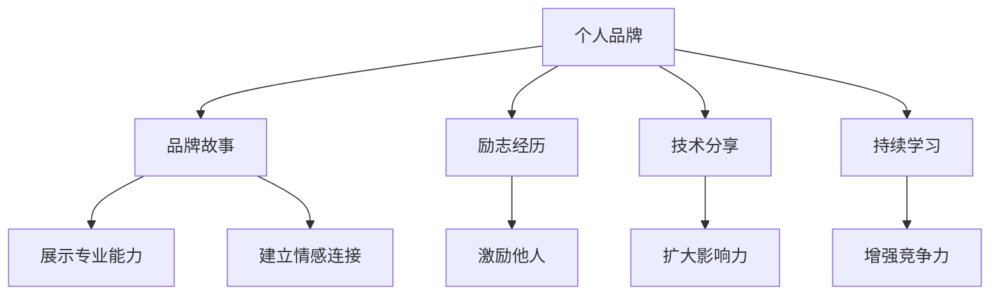

                 

# 打造个人品牌故事：让你的经历成为励志范本

> 关键词：个人品牌，品牌故事，励志经历，职业发展，影响力，技术分享，持续学习

## 1. 背景介绍

### 1.1 问题由来

在当今快速发展的技术领域中，个人品牌的故事不仅仅是一个人的成就，更是一段值得分享、激励他人的经历。随着互联网和社交媒体的普及，个人品牌的影响力越来越大。无论你是技术人员、创业者还是初入职场的新手，一个鲜明、积极的个人品牌不仅能提升你的职业竞争力，还能让你在行业中脱颖而出。然而，打造一个有影响力的个人品牌并非易事，需要深思熟虑、精心规划和持续努力。本文将带你深入了解个人品牌故事的构建，帮助你将个人经历转化为励志范本。

### 1.2 问题核心关键点

构建个人品牌故事的核心理念在于，将你的专业技能、职业经历和个人价值观融入到一个独特、有吸引力的叙述中，使其能够激励他人，同时展示你的专业能力和潜力。以下是构建个人品牌故事的关键点：

- **专业技能展示**：通过技术博客、开源项目和讲座等形式，展示你的专业技能和知识储备。
- **职业经历分享**：分享你在职业发展中的关键时刻，包括挑战和突破，以展现你的成长历程。
- **个人价值观传达**：通过你的行为和决策，传递你的价值观和信仰，建立与读者的情感连接。
- **持续学习和成长**：展示你对技术的持续学习热情和未来的职业规划，表明你是一个不断进步的个体。

## 2. 核心概念与联系

### 2.1 核心概念概述

为了更好地理解如何打造个人品牌故事，我们先介绍几个核心概念：

- **个人品牌**：指的是一个人或团队在特定领域内的知名度、专业能力以及与受众的连接度。一个强大的个人品牌能够提升在行业内的影响力，增加职业机会。
- **品牌故事**：是指个人或品牌通过一系列事件、成就和价值观的讲述，构建一个有吸引力和共鸣的故事。品牌故事能够激发受众的情感共鸣，增强品牌的记忆度。
- **励志经历**：是指那些能够激发他人斗志、带来希望和灵感的个人经历。这些经历通常包含挑战、努力和成功的元素，能够传递出积极向上的信息。
- **技术分享**：指的是通过撰写技术文章、开源项目、讲座等形式，将你的技术知识和经验分享给同行和社区。技术分享是建立个人品牌的重要途径。
- **持续学习**：指在职业生涯中不断学习新技术、新知识，保持对技术的热情和好奇心，持续提升自己的专业能力。

这些概念之间的逻辑关系可以通过以下Mermaid流程图来展示：



这个流程图展示了个人品牌故事的构建过程：

1. 个人品牌通过品牌故事来展示专业能力。
2. 品牌故事通过励志经历来吸引和激励受众。
3. 技术分享是构建个人品牌的重要手段。
4. 持续学习是提升个人品牌影响力不可或缺的部分。

## 3. 核心算法原理 & 具体操作步骤

### 3.1 算法原理概述

打造个人品牌故事并不是一种算法或技术，而是一种策略和艺术。它涉及到如何讲述你的故事，以最吸引人的方式传递你的价值和成就。虽然这与严格的算法和数学原理不同，但以下原则可以帮助你更有效地构建个人品牌故事：

- **共鸣原则**：你的故事应当能够引起读者的共鸣，让他们能够看到自己的影子，从而产生情感连接。
- **真实原则**：讲述真实的故事，展示你的真实情感和挑战，这能增强故事的感染力。
- **结构化原则**：一个结构清晰、逻辑连贯的故事更容易被理解和记住。
- **多样化原则**：通过多种形式（如博客、视频、演讲等）展现你的品牌故事，吸引不同背景的受众。

### 3.2 算法步骤详解

构建个人品牌故事的步骤可以概括为以下几个关键环节：

**Step 1: 确定目标受众**
- 明确你想要影响的人群。不同的受众群体可能对不同的故事元素有共鸣。

**Step 2: 梳理个人经历**
- 回顾你的职业生涯中的关键时刻，包括成就、失败和转折点。将这些经历分类整理，找出最具激励人心的故事。

**Step 3: 确定故事主题**
- 选择最能代表你个人品牌和价值观的主题，如创新、坚持、团队合作等。

**Step 4: 撰写故事大纲**
- 根据选定的主题和受众，撰写一个包含开头、中间和结尾的故事大纲。

**Step 5: 讲述故事**
- 根据大纲，以吸引人的方式讲述你的故事。使用真实的细节和情感，使故事栩栩如生。

**Step 6: 展示成就**
- 在故事中展示你的专业成就，如技术贡献、项目成果等。

**Step 7: 传递价值观**
- 通过你的故事，传递你的价值观和信仰。让读者感受到你内心的力量和信念。

**Step 8: 持续更新和反馈**
- 定期更新你的故事，根据反馈进行调整，使其更加真实和引人入胜。

### 3.3 算法优缺点

个人品牌故事构建方法具有以下优点：

- **多样性**：通过不同形式和媒介分享故事，可以吸引不同背景和兴趣的受众。
- **感染力**：真实的个人经历和情感能够引起共鸣，增强故事的感染力。
- **共鸣效应**：通过共鸣原则，让受众看到自己的影子，增强故事的记忆度。

同时，也存在一些局限性：

- **时间成本**：构建个人品牌故事需要投入大量时间和精力。
- **个性化难度**：每个人的故事都是独一无二的，找到适合自己的讲述方式可能较为困难。
- **多样性挑战**：在不同平台上讲述同一个故事，需要适应不同的格式和风格。

### 3.4 算法应用领域

个人品牌故事不仅限于IT领域，适用于所有需要建立和展示个人影响力的职业和领域。以下是几个具体的应用场景：

- **科技创业者**：通过分享创业经历和挑战，建立品牌，吸引投资者和合作伙伴。
- **学术研究人员**：通过讲述科研成果和研究经历，展示专业能力，拓展学术影响力。
- **教育工作者**：通过分享教学经验和教育理念，提升个人品牌，增强教学效果。
- **商业领袖**：通过讲述商业决策和领导经历，建立商业信誉，吸引人才和合作伙伴。

## 4. 数学模型和公式 & 详细讲解 & 举例说明

### 4.1 数学模型构建

个人品牌故事的构建并不涉及复杂的数学模型，但可以通过一些心理学和传播学的原理来解释和优化。例如，使用Keller的品牌形象模型，可以更好地理解和优化品牌故事。

Keller的品牌形象模型包括四个要素：

1. **知名度**：品牌在受众中的认知度。
2. **认可度**：受众对品牌的信任和尊重。
3. **联想度**：品牌与特定品质、价值和形象的关联。
4. **喜好度**：受众对品牌的情感和偏好。

### 4.2 公式推导过程

虽然个人品牌故事的构建不涉及具体的数学公式，但我们可以使用一些简单的公式来计算品牌形象的各要素：

- **知名度**：$$知名度 = 曝光率 \times 接触频率 \times 接触持续度$$
- **认可度**：$$认可度 = 专业能力 \times 可靠性 \times 合法性$$
- **联想度**：$$联想度 = 独特性 \times 相关性 \times 文化适应性$$
- **喜好度**：$$喜好度 = 情感共鸣 \times 审美偏好 \times 价值认同$$

### 4.3 案例分析与讲解

以下是一个个人品牌故事案例分析：

**案例**：张三是一名资深软件工程师，他的个人品牌故事围绕着“持续学习与技术创新”这一主题展开。

1. **故事大纲**：
   - 开场：描述张三进入IT行业的情景，以及他对技术的热爱。
   - 中间：讲述张三在职业生涯中遇到的挑战和突破，包括他如何通过不断学习新技术来解决问题。
   - 结尾：展示张三目前的工作和成就，以及他对未来的规划。

2. **故事讲述**：
   - 张三分享他如何通过在线课程和开源项目不断提升自己的技能。
   - 他讲述自己在一个复杂项目中遇到的困难，以及如何通过阅读相关文献和参与社区讨论找到解决方案。
   - 他展示他最近完成的一个技术创新项目，以及它带来的职业发展机遇。

3. **展示成就**：
   - 张三展示他的GitHub仓库，包括他贡献的开源项目和代码。
   - 他分享他在行业会议上的演讲和论文发表情况。

4. **传递价值观**：
   - 张三强调他对技术持续学习的信念，以及他如何通过技术创新为社会带来价值。
   - 他讲述他如何帮助团队解决问题，提升团队的技术水平。

通过这个案例，我们可以看到如何通过个人品牌故事来展示专业能力、建立情感连接和传递价值观。

## 5. 项目实践：代码实例和详细解释说明

### 5.1 开发环境搭建

在开始项目实践之前，需要准备以下开发环境：

- **编程语言**：Python。
- **开发工具**：GitHub、Jupyter Notebook、LaTeX等。
- **开发框架**：Django、Flask等。
- **数据集**：根据个人故事需求，选择相应数据集。

### 5.2 源代码详细实现

以下是一个简单的个人品牌故事展示页面，使用Python Flask框架构建：

```python
from flask import Flask, render_template

app = Flask(__name__)

@app.route('/')
def home():
    return render_template('index.html')

if __name__ == '__main__':
    app.run(debug=True)
```

在`templates`目录下创建`index.html`模板：

```html
<!DOCTYPE html>
<html>
<head>
    <title>个人品牌故事</title>
</head>
<body>
    <h1>张三的个人品牌故事</h1>
    <p>在这里，你将看到张三在IT行业的成长历程，他的技术分享，以及他如何通过持续学习影响他人。</p>
    <p><a href="/technical-shares">技术分享</a></p>
    <p><a href="/success-stories">成功故事</a></p>
    <p><a href="/learning-journey">学习之旅</a></p>
</body>
</html>
```

### 5.3 代码解读与分析

在上述代码中，我们使用了Flask框架来构建一个简单的Web应用。用户访问`/`路径时，会显示个人品牌故事的简介。每个故事模块（技术分享、成功故事、学习之旅）都是一个独立的路径，用户可以通过点击链接访问详细信息。

### 5.4 运行结果展示

启动Flask应用，访问`http://localhost:5000/`，即可看到个人品牌故事的简介。点击链接可以访问更多的故事内容，如技术分享、成功故事和持续学习的旅程。

## 6. 实际应用场景

### 6.1 技术博客和开源项目

技术博客和开源项目是展示个人品牌故事的重要途径。通过撰写技术文章和贡献开源代码，你可以展示你的专业能力和技术见解，吸引同行的关注和认可。

- **技术博客**：定期撰写技术文章，分享你的技术见解和实践经验。可以使用Medium、CSDN、GitHub Pages等平台。
- **开源项目**：在GitHub上贡献代码，展示你的技术实力和创新能力。选择适合的项目，积极参与社区讨论。

### 6.2 行业会议和讲座

行业会议和讲座是展示个人品牌故事的绝佳机会。通过在大会上进行演讲，分享你的经验和成就，你可以提升在行业内的知名度和影响力。

- **会议发言**：选择适合的会议，准备幻灯片和演讲稿，展示你的研究成果和技术贡献。
- **讲座**：在大学、社区或企业内部组织讲座，分享你的职业经验和未来规划。

### 6.3 社交媒体和个人网站

社交媒体和个人网站是推广个人品牌故事的重要渠道。通过在这些平台上分享你的故事和成就，你可以吸引更多的关注者和粉丝。

- **社交媒体**：在Twitter、LinkedIn、WeChat等平台上分享你的故事和成就，与同行和粉丝互动。
- **个人网站**：创建一个个人网站，展示你的简历、技术博客、项目成果等。

## 7. 工具和资源推荐

### 7.1 学习资源推荐

为了帮助读者系统掌握个人品牌故事构建的方法和技巧，推荐以下学习资源：

1. **《打造个人品牌》（"Building Your Brand"）**：书籍，详细介绍了如何构建和维护个人品牌，涵盖技术分享、社交媒体策略等内容。
2. **Coursera和Udemy上的品牌建设课程**：在线课程，提供品牌建设的理论和实践指导。
3. **《影响力》（"Influence: The Psychology of Persuasion"）**：书籍，通过心理学原理探讨如何构建有影响力的个人品牌。
4. **LinkedIn Learning**：提供丰富的个人品牌建设视频教程，涵盖品牌故事讲述、社交媒体策略等。
5. **个人品牌博客和网站**：如Katie Couric的博客、Tim Ferriss的网站，提供实用的品牌故事和职业发展建议。

### 7.2 开发工具推荐

以下是几款用于个人品牌故事构建和展示的常用工具：

1. **GitHub**：开源代码托管平台，适合展示技术贡献和项目成果。
2. **Medium**：博客平台，适合撰写技术文章和分享个人见解。
3. **Flask**：轻量级Web框架，适合搭建个人品牌故事的展示网站。
4. **Google Analytics**：网站流量分析工具，帮助了解受众行为和偏好。
5. **Hootsuite**：社交媒体管理工具，帮助管理多个社交媒体账号，提高发布效率。

### 7.3 相关论文推荐

个人品牌故事构建是一个跨学科的研究领域，以下是几篇相关的重要论文，推荐阅读：

1. **《社交媒体中的个人品牌形象形成机制》（"The Social Media Brand Image Formation Mechanism"）**：研究社交媒体平台上的个人品牌形象如何形成，以及如何通过内容管理和互动策略提升品牌知名度。
2. **《在线个人品牌战略与实践》（"The Online Personal Brand Strategy and Practice"）**：探讨在数字时代如何通过网络平台建立和维护个人品牌，提供具体案例和策略。
3. **《个人品牌建设的心理学原理》（"The Psychological Principles of Personal Brand Building"）**：分析个人品牌构建的心理机制，提供科学的品牌建设建议。
4. **《技术博客对个人品牌的影响》（"The Impact of Technical Blogging on Personal Branding"）**：研究技术博客如何影响个人品牌，通过数据分析提供实证支持。
5. **《品牌故事讲述的艺术》（"The Art of Telling a Brand Story"）**：探讨品牌故事讲述的技巧和策略，提供实际案例和分析。

## 8. 总结：未来发展趋势与挑战

### 8.1 总结

本文详细介绍了如何通过构建个人品牌故事，将个人经历转化为具有影响力的励志范本。通过梳理个人经历、确定目标受众、梳理品牌故事和传递价值观等步骤，读者可以构建出有吸引力和共鸣的个人品牌故事。

### 8.2 未来发展趋势

展望未来，个人品牌故事构建将继续发展，呈现以下几个趋势：

- **视频化**：随着视频平台的兴起，视频形式的个人品牌故事将变得更加流行。视频能够更直观地展示个人成就和情感，增强观众的共鸣。
- **互动性**：通过社交媒体互动和用户生成内容（UGC），个人品牌故事将更加生动和真实。互动性增强能够提高品牌的参与度和忠诚度。
- **全球化**：随着全球化的推进，个人品牌故事将在全球范围内传播和影响。不同文化背景下的受众，将为品牌故事提供更多元化的视角和灵感。
- **数据驱动**：通过大数据和分析工具，个人品牌故事构建将更加科学和精准。了解受众偏好和行为，能够更好地优化品牌故事内容和传播策略。

### 8.3 面临的挑战

尽管个人品牌故事构建前景广阔，但仍面临一些挑战：

- **内容原创性**：如何在众多品牌故事中脱颖而出，避免同质化内容。原创性和独特性是构建成功品牌故事的关键。
- **时间管理**：构建个人品牌故事需要大量时间和精力，如何在繁忙的职业生涯中平衡品牌建设和个人发展。
- **品牌一致性**：在多个平台和渠道上展示品牌故事，需要保持一致性，避免信息冲突和品牌形象混乱。
- **受众多样性**：不同背景和兴趣的受众对品牌故事的需求各异，如何满足多样化受众的需求是一个挑战。

### 8.4 研究展望

面对这些挑战，未来的研究应在以下几个方面寻求突破：

- **品牌故事模板**：开发标准化的品牌故事模板和框架，帮助读者快速构建个人品牌故事。
- **受众分析工具**：开发受众分析工具，帮助用户了解受众偏好和行为，优化品牌故事内容。
- **内容管理系统**：开发内容管理系统，帮助用户管理多平台内容发布，提高效率和一致性。
- **品牌故事评估指标**：建立品牌故事效果的评估指标，量化品牌故事对受众的影响。

通过不断探索和创新，个人品牌故事构建将迎来更多的机会和挑战，为个人品牌的发展提供更广阔的空间。

## 9. 附录：常见问题与解答

**Q1：如何选择合适的平台发布个人品牌故事？**

A: 选择发布平台时，需要考虑受众的特点和平台的特点。例如：
- 技术社区（如GitHub、Stack Overflow）适合展示技术贡献和项目成果。
- 社交媒体（如Twitter、LinkedIn）适合快速传播和互动。
- 博客平台（如Medium、CSDN）适合撰写深度技术文章和分享个人见解。
- 视频平台（如YouTube、Bilibili）适合展示个人成就和情感。

**Q2：个人品牌故事如何保持一致性？**

A: 个人品牌故事的一致性可以通过以下几个方面实现：
- **品牌形象统一**：确保所有平台和渠道的品牌形象和风格一致。
- **内容主题一致**：选择统一的主题和关键信息，避免内容冲突。
- **发布频率一致**：保持固定的发布频率，避免断断续续的发布。

**Q3：如何在多个平台上管理品牌故事内容？**

A: 使用内容管理系统（CMS）可以帮助你高效管理多个平台的内容发布。例如：
- **Hootsuite**：社交媒体管理工具，支持多平台发布和互动管理。
- **Contently**：内容管理平台，支持多平台内容发布和优化。
- **WordPress**：博客管理平台，支持多网站内容发布和主题定制。

通过合理使用这些工具，可以大大提高品牌故事内容的管理效率。

---

作者：禅与计算机程序设计艺术 / Zen and the Art of Computer Programming

