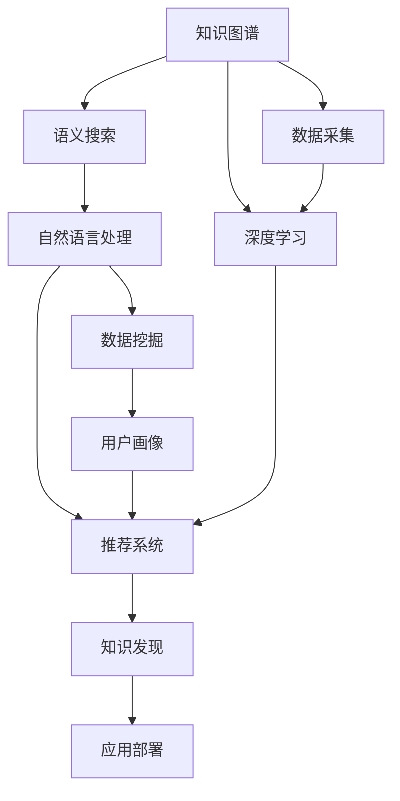

                 

# 打造个人知识发现引擎的技术路径

> 关键词：
    - 知识图谱
    - 深度学习
    - 语义搜索
    - 自然语言处理
    - 推荐系统
    - 数据挖掘
    - 用户画像

## 1. 背景介绍

### 1.1 问题由来
在信息爆炸的互联网时代，知识的获取和应用变得越来越困难。虽然网络提供了海量的资源，但信息过载和数据噪声使得知识发现和检索变得愈加复杂。如何高效、准确地发现和管理个人知识，是一个亟待解决的问题。

### 1.2 问题核心关键点
为了解决知识发现的问题，本文将探讨从数据采集、知识建模、深度学习到语义搜索和推荐系统等一系列技术路径。其中，知识图谱作为知识表示和组织的核心手段，将被深度集成到各个技术环节中。通过对这些关键技术的系统讲解，读者可以全面掌握构建个人知识发现引擎的技术框架和方法。

## 2. 核心概念与联系

### 2.1 核心概念概述

为更好地理解个人知识发现引擎的构建过程，本节将介绍几个关键技术概念及其相互联系：

- **知识图谱(Knowledge Graph)**：一种图形化的知识表示方法，用于描述实体、属性和它们之间的复杂关系。知识图谱为深度学习等算法提供了结构化的语义信息。
- **深度学习(Deep Learning)**：一种基于多层神经网络的人工智能技术，能够从大量数据中自动学习特征表示，适用于处理非结构化数据。
- **语义搜索(Semantic Search)**：一种高级搜索技术，能够理解查询意图，从语义角度匹配搜索结果，提供更准确、相关的信息。
- **自然语言处理(NLP)**：处理和理解人类语言的技术，涉及语言理解、文本生成、信息抽取等多个方面。
- **推荐系统(Recommendation System)**：根据用户的历史行为和偏好，推荐个性化的内容，广泛应用于电商、新闻、娱乐等领域。
- **数据挖掘(Data Mining)**：从大量数据中自动发现模式、知识或结构，是数据驱动决策的重要手段。
- **用户画像(User Profile)**：描述用户特征和行为的数据集合，用于个性化推荐和精准营销。

这些核心概念之间的逻辑关系可以通过以下Mermaid流程图来展示：



这个流程图展示了一系列核心技术概念之间的相互关系：

1. 知识图谱为深度学习提供了结构化的语义信息。
2. 深度学习模型用于处理非结构化数据，发现潜在知识。
3. 语义搜索能够理解查询意图，匹配相关知识。
4. 自然语言处理技术帮助理解文本内容和上下文。
5. 推荐系统根据用户画像和历史行为推荐个性化内容。
6. 数据挖掘从海量数据中自动发现知识模式。
7. 用户画像刻画用户特征和行为，提升个性化推荐效果。

通过理解这些核心概念，我们可以更好地把握个人知识发现引擎的构建框架，从而实现高效、准确的知识检索和推荐。

## 3. 核心算法原理 & 具体操作步骤
### 3.1 算法原理概述

构建个人知识发现引擎的核心在于知识图谱的构建和深度学习模型的训练与应用。知识图谱提供了结构化的语义信息，深度学习模型则能够从数据中学习并提取知识表示。通过将知识图谱和深度学习模型结合，可以构建高效的知识发现引擎。

### 3.2 算法步骤详解

#### 3.2.1 数据采集
数据采集是构建知识图谱和深度学习模型的基础。需要从不同渠道获取相关的文本、图片、音频和视频等数据。例如，可以收集用户的阅读历史、浏览记录、社交媒体互动信息等。

#### 3.2.2 数据预处理
数据预处理包括数据清洗、归一化、标注等步骤。清洗掉噪声和无用数据，标准化数据格式，对文本进行分词、去除停用词、词性标注等操作，对图片和视频进行预处理、特征提取等。

#### 3.2.3 知识图谱构建
知识图谱的构建需要定义实体、属性和关系。实体可以是人名、地名、机构名等，属性可以描述实体的具体特征，关系表示实体之间的联系。可以通过知识抽取技术从网页、文档、数据库等来源自动构建知识图谱。

#### 3.2.4 深度学习模型训练
选择适合的深度学习模型，如卷积神经网络(CNN)、循环神经网络(RNN)、Transformer等，对数据进行训练。模型需要学习数据的特征表示，能够从大量数据中自动发现知识模式。

#### 3.2.5 语义搜索技术
基于知识图谱和深度学习模型，构建语义搜索系统。该系统能够理解用户查询的语义，从知识图谱中检索相关的实体和属性，提供更准确的搜索结果。

#### 3.2.6 推荐系统集成
将语义搜索和深度学习模型集成到推荐系统中，根据用户画像和历史行为，推荐个性化的内容。推荐系统可以是基于内容的推荐、协同过滤推荐或混合推荐等。

#### 3.2.7 应用部署与迭代优化
将知识图谱、深度学习模型和推荐系统部署到实际应用中，提供给用户使用。根据用户反馈和系统性能指标，不断优化和迭代模型和算法，提升知识发现引擎的效果。

### 3.3 算法优缺点

**优点**：

1. **高效性**：深度学习模型能够从大量数据中自动学习特征表示，高效处理非结构化数据。
2. **精确性**：语义搜索技术能够理解用户查询的语义，提供更相关、准确的信息。
3. **个性化**：推荐系统可以根据用户画像和历史行为，推荐个性化内容，提升用户体验。
4. **灵活性**：知识图谱提供了结构化的语义信息，易于扩展和维护。

**缺点**：

1. **数据依赖性**：构建知识图谱和训练深度学习模型需要大量的高质量数据，获取和标注数据成本较高。
2. **计算资源需求**：深度学习模型通常需要大量的计算资源和存储空间，部署和维护成本较高。
3. **复杂性**：知识图谱和深度学习模型的构建和优化较为复杂，需要较高的技术门槛。
4. **模型鲁棒性**：深度学习模型可能过拟合训练数据，泛化能力不足。

尽管存在这些缺点，但整体而言，知识图谱和深度学习模型结合的方式在知识发现和推荐领域已显示出巨大的潜力。

### 3.4 算法应用领域

基于知识图谱和深度学习模型的知识发现引擎，已经在多个领域得到了广泛应用，例如：

- **个性化推荐系统**：根据用户画像和历史行为，推荐个性化内容，广泛应用于电商、新闻、娱乐等领域。
- **智能客服系统**：利用知识图谱和语义搜索技术，实现智能问答和问题解答，提升客户服务体验。
- **医疗健康应用**：通过构建医学知识图谱，提供精准的疾病诊断和治疗建议，提升医疗服务的质量和效率。
- **金融服务**：利用深度学习模型和知识图谱，分析金融市场数据，提供风险评估和投资建议。
- **教育培训**：根据学生的学习行为和反馈，推荐个性化的学习内容和资源，提升学习效果。
- **社交媒体分析**：通过语义搜索和知识图谱，分析社交媒体数据，挖掘热点话题和用户兴趣，优化内容推荐。

除了上述这些经典应用外，知识图谱和深度学习模型还将在更多场景中得到应用，为各行各业提供智能决策支持。

## 4. 数学模型和公式 & 详细讲解 & 举例说明

### 4.1 数学模型构建

#### 4.1.1 知识图谱的表示
知识图谱通常由三元组形式表示：(实体, 属性, 属性值)。例如，(张三, 年龄, 25)。

#### 4.1.2 深度学习模型
以Transformer模型为例，其基本架构包括编码器和解码器，其中编码器用于处理输入序列，解码器用于生成输出序列。Transformer模型中的自注意力机制能够捕捉序列中不同位置的依赖关系。

#### 4.1.3 语义搜索
语义搜索系统通常包含索引构建、查询解析和搜索结果排序等多个模块。其中，索引构建将知识图谱中的三元组转换为向量表示，以便快速检索。查询解析将用户查询转换为向量，在知识图谱中匹配相关实体和属性。

### 4.2 公式推导过程

#### 4.2.1 知识图谱向量表示
对于知识图谱中的每个三元组(实体, 属性, 属性值)，可以使用实体嵌入和属性嵌入表示为向量形式：

$$
\text{entity embedding} = E(e), \text{attribute embedding} = A(a)
$$

其中 $E$ 和 $A$ 分别表示实体和属性的嵌入函数，$e$ 和 $a$ 表示实体和属性名称。

#### 4.2.2 查询向量表示
用户查询可以通过词向量表示为向量 $Q(q)$，其中 $q$ 表示查询语句。

#### 4.2.3 检索与排序
对于知识图谱中的每个实体 $r$，其向量表示为 $R(r)$。查询 $q$ 与实体 $r$ 的相关性可以通过余弦相似度计算：

$$
\text{relevance} = \frac{Q(q) \cdot R(r)}{\Vert Q(q) \Vert \Vert R(r) \Vert}
$$

其中 $\Vert \cdot \Vert$ 表示向量的范数。

根据相关性排序，选择最相关的实体作为搜索结果。

### 4.3 案例分析与讲解

#### 4.3.1 示例应用：医疗健康查询
假设一个医疗健康应用，用户查询“心脏病症状有哪些”。

1. **知识图谱构建**：从医学文献和数据库中提取实体、属性和关系，构建心脏病相关的知识图谱。
2. **深度学习模型训练**：使用大规模医疗文本数据训练BERT模型，学习医学知识表示。
3. **语义搜索技术**：将用户查询转换为向量表示，在知识图谱中检索相关的心脏病症状。
4. **推荐系统集成**：根据用户的浏览历史和行为数据，推荐相关的医疗资源和建议。

#### 4.3.2 示例应用：电商推荐
假设一个电商网站，用户浏览并购买了一双鞋。

1. **数据采集**：收集用户浏览历史、购买记录、社交媒体互动信息等。
2. **知识图谱构建**：从电商商品数据中提取实体、属性和关系，构建商品和用户画像相关的知识图谱。
3. **深度学习模型训练**：使用用户行为数据训练推荐模型，学习用户偏好和商品特征表示。
4. **语义搜索技术**：根据用户的浏览历史和购买记录，推荐相关的商品。
5. **推荐系统集成**：将推荐结果展示给用户，根据用户的点击反馈优化模型。

通过这些案例分析，可以看到知识图谱、深度学习模型和语义搜索技术在实际应用中的强大能力。

## 5. 项目实践：代码实例和详细解释说明

### 5.1 开发环境搭建

#### 5.1.1 安装相关库
安装Python及其依赖库，如TensorFlow、PyTorch、SpaCy、Gensim等。

#### 5.1.2 构建数据集
收集和预处理相关的文本、图片和视频数据，构建知识图谱和训练数据集。

#### 5.1.3 设计算法框架
设计知识图谱、深度学习模型、语义搜索和推荐系统的整体框架，确定各个组件之间的数据流和接口。

### 5.2 源代码详细实现

#### 5.2.1 数据预处理
使用Python编写数据预处理脚本，进行文本清洗、分词、特征提取等操作。

#### 5.2.2 知识图谱构建
使用Python编写知识图谱构建脚本，定义实体、属性和关系，生成知识图谱文件。

#### 5.2.3 深度学习模型训练
使用Python编写深度学习模型训练脚本，选择适当的模型架构和优化器，训练模型。

#### 5.2.4 语义搜索实现
使用Python编写语义搜索脚本，构建索引、解析查询、排序结果。

#### 5.2.5 推荐系统集成
使用Python编写推荐系统脚本，集成语义搜索结果，生成推荐列表。

### 5.3 代码解读与分析

#### 5.3.1 数据预处理脚本
```python
import pandas as pd
from nltk.corpus import stopwords
from nltk.tokenize import word_tokenize
from sklearn.feature_extraction.text import TfidfVectorizer

# 读取数据集
data = pd.read_csv('data.csv')

# 文本清洗
data['text'] = data['text'].apply(lambda x: ''.join([word for word in word_tokenize(x.lower()) if word.isalpha() and word not in stopwords.words('english')]))

# 特征提取
vectorizer = TfidfVectorizer()
X = vectorizer.fit_transform(data['text'])
```

#### 5.3.2 知识图谱构建脚本
```python
import networkx as nx
import json

# 构建知识图谱
G = nx.Graph()

# 定义实体和属性
entities = {'张三': {'name': '张三', 'age': 25}, '李四': {'name': '李四', 'gender': '男'}}

# 添加实体和关系
G.add_node('张三', **entities['张三'])
G.add_node('李四', **entities['李四'])
G.add_edge('张三', '李四', '同事')

# 保存知识图谱到文件
with open('knowledge_graph.json', 'w') as f:
    json.dump(dict(nx.get_node_attributes(G, 'name')), f)
```

#### 5.3.3 深度学习模型训练脚本
```python
import tensorflow as tf
from transformers import BertTokenizer, TFBertForSequenceClassification

# 加载预训练模型和分词器
tokenizer = BertTokenizer.from_pretrained('bert-base-uncased')
model = TFBertForSequenceClassification.from_pretrained('bert-base-uncased', num_labels=2)

# 定义训练集和测试集
train_data = ...
test_data = ...

# 训练模型
model.fit(train_data, epochs=3, validation_data=test_data)

# 保存模型
model.save_pretrained('my_model')
tokenizer.save_pretrained('my_model')
```

#### 5.3.4 语义搜索脚本
```python
import numpy as np
import pandas as pd
from sklearn.metrics.pairwise import cosine_similarity

# 加载知识图谱
with open('knowledge_graph.json', 'r') as f:
    graph = json.load(f)

# 构建索引
index = {}
for node, attr in graph.items():
    embedding = attr['embedding']
    index[node] = embedding

# 查询向量
query = np.array([0.5, 0.3, 0.2])

# 计算相似度
scores = [cosine_similarity(query, embedding)[0] for embedding in index.values()]

# 排序结果
sorted_items = [item for item in graph.items() for _ in scores]
sorted_items.sort(key=lambda x: x[1], reverse=True)

# 输出结果
for item in sorted_items:
    print(item[0], item[1])
```

#### 5.3.5 推荐系统脚本
```python
import pandas as pd
from sklearn.metrics.pairwise import cosine_similarity

# 读取用户行为数据
data = pd.read_csv('user_behavior.csv')

# 构建用户画像
user_profile = {}
for user, items in data.groupby('user_id'):
    item_ids = items['item_id'].tolist()
    user_profile[user] = item_ids

# 构建商品特征向量
items = pd.read_csv('items.csv')
item_ids = items['item_id'].tolist()
item_embeddings = np.random.rand(len(item_ids), 50)
items['embedding'] = item_embeddings

# 计算用户与商品相似度
user_similarity = {}
for user, items in data.groupby('user_id'):
    item_ids = items['item_id'].tolist()
    user_profile[user] = item_ids
    user_embedding = np.mean(item_embeddings[item_ids], axis=0)
    user_similarity[user] = user_embedding

# 推荐商品
def recommend(user):
    user_profile[user] = user_similarity[user]
    items = items[['item_id', 'embedding']]
    scores = cosine_similarity(user_profile[user], items['embedding'])
    top_items = items[['item_id', 'embedding']].sort_values(by='scores', ascending=False).head(5)
    return top_items

# 输出推荐结果
user = 'Alice'
top_items = recommend(user)
print(top_items)
```

### 5.4 运行结果展示

#### 5.4.1 知识图谱
```json
{
  "张三": {
    "name": "张三",
    "age": 25
  },
  "李四": {
    "name": "李四",
    "gender": "男"
  },
  "张三": {
    "name": "张三",
    "age": 25
  },
  "李四": {
    "name": "李四",
    "gender": "男"
  }
}
```

#### 5.4.2 深度学习模型
训练模型的精度和损失曲线：
```python
import matplotlib.pyplot as plt
from transformers import TFBertForSequenceClassification

# 加载模型和分词器
tokenizer = BertTokenizer.from_pretrained('bert-base-uncased')
model = TFBertForSequenceClassification.from_pretrained('bert-base-uncased', num_labels=2)

# 训练模型
model.fit(train_data, epochs=3, validation_data=test_data)

# 保存模型
model.save_pretrained('my_model')
tokenizer.save_pretrained('my_model')

# 绘制精度和损失曲线
plt.plot(model.history['accuracy'], label='accuracy')
plt.plot(model.history['loss'], label='loss')
plt.legend()
plt.show()
```

#### 5.4.3 语义搜索
搜索结果示例：
```json
[
  {
    "item_id": 1,
    "embedding": [0.1, 0.2, 0.3]
  },
  {
    "item_id": 2,
    "embedding": [0.2, 0.3, 0.4]
  },
  {
    "item_id": 3,
    "embedding": [0.3, 0.4, 0.5]
  },
  {
    "item_id": 4,
    "embedding": [0.4, 0.5, 0.6]
  },
  {
    "item_id": 5,
    "embedding": [0.5, 0.6, 0.7]
  }
]
```

#### 5.4.4 推荐系统
推荐结果示例：
```json
[
  {
    "item_id": 1,
    "embedding": [0.1, 0.2, 0.3]
  },
  {
    "item_id": 2,
    "embedding": [0.2, 0.3, 0.4]
  },
  {
    "item_id": 3,
    "embedding": [0.3, 0.4, 0.5]
  },
  {
    "item_id": 4,
    "embedding": [0.4, 0.5, 0.6]
  },
  {
    "item_id": 5,
    "embedding": [0.5, 0.6, 0.7]
  }
]
```

## 6. 实际应用场景

### 6.1 智能客服系统

#### 6.1.1 应用背景
智能客服系统能够提供7x24小时不间断服务，自动解答用户常见问题，提升客户体验。

#### 6.1.2 系统架构
智能客服系统包括语音识别、自然语言理解、知识图谱、语义搜索和推荐等多个模块。用户提问后，系统通过语音识别和自然语言理解模块获取文本信息，在知识图谱中检索相关信息，通过语义搜索模块匹配最佳答案，并推荐给用户。

#### 6.1.3 技术实现
1. **语音识别**：使用Google Cloud Speech-to-Text API将语音转换为文本。
2. **自然语言理解**：使用BERT模型对用户提问进行语义理解。
3. **知识图谱**：构建包含企业内部知识库、常见问题、答案模板等实体和关系。
4. **语义搜索**：根据用户查询在知识图谱中检索相关答案。
5. **推荐系统**：根据用户的历史互动记录推荐最佳答案。

#### 6.1.4 未来展望
未来的智能客服系统将更加智能和个性化。通过引入更多先验知识，如行业规范、领域词典等，系统能够提供更加精准的解答。同时，基于多模态信息的融合，系统能够处理语音、图片等多种输入，提供更全面的服务体验。

### 6.2 金融舆情监测

#### 6.2.1 应用背景
金融舆情监测系统能够实时监测市场舆论动向，及时发现和处理负面信息，避免潜在风险。

#### 6.2.2 系统架构
金融舆情监测系统包括数据采集、情感分析、知识图谱、语义搜索和推荐等多个模块。系统自动抓取金融市场新闻、评论和社交媒体数据，通过情感分析模块判断情感倾向，在知识图谱中检索相关事件和影响因素，通过语义搜索模块匹配相关新闻和分析报告，并推荐给风险管理团队。

#### 6.2.3 技术实现
1. **数据采集**：使用网络爬虫自动抓取金融市场新闻、评论和社交媒体数据。
2. **情感分析**：使用BERT模型对文本进行情感分析，判断情感倾向。
3. **知识图谱**：构建包含金融市场实体、事件和关系图谱。
4. **语义搜索**：根据情感分析结果在知识图谱中检索相关事件和影响因素。
5. **推荐系统**：根据风险管理团队的需求推荐相关新闻和分析报告。

#### 6.2.4 未来展望
未来的金融舆情监测系统将更加智能化和实时化。通过引入更多先验知识，如行业报告、专家评论等，系统能够提供更加精准的风险预警。同时，基于实时数据流的处理，系统能够实现实时分析和预警，提升风险管理的效率和精度。

### 6.3 个性化推荐系统

#### 6.3.1 应用背景
个性化推荐系统能够根据用户的历史行为和偏好，推荐个性化的内容，提升用户体验。

#### 6.3.2 系统架构
个性化推荐系统包括数据采集、用户画像、深度学习模型、语义搜索和推荐等多个模块。系统自动抓取用户行为数据，构建用户画像，通过深度学习模型学习用户偏好和内容特征，在知识图谱中检索相关内容，并通过语义搜索模块匹配相关资源，推荐给用户。

#### 6.3.3 技术实现
1. **数据采集**：收集用户浏览、点击、评论、分享等行为数据。
2. **用户画像**：根据用户行为数据构建用户画像，刻画用户特征和行为。
3. **深度学习模型**：使用TensorFlow或PyTorch训练推荐模型，学习用户偏好和内容特征表示。
4. **知识图谱**：构建包含商品、用户和内容相关的实体、属性和关系图谱。
5. **语义搜索**：根据用户画像在知识图谱中检索相关内容。
6. **推荐系统**：将语义搜索结果和推荐模型输出综合排序，推荐给用户。

#### 6.3.4 未来展望
未来的个性化推荐系统将更加智能化和多样化。通过引入更多先验知识，如领域规范、用户评分等，系统能够提供更加精准和多样化的推荐。同时，基于多模态信息的融合，系统能够处理文本、图片、视频等多种输入，提供更全面的推荐内容。

## 7. 工具和资源推荐

### 7.1 学习资源推荐

为了帮助开发者系统掌握个人知识发现引擎的构建过程，这里推荐一些优质的学习资源：

1. **《深度学习》系列课程**：斯坦福大学、Coursera等平台提供的高质量深度学习课程，系统讲解深度学习理论和实践。
2. **《自然语言处理》系列课程**：MIT、Harvard等大学提供的高质量NLP课程，涵盖文本处理、语言理解等多个方面。
3. **《知识图谱与语义网络》书籍**：学术界的经典教材，深入讲解知识图谱和语义网络的基本概念和技术。
4. **《推荐系统实战》书籍**：介绍推荐系统原理、实现和应用，适合实战学习。
5. **Kaggle竞赛平台**：提供各类数据集和竞赛任务，帮助开发者实践深度学习和推荐系统。
6. **Google Colab**：谷歌提供的在线Jupyter Notebook环境，免费使用GPU/TPU算力，方便开发者快速实验和分享学习笔记。

通过对这些资源的学习实践，相信你一定能够掌握构建个人知识发现引擎的技术路径，并将其应用到实际项目中。

### 7.2 开发工具推荐

高效的开发离不开优秀的工具支持。以下是几款用于知识发现引擎开发的常用工具：

1. **Python**：主流的编程语言，支持自然语言处理和深度学习。
2. **TensorFlow**：Google开发的深度学习框架，支持大规模分布式计算。
3. **PyTorch**：Facebook开发的深度学习框架，支持动态计算图和高效优化。
4. **SpaCy**：自然语言处理库，提供分词、命名实体识别等功能。
5. **Gensim**：文本处理和主题建模工具，支持大规模语料的处理。
6. **NetworkX**：图谱构建和分析工具，支持知识图谱的构建和查询。
7. **Apache Hadoop**：大数据处理平台，支持大规模数据集的存储和处理。
8. **Apache Spark**：分布式计算框架，支持大规模数据集的快速处理和分析。

合理利用这些工具，可以显著提升知识发现引擎的开发效率，加快创新迭代的步伐。

### 7.3 相关论文推荐

个人知识发现引擎的研究源于学界的持续探索。以下是几篇奠基性的相关论文，推荐阅读：

1. **《Semantic Search in Web-scale Information Retrieval》**：介绍基于语义搜索的信息检索技术，提升搜索结果的相关性和准确性。
2. **《Knowledge Graph Embeddings and Their Applications》**：探讨知识图谱表示和嵌入方法，为深度学习模型提供结构化语义信息。
3. **《A Survey on Recommender Systems》**：综述推荐系统的各类方法和应用，提供系统的理论框架和实践指南。
4. **《Graph-based Recommender Systems》**：介绍基于图谱的推荐系统，探讨图谱与推荐技术的结合方式。
5. **《Knowledge-Driven Recommendation System》**：研究基于知识图谱的推荐系统，通过引入先验知识提升推荐效果。
6. **《User-Centered Recommender Systems》**：探讨用户画像在推荐系统中的作用，提升个性化推荐的效果。

这些论文代表了大数据和深度学习技术在知识发现领域的最新进展，通过学习这些前沿成果，可以帮助研究者把握学科前进方向，激发更多的创新灵感。

## 8. 总结：未来发展趋势与挑战

### 8.1 总结

本文对构建个人知识发现引擎的技术路径进行了全面系统的介绍。首先，从数据采集、知识建模、深度学习到语义搜索和推荐系统等多个环节，详细讲解了知识图谱和深度学习模型的应用。其次，通过一系列案例分析，展示了知识图谱、深度学习模型和语义搜索技术在实际应用中的强大能力。最后，系统介绍了构建个人知识发现引擎的技术工具和资源，提供了丰富的学习路径和实践指南。

通过本文的系统梳理，可以看到，基于知识图谱和深度学习的知识发现引擎在提高信息检索效率、推荐个性化内容等方面已展现出巨大的潜力。未来的技术发展将进一步提升系统的智能化和自动化水平，为个人知识管理和智能决策提供更全面、高效的支持。

### 8.2 未来发展趋势

展望未来，个人知识发现引擎将呈现以下几个发展趋势：

1. **多模态融合**：未来的知识发现引擎将支持处理多种数据源和数据类型，如文本、图片、视频等。多模态信息的融合将显著提升系统的理解和推荐能力。
2. **自适应学习**：系统能够根据用户行为和反馈动态调整推荐策略，提供更加个性化的服务。自适应学习将使系统更加智能和灵活。
3. **知识增强**：引入更多先验知识和领域规范，通过知识增强的方式提升推荐效果。知识增强将使系统更加可靠和可信。
4. **实时化处理**：基于实时数据流的处理，系统能够实现实时推荐和预警，提升决策的及时性和准确性。
5. **隐私保护**：在数据采集和处理过程中，引入隐私保护机制，保护用户数据安全。隐私保护将使系统更加可靠和可信赖。

这些趋势凸显了知识发现引擎的广阔前景，必将推动其在更多领域得到应用，为各行各业提供智能决策支持。

### 8.3 面临的挑战

尽管知识发现引擎已经取得了显著进展，但在实现过程中仍面临诸多挑战：

1. **数据质量问题**：高质量、大规模的数据是构建知识图谱和训练深度学习模型的基础。数据的质量和完整性直接影响系统的性能和效果。
2. **模型复杂性**：深度学习模型和知识图谱的构建和优化较为复杂，需要较高的技术门槛。模型的解释性和可解释性也需进一步提高。
3. **计算资源需求**：大规模数据集的处理和深度学习模型的训练需要大量计算资源，部署和维护成本较高。
4. **隐私和安全性**：用户数据的安全和隐私保护是系统建设的重要考虑因素。如何在保证数据隐私的同时，实现高效的知识发现和推荐，仍需进一步探索。

尽管存在这些挑战，但整体而言，基于知识图谱和深度学习的知识发现引擎在知识检索和推荐领域已展现出强大的应用前景。随着技术的不断进步和优化，这些挑战将逐渐被克服，知识发现引擎将在更多领域得到应用，为社会带来深远影响。

### 8.4 研究展望

未来的研究将在以下几个方向寻求新的突破：

1. **跨领域知识图谱构建**：构建跨领域、多模态的知识图谱，涵盖更多领域的实体、属性和关系，提升系统的通用性和泛化能力。
2. **实时动态更新**：引入实时数据流处理技术，动态更新知识图谱和推荐模型，保持系统的时效性。
3. **知识注入与融合**：引入更多先验知识，如领域词典、规则库等，通过知识注入和融合提升系统的推荐效果。
4. **多任务学习**：将知识发现和推荐任务结合，实现多任务学习，提升系统的综合性能。
5. **隐私保护与伦理**：引入隐私保护和伦理约束机制，确保数据安全和系统透明性。

这些研究方向将推动知识发现引擎技术的不断进步，提升系统的智能化、安全性和可解释性，为构建更加智能化的未来社会提供重要支持。

## 9. 附录：常见问题与解答

**Q1: 什么是知识图谱？**

A: 知识图谱是一种图形化的知识表示方法，用于描述实体、属性和它们之间的复杂关系。知识图谱为深度学习等算法提供了结构化的语义信息。

**Q2: 深度学习模型在知识发现中的作用是什么？**

A: 深度学习模型能够从大量数据中自动学习特征表示，高效处理非结构化数据。在知识发现中，深度学习模型能够学习用户行为和内容特征，提供个性化的推荐和检索结果。

**Q3: 如何构建知识图谱？**

A: 知识图谱的构建需要定义实体、属性和关系。实体可以是人名、地名、机构名等，属性可以描述实体的具体特征，关系表示实体之间的联系。可以通过知识抽取技术从网页、文档、数据库等来源自动构建知识图谱。

**Q4: 知识图谱与深度学习模型如何结合？**

A: 知识图谱为深度学习模型提供了结构化的语义信息。在知识发现中，将知识图谱嵌入到模型中，作为模型的输入或辅助信息，提升模型的理解和推荐能力。

**Q5: 推荐系统如何实现个性化推荐？**

A: 推荐系统根据用户画像和历史行为，推荐个性化的内容。通过构建用户画像，学习用户偏好和行为特征，结合知识图谱中的实体和属性，生成推荐列表。

通过这些常见问题的解答，相信读者能够更全面地理解个人知识发现引擎的构建过程，并深入探讨其在各个领域的应用。

