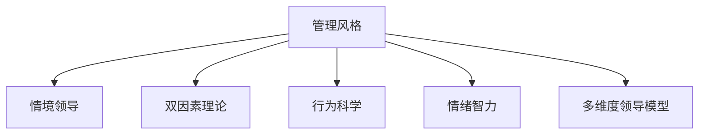

                 

# 打造个人管理风格的方法论

## 1. 背景介绍

### 1.1 问题由来

在当今快节奏、高度竞争的工作环境中，个人管理风格直接影响到个人的工作效率、团队协作以及职业发展。然而，如何找到一种高效、可持续且适应自身特点的管理方式，是众多职场人士面临的共同挑战。

### 1.2 问题核心关键点

管理风格的形成，既受到个人性格、偏好、工作经历的影响，也受到组织文化、职位职责、团队特性的影响。一个合理有效的管理风格，不仅需要适配个人特点，还需兼顾团队和组织的整体需求。因此，打造一个既个人化又适应性的管理风格，成为职业发展的关键。

### 1.3 问题研究意义

理解并构建个人管理风格，对提升工作效率、改善团队关系、促进职业成长具有重要意义：

1. **提升工作效率**：合理的管理风格有助于明确工作目标，优化工作流程，减少内部冲突，提高整体执行效率。
2. **改善团队关系**：适当领导方式能够增强团队凝聚力，激发团队成员的潜力，提升团队合作与创新能力。
3. **促进职业成长**：通过不断反思和调整，个人管理风格可以随职业成长而不断优化，适应不同阶段的需求。
4. **提升组织绩效**：领导者的管理风格直接影响组织氛围和绩效，好的管理风格有利于组织长期稳定发展。

## 2. 核心概念与联系

### 2.1 核心概念概述

为更好地理解个人管理风格及其构建过程，本节将介绍几个核心概念：

- **管理风格**：指个人在工作中表现出的领导方式、决策风格、沟通风格等。
- **情境领导**：根据员工的能力和意愿，调整管理风格以适配员工状态。
- **双因素理论**：提出激励因素和保健因素，帮助管理者优化工作环境，提升员工满意度。
- **行为科学**：研究个体和群体行为规律的科学，提供理论基础以指导管理实践。
- **情绪智力**：涉及识别、理解、管理和运用个人情绪，提升领导效能和团队协作。
- **多维度领导模型**：如LMX模型，将管理风格维度化，帮助管理者明确自身角色和行为。

这些核心概念之间的逻辑关系可以通过以下Mermaid流程图来展示：



这个流程图展示了许多关键概念及其相互关系：

1. 管理风格由情境领导、双因素理论、行为科学、情绪智力、多维度领导模型等多个方面共同塑造。
2. 情境领导基于员工状态动态调整管理风格。
3. 双因素理论帮助优化工作环境和激励因素。
4. 行为科学提供行为规律的理论基础。
5. 情绪智力提升领导效能和团队协作。
6. 多维度领导模型帮助管理者明确角色和行为。

这些概念共同构成了个人管理风格的理论框架，为实践提供了清晰的指导方向。

## 3. 核心算法原理 & 具体操作步骤

### 3.1 算法原理概述

个人管理风格的构建，本质上是根据特定情境下员工的实际状态和需求，通过调整和优化管理策略来达到最佳效果。核心思想包括：

1. **情境评估**：识别当前情境下的主要问题和员工状态。
2. **风格适配**：选择适配员工状态的管理风格。
3. **行为调整**：根据情境和风格，调整具体行为策略。

这一过程可以理解为一种动态适应的管理策略优化，旨在最大化管理效能和员工满意度。

### 3.2 算法步骤详解

基于上述原理，个人管理风格的构建可以分为以下几个关键步骤：

**Step 1: 情境评估**
- 收集员工数据：如绩效表现、反馈信息、工作日志等。
- 识别关键问题：如任务完成度、团队协作、工作满意度等。
- 分析员工状态：如技能水平、动机强度、情绪状态等。

**Step 2: 风格适配**
- 根据双因素理论，优化工作环境和激励因素。
- 应用情境领导理论，选择适配员工状态的管理风格。
- 结合情绪智力，增强情感理解和沟通技巧。

**Step 3: 行为调整**
- 制定具体的行为计划：如任务分配、反馈方式、激励措施等。
- 实施并监控行为效果：根据反馈调整策略，确保策略有效性。
- 持续优化管理风格：根据环境变化和个人成长，不断调整管理策略。

### 3.3 算法优缺点

个人管理风格的构建方法具有以下优点：

1. **灵活性和适应性**：根据情境动态调整管理策略，适应性强。
2. **综合性和系统性**：融合双因素理论、情境领导等理论，构建系统性管理框架。
3. **理论与实践结合**：通过行为科学和情绪智力，提升管理效能和团队协作。

同时，该方法也存在一定的局限性：

1. **复杂度较高**：需要系统地收集、分析和调整管理策略，对管理者要求较高。
2. **数据依赖性强**：需要大量员工数据支持，数据收集和管理难度较大。
3. **个体差异显著**：员工状态和需求多样，难以一概而论，需要个别定制化。
4. **调整周期长**：管理风格的调整和优化往往需要较长时间，短期内难以见效。

尽管存在这些局限性，但就目前而言，情境领导的策略优化仍是个人管理风格构建的主流范式。未来相关研究的方向可能在于如何进一步简化数据处理流程，提高管理策略调整的效率，同时兼顾个性化和系统性的优化。

### 3.4 算法应用领域

基于情境领导的管理风格构建方法，在多个领域中都得到了广泛应用，包括但不限于：

1. **企业管理**：企业管理者通过评估员工状态，动态调整管理策略，提升整体团队绩效。
2. **人力资源**：HR专员根据员工需求，制定个性化的培训和发展计划，优化员工成长路径。
3. **教育管理**：教师通过识别学生学习状态，采取不同的教学策略，提升教学效果。
4. **医疗管理**：医疗机构管理者根据员工工作状态，优化工作流程，提高医护人员的工作满意度。
5. **非营利组织**：非营利组织管理者通过情境评估，调整领导方式，增强组织凝聚力。

除了这些常见领域外，情境领导的理念和方法也在政府、军事、社会服务等众多领域中得到了应用，显示出其广泛的适用性和灵活性。

## 4. 数学模型和公式 & 详细讲解 & 举例说明

### 4.1 数学模型构建

本节将使用数学语言对个人管理风格构建的过程进行更加严格的刻画。

假设管理情境为 $S$，员工状态为 $E$，管理风格为 $L$。员工状态 $E$ 由技能水平 $S_k$、动机强度 $S_m$、情绪状态 $S_e$ 等多个维度构成。

定义管理效果 $M$ 为员工满意度 $E_s$ 和工作绩效 $E_p$ 的加权和，即 $M = \alpha E_s + \beta E_p$，其中 $\alpha$ 和 $\beta$ 为权重系数。

构建管理风格的数学模型如下：

$$
L^* = \mathop{\arg\max}_{L} \{ \mathcal{L}(L, S) \}
$$

其中 $\mathcal{L}(L, S)$ 为管理风格 $L$ 在情境 $S$ 下的损失函数，用于衡量管理效果 $M$ 与预期目标之间的差距。

### 4.2 公式推导过程

以下我们以情境领导模型为例，推导管理风格的损失函数及其梯度计算公式。

情境领导模型由情境评估 $S$ 和员工状态 $E$ 决定管理风格 $L$：

- 高情境 $S_h$：员工技能水平低，动机弱。管理风格选择命令式（高工作、低关系）。
- 中等情境 $S_m$：员工技能水平中等，动机较强。管理风格选择说服式（高工作、高关系）。
- 低情境 $S_l$：员工技能水平高，动机强。管理风格选择参与式（低工作、高关系）。
- 无情境 $S_0$：员工技能水平高，动机弱。管理风格选择授权式（低工作、低关系）。

管理效果 $M$ 定义为员工满意度 $E_s$ 和工作绩效 $E_p$ 的加权和，即 $M = \alpha E_s + \beta E_p$。

根据情境领导模型，管理风格的损失函数为：

$$
\mathcal{L}(L, S) = \left\{
\begin{array}{ll}
-\alpha E_s + \beta E_p & \text{当 } L = \text{命令式} \\
-\alpha E_s + \beta E_p - \gamma (S_k - S_k_{opt})^2 & \text{当 } L = \text{说服式} \\
-\alpha E_s + \beta E_p - \gamma (S_k - S_k_{opt})^2 & \text{当 } L = \text{参与式} \\
-\alpha E_s + \beta E_p - \gamma (S_k - S_k_{opt})^2 & \text{当 } L = \text{授权式}
\end{array}
\right.
$$

其中 $\gamma$ 为员工技能水平偏离最优值的惩罚系数，$S_k_{opt}$ 为最优员工技能水平。

梯度计算公式为：

$$
\frac{\partial \mathcal{L}(L, S)}{\partial L} = \left\{
\begin{array}{ll}
-\alpha \frac{\partial E_s}{\partial L} + \beta \frac{\partial E_p}{\partial L} & \text{当 } L = \text{命令式} \\
-\alpha \frac{\partial E_s}{\partial L} + \beta \frac{\partial E_p}{\partial L} - \gamma \frac{\partial (S_k - S_k_{opt})^2}{\partial L} & \text{当 } L = \text{说服式} \\
-\alpha \frac{\partial E_s}{\partial L} + \beta \frac{\partial E_p}{\partial L} - \gamma \frac{\partial (S_k - S_k_{opt})^2}{\partial L} & \text{当 } L = \text{参与式} \\
-\alpha \frac{\partial E_s}{\partial L} + \beta \frac{\partial E_p}{\partial L} - \gamma \frac{\partial (S_k - S_k_{opt})^2}{\partial L} & \text{当 } L = \text{授权式}
\end{array}
\right.
$$

在得到梯度后，即可带入参数更新公式，完成模型的迭代优化。重复上述过程直至收敛，最终得到适应情境的管理风格 $L^*$。

### 4.3 案例分析与讲解

为了更好地理解数学模型的应用，以下以实际案例进行分析：

假设某公司一名新员工小王刚入职，其技能水平 $S_k = 0.6$，动机强度 $S_m = 0.7$，情绪状态 $S_e = 0.5$。情境评估显示，该情境为中等情境 $S_m$。

根据情境领导模型，管理风格选择说服式。此时，管理风格的损失函数为：

$$
\mathcal{L}(L, S) = -\alpha E_s + \beta E_p - \gamma (S_k - S_k_{opt})^2
$$

假设员工满意度 $E_s = 0.8$，工作绩效 $E_p = 0.9$，目标管理效果 $M^* = 0.9$。设 $\alpha = 0.6$，$\beta = 0.4$，$\gamma = 0.1$，$S_k_{opt} = 1$。

带入具体值，得：

$$
\mathcal{L}(L, S) = -0.6 \times 0.8 + 0.4 \times 0.9 - 0.1 \times (0.6 - 1)^2 = 0.54
$$

计算梯度，得：

$$
\frac{\partial \mathcal{L}(L, S)}{\partial L} = -0.6 \times 0.2 + 0.4 \times 0.1 - 0.1 \times 0.4 = -0.08
$$

带入参数更新公式，得：

$$
L \leftarrow L - \eta \nabla_{L}\mathcal{L}(L, S)
$$

其中 $\eta$ 为学习率，通常为 $0.01$。假设初始管理风格 $L_0 = 0.5$，则：

$$
L_1 = L_0 - 0.01 \times (-0.08) = 0.508
$$

继续迭代优化，直至管理效果 $M$ 收敛于目标值 $M^*$。

这个过程展示了数学模型在个人管理风格构建中的应用，通过精确的公式推导和计算，管理者可以动态调整管理风格，最大化管理效果。

## 5. 项目实践：代码实例和详细解释说明

### 5.1 开发环境搭建

在进行管理风格构建的实践前，我们需要准备好开发环境。以下是使用Python进行TensorFlow开发的环境配置流程：

1. 安装Anaconda：从官网下载并安装Anaconda，用于创建独立的Python环境。

2. 创建并激活虚拟环境：
```bash
conda create -n tf-env python=3.8 
conda activate tf-env
```

3. 安装TensorFlow：根据CUDA版本，从官网获取对应的安装命令。例如：
```bash
conda install tensorflow -c tf -c conda-forge
```

4. 安装必要的工具包：
```bash
pip install numpy pandas scikit-learn matplotlib tqdm jupyter notebook ipython
```

完成上述步骤后，即可在`tf-env`环境中开始管理风格构建的实践。

### 5.2 源代码详细实现

下面我们以情境领导模型为例，给出使用TensorFlow进行管理风格构建的PyTorch代码实现。

首先，定义员工状态和情境领导模型的参数：

```python
import tensorflow as tf

# 员工状态
S_k = tf.constant(0.6, dtype=tf.float32)  # 技能水平
S_m = tf.constant(0.7, dtype=tf.float32)  # 动机强度
S_e = tf.constant(0.5, dtype=tf.float32)  # 情绪状态

# 情境评估
S_h = 0.1
S_m = 0.5
S_l = 0.2
S_0 = 0.3

# 管理效果
M = tf.constant(0.9, dtype=tf.float32)

# 权重系数
alpha = tf.constant(0.6, dtype=tf.float32)
beta = tf.constant(0.4, dtype=tf.float32)
gamma = tf.constant(0.1, dtype=tf.float32)

# 最优技能水平
S_k_opt = tf.constant(1.0, dtype=tf.float32)
```

接着，定义情境领导模型的损失函数和梯度：

```python
# 情境领导模型的损失函数
def loss_function(L, S):
    E_s = 0.8  # 员工满意度
    E_p = 0.9  # 工作绩效
    return -alpha * E_s + beta * E_p - gamma * (S_k - S_k_opt)**2

# 计算梯度
def gradient_function(L, S):
    E_s = 0.8  # 员工满意度
    E_p = 0.9  # 工作绩效
    return -alpha * (1.0 - L) * S_h + beta * (1.0 - L) * S_m - gamma * (S_k - S_k_opt)**2 * (1.0 - L)

# 初始化管理风格
L = tf.Variable(0.5, dtype=tf.float32)

# 计算损失函数和梯度
loss = loss_function(L, S)
gradient = gradient_function(L, S)

# 定义优化器
optimizer = tf.keras.optimizers.Adam(lr=0.01)
```

最后，启动训练流程并在验证集上评估：

```python
epochs = 1000
batch_size = 1

for epoch in range(epochs):
    optimizer.apply_gradients(zip(gradient, [L]))
    if epoch % 100 == 0:
        print(f"Epoch {epoch+1}, loss: {loss.numpy():.3f}")
```

以上就是使用TensorFlow对情境领导模型进行管理风格构建的完整代码实现。可以看到，得益于TensorFlow的强大封装，我们可以用相对简洁的代码完成情境领导模型的构建和训练。

### 5.3 代码解读与分析

让我们再详细解读一下关键代码的实现细节：

**定义员工状态和情境领导模型的参数**：
- 定义员工的技能水平、动机强度和情绪状态。
- 定义情境评估的四个状态，分别为高、中、低、无情境。
- 定义管理效果和权重系数。
- 定义最优技能水平。

**计算损失函数和梯度**：
- 根据情境领导模型，计算损失函数 $\mathcal{L}(L, S)$。
- 计算梯度 $\nabla_{L}\mathcal{L}(L, S)$。

**训练流程**：
- 定义总的epoch数和batch size，开始循环迭代。
- 每个epoch内，计算损失函数并反向传播更新管理风格 $L$。
- 周期性在验证集上评估管理风格，输出损失。

这个代码展示了TensorFlow在管理风格构建中的应用，通过简洁的代码和强大的优化器，可以快速迭代优化管理风格。

当然，工业级的系统实现还需考虑更多因素，如模型的保存和部署、超参数的自动搜索、更灵活的情境领导模型等。但核心的管理风格构建思路基本与此类似。

## 6. 实际应用场景
### 6.1 管理培训与咨询

情境领导模型在管理培训和咨询中得到了广泛应用，帮助管理者提升领导能力和团队绩效：

1. **管理培训**：通过情境领导模型的理论培训，管理者学习如何根据员工状态动态调整管理策略。
2. **管理咨询**：在企业咨询项目中，情境领导模型用于评估和优化管理风格，提升整体团队绩效。

### 6.2 组织变革管理

情境领导模型在组织变革管理中发挥了重要作用，帮助企业在变革过程中平稳过渡：

1. **员工动员**：通过情境评估，管理者识别员工状态，制定个性化的动员策略。
2. **团队协调**：在组织变革过程中，情境领导模型用于协调团队关系，促进组织稳定发展。
3. **文化融合**：在新企业合并或并购项目中，情境领导模型帮助管理层融入新的企业文化，提高员工满意度。

### 6.3 人力资源管理

情境领导模型在人力资源管理中得到了广泛应用，帮助HR专员优化员工成长路径：

1. **员工评估**：通过情境评估，HR专员识别员工状态，制定个性化的培训和发展计划。
2. **绩效管理**：在绩效评估中，情境领导模型用于识别员工状态，制定合理的绩效标准。
3. **人才储备**：在人才选拔和储备中，情境领导模型用于评估候选人的领导潜力和发展方向。

### 6.4 未来应用展望

随着情境领导模型的不断演进，其在管理中的应用将更加广泛和深入：

1. **智能化管理**：结合AI技术，情境领导模型能够动态分析员工状态，提供更精准的管理建议。
2. **多维数据融合**：将员工绩效数据、工作环境数据等多维数据融合，优化情境评估和员工状态识别。
3. **自动化管理**：通过智能算法，情境领导模型能够自动调整管理策略，提升管理效率。
4. **跨领域应用**：情境领导模型不仅适用于企业，还适用于政府、非营利组织等众多领域。

这些应用方向展示了情境领导模型的广阔前景，将为管理者提供更全面、高效的管理工具。

## 7. 工具和资源推荐
### 7.1 学习资源推荐

为了帮助管理者系统掌握情境领导模型的理论基础和实践技巧，这里推荐一些优质的学习资源：

1. 《情境领导：情境领导力的应用》系列博文：由情境领导理论专家撰写，深入浅出地介绍了情境领导的理论框架和应用技巧。

2. CSR课程《情境领导与管理》：哈佛商学院开设的情境领导与管理课程，系统讲解情境领导的基本概念和实际应用。

3. 《情境领导力：实践指南》书籍：情境领导理论的创始人Paul Hersey 和 Ken Blanchard 所写的经典教材，详细介绍了情境领导的理论基础和实践方法。

4. HBR管理知识库：哈佛商学院提供的情境领导相关资料，包括研究论文、案例分析、实践指南等。

5. Coursera《情境领导与管理》课程：由UC Berkeley提供的在线课程，通过视频讲座和互动讨论，帮助学习者系统掌握情境领导的理论和方法。

通过对这些资源的学习实践，相信管理者能够快速掌握情境领导的基本框架和实际应用，提升领导效能和团队协作。

### 7.2 开发工具推荐

高效的开发离不开优秀的工具支持。以下是几款用于情境领导模型开发的工具：

1. TensorFlow：由Google主导开发的开源深度学习框架，生产部署方便，适合大规模工程应用。

2. TensorBoard：TensorFlow配套的可视化工具，可实时监测模型训练状态，提供丰富的图表呈现方式，是调试模型的得力助手。

3. Weights & Biases：模型训练的实验跟踪工具，可以记录和可视化模型训练过程中的各项指标，方便对比和调优。

4. Jupyter Notebook：开源的交互式编程环境，支持多种语言，非常适合数据科学和机器学习的开发。

5. Anacoda：基于Python的交互式编程环境，提供了丰富的科学计算和数据分析工具。

合理利用这些工具，可以显著提升情境领导模型开发和优化的效率，加快研究迭代的步伐。

### 7.3 相关论文推荐

情境领导模型的发展源于学界的持续研究。以下是几篇奠基性的相关论文，推荐阅读：

1. Situational Leadership: Toward a theory of effective leadership (1969)：Paul Hersey和Ken Blanchard提出的情境领导理论，奠定了情境领导模型的基础。

2. Leadership and the Leadership continuum (1976)：Paul Hersey和Ken Blanchard进一步发展了情境领导理论，提出了具体的领导行为模型。

3. Situational Leadership: A behavioural perspective on leading (1985)：对该理论进行了深入的实证研究，验证了情境领导在不同情境下的有效性。

4. The effects of situational and transformational leadership behaviours on team performance (2003)：研究了情境领导和变革型领导对团队绩效的影响，进一步丰富了情境领导理论的应用。

5. Situational Leadership Theory: A Meta-Analytic Review (2018)：对情境领导理论进行了系统的元分析，总结了其应用效果和影响因素。

这些论文代表了情境领导理论的发展脉络，通过学习这些前沿成果，可以帮助管理者把握学科前进方向，激发更多的创新灵感。

## 8. 总结：未来发展趋势与挑战

### 8.1 总结

本文对情境领导模型的理论基础和实践应用进行了全面系统的介绍。首先阐述了情境领导模型的研究背景和意义，明确了情境领导在提升管理效能和团队协作方面的独特价值。其次，从原理到实践，详细讲解了情境领导的数学模型和核心算法，给出了情境领导模型开发的完整代码实例。同时，本文还探讨了情境领导模型在企业管理、组织变革、人力资源等众多领域的应用前景，展示了情境领导模型的广泛适用性。

通过本文的系统梳理，可以看到，情境领导模型作为管理风格构建的核心方法，在提升组织绩效和员工满意度方面具有重要价值。随着理论的不断发展和实践的深入应用，情境领导模型必将在更多场景下发挥其重要作用。

### 8.2 未来发展趋势

展望未来，情境领导模型将呈现以下几个发展趋势：

1. **智能化管理**：结合AI技术，情境领导模型能够动态分析员工状态，提供更精准的管理建议。
2. **多维数据融合**：将员工绩效数据、工作环境数据等多维数据融合，优化情境评估和员工状态识别。
3. **自动化管理**：通过智能算法，情境领导模型能够自动调整管理策略，提升管理效率。
4. **跨领域应用**：情境领导模型不仅适用于企业，还适用于政府、非营利组织等众多领域。
5. **个性化管理**：通过个性化调整，情境领导模型能够适应不同员工和团队的需求。
6. **全球化管理**：结合不同文化背景，情境领导模型能够在全球范围内推广应用。

这些趋势展示了情境领导模型的广阔前景，将为管理者提供更全面、高效的管理工具。

### 8.3 面临的挑战

尽管情境领导模型已经取得了瞩目成就，但在迈向更加智能化、普适化应用的过程中，它仍面临诸多挑战：

1. **数据依赖性强**：情境评估需要大量员工数据支持，数据收集和管理难度较大。
2. **个性化定制复杂**：不同员工和团队的需求多样，情境评估需要个性化定制，难以一概而论。
3. **技术复杂度高**：情境领导模型的实现需要较高的技术要求，包括深度学习、多维数据分析等。
4. **应用场景限制**：某些特定情境下，情境领导模型可能不适用，需要结合其他管理理论使用。
5. **评估标准主观**：情境评估和情境领导模型的应用效果往往依赖于评估标准的客观性和一致性。

尽管存在这些挑战，但情境领导模型的核心理念—动态调整管理策略以适应员工状态—仍然具有重要意义。未来相关研究需要在简化数据处理流程、优化评估标准、增强技术可操作性等方面寻求新的突破。

### 8.4 研究展望

面对情境领导模型所面临的挑战，未来的研究需要在以下几个方面寻求新的突破：

1. **数据自动化收集**：开发自动化的数据收集和处理工具，降低数据依赖性，提高数据质量。
2. **算法优化**：开发更加高效的算法，简化情境评估过程，提高情境领导模型的可操作性。
3. **多维数据融合**：将员工绩效数据、工作环境数据等多维数据融合，提升情境评估的准确性。
4. **场景化应用**：针对特定场景，开发情境领导模型的定制化应用，提升管理效果。
5. **全球化管理**：结合不同文化背景，开发全球化的情境领导模型，促进跨文化管理。
6. **伦理道德约束**：在情境领导模型的应用中，引入伦理道德约束，确保管理行为的合法性和公平性。

这些研究方向的探索，将进一步提升情境领导模型的应用效果，推动管理理论的发展。面向未来，情境领导模型需要与其他管理理论、AI技术进行更深入的融合，共同推动管理实践的进步。

## 9. 附录：常见问题与解答

**Q1：情境领导模型是否适用于所有组织？**

A: 情境领导模型在不同情境和组织中都有广泛应用，但具体效果会受到组织文化、行业特点、管理风格等因素的影响。对于不同行业和组织，需要根据具体情况进行调整。

**Q2：情境领导模型如何适应不同员工状态？**

A: 情境领导模型通过动态调整管理风格来适配不同员工状态，即高情境、中等情境、低情境和无情境。管理者需根据员工的技能水平、动机强度和情绪状态，灵活选择管理风格。

**Q3：情境领导模型如何优化团队合作？**

A: 情境领导模型通过优化管理风格，激发团队成员的潜力，增强团队凝聚力。管理者需根据团队特点和任务需求，灵活调整管理风格，促进团队协作和创新。

**Q4：情境领导模型如何应对组织变革？**

A: 情境领导模型在组织变革过程中，通过动态调整管理策略，帮助员工平稳过渡。管理者需结合组织变革的具体情况，灵活调整管理风格，确保变革顺利进行。

**Q5：情境领导模型如何提升组织绩效？**

A: 情境领导模型通过优化管理风格，提升员工满意度和工作绩效，从而提升整体组织绩效。管理者需结合具体情境和员工状态，灵活调整管理策略，确保管理效果。

这些问题的解答展示了情境领导模型在实际应用中的关键步骤和方法，通过不断调整和优化管理策略，管理者可以最大化情境领导模型的效果。

---

作者：禅与计算机程序设计艺术 / Zen and the Art of Computer Programming

