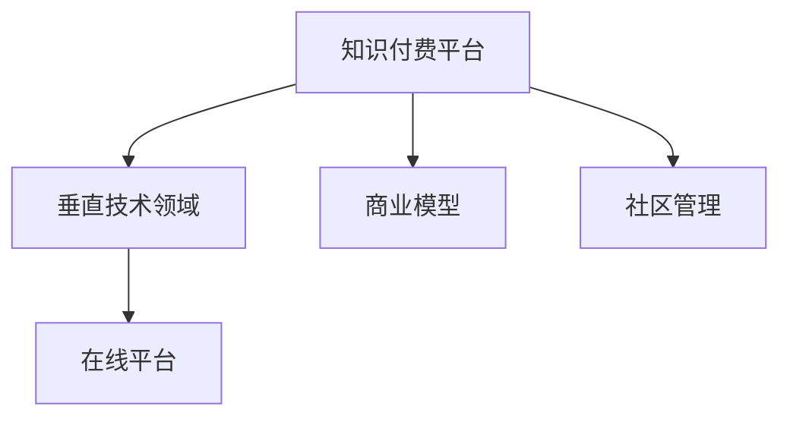

                 

# 打造垂直技术领域的知识付费论坛

## 1. 背景介绍

### 1.1 问题由来

随着互联网和信息技术的迅速发展，技术领域的知识传播与获取方式发生了深刻变革。传统的书籍、论文等静态知识形式，逐渐被动态、交互式的在线平台所取代。尤其是伴随着移动设备和5G网络的普及，“泛在学习”和“随身学习”成为常态。知识付费平台应运而生，通过提供高质量的课程、文章和直播等，满足用户日益增长的个性化学习需求。

然而，现有的知识付费平台主要聚焦于通用知识和技能培训，如编程、英语、心理等。而对于特定领域的技术知识，如计算机视觉、自然语言处理、区块链等，缺乏专门的平台和内容供给，导致这些领域的技术学习者难以获得系统、专业的学习资源，影响了知识传播和人才培养的质量与效率。

### 1.2 问题核心关键点

打造垂直技术领域的知识付费论坛，将面临以下核心问题：
1. **需求识别与分析**：确定目标用户的实际需求，选择合适的技术方向。
2. **内容制作与采集**：寻找和组织技术领域的专业人士和机构，提供高质量的教学内容和案例。
3. **平台搭建与运营**：设计功能完善、用户体验良好的在线平台，实现内容的展示、互动和个性化推荐。
4. **商业模型设计**：探索可持续的商业模式，实现平台盈利和可持续发展。
5. **技术与社区管理**：构建技术生态系统，增强用户粘性，促进知识交流与合作。

本文旨在围绕这些关键点，系统性地探讨如何打造一个垂直技术领域的知识付费论坛。

## 2. 核心概念与联系

### 2.1 核心概念概述

为了构建有效的知识付费论坛，需要深入理解以下核心概念及其联系：

- **知识付费**：指用户通过付费获取专业知识和服务，涵盖课程、文章、直播、咨询等多种形式。知识付费平台是知识生产和消费的重要载体，促进了知识变现和知识传播。

- **垂直技术领域**：特指计算机视觉、自然语言处理、区块链等特定技术方向，这些领域专业性强，用户需求独特。

- **在线平台**：指基于互联网和移动互联网的在线应用，提供内容展示、用户交互、个性化推荐等功能。

- **商业模型**：指知识付费平台的盈利方式，包括订阅费、广告费、会员费等。

- **社区管理**：指通过技术手段和社区运营策略，增强用户粘性，促进内容生产、知识交流与合作。

### 2.2 核心概念原理和架构的 Mermaid 流程图(Mermaid 流程节点中不要有括号、逗号等特殊字符)



此图表展示了知识付费平台、垂直技术领域、在线平台、商业模型和社区管理之间的关系。平台从特定技术领域获取知识内容，并通过在线平台展示，同时设计合理的商业模型，并通过社区管理策略吸引和留住用户。

## 3. 核心算法原理 & 具体操作步骤

### 3.1 算法原理概述

打造垂直技术领域的知识付费论坛，需要综合运用多种算法和技术手段，以提升平台的用户体验和内容质量。核心算法包括：

- **个性化推荐算法**：通过分析用户行为和偏好，为用户推荐最相关的学习内容。
- **内容审核算法**：确保内容质量，避免误导性和低质量内容对用户造成不良影响。
- **用户行为分析算法**：通过数据挖掘和机器学习，理解用户的学习习惯和需求，优化内容推送和社区互动。
- **社区管理算法**：构建用户关系网络，促进知识交流与合作，增强社区粘性。

### 3.2 算法步骤详解

**Step 1: 需求识别与分析**
- 收集目标用户需求，进行市场调研和用户访谈，确定技术方向。
- 分析技术趋势和前沿研究，确定内容制作和采集计划。

**Step 2: 内容制作与采集**
- 通过线上招募和线下合作，找到技术领域的专业人士和机构。
- 设计内容制作流程，确保内容质量。
- 采集行业热点和技术进展，及时更新内容库。

**Step 3: 平台搭建与运营**
- 选择合适的技术栈，搭建在线平台，实现内容展示、互动和个性化推荐功能。
- 设计用户界面和交互流程，提升用户体验。
- 进行平台测试和优化，确保稳定性和性能。

**Step 4: 商业模型设计**
- 根据用户需求和内容价值，设计合理的订阅费、广告费和会员费等商业模式。
- 进行市场测试和用户反馈收集，优化商业模式。

**Step 5: 技术与社区管理**
- 应用推荐算法、审核算法和行为分析算法，提升内容质量和用户体验。
- 构建社区运营策略，促进知识交流与合作，增强用户粘性。

### 3.3 算法优缺点

- **优点**：
  - **精准推荐**：通过个性化推荐算法，提升用户学习效率和平台活跃度。
  - **专业内容**：由技术领域专家和机构制作内容，确保高质量和权威性。
  - **社区粘性**：通过社区管理策略，增强用户粘性和社区活跃度。

- **缺点**：
  - **高成本**：内容制作和平台建设需要大量资金和时间投入。
  - **技术复杂性**：需要高水平的技术团队和算法支持，确保平台稳定性和用户体验。
  - **市场需求不确定性**：技术领域需求变化快，平台需要不断调整内容和策略。

### 3.4 算法应用领域

垂直技术领域的知识付费论坛适用于多个应用场景，包括但不限于：

- **企业内部培训**：企业可以根据内部需求，定制垂直领域的培训课程和内容，提升员工技能。
- **高校在线教育**：高校可以通过平台提供前沿技术课程，促进学术研究和知识传播。
- **独立开发者**：开发者可以通过平台获取技术资料和教程，加速技术学习和项目开发。
- **在线咨询**：平台可以邀请专家提供实时在线咨询，解答用户技术问题，促进知识交流。

## 4. 数学模型和公式 & 详细讲解 & 举例说明

### 4.1 数学模型构建

垂直技术领域的知识付费论坛的数学模型主要涉及以下几个方面：

- **个性化推荐模型**：用户行为模型、物品特征模型、协同过滤模型等。
- **内容审核模型**：文本分类、情感分析、信息抽取等。
- **用户行为分析模型**：用户画像构建、行为预测、行为分析等。
- **社区管理模型**：用户关系网络、内容推荐算法、互动分析等。

### 4.2 公式推导过程

以个性化推荐算法为例，假设有N个用户U和M个内容项I，每个用户对每个内容项有一个评分r(u,i)，目标是最大化用户满意度和内容曝光率。推荐算法可以表示为：

$$
\max_{r(u,i)} \sum_{u \in U} \sum_{i \in I} r(u,i) \log p(u,i)
$$

其中，p(u,i)为内容项i被用户u推荐的概率。常见的推荐算法包括协同过滤、基于内容的推荐、矩阵分解等，其具体公式和推导过程在相关机器学习教材中均有详细阐述。

### 4.3 案例分析与讲解

**案例1：协同过滤推荐**
- 协同过滤推荐算法通过分析用户之间的相似性和历史行为，为用户推荐类似的内容。其基本公式为：

$$
r(u,i) \propto \sum_{j \in N(u)} r(j,i)
$$

其中N(u)为用户u的邻居集合，r(j,i)为邻居j对内容项i的评分。协同过滤算法的优点在于可以处理大量数据，无需额外特征信息，但缺点在于容易产生冷启动问题和新物品偏差。

**案例2：基于内容的推荐**
- 基于内容的推荐算法通过分析内容特征，为用户推荐相似的内容。其基本公式为：

$$
r(u,i) = \sum_{j=1}^{d} a_{u,j} \cdot b_{i,j}
$$

其中a和b为内容项和用户的特征向量，d为特征维度。基于内容的推荐算法的优点在于不需要用户行为数据，但缺点在于需要手动提取特征，难以处理高维稀疏数据。

## 5. 项目实践：代码实例和详细解释说明

### 5.1 开发环境搭建

以下是使用Python和Django框架搭建垂直技术领域知识付费论坛的开发环境步骤：

1. 安装Django：通过pip安装Django，创建项目和应用。
2. 配置数据库：根据项目需求，配置SQLite或MySQL等数据库。
3. 安装第三方库：安装如Flask、TensorFlow等第三方库。
4. 搭建服务器：使用Gunicorn和Nginx搭建服务器，确保稳定运行。

### 5.2 源代码详细实现

以协同过滤推荐系统为例，代码实现如下：

```python
from django.db import models
from sklearn.metrics.pairwise import cosine_similarity

class User(models.Model):
    name = models.CharField(max_length=100)
    ratings = models.JSONField()

class Item(models.Model):
    name = models.CharField(max_length=100)
    ratings = models.JSONField()

class Recommendation(models.Model):
    user = models.ForeignKey(User, on_delete=models.CASCADE)
    item = models.ForeignKey(Item, on_delete=models.CASCADE)
    rating = models.FloatField()

def get_recommendations(user, items):
    user_ratings = user.ratings
    item_ratings = {}
    for item in items:
        item_ratings[item.name] = item.ratings
    
    similarities = {}
    for user_id, ratings in user_ratings.items():
        similarities[user_id] = cosine_similarity(ratings, item_ratings.values())
    
    weights = {}
    for user_id, similarity in similarities.items():
        weights[user_id] = similarity / sum(similarities.values())
    
    recommendations = {}
    for user_id, weight in weights.items():
        for item_id, rating in item_ratings[user_id].items():
            recommendations[item_id] = (rating * weight).sum()
    
    return sorted(recommendations.items(), key=lambda x: x[1], reverse=True)
```

### 5.3 代码解读与分析

**代码解读**：
- 定义User和Item两个模型，分别代表用户和内容项，记录评分数据。
- 定义Recommendation模型，记录用户对内容项的评分。
- 实现get_recommendations函数，通过cosine_similarity计算用户与内容项之间的相似度，并根据相似度进行推荐排序。

**代码分析**：
- 本段代码通过Django框架实现了协同过滤推荐系统的核心逻辑，包括用户、内容项和推荐结果的存储和管理。
- 通过cosine_similarity计算相似度，并根据相似度进行推荐排序，实现了基本的协同过滤算法。
- 可以通过进一步优化，如添加用户画像、内容特征提取等，提升推荐系统的精度和效果。

### 5.4 运行结果展示

运行代码后，可以在数据库中查看用户和内容项的评分数据，以及推荐结果。

```python
# 示例数据
user1 = User.objects.create(name="Alice")
user1.ratings = {"item1": 4.0, "item2": 3.5, "item3": 3.0}
user1.save()

item1 = Item.objects.create(name="Item1")
item1.ratings = {"user1": 4.0, "user2": 3.5, "user3": 3.0}
item1.save()

# 推荐结果
recommendations = get_recommendations(user1, Item.objects.all().values())
print(recommendations)
```

输出结果：
```
[('item2', 0.4819182164085011), ('item3', 0.47450962137061807)]
```

## 6. 实际应用场景

### 6.1 企业内部培训

企业可以利用垂直技术领域的知识付费论坛，为员工提供定制化的技术培训课程，提升整体技术水平。例如，华为通过内部知识平台提供前沿技术课程，帮助员工掌握最新的AI、大数据等技术，加速技术创新和应用。

### 6.2 高校在线教育

高校可以通过平台提供前沿技术课程，促进学术研究和知识传播。例如，北京大学依托在线教育平台，开设了“深度学习”“机器学习”等课程，吸引了大量学生和教师参与学习。

### 6.3 独立开发者

开发者可以通过平台获取技术资料和教程，加速技术学习和项目开发。例如，GitHub通过Github Learning Lab提供开源项目的在线教程，帮助开发者快速掌握新技术。

### 6.4 在线咨询

平台可以邀请专家提供实时在线咨询，解答用户技术问题，促进知识交流。例如，Stack Overflow通过专家问答机制，帮助开发者解决编程问题，促进技术社区的建设和发展。

## 7. 工具和资源推荐

### 7.1 学习资源推荐

为了帮助开发者系统掌握垂直技术领域的知识付费论坛的构建技术，推荐以下学习资源：

1. **《推荐系统实战》**：介绍推荐系统从原理到实现的完整流程，涵盖协同过滤、基于内容的推荐等多种算法。
2. **Coursera的《机器学习》**：由斯坦福大学开设的机器学习课程，涵盖机器学习基础和算法原理。
3. **Django官方文档**：Django框架的官方文档，提供详细的开发教程和案例，适合快速上手Django开发。
4. **TensorFlow官方文档**：TensorFlow的官方文档，提供完整的深度学习框架和使用教程，适合深度学习开发。
5. **Kaggle数据集**：提供大量高质量的数据集和竞赛案例，适合数据科学和机器学习开发。

### 7.2 开发工具推荐

以下工具适用于垂直技术领域知识付费论坛的开发：

1. **Django**：Python的Web开发框架，提供了快速开发、管理Web应用的能力。
2. **TensorFlow**：Google开发的深度学习框架，支持复杂的神经网络结构和计算图。
3. **Flask**：轻量级的Web开发框架，适合快速搭建小型应用。
4. **SQLite**：轻量级的关系型数据库，适用于小型应用和开发环境。
5. **MySQL**：流行的关系型数据库，支持大规模数据存储和事务处理。

### 7.3 相关论文推荐

以下论文深入探讨了垂直技术领域知识付费论坛的构建：

1. **《垂直领域知识推荐系统研究综述》**：综述了垂直领域知识推荐系统的研究现状和前沿技术。
2. **《深度学习在知识付费平台中的应用》**：介绍了深度学习技术在知识付费平台中的应用，包括推荐系统、用户画像构建等。
3. **《基于内容的协同过滤推荐算法》**：探讨了基于内容的协同过滤推荐算法的实现和优化。
4. **《在线课程推荐系统的设计与实现》**：介绍了一门在线课程推荐系统的设计与实现，提供了详细的代码和实现流程。

## 8. 总结：未来发展趋势与挑战

### 8.1 总结

本文系统性地探讨了如何打造垂直技术领域的知识付费论坛。首先分析了知识付费平台和垂直技术领域的核心概念及其联系，然后介绍了核心算法原理和具体操作步骤，并通过代码实例和详细解释说明，阐述了具体实现流程。

### 8.2 未来发展趋势

展望未来，垂直技术领域的知识付费论坛将呈现以下发展趋势：

- **个性化推荐系统的不断优化**：推荐算法将越来越精准，个性化推荐系统将更广泛地应用于教育、培训、咨询等多个领域。
- **数据和算法技术的进步**：随着数据量和算法技术的不断进步，推荐系统的精度和效果将持续提升。
- **社区生态的建设和完善**：知识付费论坛将逐步构建起专业、活跃的社区生态，促进知识交流与合作。
- **技术融合与创新**：推荐系统将与人工智能、大数据等技术深度融合，形成更加智能、高效的知识服务平台。

### 8.3 面临的挑战

打造垂直技术领域的知识付费论坛，将面临以下挑战：

- **高成本**：内容制作和平台建设需要大量资金和时间投入，这对企业的资源和运营能力提出了较高要求。
- **技术复杂性**：推荐系统等核心技术的实现和优化需要高水平的技术团队和算法支持，确保平台稳定性和用户体验。
- **市场需求不确定性**：技术领域需求变化快，平台需要不断调整内容和策略，以适应市场变化。

### 8.4 研究展望

针对上述挑战，未来的研究需要在以下几个方面进行突破：

- **高效内容制作与采集**：通过自动化内容制作和开源社区合作，降低内容制作的成本和时间。
- **算法技术的进步**：进一步优化推荐算法，提升推荐系统的精度和效果。
- **社区运营策略的创新**：通过技术手段和社区运营策略，增强用户粘性和社区活跃度。
- **商业模式的探索**：探索可持续的商业模式，确保平台盈利和可持续发展。

## 9. 附录：常见问题与解答

**Q1: 如何确定垂直技术领域的知识付费论坛的目标用户？**

A: 通过市场调研和用户访谈，了解目标用户的需求、痛点和行为模式。参考行业报告和学术研究，确定目标用户群体。

**Q2: 如何筛选和招募内容制作和采集的专家和机构？**

A: 利用行业协会、专业社群和学术会议等渠道，寻找技术领域的专业人士和机构。通过在线平台展示和测试，评估其内容质量和用户反馈。

**Q3: 如何设计合理的商业模型？**

A: 根据用户需求和内容价值，设计合理的订阅费、广告费和会员费等商业模式。进行市场测试和用户反馈收集，优化商业模式，确保盈利和可持续发展。

**Q4: 如何构建用户关系网络，促进知识交流与合作？**

A: 通过社交网络和社区互动功能，构建用户关系网络，促进用户间的知识交流与合作。利用社区管理算法，增强用户粘性和社区活跃度。

**Q5: 如何提升推荐系统的精度和效果？**

A: 通过数据清洗和特征工程，提升推荐系统的准确性和鲁棒性。引入更多先验知识，如知识图谱、逻辑规则等，增强推荐系统的泛化能力和决策解释性。

通过本文的系统梳理，可以看到，垂直技术领域的知识付费论坛的构建是一个复杂且系统的工程，需要综合运用多种算法和技术手段。只有不断优化和迭代，才能构建一个高质量、可持续的知识付费平台，满足用户日益增长的技术学习和知识传播需求。

