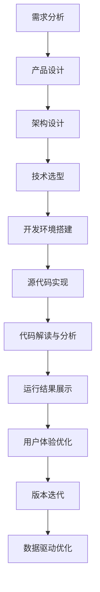

                 

# 打造技术型知识付费APP的开发流程

> 关键词：知识付费,技术型APP,开发流程,API设计,用户体验,版本迭代,数据驱动

## 1. 背景介绍

在数字化时代，知识付费逐渐成为各行各业从业者获取知识和技能的重要方式。知识付费APP通过整合优质内容资源，为用户提供一站式的知识获取和交流平台。技术型知识付费APP不仅需要具备优秀的用户体验和内容管理能力，还需要强大的技术支撑，确保平台稳定高效运行。本文将系统介绍打造技术型知识付费APP的开发流程，从需求分析、架构设计、技术选型、开发实践等多个方面进行深入探讨。

## 2. 核心概念与联系

### 2.1 核心概念概述

- **知识付费APP**：通过订阅或付费模式，为用户提供线上学习和获取知识的服务平台。
- **技术型APP**：相较于内容型APP，技术型APP更注重后台技术架构、数据处理、性能优化等方面的设计和实现。
- **开发流程**：从需求分析到产品发布，全程涉及的各个阶段、环节和活动。
- **API设计**：定义平台上各模块间交互和数据传递的标准接口。
- **用户体验**：用户在使用APP时的感受和满意度，直接影响用户黏性和留存率。
- **版本迭代**：定期更新APP版本，持续优化功能、提升性能、修复bug。
- **数据驱动**：通过数据分析和用户行为研究，指导产品设计和开发决策。

这些核心概念共同构成了技术型知识付费APP开发的核心框架，涵盖从内容管理到技术实现的各个方面。

### 2.2 核心概念原理和架构的 Mermaid 流程图



这个流程图展示了技术型知识付费APP开发流程的关键环节，从需求分析到版本迭代，每个环节都需精心设计，确保最终产品的稳定性和用户体验。

## 3. 核心算法原理 & 具体操作步骤

### 3.1 算法原理概述

技术型知识付费APP的开发涉及多个子系统的协同工作，包括用户管理、内容发布、支付系统、数据分析等。这些子系统间通过标准化的API进行交互，保证了系统的高可靠性和灵活性。

### 3.2 算法步骤详解

**Step 1: 需求分析和产品设计**

1. **需求调研**：通过问卷调查、用户访谈、竞品分析等方式，收集用户需求。
2. **需求分析**：将用户需求转化为功能需求，确定APP的核心功能模块。
3. **产品设计**：使用UML、流程图等工具，绘制功能模块图和用户流程图，明确每个功能模块的职责和交互流程。

**Step 2: 架构设计和组件划分**

1. **架构设计**：根据产品需求，选择适合的技术架构，如微服务架构、单体架构等。
2. **组件划分**：将系统分解为多个独立的微服务组件，明确组件间的依赖关系和交互方式。
3. **数据设计**：定义数据模型，设计数据库结构和关系。

**Step 3: 技术选型和工具选择**

1. **语言和框架选择**：根据项目需求和技术栈，选择适合的开发语言和框架。
2. **中间件选择**：选择适合的缓存、消息队列、数据库等中间件，提高系统性能和可靠性。
3. **版本控制和协作工具**：选择适合的版本控制系统（如Git）和协作工具（如Jira、Trello），保证开发进度和代码质量。

**Step 4: 开发环境搭建和环境管理**

1. **环境搭建**：设置开发、测试、生产等不同环境，配置必要的依赖和工具。
2. **环境管理**：使用容器化技术（如Docker），管理开发和测试环境，保证环境一致性。

**Step 5: 源代码实现和功能开发**

1. **功能实现**：根据产品设计文档，实现每个功能模块。
2. **代码审查**：使用代码审查工具（如Code Review），保证代码质量。
3. **测试和优化**：编写单元测试和集成测试，修复Bug，优化性能。

**Step 6: API设计和管理**

1. **API设计**：根据组件划分和功能需求，设计标准化的API接口，定义请求和响应格式。
2. **API管理**：使用API管理工具（如Swagger），管理API文档和请求响应。

**Step 7: 用户体验优化**

1. **界面设计**：设计符合用户习惯的UI界面，提升用户体验。
2. **交互优化**：优化用户交互流程，提高操作便捷性。
3. **性能优化**：通过缓存、异步加载等技术，提升APP响应速度。

**Step 8: 版本迭代和持续发布**

1. **版本管理**：使用版本控制工具，管理每个版本的功能和变更。
2. **发布管理**：使用CI/CD工具（如Jenkins），自动化发布和回滚。

**Step 9: 数据驱动和优化**

1. **数据分析**：收集和分析用户行为数据，发现问题和优化点。
2. **用户研究**：进行用户调研和行为分析，指导产品改进。
3. **迭代优化**：根据数据分析结果和用户反馈，迭代优化产品功能。

### 3.3 算法优缺点

技术型知识付费APP的开发流程主要具有以下优点：

- **模块化和可扩展性**：将系统拆分为多个微服务，便于独立开发和扩展。
- **自动化和持续集成**：使用CI/CD工具，自动化测试和发布，提高开发效率。
- **用户体验优化**：通过用户研究和使用数据分析，持续优化用户体验。

同时，该流程也存在以下缺点：

- **技术栈选择复杂**：根据项目需求选择合适的技术栈和工具，需要综合考虑各种因素。
- **协作难度高**：涉及多个团队和职能，协调沟通成本较高。
- **数据隐私和安全**：知识付费平台需要处理大量用户数据，数据安全和隐私保护成为重要挑战。

### 3.4 算法应用领域

技术型知识付费APP的开发流程已广泛应用于各类在线教育、职业培训、学术研究等领域。通过系统化的流程设计和持续的技术优化，确保了平台的高效稳定运行和持续创新。

## 4. 数学模型和公式 & 详细讲解 & 举例说明

### 4.1 数学模型构建

知识付费APP的核心数学模型主要涉及用户行为分析和推荐系统设计。以下以推荐系统为例，说明如何构建数学模型。

**推荐系统目标**：给定用户历史行为数据和商品数据，预测用户对新商品的兴趣，推荐用户可能感兴趣的商品。

**用户行为数据**：
- 用户ID：u
- 商品ID：i
- 行为时间：t
- 行为类型：b（如浏览、购买、评价）

**商品数据**：
- 商品ID：i
- 商品属性：a
- 商品评分：s

**推荐模型**：
$$
P_{u,i} = f(u, i, \theta)
$$
其中 $P_{u,i}$ 表示用户u对商品i的兴趣程度，$\theta$ 是模型的参数。

**推荐算法**：
- 协同过滤算法（CF）：通过用户行为数据预测用户对商品i的兴趣。
- 基于内容的推荐算法：通过商品属性预测用户对商品i的兴趣。
- 混合推荐算法：结合多种推荐方法，提高推荐效果。

### 4.2 公式推导过程

**协同过滤算法（CF）**：

1. **用户行为矩阵**：将用户行为数据表示为矩阵 $R \in \mathbb{R}^{N \times M}$，其中 $N$ 是用户数，$M$ 是商品数。

2. **用户兴趣预测**：利用用户行为数据，预测用户对商品的兴趣。假设用户u对商品i的兴趣为 $R_{ui}$，利用余弦相似度计算相似度向量 $S_u$。

3. **商品推荐**：根据相似度向量 $S_u$ 预测用户u对商品i的兴趣，选择兴趣程度高的商品推荐。

**基于内容的推荐算法**：

1. **商品属性表示**：将商品属性表示为向量 $A_i \in \mathbb{R}^d$。

2. **用户兴趣预测**：利用用户历史行为数据，预测用户对商品i的兴趣。假设用户u对商品i的兴趣为 $R_{ui}$，计算用户u与商品i的匹配程度。

3. **商品推荐**：选择匹配程度高的商品推荐给用户。

### 4.3 案例分析与讲解

以知识付费平台中的个性化推荐系统为例，利用协同过滤算法和基于内容的推荐算法，设计推荐模型。

**数据集**：
- 用户行为数据：1000用户对1000商品的浏览、购买、评价记录。
- 商品属性数据：1000商品的具体属性信息。

**模型构建**：

1. **协同过滤算法**：
   - 构建用户行为矩阵 $R \in \mathbb{R}^{1000 \times 1000}$。
   - 计算相似度向量 $S_u$。
   - 预测用户u对商品i的兴趣，选择兴趣程度高的商品推荐。

2. **基于内容的推荐算法**：
   - 提取商品属性向量 $A_i$。
   - 计算用户u与商品i的匹配程度。
   - 选择匹配程度高的商品推荐。

**模型优化**：
- 结合协同过滤和基于内容的推荐算法，设计混合推荐算法。
- 利用用户反馈数据不断优化推荐算法，提高推荐精度。

## 5. 项目实践：代码实例和详细解释说明

### 5.1 开发环境搭建

**开发环境搭建**：

1. **编程语言**：选择Python，便于快速迭代和实现复杂算法。
2. **开发框架**：选择Flask，便于构建Web应用。
3. **数据库**：选择MySQL，处理用户行为数据和商品数据。
4. **缓存中间件**：选择Redis，提高推荐系统的响应速度。

### 5.2 源代码详细实现

**推荐系统实现**：

1. **用户行为数据处理**：
   - 读取用户行为数据，构建用户行为矩阵 $R$。
   - 计算相似度向量 $S_u$。
   
2. **商品属性处理**：
   - 读取商品属性数据，构建商品属性矩阵 $A$。
   - 计算用户u与商品i的匹配程度。

3. **推荐算法实现**：
   - 协同过滤推荐算法。
   - 基于内容的推荐算法。
   - 混合推荐算法。

**API设计和管理**：

1. **API接口设计**：
   - 用户行为数据接口：POST /user_behavior，接收用户行为数据。
   - 商品属性接口：GET /product_attribute，获取商品属性数据。
   - 推荐接口：GET /recommendation，获取个性化推荐商品。

2. **API文档管理**：
   - 使用Swagger工具，管理API文档和请求响应。

### 5.3 代码解读与分析

**用户行为数据处理代码**：

```python
import pandas as pd
from sklearn.metrics.pairwise import cosine_similarity

# 读取用户行为数据
user_behavior_data = pd.read_csv('user_behavior.csv')

# 构建用户行为矩阵
user_behavior_matrix = user_behavior_data.pivot_table(index='user_id', columns='item_id', values='behavior')

# 计算相似度向量
similarity_matrix = cosine_similarity(user_behavior_matrix)
```

**商品属性处理代码**：

```python
# 读取商品属性数据
product_attribute_data = pd.read_csv('product_attribute.csv')

# 构建商品属性矩阵
product_attribute_matrix = product_attribute_data.pivot_table(index='item_id', columns='attribute', values='attribute_value')

# 计算用户与商品匹配程度
matching_matrix = pd.merge(user_behavior_matrix, product_attribute_matrix, on='item_id')['behavior'] * product_attribute_matrix
```

**推荐算法实现代码**：

```python
from scipy.sparse import csr_matrix
from scipy.sparse.linalg import svds

# 协同过滤推荐算法
def collaborative_filtering(user_behavior_matrix):
    u, s, v = svds(user_behavior_matrix, k=5)
    return u, s, v

# 基于内容的推荐算法
def content_based_filtering(product_attribute_matrix):
    # 使用SVD分解商品属性矩阵
    u, s, v = svds(product_attribute_matrix, k=5)
    return u, s, v

# 混合推荐算法
def mixed_recommendation(user_behavior_matrix, product_attribute_matrix):
    # 协同过滤推荐
    u1, s1, v1 = collaborative_filtering(user_behavior_matrix)
    # 基于内容的推荐
    u2, s2, v2 = content_based_filtering(product_attribute_matrix)
    # 混合推荐
    U = np.hstack((u1, u2))
    S = np.hstack((s1, s2))
    V = np.hstack((v1, v2))
    return U, S, V
```

**API设计代码**：

```python
from flask import Flask, jsonify, request

app = Flask(__name__)

# 用户行为数据接口
@app.route('/user_behavior', methods=['POST'])
def user_behavior():
    data = request.json
    # 处理用户行为数据
    # ...
    return jsonify({'status': 'success'})

# 商品属性接口
@app.route('/product_attribute', methods=['GET'])
def product_attribute():
    data = request.args.get('item_id')
    # 获取商品属性数据
    # ...
    return jsonify({'status': 'success', 'data': data})

# 推荐接口
@app.route('/recommendation', methods=['GET'])
def recommendation():
    user_id = request.args.get('user_id')
    # 获取个性化推荐商品
    # ...
    return jsonify({'status': 'success', 'recommendation': recommendation})
```

### 5.4 运行结果展示

**推荐系统性能指标**：
- 精确率（Precision）：推荐系统推荐的商品中，用户实际喜欢的商品比例。
- 召回率（Recall）：实际喜欢的商品中被推荐系统的商品比例。
- F1分数：精确率和召回率的调和平均数。

**推荐系统优化**：
- 利用用户反馈数据不断优化模型参数。
- 使用增量学习技术，减少重新训练带来的开销。

## 6. 实际应用场景

### 6.1 在线教育平台

在线教育平台通过技术型知识付费APP，为学员提供个性化学习推荐和知识分享社区。平台通过用户行为数据分析和推荐系统设计，提升课程完成率和学员满意度。

**应用场景**：
- 个性化课程推荐：根据学员学习行为，推荐适合的课程和资源。
- 知识分享社区：学员可发布和分享学习心得，构建社区互动。

### 6.2 职业培训平台

职业培训平台通过技术型知识付费APP，为从业者提供职业技能培训和职业认证服务。平台通过技术架构设计和数据驱动优化，提升培训效果和平台使用率。

**应用场景**：
- 个性化学习路径：根据用户职业背景和学习需求，推荐适合的培训课程。
- 职业认证服务：提供职业认证考试培训和考试服务，提升用户职业竞争力。

### 6.3 学术研究平台

学术研究平台通过技术型知识付费APP，为研究人员提供学术资源和研究工具。平台通过高可用性和数据安全设计，保障学术研究和数据共享的便捷性和安全性。

**应用场景**：
- 学术资源共享：提供学术论文、数据集和代码库，促进学术交流。
- 研究工具服务：提供数据处理、分析工具，提高研究效率。

## 7. 工具和资源推荐

### 7.1 学习资源推荐

1. **《深度学习》课程**：由斯坦福大学开设，详细讲解深度学习理论和技术。
2. **Kaggle**：数据科学和机器学习竞赛平台，提供大量开源数据集和实战项目。
3. **TensorFlow官方文档**：详细介绍了TensorFlow的使用和API设计。
4. **《机器学习实战》书籍**：提供实用的机器学习算法和代码实现。
5. **GitHub**：全球最大的开源代码托管平台，提供丰富的项目资源和学习社区。

### 7.2 开发工具推荐

1. **IDE**：选择PyCharm或VS Code，提供代码编写、调试和版本控制功能。
2. **版本控制**：使用Git进行代码版本管理和协作。
3. **协作工具**：使用Trello或Jira进行任务管理和进度跟踪。
4. **CI/CD**：使用Jenkins进行自动化构建和部署。
5. **数据库**：选择MySQL或MongoDB，处理结构化和非结构化数据。

### 7.3 相关论文推荐

1. **《推荐系统》书籍**：详细讲解推荐系统理论和技术。
2. **KDD论文**：最新推荐系统论文集，涵盖多种推荐算法和应用案例。
3. **AAAI论文**：最新知识图谱和自然语言处理论文集，探讨未来技术趋势。

## 8. 总结：未来发展趋势与挑战

### 8.1 研究成果总结

技术型知识付费APP的开发流程，从需求分析到版本迭代，每一个环节都需要精心设计和优化。通过科学合理的设计，确保了系统的高效稳定运行和持续创新。推荐系统设计、数据驱动优化、用户体验提升等技术，成为知识付费APP的重要保障。

### 8.2 未来发展趋势

未来技术型知识付费APP的发展趋势如下：

1. **人工智能技术的深入应用**：引入深度学习、自然语言处理等AI技术，提升推荐算法精度和用户满意度。
2. **多模态数据融合**：结合文本、图像、音频等多模态数据，构建更加全面、立体的推荐系统。
3. **实时推荐系统**：利用流数据处理和实时计算技术，实现动态推荐，提高推荐效果。
4. **边缘计算技术**：引入边缘计算技术，提高推荐系统的响应速度和资源利用效率。
5. **隐私保护和数据安全**：加强数据隐私保护和加密技术，确保用户数据安全。

### 8.3 面临的挑战

技术型知识付费APP在发展过程中也面临一些挑战：

1. **数据隐私和安全**：知识付费APP需要处理大量用户数据，数据隐私和安全成为重要问题。
2. **技术复杂性**：技术型APP涉及多种技术栈和工具，技术复杂度较高。
3. **用户需求多样性**：不同用户对知识付费的需求各异，如何满足多样化需求，提升用户黏性。
4. **内容质量控制**：内容质量直接影响用户体验和平台口碑，如何确保内容高质量、有价值。
5. **市场竞争**：知识付费市场竞争激烈，如何持续创新，保持平台竞争力。

### 8.4 研究展望

未来技术型知识付费APP的研究展望如下：

1. **推荐系统优化**：引入增量学习、深度学习等技术，不断优化推荐算法。
2. **数据驱动决策**：利用大数据分析技术，指导产品设计和开发决策。
3. **用户体验优化**：结合用户研究和数据分析，不断提升用户体验和满意度。
4. **技术栈扩展**：探索更多新兴技术，如区块链、边缘计算等，提升平台技术能力。

## 9. 附录：常见问题与解答

**Q1：如何设计高效的用户行为数据处理流程？**

A: 用户行为数据处理流程需要高效、可靠，具体如下：
1. 数据清洗：去除噪音数据，填补缺失值。
2. 数据编码：将行为类型等非数值数据编码为数值。
3. 数据存储：使用高效的数据存储格式，如稀疏矩阵、向量等。
4. 数据查询：使用索引和优化查询算法，提升查询效率。

**Q2：如何构建高效的数据推荐系统？**

A: 高效的数据推荐系统设计如下：
1. 推荐算法选择：根据数据特点和业务需求，选择合适的推荐算法。
2. 特征工程：提取和构建有意义的特征，提升推荐效果。
3. 实时推荐：使用流数据处理技术，实现实时推荐。
4. 性能优化：使用缓存、异步加载等技术，提升推荐系统的响应速度。

**Q3：如何确保推荐系统的准确性和鲁棒性？**

A: 推荐系统的准确性和鲁棒性需要从多个方面保障：
1. 数据质量：确保数据真实、准确，避免数据偏差。
2. 模型选择：选择适合的数据模型，如协同过滤、基于内容的推荐等。
3. 用户反馈：通过用户反馈不断优化推荐算法和模型参数。
4. 异常处理：处理异常数据和噪声，提升推荐系统的鲁棒性。

**Q4：如何设计高效的知识付费APP前端界面？**

A: 前端界面设计需要考虑用户体验和交互设计，具体如下：
1. 界面布局：合理设计界面布局，提升用户体验。
2. 交互设计：设计简洁、直观的用户操作流程。
3. 响应优化：使用前端优化技术，如懒加载、异步加载，提升APP响应速度。
4. 可访问性：设计符合Web标准的可访问性界面，提升用户使用便捷性。

---

作者：禅与计算机程序设计艺术 / Zen and the Art of Computer Programming

