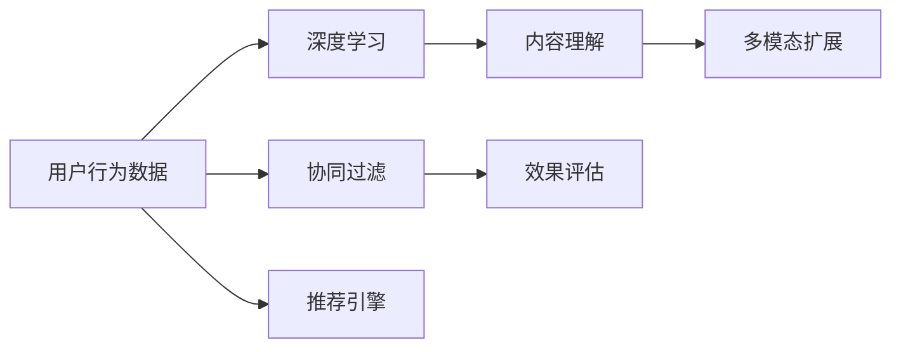

                 

# 打造技术型知识付费平台的推荐算法

> 关键词：推荐算法, 知识付费, 技术型平台, 协同过滤, 深度学习, 内容理解, 多模态, 效果评估, 用户行为, 混合推荐

## 1. 背景介绍

在信息技术飞速发展的今天，在线知识付费平台已经成为知识变现的重要手段。技术型知识付费平台不仅提供知识内容，更着重于技术深度与实际应用，具备高价值和高付费标准。如何构建一个高效、精准、个性化的推荐系统，为用户推荐最匹配的内容，成为技术型平台的核心需求。

推荐系统（Recommender System）的目标是帮助用户在海量内容中筛选出最符合其兴趣和需求的信息。对于技术型知识付费平台而言，推荐算法不仅要具备一般推荐系统的高效性和个性化，还需要特别关注内容的深度和技术性，确保推荐内容具有高专业性和高可信度。

## 2. 核心概念与联系

### 2.1 核心概念概述

本节将介绍推荐系统构建的核心概念，并展示这些概念间的联系。

- **推荐系统**：使用算法为用户推荐最相关内容的系统。核心目标是通过算法分析用户行为和偏好，预测用户可能感兴趣的内容。

- **协同过滤**：一种常用的推荐算法，基于用户或项目的相似性进行推荐。常用于推荐相似用户或项目间有联系的场景，如技术型知识付费平台的内容推荐。

- **深度学习**：一种强大的机器学习方法，通过神经网络模型从大量数据中学习规律和特征，用于提取和生成复杂数据模式。

- **内容理解**：通过NLP和语义分析技术，理解内容的关键信息、技术点、难度等，确保推荐内容的专业性和深度。

- **多模态**：综合利用文本、图像、视频等多维度数据，提供更为丰富和深入的推荐内容。

- **效果评估**：通过精确率、召回率、F1值等指标评估推荐系统的性能，并持续优化。

- **用户行为**：记录和分析用户在平台上的行为数据，如浏览历史、搜索记录、评分等，用于训练推荐算法。

这些概念通过推荐算法进行串联，构建了一个技术型知识付费平台推荐系统的基本框架。其中，协同过滤和深度学习是主要的算法技术，内容理解和用户行为分析则是对数据进行处理和特征提取，多模态扩展了推荐内容的维度，效果评估用于持续优化推荐系统。

### 2.2 核心概念原理和架构的 Mermaid 流程图



## 3. 核心算法原理 & 具体操作步骤

### 3.1 算法原理概述

推荐算法可以分为基于协同过滤和基于内容的推荐两大类。对于技术型知识付费平台，我们主要讨论以下两种推荐方法：

- **协同过滤**：基于用户的历史行为数据，找到与用户兴趣相似的其他用户或项目，从而推荐给用户。协同过滤算法简单高效，但需要大量用户行为数据。

- **深度学习推荐**：使用神经网络模型分析用户行为和内容特征，生成个性化的推荐列表。深度学习推荐可以处理复杂的数据模式，但需要更多的数据和计算资源。

协同过滤和深度学习在技术型知识付费平台中常结合使用，形成混合推荐系统。通过协同过滤算法初步筛选推荐内容，再通过深度学习算法对每个用户生成深度个性化的推荐。

### 3.2 算法步骤详解

推荐算法构建主要分为数据预处理、特征工程、模型训练和评估四个步骤：

**Step 1: 数据预处理**

1. 收集和清洗用户行为数据，如点击、搜索、评分、评论等。
2. 对文本内容进行预处理，包括分词、去停用词、提取技术点等。
3. 数据归一化、缺失值处理、异常值检测等预处理操作。

**Step 2: 特征工程**

1. 提取用户行为特征，如浏览时长、点击次数、评分、评分变化等。
2. 提取内容特征，如关键词频率、技术难度、文章长度等。
3. 构建多模态特征，如结合图像、视频等多媒体内容。

**Step 3: 模型训练**

1. 使用协同过滤算法（如基于用户的矩阵分解、基于项目的矩阵分解等）初步筛选推荐内容。
2. 使用深度学习模型（如RNN、LSTM、GRU等）处理用户行为和内容特征。
3. 集成协同过滤和深度学习模型，形成混合推荐系统。

**Step 4: 评估和优化**

1. 使用精确率、召回率、F1值等指标评估推荐系统性能。
2. 分析评估结果，识别性能瓶颈和算法缺陷。
3. 调整模型参数和特征工程，优化推荐算法。

### 3.3 算法优缺点

协同过滤算法和深度学习推荐系统各有优缺点：

- **协同过滤的优点**：
  - 简单易实现，不需要大量特征工程。
  - 能够捕捉用户和内容之间的隐式关联。
  - 对新用户和老用户同样有效。

- **协同过滤的缺点**：
  - 需要大量用户行为数据，数据稀疏问题明显。
  - 无法处理新用户，推荐效果随时间衰减。
  - 对恶意刷单等行为敏感。

- **深度学习的优点**：
  - 能够处理复杂数据模式，提取高层次特征。
  - 能够进行特征自学习，不需要大量手工特征。
  - 适用于个性化推荐和大规模数据集。

- **深度学习的缺点**：
  - 需要大量数据和计算资源，训练复杂。
  - 特征表示过于抽象，难以解释。
  - 对数据质量要求高，容易过拟合。

### 3.4 算法应用领域

推荐算法在技术型知识付费平台的应用非常广泛，涉及以下几大场景：

- **内容推荐**：为用户推荐相关课程、文章、报告等知识内容。
- **技术趋势推荐**：根据用户行为推荐最新技术趋势和热点。
- **专家推荐**：推荐技术领域内的专家，帮助用户获取高质量技术见解。
- **学习路径推荐**：根据用户的学习进度和兴趣，推荐学习路线。
- **问题解答推荐**：推荐相关问题解答，解决用户的技术疑问。

推荐系统不仅提升用户粘性，还能显著增加平台变现能力，是技术型知识付费平台不可或缺的关键组件。

## 4. 数学模型和公式 & 详细讲解 & 举例说明

### 4.1 数学模型构建

推荐系统构建的数学模型主要包括以下几个部分：

- **用户行为模型**：将用户行为数据表示为向量形式，建立用户行为矩阵 $U$，其中 $u_{ij}$ 表示用户 $i$ 对项目 $j$ 的行为（如评分、点击等）。

- **内容特征模型**：将内容特征表示为向量形式，建立内容特征矩阵 $V$，其中 $v_{ij}$ 表示内容 $j$ 在特征维度 $i$ 上的值。

- **用户-内容评分矩阵**：根据用户行为矩阵和内容特征矩阵计算得到用户对内容的评分矩阵 $P$，其中 $p_{ij}$ 表示用户 $i$ 对内容 $j$ 的评分。

### 4.2 公式推导过程

**协同过滤算法**

协同过滤算法主要分为基于用户的矩阵分解和基于项目的矩阵分解两种方法。这里以基于用户的矩阵分解为例，介绍其推导过程：

假设用户行为矩阵为 $U$，用户数为 $m$，项目数为 $n$，评分矩阵为 $P$。基于用户的矩阵分解公式如下：

$$
\hat{P} = \min_{U, V} \frac{1}{2} ||U \times V - P||_F^2
$$

其中 $||.||_F$ 表示矩阵的 Frobenius 范数，$U$ 和 $V$ 分别是用户和项目的特征矩阵。

协同过滤算法的目的是通过最小化 $||U \times V - P||_F^2$，找到最接近实际评分矩阵 $P$ 的因子分解结果 $U$ 和 $V$。

**深度学习推荐模型**

深度学习推荐模型常使用RNN、LSTM、GRU等序列模型。这里以LSTM模型为例，介绍其基本结构和推荐过程：

1. 输入层：将用户行为数据和内容特征数据拼接，输入LSTM模型。

2. 隐藏层：LSTM模型通过记忆单元存储历史信息，捕捉时间依赖关系。

3. 输出层：LSTM模型的输出表示用户对内容的评分，通过sigmoid函数将其转化为概率值。

LSTM模型的公式如下：

$$
h_t = f(h_{t-1}, x_t)
$$

$$
o_t = g(h_t, c_t)
$$

$$
c_t = \tanh(c_{t-1}), i_t = \sigma(i_t, h_{t-1}), f_t = \sigma(f_t, h_{t-1})
$$

其中 $f$ 和 $g$ 分别表示遗忘门和输出门，$i_t$ 和 $f_t$ 表示输入门，$x_t$ 表示当前时间步的输入，$c_t$ 表示记忆单元，$h_t$ 表示隐藏状态。

### 4.3 案例分析与讲解

假设有一家技术型知识付费平台，拥有大量用户行为数据和内容数据。平台需要为用户推荐高质量的技术文章。

**协同过滤推荐**

1. 收集用户点击、搜索、评分等行为数据。
2. 将用户行为数据表示为用户行为矩阵 $U$，将内容特征数据表示为内容特征矩阵 $V$。
3. 使用矩阵分解算法得到用户-内容评分矩阵 $\hat{P}$。
4. 根据 $\hat{P}$ 计算用户对内容的评分，推荐高分文章。

**深度学习推荐**

1. 收集用户点击、搜索、评分等行为数据。
2. 将行为数据和内容特征数据拼接，输入LSTM模型。
3. 训练LSTM模型，输出用户对内容的评分概率。
4. 根据评分概率排序，推荐高分文章。

## 5. 项目实践：代码实例和详细解释说明

### 5.1 开发环境搭建

推荐系统开发主要使用Python和深度学习框架如TensorFlow或PyTorch。以下是开发环境搭建步骤：

1. 安装Python和相关依赖库：
   ```bash
   sudo apt-get update
   sudo apt-get install python3-pip python3-dev
   pip3 install torch tensorflow scikit-learn pandas jupyter
   ```

2. 安装深度学习框架：
   ```bash
   pip3 install tensorflow-gpu==2.0.0 tensorflow-addons
   pip3 install torch torchvision torchtext
   ```

3. 搭建Jupyter Notebook环境：
   ```bash
   jupyter notebook
   ```

### 5.2 源代码详细实现

以下是一个简单的深度学习推荐系统实现示例，使用LSTM模型对用户行为数据和内容特征进行推荐：

```python
import torch
import torch.nn as nn
import torch.optim as optim
import pandas as pd
from sklearn.model_selection import train_test_split

# 读取用户行为数据
data = pd.read_csv('user_behavior.csv')

# 特征工程，将行为数据和内容特征拼接
user_behavior = data[['click', 'search', 'score']]
content_features = data[['tech_point', 'difficulty', 'length']]
features = pd.concat([user_behavior, content_features], axis=1)

# 构建LSTM模型
class LSTM(nn.Module):
    def __init__(self, input_size, hidden_size, output_size):
        super(LSTM, self).__init__()
        self.hidden_size = hidden_size
        self.lstm = nn.LSTM(input_size, hidden_size, 1, batch_first=True)
        self.fc = nn.Linear(hidden_size, output_size)
        self.sigmoid = nn.Sigmoid()

    def forward(self, input):
        h0 = self.sigmoid(input[:, 0, :])
        c0 = torch.zeros((1, input.size(0), self.hidden_size))
        out, _ = self.lstm(input[:, 1:, :], (h0, c0))
        out = self.fc(out[:, -1, :])
        return out

# 训练LSTM模型
input_size = features.shape[1]
hidden_size = 100
output_size = 1
lstm_model = LSTM(input_size, hidden_size, output_size)

criterion = nn.BCELoss()
optimizer = optim.Adam(lstm_model.parameters(), lr=0.01)

# 划分训练集和测试集
train_data, test_data = train_test_split(features, test_size=0.2)

# 训练模型
for epoch in range(100):
    for i, batch in enumerate(train_data):
        inputs = torch.tensor(batch.values, dtype=torch.float)
        inputs = inputs.view(-1, inputs.shape[0], input_size)
        targets = torch.tensor([1.0])
        optimizer.zero_grad()
        outputs = lstm_model(inputs)
        loss = criterion(outputs, targets)
        loss.backward()
        optimizer.step()
```

### 5.3 代码解读与分析

上述代码展示了使用LSTM模型进行推荐系统的基本步骤：

1. 读取用户行为数据，并进行特征工程，将行为数据和内容特征拼接。
2. 定义LSTM模型结构，包括输入层、隐藏层和输出层。
3. 使用BCELoss作为损失函数，Adam作为优化器，训练LSTM模型。
4. 划分训练集和测试集，进行模型训练。

## 6. 实际应用场景

### 6.1 知识付费平台推荐

技术型知识付费平台推荐系统主要应用于以下场景：

- **新课程推荐**：根据用户过往浏览和评分行为，推荐相关课程。
- **热点话题推荐**：根据用户浏览和搜索行为，推荐最新技术趋势。
- **专家推荐**：根据用户对专家的关注和评分，推荐专家文章。
- **学习路径推荐**：根据用户的学习进度和兴趣，推荐学习路线和资源。
- **问题解答推荐**：根据用户提出的技术问题，推荐相关答案和文档。

推荐系统通过高效匹配用户需求，提升平台的用户体验和粘性，显著增加平台变现能力。

### 6.2 个性化推荐系统

个性化推荐系统广泛应用在电商、视频、音乐等领域，技术型知识付费平台也是其重要应用场景。个性化推荐系统的构建涉及用户行为数据和内容数据，其核心思想是通过算法分析用户偏好，精准匹配推荐内容。

技术型知识付费平台的用户群体通常具有高技术水平和明确的学习目标，个性化推荐系统需要准确捕捉用户的技术需求和兴趣，推荐符合其专业背景和职业需求的内容。

## 7. 工具和资源推荐

### 7.1 学习资源推荐

为了帮助开发者深入理解推荐算法，以下是一些优质的学习资源：

1. 《推荐系统实战》书籍：详细介绍了协同过滤和深度学习推荐算法，以及推荐系统的部署和优化。

2. 《深度学习基础》课程：斯坦福大学开设的深度学习课程，系统讲解深度学习基本概念和经典模型。

3. Coursera推荐系统课程：由Coursera和Johns Hopkins大学合作，涵盖推荐系统的理论基础和工程实践。

4 Kaggle推荐系统竞赛：参与Kaggle推荐系统竞赛，实战练习推荐算法。

5 推荐系统论文集：涵盖协同过滤、深度学习、混合推荐等前沿论文，了解最新研究进展。

### 7.2 开发工具推荐

推荐系统开发主要使用Python和深度学习框架，以下是常用工具：

1. Jupyter Notebook：便捷的开发和交互环境，支持多种语言和库。

2 TensorFlow：强大而灵活的深度学习框架，支持分布式训练和模型部署。

3 PyTorch：易用且高效的深度学习框架，适合快速迭代开发。

4 Weights & Biases：实时跟踪和可视化模型训练过程，方便调试和优化。

5 TensorBoard：可视化工具，监控模型训练状态，提供详细的图表和报告。

### 7.3 相关论文推荐

推荐系统研究领域不断发展，以下是一些重要论文：

1 《Context-aware Collaborative Filtering with Masked Cross Information Filtering》：提出掩码交叉信息过滤方法，提高协同过滤推荐效果。

2 《A Deep Learning Framework for Recommender Systems》：全面介绍深度学习在推荐系统中的应用，涵盖RNN、LSTM、GRU等模型。

3 《Hybrid Recommendation System Based on Deep Learning and Collaborative Filtering》：提出混合推荐系统，结合协同过滤和深度学习，提升推荐效果。

4 《Item-based Collaborative Filtering via Matrix Factorization Techniques》：介绍矩阵分解方法，用于协同过滤推荐。

5 《Neural Factorization Machines for Recommender Systems》：提出神经因子机方法，提高推荐模型的精度和泛化能力。

## 8. 总结：未来发展趋势与挑战

### 8.1 总结

本文系统介绍了技术型知识付费平台推荐算法的构建原理和操作步骤，从协同过滤到深度学习，详细讲解了推荐系统的工作流程和实现方法。推荐系统通过高效匹配用户需求，显著提升平台的用户体验和变现能力，是技术型知识付费平台的核心组件。

推荐算法不断发展，未来将呈现出以下趋势：

- 推荐算法的精度和鲁棒性将不断提高，推荐结果更准确。
- 推荐系统将更加注重用户行为的多样性和个性化，提高推荐内容的相关性和多样性。
- 推荐系统将引入更多数据来源，结合文本、图像、视频等多模态信息，提供更全面和深入的推荐。
- 推荐系统将更加注重模型的可解释性和可信任度，提升用户的信任和满意度。
- 推荐系统将结合更强大的外部知识库和规则库，增强推荐内容的专业性和权威性。

### 8.2 未来发展趋势

未来推荐算法的发展将呈现以下趋势：

- **深度学习的普及**：深度学习推荐算法将成为主流，通过神经网络模型捕捉复杂数据模式，提升推荐精度。

- **多模态推荐**：综合利用文本、图像、视频等多维度数据，提供更丰富和深入的推荐内容。

- **混合推荐**：结合协同过滤和深度学习，综合多方面数据源，提升推荐系统的多样性和准确性。

- **冷启动问题**：解决新用户和老用户推荐不均衡问题，提升新用户推荐效果。

- **推荐系统实时化**：实现实时推荐，提升用户体验和互动性。

- **推荐系统的可解释性**：提升推荐系统的可解释性，增强用户信任。

### 8.3 面临的挑战

推荐系统在发展过程中仍面临诸多挑战：

- **数据质量和量级**：推荐系统依赖高质量、大规模的数据，数据获取和处理难度大。

- **模型复杂性**：深度学习推荐模型复杂，需要更多的计算资源和训练时间。

- **冷启动问题**：新用户推荐效果差，需要更多数据和算法优化。

- **数据隐私**：用户数据隐私保护和匿名化处理是重要问题，需要合理的算法和法律规范。

- **模型可解释性**：推荐系统的可解释性问题需要持续研究，提升用户信任。

- **对抗攻击**：推荐系统容易受到对抗攻击，需要更强的安全防护机制。

### 8.4 研究展望

未来推荐系统的研究需要关注以下几个方面：

- **数据增强和处理**：提升数据质量和量级，利用数据增强技术提高推荐系统性能。

- **模型优化和可解释性**：优化深度学习模型，提升推荐系统效果和可解释性。

- **多模态推荐**：结合多模态数据，提升推荐系统多样性和准确性。

- **冷启动问题**：解决新用户推荐难题，提高推荐系统鲁棒性。

- **安全性和隐私保护**：提升推荐系统安全性，保障用户数据隐私。

通过持续优化推荐算法，结合多模态数据和多算法融合，推荐系统将能够更好地服务于技术型知识付费平台，提升用户体验和平台价值。未来，推荐系统将迎来更多创新和突破，带来新的应用场景和技术变革。

## 9. 附录：常见问题与解答

**Q1：推荐系统如何处理数据不平衡问题？**

A: 推荐系统可以通过数据增强、模型加权、平衡正负样本等方法处理数据不平衡问题。例如，对于用户评分数据，可以使用基于用户和基于项目的加权方法，提升低评分样本权重，提升推荐系统的鲁棒性。

**Q2：推荐系统如何处理稀疏数据？**

A: 推荐系统可以通过矩阵补零、矩阵分解、随机梯度下降等方法处理稀疏数据。例如，使用基于用户的矩阵分解方法，将用户行为数据补零，使用模型参数对缺失值进行预测。

**Q3：推荐系统如何评估推荐效果？**

A: 推荐系统可以使用精确率、召回率、F1值、ROC-AUC等指标评估推荐效果。例如，对于二分类推荐任务，使用精确率和召回率评估推荐系统的性能，并根据评估结果进行模型优化。

**Q4：推荐系统如何处理新用户？**

A: 推荐系统可以使用基于内容推荐、基于时间序列推荐等方法处理新用户。例如，对于新用户，可以使用基于内容的推荐方法，根据其历史行为和兴趣推荐相关内容。

**Q5：推荐系统如何优化推荐效果？**

A: 推荐系统可以通过特征工程、模型调参、算法优化等方法优化推荐效果。例如，在特征工程中，可以提取更多用户行为和内容特征，提升模型泛化能力。在模型调参中，可以调整模型参数和超参数，优化模型性能。在算法优化中，可以引入更先进的推荐算法，提升推荐效果。

总之，推荐系统需要综合考虑数据、模型、算法等多个因素，持续优化推荐效果，为用户提供更高质量的内容推荐。通过不断创新和突破，推荐系统必将在技术型知识付费平台中发挥更大的价值，成为平台的核心竞争力。

