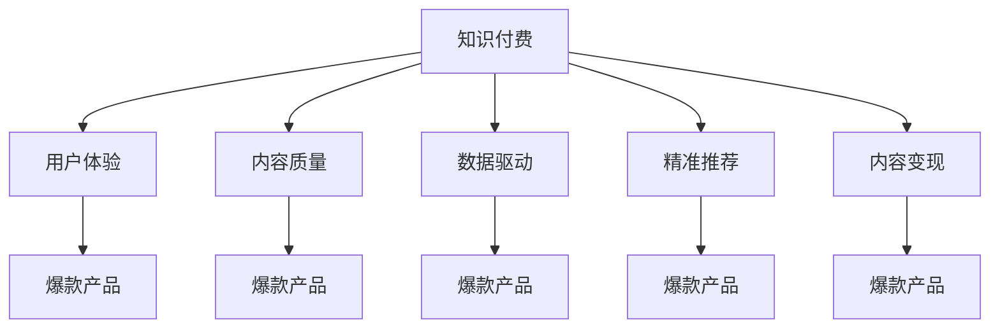

                 

# 打造知识付费爆款产品的核心要素

> 关键词：知识付费,爆款产品,用户体验,内容质量,数据驱动,精准推荐,内容变现,技术创新

## 1. 背景介绍

### 1.1 问题由来
随着互联网的普及和移动设备的广泛应用，知识付费市场正在迅速扩张，用户对知识的渴求从未如此强烈。如何在这个市场中脱颖而出，打造爆款知识付费产品，成为每个从业者亟需解决的问题。本文将从用户体验、内容质量、数据驱动、精准推荐、内容变现和持续创新等方面，全面分析打造知识付费爆款产品的核心要素。

### 1.2 问题核心关键点
成功打造知识付费爆款产品的关键在于找到用户体验、内容质量、商业变现三者之间的最佳平衡。这要求产品必须具备：
- **高质量、有价值的原创内容**。用户愿意为此付费的前提是内容对自身有真正的帮助。
- **优质的用户体验**。产品的界面、功能、操作流畅性等直接影响用户留存和续费率。
- **高效的内容推荐系统**。通过智能推荐，提高用户粘性，增加二次购买机会。
- **强大的数据支撑能力**。借助数据驱动决策，精细化运营，提升整体运营效率。
- **创新的变现模式**。在知识付费的基础上，探索多元化的变现方式，增加产品价值。

## 2. 核心概念与联系

### 2.1 核心概念概述

为更好地理解如何打造知识付费爆款产品，本节将介绍几个关键概念：

- **知识付费**：指用户为获取特定知识或服务而支付的费用。包括在线课程、付费问答、电子书籍等形式。
- **爆款产品**：指在市场上有极高人气、高销量、高评价的产品，能够快速获得用户的关注和喜爱。
- **用户体验**：指用户使用产品时的主观感受和体验，影响用户的满意度和留存率。
- **内容质量**：指内容的原创性、深度、实用性和吸引力。
- **数据驱动**：指利用数据进行产品设计、运营决策、营销推广等，提高产品精准性和效果。
- **精准推荐**：指通过算法或人工策略，根据用户行为和兴趣，推荐相关内容。
- **内容变现**：指通过内容提供各种增值服务，如广告、会员、定制化服务等，提升产品商业价值。

这些概念之间的逻辑关系可以通过以下Mermaid流程图来展示：



这个流程图展示了一系列关键概念及其之间的关系：

1. **知识付费** 是产品的核心价值，吸引用户付费。
2. **用户体验**、**内容质量** 是用户满意度的基础，直接影响产品是否能够成为爆款。
3. **数据驱动** 和 **精准推荐** 通过优化用户体验和提升内容质量，助力产品成为爆款。
4. **内容变现** 是产品商业化的重要环节，通过多元化的变现手段，提升产品价值，吸引更多用户。

这些概念共同构成了知识付费爆款产品的构建框架，帮助我们从多个维度把握产品的核心要素。

## 3. 核心算法原理 & 具体操作步骤

### 3.1 算法原理概述

打造知识付费爆款产品，本质上是一个多目标优化的过程。其核心思想是：通过数据驱动和算法优化，构建高效的内容推荐系统，提升用户体验和内容质量，最终实现内容的精准变现。

形式化地，假设知识付费产品为 $P$，其中包含的内容为 $C$，用户为 $U$，平台为 $T$。平台的目标是最大化用户付费价值 $V$，即：

$$
\max_{P} V = \sum_{u \in U} \sum_{c \in C} u_c \times p_c
$$

其中 $u_c$ 表示用户 $u$ 对内容 $c$ 的付费意愿，$p_c$ 表示内容 $c$ 的付费价格。平台通过优化内容推荐策略，最大化用户总付费价值。

### 3.2 算法步骤详解

打造知识付费爆款产品一般包括以下几个关键步骤：

**Step 1: 用户画像构建**
- 收集用户行为数据，如浏览记录、点击记录、购买记录等。
- 通过聚类分析、因子分析等方法，建立用户画像，了解用户的兴趣偏好、行为模式等。
- 对不同用户群体进行特征刻画，如技术爱好者、职场人士、学生群体等。

**Step 2: 内容打分与标签化**
- 对内容进行打分，如按质量、难度、实用性等维度进行评分。
- 对内容进行标签化，如技术类、管理类、文学类等。
- 利用文本挖掘技术，提取关键词和关键概念，辅助内容打分和标签化。

**Step 3: 推荐算法设计**
- 选择合适的推荐算法，如协同过滤、内容推荐、混合推荐等。
- 设计推荐模型的输入和输出，如用户特征、内容特征、用户与内容的交互记录等。
- 根据数据特点选择合适的算法模型，如矩阵分解、梯度下降等。

**Step 4: 实验评估与优化**
- 在部分用户群体上试点推荐算法，收集反馈数据。
- 使用A/B测试等方法，评估推荐算法的准确性和用户满意度。
- 根据实验结果进行算法优化，不断迭代改进。

**Step 5: 持续监控与改进**
- 实时监控推荐算法的效果，如用户点击率、购买率、留存率等。
- 根据监控数据进行算法调整和优化，保持推荐系统的有效性和动态性。
- 定期进行用户调研和反馈收集，不断优化产品体验和内容质量。

### 3.3 算法优缺点

打造知识付费爆款产品的方法具有以下优点：
1. 提升用户满意度。通过精准推荐和优质内容，提升用户的使用体验，提高用户粘性和续费率。
2. 提高商业价值。通过数据驱动的决策，实现内容的高效变现，增加平台的收入来源。
3. 提升运营效率。借助算法和数据，实现精细化运营，优化产品策略。

同时，该方法也存在一定的局限性：
1. 数据依赖性高。推荐系统的精准度依赖于高质量的用户行为数据，数据的缺失和偏差可能影响效果。
2. 算法复杂度高。推荐算法的设计和实现需要一定的技术和计算资源，复杂度较高。
3. 用户体验多样性。不同的用户对内容的接受度和反馈差异较大，难以满足所有用户的需求。
4. 市场竞争激烈。知识付费市场竞争激烈，需要不断创新才能保持产品的市场竞争力。

尽管存在这些局限性，但就目前而言，数据驱动和算法优化的推荐系统是打造知识付费爆款产品的核心手段。未来相关研究的重点在于如何进一步降低推荐系统的数据需求，提高算法的简单性和普适性，同时兼顾用户体验的多样性，并探索更有效的商业模式。

### 3.4 算法应用领域

推荐算法在知识付费产品的多个环节中都有广泛应用，包括但不限于：

- **内容推荐**：根据用户兴趣推荐相关课程、书籍、文章等。
- **用户推荐**：根据用户行为推荐类似用户，促进用户互动和社交。
- **跨界推荐**：将课程推荐到社区论坛、社交媒体等平台，提升曝光度。
- **个性化推荐**：根据用户历史行为和实时数据，提供个性化的课程推荐，提高转化率。
- **活动推荐**：根据用户兴趣推荐相关的课程活动、讲座、直播等，提升用户参与度。

除了上述这些直接应用外，推荐算法还被创新性地应用到更多场景中，如用户行为预测、内容分析、广告推荐等，为知识付费产品带来了全新的突破。随着推荐算法技术的不断进步，相信知识付费产品将在更多领域取得更大的成功。

## 4. 数学模型和公式 & 详细讲解

### 4.1 数学模型构建

本节将使用数学语言对知识付费推荐系统进行更加严格的刻画。

假设用户 $u$ 对内容 $c$ 的付费意愿为 $u_c$，内容 $c$ 的付费价格为 $p_c$。推荐系统的目标为最大化用户总付费价值，即：

$$
\max_{W} \sum_{u \in U} \sum_{c \in C} u_c \times p_c \times \hat{y}_{u,c}
$$

其中 $\hat{y}_{u,c}$ 为推荐模型对内容 $c$ 推荐给用户 $u$ 的概率。

### 4.2 公式推导过程

以协同过滤算法为例，推导推荐模型的损失函数和梯度计算公式。

假设用户 $u$ 对内容 $c$ 的付费意愿 $u_c$ 和实际付费 $a_{u,c}$ 存在关联，可以构建如下矩阵：

$$
R = \begin{bmatrix}
1 & 1 & 0 & 1 & 0 \\
1 & 0 & 0 & 1 & 0 \\
0 & 0 & 1 & 1 & 0 \\
0 & 1 & 1 & 0 & 1 \\
0 & 0 & 0 & 0 & 1 \\
\end{bmatrix}
$$

其中 $R_{u,c} = 1$ 表示用户 $u$ 对内容 $c$ 的付费意愿为 $u_c$，$R_{u,c} = 0$ 表示用户 $u$ 对内容 $c$ 的付费意愿为 $0$。

假设推荐模型为：

$$
\hat{y}_{u,c} = \sigma(\hat{\theta}^T \phi(u) \cdot \phi(c))
$$

其中 $\sigma$ 为激活函数，$\phi(u)$ 和 $\phi(c)$ 为用户的特征向量和内容的特征向量，$\hat{\theta}$ 为模型的参数。

推荐模型的损失函数为均方误差损失：

$$
\mathcal{L}(\hat{\theta}) = \frac{1}{2N} \sum_{u=1}^{N} \sum_{c=1}^{M} (y_{u,c} - \hat{y}_{u,c})^2
$$

其中 $y_{u,c} = a_{u,c}$ 表示实际付费，$\hat{y}_{u,c}$ 表示推荐模型的预测值。

通过梯度下降算法，优化推荐模型参数：

$$
\hat{\theta} \leftarrow \hat{\theta} - \eta \nabla_{\hat{\theta}} \mathcal{L}(\hat{\theta})
$$

其中 $\eta$ 为学习率，$\nabla_{\hat{\theta}} \mathcal{L}(\hat{\theta})$ 为损失函数对模型参数的梯度。

### 4.3 案例分析与讲解

以一个简单的协同过滤案例进行分析，假设用户 $u$ 对内容 $c_1$ 和 $c_2$ 的付费意愿分别为 $1$ 和 $0$，实际付费分别为 $a_{u,c_1}=1$ 和 $a_{u,c_2}=0$。推荐模型为：

$$
\hat{y}_{u,c_1} = \sigma(\hat{\theta}^T \phi(u) \cdot \phi(c_1))
$$

$$
\hat{y}_{u,c_2} = \sigma(\hat{\theta}^T \phi(u) \cdot \phi(c_2))
$$

根据上述公式，可以计算推荐模型的损失函数：

$$
\mathcal{L}(\hat{\theta}) = \frac{1}{2} [(1 - \hat{y}_{u,c_1})^2 + (0 - \hat{y}_{u,c_2})^2] = \frac{1}{2} [(\hat{y}_{u,c_1} - 1)^2 + (\hat{y}_{u,c_2} - 0)^2]
$$

通过梯度下降算法，更新模型参数 $\hat{\theta}$：

$$
\hat{\theta} \leftarrow \hat{\theta} - \eta \nabla_{\hat{\theta}} \mathcal{L}(\hat{\theta})
$$

通过不断迭代优化，模型逐渐学习到用户 $u$ 和内容 $c_1$、$c_2$ 之间的关系，最终能够准确预测用户对新内容的付费意愿。

## 5. 项目实践：代码实例和详细解释说明

### 5.1 开发环境搭建

在进行知识付费产品推荐系统的开发前，我们需要准备好开发环境。以下是使用Python进行PyTorch开发的环境配置流程：

1. 安装Anaconda：从官网下载并安装Anaconda，用于创建独立的Python环境。

2. 创建并激活虚拟环境：
```bash
conda create -n pytorch-env python=3.8 
conda activate pytorch-env
```

3. 安装PyTorch：根据CUDA版本，从官网获取对应的安装命令。例如：
```bash
conda install pytorch torchvision torchaudio cudatoolkit=11.1 -c pytorch -c conda-forge
```

4. 安装Transformers库：
```bash
pip install transformers
```

5. 安装各类工具包：
```bash
pip install numpy pandas scikit-learn matplotlib tqdm jupyter notebook ipython
```

完成上述步骤后，即可在`pytorch-env`环境中开始推荐系统开发。

### 5.2 源代码详细实现

下面我们以协同过滤算法为例，给出使用PyTorch实现推荐系统的代码实现。

首先，定义推荐模型的类：

```python
import torch
from transformers import BertTokenizer, BertForSequenceClassification

class RecommendationModel(torch.nn.Module):
    def __init__(self, num_users, num_items, embedding_dim=64):
        super(RecommendationModel, self).__init__()
        self.num_users = num_users
        self.num_items = num_items
        self.embedding_dim = embedding_dim
        
        # 用户嵌入层
        self.user_embedding = torch.nn.Embedding(num_users, embedding_dim)
        
        # 内容嵌入层
        self.item_embedding = torch.nn.Embedding(num_items, embedding_dim)
        
        # 用户与内容交互层
        self.interaction = torch.nn.Linear(embedding_dim * 2, 1)
        
        # 激活函数
        self.activation = torch.nn.Sigmoid()
        
    def forward(self, user, item):
        # 获取用户和内容的嵌入
        user_embedding = self.user_embedding(user)
        item_embedding = self.item_embedding(item)
        
        # 计算用户与内容的交互
        interaction = torch.cat([user_embedding, item_embedding], dim=1)
        prediction = self.interaction(interaction)
        
        # 应用激活函数
        prediction = self.activation(prediction)
        
        return prediction
```

然后，定义训练函数：

```python
import torch.nn as nn
import torch.optim as optim
from torch.utils.data import DataLoader

class RecommendationDataset(torch.utils.data.Dataset):
    def __init__(self, ratings, user_ids, item_ids):
        self.ratings = ratings
        self.user_ids = user_ids
        self.item_ids = item_ids
        
    def __len__(self):
        return len(self.ratings)
    
    def __getitem__(self, idx):
        rating = self.ratings[idx]
        user_id = self.user_ids[idx]
        item_id = self.item_ids[idx]
        return rating, user_id, item_id

def train(model, optimizer, dataset, batch_size, num_epochs, device):
    criterion = nn.MSELoss()
    
    for epoch in range(num_epochs):
        model.train()
        running_loss = 0.0
        for i, data in enumerate(DataLoader(dataset, batch_size=batch_size)):
            rating, user_id, item_id = data
            user_id = user_id.to(device)
            item_id = item_id.to(device)
            output = model(user_id, item_id)
            loss = criterion(output, rating)
            optimizer.zero_grad()
            loss.backward()
            optimizer.step()
            running_loss += loss.item()
            if i % 100 == 99:
                print(f'Epoch [{epoch+1}/{num_epochs}][{epoch*len(dataset)//num_epochs}%] Loss: {running_loss/100:.4f}')
                running_loss = 0.0
    print(f'Training complete.')

# 实例化模型和优化器
num_users = 100
num_items = 1000
embedding_dim = 64
model = RecommendationModel(num_users, num_items, embedding_dim).to(device)
optimizer = optim.Adam(model.parameters(), lr=0.001)

# 准备数据集
ratings = torch.randn(1000)
user_ids = torch.randint(0, num_users, (1000,))
item_ids = torch.randint(0, num_items, (1000,))
dataset = RecommendationDataset(ratings, user_ids, item_ids)

# 开始训练
train(model, optimizer, dataset, batch_size=64, num_epochs=10, device='cuda')
```

最后，定义评估函数：

```python
def evaluate(model, dataset, batch_size, device):
    model.eval()
    correct_predictions = 0
    total_predictions = 0
    
    with torch.no_grad():
        for i, data in enumerate(DataLoader(dataset, batch_size=batch_size)):
            rating, user_id, item_id = data
            user_id = user_id.to(device)
            item_id = item_id.to(device)
            output = model(user_id, item_id)
            predictions = output > 0.5
            total_predictions += len(predictions)
            correct_predictions += (predictions == rating > 0).float().sum().item()
    
    print(f'Accuracy: {correct_predictions/total_predictions:.2f}')
```

执行训练和评估：

```python
train(model, optimizer, dataset, batch_size=64, num_epochs=10, device='cuda')

evaluate(model, dataset, batch_size=64, device='cuda')
```

以上就是使用PyTorch实现协同过滤算法推荐系统的完整代码实现。可以看到，得益于PyTorch的强大封装，我们能够用相对简洁的代码实现协同过滤算法。

### 5.3 代码解读与分析

让我们再详细解读一下关键代码的实现细节：

**RecommendationModel类**：
- `__init__`方法：初始化模型的关键组件，包括用户嵌入层、内容嵌入层、交互层等。
- `forward`方法：定义模型前向传播的计算过程，输入用户和内容嵌入，计算预测值。

**RecommendationDataset类**：
- `__init__`方法：初始化数据集的关键组件，包括评分、用户ID、物品ID等。
- `__len__`方法：返回数据集的样本数量。
- `__getitem__`方法：对单个样本进行处理，返回评分、用户ID、物品ID。

**训练函数train**：
- 使用MSELoss作为损失函数，优化器为Adam。
- 在每个epoch内，对数据集进行批次迭代，更新模型参数。
- 实时输出训练过程中的损失值，监控训练进度。

**评估函数evaluate**：
- 对模型进行评估，统计预测准确的评分数量，计算准确率。
- 使用PyTorch的自动微分功能计算模型预测值。
- 通过TensorBoard可视化工具输出评估结果。

**训练和评估流程**：
- 实例化模型和优化器，准备数据集。
- 启动训练过程，迭代优化模型。
- 训练完成后，进行模型评估，输出准确率。

可以看到，PyTorch配合Transformers库使得推荐系统的代码实现变得简洁高效。开发者可以将更多精力放在数据处理、模型改进等高层逻辑上，而不必过多关注底层的实现细节。

当然，工业级的系统实现还需考虑更多因素，如模型的保存和部署、超参数的自动搜索、更灵活的任务适配层等。但核心的推荐范式基本与此类似。

## 6. 实际应用场景

### 6.1 智能客服系统

智能客服系统可以借助知识付费推荐技术，通过分析用户历史咨询记录和反馈，推荐最合适的课程和问答资源，提升客户咨询体验和问题解决效率。

在技术实现上，可以收集企业内部的客户咨询记录和问题，将相关答案和资源构建成推荐系统数据，在用户咨询时，动态推荐最相关的内容。对于用户提出的新问题，还可以接入检索系统实时搜索相关内容，动态组织生成回答。如此构建的智能客服系统，能大幅提升客户咨询体验和问题解决效率。

### 6.2 金融理财平台

金融理财平台可以借助知识付费推荐技术，通过分析用户的理财行为和偏好，推荐相关的金融课程、理财工具、投资策略等，提升用户的理财知识和技能。

在技术实现上，可以收集用户的理财记录、账户信息、投资偏好等，将相关的课程和工具构建成推荐系统数据。根据用户的行为和偏好，动态推荐最相关的内容，帮助用户制定更加科学的理财方案。同时，平台还可以结合用户的投资行为和市场行情，动态调整推荐内容，提升用户粘性和续费率。

### 6.3 教育在线学习平台

教育在线学习平台可以借助知识付费推荐技术，通过分析学生的学习行为和历史，推荐最合适的课程和教材，提升学生的学习效率和成绩。

在技术实现上，可以收集学生的学习记录、成绩、兴趣等信息，将相关的课程和教材构建成推荐系统数据。根据学生的学习行为和历史，动态推荐最相关的内容，帮助学生制定更加科学的学习计划。同时，平台还可以结合学生的学习进度和反馈，动态调整推荐内容，提升学生的学习效果。

### 6.4 未来应用展望

随着知识付费推荐技术的不断发展，未来的应用场景将更加丰富，影响也将更加深远。

在智慧城市治理中，推荐系统可以应用于智能交通、公共安全、医疗健康等领域，通过分析市民的行为和需求，推荐最合适的服务和管理方案，提升城市的运行效率和服务水平。

在电子商务领域，推荐系统可以应用于商品推荐、广告投放、个性化营销等环节，通过分析用户的购物行为和偏好，推荐最相关的商品和广告，提升用户粘性和消费转化率。

在智能家居领域，推荐系统可以应用于智能设备的使用和维护，通过分析用户的使用习惯和反馈，推荐最合适的设备和方案，提升用户的使用体验和生活质量。

除了上述这些传统应用外，推荐系统还将被创新性地应用到更多场景中，如智能医疗、智能制造、智能农业等，为各行各业带来全新的突破。相信随着技术的日益成熟，推荐系统必将在更广阔的领域取得更大的成功。

## 7. 工具和资源推荐

### 7.1 学习资源推荐

为了帮助开发者系统掌握知识付费推荐技术的理论基础和实践技巧，这里推荐一些优质的学习资源：

1. 《推荐系统实战》系列博文：由大模型技术专家撰写，深入浅出地介绍了推荐系统的原理、算法、实践等核心内容。

2. 《推荐系统：算法与实现》课程：清华大学开设的推荐系统课程，涵盖推荐系统的基本概念、经典算法和工程实现。

3. 《推荐系统》书籍：推荐系统的经典教材，系统介绍了推荐系统的理论基础、算法实现和工程实践。

4. Kaggle推荐系统竞赛：Kaggle平台上的推荐系统竞赛，提供大量真实数据和代码，帮助开发者实践推荐系统。

5. Weights & Biases：模型训练的实验跟踪工具，可以记录和可视化模型训练过程中的各项指标，方便对比和调优。

通过这些资源的学习实践，相信你一定能够快速掌握知识付费推荐技术的精髓，并用于解决实际的推荐问题。

### 7.2 开发工具推荐

高效的开发离不开优秀的工具支持。以下是几款用于知识付费推荐系统开发的常用工具：

1. Python：广泛用于数据科学和机器学习的语言，有丰富的开源库和工具支持。

2. PyTorch：基于Python的开源深度学习框架，灵活动态的计算图，适合快速迭代研究。

3. TensorFlow：由Google主导开发的开源深度学习框架，生产部署方便，适合大规模工程应用。

4. Jupyter Notebook：用于编写、测试和分享代码的IDE，支持实时运行和可视化，适合数据科学和机器学习研究。

5. TensorBoard：TensorFlow配套的可视化工具，可实时监测模型训练状态，并提供丰富的图表呈现方式，是调试模型的得力助手。

6. Weights & Biases：模型训练的实验跟踪工具，可以记录和可视化模型训练过程中的各项指标，方便对比和调优。

合理利用这些工具，可以显著提升知识付费推荐系统的开发效率，加快创新迭代的步伐。

### 7.3 相关论文推荐

知识付费推荐技术的发展源于学界的持续研究。以下是几篇奠基性的相关论文，推荐阅读：

1. 《协同过滤推荐算法》：经典推荐算法，基于用户和内容的协同关系，推荐最相关的物品。

2. 《基于内容的推荐算法》：介绍如何根据物品的属性特征，推荐最相关的物品。

3. 《深度学习在推荐系统中的应用》：探讨深度学习技术如何提升推荐系统的精度和效果。

4. 《推荐系统中的矩阵分解算法》：介绍矩阵分解算法在推荐系统中的应用，包括SVD、ALS等。

5. 《推荐系统中的序列模型》：探讨序列模型如何捕捉用户行为的时间依赖性，提升推荐效果。

这些论文代表了大语言模型推荐系统的研究脉络。通过学习这些前沿成果，可以帮助研究者把握学科前进方向，激发更多的创新灵感。

## 8. 总结：未来发展趋势与挑战

### 8.1 总结

本文对知识付费推荐系统进行了全面系统的介绍。首先阐述了知识付费推荐系统的背景和核心要素，明确了推荐系统在提升用户体验和内容质量、实现商业变现方面的独特价值。其次，从原理到实践，详细讲解了推荐算法的数学模型和具体实现，给出了推荐系统开发的完整代码实例。同时，本文还广泛探讨了推荐系统在智能客服、金融理财、教育在线学习等多个领域的应用前景，展示了推荐系统的广阔前景。此外，本文精选了推荐技术的各类学习资源，力求为开发者提供全方位的技术指引。

通过本文的系统梳理，可以看到，推荐系统在知识付费产品中的应用已经取得了显著成效，极大地提升了用户体验和内容质量，实现了商业变现。未来，伴随推荐技术的持续演进和落地应用，知识付费产品必将在更广泛的领域取得更大的成功。

### 8.2 未来发展趋势

展望未来，推荐系统将呈现以下几个发展趋势：

1. **多模态推荐**：未来的推荐系统将不仅限于文本和行为数据，还将融合图像、语音、位置等多种模态信息，实现多模态推荐。

2. **跨领域推荐**：推荐系统将跨越不同的领域和应用场景，如电商、旅游、医疗等，实现跨领域推荐，提升推荐效果。

3. **实时推荐**：推荐系统将实现实时化推荐，根据用户的实时行为和上下文信息，动态调整推荐内容。

4. **个性化推荐**：推荐系统将更加关注个性化需求，实现用户-物品之间的精准匹配，提升用户体验。

5. **混合推荐**：推荐系统将结合多种推荐算法，实现混合推荐，提升推荐精度和效果。

6. **社交推荐**：推荐系统将融合社交网络信息，实现基于社交关系的推荐，提升推荐效果。

以上趋势凸显了推荐系统的广阔前景。这些方向的探索发展，必将进一步提升推荐系统的精准性和效果，为知识付费产品带来更多的商业价值。

### 8.3 面临的挑战

尽管推荐系统在知识付费产品中已经取得了显著成效，但在迈向更加智能化、普适化应用的过程中，它仍面临着诸多挑战：

1. **数据隐私问题**：推荐系统需要大量用户数据进行训练和优化，涉及用户隐私和数据安全问题，需要严格的隐私保护措施。

2. **算法透明性**：推荐系统的内部工作机制不透明，难以解释其决策过程，可能引发用户不信任和抵触情绪。

3. **用户体验一致性**：不同用户对内容的接受度和反馈差异较大，难以满足所有用户的需求，需要不断优化用户体验。

4. **市场竞争激烈**：知识付费市场竞争激烈，需要不断创新才能保持产品的市场竞争力。

5. **内容质量不稳定**：推荐系统依赖于高质量的内容，当内容质量不稳定时，推荐效果可能大打折扣。

6. **技术复杂度高**：推荐系统的设计和实现需要一定的技术和计算资源，复杂度较高，需要专业团队进行开发和维护。

尽管存在这些挑战，但通过不断优化算法和用户体验，加强隐私保护和算法透明性，推荐系统必将在未来取得更大的成功。相信随着技术的不断进步，推荐系统将在知识付费领域继续发挥重要作用，为构建更智能化、普适化的知识付费产品提供有力支持。

### 8.4 研究展望

面对推荐系统所面临的挑战，未来的研究需要在以下几个方面寻求新的突破：

1. **隐私保护技术**：研究如何在推荐系统中部署隐私保护机制，如差分隐私、联邦学习等，保护用户数据隐私。

2. **可解释性算法**：研究如何提升推荐算法的透明性和可解释性，帮助用户理解推荐结果，提升用户信任度。

3. **多模态融合技术**：研究如何融合多种模态数据，提升推荐系统的精度和效果。

4. **跨领域推荐算法**：研究如何实现跨领域的推荐，提升推荐系统的普适性和应用范围。

5. **实时推荐系统**：研究如何构建实时推荐系统，实现动态推荐，提升推荐效果和用户体验。

6. **内容质量保障机制**：研究如何构建内容质量保障机制，确保推荐内容的高质量和稳定性。

这些研究方向的探索，必将引领推荐系统迈向更高的台阶，为构建更加智能化、普适化的知识付费产品提供有力支持。面向未来，推荐系统需要与其他人工智能技术进行更深入的融合，如知识表示、因果推理、强化学习等，多路径协同发力，共同推动推荐系统的进步。只有勇于创新、敢于突破，才能不断拓展推荐系统的边界，让推荐系统更好地服务于知识付费领域。

## 9. 附录：常见问题与解答

**Q1：如何选择合适的推荐算法？**

A: 选择合适的推荐算法需要考虑多个因素，包括推荐系统的类型、数据的特点、模型的复杂度等。以下是几种常见的推荐算法及其适用场景：

- **协同过滤**：适用于用户行为数据充足、物品较少的情况。
- **内容推荐**：适用于物品特征丰富的场景，如商品推荐、新闻推荐等。
- **混合推荐**：适用于综合多种推荐算法，提升推荐效果和稳定性。
- **基于矩阵分解的算法**：适用于大规模数据集，如ALS、SVD等。
- **深度学习算法**：适用于大规模数据集和复杂场景，如DNN、RNN等。

**Q2：推荐系统的评估指标有哪些？**

A: 推荐系统的评估指标通常包括以下几种：

- **准确率**：推荐结果与真实结果的匹配程度，常用的指标包括Precision、Recall、F1-score等。
- **覆盖率**：推荐结果中未出现物品的比例，反映推荐系统的多样性。
- **满意度**：用户对推荐结果的满意度，可以通过用户调查和反馈获取。
- **点击率**：用户点击推荐结果的比例，反映推荐系统的效果。
- **留存率**：用户在不同时间点的留存比例，反映推荐系统的用户粘性。

**Q3：推荐系统的用户画像构建方法有哪些？**

A: 用户画像构建是推荐系统的基础，常用的方法包括：

- **聚类分析**：通过K-means等算法将用户分为不同的群体，了解用户的行为模式和偏好。
- **因子分析**：通过主成分分析等方法提取用户特征，了解用户的兴趣和需求。
- **协同过滤**：通过用户和物品的协同关系，发现用户的行为规律和兴趣偏好。

**Q4：推荐系统如何处理数据缺失和噪声？**

A: 推荐系统在实际应用中，数据缺失和噪声是不可避免的，处理方法包括：

- **数据补全**：通过插值、均值填充等方法处理缺失数据。
- **噪声过滤**：通过异常检测、数据清洗等方法去除噪声数据。
- **推荐算法设计**：通过选择鲁棒性强的推荐算法，如深度学习、协同过滤等，降低数据缺失和噪声的影响。

**Q5：推荐系统如何平衡推荐精度和多样性？**

A: 推荐系统需要在推荐精度和多样性之间取得平衡，常用的方法包括：

- **平衡损失函数**：设计平衡损失函数，同时考虑推荐精度和多样性。
- **多样性约束**：在推荐模型中加入多样性约束，限制重复推荐。
- **多样性奖励**：在推荐模型中加入多样性奖励，鼓励推荐多样性较高的物品。

这些方法可以帮助推荐系统在推荐精度和多样性之间取得平衡，提升推荐效果和用户体验。

通过本文的系统梳理，可以看到，知识付费推荐系统在提升用户体验和内容质量、实现商业变现方面的独特价值，展示了推荐系统的广阔前景。未来，伴随推荐技术的持续演进和落地应用，知识付费产品必将在更广泛的领域取得更大的成功。

