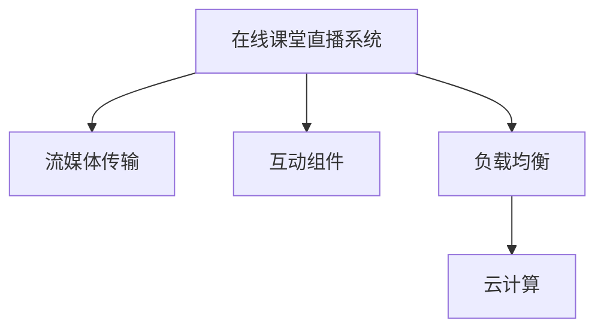

                 

# 打造知识付费的在线课堂直播系统

## 1. 背景介绍

### 1.1 问题由来
随着互联网技术的迅猛发展和知识经济时代的到来，在线教育市场迎来了前所未有的发展机遇。知识付费作为在线教育的一个重要分支，凭借其便捷性、高效性、个性化等优势，正成为越来越多用户的学习选择。然而，在知识付费平台中，直播系统的建设是一个关键的环节，关系到用户体验的流畅性和互动性。

### 1.2 问题核心关键点
知识付费平台的核心需求是能够为用户提供高质量、高互动的直播课程服务。系统架构上，直播系统需要支持大并发、低延迟、高稳定性、高效互动等特性，以满足直播服务的实时性和可靠性。在技术实现上，需要融合多种技术，如流媒体传输、互动组件、云端负载均衡等，构建一个稳定、高效的直播平台。

### 1.3 问题研究意义
一个稳定、高效、可靠的在线课堂直播系统，能够为用户提供无缝的直播体验，极大提升学习效率。同时，一个具备高并发、低延迟特性的系统，能够保证直播流畅性，增强用户黏性。对于知识付费平台而言，打造优质直播系统，不仅能够提升用户满意度，还能推动业务增长，助力平台长期发展。

## 2. 核心概念与联系

### 2.1 核心概念概述

为更好地理解如何打造知识付费的在线课堂直播系统，本节将介绍几个密切相关的核心概念：

- **在线课堂直播系统**：一种结合了视频流传输、实时互动、云端负载均衡等技术的网络平台，为用户提供实时的、互动的课程服务。
- **流媒体传输**：通过TCP/UDP等协议，将视频、音频等实时数据流从服务器传输到客户端，实现实时视频播放。
- **互动组件**：如聊天室、问答板、投票等功能，用于增强用户间的互动性。
- **负载均衡**：通过云平台的技术手段，将直播流媒体请求分布到多台服务器上，确保系统在高并发下的稳定性。
- **云计算**：利用云平台提供的计算、存储资源，实现直播服务的高可用性和弹性伸缩。

这些核心概念之间的逻辑关系可以通过以下Mermaid流程图来展示：



这个流程图展示了一个在线课堂直播系统的核心组成部分及其之间的关系：

1. 在线课堂直播系统：作为整个平台的核心，提供视频流传输、互动组件和负载均衡功能。
2. 流媒体传输：实现视频和音频数据的高效传输。
3. 互动组件：增强用户间的互动性。
4. 负载均衡：确保系统在高并发下的稳定性。
5. 云计算：提供资源支持，实现弹性伸缩。

这些概念共同构成了在线课堂直播系统的技术基础，使得平台能够提供优质的课程服务。

## 3. 核心算法原理 & 具体操作步骤
### 3.1 算法原理概述

在线课堂直播系统的核心在于保证流媒体数据的实时传输和互动组件的实时响应。其核心算法原理如下：

1. **流媒体传输算法**：通过流媒体协议（如RTMP、RTSP、WebRTC等）实现视频、音频等实时数据的高效传输。

2. **互动组件算法**：通过即时通讯协议（如WebSockets、长轮询等）实现用户间的实时互动。

3. **负载均衡算法**：通过算法如轮询、最少连接、IP散列等实现流媒体请求的均衡分发。

4. **云计算资源管理算法**：通过弹性伸缩、自动扩展等策略实现系统的弹性伸缩。

5. **网络质量优化算法**：通过网络状态监测、QoS优化等手段提升直播的稳定性和流畅性。

### 3.2 算法步骤详解

打造知识付费的在线课堂直播系统主要包括以下几个关键步骤：

**Step 1: 需求分析与规划**
- 定义直播系统的目标和功能，如直播平台支持的主要课程类型、互动功能、直播流程等。
- 确定系统的性能要求，如并发用户数、视频画质、互动延迟等。
- 进行需求分析，如课程类型、直播模式等。

**Step 2: 系统架构设计**
- 选择适合的技术栈，如流媒体传输协议、实时通信协议、负载均衡算法等。
- 设计系统的拓扑结构，如图1所示。

图1：在线课堂直播系统架构图

**Step 3: 系统实现与开发**
- 流媒体传输模块实现：开发流媒体服务器，实现视频、音频数据的传输。
- 互动组件模块实现：开发即时通讯服务器，实现用户间的实时互动。
- 负载均衡模块实现：开发负载均衡组件，实现流媒体请求的均衡分发。
- 云计算资源管理模块实现：利用云平台提供的计算、存储资源，实现系统的弹性伸缩。

**Step 4: 系统测试与优化**
- 对系统进行全面的测试，包括性能测试、负载测试、压力测试等。
- 根据测试结果优化系统性能，如调整流媒体编码参数、优化实时通讯协议、调整负载均衡策略等。

**Step 5: 部署上线**
- 将系统部署到云平台，确保系统的高可用性和弹性伸缩性。
- 配置负载均衡和监控告警，确保系统在高并发下的稳定性。

**Step 6: 持续运维**
- 对系统进行持续监控和维护，如监控流媒体传输质量、互动延迟、服务器状态等。
- 根据用户反馈和系统运行状态进行优化，确保系统的稳定性和高效性。

### 3.3 算法优缺点

在线课堂直播系统具有以下优点：
1. 支持大规模并发用户：通过云平台的弹性伸缩能力，可以支持数万甚至数十万用户同时在线学习。
2. 高稳定性和可靠性：通过负载均衡和容错设计，确保系统在高并发下的稳定性和可靠性。
3. 实时性和互动性强：通过流媒体传输和即时通讯协议，实现高实时性和强互动性。
4. 快速部署和扩展：利用云平台提供的资源，可以快速部署和扩展系统，适应业务增长。

同时，该系统也存在一定的局限性：
1. 对带宽和延迟敏感：流媒体传输对网络带宽和延迟有较高要求，网络波动可能影响直播质量。
2. 系统复杂度较高：涉及到流媒体传输、实时互动、负载均衡等多个模块，系统开发和维护复杂。
3. 安全性挑战：需要设计多重安全机制，保障数据安全和用户隐私。
4. 资源消耗较大：大量用户同时在线可能导致服务器资源紧张，需要优化资源配置。

尽管存在这些局限性，但就目前而言，在线课堂直播系统仍然是知识付费平台的核心组成部分，能够有效提升用户体验和平台价值。

### 3.4 算法应用领域

在线课堂直播系统在知识付费平台中得到了广泛的应用，覆盖了几乎所有课程类型，如编程、金融、法律、心理学等。具体而言，可以应用于以下几个方面：

- **实时直播课程**：专家老师通过实时直播讲解课程，实时与学员互动。
- **录播课程回放**：将直播课程录制保存，供学员随时回放学习。
- **互动问答环节**：学员可以通过互动组件向老师提问，老师实时回答，增强互动性。
- **课程投票和测评**：学员对课程内容进行投票和测评，反馈学习效果。
- **学员互动交流**：学员可以通过聊天室、评论区等进行互动交流，分享学习心得。

除了上述这些经典应用外，在线课堂直播系统还可以创新性地应用到更多场景中，如企业培训、在线讲座、在线面试等，为教育、培训、招聘等多个领域带来新的可能性。

## 4. 数学模型和公式 & 详细讲解  
### 4.1 数学模型构建

为了更好地理解在线课堂直播系统中的算法实现，本节将从数学模型和公式的角度进行详细讲解。

假设直播系统中某课程的观众数量为 $N$，每个观众的互动频率为 $p$，互动消息的数量为 $m$。根据平均速率模型，每个观众每秒发送的互动消息数量为 $p \times 1000$ 条。假设系统每秒需要处理 $K$ 条互动消息，则系统需要维护的并发连接数为：

$$
C = \frac{p \times 1000 \times N}{K}
$$

### 4.2 公式推导过程

在实际系统中，每个互动消息的传输需要占用一定的网络带宽。假设每个互动消息的大小为 $L$ 字节，网络带宽为 $B$ 字节/秒，则每个互动消息的传输延迟为：

$$
T = \frac{L}{B}
$$

假设互动消息的传输时间占比为 $\alpha$，则系统每秒需要处理的消息数量为：

$$
K = \frac{1}{\alpha} \times \frac{1000 \times N \times p \times L}{B}
$$

根据上式，可以计算出系统需要维护的并发连接数 $C$。在实际系统中，可以根据测试结果调整参数 $N$、$p$、$L$、$B$ 等，以优化系统性能。

### 4.3 案例分析与讲解

以一个拥有10万用户、互动频率为0.01、互动消息大小为1KB、网络带宽为1Mbps的在线课堂直播系统为例，进行性能分析。

假设互动消息传输时间占比为10%，则系统每秒需要处理的消息数量为：

$$
K = \frac{1}{0.1} \times \frac{1000 \times 100000 \times 0.01 \times 1024}{1000000} = 1000
$$

根据 $C = \frac{p \times 1000 \times N}{K}$ 计算得到：

$$
C = \frac{0.01 \times 1000 \times 100000}{1000} = 10000
$$

因此，该系统需要维护约10000个并发连接，以支持高并发用户的需求。

## 5. 项目实践：代码实例和详细解释说明
### 5.1 开发环境搭建

在进行在线课堂直播系统的开发前，我们需要准备好开发环境。以下是使用Python进行Flask开发的环境配置流程：

1. 安装Anaconda：从官网下载并安装Anaconda，用于创建独立的Python环境。

2. 创建并激活虚拟环境：
```bash
conda create -n flask-env python=3.8 
conda activate flask-env
```

3. 安装Flask：从官网获取Flask的最新版本，进行安装：
```bash
pip install Flask
```

4. 安装Flask-SocketIO：用于实现即时通讯功能：
```bash
pip install flask-socketio
```

5. 安装Flask-RESTful：用于实现API接口：
```bash
pip install Flask-RESTful
```

6. 安装Flask-Migrate：用于数据库迁移：
```bash
pip install Flask-Migrate
```

7. 安装Gunicorn：用于运行Flask应用：
```bash
pip install gunicorn
```

完成上述步骤后，即可在`flask-env`环境中开始开发实践。

### 5.2 源代码详细实现

以下是一个简单的Flask在线课堂直播系统代码实现。

首先，定义Flask应用和SocketIO事件：

```python
from flask import Flask
from flask_socketio import SocketIO

app = Flask(__name__)
app.config['SECRET_KEY'] = 'secret!'
socketio = SocketIO(app)

@socketio.on('message')
def handle_message(message):
    print(message)
```

然后，定义API接口：

```python
from flask_restful import Resource, Api

api = Api(app)

class HelloWorld(Resource):
    def get(self):
        return {'hello': 'world'}

api.add_resource(HelloWorld, '/')
```

接着，定义实时互动组件：

```python
@socketio.on('connect')
def handle_connect():
    print('connected')

@socketio.on('disconnect')
def handle_disconnect():
    print('disconnect')

@socketio.on('chat message')
def handle_chat_message(message):
    print('message: ' + message)
```

最后，启动Flask应用：

```python
if __name__ == '__main__':
    socketio.run(app)
```

### 5.3 代码解读与分析

让我们再详细解读一下关键代码的实现细节：

**Flask应用和SocketIO事件**：
- 创建Flask应用和SocketIO对象，并设置应用密钥。
- 定义SocketIO事件处理函数，用于处理客户端发送的消息、连接和断开连接等事件。

**API接口**：
- 定义Flask-RESTful API接口，用于处理GET请求，返回简单响应。
- 使用`api.add_resource`方法将API接口挂载到指定URL。

**实时互动组件**：
- 定义SocketIO事件处理函数，用于处理连接、断开连接和实时消息等事件。
- 在客户端发送实时消息时，触发`handle_chat_message`函数，打印消息内容。

通过上述代码实现，可以构建一个简单的在线课堂直播系统原型。开发者可以根据实际需求，进一步优化系统架构和功能模块。

## 6. 实际应用场景
### 6.1 智慧教育

在线课堂直播系统在智慧教育领域得到了广泛应用。通过直播平台，学生可以实时参与课堂教学，享受互动式学习体验。教师可以通过视频讲解、互动问答等方式，提升教学效果。

在具体实践中，教师可以在课堂上实时展示PPT、视频等教学资源，与学生互动，回答学生的问题。学生可以通过在线直播系统参与互动，及时反馈学习状态。教师还可以根据学生的学习情况，实时调整教学策略，提升教学质量。

### 6.2 企业培训

在线课堂直播系统也在企业培训中得到了广泛应用。通过直播平台，员工可以随时随地参与培训课程，接受专业技能培训。

企业可以邀请专家在线讲解课程，员工通过在线直播系统参与互动，提出问题。专家可以实时回答员工的问题，增强培训效果。企业还可以将培训课程录制保存，供员工随时回放学习。

### 6.3 远程医疗

在线课堂直播系统在远程医疗中也得到了应用。通过直播平台，医生可以实时参与远程会诊，提升诊疗效率。

医生可以通过在线直播系统，实时查看患者影像、报告等医疗资料，与患者互动。患者可以通过在线直播系统，实时与医生交流病情，得到专业的诊疗建议。

### 6.4 未来应用展望

随着在线课堂直播系统的不断发展和优化，未来其在各个领域的应用前景更加广阔。

在智慧医疗领域，直播系统可以用于远程会诊、专家讲座、在线诊疗等，提升远程医疗的便利性和高效性。

在智能教育领域，直播系统可以用于在线教学、虚拟课堂、个性化学习等，提升教学效果和学生体验。

在企业培训领域，直播系统可以用于员工培训、技术分享、管理培训等，提升企业培训的灵活性和互动性。

在智慧政务领域，直播系统可以用于在线咨询、政策解读、政府直播等，提升政务服务的效果和效率。

在文化娱乐领域，直播系统可以用于在线直播、节目制作、互动演出等，提供高质量的娱乐体验。

未来，随着技术的不断进步和应用的不断拓展，在线课堂直播系统将迎来更加广泛的应用，推动各行业的数字化转型。

## 7. 工具和资源推荐
### 7.1 学习资源推荐

为了帮助开发者系统掌握在线课堂直播系统的开发技术，这里推荐一些优质的学习资源：

1. Flask官方文档：提供了详细的Flask框架使用指南，适合初学者和进阶开发者。

2. SocketIO官方文档：提供了SocketIO框架的详细使用手册，适合开发者快速上手实时通讯功能。

3. Flask-SocketIO官方文档：提供了Flask-SocketIO的详细使用手册，适合开发者在Flask框架下实现实时通讯功能。

4. WebRTC官方文档：提供了WebRTC框架的使用指南，适合开发者实现点对点的实时通讯功能。

5. WebRTC视频教程：提供了WebRTC的实用教程，适合开发者快速上手点对点的实时通讯功能。

通过对这些资源的学习实践，相信你一定能够快速掌握在线课堂直播系统的核心技术，并用于解决实际的业务问题。

### 7.2 开发工具推荐

高效的开发离不开优秀的工具支持。以下是几款用于在线课堂直播系统开发的常用工具：

1. Flask：基于Python的开源Web框架，简单易用，适合快速开发原型和API接口。

2. SocketIO：支持实时通讯的JavaScript库，实现高效的实时消息传递。

3. WebRTC：提供点对点的实时通讯功能，适合实现视频会议和直播互动。

4. Gunicorn：基于Python的Web服务器，支持异步处理，适合运行Flask应用。

5. Supervisor：进程管理工具，支持后台任务管理和重启，保证系统的高可用性。

合理利用这些工具，可以显著提升在线课堂直播系统的开发效率，加快创新迭代的步伐。

### 7.3 相关论文推荐

在线课堂直播系统的设计与实现涉及多种技术，以下是几篇奠基性的相关论文，推荐阅读：

1. P2P视频会议系统：介绍了P2P视频会议系统的设计和实现，适用于点对点的实时通讯。

2. WebRTC实现实时通讯：介绍了WebRTC框架的使用和优化，适用于实时音视频的传输。

3. 分布式直播系统：介绍了分布式直播系统的设计和实现，适用于高并发和大规模直播。

4. 实时互动组件的设计与实现：介绍了实时互动组件的实现方法，适用于提升直播的互动性。

5. 云平台资源管理：介绍了云平台资源管理的方法和策略，适用于保证直播系统的弹性伸缩。

这些论文代表了大语言模型微调技术的发展脉络。通过学习这些前沿成果，可以帮助研究者把握学科前进方向，激发更多的创新灵感。

## 8. 总结：未来发展趋势与挑战
### 8.1 总结

本文对在线课堂直播系统的设计和实现进行了全面系统的介绍。首先阐述了在线课堂直播系统的背景和意义，明确了系统的高并发、低延迟、高稳定性等关键需求。其次，从原理到实践，详细讲解了在线课堂直播系统的算法实现和关键步骤，给出了系统开发的完整代码实例。同时，本文还广泛探讨了直播系统在智慧教育、企业培训、远程医疗等各个领域的应用前景，展示了直播系统的大范围落地潜力。

通过本文的系统梳理，可以看到，在线课堂直播系统在知识付费平台中发挥了至关重要的作用，能够显著提升用户体验和平台价值。未来，伴随技术的不断进步和应用的不断拓展，在线课堂直播系统将迎来更加广阔的应用，推动各行业的数字化转型。

### 8.2 未来发展趋势

展望未来，在线课堂直播系统的发展趋势如下：

1. 实时性和互动性进一步增强。随着技术的进步，未来直播系统将具备更高的实时性和更强的互动性，提升用户的学习体验。

2. 多设备、多平台支持。未来直播系统将支持更多的设备和平台，如移动设备、PC端、浏览器端等，实现跨平台的无缝接入。

3. 智能推荐系统。通过引入机器学习和智能推荐技术，直播系统将能够根据用户的学习历史和行为数据，推荐更符合用户兴趣的课程内容。

4. AI辅助教学。未来直播系统将引入AI技术，如语音识别、图像识别等，提升教学效果和互动性。

5. 云平台服务化。直播系统将与云平台进行更深入的融合，实现服务的自动化、标准化和易用化。

以上趋势凸显了在线课堂直播系统的广阔前景。这些方向的探索发展，必将进一步提升直播系统的性能和应用范围，为用户带来更好的学习体验。

### 8.3 面临的挑战

尽管在线课堂直播系统已经取得了不小的进步，但在迈向更加智能化、普适化应用的过程中，仍面临诸多挑战：

1. 网络稳定性问题。直播系统对网络带宽和延迟有较高要求，网络波动可能影响直播质量。如何提升网络稳定性，减少网络波动的影响，是未来的研究方向。

2. 系统架构复杂度。直播系统涉及多种技术，包括流媒体传输、实时互动、负载均衡等，系统架构复杂，开发和维护难度较大。

3. 安全性挑战。直播系统需要设计多重安全机制，保障数据安全和用户隐私。如何设计安全的架构，避免信息泄露和攻击，是未来的研究方向。

4. 资源消耗问题。大量用户同时在线可能导致服务器资源紧张，需要优化资源配置，提高资源利用效率。

5. 用户体验问题。直播系统的用户体验直接关系到用户黏性和满意度。如何提升用户体验，提升用户满意度，是未来的研究方向。

这些挑战需要开发者不断优化系统架构和算法实现，不断提升系统的稳定性和性能，才能真正实现高并发、低延迟、高稳定性的在线课堂直播系统。

### 8.4 研究展望

面对在线课堂直播系统所面临的挑战，未来的研究需要在以下几个方面寻求新的突破：

1. 提升网络稳定性。通过引入自适应编码、网络优化算法等技术，提升直播系统的网络稳定性，减少网络波动的影响。

2. 简化系统架构。引入微服务架构、容器化技术等手段，简化系统架构，提高开发和维护效率。

3. 增强安全性。引入加密传输、访问控制等安全技术，保障直播系统的数据安全和用户隐私。

4. 优化资源配置。引入自动伸缩、资源隔离等技术，优化资源配置，提高资源利用效率。

5. 提升用户体验。引入多设备支持、互动组件优化等手段，提升直播系统的用户体验。

这些研究方向将引领在线课堂直播系统迈向更高的台阶，为知识付费平台提供更加稳定、高效、安全的直播服务，推动各行业的数字化转型。

## 9. 附录：常见问题与解答

**Q1：在线课堂直播系统是否支持移动设备？**

A: 是的，在线课堂直播系统可以支持多种设备和平台，包括移动设备、PC端、浏览器端等。通过优化系统架构和算法实现，可以实现跨平台的无缝接入，提升用户体验。

**Q2：在线课堂直播系统是否支持多种语言？**

A: 是的，在线课堂直播系统可以支持多种语言。通过引入多语言支持模块，可以实现多语言直播和互动，提升国际化和本地化的服务水平。

**Q3：在线课堂直播系统的互动组件有哪些？**

A: 在线课堂直播系统的互动组件包括聊天室、问答板、投票、连麦等功能，用于增强用户间的互动性。开发人员可以根据具体需求，设计适合的互动组件，提升直播的互动性。

**Q4：在线课堂直播系统的负载均衡策略有哪些？**

A: 在线课堂直播系统的负载均衡策略包括轮询、最少连接、IP散列等。开发人员可以根据系统特点和需求，选择合适的负载均衡策略，确保系统在高并发下的稳定性。

**Q5：在线课堂直播系统的安全性如何保障？**

A: 在线课堂直播系统的安全性保障需要设计多重安全机制，包括数据加密、访问控制、入侵检测等。开发人员需要根据具体需求，设计安全的架构和算法，保障数据安全和用户隐私。

通过对这些问题的回答，相信你一定能够更好地理解在线课堂直播系统的核心概念和技术实现，并用于解决实际的业务问题。

---

作者：禅与计算机程序设计艺术 / Zen and the Art of Computer Programming

