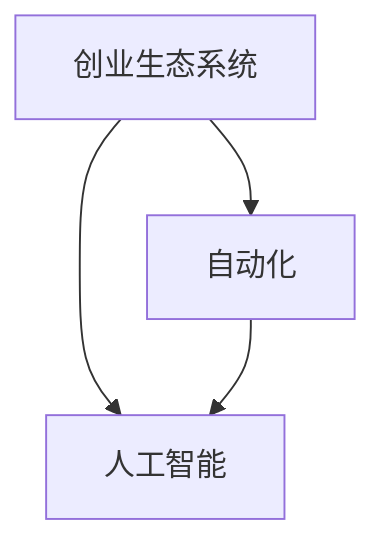

                 

# 打造自动化创业生态系统

在当今快速变化的商业环境中，创业者们面临着前所未有的机遇与挑战。技术的迅猛发展，尤其是人工智能（AI）和自动化（Automation）技术的成熟，为各行各业带来了革命性的变革。创业者们不仅要应对激烈的市场竞争，还需不断创新，以保持在瞬息万变的商业浪潮中的领先地位。本文将从自动化创业生态系统的构建出发，探讨如何通过智能科技推动创业项目的持续发展。

## 1. 背景介绍

### 1.1 自动化技术演进

自动化技术，特别是人工智能的发展，正逐渐渗透到各行各业。无论是制造业的智能制造，还是服务业的人工智能客服，自动化都已成为提高生产效率和用户体验的关键因素。以AI为核心的自动化技术不仅能大幅提升生产效率，还能降低运营成本，为企业带来新的增长点。

### 1.2 创业生态系统转变

随着技术的发展，传统的创业生态系统正在发生转变。创业者们不再只是依靠传统的人力资源和资本投入，而是更多地依赖于技术的力量，尤其是自动化和AI技术。技术创新已成为创业项目成功的重要驱动力。

## 2. 核心概念与联系

### 2.1 核心概念概述

在探讨自动化创业生态系统之前，我们需要明确几个核心概念：

- **创业生态系统（Ecosystem）**：指的是围绕创业者及其项目的各类资源和网络关系，包括资金、技术、市场、人才等。

- **自动化（Automation）**：指通过技术手段，自动完成原本由人工完成的任务。

- **人工智能（AI）**：利用算法和数据模型，使机器具备类人智能，从而执行复杂的任务。

- **智能创业（Smart Entrepreneurship）**：结合AI和自动化技术的创业模式，通过技术创新提升企业竞争力。

这些概念之间存在着密切的联系。智能创业需要依托自动化技术，以提高企业的运营效率和市场响应速度。而人工智能则是自动化技术的大脑，为自动化系统提供智能决策支持。

### 2.2 核心概念联系（Mermaid 流程图）



该图展示了创业生态系统、自动化和人工智能之间的关系。自动化和人工智能技术的结合，为创业生态系统注入了新的活力，提升了创业项目的竞争力和可持续发展能力。

## 3. 核心算法原理 & 具体操作步骤

### 3.1 算法原理概述

自动化创业生态系统的构建，需要依赖于一系列的技术算法，包括数据挖掘、机器学习、自然语言处理（NLP）等。这些算法通过自动化手段，从海量数据中提取有价值的信息，进行分析和预测，指导创业决策。

### 3.2 算法步骤详解

**Step 1: 数据收集与处理**

- **数据收集**：利用自动化工具从各种渠道收集市场数据、行业趋势、消费者行为等信息。
- **数据清洗与处理**：去除噪声数据，进行归一化、特征工程等处理，确保数据的质量和可用性。

**Step 2: 模型构建与训练**

- **模型选择**：根据具体业务需求，选择合适的机器学习模型，如线性回归、决策树、神经网络等。
- **模型训练**：利用收集到的数据对模型进行训练，调整模型参数，提升模型的准确性和泛化能力。

**Step 3: 预测与决策**

- **预测分析**：利用训练好的模型对未来市场趋势、消费者行为等进行预测。
- **决策支持**：结合预测结果，做出合理的创业决策，如产品开发、市场推广、资源配置等。

**Step 4: 系统集成与优化**

- **系统集成**：将各个模块和算法集成到统一的自动化平台中，实现无缝衔接。
- **持续优化**：根据业务反馈，不断优化模型和算法，提升系统的稳定性和效率。

### 3.3 算法优缺点

**优点**：

- **高效性**：自动化技术能够处理大规模数据，快速产生分析结果，提升决策效率。
- **客观性**：数据驱动的决策更客观，减少了人为因素的干扰。
- **可扩展性**：系统可根据需求灵活扩展，适应不同的业务场景。

**缺点**：

- **数据依赖**：系统的准确性高度依赖于数据质量，数据偏差可能导致决策失误。
- **技术门槛**：构建和维护自动化系统需要一定的技术基础和专业知识。
- **成本投入**：初期建设成本较高，需要投入大量资源进行研发和部署。

### 3.4 算法应用领域

自动化创业生态系统在多个领域都有广泛应用，包括但不限于：

- **智能制造**：利用自动化和AI技术提升制造业的自动化水平，提高生产效率和质量。
- **金融科技**：通过自动化和AI技术进行风险评估、智能投顾、自动化交易等，提升金融服务的效率和安全性。
- **零售电商**：利用自动化和AI技术进行客户分析、需求预测、库存管理等，提升客户体验和运营效率。
- **医疗健康**：通过自动化和AI技术进行疾病预测、智能诊断、健康管理等，改善医疗服务质量。

## 4. 数学模型和公式 & 详细讲解 & 举例说明

### 4.1 数学模型构建

在自动化创业生态系统中，数学模型是核心算法的基础。以下是一个简单的预测模型示例：

$$
y = \beta_0 + \beta_1x_1 + \beta_2x_2 + \epsilon
$$

其中，$y$ 为预测结果，$\beta_0$ 为截距，$\beta_1$ 和 $\beta_2$ 为自变量系数，$x_1$ 和 $x_2$ 为自变量，$\epsilon$ 为误差项。

### 4.2 公式推导过程

以线性回归模型为例，推导其最小二乘法（Least Squares）解：

设数据集为 $\{(x_i, y_i)\}_{i=1}^n$，目标是最小化预测误差：

$$
\min_{\beta_0, \beta_1} \sum_{i=1}^n (y_i - (\beta_0 + \beta_1x_i))^2
$$

通过求导，可得最小二乘法解：

$$
\hat{\beta_0} = \frac{\sum_{i=1}^n x_i^2 - \frac{\sum_{i=1}^n x_iy_i}{n}}{\sum_{i=1}^n x_i^2}
$$
$$
\hat{\beta_1} = \frac{\sum_{i=1}^n x_iy_i - \frac{\sum_{i=1}^n x_i^2}{n}\sum_{i=1}^n y_i}{\sum_{i=1}^n x_i^2}
$$

### 4.3 案例分析与讲解

以金融风险评估为例，利用线性回归模型预测客户的违约概率：

假设收集到的数据集包含客户的年龄、收入、信用评分等特征，以及是否违约的标签。利用训练好的线性回归模型，对新客户进行风险评估，判断其违约概率，从而决定是否发放贷款。

## 5. 项目实践：代码实例和详细解释说明

### 5.1 开发环境搭建

- **Python环境**：安装Python 3.x，建议使用虚拟环境。
- **数据集准备**：收集并准备所需的数据集，如客户信息、交易记录等。
- **依赖库安装**：安装必要的依赖库，如NumPy、Pandas、Scikit-learn等。

### 5.2 源代码详细实现

以下是利用Python实现线性回归模型的代码示例：

```python
import numpy as np
from sklearn.linear_model import LinearRegression

# 准备数据
X = np.array([[65, 70000, 680], [55, 60000, 650], [40, 55000, 680]])
y = np.array([0, 1, 0])

# 训练模型
model = LinearRegression()
model.fit(X, y)

# 预测新数据
new_data = np.array([[30, 80000, 750]])
prediction = model.predict(new_data)
print(prediction)
```

### 5.3 代码解读与分析

该代码实现了线性回归模型的训练和预测。首先准备了一个包含年龄、收入、信用评分等特征的数据集，以及是否违约的标签。接着，利用Scikit-learn库的线性回归模型进行训练，并对新数据进行预测。

## 6. 实际应用场景

### 6.1 智能制造

在智能制造领域，自动化和AI技术被广泛应用于生产线的自动化控制、质量检测、供应链优化等方面。例如，利用机器视觉技术进行产品缺陷检测，利用预测模型优化生产计划，提升生产效率和产品质量。

### 6.2 金融科技

在金融科技领域，自动化和AI技术被用于智能投顾、风险评估、欺诈检测等。例如，利用机器学习模型对客户信用进行评估，自动完成贷款审批流程，提高审批效率和准确性。

### 6.3 零售电商

在零售电商领域，自动化和AI技术被用于客户行为分析、库存管理、个性化推荐等。例如，利用机器学习模型分析客户购买行为，推荐个性化商品，提升用户体验和销售额。

### 6.4 医疗健康

在医疗健康领域，自动化和AI技术被用于疾病预测、智能诊断、健康管理等。例如，利用深度学习模型分析医学影像，辅助医生进行疾病诊断，提升诊断准确性和效率。

## 7. 工具和资源推荐

### 7.1 学习资源推荐

1. **《Python数据科学手册》**：一本全面介绍Python数据科学库的书籍，涵盖Numpy、Pandas、Scikit-learn等库的使用。
2. **Coursera的机器学习课程**：由斯坦福大学教授Andrew Ng主讲，介绍了机器学习的基本概念和常用算法。
3. **Kaggle平台**：提供大量的数据集和竞赛项目，可以实践机器学习算法，提升实战能力。
4. **GitHub**：开放源代码的平台，可以获取和学习各类开源项目和代码库。

### 7.2 开发工具推荐

1. **Jupyter Notebook**：用于编写和运行代码的交互式环境，支持代码块的动态展示和调试。
2. **Python环境管理工具**：如Anaconda、virtualenv等，用于创建和管理Python环境，确保代码运行环境的稳定性。
3. **数据可视化工具**：如Matplotlib、Seaborn等，用于数据可视化和结果展示。

### 7.3 相关论文推荐

1. **《深度学习》**：Ian Goodfellow等著，介绍深度学习的基本概念和算法，是AI领域的经典教材。
2. **《机器学习实战》**：Peter Harrington著，提供大量实际案例，帮助读者理解机器学习算法的应用。
3. **《AutoML：自动机器学习》**：AutoML领域的重要综述论文，介绍了自动机器学习的最新进展和应用。

## 8. 总结：未来发展趋势与挑战

### 8.1 研究成果总结

自动化和AI技术正在改变创业生态系统的运行方式，提高创业项目的效率和竞争力。技术创新已成为创业成功的关键因素。

### 8.2 未来发展趋势

1. **自动化技术普及**：随着自动化技术的不断发展，其在各行业的应用将更加广泛，进一步推动创业生态系统的数字化转型。
2. **AI算法的进步**：AI算法的不断进步，将提升自动化系统的智能水平，使其更加高效和精准。
3. **跨领域融合**：自动化和AI技术将与其他技术如区块链、物联网等进行更深层次的融合，推动更广泛的创新应用。

### 8.3 面临的挑战

1. **技术门槛高**：构建和维护自动化系统需要一定的技术基础和专业知识，可能限制一些创业者的进入。
2. **数据隐私问题**：自动化系统对数据依赖度高，数据隐私和安全问题需引起重视。
3. **模型可解释性**：AI模型的黑盒特性，导致其决策过程难以解释，可能影响用户信任。

### 8.4 研究展望

未来，自动化创业生态系统的构建将更加注重数据隐私保护和模型可解释性。同时，跨领域的创新融合将推动更多智能应用场景的涌现。

## 9. 附录：常见问题与解答

**Q1: 自动化创业生态系统的核心是什么？**

A: 自动化创业生态系统的核心是技术和数据。通过技术手段自动化完成各项任务，利用数据驱动决策，提升企业的运营效率和竞争力。

**Q2: 如何构建自动化创业生态系统？**

A: 构建自动化创业生态系统需要以下几个步骤：
1. 数据收集与处理
2. 模型构建与训练
3. 预测与决策
4. 系统集成与优化

**Q3: 自动化创业生态系统的优势有哪些？**

A: 自动化创业生态系统的优势包括：
1. 提高效率
2. 降低成本
3. 提升决策质量
4. 灵活扩展

**Q4: 自动化创业生态系统面临的挑战有哪些？**

A: 自动化创业生态系统面临的挑战包括：
1. 技术门槛高
2. 数据隐私问题
3. 模型可解释性

**Q5: 自动化创业生态系统未来发展的方向是什么？**

A: 自动化创业生态系统未来发展的方向包括：
1. 自动化技术的普及
2. AI算法的进步
3. 跨领域的创新融合

---

作者：禅与计算机程序设计艺术 / Zen and the Art of Computer Programming

