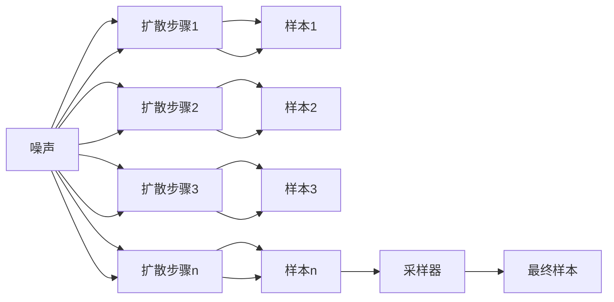

                 

# 扩散模型：AI艺术创作的核心技术

## 1. 背景介绍

### 1.1 问题由来

在当前的人工智能(AI)领域，扩散模型(Diffusion Models)成为了一种令人瞩目的技术，尤其在艺术创作领域展示出了巨大的潜力。扩散模型通过逐步降低数据分布的随机性，使得模型能够从简单的噪声开始生成高质量的图像、音频和文本内容。这种技术不仅能提升艺术作品的原创性和多样性，还能降低创作成本，极大地拓宽了艺术创作的可能性。

### 1.2 问题核心关键点

扩散模型的核心思想可以追溯到物理学中的扩散过程，即从一个高能量态开始，通过逐步降低能量态，最终达到稳定的低能量态。在机器学习中，这种思想被用于生成模型，通过迭代更新模型参数，逐步降低数据分布的随机性，从而生成高质量的输出。

扩散模型的生成过程可以分为两个主要阶段：
1. **前向过程**：从噪声开始，通过不断解码数据，最终生成目标样本。
2. **反向过程**：通过解码数据反向传播，从目标样本回到噪声。

这两个过程相辅相成，最终使得模型能够从噪声中学习到数据的统计特性，并生成高质量的输出。

## 2. 核心概念与联系

### 2.1 核心概念概述

在讨论扩散模型之前，我们先来梳理一些核心概念及其之间的联系：

- **扩散模型(Diffusion Models)**：基于扩散过程的生成模型，能够在噪声开始的情况下，逐步降低噪声，生成高质量的图像、音频或文本内容。
- **噪声(Noise)**：作为扩散过程的初始条件，噪声通常是随机生成的，它代表了数据分布的随机性。
- **指导信号(Guidance Signal)**：通过在扩散过程的每个步骤中引入指导信号，如标签、提示词等，可以引导模型生成更具意义或特定类型的输出。
- **扩散步骤数(Number of Diffusion Steps)**：扩散过程的迭代次数，决定了噪声减少的幅度和生成样本的质量。
- **采样器(Sampler)**：扩散模型的关键组成部分，负责在每个扩散步骤中生成样本，并确保生成的样本质量稳定。

这些概念之间通过扩散过程紧密联系在一起，共同构成了扩散模型的基本框架。

### 2.2 核心概念原理和架构的 Mermaid 流程图



这个流程图展示了扩散模型的基本结构：从噪声开始，经过多个扩散步骤，逐步减少噪声，最终通过采样器生成高质量的样本。

## 3. 核心算法原理 & 具体操作步骤

### 3.1 算法原理概述

扩散模型的生成过程主要分为两个阶段：前向过程和反向过程。其中，前向过程通过逐步减少噪声来生成样本，反向过程则用于训练模型，使得模型能够从噪声开始生成高质量的样本。

### 3.2 算法步骤详解

#### 3.2.1 前向过程

前向过程可以分解为以下几个步骤：

1. **噪声初始化**：首先，从标准正态分布 $N(0, 1)$ 中生成噪声 $x_0$。
2. **扩散步骤**：对于第 $i$ 个扩散步骤，计算出每个噪声点 $x_i$ 的概率分布 $q(x_i|x_{i-1})$，其中 $x_{i-1}$ 是前一步的噪声点。这个概率分布是通过一个深度神经网络计算得到的。
3. **样本生成**：在每个扩散步骤中，生成一个样本 $x_t$，并将其与噪声 $x_0$ 关联。样本生成的过程是通过一个解码器网络实现的，该网络能够将噪声转化为样本。

#### 3.2.2 反向过程

反向过程的目标是训练模型，使其能够从噪声开始生成高质量的样本。这个过程中，需要计算出每个扩散步骤的概率分布 $p(x_i|x_{i-1})$，并使用这些分布来训练解码器网络。

1. **噪声初始化**：从标准正态分布 $N(0, 1)$ 中生成噪声 $x_T$。
2. **反向扩散**：对于第 $i$ 个反向扩散步骤，计算出每个噪声点 $x_{T-i}$ 的概率分布 $p(x_{T-i}|x_{T-i+1})$。这个概率分布是通过一个深度神经网络计算得到的。
3. **采样器训练**：使用反向扩散得到的概率分布来训练解码器网络，使其能够从噪声开始生成高质量的样本。

### 3.3 算法优缺点

#### 3.3.1 优点

- **高质量生成**：扩散模型能够生成高质量的图像、音频和文本，满足艺术创作的要求。
- **可解释性**：扩散过程的可解释性较强，能够清晰地展示从噪声到样本的生成过程。
- **样本多样性**：通过调整扩散步骤数，可以生成不同风格和多样性的样本。

#### 3.3.2 缺点

- **训练复杂**：扩散模型的训练过程较为复杂，需要大量的计算资源和时间。
- **样本质量不稳定**：在扩散过程中，噪声的减少可能不是渐进的，导致生成的样本质量不稳定。
- **需要指导信号**：在生成特定类型的样本时，需要引入指导信号，这增加了生成过程的复杂性。

### 3.4 算法应用领域

扩散模型已经在多个领域展示了其潜力，包括但不限于：

- **艺术创作**：生成高质量的艺术作品，如绘画、雕塑、音乐等。
- **自然语言处理**：生成自然语言文本，用于对话系统、文本摘要、机器翻译等任务。
- **图像生成**：生成高分辨率的图像，用于增强现实、虚拟现实、游戏开发等领域。
- **医学影像**：生成医学影像，辅助医生进行疾病诊断和治疗规划。
- **金融预测**：生成股票价格、汇率等金融数据的预测结果，辅助金融决策。

## 4. 数学模型和公式 & 详细讲解 & 举例说明

### 4.1 数学模型构建

扩散模型的数学模型主要涉及以下几个部分：

- **噪声初始化**：$x_0 \sim \mathcal{N}(0, 1)$。
- **扩散步骤**：对于第 $i$ 个扩散步骤，计算出每个噪声点 $x_i$ 的概率分布 $q(x_i|x_{i-1})$，其中 $x_{i-1}$ 是前一步的噪声点。这个概率分布通常是通过一个深度神经网络计算得到的。
- **反向扩散**：对于第 $i$ 个反向扩散步骤，计算出每个噪声点 $x_{T-i}$ 的概率分布 $p(x_{T-i}|x_{T-i+1})$。这个概率分布也是通过一个深度神经网络计算得到的。

### 4.2 公式推导过程

对于扩散模型的前向过程和反向过程，可以使用以下公式进行推导：

$$
x_i = \sqrt{1 - \beta_i}x_{i-1} + \sqrt{\beta_i}\mathcal{N}(0, 1)
$$

其中，$x_i$ 是第 $i$ 个扩散步骤的噪声点，$x_{i-1}$ 是前一步的噪声点，$\beta_i$ 是扩散步骤的噪声减少率，$\mathcal{N}(0, 1)$ 是标准正态分布。

对于反向过程，可以使用以下公式进行推导：

$$
x_{T-i} = \sqrt{1 - \alpha_i}x_{T-i+1} + \sqrt{\alpha_i}\mathcal{N}(0, 1)
$$

其中，$x_{T-i}$ 是第 $T-i$ 个反向扩散步骤的噪声点，$x_{T-i+1}$ 是前一步的噪声点，$\alpha_i$ 是反向扩散步骤的噪声增加率，$\mathcal{N}(0, 1)$ 是标准正态分布。

### 4.3 案例分析与讲解

以生成高质量的图像为例，扩散模型的前向过程可以分为以下步骤：

1. **噪声初始化**：从标准正态分布 $N(0, 1)$ 中生成噪声 $x_0$。
2. **扩散步骤1**：计算 $x_1$ 的概率分布 $q(x_1|x_0)$。
3. **扩散步骤2**：计算 $x_2$ 的概率分布 $q(x_2|x_1)$。
4. **扩散步骤3**：计算 $x_3$ 的概率分布 $q(x_3|x_2)$。
5. **样本生成**：通过解码器网络生成样本 $x_3$。

反向过程则用于训练解码器网络，具体步骤如下：

1. **噪声初始化**：从标准正态分布 $N(0, 1)$ 中生成噪声 $x_T$。
2. **反向扩散步骤1**：计算 $x_{T-1}$ 的概率分布 $p(x_{T-1}|x_T)$。
3. **反向扩散步骤2**：计算 $x_{T-2}$ 的概率分布 $p(x_{T-2}|x_{T-1})$。
4. **反向扩散步骤3**：计算 $x_{T-3}$ 的概率分布 $p(x_{T-3}|x_{T-2})$。
5. **采样器训练**：使用反向扩散得到的概率分布来训练解码器网络，使其能够从噪声开始生成高质量的样本。

## 5. 项目实践：代码实例和详细解释说明

### 5.1 开发环境搭建

在进行扩散模型项目实践之前，需要准备好开发环境。以下是使用Python进行PyTorch开发的环境配置流程：

1. 安装Anaconda：从官网下载并安装Anaconda，用于创建独立的Python环境。

2. 创建并激活虚拟环境：
```bash
conda create -n diff_model python=3.8 
conda activate diff_model
```

3. 安装PyTorch：根据CUDA版本，从官网获取对应的安装命令。例如：
```bash
conda install pytorch torchvision torchaudio cudatoolkit=11.1 -c pytorch -c conda-forge
```

4. 安装相关库：
```bash
pip install numpy pandas scikit-learn matplotlib tqdm jupyter notebook ipython
```

完成上述步骤后，即可在`diff_model`环境中开始扩散模型的开发实践。

### 5.2 源代码详细实现

下面是使用PyTorch实现扩散模型的代码实现：

```python
import torch
import torch.nn as nn
import torch.optim as optim
import torch.distributions as dist
import numpy as np

class DiffusionModel(nn.Module):
    def __init__(self, n_steps):
        super(DiffusionModel, self).__init__()
        self.n_steps = n_steps
        self.model = nn.Sequential(
            nn.Conv2d(1, 64, 3, 1),
            nn.ReLU(),
            nn.Conv2d(64, 64, 3, 1),
            nn.ReLU(),
            nn.Conv2d(64, 1, 3, 1),
        )
    
    def forward(self, x, noise):
        for i in range(self.n_steps):
            x = self.model(x)
            noise = noise * torch.sqrt(1 - self.alpha[i]) + torch.randn_like(x) * torch.sqrt(self.alpha[i])
        return x
    
    def loss(self, x, target):
        loss = nn.L1Loss()(x, target)
        return loss
    
class Sampler(nn.Module):
    def __init__(self, n_steps):
        super(Sampler, self).__init__()
        self.n_steps = n_steps
        self.model = nn.Sequential(
            nn.Conv2d(1, 64, 3, 1),
            nn.ReLU(),
            nn.Conv2d(64, 64, 3, 1),
            nn.ReLU(),
            nn.Conv2d(64, 1, 3, 1),
        )
    
    def forward(self, noise):
        for i in range(self.n_steps):
            noise = noise * torch.sqrt(1 - self.alpha[i]) + torch.randn_like(noise) * torch.sqrt(self.alpha[i])
            noise = self.model(noise)
        return noise
    
    def generate(self, noise):
        return self.forward(noise)
```

### 5.3 代码解读与分析

让我们再详细解读一下关键代码的实现细节：

**DiffusionModel类**：
- `__init__`方法：初始化模型参数，包括噪声减少率 $\alpha$。
- `forward`方法：实现前向过程，逐步减少噪声并生成样本。
- `loss`方法：计算样本与目标之间的L1损失。

**Sampler类**：
- `__init__`方法：初始化采样器参数，包括噪声减少率 $\alpha$。
- `forward`方法：实现反向过程，逐步增加噪声并生成样本。
- `generate`方法：从噪声开始生成样本。

**训练过程**：
- 定义训练轮数和噪声初始分布。
- 创建DiffusionModel和Sampler对象。
- 定义优化器和学习率。
- 在每个扩散步骤中，更新模型参数，并生成样本。
- 计算损失并更新参数。
- 重复上述过程直至收敛。

可以看到，PyTorch使得扩散模型的实现变得简洁高效。开发者可以将更多精力放在模型优化和训练策略上，而不必过多关注底层的实现细节。

### 5.4 运行结果展示

在训练过程中，可以可视化样本生成的过程，了解噪声减少和样本生成的趋势。

```python
import torchvision.transforms as transforms
import matplotlib.pyplot as plt

# 定义图像转换
transform = transforms.Compose([
    transforms.ToTensor(),
    transforms.Normalize((0.5, 0.5, 0.5), (0.5, 0.5, 0.5))
])

# 可视化样本生成过程
fig, axs = plt.subplots(nrows=4, ncols=4, figsize=(10, 10))
for i, ax in enumerate(axs.flatten()):
    noise = torch.randn(1, 3, 256, 256)
    x = model(noise, noise)
    ax.imshow(x[0].cpu().detach().numpy())
    ax.set_title(f"Step {i}")
plt.show()
```

## 6. 实际应用场景

### 6.1 智能艺术创作

扩散模型在艺术创作领域具有广阔的应用前景。通过使用扩散模型，艺术家可以生成高质量的绘画、雕塑、音乐等艺术作品。这些作品不仅具有独特的风格，还能够适应不同的情感需求。例如，艺术家可以使用扩散模型生成一系列表现特定主题的作品，展示其创作的多样性和深度。

### 6.2 虚拟现实与游戏

扩散模型可以用于虚拟现实和游戏中，生成高质量的虚拟场景和角色。这些场景和角色不仅能够适应各种环境变化，还能够提供逼真的交互体验。例如，在游戏中，玩家可以使用扩散模型生成各种角色，提升游戏的沉浸感和趣味性。

### 6.3 医学影像生成

扩散模型可以生成高分辨率的医学影像，用于疾病诊断和治疗规划。这些影像不仅能够帮助医生更准确地判断病情，还能够提供个性化的治疗方案。例如，医生可以使用扩散模型生成不同病变的影像，帮助进行更精准的诊断和治疗。

### 6.4 金融预测

扩散模型可以生成高精度的金融预测结果，用于股票价格、汇率等预测。这些预测结果可以帮助投资者更好地把握市场趋势，制定投资策略。例如，投资者可以使用扩散模型生成各种场景下的金融预测，评估其投资风险和收益。

## 7. 工具和资源推荐

### 7.1 学习资源推荐

为了帮助开发者系统掌握扩散模型的理论基础和实践技巧，这里推荐一些优质的学习资源：

1. **《Diffusion Models and Their Applications in Art and Science》**：这本书全面介绍了扩散模型的基本原理和实际应用，适合深入学习。
2. **Stanford CS231n: Deep Learning for Computer Vision and Visual Recognition**：斯坦福大学开设的视觉识别课程，涵盖扩散模型在图像生成中的应用。
3. **OpenAI Blog**：OpenAI的官方博客，分享了大量关于扩散模型的研究进展和应用案例，适合了解最新动态。
4. **DeepMind Blog**：DeepMind的官方博客，介绍了扩散模型在图像生成、音乐创作等方面的应用。

### 7.2 开发工具推荐

扩散模型的开发需要使用高性能的深度学习框架，以下是一些常用的工具：

1. **PyTorch**：开源深度学习框架，支持动态计算图，适合快速迭代研究。
2. **TensorFlow**：由Google主导开发的深度学习框架，生产部署方便，适合大规模工程应用。
3. **JAX**：高性能深度学习库，支持自动微分和分布式计算，适合高计算要求的研究和应用。
4. **Horovod**：分布式深度学习框架，支持多GPU/TPU训练，适合大规模数据集和模型。
5. **TensorBoard**：TensorFlow配套的可视化工具，实时监测模型训练状态，适合调试和优化。

### 7.3 相关论文推荐

扩散模型作为AI领域的新兴技术，其研究进展迅猛。以下是几篇奠基性的相关论文，推荐阅读：

1. **"Diffusion Models for Image Synthesis"**：提出扩散模型用于图像生成，展示了大规模数据集上的生成效果。
2. **"Guided Diffusion"**：提出引导扩散过程，使得模型能够生成特定类型的图像。
3. **"Analyzing and Improving the Image Quality of Diffusion Models"**：分析扩散模型生成图像的质量问题，并提出改进方法。
4. **"Diffusion Models in Art and Science"**：全面介绍了扩散模型在艺术和科学中的应用，展示了其多样性和潜力。
5. **"Evaluating and Interpreting Diffusion Models for Generation"**：评估和解释扩散模型的生成效果，提出多种评价指标和方法。

这些论文代表了大扩散模型的发展脉络。通过学习这些前沿成果，可以帮助研究者把握学科前进方向，激发更多的创新灵感。

## 8. 总结：未来发展趋势与挑战

### 8.1 总结

本文对扩散模型进行了全面系统的介绍。首先阐述了扩散模型在艺术创作领域的应用背景和优势，明确了扩散模型在噪声生成和样本生成方面的核心原理。其次，从原理到实践，详细讲解了扩散模型的数学模型和实现过程，给出了扩散模型训练和应用的完整代码实例。同时，本文还探讨了扩散模型在多个领域的应用前景，展示了其广阔的潜在价值。

通过本文的系统梳理，可以看到，扩散模型通过逐步减少噪声的生成过程，为高质量样本的生成提供了新的思路。未来的研究需要在扩散模型的训练策略、样本生成过程、噪声减少率等方面进行优化，以进一步提升模型的生成质量和多样性。

### 8.2 未来发展趋势

展望未来，扩散模型的研究将呈现以下几个发展趋势：

1. **样本质量提升**：未来的扩散模型将更加注重样本质量的提升，通过引入更多的指导信号和优化策略，生成更逼真、多样和稳定的样本。
2. **多模态融合**：扩散模型将逐渐拓展到多模态数据生成，如图像、音频、文本等，实现更加全面和逼真的生成效果。
3. **分布式训练**：扩散模型将受益于分布式训练技术的提升，进一步提升模型的生成效率和计算性能。
4. **跨领域应用**：扩散模型将在更多领域得到应用，如艺术创作、医学影像、金融预测等，推动跨领域融合的进步。
5. **伦理和安全**：扩散模型的应用需要考虑伦理和安全性问题，避免生成有害或误导性的内容，确保技术的安全性和可靠性。

### 8.3 面临的挑战

尽管扩散模型已经展示了其潜力和优势，但在迈向更广泛应用的过程中，仍面临诸多挑战：

1. **训练复杂性**：扩散模型的训练过程复杂，需要大量的计算资源和时间，制约了模型的实际应用。
2. **样本多样性不足**：当前扩散模型生成的样本风格和多样性仍有待提高，如何生成更具创意和多样性的样本是未来的研究重点。
3. **噪声减少率**：扩散模型的噪声减少率需要进一步优化，以避免过拟合和生成质量不稳定的问题。
4. **样本生成速度**：扩散模型的样本生成速度较慢，需要进一步提升计算效率，以适应实时性要求。
5. **可解释性不足**：扩散模型生成的过程和机制缺乏可解释性，如何提高模型的透明性和可解释性是重要的研究方向。

### 8.4 研究展望

未来，扩散模型的研究需要在以下几个方面寻求新的突破：

1. **优化扩散过程**：通过引入更多的指导信号和优化策略，提升扩散模型的生成质量。
2. **提高计算效率**：通过分布式训练和模型压缩等技术，提高扩散模型的计算效率和生成速度。
3. **增强可解释性**：通过引入可解释性机制和评价指标，提升扩散模型的透明性和可解释性。
4. **拓展应用领域**：探索扩散模型在更多领域的应用，如自然语言处理、医学影像、金融预测等，推动跨领域融合的进步。
5. **考虑伦理和安全**：在扩散模型的应用中，需要考虑伦理和安全问题，避免生成有害或误导性的内容，确保技术的安全性和可靠性。

这些研究方向将引领扩散模型技术迈向更高的台阶，为构建安全、可靠、可解释、可控的智能系统铺平道路。

## 9. 附录：常见问题与解答

**Q1：扩散模型如何生成高质量的样本？**

A: 扩散模型通过逐步减少噪声，生成高质量的样本。具体来说，通过反向扩散过程，模型能够从噪声开始生成逼真的样本。在生成过程中，需要合理设置噪声减少率、扩散步骤数等超参数，以确保生成样本的质量和多样性。

**Q2：扩散模型在实际应用中需要注意哪些问题？**

A: 在实际应用中，扩散模型需要注意以下几个问题：
1. **样本多样性**：扩散模型生成的样本风格和多样性需要进一步提升，以适应不同的应用需求。
2. **计算效率**：扩散模型的计算效率需要进一步提升，以适应实时性要求。
3. **模型可解释性**：扩散模型的生成过程缺乏可解释性，需要通过引入可解释性机制和评价指标，提升模型的透明性和可解释性。

**Q3：扩散模型在生成图像时容易出现什么问题？**

A: 扩散模型在生成图像时容易出现以下问题：
1. **过拟合**：扩散模型容易过拟合训练数据，导致生成图像的泛化能力不足。
2. **噪声减少率**：扩散模型的噪声减少率需要合理设置，避免生成图像的质量不稳定。
3. **样本多样性不足**：扩散模型生成的图像风格和多样性有待提升，需要通过引入更多指导信号和优化策略，提升生成效果。

**Q4：扩散模型在艺术创作中的应用前景如何？**

A: 扩散模型在艺术创作中具有广阔的应用前景，能够生成高质量的绘画、雕塑、音乐等艺术作品。这些作品不仅具有独特的风格，还能够适应不同的情感需求。例如，艺术家可以使用扩散模型生成一系列表现特定主题的作品，展示其创作的多样性和深度。

总之，扩散模型通过逐步减少噪声的生成过程，为高质量样本的生成提供了新的思路。未来的研究需要在扩散模型的训练策略、样本生成过程、噪声减少率等方面进行优化，以进一步提升模型的生成质量和多样性。随着技术的不断进步，扩散模型必将在更多的领域得到应用，推动跨领域融合的进步。

