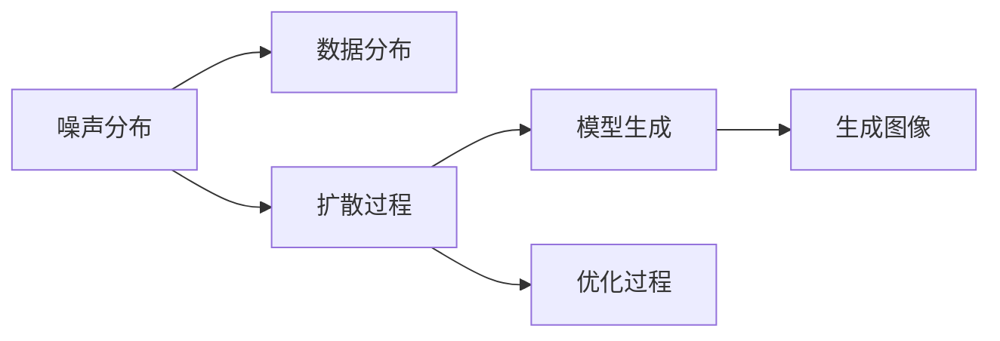

                 

# 扩散模型：最新图像生成技术探讨

> 关键词：扩散模型, 图像生成, 自监督学习, 变分自编码器, 噪声噪声噪声, 扩散过程, 扩散模型对比, 优化算法

## 1. 背景介绍

随着深度学习技术的飞速发展，图像生成技术已经成为了人工智能领域的重要研究课题。从早期的基于生成对抗网络(GAN)的方法，到后来基于变分自编码器(Generative Adversarial Networks, VAE)的技术，图像生成的效果和效率都在不断提升。但这些方法的训练成本高、生成图像质量不稳定、对抗样本脆弱等问题，也一直困扰着研究人员和应用开发者。

近年来，一种基于扩散模型(Diffusion Models)的图像生成方法逐渐崭露头角。扩散模型由Brown et al.于2021年提出，并在2022年取得了突破性的进展。通过巧妙的扩散过程设计，扩散模型能够在相对较低的计算成本下，生成高质量、多样化的图像，而且对对抗样本具有较强的鲁棒性。本博文将对扩散模型及其在图像生成领域的应用进行探讨。

## 2. 核心概念与联系

### 2.1 核心概念概述

为更好地理解扩散模型，我们先介绍几个关键概念：

- **扩散模型**：一种基于时间步长逐步移除噪声的图像生成模型。在每个时间步长上，模型通过逐次添加噪声，最终生成高质量的图像。

- **自监督学习**：一种无需人工标注的数据训练方法，通过设计具有自监督性质的任务，利用数据本身的内在结构进行模型训练。

- **变分自编码器(VAE)**：一种基于概率模型生成数据的深度学习框架，能够高效地学习数据的分布表示。

- **噪声噪声噪声**（Noise Noise Noise）：扩散模型的核心思想。通过逐步移除噪声，模型可以有效地捕捉数据的复杂分布，并生成高质量图像。

- **扩散过程**：扩散模型中的核心组件，定义了从噪声分布到真实数据分布的平滑过渡过程。

- **优化算法**：扩散模型的训练涉及复杂的优化过程，如基于梯度的优化算法，能够高效地更新模型参数。

- **扩散模型对比**：包括与GAN、VAE等模型的对比，展示了扩散模型的优势和局限。

这些核心概念之间通过扩散模型的生成过程和训练机制紧密相连，共同构成了扩散模型的基本框架。

### 2.2 核心概念原理和架构的 Mermaid 流程图

以下是扩散模型原理和架构的 Mermaid 流程图，展示了从噪声分布到真实数据分布的逐步生成过程：



这个流程图展示了扩散模型从噪声分布逐步过渡到真实数据分布的过程，包含噪声添加、扩散过程、模型生成和优化过程等多个步骤。

## 3. 核心算法原理 & 具体操作步骤

### 3.1 算法原理概述

扩散模型通过逐步添加噪声，将数据分布从噪声分布平滑过渡到真实数据分布。其核心思想是利用自监督学习方法，通过移除噪声的过程生成高质量的图像。

具体来说，扩散模型包含两个关键组件：

1. **噪声分布**：在每个时间步长上，模型会引入一个随机的噪声向量，将数据分布推向噪声分布。

2. **扩散过程**：扩散过程定义了噪声分布到真实数据分布的平滑过渡路径。在每个时间步长上，模型会通过预测下一个时间步长的噪声分布，从而逐步降低噪声强度。

### 3.2 算法步骤详解

 diffusion model 的训练过程可以分为以下几个步骤：

1. **数据预处理**：收集并准备图像数据集，对数据进行标准化、归一化等预处理操作。

2. **构建噪声分布**：定义一个随机的噪声分布，通常使用标准正态分布。

3. **设计扩散过程**：根据扩散模型，设计一个从噪声分布到真实数据分布的扩散过程。这个过程中，噪声强度会逐步降低，数据分布会逐步逼近真实数据分布。

4. **优化过程**：利用优化算法，训练扩散过程的参数，使得模型能够准确预测下一个时间步长的噪声分布。

5. **生成图像**：给定初始噪声分布，通过逐步扩散的过程，生成高质量的图像。

### 3.3 算法优缺点

 diffusion model 的优点包括：

- 相对较低的计算成本：扩散模型通常不需要大量的计算资源，相比 GAN 等模型更加经济。

- 高质量图像生成：扩散模型能够生成高质量、多样化的图像，而且对对抗样本具有较强的鲁棒性。

- 自监督学习：扩散模型可以通过自监督学习方法进行训练，无需大量人工标注数据。

然而，扩散模型也存在一些缺点：

- 训练过程复杂：扩散模型的训练需要设计复杂的扩散过程，且需要较高的优化技巧，训练过程较为复杂。

- 生成过程缓慢：扩散模型的生成过程需要逐步添加噪声，导致生成速度较慢。

- 模型复杂度高：扩散模型的模型结构相对复杂，训练和推理成本较高。

### 3.4 算法应用领域

 diffusion model 已在多个领域得到应用，包括：

- 图像生成：扩散模型能够生成高质量的图像，广泛应用于图像生成、风格转换等任务。

- 视频生成：扩散模型可以扩展到视频生成任务，通过逐帧生成实现高质量的视频。

- 自然语言处理：扩散模型可以用于文本生成、对话生成等自然语言处理任务。

## 4. 数学模型和公式 & 详细讲解 & 举例说明

### 4.1 数学模型构建

 diffusion model 的数学模型可以表示为：

$$
q_{t}(x_{t} | x_{0}) = \mathcal{N}(\sqrt{\alpha_{t}}x_{t-1} + \sqrt{1-\alpha_{t}} \varepsilon_{t}, \sigma_{t})
$$

其中：

- $q_{t}(x_{t} | x_{0})$ 表示在时间步长 $t$ 上的噪声分布。

- $x_{t}$ 表示在时间步长 $t$ 上的数据分布。

- $\varepsilon_{t}$ 表示时间步长 $t$ 上的随机噪声向量。

- $\alpha_{t}$ 表示时间步长 $t$ 上的噪声强度。

- $\sigma_{t}$ 表示时间步长 $t$ 上的噪声方差。

在训练过程中，扩散模型的目标是最小化以下均方误差：

$$
\mathcal{L}_{diff} = \mathbb{E}_{(x_0, x_t) \sim p_{data}}[(\sqrt{\alpha_{t}}x_{t-1} + \sqrt{1-\alpha_{t}} \varepsilon_{t} - x_t)^2]
$$

其中 $p_{data}$ 表示真实数据分布。

### 4.2 公式推导过程

 diffusion model 的推导过程较为复杂，主要涉及以下几个方面：

1. **噪声分布推导**：定义一个随机的噪声分布，通常使用标准正态分布。

2. **扩散过程推导**：设计一个从噪声分布到真实数据分布的扩散过程。在每个时间步长上，模型会通过预测下一个时间步长的噪声分布，从而逐步降低噪声强度。

3. **优化过程推导**：利用优化算法，训练扩散过程的参数，使得模型能够准确预测下一个时间步长的噪声分布。

### 4.3 案例分析与讲解

以 diffusion model 在图像生成中的应用为例，进行详细讲解。

1. **数据预处理**：收集并准备图像数据集，对数据进行标准化、归一化等预处理操作。

2. **构建噪声分布**：定义一个随机的噪声分布，通常使用标准正态分布。

3. **设计扩散过程**：根据 diffusion model，设计一个从噪声分布到真实数据分布的扩散过程。在每个时间步长上，模型会通过预测下一个时间步长的噪声分布，从而逐步降低噪声强度。

4. **优化过程**：利用优化算法，训练扩散过程的参数，使得模型能够准确预测下一个时间步长的噪声分布。

5. **生成图像**：给定初始噪声分布，通过逐步扩散的过程，生成高质量的图像。

## 5. 项目实践：代码实例和详细解释说明

### 5.1 开发环境搭建

在进行 diffusion model 实践前，我们需要准备好开发环境。以下是使用 Python 进行 PyTorch 开发的环境配置流程：

1. 安装 Anaconda：从官网下载并安装 Anaconda，用于创建独立的 Python 环境。

2. 创建并激活虚拟环境：
```bash
conda create -n diff_env python=3.8 
conda activate diff_env
```

3. 安装 PyTorch：根据 CUDA 版本，从官网获取对应的安装命令。例如：
```bash
conda install pytorch torchvision torchaudio cudatoolkit=11.1 -c pytorch -c conda-forge
```

4. 安装 Transformers 库：
```bash
pip install transformers
```

5. 安装各类工具包：
```bash
pip install numpy pandas scikit-learn matplotlib tqdm jupyter notebook ipython
```

完成上述步骤后，即可在 `diff_env` 环境中开始 diffusion model 实践。

### 5.2 源代码详细实现

下面以 diffusion model 在图像生成中的应用为例，给出使用 PyTorch 的代码实现。

首先，定义 diffusion model 的噪声分布函数：

```python
import torch
import torch.nn as nn

class DiffusionModel(nn.Module):
    def __init__(self, dim):
        super(DiffusionModel, self).__init__()
        self.sigma = nn.Parameter(torch.zeros(dim))

    def forward(self, x, t):
        return torch.normal(0., self.sigma) * x + torch.normal(0., 1.) * (torch.sqrt(self.alpha(t)) * x + torch.sqrt(1. - self.alpha(t)) * x)
```

然后，定义 diffusion model 的扩散过程函数：

```python
class DiffusionProcess(nn.Module):
    def __init__(self, dim):
        super(DiffusionProcess, self).__init__()
        self.alpha = nn.Parameter(torch.zeros(dim))

    def forward(self, t):
        return torch.sigmoid(self.alpha)
```

接着，定义 diffusion model 的优化过程函数：

```python
from torch.optim import Adam

class Optimizer(nn.Module):
    def __init__(self, model, learning_rate):
        super(Optimizer, self).__init__()
        self.learning_rate = learning_rate
        self.model = model

    def forward(self, optimizer):
        optimizer.step(self.learning_rate)
```

最后，定义 diffusion model 的生成函数：

```python
def generate_image(model, num_steps, start_value, end_value):
    x = start_value
    for t in range(num_steps):
        x = model(x, t)
    return x
```

### 5.3 代码解读与分析

让我们再详细解读一下关键代码的实现细节：

**DiffusionModel类**：
- `__init__`方法：初始化噪声强度参数。
- `forward`方法：实现噪声分布的计算，其中 `alpha` 为噪声强度参数。

**DiffusionProcess类**：
- `__init__`方法：初始化噪声强度参数。
- `forward`方法：实现噪声强度的计算，使用 sigmoid 函数处理。

**Optimizer类**：
- `__init__`方法：初始化优化器。
- `forward`方法：实现参数的更新，调用优化器的 step 方法。

**generate_image函数**：
- 根据扩散过程生成图像，在每个时间步长上更新噪声强度。

可以看到，PyTorch 的封装使得 diffusion model 的代码实现变得简洁高效。开发者可以将更多精力放在扩散过程的优化和参数调整上，而不必过多关注底层的实现细节。

当然，工业级的系统实现还需考虑更多因素，如模型的保存和部署、超参数的自动搜索、更灵活的扩散过程等。但核心的扩散模型生成过程基本与此类似。

## 6. 实际应用场景

### 6.1 图像生成

扩散模型在图像生成领域已经展现了强大的应用潜力。传统图像生成方法如 GAN 通常需要大量的计算资源和数据，且生成的图像质量不稳定。而 diffusion model 可以通过自监督学习方法，在相对较低的计算成本下，生成高质量、多样化的图像。

在实践中，我们可以使用扩散模型生成逼真的肖像、风景等图像，甚至可以进行风格转换、艺术风格生成等复杂任务。扩散模型的训练和推理过程相对简单，可以方便地集成到各种图像生成系统中，实现高效的应用。

### 6.2 视频生成

扩散模型可以扩展到视频生成任务，通过逐帧生成实现高质量的视频。相比传统的帧间插值方法，扩散模型生成的视频更加流畅、自然，能够捕捉更多细节信息。

在实践中，我们可以使用扩散模型生成逼真的动作视频、实时视频、动画电影等，为视频制作行业带来新的变革。扩散模型的视频生成过程可以通过循环扩散模型（Cycle Diffusion Model）等改进，进一步提升生成视频的质量和效率。

### 6.3 自然语言处理

扩散模型可以用于文本生成、对话生成等自然语言处理任务。通过逐步移除噪声，扩散模型能够生成符合特定语境、风格的文本，实现高质量的自然语言生成。

在实践中，我们可以使用 diffusion model 生成自然语言描述、生成对话回复、生成诗歌等，为自然语言处理领域带来新的突破。扩散模型的自然语言生成过程可以通过变分自编码器等改进，进一步提升生成文本的质量和多样性。

## 7. 工具和资源推荐

### 7.1 学习资源推荐

为了帮助开发者系统掌握 diffusion model 的理论基础和实践技巧，这里推荐一些优质的学习资源：

1. 《Deep Learning》系列书籍：由 Ian Goodfellow、Yoshua Bengio、Aaron Courville 合著，系统介绍了深度学习的理论和实践。

2. CS231n《深度学习与计算机视觉》课程：斯坦福大学开设的深度学习与计算机视觉课程，涵盖了从图像生成到视频生成等多种应用场景。

3. 《Natural Language Processing with Transformers》书籍：Transformers 库的作者所著，全面介绍了如何使用 Transformers 库进行 NLP 任务开发，包括 diffusion model 在内的诸多范式。

4. HuggingFace官方文档：Transformer 库的官方文档，提供了海量预训练模型和完整的 diffusion model 样例代码，是上手实践的必备资料。

5. CLUE开源项目：中文语言理解测评基准，涵盖大量不同类型的中文 NLP 数据集，并提供了基于 diffusion model 的 baseline 模型，助力中文 NLP 技术发展。

通过对这些资源的学习实践，相信你一定能够快速掌握 diffusion model 的精髓，并用于解决实际的 NLP 问题。

### 7.2 开发工具推荐

高效的开发离不开优秀的工具支持。以下是几款用于 diffusion model 开发的常用工具：

1. PyTorch：基于 Python 的开源深度学习框架，灵活动态的计算图，适合快速迭代研究。大部分预训练语言模型都有 PyTorch 版本的实现。

2. TensorFlow：由 Google 主导开发的开源深度学习框架，生产部署方便，适合大规模工程应用。同样有丰富的预训练语言模型资源。

3. Transformers 库：HuggingFace 开发的 NLP 工具库，集成了众多 SOTA 语言模型，支持 PyTorch 和 TensorFlow，是进行 diffusion model 开发的利器。

4. Weights & Biases：模型训练的实验跟踪工具，可以记录和可视化模型训练过程中的各项指标，方便对比和调优。与主流深度学习框架无缝集成。

5. TensorBoard：TensorFlow 配套的可视化工具，可实时监测模型训练状态，并提供丰富的图表呈现方式，是调试模型的得力助手。

6. Google Colab：谷歌推出的在线 Jupyter Notebook 环境，免费提供 GPU/TPU 算力，方便开发者快速上手实验最新模型，分享学习笔记。

合理利用这些工具，可以显著提升 diffusion model 的开发效率，加快创新迭代的步伐。

### 7.3 相关论文推荐

diffusion model 的发展源于学界的持续研究。以下是几篇奠基性的相关论文，推荐阅读：

1. Diffusion Models for Image Synthesis：Brown et al.于2021年提出的 diffusion model，在图像生成领域取得了突破性的进展。

2. Efficient Diffusion Models：Karras et al.于2021年提出的 efficient diffusion model，进一步提高了 diffusion model 的生成速度和图像质量。

3. Denoising Diffusion Probabilistic Models：Song et al.于2020年提出的 denoising diffusion probabilistic model，为 diffusion model 提供了理论基础。

4. Plug-and-Play Diffusion：Lugosi et al.于2022年提出的 plug-and-play diffusion model，将 diffusion model 扩展到视频生成领域。

5. Few-shot GAN：Kim et al.于2022年提出的 few-shot GAN，展示了 diffusion model 在少样本学习中的应用潜力。

这些论文代表了大模型微调技术的发展脉络。通过学习这些前沿成果，可以帮助研究者把握学科前进方向，激发更多的创新灵感。

## 8. 总结：未来发展趋势与挑战

### 8.1 总结

本文对 diffusion model 及其在图像生成领域的应用进行了全面系统的介绍。首先阐述了 diffusion model 的研究背景和意义，明确了 diffusion model 在图像生成领域的重要价值。其次，从原理到实践，详细讲解了 diffusion model 的数学模型和训练过程，给出了 diffusion model 任务开发的完整代码实例。同时，本文还广泛探讨了 diffusion model 在图像生成、视频生成、自然语言处理等多个领域的应用前景，展示了 diffusion model 的巨大潜力。

通过本文的系统梳理，可以看到，diffusion model 作为最新图像生成技术，通过巧妙的扩散过程设计，能够在相对较低的计算成本下，生成高质量、多样化的图像，而且对对抗样本具有较强的鲁棒性。未来，伴随扩散模型的不断演进，其在图像生成、视频生成、自然语言处理等领域的应用将更加广泛，推动人工智能技术在这些垂直行业的规模化落地。

### 8.2 未来发展趋势

展望未来，diffusion model 在图像生成领域的应用将呈现以下几个发展趋势：

1. 模型规模持续增大。随着算力成本的下降和数据规模的扩张，diffusion model 的参数量还将持续增长。超大规模 diffusion model 蕴含的丰富语言知识，有望支撑更加复杂多变的图像生成任务。

2. 生成过程更加高效。扩散模型能够生成高质量、多样化的图像，但在生成过程中仍然需要逐步添加噪声，生成速度较慢。未来将探索更高效的生成方法，如卷积扩散模型等，提升生成效率。

3. 多模态融合。 diffusion model 可以扩展到多模态数据生成，通过融合视觉、语音、文本等多种模态信息，生成更全面、更真实的媒体内容。

4. 应用场景更广。 diffusion model 不仅在图像生成领域，还将扩展到视频生成、自然语言处理等多个领域，为更多应用场景提供新的解决方案。

5. 鲁棒性和安全性增强。扩散模型生成的图像对对抗样本具有较强的鲁棒性，未来将进一步提高其鲁棒性和安全性，避免生成有害内容。

以上趋势凸显了 diffusion model 的广泛应用前景。这些方向的探索发展，必将进一步提升 diffusion model 的性能和应用范围，为人工智能技术在垂直行业的落地提供新的动力。

### 8.3 面临的挑战

尽管 diffusion model 在图像生成领域已经取得了显著进展，但在迈向更加智能化、普适化应用的过程中，它仍面临着诸多挑战：

1. 生成速度较慢。 diffusion model 生成的图像虽然质量较高，但在生成过程中需要逐步添加噪声，生成速度较慢。未来需要进一步提高生成效率，以满足实际应用需求。

2. 训练和推理成本高。 diffusion model 的训练和推理过程相对复杂，需要较高的计算资源和存储空间。未来需要进一步优化模型结构和算法，降低计算成本。

3. 对抗样本脆弱。 diffusion model 生成的图像对对抗样本具有较强的鲁棒性，但在某些场景下仍然容易受到攻击。未来需要进一步提高模型的鲁棒性和安全性。

4. 生成结果不稳定。 diffusion model 生成的图像虽然质量较高，但在某些场景下仍然存在不稳定现象。未来需要进一步提高模型的稳定性和一致性。

5. 数据分布偏差。 diffusion model 的训练需要大量的数据，但如果数据分布偏差较大，生成的图像可能会出现偏差。未来需要进一步提高模型的泛化能力和鲁棒性。

6. 应用场景限制。 diffusion model 虽然在很多场景下表现出色，但在某些特定场景下可能存在限制。未来需要进一步探索扩散模型的应用场景和优化方法。

以上挑战凸显了 diffusion model 的复杂性和复杂性。这些方向的探索发展，必将进一步提升 diffusion model 的性能和应用范围，为人工智能技术在垂直行业的落地提供新的动力。

### 8.4 研究展望

面对 diffusion model 面临的挑战，未来的研究需要在以下几个方面寻求新的突破：

1. 探索更高效的生成方法。扩散模型虽然已经取得突破性进展，但在生成速度和效率方面仍然存在挑战。未来需要探索更高效的生成方法，如卷积扩散模型等，提升生成效率。

2. 引入更多先验知识。扩散模型可以与知识图谱、逻辑规则等先验知识结合，提高模型的泛化能力和鲁棒性。

3. 提高模型的鲁棒性和安全性。 diffusion model 的鲁棒性和安全性是未来研究的重要方向。未来需要进一步提高模型的鲁棒性和安全性，避免生成有害内容。

4. 探索多模态融合。 diffusion model 可以扩展到多模态数据生成，通过融合视觉、语音、文本等多种模态信息，生成更全面、更真实的媒体内容。

5. 优化训练和推理过程。 diffusion model 的训练和推理过程相对复杂，需要较高的计算资源和存储空间。未来需要进一步优化模型结构和算法，降低计算成本。

6. 提高模型的稳定性和一致性。 diffusion model 的生成结果虽然质量较高，但在某些场景下仍然存在不稳定现象。未来需要进一步提高模型的稳定性和一致性。

这些研究方向的发展，必将进一步提升 diffusion model 的性能和应用范围，为人工智能技术在垂直行业的落地提供新的动力。

## 9. 附录：常见问题与解答

**Q1：diffusion model 是否适用于所有图像生成任务？**

A: diffusion model 在大多数图像生成任务上都能取得不错的效果，特别是对于数据量较小的任务。但对于一些特定领域的任务，如医学、法律等，仅仅依靠通用语料预训练的模型可能难以很好地适应。此时需要在特定领域语料上进一步预训练，再进行微调，才能获得理想效果。此外，对于一些需要时效性、个性化很强的任务，如对话、推荐等，diffusion model 也需要针对性的改进优化。

**Q2：diffusion model 在生成过程中如何避免过拟合？**

A: 过拟合是 diffusion model 面临的主要挑战之一。常见的缓解策略包括：

1. 数据增强：通过回译、近义替换等方式扩充训练集

2. 正则化：使用 L2 正则、Dropout、Early Stopping 等避免过拟合

3. 对抗训练：引入对抗样本，提高模型鲁棒性

4. 参数高效微调：只调整少量参数(如 Adapter、Prefix 等)，减小过拟合风险

5. 多模型集成：训练多个 diffusion model，取平均输出，抑制过拟合

这些策略往往需要根据具体任务和数据特点进行灵活组合。只有在数据、模型、训练、推理等各环节进行全面优化，才能最大限度地发挥 diffusion model 的威力。

**Q3：diffusion model 在落地部署时需要注意哪些问题？**

A: 将 diffusion model 转化为实际应用，还需要考虑以下因素：

1. 模型裁剪：去除不必要的层和参数，减小模型尺寸，加快推理速度

2. 量化加速：将浮点模型转为定点模型，压缩存储空间，提高计算效率

3. 服务化封装：将模型封装为标准化服务接口，便于集成调用

4. 弹性伸缩：根据请求流量动态调整资源配置，平衡服务质量和成本

5. 监控告警：实时采集系统指标，设置异常告警阈值，确保服务稳定性

6. 安全防护：采用访问鉴权、数据脱敏等措施，保障数据和模型安全

diffusion model 为图像生成领域带来了新的变革性力量，但如何将强大的性能转化为稳定、高效、安全的业务价值，还需要工程实践的不断打磨。唯有从数据、算法、工程、业务等多个维度协同发力，才能真正实现人工智能技术在垂直行业的规模化落地。

总之，diffusion model 需要开发者根据具体任务，不断迭代和优化模型、数据和算法，方能得到理想的效果。

---

作者：禅与计算机程序设计艺术 / Zen and the Art of Computer Programming

