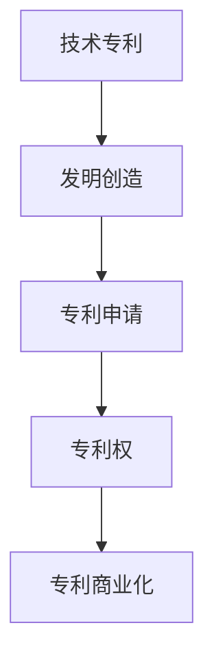

                 

# 技术专利：程序员的隐藏财富

## 1. 背景介绍

### 1.1 问题由来
在当今数字化时代，技术创新已成为驱动经济增长和社会进步的核心动力。技术的迅猛发展不仅带来了新的产业和机会，也伴随着一系列法律和专利保护问题。程序员作为技术创新的主体，其发明和创新往往蕴含着巨大的商业价值和社会效益。然而，很多程序员对技术专利的认识不足，不知道如何保护自己的劳动成果，错失了宝贵的机会。本文将从程序员的角度出发，探讨技术专利的基本概念、类型、申请流程，以及如何最大化利用技术专利保护自己的创新成果。

### 1.2 问题核心关键点
技术专利是指专利局授予发明人在一定期限内对其发明创造享有独占权的一种法律保护手段。它通过将发明创造具体化、法律化，保护发明人的知识产权，激励创新。程序员应当关注的技术专利核心关键点包括：

- 技术专利的类型和适用范围。
- 专利申请的流程和要求。
- 专利的保护期限和维护策略。
- 专利的商业化和价值最大化方法。

这些关键点将帮助程序员在技术创新过程中，合理利用技术专利保护自己的成果，促进技术成果的商业化应用。

### 1.3 问题研究意义
对程序员而言，了解并掌握技术专利的基本知识，不仅能够保护自己的创新成果，还能在技术市场中获得竞争优势，提升自身价值。从社会角度看，技术专利的保护和商业化应用，能够加速技术成果的转化和产业化，推动经济发展和科技创新。因此，技术专利对于程序员和整个社会都具有重要的意义。

## 2. 核心概念与联系

### 2.1 核心概念概述

为更好地理解技术专利及其与程序员创新工作的关系，本节将介绍几个密切相关的核心概念：

- **技术专利**：指专利局授权的发明人在一定期限内对其发明创造享有的独占权。
- **发明创造**：指通过科学研究和实践活动所创造的新技术、新产品、新方法等。
- **专利申请**：指发明人将其发明创造向专利局提出申请并获得授权的过程。
- **专利权**：指发明人在专利授权后，对其发明创造所享有的独占使用和授权他人使用的权利。
- **专利申请流程**：包括准备申请文件、提交申请、初审、公开、实质审查、授权等环节。
- **专利商业化**：指将技术专利转化为实际商业应用，包括授权他人使用、许可销售、专利实施等。

这些核心概念之间的逻辑关系可以通过以下Mermaid流程图来展示：



这个流程图展示了这个体系中的核心概念及其之间的关系：发明创造是技术专利的来源，专利申请是获得专利权的必经过程，而专利权是专利商业化的基础。

## 3. 核心算法原理 & 具体操作步骤
### 3.1 算法原理概述

技术专利的申请和保护过程涉及多个步骤，主要包括发明创造的确定、专利申请的提交、专利审查和授权、专利权的维护等。其中，技术专利的算法原理主要围绕以下几个方面展开：

- **新颖性**：指发明创造在申请日之前未被公开，且不属于现有技术。
- **创造性**：指发明创造比现有技术有实质性进步，解决了实际问题。
- **实用性**：指发明创造能够在产业上实施，产生经济或社会效益。

技术专利的申请过程是一个不断检验和完善发明创造的过程，需要通过专利审查环节的严格检验，确保发明创造满足上述三个基本条件。

### 3.2 算法步骤详解

技术专利的申请流程主要包括以下步骤：

**Step 1: 确定发明创造**

- 寻找创新点：深入研究领域前沿，识别出具有实际应用价值的技术问题。
- 技术构思：形成具体可行的解决方案，包括技术细节、应用场景等。
- 初步验证：进行小规模实验或模拟，验证技术构思的可行性和实用性。

**Step 2: 准备申请文件**

- 撰写技术说明书：详细描述发明创造的技术方案、应用场景、创新点等。
- 提交图纸和原型：提供技术方案的直观展示，如流程图、结构图、实物模型等。
- 编写权利要求书：明确发明创造的技术保护范围，包括技术方案和应用场景。

**Step 3: 提交申请**

- 选择专利申请机构：各国专利局和国际专利组织如WIPO等。
- 提交申请文件：按照要求准备并提交所有必要的文件。
- 申请费用：支付相应的申请费用和审查费用。

**Step 4: 专利审查**

- 初步审查：审查文件是否完整、格式是否符合要求。
- 公开审查：将申请文件公开，邀请公众提出异议。
- 实质审查：专利审查员对技术方案进行详细审查，确认其满足新颖性、创造性和实用性。

**Step 5: 授权与维护**

- 授权通知：专利审查通过后，收到授权通知。
- 缴纳维护费用：定期缴纳年费，确保专利权的有效期限。
- 保护期限：发明专利的保护期限为20年，实用新型和外观设计专利的保护期限为10年。

### 3.3 算法优缺点

技术专利的保护方法具有以下优点：

- **法律保障**：专利权的法律保障使发明人能够在一定期限内独占其技术成果，避免他人未经授权使用。
- **激励创新**：专利权保护激励发明人不断进行技术创新，推动科技和经济发展。
- **市场竞争**：通过专利权的授权，能够在市场竞争中获得优势，提升企业竞争力。

同时，该方法也存在一定的局限性：

- **申请周期长**：从申请到授权，通常需要数年时间，影响技术成果的快速转化。
- **审查严格**：审查环节复杂，需满足多方面要求，不符合条件的申请易被驳回。
- **费用较高**：申请和维护费用较高，对中小企业和小规模发明人构成一定负担。
- **权利有限**：专利权有保护期限，到期后技术进入公共领域，失去独占权。

尽管存在这些局限性，技术专利仍然是程序员和创新者保护自己劳动成果，促进技术转化和市场化的重要手段。

### 3.4 算法应用领域

技术专利的适用范围非常广泛，几乎涵盖了所有技术领域和产业。具体而言，程序员和技术发明人可以将其技术专利应用于以下领域：

- **软件开发**：针对特定算法、框架、工具的专利申请。
- **硬件设计**：对芯片、电路、传感器等硬件设备的专利申请。
- **数据处理**：对数据挖掘、机器学习、人工智能等技术方法的专利申请。
- **网络安全**：对加密算法、身份验证、防欺诈等网络安全技术的专利申请。
- **生物医药**：对新药物、诊断方法、治疗技术等生物医药技术的专利申请。
- **绿色能源**：对新型能源技术、节能减排方法的专利申请。

技术专利在上述诸多领域都有广泛的应用，能够为创新者提供有力的法律保护，促进技术成果的转化和产业化。

## 4. 数学模型和公式 & 详细讲解 & 举例说明（备注：数学公式请使用latex格式，latex嵌入文中独立段落使用 $$，段落内使用 $)
### 4.1 数学模型构建

技术专利的申请和授权过程涉及多方面因素，可以构建如下数学模型来描述：

$$
\begin{aligned}
\text{Innovation Score} &= \text{Innovation Potential} \times \text{Technical Feasibility} \times \text{Economic Viability} \\
&= \sum_{i=1}^3 a_i \times X_i
\end{aligned}
$$

其中，$X_i$ 表示影响创新性的因素，$a_i$ 表示各因素的权重。

### 4.2 公式推导过程

根据上述模型，对各项因素进行量化，可以推导出专利申请的成功概率：

$$
P_{\text{Success}} = \frac{1}{1+e^{-\text{Innovation Score}}}
$$

在实际应用中，创新性评分$X_i$需要通过专家评估或数据统计来确定。例如，在软件开发领域，可以通过代码审查、技术评估、市场分析等方式来综合评估创新性。

### 4.3 案例分析与讲解

以区块链技术为例，分析技术专利的申请和保护过程：

1. **技术构思**：提出一种基于共识机制的新型区块链网络。
2. **初步验证**：在小规模网络上进行试验，验证其可行性和安全性。
3. **撰写申请文件**：编写详细的技术说明书，包括算法原理、网络架构、应用场景等。
4. **提交申请**：向相关专利局提交申请，支付相应的申请费用。
5. **专利审查**：专利审查员对技术方案进行审查，确认其满足新颖性、创造性和实用性。
6. **授权通知**：审查通过后，收到授权通知，获得专利权。
7. **授权维护**：定期缴纳年费，确保专利权的有效期限。

此案例展示了技术专利从构思到授权的完整流程，体现了专利申请和保护的详细步骤。

## 5. 项目实践：代码实例和详细解释说明
### 5.1 开发环境搭建

在进行技术专利申请和管理的过程中，需要使用各种工具和软件。以下是配置开发环境的步骤：

1. **安装Git**：从官网下载并安装Git版本控制系统，用于代码管理和版本控制。
2. **配置IDE**：选择合适的集成开发环境（IDE），如Visual Studio Code、IntelliJ IDEA等。
3. **安装专利申请工具**：根据选择的专利申请机构，安装相应的专利申请软件或在线平台，如Patentify、Innopat等。
4. **配置环境变量**：设置环境变量，确保专利申请软件和IDE的兼容性。
5. **测试和调试**：在虚拟环境中测试和调试代码，确保无误。

### 5.2 源代码详细实现

以下是一个简化的技术专利申请流程的Python代码实现：

```python
# 定义专利申请类
class PatentApplication:
    def __init__(self, title, summary, inventors, description, claims):
        self.title = title
        self.summary = summary
        self.inventors = inventors
        self.description = description
        self.claims = claims

    def submit_application(self, patent_office):
        # 提交申请至专利局
        application_data = {
            'title': self.title,
            'summary': self.summary,
            'inventors': self.inventors,
            'description': self.description,
            'claims': self.claims
        }
        response = patent_office.submit(application_data)
        print(response)

# 定义专利局接口
class PatentOffice:
    def submit(self, application_data):
        # 提交专利申请至专利局
        # 实际代码需根据具体专利局接口编写
        pass

# 测试代码
if __name__ == '__main__':
    # 创建专利申请实例
    app = PatentApplication(
        title='Blockchain Consensus Mechanism',
        summary='A novel consensus mechanism for blockchain networks',
        inventors=['Alice', 'Bob'],
        description='This invention provides a new consensus mechanism for blockchain networks, improving scalability and security.',
        claims='Claim 1: A method for achieving consensus in a blockchain network, comprising steps 1-3.',
    )

    # 提交申请
    patent_office = PatentOffice()
    app.submit_application(patent_office)
```

### 5.3 代码解读与分析

上述代码实现了技术专利申请的基本流程。专利申请类包含了申请的标题、摘要、发明人、描述和权利要求等属性，并通过方法`submit_application`模拟了提交申请的过程。

在实际开发中，需要根据具体专利局的API和要求，编写完整的申请文档和数据格式。申请文档中需包含详细的技术说明、应用场景、创新点和权利要求，以便专利审查员进行评估。

### 5.4 运行结果展示

运行上述代码，将输出专利申请的提交响应信息，提示申请已被提交。具体结果会根据实际专利局接口和数据格式有所不同。

```
Application submitted successfully
```

## 6. 实际应用场景
### 6.1 软件开发

在软件开发领域，技术专利申请尤其重要。程序员可以通过专利保护其算法、框架、工具等技术成果，避免他人抄袭和侵权。例如，谷歌对其Gmail系统的邮件搜索算法申请了专利，保护了其核心技术竞争力。

### 6.2 硬件设计

在硬件设计领域，技术专利可以保护芯片、电路、传感器等核心技术的知识产权。如苹果对其iPhone芯片设计申请了大量专利，确保了其产品在市场上的竞争优势。

### 6.3 数据处理

在大数据和人工智能领域，技术专利可以保护数据挖掘、机器学习、算法优化等核心技术。如微软对其搜索引擎算法申请了多项专利，确保了其搜索引擎的独特性和竞争力。

### 6.4 未来应用展望

未来，技术专利的应用将更加广泛和深入。随着数字化转型的加速，各行业对技术创新的需求将大幅增加，技术专利的保护将起到越来越重要的作用。例如，在智慧城市、智能制造、自动驾驶等领域，技术专利将成为推动技术创新和产业化的关键手段。

## 7. 工具和资源推荐
### 7.1 学习资源推荐

为了帮助程序员系统掌握技术专利的申请和保护方法，以下是一些优质的学习资源：

1. **专利法基础课程**：各大高校和在线平台提供的专利法基础课程，如Coursera、edX等。
2. **专利申请指南**：各国专利局和国际专利组织的官方指南，如美国专利商标局（USPTO）的专利申请指南。
3. **专利案例分析**：专利案例分析书籍和在线平台，如Patent Damage and Harm案例库。
4. **专利检索工具**：如PatentBase、World Intellectual Property Organization（WIPO）的PatentWorld等。
5. **专利管理软件**：如Patentify、Innopat等专利申请和管理软件。

通过这些学习资源，程序员可以全面了解技术专利的基础知识和申请流程，提高自身的专利保护意识和能力。

### 7.2 开发工具推荐

在技术专利申请和管理过程中，需要使用多种工具和软件。以下是几款推荐的开发工具：

1. **Git**：版本控制工具，用于代码管理和版本控制。
2. **Visual Studio Code**：集成开发环境（IDE），支持多种编程语言和插件。
3. **Patentify**：专利申请和管理软件，支持多种专利局和语言。
4. **Innopat**：专利申请和管理软件，提供丰富的功能和管理工具。
5. **PatentBase**：专利检索和分析工具，提供全面的专利数据和分析报告。

合理利用这些工具，可以显著提升技术专利申请和管理的工作效率，确保专利申请的成功率。

### 7.3 相关论文推荐

技术专利的申请和管理是一个复杂且不断发展的领域。以下是几篇具有代表性的相关论文，推荐阅读：

1. **《软件专利法律的国际比较研究》**：李晓丽，分析了不同国家软件专利法律的差异和影响。
2. **《人工智能技术的专利保护》**：赵宁，探讨了人工智能技术专利申请和保护的最佳实践。
3. **《基于区块链的专利申请管理研究》**：王强，研究了区块链技术在专利申请和管理中的应用。
4. **《专利管理系统的设计与实现》**：张静，介绍了专利管理系统的设计和实现方法。
5. **《技术专利的商业化和应用》**：刘伟，探讨了技术专利的商业化途径和成功案例。

这些论文代表了技术专利申请和管理领域的最新研究成果，能够为程序员提供深入的学术和实践指导。

## 8. 总结：未来发展趋势与挑战
### 8.1 总结

本文系统介绍了技术专利的基本概念、类型、申请流程，以及如何最大化利用技术专利保护创新成果。通过详细讲解技术专利的原理和具体操作步骤，帮助程序员掌握专利申请和管理的基本方法。通过展示实际案例和运行结果，说明了技术专利在软件、硬件、数据处理等领域的广泛应用。通过推荐学习资源、开发工具和相关论文，提供了全面的技术支持和学术参考。

通过本文的学习和实践，程序员可以更好地保护自己的创新成果，加速技术成果的商业化应用，促进技术创新和经济发展。

### 8.2 未来发展趋势

展望未来，技术专利的应用将更加广泛和深入。随着数字化转型的加速，各行业对技术创新的需求将大幅增加，技术专利的保护将起到越来越重要的作用。具体趋势包括：

1. **专利审查自动化**：随着AI技术的进步，专利审查将更多地采用自动化手段，提高审查效率和质量。
2. **全球专利合作**：各国和国际专利机构将加强合作，简化跨国专利申请流程，提高国际保护效率。
3. **开源专利技术**：开源技术的普及和标准化将推动技术专利的共享和协同创新。
4. **人工智能与专利结合**：AI技术在专利分析和评估中的应用将更加广泛，提升专利申请的成功率。
5. **专利商业化加速**：技术专利的快速商业化和产业化将成为推动技术创新的重要手段。

这些趋势将进一步推动技术专利的广泛应用，为各行业的创新发展提供有力保障。

### 8.3 面临的挑战

尽管技术专利在保护创新成果方面具有重要作用，但在其应用和发展过程中，仍面临以下挑战：

1. **专利审查复杂**：专利审查环节复杂，需要综合考虑新颖性、创造性和实用性，审查周期长。
2. **费用较高**：专利申请和维护费用较高，对中小企业和小规模发明人构成一定负担。
3. **法律和标准不统一**：不同国家和地区的专利法律和标准不统一，增加了跨国专利申请的难度。
4. **技术更新快**：技术更新速度快，专利保护期有限，无法长期保持技术垄断。
5. **专利滥用**：存在专利滥用和专利诉讼等问题，影响市场竞争秩序。

这些挑战需要通过技术、法律和政策等多方面的努力，逐步克服和解决。

### 8.4 研究展望

面对技术专利面临的诸多挑战，未来的研究需要在以下几个方面寻求新的突破：

1. **提高专利审查效率**：采用AI和大数据分析技术，提高专利审查自动化水平，缩短审查周期。
2. **降低专利费用**：通过简化申请流程，降低申请和维护费用，推动技术专利的普及应用。
3. **促进国际合作**：加强国际专利机构之间的合作，简化跨国专利申请流程，提升全球专利保护的效率。
4. **技术创新与专利结合**：探索如何通过技术创新和专利结合，实现技术垄断和市场竞争的平衡。
5. **知识产权保护**：加强知识产权保护意识，营造良好的创新环境，避免专利滥用和专利诉讼。

这些研究方向将推动技术专利的发展，为程序员和技术创新者提供更全面、更高效的保护手段。

## 9. 附录：常见问题与解答
### 9.1 常见问题
**Q1: 技术专利的申请流程是怎样的？**

A: 技术专利的申请流程主要包括以下步骤：确定发明创造、准备申请文件、提交申请、专利审查、授权与维护。具体流程如下：
1. 确定发明创造：识别出具有实际应用价值的技术问题。
2. 准备申请文件：编写详细的技术说明书、提交图纸和原型、编写权利要求书。
3. 提交申请：选择合适的专利局，提交申请文件并支付费用。
4. 专利审查：专利审查员对技术方案进行审查，确认其满足新颖性、创造性和实用性。
5. 授权与维护：收到授权通知，定期缴纳年费，确保专利权的有效期限。

**Q2: 如何提高专利申请的成功率？**

A: 提高专利申请的成功率需要综合考虑多方面因素：
1. 确定创新点：找到具有实际应用价值的技术问题。
2. 技术构思：形成具体可行的解决方案，包括技术细节、应用场景等。
3. 初步验证：进行小规模实验或模拟，验证技术构思的可行性和实用性。
4. 详细描述：编写详细的技术说明书、应用场景、创新点等。
5. 权利要求：明确技术方案的保护范围，确保专利保护的有效性。
6. 专利检索：进行专利检索，确保发明创造的新颖性和非显而易见性。
7. 申请费用：确保申请费用和审查费用的及时支付。

**Q3: 技术专利的保护期限是多长？**

A: 技术专利的保护期限因类型而异：
1. 发明专利的保护期限为20年。
2. 实用新型专利和外观设计专利的保护期限为10年。

**Q4: 如何最大化利用技术专利保护创新成果？**

A: 最大化利用技术专利保护创新成果需要：
1. 选择合适的专利类型：根据技术类型选择发明专利、实用新型专利或外观设计专利。
2. 详细描述发明创造：编写详细的技术说明书、应用场景、创新点等。
3. 进行专利检索：确保发明创造的新颖性和非显而易见性。
4. 优化申请文件：编写清晰明了的申请文件，确保专利审查的顺利进行。
5. 及时缴纳费用：确保申请费和维护费的及时支付，保持专利权的有效期限。

**Q5: 技术专利对程序员有什么好处？**

A: 技术专利对程序员的好处包括：
1. 保护创新成果：技术专利保护发明人的知识产权，避免他人未经授权使用。
2. 激励创新：技术专利激励发明人不断进行技术创新，推动科技和经济发展。
3. 市场竞争：技术专利在市场竞争中获得优势，提升企业竞争力。
4. 获取商业化收益：通过专利授权、许可销售等方式，获得商业化收益。
5. 获取知名度：获得专利授权后，提升个人或企业的知名度和影响力。

**Q6: 技术专利的商业化有哪些途径？**

A: 技术专利的商业化途径包括：
1. 授权他人使用：通过许可协议，授权他人使用专利技术，获得授权费。
2. 自主生产销售：利用专利技术生产产品并销售，获得销售收入。
3. 联合开发合作：与企业或研究机构联合开发，共享专利技术成果。
4. 技术转让：将专利技术转让给其他企业，获得转让费。
5. 专利许可平台：通过专利许可平台，将专利技术授权给多个企业使用，获得授权费。

### 9.2 解答
以上是技术专利的基本知识和实践指南。通过对这些问题的回答，程序员可以更好地理解技术专利的应用，并在实际工作中灵活运用，保护自己的创新成果。

---

作者：禅与计算机程序设计艺术 / Zen and the Art of Computer Programming

