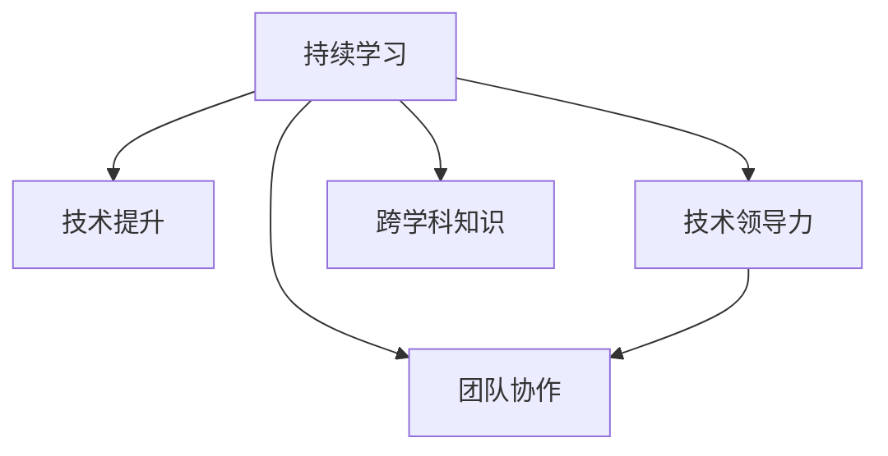

                 

# 技术会议演讲：提升个人价值

> 关键词：个人价值,技术提升,职业发展,持续学习,终身教育,技术领导力

## 1. 背景介绍

### 1.1 问题由来
在快速发展的科技领域，个人如何在技术海洋中乘风破浪，不断提升自身价值？这是一个每个技术人都会面临的挑战。随着人工智能、云计算、区块链等前沿技术的迅猛发展，技术更新迭代速度越来越快，技能贬值速度也在加快。在这样的背景下，如何持续学习、突破自我，成为每个技术人的重要课题。

### 1.2 问题核心关键点
提升个人价值的核心在于不断学习和适应变化。这包括：
- 持续学习新技术和新知识，保持技术领先。
- 提升解决问题的能力，增强技术敏锐度。
- 拓展技术视野，扩展跨学科知识。
- 提升团队合作能力，促进跨部门协作。
- 培养技术领导力，担任技术决策者。

### 1.3 问题研究意义
提升个人价值不仅能帮助技术人在职业生涯中更进一步，还能为组织带来更多创新和竞争优势。持续学习、掌握新技术，成为技术领导，是每个技术人实现个人和组织双赢的关键。

## 2. 核心概念与联系

### 2.1 核心概念概述

为更好地理解如何提升个人价值，本节将介绍几个关键概念：

- **持续学习(Lifelong Learning)**：在职业生涯中不断学习，更新知识体系和技术技能，以适应快速变化的技术环境。

- **技术领导力(Technical Leadership)**：不仅限于技术能力，还包括在团队中扮演指导者、变革推动者的角色，提升团队的创新力和执行力。

- **跨学科知识(Interdisciplinary Knowledge)**：融合多种学科的知识和思维方式，提升技术决策的深度和广度。

- **团队协作(Team Collaboration)**：不仅关注技术能力，更注重跨部门协作和沟通能力，以达成团队目标。

这些概念之间的逻辑关系可以通过以下Mermaid流程图来展示：



这个流程图展示了一个技术人通过持续学习提升个人价值的路径：

1. 持续学习新技术，提升个人技能。
2. 掌握技术领导力，在团队中发挥指导作用。
3. 拓展跨学科知识，提升技术决策的深度和广度。
4. 提升团队协作能力，推动团队目标的实现。

## 3. 核心算法原理 & 具体操作步骤
### 3.1 算法原理概述

提升个人价值的过程是一个系统的自我优化过程，涉及持续学习、技术提升、领导力培养等多个方面。

### 3.2 算法步骤详解

1. **制定学习计划**：
   - 评估当前技术水平和目标领域的技术要求。
   - 设定具体的学习目标，如掌握某种新技术、完成某个项目等。
   - 规划学习时间，每日/每周的学习时长和内容。

2. **选择合适的学习资源**：
   - 在线课程（如Coursera、Udacity）和视频教程（如YouTube、Bilibili）。
   - 书籍、论文和博客等经典文献。
   - 技术社区和论坛（如Stack Overflow、GitHub）。

3. **实践和项目应用**：
   - 将所学知识应用到实际项目中，进行实战练习。
   - 加入开源项目，贡献代码并解决技术难题。
   - 参加技术竞赛（如Kaggle、TopCoder），检验和提升技术能力。

4. **定期回顾和反思**：
   - 每月/每季度回顾学习进展和成果。
   - 总结学习心得和遇到的挑战，调整学习计划和方法。
   - 向同事或导师寻求反馈，以获得新的洞察和指导。

### 3.3 算法优缺点

**优点**：
- **系统性**：全面提升技术能力、领导力和跨学科知识。
- **实战性**：通过项目实践和开源贡献，将理论知识转化为实践能力。
- **持续性**：定期回顾和反思，保证学习进程和目标的一致性。

**缺点**：
- **时间成本高**：持续学习需要投入大量时间，可能影响工作和生活的平衡。
- **资源需求多**：高质量的学习资源和实践项目需要投入时间和资金。
- **自律要求高**：自我驱动的持续学习需要高度的自律和毅力。

### 3.4 算法应用领域

持续学习和技术提升的算法范式不仅适用于技术领域，还可应用于管理、教育、艺术等多个领域。

## 4. 数学模型和公式 & 详细讲解  
### 4.1 数学模型构建

提升个人价值的过程可以用一个简单的数学模型来描述：

设一个人的初始技术能力为 $T_0$，学习速率为 $\lambda$，目标技术能力为 $T_{\text{target}}$，当前时间点为 $t$。则提升个人价值的过程可以用以下公式描述：

$$
T(t) = T_0 \cdot e^{\lambda t}
$$

其中 $T(t)$ 表示在时间 $t$ 时的技术能力。

### 4.2 公式推导过程

通过以上模型，我们可以推导出在 $t$ 时刻达到目标技术能力 $T_{\text{target}}$ 所需的时间 $T$：

$$
T_{\text{target}} = T_0 \cdot e^{\lambda t}
$$

解得：

$$
t = \frac{1}{\lambda} \cdot \ln\left(\frac{T_{\text{target}}}{T_0}\right)
$$

即：

$$
\Delta t = \frac{\ln\left(\frac{T_{\text{target}}}{T_0}\right)}{\ln\left(\frac{1}{\lambda}\right)}
$$

其中 $\Delta t$ 表示达到目标技术能力所需的时间差。

### 4.3 案例分析与讲解

假设一个人当前的技术能力为 $T_0 = 0$（即无基础），目标技术能力为 $T_{\text{target}} = 1$（即掌握所有所需技能），学习速率为 $\lambda = 0.1$（即每月提升10%）。则达到目标技术能力所需的时间差 $\Delta t$ 为：

$$
\Delta t = \frac{\ln\left(\frac{1}{0.1}\right)}{\ln\left(\frac{1}{0.1}\right)} = 10 \text{ 个月}
$$

通过这个案例可以看出，持续学习和技术提升需要投入大量时间和精力，但通过科学规划和持续努力，可以达到目标技术能力。

## 5. 项目实践：代码实例和详细解释说明
### 5.1 开发环境搭建

在实践持续学习和技术提升的过程中，需要一个稳定的开发环境。以下是使用Python进行开发的环境配置流程：

1. 安装Anaconda：从官网下载并安装Anaconda，用于创建独立的Python环境。

2. 创建并激活虚拟环境：
```bash
conda create -n pytech-env python=3.8 
conda activate pytech-env
```

3. 安装PyTorch：根据CUDA版本，从官网获取对应的安装命令。例如：
```bash
conda install pytorch torchvision torchaudio cudatoolkit=11.1 -c pytorch -c conda-forge
```

4. 安装TensorFlow：
```bash
pip install tensorflow
```

5. 安装各类工具包：
```bash
pip install numpy pandas scikit-learn matplotlib tqdm jupyter notebook ipython
```

完成上述步骤后，即可在`pytech-env`环境中开始实践。

### 5.2 源代码详细实现

这里以Python学习为例，给出一个完整的学习计划和实践步骤。

**学习计划**：

1. **基础知识**：学习Python基础语法和数据结构。
2. **高级编程**：学习Python高级特性，如面向对象编程、异常处理、多线程等。
3. **Web开发**：学习Flask框架，进行Web应用开发。
4. **数据科学**：学习Pandas、NumPy、Matplotlib等库，进行数据分析和可视化。
5. **深度学习**：学习TensorFlow或PyTorch，进行深度学习模型的开发和训练。

**实践步骤**：

1. **学习Python基础语法**：
```python
# 基本语法
def add(a, b):
    return a + b

print(add(1, 2))  # 输出 3

# 列表和字典
my_list = [1, 2, 3]
my_dict = {'a': 1, 'b': 2}

print(my_list[0])  # 输出 1
print(my_dict['a'])  # 输出 1
```

2. **学习面向对象编程**：
```python
class MyClass:
    def __init__(self, name):
        self.name = name
        
    def say_hello(self):
        print(f"Hello, {self.name}!")

obj = MyClass("World")
obj.say_hello()  # 输出 Hello, World!
```

3. **学习Flask框架**：
```python
from flask import Flask, render_template

app = Flask(__name__)

@app.route('/')
def index():
    return render_template('index.html', name='World')

if __name__ == '__main__':
    app.run(debug=True)
```

4. **学习Pandas和NumPy**：
```python
import pandas as pd
import numpy as np

# 创建DataFrame
df = pd.DataFrame({'name': ['Alice', 'Bob'], 'age': [25, 30]})

# 计算均值
mean_age = df['age'].mean()
print(mean_age)  # 输出 27.5
```

5. **学习TensorFlow**：
```python
import tensorflow as tf

# 定义模型
model = tf.keras.Sequential([
    tf.keras.layers.Dense(64, activation='relu', input_shape=(784,)),
    tf.keras.layers.Dense(10, activation='softmax')
])

# 编译模型
model.compile(optimizer='adam',
              loss='sparse_categorical_crossentropy',
              metrics=['accuracy'])

# 训练模型
model.fit(train_images, train_labels, epochs=10)
```

通过以上代码实例，可以看出持续学习和技术提升的具体实现步骤，从基础语法到高级特性，再到实际项目开发和数据科学应用。

### 5.3 代码解读与分析

在实际开发中，持续学习和技术提升需要综合考虑多个方面：

**选择合适的学习资源**：
- 在线课程和视频教程提供了系统化的知识体系，适合初学者和快速入门。
- 书籍和论文提供了经典案例和深度思考，适合深入学习和研究。
- 技术社区和论坛提供了实时交流和问题解决，适合提升实战能力。

**规划学习时间**：
- 每日/每周制定学习计划，固定学习时间，保证学习进度。
- 设置学习目标，如掌握某个技术点、完成某个项目，确保学习方向明确。

**实践和项目应用**：
- 将所学知识应用到实际项目中，进行实战练习。
- 加入开源项目，贡献代码并解决技术难题，提升实战经验。
- 参加技术竞赛，检验和提升技术能力，拓宽技术视野。

通过合理规划学习时间、选择合适的学习资源、实践和项目应用，可以有效地提升个人价值。

## 6. 实际应用场景
### 6.1 技术支持工程师

技术支持工程师通过持续学习和技术提升，可以更好地应对复杂的技术问题和挑战。通过掌握新的技术工具和框架，提升问题解决的效率和质量，帮助客户解决技术难题。

### 6.2 软件开发工程师

软件开发工程师通过持续学习和技术提升，可以提升代码质量、开发效率和系统性能。通过掌握新技术和最佳实践，提升开发能力和团队协作能力，推动项目的顺利进行。

### 6.3 数据科学家

数据科学家通过持续学习和技术提升，可以提升数据处理和分析能力，掌握新的数据处理工具和算法。通过提升数据质量、模型精度和应用效果，推动数据驱动的业务决策，提升业务价值。

### 6.4 未来应用展望

随着技术的不断进步和应用场景的不断扩展，持续学习和技术提升将发挥越来越重要的作用。未来，技术人可以通过更多的在线课程、开源项目、技术竞赛等途径，持续学习和提升技术能力，适应快速变化的技术环境。

## 7. 工具和资源推荐
### 7.1 学习资源推荐

为了帮助技术人系统掌握持续学习和技术提升的知识，这里推荐一些优质的学习资源：

1. **Coursera**：提供全球顶级大学和企业的在线课程，涵盖计算机科学、数据科学、人工智能等多个领域。

2. **Udacity**：提供实战导向的纳米学位课程，涵盖软件开发、数据科学、人工智能等多个领域。

3. **Kaggle**：提供数据科学竞赛和数据集，帮助技术人提升数据处理和建模能力。

4. **GitHub**：提供开源项目和代码库，帮助技术人学习和贡献代码，提升实战能力。

5. **Stack Overflow**：提供技术交流和问题解决平台，帮助技术人快速解决技术问题。

通过这些资源的学习和实践，相信技术人可以不断提升技术能力，实现职业发展。

### 7.2 开发工具推荐

高效的开发离不开优秀的工具支持。以下是几款用于持续学习和技术提升的常用工具：

1. **Anaconda**：提供虚拟环境管理工具，方便技术人创建和管理Python环境。

2. **Jupyter Notebook**：提供交互式编程环境，方便技术人进行代码编写和数据可视化。

3. **Git**：提供版本控制和协作工具，方便技术人进行代码管理和团队协作。

4. **Python IDE**：如PyCharm、VSCode等，提供代码编写和调试工具，提升开发效率。

5. **TensorFlow**：提供深度学习框架，帮助技术人进行模型开发和训练。

6. **Kaggle**：提供数据竞赛和社区平台，帮助技术人提升数据处理和建模能力。

合理利用这些工具，可以显著提升技术人的开发效率和学习成果。

### 7.3 相关论文推荐

持续学习和技术提升的研究源于学界的持续研究。以下是几篇奠基性的相关论文，推荐阅读：

1. **Learning to Program in Python**：介绍如何通过编程练习和项目实践，系统提升编程能力。

2. **Flask Web Development**：介绍如何使用Flask框架进行Web应用开发，提升开发效率和实战能力。

3. **Pandas for Data Analysis**：介绍如何使用Pandas库进行数据处理和分析，提升数据处理能力。

4. **TensorFlow Tutorials**：提供深度学习框架TensorFlow的官方教程，帮助技术人掌握深度学习技术。

5. **Kaggle Competitions**：介绍如何在Kaggle平台上参加数据科学竞赛，提升数据处理和建模能力。

这些论文代表了大数据技术学习的方向和前沿成果，通过学习这些前沿成果，可以帮助技术人掌握持续学习和技术提升的精髓。

## 8. 总结：未来发展趋势与挑战
### 8.1 总结

本文对如何通过持续学习和技术提升，提升个人价值进行了全面系统的介绍。首先阐述了持续学习和技术提升的重要性，明确了持续学习和技术提升在职业生涯中的关键作用。其次，从原理到实践，详细讲解了持续学习和技术提升的数学模型和操作步骤，给出了持续学习和技术提升的完整代码实例。同时，本文还广泛探讨了持续学习和技术提升在技术支持、软件开发、数据科学等多个领域的应用前景，展示了持续学习和技术提升的巨大潜力。此外，本文精选了持续学习和技术提升的学习资源、开发工具和相关论文，力求为技术人提供全方位的技术指引。

通过本文的系统梳理，可以看到，持续学习和技术提升是每个技术人实现职业发展和提升个人价值的重要途径。技术人需要不断学习新技术，提升技术能力，才能在快速变化的技术环境中保持竞争力。

### 8.2 未来发展趋势

展望未来，持续学习和技术提升将呈现以下几个发展趋势：

1. **技术升级加速**：随着新技术的不断涌现，技术人需要不断更新知识体系，保持技术领先。

2. **跨学科融合**：未来的技术人不仅需要掌握单一领域的知识，还需要跨学科融合，提升技术决策的深度和广度。

3. **开源贡献**：通过贡献代码和解决技术难题，提升实战能力和技术影响力，成为开源社区的活跃成员。

4. **技术领导力提升**：掌握技术领导力，在团队中发挥指导作用，推动技术创新和团队发展。

5. **持续教育体系**：建立持续教育体系，帮助技术人系统学习和提升技术能力。

以上趋势凸显了持续学习和技术提升的重要性，技术人需要不断适应新技术和变化，提升技术能力和领导力。

### 8.3 面临的挑战

尽管持续学习和技术提升技术已经取得了显著成效，但在迈向更加智能化、普适化应用的过程中，仍面临诸多挑战：

1. **时间成本高**：持续学习和技术提升需要投入大量时间和精力，可能影响工作和生活的平衡。

2. **资源需求多**：高质量的学习资源和实践项目需要投入时间和资金。

3. **自律要求高**：自我驱动的持续学习需要高度的自律和毅力。

4. **新技术挑战**：新出现的技术需要快速学习，但有时学习曲线陡峭。

5. **跨学科难度**：跨学科知识的融合和应用，需要多方面的知识和技能。

正视持续学习和技术提升面临的这些挑战，积极应对并寻求突破，将是大数据技术人才实现职业发展的关键。

### 8.4 未来突破

面对持续学习和技术提升所面临的种种挑战，未来的研究需要在以下几个方面寻求新的突破：

1. **高效学习工具**：开发更多高效的学习工具和资源，帮助技术人快速掌握新技术。

2. **在线学习社区**：建立在线学习社区，帮助技术人互相交流和分享学习经验。

3. **跨学科教育**：推广跨学科教育，提升技术人跨学科知识的深度和广度。

4. **技术领导力培训**：提供技术领导力培训，帮助技术人提升团队管理和指导能力。

5. **终身教育体系**：建立终身教育体系，帮助技术人系统学习和提升技术能力。

这些研究方向的探索，必将引领持续学习和技术提升技术迈向更高的台阶，为技术人实现职业发展和提升个人价值提供新的思路和方法。

## 9. 附录：常见问题与解答

**Q1：如何选择合适的学习资源？**

A: 选择合适的学习资源需要考虑多个因素，包括学习目标、资源质量、学习时间和成本等。建议从以下几个方面入手：
1. **目标明确**：根据自己的学习目标，选择相应的课程和资源。
2. **质量评估**：选择知名的在线课程和书籍，避免低质量资源浪费时间和精力。
3. **时间安排**：根据每日/每周的学习时间，选择适当的学习资源。
4. **成本控制**：选择性价比高的资源，如开源课程和免费资源。

**Q2：如何提升代码质量？**

A: 提升代码质量的关键在于良好的编程习惯和持续的代码优化。建议从以下几个方面入手：
1. **代码规范**：遵循编码规范，编写可读性高的代码。
2. **代码审查**：定期进行代码审查，发现和修复潜在问题。
3. **代码重构**：通过重构优化代码结构，提升代码可维护性和可扩展性。
4. **自动化测试**：编写自动化测试用例，确保代码质量。

**Q3：如何提升团队协作能力？**

A: 提升团队协作能力需要多方面的努力，包括沟通技巧、协作工具和团队建设等。建议从以下几个方面入手：
1. **沟通技巧**：提升沟通能力，确保信息传递准确和及时。
2. **协作工具**：使用协作工具，如Slack、Trello、Git等，提升团队协作效率。
3. **团队建设**：定期组织团队活动，增强团队凝聚力和合作精神。
4. **知识共享**：建立知识共享机制，鼓励团队成员分享和学习。

通过以上常见问题的解答，可以看到，提升个人价值需要从多个方面入手，包括持续学习、技术提升、团队协作等。唯有全面提升技术能力和领导力，才能在快速变化的技术环境中保持竞争力。

