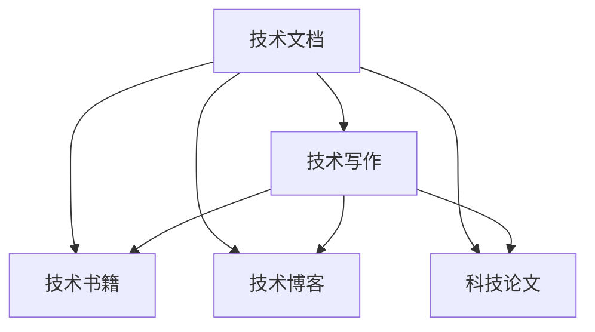

                 

# 技术写作：从技术文档到畅销书

## 1. 背景介绍

### 1.1 问题由来

在科技日新月异、技术迭代迅速的今天，如何将复杂的科学原理和复杂的计算机程序准确、清晰地传达给大众，是一大难题。尤其是在信息技术领域，传统的技术文档和代码注释往往难以覆盖复杂、庞大的系统设计和实现细节，更不用说如何让普通读者理解和应用。因此，如何将技术转化为易于理解、易于传播的文体，不仅是对技术人员的挑战，也是对作家的挑战。

### 1.2 问题核心关键点

技术写作的核心关键点在于将深奥的科学和技术原理转化为普通读者能够理解和接受的语言形式。关键点包括以下几个方面：

- 清晰性：确保读者能够理解核心概念和关键步骤。
- 逻辑性：展示科学原理和编程实现的内部逻辑关系。
- 可读性：使文章简洁、有趣，符合目标读者的阅读习惯。
- 实用性：提供具体案例和实践指导，帮助读者应用所学。
- 创新性：引入前沿技术和方法，提供新视角和新思路。

本文将从技术写作的定义和重要性出发，探讨从技术文档到畅销书的转变过程，提供实用的技术写作技巧和案例分析，为技术写作人员和科技行业从业者提供参考。

### 1.3 问题研究意义

掌握优秀的技术写作技巧，能够提升技术文档的质量和传播效果，不仅有助于技术从业者更好地分享和交流思想，也促进了科技知识的普及和应用。具体意义如下：

1. 提升科技传播效果：清晰的技术文档和书籍能更好地传播科学和技术，提升公众对科技领域的理解和认同。
2. 促进跨学科交流：清晰的文档有助于跨领域、跨行业的知识共享和技术交流。
3. 加速技术创新：准确、详细的技术文档可以更好地记录和传递技术成果，推动科学技术的创新和应用。
4. 培养技术写作人才：掌握技术写作技巧，可以培养一批兼具技术深度和文字表达能力的科技传播者。
5. 增强科技组织的品牌影响力：优秀的技术写作能提升组织的品牌形象和技术实力，吸引更多的合作伙伴和客户。

## 2. 核心概念与联系

### 2.1 核心概念概述

为更好地理解技术写作过程，本节将介绍几个密切相关的核心概念：

- 技术文档(Technical Documentation)：用于描述和记录技术产品、系统、流程等技术信息的文档，包括用户手册、API文档、技术白皮书等。
- 技术写作(Technical Writing)：将技术信息转化为易于理解和使用的文体，使技术文档更易于传播和应用的过程。
- 技术书籍(Technical Books)：系统、深入介绍特定技术的书籍，通常包括理论、应用、案例等。
- 技术博客(Technical Blogs)：基于互联网，以博客形式发布技术内容的平台，便于传播和交流。
- 科技论文(Scientific Papers)：以学术形式发表的技术研究论文，通常以严谨的科学方法论和数据为基础。

这些核心概念之间的逻辑关系可以通过以下Mermaid流程图来展示：



这个流程图展示了一系列的流程和技术写作的不同形式：

1. 技术文档是技术写作的主要对象，通过技术写作将其转化为易于传播的形式。
2. 技术书籍、博客和论文是技术写作的不同表现形式，各自具有独特的传播方式和受众。
3. 技术写作的核心是将技术信息转化为易懂的文体，传播知识，促进应用。

## 3. 核心算法原理 & 具体操作步骤

### 3.1 算法原理概述

技术写作本质上是一种数据处理和知识传播过程。通过将复杂的技术信息通过算法转化为易于理解的文档，使受众能够快速吸收和应用。主要原理包括：

- 算法构建：选择最合适的算法模型，将技术信息转化为可读性高的文档。
- 数据处理：对技术文档进行结构化处理，使其逻辑清晰、层次分明。
- 知识传播：利用信息检索和自然语言处理技术，帮助受众理解和应用文档中的技术信息。

### 3.2 算法步骤详解

技术写作的具体步骤如下：

**Step 1: 分析目标受众**
- 确定目标受众的背景知识和需求，选择合适的内容难度和表达形式。
- 分析受众的学习目标和期望，设计文档结构和内容框架。

**Step 2: 撰写技术文档**
- 使用清晰的语言和结构，分章节介绍技术原理和应用。
- 加入示例和图表，使文档更具可视化和互动性。
- 使用简洁的语法和格式，避免过度技术性描述，使文档易于理解。

**Step 3: 优化文档可读性**
- 应用信息设计理论，使文档布局合理、信息层次分明。
- 使用视觉化元素，如图表、代码块、注解等，增强文档的易懂性和吸引力。
- 采用反馈循环，收集受众反馈，持续优化文档内容。

**Step 4: 验证和发布**
- 通过内部审核和外部测试，验证文档的准确性和可读性。
- 发布文档，并通过社交媒体、博客等渠道进行传播。
- 根据受众反馈，不断更新和完善文档内容。

### 3.3 算法优缺点

技术写作的优点包括：

- 系统化传播：技术文档可以系统、详细地介绍技术信息，便于受众深入理解和应用。
- 可扩展性强：技术文档可以通过修改和更新，不断扩展和丰富内容，满足不同受众的需求。
- 易于存档：技术文档便于保存和检索，可以作为技术档案长期参考。

技术写作的缺点包括：

- 阅读门槛高：部分技术文档过于复杂，对技术背景要求高，受众难以理解。
- 更新成本高：技术快速变化，文档需要频繁更新，维护成本高。
- 缺乏互动性：技术文档缺乏互动性，难以适应受众的学习方式和习惯。

### 3.4 算法应用领域

技术写作在科技领域广泛应用，以下是几个主要应用领域：

- 软件开发：撰写API文档、开发手册、技术博客等，帮助开发者理解和应用开发框架和工具。
- 硬件设计：编写设备用户手册、维修手册等，使技术设备的使用和维护更加便捷。
- 数据科学：撰写数据分析报告、算法手册等，帮助数据科学家记录和分享研究成果。
- 产品设计：撰写产品说明书、用户手册等，帮助用户了解产品功能和使用方法。
- 科技传播：撰写科技文章、科普书籍等，向大众普及科学知识，提升公众科学素养。

## 4. 数学模型和公式 & 详细讲解 & 举例说明

### 4.1 数学模型构建

技术写作的数学模型构建主要涉及如何组织和呈现技术信息，使其易于理解和传播。以下是基本的数学模型构建步骤：

1. 定义目标受众：根据受众的背景和需求，确定文档的知识深度和呈现方式。
2. 选择内容框架：设计文档的章节、小节、子节等结构，使内容层次分明。
3. 确定表达形式：选择适当的文字描述、图表、代码块等表达方式，使内容易于理解。
4. 设计反馈机制：通过受众反馈，不断优化文档内容，使其更加贴近受众需求。

### 4.2 公式推导过程

在技术写作中，一些复杂的技术原理和算法常常需要数学公式进行精确描述。以下是一个简单的数学公式推导过程：

假设我们要描述一个简单的加法运算过程，步骤如下：

**输入**：$a$ 和 $b$ 两个数

**过程**：计算 $a+b$

**输出**：$c$

**代码示例**：

```python
a = 2
b = 3
c = a + b
print(c)
```

**公式推导**：

$$ c = a + b $$

其中：
- $a$ 和 $b$ 是输入参数。
- $c$ 是运算结果。
- $+$ 是加法运算符。

### 4.3 案例分析与讲解

以一个简单的机器学习算法（如决策树）为例，展示如何通过技术写作向受众介绍其原理和实现：

**标题**：决策树算法

**摘要**：
决策树是一种基于树形结构的机器学习算法，常用于分类和回归问题。通过选择最佳特征进行分裂，构建出一棵树形结构，使得模型易于理解和应用。

**内容框架**：
1. 决策树算法简介
2. 决策树构建步骤
3. 决策树剪枝技术
4. 决策树的应用场景
5. 案例分析：房价预测

**文本示例**：

```
**决策树算法简介**

决策树是一种基于树形结构的机器学习算法，常用于分类和回归问题。决策树通过选择最佳特征进行分裂，构建出一棵树形结构，使得模型易于理解和应用。其核心思想是：将数据集划分为不同子集，每个子集对应树的一个节点，并根据特征值将数据划分为不同类别，最终得到一棵树形结构。

**决策树构建步骤**

决策树构建过程分为三个步骤：特征选择、分裂和剪枝。

1. 特征选择：选择最佳特征进行分裂，使得模型能够最大化信息增益。
2. 分裂：根据特征值将数据划分为不同类别，生成决策树节点。
3. 剪枝：对决策树进行剪枝，防止过拟合，提升模型泛化能力。

**决策树剪枝技术**

剪枝是决策树模型的重要组成部分。常用的剪枝方法包括预剪枝和后剪枝。

1. 预剪枝：在构建决策树时，通过设定最小样本数和最小信息增益阈值，防止过拟合。
2. 后剪枝：构建完整的决策树后，通过剪枝操作去除冗余节点，提升模型泛化能力。

**决策树的应用场景**

决策树常用于分类和回归问题，如图像识别、自然语言处理、金融预测等领域。通过决策树，可以构建出易于理解和应用的系统模型，帮助用户进行决策和预测。

**案例分析：房价预测**

以房价预测为例，展示决策树算法的应用过程。

1. 数据准备：收集历史房价数据，包括面积、地理位置、装修情况等特征。
2. 数据预处理：对数据进行清洗、归一化等处理，去除异常值和噪声。
3. 构建决策树：通过特征选择和分裂，构建出一棵决策树。
4. 验证和优化：在验证集上验证模型效果，通过剪枝操作优化决策树。
5. 预测和应用：使用决策树模型进行房价预测，提供准确的预测结果。

以上是一个简单的决策树算法介绍，通过技术写作，我们能够系统地介绍其原理和实现过程，帮助受众深入理解并应用该算法。

## 5. 项目实践：代码实例和详细解释说明

### 5.1 开发环境搭建

在进行技术写作和代码实现时，需要搭建良好的开发环境。以下是Python开发环境配置流程：

1. 安装Python：从官网下载安装Python 3.x版本，建议使用Anaconda安装。
2. 安装开发工具：安装Visual Studio Code、PyCharm等IDE，用于编写代码。
3. 安装相关库：安装NumPy、Pandas、Scikit-learn等数据科学相关库。
4. 配置版本控制：安装Git，用于版本控制和代码管理。

完成以上步骤后，即可在Python开发环境中进行技术写作和代码实现。

### 5.2 源代码详细实现

以一个简单的Python数据处理为例，展示如何通过技术写作和代码实现向受众介绍数据处理过程：

**代码示例**：

```python
import pandas as pd
import numpy as np

# 读取数据集
data = pd.read_csv('data.csv')

# 数据清洗和预处理
data = data.dropna()  # 去除缺失值
data = data.drop_duplicates()  # 去除重复值

# 数据统计和分析
mean_age = data['age'].mean()  # 计算平均年龄
std_age = data['age'].std()  # 计算年龄标准差

# 数据可视化
import matplotlib.pyplot as plt
plt.hist(data['age'], bins=30)
plt.title('Age Distribution')
plt.xlabel('Age')
plt.ylabel('Count')
plt.show()
```

**技术写作**：

```
**数据处理和分析**

数据处理是数据科学和机器学习的重要步骤。通过数据清洗、统计和可视化，可以帮助我们深入了解数据集，提取有价值的信息。

**数据清洗和预处理**

数据清洗是数据处理的关键步骤之一。通过去除缺失值和重复值，确保数据集的完整性和一致性。

1. 去除缺失值：使用dropna()方法，去除缺失值，确保数据完整性。
2. 去除重复值：使用drop_duplicates()方法，去除重复值，避免数据重复。

**数据统计和分析**

数据统计和分析是数据处理的重要手段。通过计算数据集的统计量，可以了解数据的分布和特征。

1. 计算平均年龄：使用mean()方法，计算年龄的平均值。
2. 计算年龄标准差：使用std()方法，计算年龄的标准差。

**数据可视化**

数据可视化是数据呈现的重要手段。通过图形展示，可以直观地展示数据分布和特征。

1. 绘制直方图：使用hist()方法，绘制年龄的直方图。
2. 设置标题、坐标轴标签：使用title()、xlabel()、ylabel()方法，设置图形的标题和坐标轴标签。
3. 显示图形：使用show()方法，显示图形。

以上是一个简单的数据处理和分析过程，通过技术写作和代码实现，我们能够系统地介绍数据处理的方法和过程，帮助受众深入理解并应用该过程。

### 5.3 代码解读与分析

**代码解读**：

1. 导入库：导入Pandas和Numpy库，用于数据处理和计算。
2. 读取数据集：使用read_csv()方法，读取CSV格式的数据集。
3. 数据清洗和预处理：使用dropna()和drop_duplicates()方法，去除缺失值和重复值。
4. 数据统计和分析：使用mean()和std()方法，计算年龄的平均值和标准差。
5. 数据可视化：使用matplotlib库，绘制年龄分布的直方图，并设置图形标题和坐标轴标签。

**代码分析**：

1. 数据清洗和预处理：通过dropna()和drop_duplicates()方法，确保数据集的完整性和一致性。
2. 数据统计和分析：使用mean()和std()方法，计算年龄的平均值和标准差，了解数据分布特征。
3. 数据可视化：使用matplotlib库，绘制直方图，直观展示年龄分布情况。

## 6. 实际应用场景

### 6.1 软件开发

在软件开发中，技术文档和代码实现对于开发者和用户都非常重要。良好的技术文档能够帮助开发者快速理解代码实现，提高开发效率；同时，详细的代码注释和示例能够帮助用户更好地使用软件。

**实际案例**：TensorFlow技术文档

TensorFlow是一个广泛使用的深度学习框架，其技术文档系统地介绍了TensorFlow的架构、使用和部署方法。通过详细的技术文档，开发者能够快速了解TensorFlow的核心功能和使用方法，提高开发效率；同时，用户能够通过技术文档了解TensorFlow的部署方法，快速搭建和应用TensorFlow模型。

### 6.2 硬件设计

在硬件设计中，技术文档和代码实现对于硬件工程师和用户同样重要。良好的技术文档能够帮助工程师快速理解硬件设计和实现细节，提高设计效率；同时，详细的代码注释和示例能够帮助用户更好地使用硬件设备。

**实际案例**：Arduino开发手册

Arduino是一个流行的硬件开发平台，其开发手册系统地介绍了Arduino的各种模块和应用场景。通过详细的开发手册，工程师能够快速了解Arduino的各种模块和使用方法，提高设计效率；同时，用户能够通过开发手册了解Arduino的各种应用场景，快速搭建和应用Arduino硬件设备。

### 6.3 数据科学

在数据科学中，技术文档和代码实现对于数据分析师和用户同样重要。良好的技术文档能够帮助分析师快速理解数据分析方法和流程，提高分析效率；同时，详细的代码注释和示例能够帮助用户更好地应用数据分析结果。

**实际案例**：Scikit-learn用户手册

Scikit-learn是一个流行的数据科学库，其用户手册系统地介绍了Scikit-learn的各种算法和应用场景。通过详细的手册，分析师能够快速了解Scikit-learn的各种算法和使用方法，提高分析效率；同时，用户能够通过手册了解Scikit-learn的各种应用场景，快速应用Scikit-learn进行数据分析。

### 6.4 未来应用展望

随着技术写作的不断发展和应用，未来技术写作将会更加注重以下几个方面：

1. 人工智能和机器学习：通过技术写作，帮助受众理解人工智能和机器学习算法，提升其应用能力。
2. 大数据和云计算：通过技术写作，帮助受众理解大数据和云计算技术，提升其数据处理能力。
3. 区块链和加密货币：通过技术写作，帮助受众理解区块链和加密货币技术，提升其数字安全能力。
4. 物联网和智能设备：通过技术写作，帮助受众理解物联网和智能设备技术，提升其智能应用能力。

未来技术写作将更加注重跨学科、跨领域知识的整合和传播，帮助受众理解复杂的科技系统，促进科技知识的普及和应用。

## 7. 工具和资源推荐

### 7.1 学习资源推荐

为了帮助开发者系统掌握技术写作的技巧和实践，以下是几组推荐的学习资源：

1. 《技术写作手册》：这本书系统地介绍了技术写作的基本原理和实践技巧，适合初学者和高级开发者阅读。
2. 《风格要素：写作与设计》：这本书探讨了技术写作的风格和设计原则，适合技术写作人员阅读。
3. 《Python技术文档最佳实践》：这篇文章系统地介绍了Python技术文档的写作技巧和最佳实践，适合Python开发者阅读。
4. 《Google技术写作指南》：这篇文章详细介绍了Google内部的技术写作指南和实践技巧，适合科技企业员工阅读。
5. Coursera《技术写作与编辑》课程：这个课程系统地介绍了技术写作的基础知识和方法，适合希望提升技术写作技能的人员阅读。

### 7.2 开发工具推荐

掌握高效的工具和技术写作可以显著提升开发效率。以下是几款常用的技术写作和代码管理工具：

1. Visual Studio Code：一个轻量级的代码编辑器，支持Python等语言开发。
2. PyCharm：一个强大的IDE，支持Python开发，并提供了丰富的代码补全和调试功能。
3. GitHub：一个流行的代码托管平台，支持版本控制和协作开发。
4. LaTeX：一个流行的排版工具，适用于编写科技论文和书籍。
5. Markdown：一种轻量级的文本标记语言，适用于编写技术文档和博客。

### 7.3 相关论文推荐

技术写作涉及多个学科，以下是几篇相关领域的经典论文，推荐阅读：

1. "A Survey on Software Maintenance" by Jianjun Li et al.：这篇论文系统地介绍了软件维护的重要性和技术方法，适合技术写作人员阅读。
2. "A Survey of Software Documentation" by Kevin Lehman：这篇论文探讨了软件文档的重要性和技术方法，适合技术写作人员阅读。
3. "Technical Writing as a Service" by David C. McKinnon：这篇论文探讨了技术写作服务的重要性和技术方法，适合技术写作服务提供商阅读。
4. "A Survey of Documentation Generation Techniques" by Wei Wei et al.：这篇论文系统地介绍了文档生成技术，适合技术文档生成开发者阅读。
5. "Technical Writing in the Software Development Life Cycle" by Scott C. Abdallah et al.：这篇论文探讨了技术写作在软件开发生命周期中的作用和重要性，适合软件开发人员阅读。

## 8. 总结：未来发展趋势与挑战

### 8.1 总结

本文对技术写作的定义和重要性进行了全面系统的介绍。首先，技术写作是将复杂的技术信息转化为易于理解、传播的文体，使受众能够快速掌握科技知识和技能。其次，从技术文档到技术书籍、技术博客，技术写作的不同形式都有其独特的传播方式和受众，需要结合实际需求和受众特点，选择合适的表达方式。最后，技术写作还需要不断优化，通过用户反馈和改进，确保内容的准确性和可读性，实现更广泛的知识传播。

通过本文的系统梳理，可以看到，技术写作不仅仅是撰写技术文档，更是一种传播和教育的过程。掌握良好的技术写作技巧，能够有效提升技术文档的质量和传播效果，促进科技知识的普及和应用。未来，技术写作将更加注重人工智能、大数据、物联网等新兴技术的应用，帮助受众更好地理解和应用复杂的科技系统。

### 8.2 未来发展趋势

展望未来，技术写作将呈现以下几个发展趋势：

1. 人工智能和机器学习：技术写作将更加注重人工智能和机器学习技术的传播，帮助受众理解算法原理和应用方法。
2. 大数据和云计算：技术写作将更加注重大数据和云计算技术的传播，帮助受众理解数据处理和云计算方法。
3. 区块链和加密货币：技术写作将更加注重区块链和加密货币技术的传播，帮助受众理解数字安全和加密技术。
4. 物联网和智能设备：技术写作将更加注重物联网和智能设备技术的传播，帮助受众理解智能应用和系统设计。
5. 跨学科知识整合：技术写作将更加注重跨学科知识的整合，帮助受众理解复杂的科技系统，促进科技知识的普及和应用。

### 8.3 面临的挑战

尽管技术写作在科技传播中具有重要意义，但在实践中也面临诸多挑战：

1. 技术复杂性：部分技术知识过于复杂，难以通过简单的语言描述传达。
2. 受众多样性：受众背景和需求各异，需要针对不同受众编写不同的文档。
3. 持续更新：技术快速发展，文档需要不断更新以保持最新性。
4. 版权和知识产权：技术文档涉及大量版权和知识产权问题，需要慎重处理。
5. 全球化传播：不同国家和地区的语言和文化差异，需要编写适应当地受众的文档。

### 8.4 研究展望

面对技术写作所面临的挑战，未来的研究需要在以下几个方面寻求新的突破：

1. 多语言技术写作：探索如何编写适应不同语言和文化的技术文档，提升全球化传播效果。
2. 多模态技术写作：探索如何结合图像、视频等多模态数据，增强技术文档的表现力和互动性。
3. 智能技术写作：探索如何利用人工智能技术，自动生成和优化技术文档，提高写作效率。
4. 人机协同技术写作：探索如何实现人机协同，提高技术文档的准确性和可读性。
5. 跨学科技术写作：探索如何整合跨学科知识，编写更加全面和深入的技术文档。

这些研究方向的探索，将有助于提升技术写作的效率和效果，使技术文档更加易于理解和传播，促进科技知识的普及和应用。

## 9. 附录：常见问题与解答

**Q1: 技术写作与技术文档的区别是什么？**

A: 技术写作是技术文档的创作过程，通过系统、详细地描述技术原理和实现细节，使受众能够理解和应用。而技术文档是技术写作的成果，是记录和传播技术信息的重要载体。

**Q2: 技术写作需要哪些基本技能？**

A: 技术写作需要以下基本技能：

1. 语言表达能力：准确、清晰地表达技术概念和实现细节。
2. 逻辑思维能力：系统、合理地组织技术文档结构，使内容层次分明。
3. 信息设计能力：通过图表、代码块等形式，增强技术文档的可读性和互动性。
4. 数据处理能力：能够处理和分析技术数据，提供准确的统计和分析结果。
5. 反馈机制能力：通过用户反馈和改进，不断优化技术文档内容，提升其准确性和可读性。

**Q3: 如何提高技术写作的效率？**

A: 提高技术写作效率的方法包括：

1. 使用模板：使用标准化的文档模板，加快文档编写速度。
2. 利用工具：使用代码编辑器、文本处理工具、可视化工具等，提高文档生成效率。
3. 团队协作：多人协作编写技术文档，分工明确，提高文档编写效率。
4. 版本控制：使用版本控制工具，确保文档的连续性和一致性。
5. 自动化工具：使用自动生成文档的工具，减少手动编写工作量。

**Q4: 技术写作和科普写作的区别是什么？**

A: 技术写作和科普写作的区别在于：

1. 受众不同：技术写作面向技术专家和开发者，科普写作面向普通读者和公众。
2. 难度不同：技术写作要求受众具有一定技术背景和知识基础，科普写作要求语言通俗易懂。
3. 目的不同：技术写作目的是传递技术知识，科普写作目的是普及科技知识。
4. 语言风格不同：技术写作注重准确性和专业性，科普写作注重通俗性和趣味性。
5. 传播方式不同：技术写作通过技术文档、论文等形式传播，科普写作通过书籍、文章等形式传播。

**Q5: 技术写作的未来趋势是什么？**

A: 技术写作的未来趋势包括：

1. 人工智能和机器学习：通过AI技术自动生成和优化技术文档，提高写作效率。
2. 大数据和云计算：结合大数据和云计算技术，提升技术文档的智能化和自动化。
3. 跨学科知识整合：整合跨学科知识，编写更加全面和深入的技术文档。
4. 多语言和多模态技术写作：通过多语言和多模态技术，提升技术文档的全球化和互动性。
5. 人机协同技术写作：实现人机协同，提高技术文档的准确性和可读性。

---

作者：禅与计算机程序设计艺术 / Zen and the Art of Computer Programming

