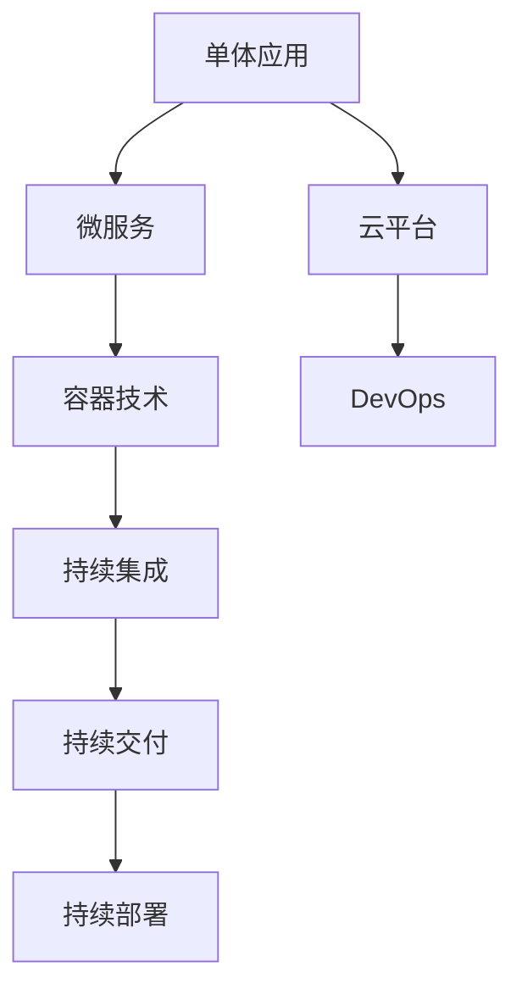
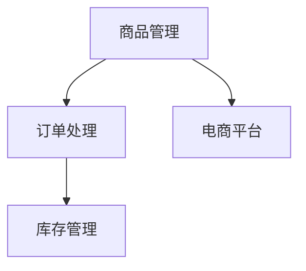
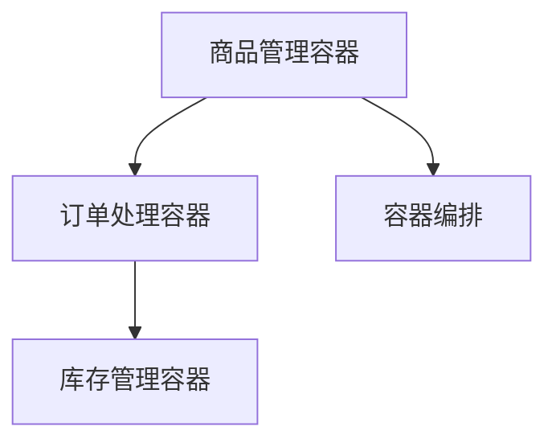
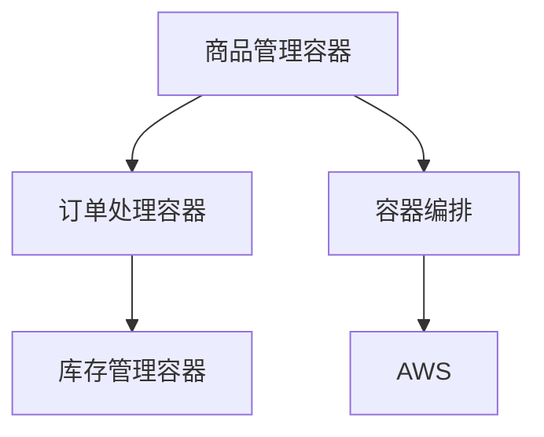
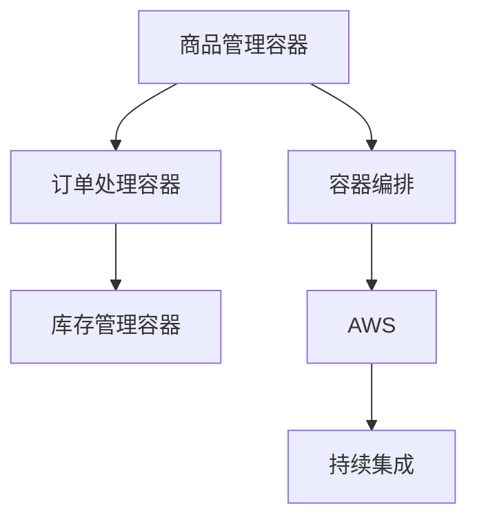

                 

# 技术分享：从线下到线上的转变

> 关键词：
- 软件开发
- 软件架构
- 云计算
- 微服务
- 容器化
- DevOps
- 自动化测试

## 1. 背景介绍

### 1.1 问题由来
在当今数字化时代，软件开发和IT基础设施建设逐渐从线下转向线上，这一转型带来了显著的变化和挑战。从传统的单体应用架构到微服务、从本地部署到云上部署，从传统的软件生命周期管理到DevOps自动化和持续集成，软件行业的方方面面都发生了深刻变化。这些变化不仅仅是技术上的，更是企业运营、业务流程和管理模式上的重大转变。本文旨在探讨这一转变的重要性和具体实现方式，帮助开发者和企业更好地应对这些挑战。

### 1.2 问题核心关键点
从线下到线上的转变涉及多个核心关键点：
- **软件架构演进**：从单体架构向微服务架构的转变，提升系统的可扩展性和可维护性。
- **云平台部署**：将应用从本地服务器迁移到云平台，充分利用云计算资源。
- **DevOps文化**：推动软件开发和运维的紧密协作，实现快速、高效、稳定的交付。
- **容器化技术**：使用Docker和Kubernetes等容器技术，实现应用的快速部署和弹性伸缩。
- **自动化测试与持续集成**：通过自动化测试和持续集成，提升软件交付质量，减少人工干预。

## 2. 核心概念与联系

### 2.1 核心概念概述

为了更好地理解从线下到线上转变的全貌，本节将介绍几个关键概念及其联系：

- **单体应用(Monolithic Application)**：在一个单一的应用程序中集成所有模块和组件，部署和维护相对简单。
- **微服务(Microservices)**：将应用程序拆分为多个小型、独立的服务，每个服务负责特定的业务功能。
- **云平台(Cloud Platform)**：如AWS、Azure、Google Cloud等，提供计算、存储、网络、数据库等基础设施服务。
- **容器技术(Container Technology)**：如Docker、Kubernetes，用于封装、打包、部署和管理应用。
- **DevOps**：开发和运维的紧密协作，实现软件生命周期自动化管理。
- **持续集成(Continuous Integration, CI)**：频繁地将代码合并到主分支，自动化测试和部署。
- **持续交付(Continuous Delivery, CD)**：将软件持续交付给用户，并确保其质量。
- **持续部署(Continuous Deployment, CD)**：将代码自动部署到生产环境，实现自动发布。

这些概念之间的逻辑关系可以通过以下Mermaid流程图来展示：



这个流程图展示了从单体应用到微服务，再到容器化和DevOps的一系列演变过程：

1. 单体应用向微服务转变，提升系统灵活性和扩展性。
2. 微服务部署在云平台上，充分利用云计算资源。
3. 容器技术封装微服务，实现应用的快速部署和弹性伸缩。
4. DevOps推动开发和运维协作，实现自动化和快速交付。
5. 持续集成和持续交付保障代码质量，实现高效交付。

这些概念共同构成了从线下到线上转变的技术框架，帮助企业提升软件交付质量和运营效率。

## 3. 核心算法原理 & 具体操作步骤
### 3.1 算法原理概述

从线下到线上的转变不仅仅是技术上的切换，更是整个软件开发和运维流程的优化和再造。其核心思想是通过软件架构的演进、云平台的应用、DevOps文化的推广、容器化和自动化测试的实施，实现软件的自动化和灵活性，提升企业的运营效率和竞争力。

形式化地，假设初始的单体应用架构为 $M_{mono}$，其功能集成和调用方式相对简单。通过微服务拆分和云平台部署，转换为微服务架构 $M_{micro}$，并使用容器技术封装为 $C_{micro}$。同时，引入DevOps流程，实现持续集成 $CI_{micro}$ 和持续交付 $CD_{micro}$。具体步骤如下：

1. **微服务拆分**：将单体应用的各个模块拆分为独立的微服务 $M_{micro}$，每个服务负责特定的业务功能。
2. **云平台部署**：将微服务 $M_{micro}$ 部署到云平台 $P_{cloud}$，利用云平台的资源和服务。
3. **容器化封装**：使用Docker等容器技术将微服务 $M_{micro}$ 封装为容器 $C_{micro}$，实现快速部署和弹性伸缩。
4. **DevOps流程**：引入自动化测试和持续集成 $CI_{micro}$，确保代码质量；引入持续交付和持续部署 $CD_{micro}$，实现快速发布和回滚。
5. **自动化监控**：引入自动化监控工具，实时跟踪系统运行状态和性能指标，及时发现和解决问题。

### 3.2 算法步骤详解

具体的实现步骤如下：

1. **需求分析与设计**：
   - 确定系统需求和功能模块。
   - 设计微服务架构，定义服务间的接口和通信方式。
   - 设计容器化方案，选择合适的容器镜像和容器编排工具。

2. **系统重构与部署**：
   - 将单体应用逐步拆分为微服务。
   - 使用Docker等工具封装微服务为容器镜像。
   - 将容器镜像部署到云平台，并使用Kubernetes等容器编排工具进行管理。

3. **DevOps流程实施**：
   - 引入持续集成工具，如Jenkins、GitLab CI等。
   - 自动化测试，包括单元测试、集成测试、性能测试等。
   - 引入持续交付工具，如Jenkins Pipeline、Travis CI等。
   - 引入持续部署工具，如Spinnaker、GitLab CI/CD等。

4. **自动化监控与运维**：
   - 引入监控工具，如Prometheus、Grafana等。
   - 使用日志管理和分析工具，如ELK Stack、Splunk等。
   - 自动化编排和运维工具，如Ansible、Chef等。

### 3.3 算法优缺点

从线下到线上转变的方法具有以下优点：
- **提升灵活性和可扩展性**：微服务架构可以方便地扩展和更新服务，提升系统的灵活性和可维护性。
- **降低运维成本**：云平台提供了弹性的计算资源，降低了硬件和维护成本。
- **加速交付和迭代**：持续集成和持续交付实现了快速迭代和交付，缩短了开发周期。
- **提高系统的可靠性**：自动化运维和监控工具可以及时发现和解决问题，提升系统稳定性。

同时，该方法也存在一些局限性：
- **开发复杂度增加**：微服务架构增加了系统的复杂度，需要额外的管理和协调。
- **网络通信开销增大**：微服务之间的通信增加了网络开销，需要优化通信方式和网络设计。
- **数据一致性问题**：分布式系统需要解决数据一致性和分布式事务的问题。
- **安全性挑战**：容器化和DevOps流程带来了新的安全挑战，需要额外的安全措施和策略。

尽管存在这些局限性，但就目前而言，从线下到线上的转变仍是大势所趋。未来的研究需要集中在如何更好地平衡复杂度和灵活性，优化网络通信，解决数据一致性问题，以及提升安全性。

### 3.4 算法应用领域

从线下到线上的转变已经在多个领域得到广泛应用，例如：

- **电商网站**：将商品管理、订单处理、库存管理等功能拆分为主微服务和辅助微服务，部署在云平台上，实现快速迭代和弹性伸缩。
- **金融服务**：将交易处理、风险控制、用户认证等功能拆分为主微服务和辅助微服务，部署在云平台上，提升系统的稳定性和可扩展性。
- **在线教育**：将课程设计、学生管理、课程播放等功能拆分为主微服务和辅助微服务，部署在云平台上，实现个性化教育和资源共享。
- **医疗健康**：将电子病历、患者管理、医疗影像等功能拆分为主微服务和辅助微服务，部署在云平台上，提升医疗服务的智能化和效率。

除了上述这些典型领域外，从线下到线上的转变还被创新性地应用到更多场景中，如智能客服、物流管理、工业控制等，为企业带来了显著的效率提升和成本节约。

## 4. 数学模型和公式 & 详细讲解 & 举例说明

### 4.1 数学模型构建

为了更好地理解从线下到线上转变的数学模型，我们假设系统的初始状态为 $M_{mono}$，经过微服务拆分、云平台部署、容器化封装和DevOps流程后，转换为目标状态 $M_{target}$。我们定义以下变量：

- $M_{mono}$：初始的单体应用架构。
- $M_{micro}$：微服务拆分后的服务架构。
- $P_{cloud}$：目标部署的云平台。
- $C_{micro}$：容器化封装后的微服务。
- $CI_{micro}$：持续集成流程。
- $CD_{micro}$：持续交付流程。

系统的目标是从初始状态 $M_{mono}$ 转换为目标状态 $M_{target}$，需要满足以下条件：

1. $M_{micro} = M_{mono}$
2. $C_{micro} = M_{micro}$
3. $P_{cloud} = C_{micro}$
4. $CI_{micro} = CI_{mono}$
5. $CD_{micro} = CD_{mono}$

其中，$M_{mono}$ 和 $CI_{mono}$ 分别表示初始的单体应用和持续集成流程。

### 4.2 公式推导过程

为了实现从初始状态 $M_{mono}$ 到目标状态 $M_{target}$ 的转换，我们需要设计一个转换函数 $F$，其映射关系如下：

$$
F: M_{mono} \rightarrow M_{micro} \rightarrow C_{micro} \rightarrow P_{cloud} \rightarrow M_{target}
$$

在微服务拆分阶段，$F$ 的映射关系可以表示为：

$$
F_{mono \rightarrow micro} = f_{mono \rightarrow micro}(M_{mono}, M_{micro})
$$

其中 $f_{mono \rightarrow micro}$ 表示将单体应用拆分为微服务的映射函数。

在容器化封装阶段，$F$ 的映射关系可以表示为：

$$
F_{micro \rightarrow C_{micro}} = f_{micro \rightarrow C_{micro}}(M_{micro}, C_{micro})
$$

其中 $f_{micro \rightarrow C_{micro}}$ 表示将微服务封装为容器的映射函数。

在云平台部署阶段，$F$ 的映射关系可以表示为：

$$
F_{C_{micro} \rightarrow P_{cloud}} = f_{C_{micro} \rightarrow P_{cloud}}(C_{micro}, P_{cloud})
$$

其中 $f_{C_{micro} \rightarrow P_{cloud}}$ 表示将容器部署到云平台的映射函数。

在DevOps流程实施阶段，$F$ 的映射关系可以表示为：

$$
F_{micro \rightarrow CI_{micro}, CD_{micro}} = f_{micro \rightarrow CI_{micro}, CD_{micro}}(M_{micro}, CI_{micro}, CD_{micro})
$$

其中 $f_{micro \rightarrow CI_{micro}, CD_{micro}}$ 表示将微服务引入持续集成和持续交付的映射函数。

最终，系统从初始状态 $M_{mono}$ 到目标状态 $M_{target}$ 的转换过程可以表示为：

$$
M_{target} = F(M_{mono})
$$

### 4.3 案例分析与讲解

为了更好地理解上述模型，我们以一个电商平台的微服务拆分和部署为例。

假设初始的电商平台架构为单体应用，包含商品管理、订单处理、库存管理等功能模块。经过微服务拆分，我们将商品管理、订单处理、库存管理等功能分别拆分为独立的微服务。



然后，使用Docker等工具将每个微服务封装为容器镜像。



接下来，将容器镜像部署到云平台AWS上，使用Kubernetes进行容器编排和调度。



最后，引入Jenkins Pipeline等持续集成工具，自动化测试和部署。



通过上述步骤，电商平台实现了从单体应用到微服务架构的平滑转换，提升了系统的灵活性和可扩展性。

## 5. 项目实践：代码实例和详细解释说明

### 5.1 开发环境搭建

在进行从线下到线上转变的实践前，我们需要准备好开发环境。以下是使用Python进行Docker和Kubernetes实践的环境配置流程：

1. 安装Docker：从官网下载并安装Docker引擎。

```bash
sudo apt update
sudo apt install docker.io
sudo systemctl start docker
sudo systemctl enable docker
```

2. 安装Kubernetes：使用Minikube工具在本地搭建Kubernetes集群。

```bash
minikube start
```

3. 安装kubectl：使用kubectl命令管理Kubernetes集群。

```bash
kubectl version
```

4. 安装Helm：使用Helm进行Kubernetes应用程序的部署和管理。

```bash
curl -sL https://get.helm.sh | bash
```

完成上述步骤后，即可在Minikube环境中开始微服务实践。

### 5.2 源代码详细实现

下面我们以电商平台的微服务部署为例，给出使用Docker和Kubernetes进行微服务部署的Python代码实现。

首先，定义微服务的基本信息：

```python
from kubernetes import client, config

config.load_kube_config()
api_instance = client.CoreV1Api()
volumes = []
```

然后，定义容器镜像的构建和部署：

```python
dockerfile = """
FROM python:3.8-slim
WORKDIR /app
COPY requirements.txt ./
RUN pip install -r requirements.txt
COPY . .
CMD ["python", "app.py"]
"""

img = client.ImageStreamImport(
    api_instance,
    name="my-app",
    dockerconfigjson={
        "apiVersion": "v1",
        "config": {
            "name": "my-app",
            "dockerfileContext": "/",
            "dockerfile": dockerfile
        }
    }
)

volumes.append(api_instance.read_namespaced_pod(api_instance.read_namespaced_pod(
    name="my-app"
).metadata.name, "default").spec.containers[0].volume_mounts[0].host_path.path
```

接着，定义微服务的Kubernetes Deployment：

```python
kind = "Deployment"
metadata = {
    "name": "my-app-deployment",
    "labels": {
        "hello": "world"
    },
    "replicas": 3
}
spec = {
    "selector": {
        "matchLabels": {
            "hello": "world"
        }
    },
    "replicas": 3,
    "template": {
        "metadata": {
            "labels": {
                "hello": "world"
            }
        },
        "spec": {
            "containers": [
                {
                    "name": "my-app-container",
                    "image": "my-app",
                    "ports": [
                        {
                            "container_port": 5000
                        }
                    ],
                    "volume_mounts": [
                        {
                            "name": "my-app-volume",
                            "mount_path": "/mount/var"
                        }
                    ]
                }
            ],
            "volumes": [
                {
                    "name": "my-app-volume",
                    "host_path": {
                        "path": "/tmp/mount/var"
                    }
                }
            ]
        }
    }
}

deployment = client.ExtensionsV1beta1Deployment(
    api_instance,
    kind=kind,
    metadata=metadata,
    spec=spec
)
api_instance.create_namespaced_deployment(namespace="default", body=deployment)
```

最后，测试微服务的访问和部署效果：

```python
url = 'http://localhost:5000/hello-world'
response = requests.get(url)
print(response.text)
```

以上就是使用Docker和Kubernetes进行微服务部署的完整代码实现。可以看到，通过Docker和Kubernetes的配合，电商平台的微服务部署变得简单高效。

### 5.3 代码解读与分析

让我们再详细解读一下关键代码的实现细节：

**种子的定义**：
- `kubernetes`：使用Kubernetes官方客户端库，方便操作Kubernetes集群。
- `client`：定义API客户端，用于与Kubernetes集群通信。
- `config`：定义KubeConfig配置，用于与Kubernetes集群连接。

**容器的构建**：
- `dockerfile`：定义Docker镜像构建命令，包括安装Python环境、安装依赖包、复制应用代码、启动应用等步骤。
- `img`：使用Kubernetes的ImageStreamImport API将Docker镜像部署到Kubernetes集群，定义镜像的上下文、名称、Dockerfile等配置信息。

**微服务的定义**：
- `kind`：定义微服务的类型，这里是Deployment。
- `metadata`：定义微服务的元数据，包括名称、标签等。
- `spec`：定义微服务的配置，包括选择器、副本数量、模板等。

**部署的实现**：
- `deployment`：定义微服务的Deployment，包括选择器、副本数量、模板等配置。
- `api_instance.create_namespaced_deployment`：创建Kubernetes Deployment对象，并将其部署到集群中。

通过上述代码，我们实现了电商平台的微服务部署，可以看到，使用Docker和Kubernetes可以很方便地将微服务封装、部署和管理起来，提升系统的灵活性和可扩展性。

当然，工业级的系统实现还需考虑更多因素，如微服务的编排和调度、服务的健康检查、容错和自愈机制等，但核心的微服务部署流程基本与此类似。

## 6. 实际应用场景
### 6.1 智能客服系统

基于从线下到线上转变的微服务架构，智能客服系统可以显著提升系统的响应速度和稳定性。传统客服往往需要配备大量人力，高峰期响应缓慢，且一致性和专业性难以保证。而使用微服务架构的智能客服系统，可以7x24小时不间断服务，快速响应客户咨询，用自然流畅的语言解答各类常见问题。

在技术实现上，可以收集企业内部的历史客服对话记录，将问题和最佳答复构建成监督数据，在此基础上对预训练模型进行微调。微调后的模型能够自动理解用户意图，匹配最合适的答案模板进行回复。对于客户提出的新问题，还可以接入检索系统实时搜索相关内容，动态组织生成回答。如此构建的智能客服系统，能大幅提升客户咨询体验和问题解决效率。

### 6.2 金融舆情监测

金融机构需要实时监测市场舆论动向，以便及时应对负面信息传播，规避金融风险。传统的人工监测方式成本高、效率低，难以应对网络时代海量信息爆发的挑战。基于从线下到线上转变的微服务架构，金融舆情监测系统可以实时抓取网络文本数据，利用微服务拆分和云平台部署，构建多模块、高可靠性的系统。

在具体实现上，可以收集金融领域相关的新闻、报道、评论等文本数据，并对其进行主题标注和情感标注。在此基础上对微服务架构的舆情监测系统进行微调，使其能够自动判断文本属于何种主题，情感倾向是正面、中性还是负面。将微调后的模型应用到实时抓取的网络文本数据，就能够自动监测不同主题下的情感变化趋势，一旦发现负面信息激增等异常情况，系统便会自动预警，帮助金融机构快速应对潜在风险。

### 6.3 个性化推荐系统

当前的推荐系统往往只依赖用户的历史行为数据进行物品推荐，无法深入理解用户的真实兴趣偏好。基于从线下到线上转变的微服务架构，个性化推荐系统可以更好地挖掘用户行为背后的语义信息，从而提供更精准、多样的推荐内容。

在实践上，可以收集用户浏览、点击、评论、分享等行为数据，提取和用户交互的物品标题、描述、标签等文本内容。将文本内容作为模型输入，用户的后续行为（如是否点击、购买等）作为监督信号，在此基础上微调预训练语言模型。微调后的模型能够从文本内容中准确把握用户的兴趣点。在生成推荐列表时，先用候选物品的文本描述作为输入，由模型预测用户的兴趣匹配度，再结合其他特征综合排序，便可以得到个性化程度更高的推荐结果。

### 6.4 未来应用展望

随着从线下到线上转变的持续推进，微服务架构和DevOps文化将成为越来越多企业的标配，为NLP技术落地应用带来新的突破。

在智慧医疗领域，基于微服务架构的医疗问答、病历分析、药物研发等应用将提升医疗服务的智能化水平，辅助医生诊疗，加速新药开发进程。

在智能教育领域，微服务架构和DevOps文化可应用于作业批改、学情分析、知识推荐等方面，因材施教，促进教育公平，提高教学质量。

在智慧城市治理中，微服务架构和DevOps文化可应用于城市事件监测、舆情分析、应急指挥等环节，提高城市管理的自动化和智能化水平，构建更安全、高效的未来城市。

此外，在企业生产、社会治理、文娱传媒等众多领域，基于微服务架构和DevOps文化的AI应用也将不断涌现，为经济社会发展注入新的动力。相信随着技术的日益成熟，微服务架构和DevOps文化必将成为AI技术落地应用的重要范式，推动AI技术向更广阔的领域加速渗透。

## 7. 工具和资源推荐
### 7.1 学习资源推荐

为了帮助开发者系统掌握从线下到线上转变的技术基础和实践技巧，这里推荐一些优质的学习资源：

1. **《微服务架构：构建可伸缩的分布式系统》**：这本书详细介绍了微服务架构的设计和实现，帮助开发者理解微服务拆分、服务治理、数据管理等核心概念。

2. **《DevOps实践指南》**：这本书涵盖了DevOps的方方面面，包括自动化测试、持续集成、持续部署、自动化运维等，是理解DevOps文化的必读之作。

3. **Kubernetes官方文档**：Kubernetes的官方文档提供了详细的API文档和最佳实践，是Kubernetes使用的必备资料。

4. **Docker官方文档**：Docker的官方文档介绍了Docker的快速部署、容器编排、容器网络等核心技术，是理解Docker部署和运维的基础。

5. **《软件工程：敏捷实践》**：这本书介绍了敏捷开发和DevOps文化的精髓，帮助开发者理解如何通过持续交付和持续部署实现高效交付。

通过对这些资源的学习实践，相信你一定能够快速掌握从线下到线上转变的精髓，并用于解决实际的系统优化和性能提升问题。

### 7.2 开发工具推荐

高效的开发离不开优秀的工具支持。以下是几款用于微服务架构和DevOps文化开发的常用工具：

1. **Docker**：使用Docker进行容器化封装，方便应用的快速部署和迁移。
2. **Kubernetes**：使用Kubernetes进行容器编排和调度，实现应用的弹性伸缩和高可用性。
3. **Jenkins**：使用Jenkins进行持续集成和自动化测试，提升代码质量和交付效率。
4. **Helm**：使用Helm进行Kubernetes应用程序的部署和管理，实现应用的自动化部署。
5. **Prometheus**：使用Prometheus进行应用程序的监控和告警，确保系统的稳定性和可靠性。
6. **ELK Stack**：使用ELK Stack进行日志管理和分析，及时发现和解决问题。

合理利用这些工具，可以显著提升微服务架构和DevOps文化的开发效率，加快创新迭代的步伐。

### 7.3 相关论文推荐

从线下到线上转变的技术演进离不开学界的持续研究。以下是几篇奠基性的相关论文，推荐阅读：

1. **《微服务架构：构建可伸缩的分布式系统》**：这篇文章系统介绍了微服务架构的设计和实现，为微服务架构的推广提供了理论基础。

2. **《DevOps文化：推动软件开发和运维的紧密协作》**：这篇文章详细介绍了DevOps文化的重要性和实践方式，为持续集成和持续交付提供了指导。

3. **《从单体应用到微服务架构的演进》**：这篇文章系统介绍了微服务架构的演进历程，帮助开发者理解微服务架构的优势和劣势。

4. **《云计算和微服务架构的融合》**：这篇文章探讨了云计算和微服务架构的结合方式，帮助开发者设计高效、可扩展的云上微服务系统。

5. **《DevOps的实践与挑战》**：这篇文章系统介绍了DevOps的实践和挑战，为DevOps文化的推广提供了指导。

这些论文代表了大语言模型微调技术的发展脉络。通过学习这些前沿成果，可以帮助研究者把握学科前进方向，激发更多的创新灵感。

## 8. 总结：未来发展趋势与挑战

### 8.1 总结

本文对从线下到线上转变的核心技术和实践方法进行了全面系统的介绍。首先阐述了从单体应用向微服务架构转变的重要性和具体实现方式，明确了微服务架构在提升系统灵活性和可扩展性方面的独特价值。其次，从容器化技术、云平台部署、DevOps流程实施等角度，详细讲解了微服务架构的完整实现步骤。同时，本文还广泛探讨了微服务架构在智能客服、金融舆情、个性化推荐等多个领域的应用前景，展示了微服务架构的巨大潜力。

通过本文的系统梳理，可以看到，从线下到线上转变不仅仅是一种技术变革，更是一种企业运营、业务流程和管理模式的重大转变。得益于微服务架构和DevOps文化的推动，软件开发和运维流程更加紧密协作，系统交付速度和质量显著提升，企业运营效率和竞争力也随之增强。未来，伴随微服务架构和DevOps文化的不断演进，软件开发和运维将变得更加高效、灵活、可扩展，推动企业迈向数字化转型的新时代。

### 8.2 未来发展趋势

展望未来，从线下到线上转变的大势所趋将引发以下发展趋势：

1. **微服务架构的广泛应用**：微服务架构将在更多领域得到应用，提升系统的灵活性和可扩展性。
2. **DevOps文化的普及推广**：持续集成和持续交付将成为软件开发的标准流程，提升交付效率和质量。
3. **容器化和Kubernetes的普及**：Docker和Kubernetes将成为云上部署的主流工具，提升应用的弹性、可靠性和可扩展性。
4. **自动化测试和持续交付**：自动化测试和持续交付工具将进一步发展，提升代码质量和交付速度。
5. **自动化运维和监控**：自动化运维和监控工具将不断完善，保障系统的稳定性和可靠性。

以上趋势凸显了从线下到线上转变的广阔前景。这些方向的探索发展，必将进一步提升微服务架构和DevOps文化的开发效率，推动软件开发和运维流程的全面优化。

### 8.3 面临的挑战

尽管从线下到线上转变带来了诸多优势，但在迈向更加智能化、普适化应用的过程中，它仍面临以下挑战：

1. **开发复杂度增加**：微服务架构增加了系统的复杂度，需要额外的管理和协调。
2. **网络通信开销增大**：微服务之间的通信增加了网络开销，需要优化通信方式和网络设计。
3. **数据一致性问题**：分布式系统需要解决数据一致性和分布式事务的问题。
4. **安全性挑战**：容器化和DevOps流程带来了新的安全挑战，需要额外的安全措施和策略。
5. **学习曲线陡峭**：微服务架构和DevOps文化需要具备较高的技术门槛，需要投入大量时间和资源进行培训和学习。

尽管存在这些挑战，但就目前而言，从线下到线上转变仍是大势所趋。未来的研究需要在以下几个方面寻求新的突破：

1. **微服务治理**：开发微服务治理工具，提升微服务架构的管理和运维效率。
2. **跨服务通信优化**：优化微服务之间的通信方式，减少网络开销，提升系统性能。
3. **分布式事务管理**：开发分布式事务管理工具，解决数据一致性问题，提升系统的可靠性。
4. **容器化和安全**：开发容器安全工具，保障容器和微服务架构的安全性。
5. **DevOps文化普及**：推广DevOps文化，提升开发和运维团队的专业水平，缩短学习曲线。

这些研究方向的探索，必将引领微服务架构和DevOps文化的不断演进，推动软件开发和运维流程的全面优化。只有勇于创新、敢于突破，才能更好地适应和引领从线下到线上转变的技术趋势。

### 8.4 研究展望

面对从线下到线上转变所面临的挑战和机遇，未来的研究需要在以下几个方面寻求新的突破：

1. **微服务治理**：开发微服务治理工具，提升微服务架构的管理和运维效率。
2. **跨服务通信优化**：优化微服务之间的通信方式，减少网络开销，提升系统性能。
3. **分布式事务管理**：开发分布式事务管理工具，解决数据一致性问题，提升系统的可靠性。
4. **容器化和安全**：开发容器安全工具，保障容器和微服务架构的安全性。
5. **DevOps文化普及**：推广DevOps文化，提升开发和运维团队的专业水平，缩短学习曲线。

这些研究方向将引领微服务架构和DevOps文化的不断演进，推动软件开发和运维流程的全面优化。只有勇于创新、敢于突破，才能更好地适应和引领从线下到线上转变的技术趋势。

## 9. 附录：常见问题与解答

**Q1：微服务架构为何能提升系统的灵活性和可扩展性？**

A: 微服务架构将系统拆分为多个独立的微服务，每个服务负责特定的业务功能。这种设计方式可以避免单体应用的“大而全”导致的复杂性和耦合性，提升了系统的灵活性和可扩展性。微服务之间通过RESTful API进行通信，可以方便地进行功能拆分和组合，提升系统的灵活性和可扩展性。

**Q2：微服务架构带来了哪些开发复杂度？**

A: 微服务架构增加了系统的复杂度，需要额外的管理和协调。每个微服务需要单独构建、部署和维护，增加了开发和运维的复杂度。微服务之间的通信和协调也增加了复杂性，需要设计合理的通信协议和治理机制。

**Q3：如何优化微服务之间的通信开销？**

A: 优化微服务之间的通信开销，可以从以下几个方面入手：
1. 设计合理的通信协议，使用高效的数据传输格式，如Protocol Buffers、JSON等。
2. 采用负载均衡、服务发现等机制，提高通信的稳定性和可扩展性。
3. 使用缓存机制，减少重复请求，提高通信效率。

**Q4：微服务架构如何解决数据一致性问题？**

A: 微服务架构中的数据一致性问题可以通过以下方式解决：
1. 使用分布式事务管理工具，如XA事务、TCC事务等，确保事务的一致性。
2. 采用最终一致性模型，如事件驱动架构、幂等性设计等，提高系统的容错性和可靠性。
3. 使用分布式锁、乐观锁等机制，确保数据的并发控制。

**Q5：微服务架构如何提高安全性？**

A: 微服务架构中的安全性问题可以通过以下方式解决：
1. 使用容器安全工具，如Clair、Trivy等，进行容器漏洞扫描和安全检查。
2. 设计合理的网络隔离和安全策略，防止微服务之间的攻击和渗透。
3. 采用身份认证和授权机制，确保微服务的访问安全性。

**Q6：如何推广DevOps文化？**

A: 推广DevOps文化，可以从以下几个方面入手：
1. 引入持续集成和持续交付工具，实现快速迭代和高效交付。
2. 引入自动化运维和监控工具，确保系统的稳定性和可靠性。
3. 推广自动化测试和代码审查，提升代码质量和交付效率。
4. 引入DevOps团队，推动开发和运维的紧密协作，实现高效开发和运维。

这些措施能够提升开发和运维的专业水平，缩短学习曲线，推动DevOps文化的普及。

---

作者：禅与计算机程序设计艺术 / Zen and the Art of Computer Programming

