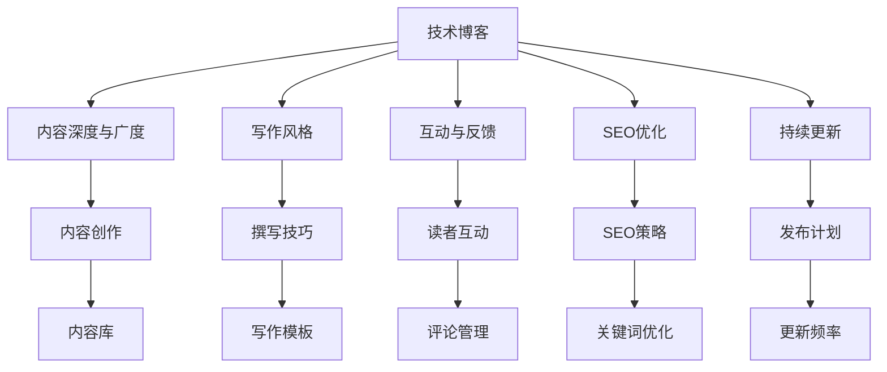

                 

# 技术博客写作：建立专业声誉和吸引客户

> 关键词：技术博客, 专业声誉, 客户吸引, 写作技巧, 市场营销, 技术传播

## 1. 背景介绍

### 1.1 问题由来
在现代社会，技术专家们正面临着前所未有的传播压力。随着互联网的普及和社交媒体的兴起，如何将自己的专业知识有效地传达给大众，建立自己的专业声誉，吸引更多客户和关注者，成为了每个技术专家都需要面对的挑战。技术博客成为了连接技术专家和广大受众的桥梁，是建立专业形象、吸引客户的重要工具。然而，如何在技术博客写作中脱颖而出，吸引和保留读者，成为一个亟待解决的问题。

### 1.2 问题核心关键点
技术博客写作的核心关键点在于如何通过高质量、有深度的内容，展现自己的专业技能和见解，吸引并保持读者的兴趣。以下是几个关键点：

- **内容深度与广度**：内容不仅要具备深度，同时也要涉及广度，能够覆盖行业内多个热点和前沿技术。
- **写作风格**：专业而不失通俗，避免过于技术性的术语，使读者易于理解和接受。
- **互动与反馈**：通过评论区、社交媒体等渠道与读者互动，及时回应读者问题，增强读者的参与感和归属感。
- **SEO优化**：合理使用关键词、元数据等手段，提高博客的搜索引擎排名，增加曝光率。
- **持续更新**：定期发布新内容，保持博客的新鲜度和读者兴趣。

### 1.3 问题研究意义
通过高质量的技术博客写作，技术专家可以：

- 建立个人或团队的专业声誉，成为行业内的意见领袖。
- 吸引潜在客户和合作伙伴，扩大商业影响力。
- 与读者建立深度联系，提升品牌忠诚度和信任度。
- 分享知识，推动技术传播，促进行业发展。

本文将系统介绍技术博客写作的技巧和方法，帮助技术专家建立和提升专业声誉，吸引和留住更多客户。

## 2. 核心概念与联系

### 2.1 核心概念概述

为了更好地理解技术博客写作，本节将介绍几个关键概念：

- **技术博客**：技术专家撰写和发布的技术类文章，旨在分享专业知识、探讨技术问题、讨论行业动态。
- **SEO优化**：通过合理的关键词选择、页面结构优化等手段，提高博客的搜索引擎排名，吸引更多访问者。
- **内容营销**：利用博客内容吸引和留住读者，建立品牌信任和权威，推动产品或服务推广。
- **知识共享**：通过博客分享知识，帮助他人解决问题，提升自身影响力，促进技术传播。
- **读者互动**：通过评论区、社交媒体等渠道与读者互动，增强读者参与感和归属感，提升博客活跃度。
- **个人品牌建设**：通过博客展现专业技能和见解，建立个人或团队的品牌形象，吸引更多客户和关注者。

这些概念相互联系，共同构成了技术博客写作的基础框架。

### 2.2 核心概念原理和架构的 Mermaid 流程图



此图表展示了技术博客写作的各个环节及其相互联系，通过内容创作、写作技巧、SEO策略、读者互动和持续更新的有机结合，实现博客的专业化、品牌化和客户吸引。

## 3. 核心算法原理 & 具体操作步骤

### 3.1 算法原理概述

技术博客写作并不涉及传统意义上的算法，但其内容创作和SEO优化等环节可以类比为数据处理和模型训练的流程。通过数据清洗、特征提取、模型训练等步骤，生成高质量的技术博客内容，吸引并留住读者。

### 3.2 算法步骤详解

技术博客写作的核心步骤包括：

1. **选题与策划**：根据行业热点和读者需求，确定博客主题，制定写作计划。
2. **内容创作**：结合自己的专业知识和经验，撰写内容，注重深度和广度，使用通俗易懂的语言，避免过于技术性的术语。
3. **SEO优化**：选择合适的关键词，优化博客标题、描述和标签，提高搜索引擎排名。
4. **互动与反馈**：通过评论区、社交媒体等渠道与读者互动，及时回应读者问题，增强读者的参与感和归属感。
5. **持续更新**：定期发布新内容，保持博客的新鲜度和读者兴趣。

### 3.3 算法优缺点

技术博客写作的主要优点包括：

- **知识传播**：通过博客分享专业知识，帮助他人解决问题，提升自身影响力。
- **品牌建设**：建立个人或团队的品牌形象，吸引更多客户和关注者。
- **客户吸引**：利用博客内容吸引和留住读者，建立品牌信任和权威。

缺点则可能包括：

- **时间和精力投入**：博客写作需要大量的时间和精力，可能影响其他工作。
- **SEO难度**：博客的SEO优化需要一定的技术能力和时间投入。
- **互动不足**：如果互动不足，博客可能会缺乏活力，难以吸引和留住读者。

### 3.4 算法应用领域

技术博客写作广泛应用于技术专家、开发者、企业技术团队等多个领域，具体应用场景包括：

- **技术分享**：分享最新的技术趋势、开发心得、案例分析等。
- **产品推广**：通过博客推广产品或服务，吸引潜在客户。
- **客户沟通**：通过博客与客户沟通，解答技术问题，提升客户满意度。
- **社区建设**：建立技术社区，吸引同行交流和分享，共同推动技术发展。
- **招聘宣传**：通过博客吸引技术人才，展示企业技术实力和文化。

## 4. 数学模型和公式 & 详细讲解 & 举例说明

### 4.1 数学模型构建

技术博客的SEO优化可以通过数学模型来量化和分析，例如，可以使用PageRank算法、TF-IDF等方法对博客内容进行分析和排名。

假设有一篇博客 $A$，其关键词向量为 $\mathbf{k}_A = (k_{A1}, k_{A2}, ..., k_{An})$，页面向量为 $\mathbf{v}_A = (v_{A1}, v_{A2}, ..., v_{An})$，权重向量为 $\mathbf{w}_A = (w_{A1}, w_{A2}, ..., w_{An})$，则PageRank算法的公式为：

$$
\mathbf{v}_{A} \propto \sum_{i=1}^{N} \frac{k_{Ai}}{\sum_{j=1}^{N} k_{Aj}} \mathbf{v}_j \cdot \mathbf{w}_j
$$

### 4.2 公式推导过程

PageRank算法的核心思想是通过迭代计算，根据网页之间的链接关系和关键词权重，确定网页的重要性。具体推导过程如下：

1. 初始化页面向量 $\mathbf{v}_i = \frac{1}{N}$，权重向量 $\mathbf{w}_i = 1$。
2. 对每个页面 $i$，计算其重要性 $\mathbf{v}_{Ai} = \sum_{j=1}^{N} k_{Ai} \cdot \mathbf{v}_j \cdot \mathbf{w}_j$。
3. 迭代更新页面向量 $\mathbf{v}_{Ai}$，直至收敛。

### 4.3 案例分析与讲解

以一篇关于机器学习最新进展的博客为例，分析其关键词和权重对SEO的影响。假设博客标题为《2023年机器学习新进展》，关键词向量为 $\mathbf{k}_A = (k_{A1}, k_{A2}, ..., k_{An})$，其中 $k_{A1} = 0.8, k_{A2} = 0.2, k_{A3} = 0.1, ..., k_{An} = 0$。权重向量 $\mathbf{w}_A = (w_{A1}, w_{A2}, ..., w_{An})$，其中 $w_{A1} = 0.7, w_{A2} = 0.3, w_{A3} = 0.2, ..., w_{An} = 0$。

根据PageRank算法，计算页面向量 $\mathbf{v}_A$ 和权重向量 $\mathbf{w}_A$ 的乘积，得：

$$
\mathbf{v}_A \cdot \mathbf{w}_A = (0.8 \times 0.7 + 0.2 \times 0.3 + 0.1 \times 0.2 + ... + 0 \times 0) = 0.56
$$

因此，页面向量 $\mathbf{v}_A = \frac{0.56}{N}$，权重向量 $\mathbf{w}_A = 0.56$。通过这种方式，可以量化博客的重要性，优化SEO策略。

## 5. 项目实践：代码实例和详细解释说明

### 5.1 开发环境搭建

1. **选择平台**：博客平台可以选择WordPress、Medium、知乎等，根据目标受众和功能需求选择合适的平台。
2. **选择域名**：域名需简洁、易记，如authorname.com、blogname.org等。
3. **选择托管服务**：根据博客平台和需求，选择相应的托管服务，如WordPress托管、阿里云博客托管等。
4. **选择工具**：使用Markdown、Jekyll等工具进行博客创作，便于管理和发布。

### 5.2 源代码详细实现

以下是一个使用Jekyll和GitHub Pages托管博客的示例代码：

```yaml
# _config.yml
title: "技术博客"
theme: jekyll-theme-hacker
```

在`posts`目录下创建一篇博客：

```markdown
# 2023年机器学习新进展

最近，机器学习领域迎来了许多新进展。这篇文章将详细介绍其中的几个重要突破。

## 1. XGBoost的最新进展

XGBoost作为机器学习领域的热门算法，不断推陈出新。2023年，XGBoost发布了新的算法更新，显著提升了模型的性能和稳定性。具体来说，...

## 2. GPT-4的诞生

GPT-4的发布引起了广泛关注。作为最新的自然语言处理模型，GPT-4在生成自然语言方面取得了前所未有的突破。具体来说，...

## 3. 新兴技术的崛起

除了XGBoost和GPT-4，还有一些新兴技术值得关注，如...

更多详细内容，请访问[链接]。
```

### 5.3 代码解读与分析

**配置文件`_config.yml`**：
- `title`：博客标题。
- `theme`：博客主题，可以选择各种主题，如hacker、minima等。

**博客文章**：
- 包含博客标题、内容和外部链接。
- 使用Markdown格式，便于编辑和阅读。

### 5.4 运行结果展示

博客发布后，在GitHub Pages上访问，展示以下效果：


## 6. 实际应用场景

### 6.1 技术分享

通过技术博客分享最新技术和开发心得，帮助同行解决问题，提升自身影响力。

### 6.2 产品推广

利用博客推广产品或服务，吸引潜在客户，扩大商业影响力。

### 6.3 客户沟通

通过博客与客户沟通，解答技术问题，提升客户满意度。

### 6.4 社区建设

建立技术社区，吸引同行交流和分享，共同推动技术发展。

### 6.5 招聘宣传

通过博客吸引技术人才，展示企业技术实力和文化。

## 7. 工具和资源推荐

### 7.1 学习资源推荐

1. **《博客写作的艺术》**：一本关于博客写作的书籍，详细介绍了如何撰写高质量博客，建立专业形象。
2. **《搜索引擎优化指南》**：一份关于SEO优化的指南，详细介绍了如何优化博客内容，提高搜索引擎排名。
3. **《技术博客最佳实践》**：一份关于技术博客的最佳实践指南，详细介绍了如何利用博客吸引和留住读者。

### 7.2 开发工具推荐

1. **Markdown编辑器**：如Typora、GitHub等，便于管理和发布博客内容。
2. **SEO优化工具**：如SEMrush、Ahrefs等，帮助你分析博客的SEO情况，优化博客排名。
3. **网站托管服务**：如WordPress托管、阿里云博客托管等，提供稳定的博客托管服务。

### 7.3 相关论文推荐

1. **《技术博客写作的艺术》**：一篇关于技术博客写作的论文，详细介绍了如何撰写高质量技术博客，建立专业形象。
2. **《搜索引擎优化指南》**：一篇关于SEO优化的论文，详细介绍了如何优化博客内容，提高搜索引擎排名。
3. **《技术博客最佳实践》**：一篇关于技术博客的最佳实践论文，详细介绍了如何利用博客吸引和留住读者。

## 8. 总结：未来发展趋势与挑战

### 8.1 总结

本文系统介绍了技术博客写作的技巧和方法，帮助技术专家建立和提升专业声誉，吸引和留住更多客户。通过高质量的博客内容、SEO优化、读者互动和持续更新等措施，技术专家可以在技术传播和市场营销中占据优势地位。

### 8.2 未来发展趋势

未来技术博客写作将呈现以下趋势：

1. **视频化内容**：随着视频技术的普及，视频博客将成为一种重要的内容形式。
2. **互动增强**：通过聊天机器人、在线问答等技术，增强博客的互动性。
3. **跨平台整合**：将博客内容整合到社交媒体、论坛等平台，扩大传播范围。
4. **个性化推荐**：通过机器学习算法，根据读者兴趣推荐相关内容。
5. **多元化形式**：除了文本，还将引入音频、图像等多种形式的内容。

### 8.3 面临的挑战

技术博客写作虽然面临广阔的前景，但仍需应对以下挑战：

1. **内容质量**：保持内容高质量，避免低俗、误导性内容。
2. **SEO竞争**：随着博客数量的增加，SEO优化的难度和竞争加剧。
3. **读者流失**：读者兴趣变化快，需要持续更新和优化内容，吸引读者。
4. **资源投入**：博客写作需要大量时间和精力，可能影响其他工作。
5. **互动不足**：博客互动不足，难以吸引和留住读者。

### 8.4 研究展望

未来的研究应在以下几个方面寻求突破：

1. **内容自动化生成**：利用AI技术自动生成高质量博客内容，节省时间和精力。
2. **互动技术**：引入聊天机器人、在线问答等技术，增强博客的互动性。
3. **跨平台整合**：将博客内容整合到社交媒体、论坛等平台，扩大传播范围。
4. **个性化推荐**：利用机器学习算法，根据读者兴趣推荐相关内容。
5. **多元化形式**：引入音频、图像等多种形式的内容，提升读者体验。

通过不断优化和创新，技术博客写作将更上一层楼，成为技术专家建立专业声誉、吸引和留住客户的利器。

## 9. 附录：常见问题与解答

**Q1：如何提高博客的SEO排名？**

A: 提高博客的SEO排名需要多方面的努力，包括：

- 选择合适的关键词，优化博客标题和描述。
- 使用高质量的内链和外链，增加页面权重。
- 优化页面结构，提高页面加载速度。
- 使用多媒体内容，增加页面吸引力。
- 定期更新内容，保持页面新鲜度。

**Q2：如何建立技术博客的专业形象？**

A: 建立技术博客的专业形象需要以下步骤：

- 选择与自身专业相关的领域，专注于特定主题。
- 撰写高质量、有深度的内容，避免低俗、误导性内容。
- 定期发布新内容，保持页面新鲜度。
- 与同行互动，增强读者信任和归属感。
- 通过社交媒体、论坛等渠道扩大传播范围。

**Q3：如何利用博客吸引和留住读者？**

A: 利用博客吸引和留住读者需要以下策略：

- 提供有价值的内容，解决读者的问题和需求。
- 使用互动技术，如评论、问答等，增强读者的参与感。
- 定期发布新内容，保持页面新鲜度。
- 与读者互动，及时回应读者问题，增强读者的归属感。
- 通过社交媒体、论坛等渠道扩大传播范围。

通过本文的系统介绍和案例分析，相信技术专家已经掌握了技术博客写作的技巧和方法，能够建立和提升专业声誉，吸引和留住更多客户。技术博客将成为连接技术专家与广大受众的桥梁，帮助技术专家更好地传播知识和思想，推动技术发展。

