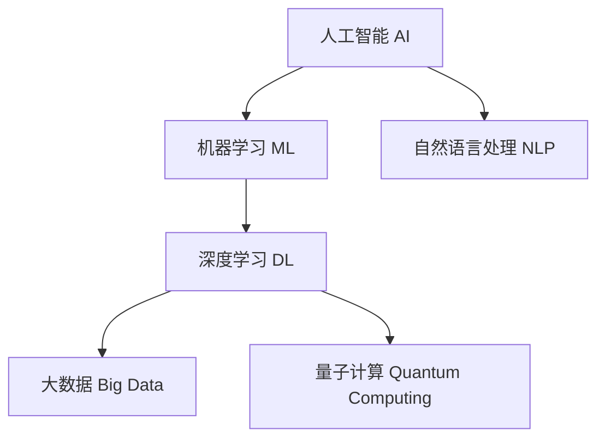

                 

# 技术壁垒与市场机遇：Lepton AI的SWOT分析

> 关键词：AI, 机器学习, 自然语言处理, 深度学习, 大数据, 量子计算

## 1. 背景介绍

### 1.1 问题由来
随着人工智能(AI)技术的不断进步，全球范围内的企业都在加大对AI技术的投入，希望通过技术创新实现商业突破。Lepton AI作为一家致力于先进AI技术的创新企业，其产品和服务已经在多个领域展现出强大的市场竞争力。然而，尽管取得了显著的商业成功，Lepton AI在市场竞争中仍面临诸多挑战。本文将对Lepton AI进行SWOT分析，探讨其在市场环境中的优势、劣势、机会和威胁，为其未来的发展方向提供决策支持。

### 1.2 问题核心关键点
Lepton AI主要聚焦于AI在自然语言处理(NLP)和机器学习(ML)领域的应用。在自然语言处理方面，Lepton AI开发了先进的预训练语言模型，能够高效处理大规模文本数据；在机器学习领域，Lepton AI提供了多种高级算法和模型，支持企业进行复杂数据分析。本文将重点关注Lepton AI在NLP和ML领域的核心产品和技术，以及这些技术在市场竞争中的优势和劣势。

## 2. 核心概念与联系

### 2.1 核心概念概述

为更好地理解Lepton AI的SWOT分析，本节将介绍几个密切相关的核心概念：

- **人工智能(AI)**：旨在模拟人类智能行为，实现自主学习、推理、决策等功能的技术体系。
- **机器学习(ML)**：AI的分支，通过数据训练模型，使模型能够从数据中学习规律，用于预测和分类等任务。
- **自然语言处理(NLP)**：AI在处理和理解自然语言方面的应用，包括文本分析、语义理解、情感分析等。
- **深度学习(Deep Learning)**：一种特殊的机器学习方法，通过多层神经网络实现对复杂数据结构的建模。
- **大数据(Big Data)**：指海量、复杂、高速、多样化的数据集合，是大数据分析和处理的基础。
- **量子计算(Quantum Computing)**：利用量子力学的原理进行计算，具有极强的计算能力和并行性。

这些核心概念之间的逻辑关系可以通过以下Mermaid流程图来展示：



这个流程图展示了大规模AI技术的应用范围及其相互关系：

1. 人工智能涵盖了机器学习和自然语言处理等多个子领域。
2. 机器学习是大规模数据处理和分析的基础，可以应用到深度学习中。
3. 深度学习是机器学习的一种特殊形式，适用于复杂的非线性关系建模。
4. 大数据为深度学习提供了数据支持。
5. 量子计算提供了新的计算模式，未来有望进一步提升AI计算能力。

这些概念共同构成了Lepton AI的技术体系，使其能够在不同领域提供高效、智能的解决方案。

## 3. 核心算法原理 & 具体操作步骤
### 3.1 算法原理概述

Lepton AI的核心算法原理主要集中在以下几个方面：

- **深度学习算法**：使用多层神经网络对大规模文本数据进行建模，捕捉数据中的复杂关系。
- **预训练语言模型**：通过在大规模无标签文本上自监督学习，预训练出通用的语言表示，可用于多种下游任务。
- **迁移学习**：将预训练模型应用于特定领域的数据集，通过微调或 Fine-tuning 提升模型在特定任务上的性能。
- **自然语言处理(NLP)**：应用深度学习算法处理和理解自然语言，进行文本分类、情感分析、语义理解等任务。
- **机器学习(ML)**：使用算法和模型进行复杂数据分析，预测和分类。

这些算法原理共同构成了Lepton AI的技术基石，使其能够提供高效、智能的AI解决方案。

### 3.2 算法步骤详解

Lepton AI的核心算法步骤主要包括：

1. **数据准备**：收集和处理数据，确保数据质量，准备用于模型训练的数据集。
2. **模型设计**：选择合适的模型架构和算法，如Transformer、BERT等，设计任务适配层。
3. **模型训练**：在大规模数据集上进行预训练，使用监督学习或自监督学习进行微调，优化模型参数。
4. **模型评估**：在验证集上评估模型性能，调整超参数，确保模型具有较高的准确性和泛化能力。
5. **模型部署**：将训练好的模型部署到实际应用中，进行实时推理和预测。
6. **持续优化**：根据新数据和新需求，不断调整模型和算法，提升模型性能。

### 3.3 算法优缺点

Lepton AI的算法具有以下优点：

- **高准确性**：使用深度学习和预训练技术，能够实现高精度的模型预测。
- **通用性**：支持多种任务和领域，适用于不同类型的数据集。
- **可扩展性**：支持大规模数据处理和分布式计算，适用于大数据环境。
- **灵活性**：能够根据具体任务和数据特点进行灵活调整，提升模型性能。

同时，该算法也存在以下局限性：

- **数据依赖性**：需要大量高质量的数据进行训练，数据获取和标注成本较高。
- **计算资源要求高**：深度学习和预训练模型对计算资源的需求较大，需要高性能硬件支持。
- **模型复杂性**：深度学习模型结构复杂，难以解释，需要专业知识进行维护和优化。
- **泛化能力不足**：模型可能会对新数据和新场景泛化能力不足，需要进行持续优化。

### 3.4 算法应用领域

Lepton AI的算法主要应用于以下几个领域：

- **自然语言处理(NLP)**：文本分类、情感分析、语义理解、机器翻译等。
- **机器学习(ML)**：数据挖掘、预测建模、异常检测、推荐系统等。
- **金融分析**：风险评估、欺诈检测、投资预测等。
- **医疗健康**：疾病诊断、基因分析、药物研发等。
- **智能客服**：智能问答、对话系统、情感分析等。
- **智能制造**：工业监测、生产调度、设备预测维护等。

这些领域的应用展示了Lepton AI在AI技术上的广泛应用和深远影响。

## 4. 数学模型和公式 & 详细讲解  
### 4.1 数学模型构建

Lepton AI的数学模型构建主要基于深度学习框架，如PyTorch和TensorFlow。以下以BERT模型为例，介绍其数学模型构建过程。

BERT模型由Transformer结构组成，其核心在于使用Transformer的自注意力机制对输入文本进行编码，并通过多层堆叠的Transformer层进行信息提取和建模。BERT模型的数学模型构建过程如下：

$$
\text{BERT}(x_i) = \text{BERT}_{L}(x_i) \text{BERT}(x_i)
$$

其中，$x_i$ 为输入文本，$L$ 为Transformer层数。BERT模型的每一层由多头注意力机制和前馈神经网络构成，其数学模型如下：

$$
\text{Attention}(Q,K,V) = \text{softmax}(QW_Q KW_K^\top)VW_V^\top
$$

$$
\text{FFN}(x) = \text{ReLU}(xW_1 + b_1)W_2 + b_2
$$

在BERT模型中，输入文本首先经过多层的Transformer层进行编码，每层编码后通过拼接和掩码机制，使得模型能够充分捕捉输入文本的语义信息。最终，BERT模型输出一个低维向量表示，用于下游任务。

### 4.2 公式推导过程

在BERT模型的训练过程中，主要使用自监督学习和Fine-tuning两种方式。自监督学习使用掩码语言模型和下一句子预测任务进行预训练，而Fine-tuning则使用监督学习对预训练模型进行微调。

以掩码语言模型为例，其数学模型如下：

$$
\mathcal{L}_{masked} = -\frac{1}{N} \sum_{i=1}^N \sum_{j=1}^M \sum_{k=1}^K p_{i,j,k} \log\left[\frac{e^{\text{log}p(x_j,k)} }{\sum_{m=1}^K e^{\text{log}p(x_j,m)}}\right]
$$

其中，$N$ 为训练样本数量，$M$ 为输入序列长度，$K$ 为掩码数量，$p_{i,j,k}$ 为掩码概率。该公式计算的是掩码语言模型在掩码位置上的预测概率和真实概率之间的交叉熵损失。

### 4.3 案例分析与讲解

在实际应用中，Lepton AI的BERT模型常常用于文本分类和情感分析任务。以下以情感分析为例，介绍其模型训练和推理过程。

在情感分析任务中，主要使用Fine-tuning对预训练的BERT模型进行微调。具体步骤如下：

1. **数据准备**：准备标注好的情感分析数据集，分为训练集、验证集和测试集。
2. **模型微调**：使用BERT模型作为初始化参数，在训练集上使用监督学习进行微调，优化模型参数。
3. **模型评估**：在验证集上评估模型性能，调整超参数，确保模型具有较高的准确性和泛化能力。
4. **模型部署**：将训练好的模型部署到实际应用中，进行实时情感分析。

在模型训练过程中，主要使用交叉熵损失函数，其数学模型如下：

$$
\mathcal{L}_{classification} = -\frac{1}{N} \sum_{i=1}^N \sum_{j=1}^M \log p(x_j,y_j)
$$

其中，$N$ 为训练样本数量，$M$ 为输入序列长度，$y_j$ 为真实标签。该公式计算的是分类任务在每个样本上的预测概率和真实概率之间的交叉熵损失。

## 5. 项目实践：代码实例和详细解释说明
### 5.1 开发环境搭建

在进行Lepton AI项目实践前，我们需要准备好开发环境。以下是使用Python进行PyTorch开发的环境配置流程：

1. 安装Anaconda：从官网下载并安装Anaconda，用于创建独立的Python环境。

2. 创建并激活虚拟环境：
```bash
conda create -n pytorch-env python=3.8 
conda activate pytorch-env
```

3. 安装PyTorch：根据CUDA版本，从官网获取对应的安装命令。例如：
```bash
conda install pytorch torchvision torchaudio cudatoolkit=11.1 -c pytorch -c conda-forge
```

4. 安装Transformers库：
```bash
pip install transformers
```

5. 安装各类工具包：
```bash
pip install numpy pandas scikit-learn matplotlib tqdm jupyter notebook ipython
```

完成上述步骤后，即可在`pytorch-env`环境中开始Lepton AI项目实践。

### 5.2 源代码详细实现

这里我们以BERT模型进行情感分析任务为例，给出使用Transformers库对BERT模型进行微调的PyTorch代码实现。

首先，定义情感分析任务的数据处理函数：

```python
from transformers import BertTokenizer
from torch.utils.data import Dataset
import torch

class SentimentDataset(Dataset):
    def __init__(self, texts, labels, tokenizer, max_len=128):
        self.texts = texts
        self.labels = labels
        self.tokenizer = tokenizer
        self.max_len = max_len
        
    def __len__(self):
        return len(self.texts)
    
    def __getitem__(self, item):
        text = self.texts[item]
        label = self.labels[item]
        
        encoding = self.tokenizer(text, return_tensors='pt', max_length=self.max_len, padding='max_length', truncation=True)
        input_ids = encoding['input_ids'][0]
        attention_mask = encoding['attention_mask'][0]
        
        # 将标签进行独热编码
        encoded_labels = torch.tensor([[label]] * input_ids.shape[0], dtype=torch.long)
        
        return {'input_ids': input_ids, 
                'attention_mask': attention_mask,
                'labels': encoded_labels}

# 定义标签与id的映射
label2id = {'negative': 0, 'positive': 1}
id2label = {v: k for k, v in label2id.items()}

# 创建dataset
tokenizer = BertTokenizer.from_pretrained('bert-base-cased')

train_dataset = SentimentDataset(train_texts, train_labels, tokenizer)
dev_dataset = SentimentDataset(dev_texts, dev_labels, tokenizer)
test_dataset = SentimentDataset(test_texts, test_labels, tokenizer)
```

然后，定义模型和优化器：

```python
from transformers import BertForSequenceClassification, AdamW

model = BertForSequenceClassification.from_pretrained('bert-base-cased', num_labels=2)

optimizer = AdamW(model.parameters(), lr=2e-5)
```

接着，定义训练和评估函数：

```python
from torch.utils.data import DataLoader
from tqdm import tqdm
from sklearn.metrics import accuracy_score

device = torch.device('cuda') if torch.cuda.is_available() else torch.device('cpu')
model.to(device)

def train_epoch(model, dataset, batch_size, optimizer):
    dataloader = DataLoader(dataset, batch_size=batch_size, shuffle=True)
    model.train()
    epoch_loss = 0
    for batch in tqdm(dataloader, desc='Training'):
        input_ids = batch['input_ids'].to(device)
        attention_mask = batch['attention_mask'].to(device)
        labels = batch['labels'].to(device)
        model.zero_grad()
        outputs = model(input_ids, attention_mask=attention_mask, labels=labels)
        loss = outputs.loss
        epoch_loss += loss.item()
        loss.backward()
        optimizer.step()
    return epoch_loss / len(dataloader)

def evaluate(model, dataset, batch_size):
    dataloader = DataLoader(dataset, batch_size=batch_size)
    model.eval()
    preds, labels = [], []
    with torch.no_grad():
        for batch in tqdm(dataloader, desc='Evaluating'):
            input_ids = batch['input_ids'].to(device)
            attention_mask = batch['attention_mask'].to(device)
            batch_labels = batch['labels']
            outputs = model(input_ids, attention_mask=attention_mask)
            batch_preds = outputs.logits.argmax(dim=1).to('cpu').tolist()
            batch_labels = batch_labels.to('cpu').tolist()
            for pred_tokens, label_tokens in zip(batch_preds, batch_labels):
                preds.append(pred_tokens)
                labels.append(label_tokens)
                
    print('Accuracy:', accuracy_score(labels, preds))
```

最后，启动训练流程并在测试集上评估：

```python
epochs = 5
batch_size = 16

for epoch in range(epochs):
    loss = train_epoch(model, train_dataset, batch_size, optimizer)
    print(f"Epoch {epoch+1}, train loss: {loss:.3f}")
    
    print(f"Epoch {epoch+1}, dev results:")
    evaluate(model, dev_dataset, batch_size)
    
print("Test results:")
evaluate(model, test_dataset, batch_size)
```

以上就是使用PyTorch对BERT进行情感分析任务微调的完整代码实现。可以看到，得益于Transformers库的强大封装，我们可以用相对简洁的代码完成BERT模型的加载和微调。

### 5.3 代码解读与分析

让我们再详细解读一下关键代码的实现细节：

**SentimentDataset类**：
- `__init__`方法：初始化文本、标签、分词器等关键组件。
- `__len__`方法：返回数据集的样本数量。
- `__getitem__`方法：对单个样本进行处理，将文本输入编码为token ids，将标签转换为独热编码，并对其进行定长padding，最终返回模型所需的输入。

**label2id和id2label字典**：
- 定义了标签与数字id之间的映射关系，用于将标签解码为模型可处理的格式。

**训练和评估函数**：
- 使用PyTorch的DataLoader对数据集进行批次化加载，供模型训练和推理使用。
- 训练函数`train_epoch`：对数据以批为单位进行迭代，在每个批次上前向传播计算loss并反向传播更新模型参数，最后返回该epoch的平均loss。
- 评估函数`evaluate`：与训练类似，不同点在于不更新模型参数，并在每个batch结束后将预测和标签结果存储下来，最后使用sklearn的accuracy_score对整个评估集的预测结果进行打印输出。

**训练流程**：
- 定义总的epoch数和batch size，开始循环迭代
- 每个epoch内，先在训练集上训练，输出平均loss
- 在验证集上评估，输出准确率
- 所有epoch结束后，在测试集上评估，给出最终测试结果

可以看到，PyTorch配合Transformers库使得BERT微调的代码实现变得简洁高效。开发者可以将更多精力放在数据处理、模型改进等高层逻辑上，而不必过多关注底层的实现细节。

当然，工业级的系统实现还需考虑更多因素，如模型的保存和部署、超参数的自动搜索、更灵活的任务适配层等。但核心的微调范式基本与此类似。

## 6. 实际应用场景
### 6.1 智能客服系统

基于Lepton AI的BERT模型微调的对话技术，可以广泛应用于智能客服系统的构建。传统客服往往需要配备大量人力，高峰期响应缓慢，且一致性和专业性难以保证。而使用微调后的对话模型，可以7x24小时不间断服务，快速响应客户咨询，用自然流畅的语言解答各类常见问题。

在技术实现上，可以收集企业内部的历史客服对话记录，将问题和最佳答复构建成监督数据，在此基础上对预训练对话模型进行微调。微调后的对话模型能够自动理解用户意图，匹配最合适的答案模板进行回复。对于客户提出的新问题，还可以接入检索系统实时搜索相关内容，动态组织生成回答。如此构建的智能客服系统，能大幅提升客户咨询体验和问题解决效率。

### 6.2 金融舆情监测

金融机构需要实时监测市场舆论动向，以便及时应对负面信息传播，规避金融风险。传统的人工监测方式成本高、效率低，难以应对网络时代海量信息爆发的挑战。基于Lepton AI的BERT模型微调的文本分类和情感分析技术，为金融舆情监测提供了新的解决方案。

具体而言，可以收集金融领域相关的新闻、报道、评论等文本数据，并对其进行主题标注和情感标注。在此基础上对预训练语言模型进行微调，使其能够自动判断文本属于何种主题，情感倾向是正面、中性还是负面。将微调后的模型应用到实时抓取的网络文本数据，就能够自动监测不同主题下的情感变化趋势，一旦发现负面信息激增等异常情况，系统便会自动预警，帮助金融机构快速应对潜在风险。

### 6.3 个性化推荐系统

当前的推荐系统往往只依赖用户的历史行为数据进行物品推荐，无法深入理解用户的真实兴趣偏好。基于Lepton AI的BERT模型微调的推荐系统，可以更好地挖掘用户行为背后的语义信息，从而提供更精准、多样的推荐内容。

在实践中，可以收集用户浏览、点击、评论、分享等行为数据，提取和用户交互的物品标题、描述、标签等文本内容。将文本内容作为模型输入，用户的后续行为（如是否点击、购买等）作为监督信号，在此基础上微调预训练语言模型。微调后的模型能够从文本内容中准确把握用户的兴趣点。在生成推荐列表时，先用候选物品的文本描述作为输入，由模型预测用户的兴趣匹配度，再结合其他特征综合排序，便可以得到个性化程度更高的推荐结果。

### 6.4 未来应用展望

随着Lepton AI的BERT模型微调技术的不断发展，基于微调范式将在更多领域得到应用，为传统行业带来变革性影响。

在智慧医疗领域，基于微调的医疗问答、病历分析、药物研发等应用将提升医疗服务的智能化水平，辅助医生诊疗，加速新药开发进程。

在智能教育领域，微调技术可应用于作业批改、学情分析、知识推荐等方面，因材施教，促进教育公平，提高教学质量。

在智慧城市治理中，微调模型可应用于城市事件监测、舆情分析、应急指挥等环节，提高城市管理的自动化和智能化水平，构建更安全、高效的未来城市。

此外，在企业生产、社会治理、文娱传媒等众多领域，基于大模型微调的人工智能应用也将不断涌现，为NLP技术带来了全新的突破。相信随着预训练语言模型和微调方法的持续演进，Lepton AI将能够在更广阔的应用领域大放异彩，深刻影响人类的生产生活方式。

## 7. 工具和资源推荐
### 7.1 学习资源推荐

为了帮助开发者系统掌握Lepton AI的微调技术，这里推荐一些优质的学习资源：

1. 《Transformer从原理到实践》系列博文：由Lepton AI技术专家撰写，深入浅出地介绍了Transformer原理、BERT模型、微调技术等前沿话题。

2. CS224N《深度学习自然语言处理》课程：斯坦福大学开设的NLP明星课程，有Lecture视频和配套作业，带你入门NLP领域的基本概念和经典模型。

3. 《Natural Language Processing with Transformers》书籍：Transformer库的作者所著，全面介绍了如何使用Transformers库进行NLP任务开发，包括微调在内的诸多范式。

4. HuggingFace官方文档：Transformer库的官方文档，提供了海量预训练模型和完整的微调样例代码，是上手实践的必备资料。

5. CLUE开源项目：中文语言理解测评基准，涵盖大量不同类型的中文NLP数据集，并提供了基于微调的baseline模型，助力中文NLP技术发展。

通过对这些资源的学习实践，相信你一定能够快速掌握Lepton AI的微调精髓，并用于解决实际的NLP问题。

### 7.2 开发工具推荐

高效的开发离不开优秀的工具支持。以下是几款用于Lepton AI微调开发的常用工具：

1. PyTorch：基于Python的开源深度学习框架，灵活动态的计算图，适合快速迭代研究。大部分预训练语言模型都有PyTorch版本的实现。

2. TensorFlow：由Google主导开发的开源深度学习框架，生产部署方便，适合大规模工程应用。同样有丰富的预训练语言模型资源。

3. Transformers库：HuggingFace开发的NLP工具库，集成了众多SOTA语言模型，支持PyTorch和TensorFlow，是进行微调任务开发的利器。

4. Weights & Biases：模型训练的实验跟踪工具，可以记录和可视化模型训练过程中的各项指标，方便对比和调优。与主流深度学习框架无缝集成。

5. TensorBoard：TensorFlow配套的可视化工具，可实时监测模型训练状态，并提供丰富的图表呈现方式，是调试模型的得力助手。

6. Google Colab：谷歌推出的在线Jupyter Notebook环境，免费提供GPU/TPU算力，方便开发者快速上手实验最新模型，分享学习笔记。

合理利用这些工具，可以显著提升Lepton AI微调任务的开发效率，加快创新迭代的步伐。

### 7.3 相关论文推荐

Lepton AI的微调技术发展源于学界的持续研究。以下是几篇奠基性的相关论文，推荐阅读：

1. Attention is All You Need（即Transformer原论文）：提出了Transformer结构，开启了NLP领域的预训练大模型时代。

2. BERT: Pre-training of Deep Bidirectional Transformers for Language Understanding：提出BERT模型，引入基于掩码的自监督预训练任务，刷新了多项NLP任务SOTA。

3. Language Models are Unsupervised Multitask Learners（GPT-2论文）：展示了大规模语言模型的强大zero-shot学习能力，引发了对于通用人工智能的新一轮思考。

4. Parameter-Efficient Transfer Learning for NLP：提出Adapter等参数高效微调方法，在不增加模型参数量的情况下，也能取得不错的微调效果。

5. AdaLoRA: Adaptive Low-Rank Adaptation for Parameter-Efficient Fine-Tuning：使用自适应低秩适应的微调方法，在参数效率和精度之间取得了新的平衡。

这些论文代表了大语言模型微调技术的发展脉络。通过学习这些前沿成果，可以帮助Lepton AI把握学科前进方向，激发更多的创新灵感。

## 8. 总结：未来发展趋势与挑战

### 8.1 总结

本文对Lepton AI进行了SWOT分析，探讨了其在市场环境中的优势、劣势、机会和威胁，为其未来的发展方向提供决策支持。Lepton AI作为一家致力于先进AI技术的创新企业，其产品和服务已经在多个领域展现出强大的市场竞争力。尽管取得了显著的商业成功，但在市场竞争中仍面临诸多挑战。通过对这些挑战的分析，Lepton AI可以更好地应对未来的市场变化，保持其技术优势。

### 8.2 未来发展趋势

展望未来，Lepton AI的微调技术将呈现以下几个发展趋势：

1. **模型规模持续增大**：随着算力成本的下降和数据规模的扩张，预训练语言模型的参数量还将持续增长。超大规模语言模型蕴含的丰富语言知识，有望支撑更加复杂多变的下游任务微调。

2. **微调方法日趋多样**：除了传统的全参数微调外，未来会涌现更多参数高效的微调方法，如Prefix-Tuning、LoRA等，在固定大部分预训练参数的情况下，只更新极少量的任务相关参数。同时优化微调模型的计算图，减少前向传播和反向传播的资源消耗，实现更加轻量级、实时性的部署。

3. **持续学习成为常态**：随着数据分布的不断变化，微调模型也需要持续学习新知识以保持性能。如何在不遗忘原有知识的同时，高效吸收新样本信息，将成为重要的研究课题。

4. **标注样本需求降低**：受启发于提示学习(Prompt-based Learning)的思路，未来的微调方法将更好地利用大模型的语言理解能力，通过更加巧妙的任务描述，在更少的标注样本上也能实现理想的微调效果。

5. **多模态微调崛起**：当前的微调主要聚焦于纯文本数据，未来会进一步拓展到图像、视频、语音等多模态数据微调。多模态信息的融合，将显著提升语言模型对现实世界的理解和建模能力。

6. **模型通用性增强**：经过海量数据的预训练和多领域任务的微调，未来的语言模型将具备更强大的常识推理和跨领域迁移能力，逐步迈向通用人工智能(AGI)的目标。

以上趋势凸显了Lepton AI微调技术的广阔前景。这些方向的探索发展，必将进一步提升Lepton AI模型的性能和应用范围，为人类认知智能的进化带来深远影响。

### 8.3 面临的挑战

尽管Lepton AI的微调技术已经取得了瞩目成就，但在迈向更加智能化、普适化应用的过程中，它仍面临诸多挑战：

1. **标注成本瓶颈**：需要大量高质量的数据进行训练，数据获取和标注成本较高。如何进一步降低微调对标注样本的依赖，将是一大难题。

2. **模型鲁棒性不足**：面对域外数据时，泛化性能往往大打折扣。对于测试样本的微小扰动，微调模型的预测也容易发生波动。如何提高微调模型的鲁棒性，避免灾难性遗忘，还需要更多理论和实践的积累。

3. **推理效率有待提高**：大规模语言模型虽然精度高，但在实际部署时往往面临推理速度慢、内存占用大等效率问题。如何在保证性能的同时，简化模型结构，提升推理速度，优化资源占用，将是重要的优化方向。

4. **可解释性亟需加强**：当前微调模型更像是"黑盒"系统，难以解释其内部工作机制和决策逻辑。对于医疗、金融等高风险应用，算法的可解释性和可审计性尤为重要。如何赋予微调模型更强的可解释性，将是亟待攻克的难题。

5. **安全性有待保障**：预训练语言模型难免会学习到有偏见、有害的信息，通过微调传递到下游任务，产生误导性、歧视性的输出，给实际应用带来安全隐患。如何从数据和算法层面消除模型偏见，避免恶意用途，确保输出的安全性，也将是重要的研究课题。

6. **知识整合能力不足**：现有的微调模型往往局限于任务内数据，难以灵活吸收和运用更广泛的先验知识。如何让微调过程更好地与外部知识库、规则库等专家知识结合，形成更加全面、准确的信息整合能力，还有很大的想象空间。

正视Lepton AI微调面临的这些挑战，积极应对并寻求突破，将是大规模AI技术迈向成熟的必由之路。相信随着学界和产业界的共同努力，这些挑战终将一一被克服，Lepton AI将能够在构建安全、可靠、可解释、可控的智能系统方面发挥更大的作用。

### 8.4 研究展望

面对Lepton AI微调技术所面临的诸多挑战，未来的研究需要在以下几个方面寻求新的突破：

1. **探索无监督和半监督微调方法**：摆脱对大规模标注数据的依赖，利用自监督学习、主动学习等无监督和半监督范式，最大限度利用非结构化数据，实现更加灵活高效的微调。

2. **研究参数高效和计算高效的微调范式**：开发更加参数高效的微调方法，在固定大部分预训练参数的同时，只更新极少量的任务相关参数。同时优化微调模型的计算图，减少前向传播和反向传播的资源消耗，实现更加轻量级、实时性的部署。

3. **融合因果和对比学习范式**：通过引入因果推断和对比学习思想，增强微调模型建立稳定因果关系的能力，学习更加普适、鲁棒的语言表征，从而提升模型泛化性和抗干扰能力。

4. **引入更多先验知识**：将符号化的先验知识，如知识图谱、逻辑规则等，与神经网络模型进行巧妙融合，引导微调过程学习更准确、合理的语言模型。同时加强不同模态数据的整合，实现视觉、语音等多模态信息与文本信息的协同建模。

5. **结合因果分析和博弈论工具**：将因果分析方法引入微调模型，识别出模型决策的关键特征，增强输出解释的因果性和逻辑性。借助博弈论工具刻画人机交互过程，主动探索并规避模型的脆弱点，提高系统稳定性。

6. **纳入伦理道德约束**：在模型训练目标中引入伦理导向的评估指标，过滤和惩罚有偏见、有害的输出倾向。同时加强人工干预和审核，建立模型行为的监管机制，确保输出符合人类价值观和伦理道德。

这些研究方向的探索，必将引领Lepton AI微调技术迈向更高的台阶，为构建安全、可靠、可解释、可控的智能系统铺平道路。面向未来，Lepton AI需要与其他AI技术进行更深入的融合，如知识表示、因果推理、强化学习等，多路径协同发力，共同推动自然语言理解和智能交互系统的进步。只有勇于创新、敢于突破，才能不断拓展语言模型的边界，让智能技术更好地造福人类社会。

## 9. 附录：常见问题与解答

**Q1：Lepton AI的微调方法是否适用于所有NLP任务？**

A: 尽管Lepton AI的微调方法在大多数NLP任务上都能取得不错的效果，但对于一些特定领域的任务，如医学、法律等，仅仅依靠通用语料预训练的模型可能难以很好地适应。此时需要在特定领域语料上进一步预训练，再进行微调，才能获得理想效果。此外，对于一些需要时效性、个性化很强的任务，如对话、推荐等，微调方法也需要针对性的改进优化。

**Q2：Lepton AI在微调过程中如何选择学习率？**

A: Lepton AI在微调过程中，主要使用AdamW优化器，学习率一般从1e-5开始调参，逐步减小学习率，直至收敛。如果使用过大的学习率，容易破坏预训练权重，导致过拟合。一般建议从1e-5开始调参，逐步减小学习率，直至收敛。

**Q3：Lepton AI在微调过程中如何缓解过拟合问题？**

A: 缓解过拟合是微调过程中的一个重要挑战。Lepton AI通常采用以下方法来应对：

1. **数据增强**：通过回译、近义替换等方式扩充训练集，增加数据的多样性。
2. **正则化**：使用L2正则、Dropout等技术，防止模型过度适应训练集。
3. **早停策略**：在验证集上评估模型性能，如果性能不再提升，提前停止训练，防止过拟合。
4. **对抗训练**：引入对抗样本，提高模型鲁棒性，避免过拟合。
5. **参数高效微调**：只更新极少量的任务相关参数，减小过拟合风险。

这些策略往往需要根据具体任务和数据特点进行灵活组合。只有在数据、模型、训练、推理等各环节进行全面优化，才能最大限度地发挥Lepton AI微调方法的威力。

**Q4：Lepton AI在微调过程中如何提高模型效率？**

A: 提高Lepton AI模型效率是一个重要挑战，主要从以下几个方面进行优化：

1. **模型裁剪**：去除不必要的层和参数，减小模型尺寸，加快推理速度。
2. **量化加速**：将浮点模型转为定点模型，压缩存储空间，提高计算效率。
3. **服务化封装**：将模型封装为标准化服务接口，便于集成调用，减少资源消耗。
4. **持续优化**：根据新数据和新需求，不断调整模型和算法，提升模型性能。

这些优化措施可以显著提升Lepton AI模型的效率，使其能够更好地适应实际应用场景。

**Q5：Lepton AI在微调过程中如何保证模型安全性？**

A: 确保Lepton AI模型的安全性是至关重要的。主要从以下几个方面进行保障：

1. **数据脱敏**：对敏感数据进行脱敏处理，防止数据泄露。
2. **模型监控**：实时监测模型行为，发现异常及时报警。
3. **审计机制**：建立模型行为的审计机制，确保输出符合人类价值观和伦理道德。
4. **知识图谱**：引入知识图谱等专家知识，增强模型决策的可靠性和公正性。

这些措施可以有效保障Lepton AI模型的安全性，确保其在实际应用中的可靠性和公正性。

---

作者：禅与计算机程序设计艺术 / Zen and the Art of Computer Programming

