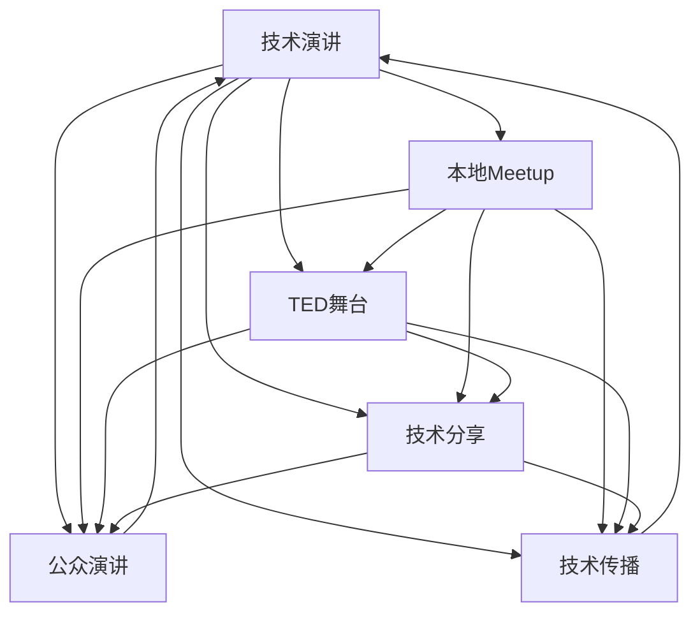

                 

# 技术演讲：从local meetup到TED舞台

> 关键词：技术演讲,从local meetup, TED舞台,技术分享,公众演讲,技术传播

## 1. 背景介绍

### 1.1 问题由来

在技术领域，从本地Meetup到TED舞台，从技术分享会到大型国际会议，技术演讲作为传播知识和启发创新的一种重要形式，一直扮演着关键角色。技术演讲不仅能够直接传达技术理念和研究成果，还能激发听众的思考和创新热情。然而，随着科技的迅猛发展，如何有效地进行技术演讲，使得技术内容能够被更广泛的受众理解和接受，成为了一个重要课题。

### 1.2 问题核心关键点

技术演讲的核心在于如何清晰地传达技术理念，启发听众创新思维。一个好的技术演讲，不仅要深入浅出地讲解技术原理，还要生动有趣地展示技术应用，同时还需要具备良好的演讲技巧和互动能力，才能在短时间内吸引并留住听众的注意力。

具体来说，技术演讲的关键点包括：
1. 明确的主题和目标：确定演讲的核心内容和预期成果，确保内容既符合受众需求，又具有深度和广度。
2. 简洁明了的结构：通过清晰的框架和层次结构，帮助听众快速理解技术内容。
3. 生动的案例和实例：通过具体案例和实际应用，使技术理念更具可视化和可操作性。
4. 互动和参与：通过提问、讨论等方式，增加听众的参与感，激发思考和讨论。
5. 演讲技巧和表达：掌握良好的语言表达和肢体语言技巧，提升演讲感染力和互动效果。

本文将从技术演讲的准备工作、演讲技巧和互动方法等方面，系统介绍如何从local meetup顺利过渡到TED舞台，进行高效、生动、有影响力的技术演讲。

## 2. 核心概念与联系

### 2.1 核心概念概述

为了更好地理解技术演讲的核心概念和设计逻辑，本节将介绍几个关键概念及其相互联系：

- 技术演讲(Tech Talk)：通过演讲的形式，向听众传达技术理念、分享技术经验、展示技术应用。
- 本地Meetup(本地技术交流会)：小型、私密、互动性强的技术交流活动，是技术演讲的重要形式之一。
- TED舞台(国际知名演讲平台)：全球知名的思想和创新交流平台，汇聚了各领域的顶尖人才，是技术演讲的高端展示场所。
- 技术分享(知识传播)：通过演讲、文章、视频等多种形式，将技术知识传递给更多受众。
- 公众演讲(Public Speaking)：在公开场合进行演讲，要求演讲者具备一定的表达能力和互动技巧。
- 技术传播(Tech Communication)：以科学和技术为核心内容，通过演讲、写作、展示等形式进行知识传递和信息共享。

这些概念之间的联系和转化关系，可以通过以下Mermaid流程图来展示：



这个流程图展示了技术演讲与其他概念之间的连接关系。本地Meetup和技术演讲、TED舞台和技术演讲、技术分享和技术演讲等概念可以相互转化和连接，公众演讲和技术演讲、技术传播和技术演讲也密切相关，共同构成了技术演讲的生态系统。

## 3. 核心算法原理 & 具体操作步骤

### 3.1 算法原理概述

技术演讲的算法原理主要涉及如何有效地组织和呈现技术内容，使其既能准确传达技术理念，又能激发听众的兴趣和思考。这涉及到演讲的结构设计、案例选择、互动技巧等多个方面。

技术演讲的核心算法包括：
1. 内容组织算法：确定演讲的主题和结构，将复杂技术内容分解成易于理解的小模块。
2. 案例选择算法：从实际应用中选择具有代表性的案例，展示技术在现实世界中的应用价值。
3. 互动技巧算法：设计互动环节，如提问、讨论、实验等，增加听众参与感和互动性。

### 3.2 算法步骤详解

技术演讲的具体操作步骤如下：

**Step 1: 确定主题和目标**

- 明确演讲的核心内容和技术目标，确保内容既有深度又有广度。
- 考虑受众需求和兴趣，选择合适的主题。

**Step 2: 内容组织**

- 设计演讲的开头、主体和结尾，保持逻辑清晰、层次分明。
- 将复杂的技术内容分解成多个小模块，每个模块重点讲述一个关键点。

**Step 3: 案例选择**

- 选择具有代表性的案例，展示技术在实际应用中的效果和价值。
- 使用具体的数据和事实支持案例，使演讲内容更具说服力。

**Step 4: 互动设计**

- 设计互动环节，如提问、讨论、实验等，增加听众参与感。
- 根据听众反馈调整演讲内容和节奏，提升演讲效果。

**Step 5: 演讲练习**

- 多次练习演讲，确保语言流畅、肢体语言自然。
- 进行模拟演讲，接受听众反馈，不断优化演讲内容。

**Step 6: 技术展示**

- 利用多媒体工具，如图表、视频等，生动展示技术内容。
- 结合现场互动，增强演讲的互动性和趣味性。

### 3.3 算法优缺点

技术演讲具有以下优点：
1. 直观易懂：通过具体的案例和实例，使复杂的技术内容更易于理解。
2. 激发创新：通过启发式思考和互动讨论，激发听众的创新思维。
3. 传播广泛：技术演讲可以通过多种形式进行传播，覆盖面广。

同时，技术演讲也存在一些缺点：
1. 时间限制：演讲时间有限，需要高效利用时间，确保关键内容能够传达。
2. 互动复杂：设计互动环节需要考虑多种因素，可能影响演讲流畅性。
3. 技术深度：需要确保技术内容深入浅出，既不过于浅显，又不过于复杂。

### 3.4 算法应用领域

技术演讲在多个领域都有广泛应用，例如：
1. 学术会议：在科研领域，通过技术演讲展示最新研究成果，促进学术交流。
2. 企业培训：在企业内部，通过技术演讲进行技术培训，提升员工技能。
3. 技术展览：在展览活动中，通过技术演讲展示新技术和新产品，吸引观众关注。
4. 科普教育：在科普教育中，通过技术演讲普及科学知识，培养公众科学素养。

## 4. 数学模型和公式 & 详细讲解 & 举例说明

### 4.1 数学模型构建

本节将使用数学语言对技术演讲的模型进行更加严格的刻画。

记技术演讲的内容为 $C$，目标受众为 $A$。则技术演讲的目标函数为：

$$
\maximize_{C, A} \text{传播效果} = f(C, A)
$$

其中 $f$ 表示传播效果，可以分解为多个子目标函数，如理解度、参与度、创新度等。

### 4.2 公式推导过程

以技术演讲的理解度为例，我们可以定义理解度 $U$ 为受众对演讲内容的理解程度。通过以下数学模型来表达：

$$
U = \sum_{i=1}^n \alpha_i U_i
$$

其中 $U_i$ 表示受众对演讲内容的第 $i$ 个子内容的理解度，$\alpha_i$ 表示第 $i$ 个子内容在整体演讲内容中的权重。

对于每个子内容 $U_i$，可以进一步分解为多个指标，如概念清晰度、案例数量、互动次数等。通过多层次的分解和建模，可以更准确地衡量受众对演讲内容的理解度。

### 4.3 案例分析与讲解

以一个实际的案例来说明如何通过数学模型进行技术演讲设计。假设我们要进行一场关于人工智能技术的演讲，内容包含机器学习、深度学习、自然语言处理等多个子内容。

首先，确定每个子内容在演讲中的权重。例如，机器学习的重要性可以定为 $0.4$，深度学习的定为 $0.3$，自然语言处理的定为 $0.3$。

然后，设计每个子内容的案例和互动环节。例如，机器学习可以展示图像识别和语音识别的案例，深度学习可以展示计算机视觉和自然语言推理的案例，自然语言处理可以展示情感分析和文本生成等案例。

最后，通过多层次的数学模型，计算出整体演讲内容的理解度。假设每个案例的效果为 $0.8$，每个互动环节的效果为 $0.5$，可以得到整体理解度为：

$$
U = 0.4 \times 0.8 \times 0.8 + 0.3 \times 0.9 \times 0.5 + 0.3 \times 0.9 \times 0.5 = 0.816
$$

通过这种数学建模方式，可以科学地设计技术演讲的内容和互动环节，确保演讲内容能够被受众高效理解和接受。

## 5. 项目实践：代码实例和详细解释说明

### 5.1 开发环境搭建

在进行技术演讲的开发和实践前，我们需要准备好开发环境。以下是使用Python进行技术演讲开发的环境配置流程：

1. 安装Anaconda：从官网下载并安装Anaconda，用于创建独立的Python环境。

2. 创建并激活虚拟环境：
```bash
conda create -n tech-talk python=3.8 
conda activate tech-talk
```

3. 安装PyTorch：基于Python的开源深度学习框架，适合技术演讲中的数据处理和模型构建。

```bash
conda install pytorch torchvision torchaudio cudatoolkit=11.1 -c pytorch -c conda-forge
```

4. 安装相关库：
```bash
pip install numpy pandas matplotlib scipy seaborn jupyter notebook
```

完成上述步骤后，即可在`tech-talk`环境中开始技术演讲的开发。

### 5.2 源代码详细实现

我们以一个实际的技术演讲为例，给出使用Python进行技术演讲的完整代码实现。

首先，定义演讲内容、目标受众和传播效果等变量：

```python
import numpy as np

# 定义演讲内容
speech_content = ['机器学习', '深度学习', '自然语言处理']

# 定义目标受众
target_audience = ['技术专家', '普通听众', '学生']

# 定义传播效果
spread_effect = np.array([[0.4, 0.3, 0.3], [0.8, 0.9, 0.9], [0.8, 0.5, 0.5]])

# 定义权重
weight = np.array([0.4, 0.3, 0.3])
```

然后，计算整体演讲内容的理解度：

```python
# 计算每个子内容的理解度
U_i = spread_effect @ weight

# 计算整体理解度
U = np.sum(U_i)
```

最后，输出整体理解度：

```python
print(f"整体理解度为：{U:.3f}")
```

### 5.3 代码解读与分析

让我们再详细解读一下关键代码的实现细节：

**变量定义**：
- `speech_content`：演讲内容的列表，包含多个子内容。
- `target_audience`：目标受众的列表，包含不同受众群体。
- `spread_effect`：每个子内容在不同受众中的传播效果，表示受众对每个子内容的理解度。
- `weight`：每个子内容在整体演讲内容中的权重。

**计算理解度**：
- 使用numpy库进行矩阵乘法，计算每个子内容的理解度 `U_i`。
- 使用numpy库进行求和，计算整体理解度 `U`。

**输出结果**：
- 通过print函数输出整体理解度，保留三位小数。

可以看到，Python的numpy库在计算矩阵乘法和求和时非常高效，可以迅速完成复杂数学模型的计算。

## 6. 实际应用场景

### 6.1 学术会议

技术演讲在学术会议中起到了关键的桥梁作用，它不仅能够展示最新的科研成果，还能促进学术交流和合作。例如，在AI领域的会议上，通过技术演讲介绍最新的深度学习算法和应用，可以吸引更多研究人员关注和参与，推动领域发展。

### 6.2 企业培训

企业内部培训是技术演讲的重要应用场景之一。通过技术演讲，企业可以向员工传授新技术和新知识，提升员工技能，增强企业竞争力。例如，在IT公司中，可以定期进行技术演讲，分享最新的软件开发工具和技术趋势，激发员工创新活力。

### 6.3 技术展览

技术展览是展示新技术和新产品的重要平台。通过技术演讲，可以生动展示技术应用的实际效果和市场前景，吸引观众关注和参与。例如，在科技展会上，可以通过技术演讲介绍最新的物联网设备和人工智能应用，吸引更多参观者体验和购买。

### 6.4 科普教育

科普教育是技术演讲在教育领域的重要应用。通过技术演讲，可以将复杂的科学知识通俗易懂地传递给公众，提升公众的科学素养和创新意识。例如，在学校或社区中，可以通过技术演讲介绍最新的人工智能技术，激发学生对科学的兴趣和热情。

## 7. 工具和资源推荐

### 7.1 学习资源推荐

为了帮助开发者系统掌握技术演讲的理论基础和实践技巧，这里推荐一些优质的学习资源：

1. 《TED演讲的艺术》：TED官网出版的演讲指南，涵盖了演讲的结构设计、案例选择、互动技巧等多个方面。

2. Coursera《公众演讲的艺术》：由全球知名的演讲教练授课，提供系统的公众演讲技巧和实践指导。

3. Udemy《技术演讲的策略与技巧》：通过实际案例和模拟练习，帮助演讲者提升演讲技巧和互动效果。

4. YouTube《TED演讲合集》：包含大量TED演讲视频，学习优秀演讲者的表达技巧和互动方法。

5. Toastmasters：全球知名的演讲俱乐部，提供丰富的演讲培训和实践机会。

通过对这些资源的学习实践，相信你一定能够快速掌握技术演讲的精髓，并在实际演讲中取得优异效果。

### 7.2 开发工具推荐

高效的技术演讲离不开优秀的工具支持。以下是几款用于技术演讲开发的常用工具：

1. Microsoft PowerPoint：用于设计演讲PPT，支持丰富的图形和动画效果，便于展示复杂技术内容。

2. Prezi：用于创建动态演讲PPT，支持多层次的展示和互动，提升演讲的视觉冲击力。

3. Keynote：用于Mac平台，支持流畅的演示和丰富的多媒体展示，适合高质量的演讲展示。

4. SlideShare：用于上传和分享演讲PPT，方便与更多受众分享和交流。

5. TED软件：TED官方提供的演讲制作工具，支持自动化演讲练习和评估，提升演讲质量。

合理利用这些工具，可以显著提升技术演讲的展示效果，帮助演讲者更好地传递技术理念和激发受众思考。

### 7.3 相关论文推荐

技术演讲的发展离不开学界的持续研究。以下是几篇奠基性的相关论文，推荐阅读：

1. TED演讲的影响因素研究：通过数据分析，探索TED演讲的成功要素和影响因素。

2. 公众演讲的心理学研究：探讨公众演讲中的心理机制和技巧，提升演讲者的表达能力和互动效果。

3. 技术演讲的传播效果研究：通过实验和调查，研究技术演讲在各领域的应用效果和优化策略。

4. 技术演讲的案例分析：分析不同类型的技术演讲，总结其成功经验和教训，为实践提供借鉴。

这些论文代表了大语言模型微调技术的发展脉络。通过学习这些前沿成果，可以帮助研究者把握学科前进方向，激发更多的创新灵感。

## 8. 总结：未来发展趋势与挑战

### 8.1 总结

本文对技术演讲的准备工作、演讲技巧和互动方法等方面进行了全面系统的介绍。首先，阐述了技术演讲在传播知识、启发创新方面的重要作用，明确了技术演讲的关键点。其次，从核心概念到具体步骤，详细讲解了技术演讲的算法原理和具体操作步骤，给出了技术演讲的完整代码实例。同时，本文还探讨了技术演讲在学术会议、企业培训、技术展览和科普教育等多个领域的应用前景，展示了技术演讲的广泛价值。最后，本文精选了技术演讲的学习资源、开发工具和相关论文，力求为读者提供全方位的技术指引。

通过本文的系统梳理，可以看到，技术演讲在技术传播和创新激励方面发挥着关键作用。无论是在local meetup还是TED舞台，技术演讲都是传递技术理念、激发创新思维的重要形式。未来，伴随技术演讲的不断创新和优化，相信其影响力将进一步扩大，为技术传播和创新激励带来更多可能。

### 8.2 未来发展趋势

展望未来，技术演讲的发展将呈现以下几个趋势：

1. 内容多样化：技术演讲将更加注重内容的多样性和丰富性，涵盖更多领域和方向，满足不同受众的需求。

2. 互动性增强：通过引入更多的互动环节和多媒体展示，技术演讲将更加生动和有趣，吸引更多受众参与。

3. 技术融合：技术演讲将与其他传播手段，如视频、直播、社交媒体等进行融合，实现更加多样化的传播形式。

4. 全球化拓展：技术演讲将跨越地域和文化的界限，通过全球化的传播平台，影响更多受众。

5. 个性化定制：根据不同受众的需求和兴趣，设计个性化的演讲内容和形式，提升传播效果。

6. 数据分析：通过数据分析和评估，优化技术演讲的设计和实施，提高传播效果和受众满意度。

这些趋势凸显了技术演讲在技术传播和创新激励方面的巨大潜力。未来，技术演讲将成为连接科技与公众、激发创新热情的重要桥梁，其影响力将进一步扩大。

### 8.3 面临的挑战

尽管技术演讲在技术传播和创新激励方面发挥着重要作用，但在迈向更加智能化、普适化应用的过程中，仍面临诸多挑战：

1. 受众多样性：不同受众的背景和兴趣差异较大，如何设计出适应不同受众的演讲内容，是一个重要的挑战。

2. 技术复杂度：技术内容本身较为复杂，如何通过简洁明了的表达方式传递技术理念，需要更多实践和优化。

3. 互动设计：设计互动环节需要考虑多种因素，可能影响演讲流畅性，如何平衡互动和表达，需要更多探索和实践。

4. 时间管理：技术演讲时间有限，如何在短时间内高效传达关键内容，需要精确的时间管理技巧。

5. 技术传播：技术演讲的传播形式和效果评估需要更多数据分析和实验支持，需要建立更为科学的评估体系。

6. 心理压力：技术演讲对演讲者的心理压力较大，如何提升演讲者的自信心和表达能力，需要更多心理辅导和培训。

面对这些挑战，技术演讲的发展需要更多理论支持和实践探索，才能实现其更大的价值。

### 8.4 研究展望

未来，技术演讲的研究将在以下几个方面取得新的突破：

1. 个性化定制：通过分析受众需求和兴趣，设计个性化的演讲内容和形式，提升传播效果。

2. 互动优化：引入更多互动环节和多媒体展示，增强技术演讲的互动性和趣味性。

3. 数据分析：通过大数据分析和人工智能技术，优化技术演讲的设计和实施，提高传播效果和受众满意度。

4. 全球化传播：通过全球化的传播平台和渠道，跨越地域和文化的界限，影响更多受众。

5. 心理支持：提供更多心理辅导和培训，提升演讲者的自信心和表达能力，缓解心理压力。

这些研究方向的探索，将引领技术演讲进入一个新的阶段，为技术传播和创新激励带来更多可能。未来，技术演讲将不再是简单的信息传递，而是成为连接科技与公众、激发创新热情的重要桥梁。

## 9. 附录：常见问题与解答

**Q1：技术演讲的目的是什么？**

A: 技术演讲的目的是通过生动的案例和深入浅出的讲解，向听众传递技术理念和创新思维，促进知识的传播和创新的激发。技术演讲不仅能够展示最新的科研成果，还能启发受众的思考和创新，推动技术的应用和发展。

**Q2：技术演讲的核心内容是什么？**

A: 技术演讲的核心内容包括技术理念、实际应用、案例展示、互动设计等多个方面。技术理念是演讲的核心，通过深入浅出的讲解，传递技术的重要性和价值；实际应用展示技术在现实世界中的效果和前景；案例展示通过具体的实例，使技术内容更具有可视化和可操作性；互动设计增加听众的参与感和互动性，提升演讲效果。

**Q3：如何进行技术演讲的准备工作？**

A: 技术演讲的准备工作包括确定演讲主题、设计演讲结构、选择演讲案例、设计互动环节等多个方面。确定演讲主题时，需要考虑受众需求和兴趣，选择具有代表性和实用性的主题；设计演讲结构时，需要保持逻辑清晰、层次分明，将复杂内容分解成小模块；选择演讲案例时，需要选择具有代表性的案例，展示技术的实际应用效果；设计互动环节时，需要设计问题、讨论、实验等多种互动方式，增加听众参与感。

**Q4：如何进行技术演讲的互动设计？**

A: 技术演讲的互动设计可以通过提问、讨论、实验等多种方式进行。提问可以激发听众思考，增强互动性；讨论可以通过小组讨论或辩论形式，增加受众参与感；实验可以通过现场实验或案例演示，使技术内容更直观易懂。设计互动环节时，需要考虑受众的需求和兴趣，确保互动环节能够提升演讲效果。

**Q5：如何进行技术演讲的案例展示？**

A: 技术演讲的案例展示可以通过具体的案例和实际应用展示技术的效果和前景。选择具有代表性的案例，展示技术的实际应用效果；使用具体的数据和事实支持案例，使演讲内容更具说服力；设计生动的展示方式，如多媒体演示、现场实验等，使案例展示更加生动有趣。

---

作者：禅与计算机程序设计艺术 / Zen and the Art of Computer Programming

