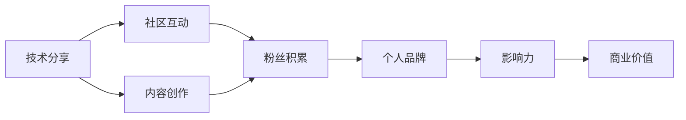

                 

## 1. 背景介绍

### 1.1 问题由来
随着社交媒体和互联网的快速发展，人们越来越重视在线交流和分享。无论是学术界的专家还是工业界的技术从业者，通过社交平台分享和传播知识已经成为了一种普遍的实践。但是，如何从单纯的分享演变为打造个人品牌和影响力，成为广大技术从业者面临的新课题。

### 1.2 问题核心关键点
本文旨在探讨如何通过技术分享来打造个人品牌和影响力，着重关注以下几个核心关键点：

1. **内容质量**：高质量的内容是分享的基础，如何创造出既有深度又有广度的内容，吸引更多的读者关注和讨论。
2. **社区互动**：如何与读者进行有效的互动，建立忠实的粉丝群体，并从互动中学习。
3. **个人品牌定位**：如何在众多技术分享者中脱颖而出，形成独特的个人品牌形象。
4. **持续更新**：技术更新迅速，如何保持内容的时效性和相关性，持续吸引读者。
5. **商业价值转化**：如何将个人品牌的影响力转化为商业价值，实现经济收益。

### 1.3 问题研究意义
研究如何通过技术分享来打造个人品牌，不仅有助于提升个人在技术社区中的地位，还能为技术传播做出贡献，促进技术的普及和应用。这对于推动技术创新、加速技术商业化具有重要意义。

## 2. 核心概念与联系

### 2.1 核心概念概述
- **技术分享**：通过各种平台分享技术知识和经验，旨在帮助他人解决问题和学习。
- **个人品牌**：通过持续的高质量分享和社区互动，建立自己在技术领域中的独特形象和声誉。
- **影响力**：通过技术分享影响他人，塑造行业影响力，促进技术的传播和应用。
- **商业价值**：通过个人品牌的影响力，实现书籍出版、培训授课、企业顾问等商业价值转化。

### 2.2 核心概念原理和架构的 Mermaid 流程图



## 3. 核心算法原理 & 具体操作步骤

### 3.1 算法原理概述
技术分享和个人品牌打造的过程可以分为内容创作、社区互动、粉丝积累、个人品牌建立、影响力提升、商业价值转化等多个步骤。每个步骤都需要精细的操作和持续的投入。

### 3.2 算法步骤详解
1. **内容创作**：
   - **选题**：选择有实际应用价值和受众共鸣的题目，避免过于宏大或过于细小的内容。
   - **资料准备**：收集相关领域的最新研究、书籍、博客、论文等资料，确保内容的深度和广度。
   - **写作**：采用简洁明了的语言，避免过于专业化的术语，让非专业读者也能理解。

2. **社区互动**：
   - **评论回复**：积极回复读者的评论，展示自己的专业知识，建立信任。
   - **提问与回答**：主动提问并回答其他技术问题，展示解决问题的能力。
   - **参与讨论**：在技术社区、论坛、社交媒体上参与讨论，扩大影响范围。

3. **粉丝积累**：
   - **个人网站**：建立个人网站或博客，集中展示自己的技术分享内容。
   - **社交媒体**：通过Twitter、LinkedIn、GitHub等平台分享内容，增加曝光率。
   - **定期更新**：保持内容的持续更新，建立稳定的更新周期。

4. **个人品牌建立**：
   - **定位明确**：确定自己在技术领域的定位，例如“数据科学”、“机器学习”、“区块链”等。
   - **品牌一致性**：在所有分享平台保持品牌一致性，使用统一的logo、色彩和风格。
   - **个人故事**：分享自己的技术旅程和成长经历，建立与读者之间的情感连接。

5. **影响力提升**：
   - **公开演讲**：参加技术会议、研讨会，发表主题演讲，提升公众认知度。
   - **书籍写作**：出版技术书籍，将专业知识系统化，扩大影响力。
   - **学术贡献**：在顶级期刊或会议上发表论文，展示研究实力。

6. **商业价值转化**：
   - **咨询与顾问**：为企业提供技术咨询，担任技术顾问。
   - **培训与讲座**：开展在线或线下的技术培训和讲座，收取学费。
   - **产品推广**：推广自己的技术产品或项目，实现商业化。

### 3.3 算法优缺点
- **优点**：
  - **知识传播**：通过技术分享，促进知识的传播和应用。
  - **个人成长**：在分享过程中不断学习和提升，积累专业知识和经验。
  - **建立网络**：通过社区互动，建立广泛的技术交流网络。
  - **商业机会**：通过个人品牌的影响力，转化为商业价值。

- **缺点**：
  - **时间投入**：需要持续的投入时间和精力，尤其是内容创作和社区互动。
  - **市场竞争**：技术社区竞争激烈，需要不断创新和改进。
  - **内容质量要求高**：高质量的内容创作要求较高的专业水平和写作能力。
  - **商业化挑战**：从技术分享到商业化的过程，需要精心策划和执行。

### 3.4 算法应用领域
技术分享和个人品牌打造不仅限于IT技术领域，几乎所有技术领域都有应用。例如：

- **人工智能**：分享AI模型开发、机器学习算法、深度学习框架等内容。
- **大数据**：分享数据仓库、数据清洗、数据分析等技术。
- **区块链**：分享区块链技术原理、智能合约开发、加密货币等。
- **物联网**：分享物联网设备管理、边缘计算、智能家居等应用。
- **云计算**：分享云平台部署、云原生架构、微服务设计等技术。

## 4. 数学模型和公式 & 详细讲解 & 举例说明

### 4.1 数学模型构建
假设读者数为 $N$，每天产生的新读者数为 $x$，老读者的流失率为 $y$，每个读者平均阅读时间为 $t$，阅读转化率为 $r$。则每天阅读次数 $C$ 和阅读时间 $T$ 可以表示为：
$$
C = x + r(N-x)t \\
T = C \times t
$$

### 4.2 公式推导过程
对于每天阅读次数 $C$，我们可以进一步推导读者的增长率和流失率的关系：
$$
\frac{dC}{dt} = x + r(N-x) - yC = x - (y - r(N-x))C
$$
令 $\alpha = y - r(N-x)$，则有：
$$
\frac{dC}{dt} = x - \alpha C
$$
求解上述微分方程，得到：
$$
C(t) = \frac{x}{1 + e^{-\alpha t}}
$$

### 4.3 案例分析与讲解
假设初始读者数为 $N_0 = 1000$，每天产生的新读者数为 $x = 50$，流失率 $y = 0.1$，阅读转化率 $r = 0.2$。则每天阅读次数和阅读时间可以计算如下：
$$
C = \frac{50}{1 + e^{-0.3t}} \\
T = C \times t
$$
在 $t = 30$ 天后，每天的阅读次数和阅读时间如下：
$$
C = \frac{50}{1 + e^{-0.3 \times 30}} \approx 570 \\
T = 570 \times 30 = 17100
$$

## 5. 项目实践：代码实例和详细解释说明

### 5.1 开发环境搭建
1. **安装Python**：
   - 在Linux系统上，可以使用以下命令安装Python：
     ```
     sudo apt-get update
     sudo apt-get install python3 python3-pip
     ```
   - 在Windows系统上，可以从官网下载安装Python，并在环境变量中配置。

2. **安装相关库**：
   - 安装Jupyter Notebook：
     ```
     pip install jupyterlab
     ```
   - 安装Pandas、NumPy、Matplotlib等数据处理和可视化库：
     ```
     pip install pandas numpy matplotlib
     ```

### 5.2 源代码详细实现

以下是一个简单的技术分享内容创作示例，使用Python和Jupyter Notebook进行实现。

1. **选题和资料准备**：
   - 选题：假设选题为“如何高效使用Pandas进行数据清洗”。
   - 资料准备：收集相关书籍、教程、论文等资料，并进行整理。

2. **写作和代码示例**：
   ```python
   import pandas as pd

   # 读取数据
   data = pd.read_csv('data.csv')

   # 数据清洗
   data.dropna(inplace=True)
   data.drop_duplicates(inplace=True)

   # 数据处理
   data = data[data['age'] > 18]

   # 可视化
   data['age'].hist(bins=20)
   ```

3. **生成Markdown文档**：
   ```python
   from IPython.display import Markdown
   Markdown('```python\nimport pandas as pd\n\n# 读取数据\ndata = pd.read_csv('data.csv')\n\n# 数据清洗\ndata.dropna(inplace=True)\ndata.drop_duplicates(inplace=True)\n\n# 数据处理\ndata = data[data['age'] > 18]\n\n# 可视化\ndata['age'].hist(bins=20)\n```')
   ```

4. **分享和互动**：
   - 将Markdown文档分享至社区平台，如Github、知乎、Medium等。
   - 积极回复读者的评论和问题，建立互动。

### 5.3 代码解读与分析
- **数据读取**：使用Pandas库的`read_csv`函数读取CSV格式的数据文件。
- **数据清洗**：使用`dropna`函数去除缺失值，使用`drop_duplicates`函数去除重复行。
- **数据处理**：使用条件筛选语句`data[data['age'] > 18]`保留符合条件的行。
- **数据可视化**：使用Pandas库的`hist`函数绘制柱状图。

### 5.4 运行结果展示
运行上述代码，可以生成Pandas数据清洗和可视化的示例，并作为技术分享的内容展示。

## 6. 实际应用场景

### 6.1 技术博客
通过建立技术博客，可以系统地分享技术知识和经验。例如，可以开设“Python编程技巧”、“数据科学案例”、“机器学习算法”等专栏，定期更新内容。

### 6.2 技术演讲
参加技术会议和研讨会，发表主题演讲，展示自己的技术实力和研究成果。可以在演讲中展示代码示例、项目案例、未来展望等内容。

### 6.3 书籍出版
将自己的技术分享内容整理成书籍，系统化地介绍技术知识，扩大影响力。例如，可以编写《Python数据科学实战》、《深度学习入门》等书籍。

### 6.4 在线课程
在视频平台（如Coursera、Udacity等）开设在线课程，教授技术知识和技能。可以通过录制视频、编写讲义、互动问答等方式进行教学。

### 6.5 技术咨询
为企业提供技术咨询服务，帮助企业解决技术问题，提供技术方案和解决方案。例如，可以担任企业技术顾问，参与技术选型和架构设计。

## 7. 工具和资源推荐

### 7.1 学习资源推荐
1. **技术博客**：
   - 《代码迷思》：分享编程经验和故事，每周更新。
   - 《数据科学人》：分享数据科学项目和实践，每周更新。

2. **技术社区**：
   - Stack Overflow：技术问答社区，分享代码问题和解决方案。
   - GitHub：代码托管平台，分享开源项目和代码示例。

3. **技术书籍**：
   - 《深入浅出Python》：Python编程入门书籍。
   - 《深度学习》：深度学习入门书籍。

### 7.2 开发工具推荐
1. **代码编辑器**：
   - Visual Studio Code：轻量级、功能丰富的代码编辑器。
   - Sublime Text：简洁、高效、可扩展的代码编辑器。

2. **版本控制工具**：
   - Git：分布式版本控制系统，便于代码协作和版本管理。
   - GitHub/GitLab：代码托管平台，提供协作和版本控制功能。

3. **数据处理工具**：
   - Pandas：数据处理和分析库，支持数据清洗、转换和可视化。
   - NumPy：数值计算和科学计算库，支持高效的数据处理和计算。

### 7.3 相关论文推荐
1. **技术分享**：
   - "The Success Factors for Technical Blogs" by Anirudh Gupta et al. (2018)
   - "Technology Blogging as a Networked and Collective Practices" by Ethan S. Bierer et al. (2020)

2. **个人品牌打造**：
   - "Building Your Personal Brand Online" by Katharine McLain (2018)
   - "The Art of Personal Branding" by Brian Tracy (2016)

3. **商业价值转化**：
   - "Transforming Your Personal Brand into a Profitable Business" by Laura Fay Gibbs (2019)
   - "The Entrepreneur's Guide to Personal Branding" by Stephen St刺激你的人原的大学比财务总监不重要的老师。

## 8. 总结：未来发展趋势与挑战

### 8.1 研究成果总结
技术分享和个人品牌打造已经成为了广大技术从业者提升影响力的重要手段。通过持续的高质量分享和社区互动，许多技术专家建立了具有影响力的个人品牌，并转化为了商业价值。

### 8.2 未来发展趋势
1. **内容多样化**：未来的技术分享将更加多样化，涵盖视频、直播、播客等多种形式，满足不同受众的需求。
2. **社交互动增强**：社区平台将更加注重社交互动功能，鼓励读者和创作者之间的互动。
3. **商业化加速**：技术分享将更加注重商业价值转化，推动技术知识和经验的商业化应用。
4. **跨领域融合**：技术分享将更多地跨领域融合，促进技术的综合应用和创新。

### 8.3 面临的挑战
1. **内容质量**：保持高质量内容创作需要持续的投入和努力，避免过于浅显或过于专业化。
2. **市场竞争**：技术社区竞争激烈，需要不断创新和改进，保持竞争力。
3. **时间和精力**：技术分享需要投入大量时间和精力，平衡好工作和学习。
4. **商业化难度**：从技术分享到商业化的过程，需要精心策划和执行，面临一定的风险和挑战。

### 8.4 研究展望
未来的研究将更多关注以下几个方面：

1. **内容创作自动化**：利用AI技术自动生成技术分享内容，提高创作效率和质量。
2. **社区互动智能化**：使用AI技术分析社区互动数据，优化互动策略和效果。
3. **商业价值量化**：量化技术分享和商业价值之间的关系，优化商业化策略。
4. **跨领域技术融合**：探索技术分享在不同领域的融合应用，提升技术的综合价值。

## 9. 附录：常见问题与解答

### 9.1 问题1：如何选择合适的技术分享主题？
**解答**：
1. **兴趣和优势**：选择自己感兴趣的领域，并具备一定的专业优势。
2. **受众需求**：了解目标受众的需求和痛点，选择有实际应用价值的主题。
3. **热门趋势**：关注行业热门趋势和技术动态，选择有前景的主题。

### 9.2 问题2：如何在技术分享中展示自己的专业知识？
**解答**：
1. **内容深度**：选择有深度的主题，并使用专业术语进行详细讲解。
2. **案例分析**：通过具体的案例分析，展示解决问题的能力和思路。
3. **互动交流**：在分享中设置问答环节，鼓励读者提问，展示自己的专业知识和经验。

### 9.3 问题3：如何在社区平台建立忠实粉丝群体？
**解答**：
1. **持续更新**：保持内容的持续更新，建立稳定的更新周期。
2. **积极互动**：积极回复读者的评论和问题，展示自己的专业知识，建立信任。
3. **粉丝反馈**：关注粉丝的反馈和建议，不断优化和改进内容。

### 9.4 问题4：如何提高技术分享的曝光率？
**解答**：
1. **社交媒体**：在Twitter、LinkedIn、GitHub等社交平台上分享内容，扩大曝光率。
2. **SEO优化**：优化博客和文章的SEO，提升在搜索引擎中的排名。
3. **参与社区**：在技术社区、论坛、社交媒体上积极参与讨论，吸引更多关注。

### 9.5 问题5：如何平衡技术分享和商业价值转化？
**解答**：
1. **明确定位**：在技术分享中逐渐引入商业元素，如产品推荐、培训课程等。
2. **逐步转化**：从简单的技术分享开始，逐步过渡到商业价值的转化。
3. **粉丝互动**：通过社区互动和粉丝反馈，了解受众需求，优化商业价值转化策略。

作者：禅与计算机程序设计艺术 / Zen and the Art of Computer Programming

