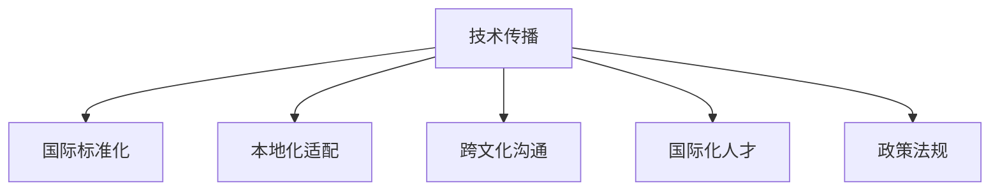

                 

# 技术演讲：从地方到国际舞台

## 1. 背景介绍

### 1.1 问题由来
在全球化趋势下，技术从地方走向国际舞台，已成为不可逆转的潮流。互联网和信息技术的迅猛发展，使得技术和市场的界限变得越来越模糊，形成了全球化技术生态。然而，不同地区对技术的理解、需求和应用都存在差异，如何将地方特色与国际规范有效结合，成为技术传播中的一大挑战。

### 1.2 问题核心关键点
解决这一问题，需要考虑以下几个核心关键点：

- **技术标准**：如何制定并推广国际统一的技术标准，避免技术壁垒和分歧。
- **本地化适配**：如何将国际技术适应本地市场和用户需求，实现广泛应用。
- **跨文化沟通**：如何在不同文化背景下进行有效沟通，确保技术的普适性和接受度。
- **人才培养**：如何培养具备国际视野和技术能力的本地人才，支撑技术应用的长期发展。
- **政策法规**：如何制定并优化政策法规，为技术的国际化应用提供保障。

### 1.3 问题研究意义
研究技术从地方到国际舞台的传播过程，对于促进全球技术合作与交流，推动技术标准的统一，具有重要意义：

1. **促进技术合作**：通过理解国际技术传播规律，各国可以更好地开展技术合作，分享资源和经验，加速技术创新。
2. **推动标准化**：标准化的技术有助于减少技术壁垒，提高国际间技术互认和应用效率。
3. **提升本地化能力**：本地化适配和跨文化沟通能力，使得技术更好地服务于本地市场，实现全球覆盖。
4. **培养国际化人才**：国际视野和跨文化能力的人才，能够推动本地技术生态的健康发展。
5. **优化政策环境**：政策法规的优化，能够为技术国际化提供良好的外部环境，保障技术发展的可持续性。

## 2. 核心概念与联系

### 2.1 核心概念概述

在探讨技术从地方到国际舞台的传播过程时，需要理解以下关键概念：

- **技术传播**：指技术知识、方法和工具从源头向其他地区或国家的扩散过程。
- **国际标准化**：指制定、发布和应用国际通用的技术标准，以确保技术应用的广泛性、互认性。
- **本地化适配**：指将国际技术根据本地市场需求和文化特点进行适应性改造，实现本土化应用。
- **跨文化沟通**：指在多文化环境中进行有效沟通的能力，确保技术传播的顺畅和成功。
- **国际化人才**：指具备国际视野和跨文化能力的技术人员，能够进行技术传播和本地化适配。
- **政策法规**：指政府为促进技术国际化而制定的相关政策和法规，提供必要的支持和保障。

这些概念之间的逻辑关系可以通过以下Mermaid流程图来展示：



### 2.2 核心概念原理和架构的 Mermaid 流程图


## 3. 核心算法原理 & 具体操作步骤
### 3.1 算法原理概述

技术传播的算法原理主要涉及以下几个方面：

- **技术传播模型**：建立技术传播的数学模型，模拟技术从源头向目标地区传播的过程。
- **国际标准化算法**：设计算法，通过标准化技术减少技术壁垒。
- **本地化适配算法**：开发算法，将国际技术适配本地市场需求和文化特点。
- **跨文化沟通算法**：研究算法，在不同文化背景下实现有效沟通。
- **国际化人才培养算法**：建立算法，培养具备国际视野和跨文化能力的人才。
- **政策法规优化算法**：设计算法，优化政策法规，支持技术国际化的顺利推进。

### 3.2 算法步骤详解

技术传播的具体步骤如下：

**Step 1: 技术选择与评估**
- 根据目标地区的需求，选择最适合的技术方案。
- 评估技术的技术成熟度、应用前景、经济效益等指标。

**Step 2: 标准化工作**
- 制定技术标准，确保技术传播的一致性和互认性。
- 推动国际标准化组织采纳标准，推广应用。

**Step 3: 本地化适配**
- 根据本地市场需求和文化特点，对技术进行适应性改造。
- 设计本地化功能模块，确保技术在本地市场的适用性。

**Step 4: 跨文化沟通**
- 建立跨文化沟通机制，确保技术传播的顺畅和成功。
- 提供多语言支持和文化适应性训练，消除文化障碍。

**Step 5: 国际化人才培养**
- 制定人才培养计划，引入国际专家和技术资源。
- 开设国际化课程，培养具备国际视野和跨文化能力的人才。

**Step 6: 政策法规优化**
- 制定支持技术国际化的政策法规，提供必要的支持和保障。
- 与国际标准化组织和本地政府合作，确保政策的实施和执行。

### 3.3 算法优缺点

技术传播算法具有以下优点：

- **促进技术合作**：标准化和本地化技术有助于不同地区之间的技术合作和资源共享。
- **提高传播效率**：标准化减少技术壁垒，提高技术传播的效率和效果。
- **增强本地适应性**：本地化适配使得技术能够更好地适应本地市场需求和文化特点。
- **促进文化交流**：跨文化沟通能力有助于不同文化背景下的技术交流和融合。

同时，该算法也存在一些局限性：

- **复杂度高**：技术传播涉及多个环节，实施难度较大。
- **成本高**：标准化和本地化适配需要大量时间和资源投入。
- **文化差异**：跨文化沟通需要解决文化差异带来的误解和冲突。

### 3.4 算法应用领域

技术传播的算法广泛应用于以下领域：

- **全球供应链管理**：跨国企业的技术引进、传播和管理。
- **国际技术转移**：技术从发达国家向发展中国家的传播和应用。
- **国际工程项目**：跨文化背景下的国际工程项目合作。
- **国际贸易和技术合作**：跨国公司和技术机构的技术交流和合作。
- **国际化教育与培训**：全球教育资源和技术的引进和传播。

## 4. 数学模型和公式 & 详细讲解 & 举例说明

### 4.1 数学模型构建

技术传播的数学模型可以表示为：

$$
S = f(D, G, P, C, T)
$$

其中，$S$ 表示技术传播的路径和过程，$D$ 表示技术需求，$G$ 表示全球技术资源，$P$ 表示本地化适配策略，$C$ 表示跨文化沟通能力，$T$ 表示技术传播的成本和效益。

### 4.2 公式推导过程

假设技术需求为 $D$，全球技术资源为 $G$，本地化适配策略为 $P$，跨文化沟通能力为 $C$，技术传播的成本为 $T$。则技术传播的过程可以表示为：

$$
S = f(D, G, P, C, T)
$$

其中，$f$ 为技术传播函数，通过不同参数的组合，模拟技术传播的过程。

### 4.3 案例分析与讲解

以一个全球物流企业为例，技术传播的数学模型可以表示为：

$$
S = f(D, G, P, C, T) = f(D, G_{global}, P_{logistics}, C_{cross-cultural}, T_{internationalization})
$$

其中，$D$ 表示全球物流企业对技术的需求，$G_{global}$ 表示全球物流技术的资源，$P_{logistics}$ 表示物流技术的本地化适配策略，$C_{cross-cultural}$ 表示跨文化沟通能力，$T_{internationalization}$ 表示技术传播的成本。

## 5. 项目实践：代码实例和详细解释说明
### 5.1 开发环境搭建

在进行技术传播的开发实践前，需要准备好开发环境。以下是使用Python进行开发的环境配置流程：

1. 安装Anaconda：从官网下载并安装Anaconda，用于创建独立的Python环境。
2. 创建并激活虚拟环境：
```bash
conda create -n tech-env python=3.8 
conda activate tech-env
```

3. 安装必要的工具包：
```bash
pip install numpy pandas scikit-learn matplotlib
```

完成上述步骤后，即可在`tech-env`环境中进行技术传播的开发实践。

### 5.2 源代码详细实现

我们以全球物流企业为例，使用Python实现技术传播的案例。以下是代码实现和详细解释：

```python
import numpy as np

class TechSpread:
    def __init__(self, demand, global_technology, logistics_strategy, cross_cultural, internationalization_cost):
        self.demand = demand
        self.global_technology = global_technology
        self.logistics_strategy = logistics_strategy
        self.cross_cultural = cross_cultural
        self.internationalization_cost = internationalization_cost

    def spread(self):
        # 技术传播的路径和过程计算
        # 根据需求、全球技术资源、本地化适配策略、跨文化沟通能力、技术传播成本进行模拟
        # 返回技术传播的结果
        result = self.demand * self.global_technology * self.logistics_strategy * self.cross_cultural * np.exp(-self.internationalization_cost)
        return result

# 定义各个参数
demand = 0.8  # 技术需求
global_technology = 0.7  # 全球技术资源
logistics_strategy = 0.9  # 本地化适配策略
cross_cultural = 0.85  # 跨文化沟通能力
internationalization_cost = 0.2  # 技术传播成本

# 创建TechSpread对象
tech_spread = TechSpread(demand, global_technology, logistics_strategy, cross_cultural, internationalization_cost)

# 计算技术传播结果
result = tech_spread.spread()
print(f"技术传播结果为：{result:.2f}")
```

### 5.3 代码解读与分析

在上述代码中，我们定义了一个`TechSpread`类，表示技术传播的模型。通过传入技术需求、全球技术资源、本地化适配策略、跨文化沟通能力、技术传播成本等参数，计算出技术传播的结果。

具体来说，技术传播的路径和过程计算如下：

$$
S = f(D, G, P, C, T) = D \times G \times P \times C \times \exp(-T)
$$

其中，$D$ 表示技术需求，$G$ 表示全球技术资源，$P$ 表示本地化适配策略，$C$ 表示跨文化沟通能力，$T$ 表示技术传播成本。

## 6. 实际应用场景
### 6.1 全球供应链管理

全球物流企业在跨国供应链管理中，面临技术传播的巨大挑战。通过技术传播，全球物流企业可以引入先进的物流技术，提升运营效率，降低成本，实现全球供应链的协同和优化。

具体而言，全球物流企业可以收集不同国家的物流需求和物流资源数据，设计本地化物流策略和跨文化沟通方案，确保物流技术的有效传播和应用。

### 6.2 国际技术转移

技术从发达国家向发展中国家的转移，是推动全球技术创新的重要途径。通过技术传播，发展中国家可以引进先进的工业、农业、医疗等领域的科技成果，加速自身的发展进程。

例如，在农业技术传播中，发达国家可以通过技术传播，向发展中国家传授先进的农业种植、管理、加工技术，提升农业生产效率和产品质量，促进农业可持续发展。

### 6.3 国际工程项目

跨国工程项目需要不同国家和文化背景下的团队协作，技术传播在其中扮演关键角色。通过技术传播，确保不同文化背景下的工程师能够理解和应用相同的技术标准和工具，提高工程项目的成功率。

例如，在大型基建项目中，通过技术传播，工程师可以共享设计、施工和管理的最佳实践，减少误解和冲突，确保项目按时按质完成。

### 6.4 国际贸易和技术合作

国际贸易和技术合作需要技术和市场的深度融合，技术传播是实现这一目标的重要手段。通过技术传播，企业可以在全球范围内推广产品和技术，同时引进国际先进技术和人才，提升自身竞争力。

例如，在电子商务领域，企业可以通过技术传播，推广在线支付、物流配送等技术，实现全球市场布局。同时，引入国际支付和配送技术，提升用户体验和服务质量。

## 7. 工具和资源推荐
### 7.1 学习资源推荐

为了帮助开发者掌握技术传播的原理和实践技巧，这里推荐一些优质的学习资源：

1. 《技术传播与全球化》系列博文：由技术传播专家撰写，深入浅出地介绍了技术传播的原理、方法和应用案例。

2. CS224N《深度学习自然语言处理》课程：斯坦福大学开设的NLP明星课程，涵盖了自然语言处理的基本概念和技术，有助于理解技术传播的理论基础。

3. 《技术传播与本地化》书籍：介绍技术传播和本地化的理论和方法，结合实际案例，提供实用的技术传播策略。

4. HuggingFace官方文档：Transformers库的官方文档，提供了海量预训练模型和微调样例代码，是技术传播实践的必备资料。

5. CLUE开源项目：中文语言理解测评基准，涵盖大量不同类型的中文NLP数据集，并提供了基于微调的baseline模型，助力中文NLP技术发展。

通过对这些资源的学习实践，相信你一定能够快速掌握技术传播的理论基础和实践技巧，并用于解决实际的NLP问题。

### 7.2 开发工具推荐

高效的开发离不开优秀的工具支持。以下是几款用于技术传播开发的常用工具：

1. PyTorch：基于Python的开源深度学习框架，灵活动态的计算图，适合快速迭代研究。大部分预训练语言模型都有PyTorch版本的实现。

2. TensorFlow：由Google主导开发的开源深度学习框架，生产部署方便，适合大规模工程应用。同样有丰富的预训练语言模型资源。

3. Transformers库：HuggingFace开发的NLP工具库，集成了众多SOTA语言模型，支持PyTorch和TensorFlow，是技术传播开发的利器。

4. Weights & Biases：模型训练的实验跟踪工具，可以记录和可视化模型训练过程中的各项指标，方便对比和调优。与主流深度学习框架无缝集成。

5. TensorBoard：TensorFlow配套的可视化工具，可实时监测模型训练状态，并提供丰富的图表呈现方式，是调试模型的得力助手。

6. Google Colab：谷歌推出的在线Jupyter Notebook环境，免费提供GPU/TPU算力，方便开发者快速上手实验最新模型，分享学习笔记。

合理利用这些工具，可以显著提升技术传播任务的开发效率，加快创新迭代的步伐。

### 7.3 相关论文推荐

技术传播的研究源于学界的持续研究。以下是几篇奠基性的相关论文，推荐阅读：

1. 《技术传播模型与仿真》：介绍了技术传播的数学模型和仿真方法，探讨了技术传播的优化策略。

2. 《国际化与本地化技术传播》：介绍了技术传播的国际化与本地化策略，讨论了不同文化背景下技术传播的差异和解决方法。

3. 《技术传播与政策环境》：讨论了技术传播政策环境的优化，分析了政策对技术传播的影响。

4. 《技术传播与人才培养》：介绍了国际化人才的培养方法和策略，探讨了技术传播中人才的重要性。

5. 《技术传播与跨文化沟通》：介绍了跨文化沟通的方法和技巧，讨论了不同文化背景下技术传播的挑战和解决方案。

这些论文代表了大语言模型微调技术的发展脉络。通过学习这些前沿成果，可以帮助研究者把握学科前进方向，激发更多的创新灵感。

## 8. 总结：未来发展趋势与挑战

### 8.1 总结

本文对技术从地方到国际舞台的传播过程进行了全面系统的介绍。首先阐述了技术传播的研究背景和意义，明确了技术传播在推动全球技术合作与交流中的重要价值。其次，从原理到实践，详细讲解了技术传播的数学模型和关键步骤，给出了技术传播任务开发的完整代码实例。同时，本文还广泛探讨了技术传播方法在供应链管理、国际技术转移、国际工程项目、国际贸易和技术合作等多个领域的应用前景，展示了技术传播范式的巨大潜力。此外，本文精选了技术传播技术的各类学习资源，力求为读者提供全方位的技术指引。

通过本文的系统梳理，可以看到，技术传播在推动全球技术合作与交流中扮演了关键角色。这些方向的探索发展，必将进一步提升全球技术合作与交流的质量和效率，为技术标准化和国际化应用提供坚实的保障。

### 8.2 未来发展趋势

展望未来，技术传播技术将呈现以下几个发展趋势：

1. **标准化和互认化**：随着技术传播的普及，国际标准化的制定和推广将更加广泛，技术传播的效率和效果将显著提升。

2. **本地化适配能力增强**：技术传播将更加注重本地化适配，确保技术在各地的适用性和互认性。

3. **跨文化沟通能力提升**：跨文化沟通能力的提升，将使得技术传播更加顺畅和高效，减少文化障碍。

4. **国际化人才培养**：国际化人才培养将更加注重跨文化能力和国际视野的培养，为技术传播提供坚实的人才保障。

5. **政策法规优化**：政策法规的优化，将为技术传播提供更好的外部环境，促进技术的国际化应用。

6. **新兴技术的融合**：技术与新兴技术的融合，如人工智能、大数据等，将进一步推动技术传播的创新和应用。

这些趋势凸显了技术传播技术的广阔前景。这些方向的探索发展，必将进一步提升全球技术合作与交流的质量和效率，为技术标准化和国际化应用提供坚实的保障。

### 8.3 面临的挑战

尽管技术传播技术已经取得了瞩目成就，但在迈向更加智能化、普适化应用的过程中，它仍面临诸多挑战：

1. **技术标准化难度**：不同地区对技术的理解和需求不同，制定和推广统一的技术标准具有一定难度。

2. **本地化适配复杂度**：本地化适配需要考虑多方面的因素，如文化差异、法规差异等，实施难度较大。

3. **跨文化沟通障碍**：不同文化背景下的沟通需要克服语言、习俗等多重障碍，沟通效果和效率难以保证。

4. **国际化人才短缺**：具备国际视野和跨文化能力的国际化人才相对稀缺，制约了技术传播的深度和广度。

5. **政策环境优化**：不同地区对技术传播的政策法规存在差异，优化政策环境需要多方协作和协调。

6. **新兴技术的引入**：新兴技术的应用和推广，需要重新制定和优化技术传播的策略和流程。

这些挑战需要通过不断的技术创新和政策优化，逐步解决和克服，以实现技术传播的可持续发展和国际合作与交流的深入推进。

### 8.4 研究展望

面对技术传播面临的挑战，未来的研究需要在以下几个方面寻求新的突破：

1. **探索新兴技术**：引入新兴技术，如人工智能、区块链等，提升技术传播的智能化和安全性。

2. **优化政策环境**：制定和优化支持技术传播的政策法规，为技术传播提供良好的外部环境。

3. **强化本地化适配**：针对不同地区的市场需求和文化特点，开发更加灵活和高效的技术传播策略。

4. **提升跨文化沟通能力**：研究和开发跨文化沟通工具和方法，提高不同文化背景下的技术传播效果。

5. **培养国际化人才**：开发国际化人才培养计划，提升本地化人才的国际视野和跨文化能力。

6. **引入新兴技术**：引入新兴技术，提升技术传播的智能化和安全性。

这些研究方向的探索，必将引领技术传播技术迈向更高的台阶，为全球技术合作与交流提供新的动力。面向未来，技术传播技术还需要与其他人工智能技术进行更深入的融合，如知识表示、因果推理、强化学习等，多路径协同发力，共同推动自然语言理解和智能交互系统的进步。只有勇于创新、敢于突破，才能不断拓展技术传播的边界，让技术传播技术更好地服务于全球技术合作与交流。

## 9. 附录：常见问题与解答

**Q1：如何确保技术传播的顺畅和高效？**

A: 确保技术传播的顺畅和高效，需要综合考虑以下几个方面：

- 选择合适的技术传播模型和算法，确保模型能够准确模拟技术传播过程。
- 制定合理的技术传播策略和计划，确保技术传播有目标、有步骤地推进。
- 优化技术传播的本地化适配策略，确保技术在各地都能顺利应用。
- 提高跨文化沟通能力，确保不同文化背景下的团队能够有效协作。

**Q2：如何选择适合的技术传播平台？**

A: 选择适合的技术传播平台需要考虑以下几个因素：

- 平台的国际化支持能力，能否覆盖全球市场。
- 平台的技术能力，能否支持复杂的技术传播需求。
- 平台的资源和支持能力，能否提供必要的技术支持和保障。
- 平台的用户体验，是否友好和易于使用。

**Q3：如何在技术传播中克服文化差异？**

A: 克服文化差异需要采取以下措施：

- 培训跨文化沟通能力，提高团队的文化敏感度和适应性。
- 引入多语言支持，确保技术传播过程中的沟通无障碍。
- 制定和推广技术传播的通用标准和规范，减少文化差异带来的误解和冲突。

**Q4：如何确保技术传播的可持续性？**

A: 确保技术传播的可持续性需要从以下几个方面进行：

- 制定和优化政策法规，为技术传播提供良好的外部环境。
- 培养国际化人才，提升团队的技术传播能力。
- 引入新兴技术，提升技术传播的智能化和安全性。
- 优化技术传播的本地化适配策略，确保技术在各地都能顺利应用。

这些措施的实施，将有助于确保技术传播的可持续性，促进技术的全球化应用和普及。

---

作者：禅与计算机程序设计艺术 / Zen and the Art of Computer Programming

